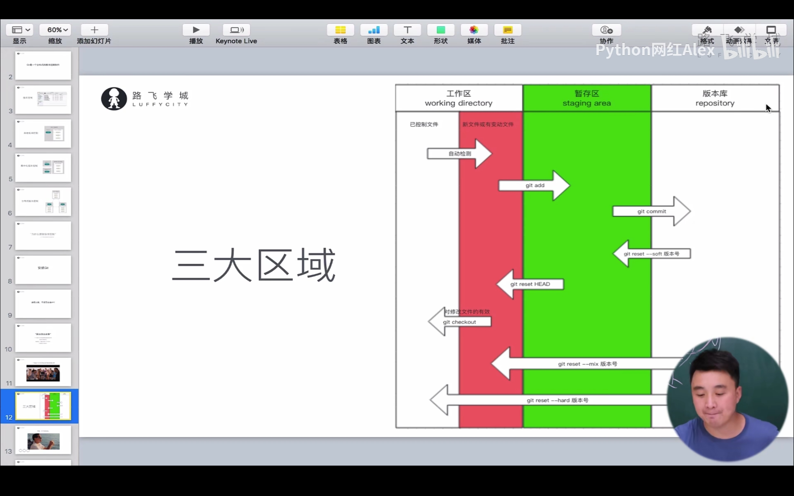
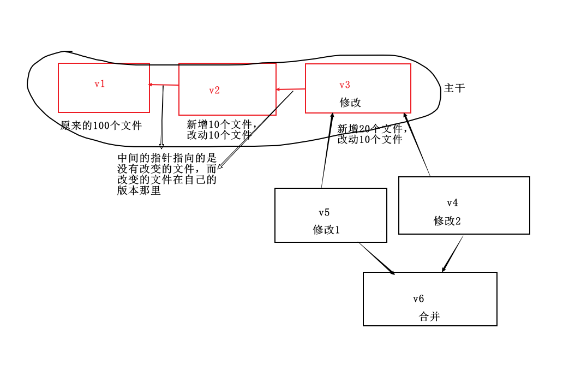

# git

## 做版本控制：管理文件夹

1.   进去要管理的文件夹

2.   初始化 `git init`

3.   管理 个人信息配置：用户名、邮箱 生成版本

     ```python
     # 检测状态
     git status  # 检测当前文件夹下文件状态
     
     # 管理 只要有修改就要git add
     git add 文件名  # 要管理的文件，就能被管理
     
     # 生成版本
     git commit -m "提交信息"
     
     ###########################################
     # 修改文件 保存后 git能够检测到文件修改了
     git satus
     
     # 再管理
     git add .
     
     # 生成版本
     git commit -m "提交信息"
     
     # git log查看版本信息
     git log
     ```

     三种变化：

     -   红色：新增文件，活修改了的老文件
     -   红变绿：git add . 已经管理起来了
     -   git commit -m  生成版本

补充：个人信息配置：`git config --global user.email "邮箱"`

​                   `git config --global user.name "名字"`

git 三大区域：

-   工作区：正在操作的文件夹 - 提交到暂存区(git add .)
    -   已管理的文件
    -   新增/修改
-   暂存区：提交到版本仓库(git commit -m “”)
-   版本仓库

第一阶段：自己写

第二阶段：继续开发

第三阶段：回滚 `git reset --hard 版本值` 版本值通过git log查看

第四阶段：取消回滚用`git reflog` 查看版本号，并且查看自己回滚的那一行的代码去前面的号码 ，使用`git reset --hard 号码`撤销回滚

git命令：

-   初始化git init
-   管理 git add .
-   生成版本 git commit -m “”
-   查看日志 git log
-   查看回滚日志 git reflog
-   回滚 git reset \--hard
-   查看分支 git branch
-   创建分支 git branch dev
-   切换分支 git checkout dev
-   分支合并 git merge dev（注意，如果a分支要合并到b分支：那么需要切换到b分支，再合并 可能产生冲突 需要找到冲突文件并手动修改冲突） 
-   删除分支 git branch -d dev 
-   给远程仓库起别名 git remote add 地址别名 远程仓库地址
-   向远程仓库推送代码 git push -u 地址别名 分支 
-   从远程仓库克隆代码 git clone 远程仓库地址(已经在内部默认实现`git remote add 地址别名 远程仓库地址`) 可以自己切换分支：git checkout 分支名
-   此处是，将远程仓库代码拉下来(适用于已经clone以后的代码) git pull origin dev



## 分支：

**只保留修改的部分！**



如何应用到开发过程中：

第四阶段：

```python
git branch # 查看分支
git branch dev  # 新建分支
git checkout dev  # 切换到dev分支

# 合并bug分支到master
git checkout master
git merge bug

# 删除bug分支
git branch -d bug

#如果修改bug的代码和dev分支上的代码在一行，可能会产生分支冲突。此时需要手动解决冲突。
```

git工作流：建议最开始开发的时候就再新建一个分支——dev分支，以后写代码只在dev分支上写。

GitHub：

1.   注册GitHub账号；

2.   创建一个仓库；

3.   将本地代码推送到远程仓库；

     ```python
     git remote add origin 远程仓库地址（）
     git push -u origin 分支名称
     ```

4.   将代码拉下来;其实是将所有分支都copy下来了

     ```python
     git clone 网址
     ```

5.   注意：要在dev分支上开发的时候，需要将master分支上的代码Merge到dev上，以保持最新的版本。

流程：

-   在家里面上传代码

    ```python
    git remote add origin 网址
    git push -u origin master
    ```

-   到公司新电脑第一次获取代码：

    ```python
    git clone 远程仓库地址
    git checkout 分支
    ```

-   在公司开发：

    ```python
    git checkout dev
    git merge master  # 仅执行一次
    修改代码
    git add .
    git commit -m "xx"
    git push origin dev
    ```

-   下班回家继续写代码

    ```c
    git checkout dev
    git pull origin dev
    
    git add .
    git commit -m "xx"
    git push origin dev
    ```

-   开发完毕，上线：

    ```python
    # 切换到master
    git checkout master
    git merge dev
    git push origin master
    
    # 此时也可将dev分支也提交到远程
    git checkout dev
    git push origin dev
    ```

-   


