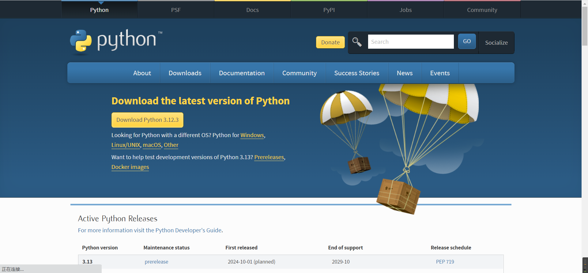

<h1 style="text-align: center;font-size: 40px; font-family: '楷体';">day01-计算机基础和环境搭建</h1>

今日概要

- 计算机基础
- 学习编程的本质
- `Python`介绍
- `Python`环境搭建

# 1 计算机基础

## 1.1 基本概念

- 计算机的组成 -- 建议学习一些计算机组成原理相关的内容
    ```python
    计算机由很多硬件组成 
    	- CPU 硬盘 内存 网卡 显卡 显示器 机箱 电源 ...
    注意事项：
    	- 当把这些硬件组合在一起时，是无法进行协作的 -- 需要OS操作系统
    ```

- 操作系统 `OS`
    ```python
    用于协同计算机的各个硬件，让硬件能够协同操作，已完成某个目标
    常见的OS分类：
    	- windows 优点：生态很牛逼 工具很多 缺点：慢、收费【个人】
        	- xp
            - win 7
            - win 10
            ...
        - linux 优点：资源占用少 速度快 效率高 免费 -- linux做服务器 缺点：生态不是很牛逼 工具少 告别游戏 【企业服务器】
        	- deepin
            - centos
            - ubuntu
            ...
        - mac OS 优点：生态还行，工具不多但都有 用户体验交互非常好  缺点：没法玩游戏 工具不多 将将够用
    ```

- 软件(应用程序)
    ```python
    在安装上OS以后，在电脑上安装常用的软件，例如微信、QQ、杀毒、...
    这些软件应用在OS之上。
    
    问题来了：这些软件是由谁开发的？
    	- 各大公司程序员开发的
    软件：一大堆的代码
    ```

## 1.2 编程语言

软件，是**程序员**使用**编程语言**开发出来的**一大堆代码的集合**。

作文，是**小学生**使用**汉字**写出来的**一大堆文字的集合**。

本质上，学习编程语言就是学习他的语法规则。根据语法去编写相应的软件功能。

- `python`

    ```python
    print("你好，世界。")
    ```

- `Golang`

    ```python
    fmt.Println("你好，世界。")
    ```

## 1.3 编译器和解释器

编译器`/`解释器就是一个翻译官，将代码编译翻译成计算机能够识别的命令。

```python
A使用Python开发了一个软件 1000lines       B使用Golang开发了一个软件2000lines

	      Python解释器                          Golang编译器

                         操  作  系  统 ( OS )
    
                    CPU   硬盘   网卡   内存   电源   ...
```

为什么有的较解释器，有的叫编译器？

- 解释器：实时翻译

    ```python
    拿到1000行代码之后，解释一句，给OS提交一句
    ```

- 编译器：全文翻译

    ```python
    拿到2000行代码时，全部翻译成一个临时文件（计算机能够识别的命令）再把这个文件交给OS去读取
    ```

`Python、PHP、JS、Ruby...` -- 需要解释器运行 -- 一般称解释型语言

`C、C++、Java、Go...`      -- 需要编译器运行 -- 一般称编译型语言

# 2 学习编程的本质

学习编程，本质上是三件事

- 选择一门编程语言，在自己的电脑上安装编程语言的编译器`/`解释器
- 学习编程语言的语法规则，根据语法规则和项目背景设计和开发软件
- 使用编译器或者解释器去运行自己的代码

# 3 `Python`介绍

## 3.1 编程语言的分类

- 翻译的维度

    - 解释型 `Python`、`PHP`
    - 编译型 `C C++`

- 高低的维度

    - 低级编程语言 写出的代码可以直接被计算机识别
        ```python
        机器语言 01000101 01010001 机器码
        汇编语言   MOV      INC 交给计算机去执行
        ```

    - 高级编程语言 写出的代码无法被计算机直接识别 但是可以通过某种方式将其转换为计算机可以识别的代码
        ```python
        Python Java C/C++ PHP Golang  ...  交由相关编译器或者解释器来进行翻译再交给计算机来执行
        ```

注意：现在大家很少用低级的编程语言开发，大多都在用高级编程语言。

## 3.2 `Python`

> `Python`由荷兰国家数学与计算机科学研究中心的吉多·范罗苏姆于`1990`年代初设计，作为一门叫做`ABC`语言的替代品。`Python`提供了高效的高级数据结构，还能简单有效地面向对象编程。`Python`语法和动态类型，以及解释型语言的本质，使它成为多数平台上写脚本和快速开发应用的编程语言，随着版本的不断更新和语言新功能的添加，逐渐被用于独立的、大型项目的开发。

`python`火热的原因

- 语法简洁，适合小白
- 类库强大
- 开发效率高

## 3.3 `python`解释器的种类

- 安装`python`解释器

- 学习`Python`语法

- 写代码

`python`解释器的种类：各大公司都会开发`python`解释器

- `CPython` -- 【主流】 -- 底层是由C语言开发出的`Python`解释器
- `JPython` -- 由 `Java `语言开发出的解释器 方便让`java`和`python`代码做集成
- `IronPython` -- 由`C#`开发
- `RubyPython`
- `PyPy` -- 对`CPython`的优化 -- 效率提高 -- 引入编译器的功能 -- 本质上是将`python`代码编译再去执行编译后的代码
- ...

注意：我们常说的python解释器默认是`CPython`解释器

## 3.4 `CPython `解释器的版本

`CPython `解释器的版本有两个大的版本

- `2.x` -- 目前最新的`2.7.x` 从`2020`后不再更新维护
- `3.x` -- 目前最新的版本是`3.12.x` 本教程是`3.9.0`的教程 `2024`年`4`月`27`日

# 4 `python`环境搭建

- `python`解释器 -- 将程序员编写的`python`代码翻译成计算机能够识别的命令
    - 主流`CPython`
    - 本教程`3.9.0`

## 4.1 安装`python`解释器

### 4.1.1 `MAC`系统

官网: https://www.python.org/

`Downloads `-- `All releases`出现下面的界面,直接点击`Downloads`,下载完成后,直接无脑下一步即可.



`python`安装目录下有一个`bin`目录 -- 可以发现自己的`python3.9`文件 这就是`python`解释器的启动文件.

### 4.1.2 `windows`系统

这部分可以去网上搜,和MAC系统的如出一辙.

### 4.1.3 `Linux`系统

这部分可以去网上搜,和MAC系统的如出一辙.

### 4.1.4 系统和环境变量

假设你有三十个`python`文件,如果都要运行,我们就要在终端写三十个运行代码的命令 -- 如果把python解释器的路径加到环境变量里面,那么就不用写一长串的破`python`解释器路径,只需要在终端`>>> python.exe 文件名.py`即可.

注意:添加环境变量的时候,最后一个文件夹是`bin`就行了.

## 4.2 安装`pycharm`集成开发环境

提高开发效率 + 运行`python`代码

下载:https://www.jetbrains.com/pycharm/download/?section=windows

安装可以去搜教程,这里不再赘述.

# 作业

1. 简述硬件/`OS`/软件之间的关系
2. 列举常见的`OS`
3. 简述编译器和解释器的区别和作用
4. 编程语言分类
5. `python`解释器种类
6. `CPython`版本有哪些?现在你用的是哪个版本?
7. 系统环境变量的作用是什么?
8. `python`和`pycharm`的区别 


