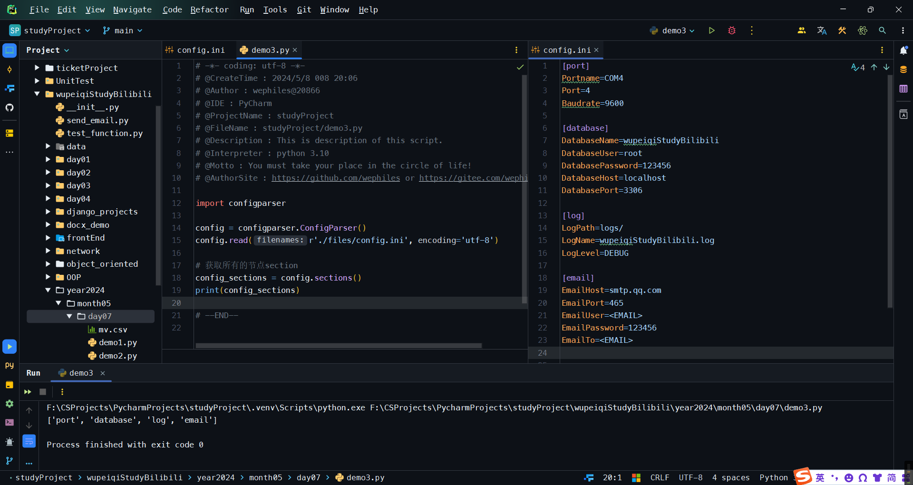
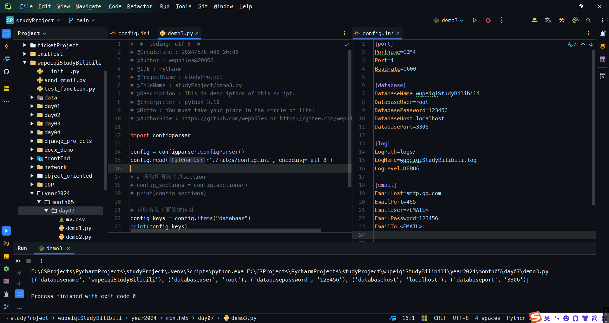
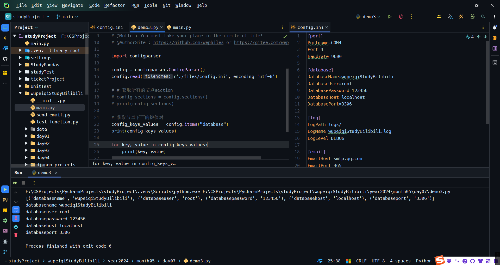
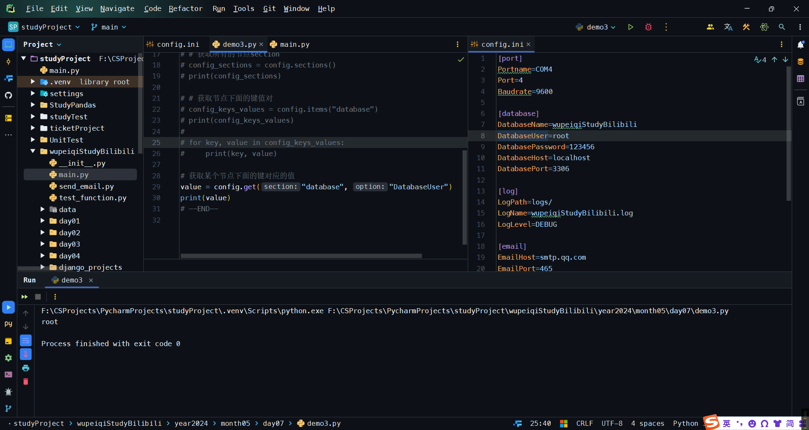
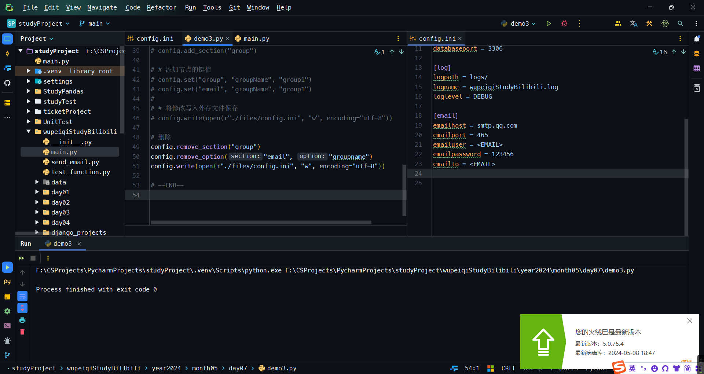

<h1 style="text-align: center;font-size: 40px; font-family: '楷体';">day04-Python操作ini文件</h1>

# `ini`文件

`*.ini`文件是`Initialization file`的缩写，即为初始化文件，是`Windows`系统配置文件所采用的存储格式，统管`Windows`的各项配置，一般用户就用`Windows`提供的各项图形化管理界面就可以实现相同的配置了。

例子如下：

```ini
[port] 
Portname=COM4
Port=4
```

这种格式可以直接使用open读出来，但是自己处理比较麻烦，所以Python为我们提供了更为方便的工具。

- 读取所有节点
    ```python
    import configparser
    
    config = configparser.ConfigParser()
    config.read(r'./files/config.ini', encoding='utf-8')
    
    # 获取所有的节点section
    config_sections = config.sections()
    print(config_sections)
    ```
    
    

- 获取节点下面的所有键值
    ```python
    import configparser
    
    config = configparser.ConfigParser()
    config.read(r'./files/config.ini', encoding='utf-8')
    
    # # 获取所有的节点section
    # config_sections = config.sections()
    # print(config_sections)
    
    # 获取节点下面的键值对
    config_keys = config.items("database")
    print(config_keys)
    ```

    

    ```python
    import configparser
    
    config = configparser.ConfigParser()
    config.read(r'./files/config.ini', encoding='utf-8')
    
    # # 获取所有的节点section
    # config_sections = config.sections()
    # print(config_sections)
    
    # 获取节点下面的键值对
    config_keys_values = config.items("database")
    print(config_keys_values)
    
    for key, value in config_keys_values:
        print(key, value)
    ```

    

- 获取某个节点下面的键对应的值
    ```python
    import configparser
    
    config = configparser.ConfigParser()
    config.read(r'./files/config.ini', encoding='utf-8')
    
    # # 获取所有的节点section
    # config_sections = config.sections()
    # print(config_sections)
    
    # # 获取节点下面的键值对
    # config_keys_values = config.items("database")
    # print(config_keys_values)
    #
    # for key, value in config_keys_values:
    #     print(key, value)
    
    # 获取某个节点下面的键对应的值
    value = config.get("database", "DatabaseUser")
    print(value)
    ```

    

- 其他功能
    ```python
    import configparser
    
    config = configparser.ConfigParser()
    config.read(r'./files/config.ini', encoding='utf-8')
    
    # # 获取所有的节点section
    # config_sections = config.sections()
    # print(config_sections)
    
    # # 获取节点下面的键值对
    # config_keys_values = config.items("database")
    # print(config_keys_values)
    #
    # for key, value in config_keys_values:
    #     print(key, value)
    
    # # 获取某个节点下面的键对应的值
    # value = config.get("database", "DatabaseUser")
    # print(value)
    
    # 其他功能
    
    # # 判断一个节点是否存在
    # res = config.has_section("port")
    # print(res)
    
    # # 添加一个节点
    # config.add_section("group")
    
    # # 添加节点的键值
    # config.set("group", "groupName", "group1")
    # config.set("email", "groupName", "group1")
    #
    # # 将修改写入外存文件保存
    # config.write(open(r"./files/config.ini", "w", encoding="utf-8"))
    
    # 删除
    config.remove_section("group")
    config.remove_option("email", "groupname")
    config.write(open(r"./files/config.ini", "w", encoding="utf-8"))
    ```

    


