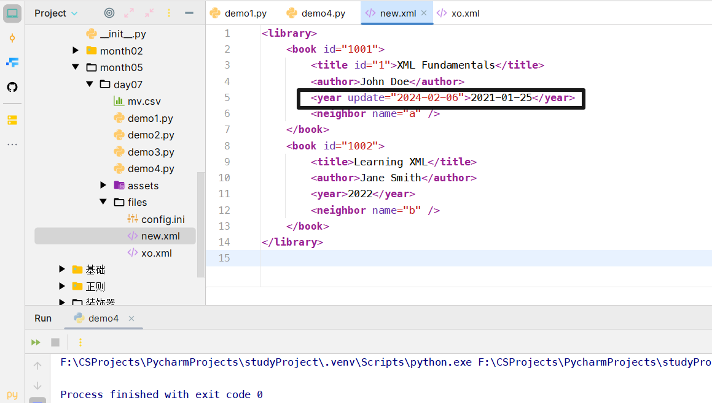

<h1 style="text-align: center;font-size: 40px; font-family: '楷体';">day05-Python操作xml文件</h1>

# `xml`文件

`XML`（`eXtensible Markup Language`）是一种标记语言，它被设计用来存储和传输数据。`XML `与 `HTML`（`HyperText Markup Language`）相似，但与 `HTML `不同，`HTML `是一种预定义的标签集，用于创建网页，而 `XML `允许用户定义自己的标签。

`XML `文件通常具有 `.xml` 扩展名，它们由元素（`elements`）组成，这些元素可以包含属性（`attributes`）和数据（`data`）。`XML `元素是分层的，可以包含其他元素，形成一个树状结构。

`XML `的主要特点包括：

1. **可扩展性**：用户可以定义自己的标签来描述数据。
2. **自描述性**：`XML `数据结构清晰，易于理解。
3. **平台独立性**：`XML `文件可以在任何操作系统上使用，不需要特定的软件来读取。
4. **数据和表现分离**：`XML `专注于数据的结构和存储，而不是数据的显示方式。
5. **广泛支持**：大多数现代编程语言和软件应用程序都支持 `XML`。

`XML `在许多领域都有应用，包括：

- 数据存储和交换
- 配置文件
- `Web `服务
- 数据的序列化和反序列化

```xml
<?xml version="1.0" encoding="UTF-8"?>
<library>
    <book id="1">
        <title>XML Fundamentals</title>
        <author>John Doe</author>
        <year>2021</year>
    </book>
    <book id="2">
        <title>Learning XML</title>
        <author>Jane Smith</author>
        <year>2022</year>
    </book>
</library>
```

在这个例子中，`<library>` 是根元素，它包含了多个 `<book>` 元素，每个 `<book>` 元素都有 `id` 属性和三个子元素：`<title>`、`<author>` 和 `<year>`。

# 1 读取文件和内容

文件读取

```python
from xml.etree import ElementTree as ET


tree = ET.parse(r"./files/xo.xml")

# 获取根节点
root = tree.getroot()
print(root)  # <Element 'library' at 0x00000230F909D530>
```

如果是网络获取：

```python
from xml.etree import ElementTree as ET
content = """
<library>
    <book id="1">
        <title>XML Fundamentals</title>
        <author>John Doe</author>
        <year>2021</year>
    </book>
    <book id="2">
        <title>Learning XML</title>
        <author>Jane Smith</author>
        <year>2022</year>
    </book>
</library>
"""
root = ET.XML(content)
print(root)  # <Element 'library' at 0x000001757FC06160>
```

# 2 读取节点数据

```python
from xml.etree import ElementTree as ET

content = """
<library>
    <book id="1">
        <title>XML Fundamentals</title>
        <author>John Doe</author>
        <year>2021</year>
        <neighbor name="a"/>
    </book>
    <book id="2">
        <title>Learning XML</title>
        <author>Jane Smith</author>
        <year>2022</year>
        <neighbor name="b"/>
    </book>
</library>
"""

# 获取根标签
root = ET.XML(content)
print(root)
print(root.tag)

# 获取根标签的孩子标签
for child in root:
    # # 获取标签名
    # child_tag = child.tag
    # child_attrib = child.attrib
    # print(child_tag, child_attrib)
    for node in child:
        print(node.tag, node.attrib, node.text)
```


```python
from xml.etree import ElementTree as ET

content = """
<library>
    <book id="1001">
        <title id="1">XML Fundamentals</title>
        <author>John Doe</author>
        <year>2021</year>
        <neighbor name="a"/>
    </book>
    <book id="1002">
        <title>Learning XML</title>
        <author>Jane Smith</author>
        <year>2022</year>
        <neighbor name="b"/>
    </book>
</library>
"""

# 获取根标签
root = ET.XML(content)
# print(root)
# print(root.tag)
#
# # 获取根标签的孩子标签
# for child in root:
#     # # 获取标签名
#     # child_tag = child.tag
#     # child_attrib = child.attrib
#     # print(child_tag, child_attrib)
#     for node in child:
#         print(node.tag, node.attrib, node.text)

book_obj = root.find("book")
print(book_obj.tag, book_obj.attrib)  # book {'id': '1'}
title_obj = book_obj.find("title")
print(title_obj.tag, title_obj.attrib, title_obj.text)
```


```python
root = ET.XML(content)
for child in root.iter("year"):
    print(child.tag, child.text)
```


# 3 修改、删除

```python
root = ET.XML(content)
year_obj = root.find("book").find("year")
year_obj.text = "2021-01-25"  # 修改 只能是字符串类型
year_obj.set("update", '2024-02-06')  # 添加属性

# 写入文件保存
tree = ET.ElementTree(root)
tree.write("./files/new.xml", encoding="utf-8")
```



```python
# 删除节点
root.remove(root.find("book"))
```

# 4 构建文档

```python
from xml.etree import ElementTree as ET

# 创建根标签
root = ET.Element("home")

# 创建节点大儿子
son1 = ET.Element("son", attrib={"name": "son1"})

# 创建小儿子
son2 = ET.Element("son", attrib={"name": "son2"})

# 大儿子中创建两个孙子
grandson1 = ET.Element("grandson1", attrib={"name": "grandson1"})
grandson2 = ET.Element("grandson2", attrib={"name": "grandson2"})
son1.append(grandson1)
son1.append(grandson2)

# 把大小儿子添加到根节点中
root.append(son1)
root.append(son2)

tree = ET.ElementTree(root)
tree.write("./files/son.xml", encoding="utf-8", xml_declaration=True)
```

```python
# 下面这个方法和上面那个方法效果一样
from xml.etree import ElementTree as ET

# 创建根标签 
root = ET.Element("family")

son1 = root.makeelement("son1", {"name": "son1"})
son2 = root.makeelement("son2", {"name": "son2"})

root.append(son1)
root.append(son2)

tree = ET.ElementTree(root)
tree.write("./files/son1.xml", encoding="utf-8", xml_declaration=True)
```

```python
from xml.etree import ElementTree as ET

# 创建根标签
root = ET.Element("family")

son1 = ET.SubElement(root, "son1", {"name": "son1"})

grandson = ET.SubElement(son1, "grandson", {"name": "grandson"})

tree = ET.ElementTree(root)
tree.write("./files/son2.xml", encoding="utf-8", xml_declaration=True)
```


