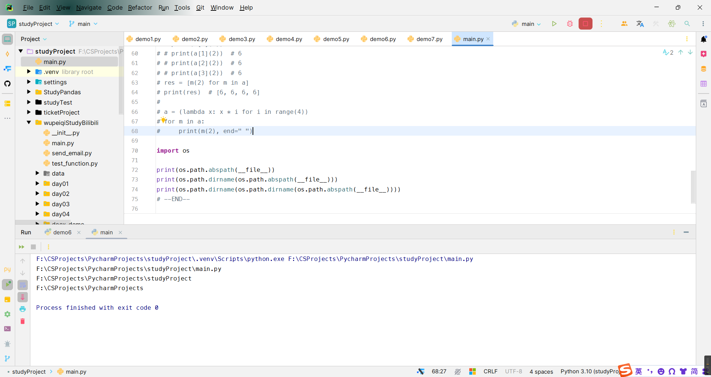

<h1 style="text-align: center;font-size: 40px; font-family: '楷体';">day06-函数的嵌套、装饰器</h1>

# 1 函数的嵌套

防止在合并两个人写的不同代码的时候出现函数重名的现象(同一作用域函数重名：一个函数会将另外一个函数覆盖)

```python
def handler():
    ...
    def func():
        pass
    ...
```

# 2 闭包

## 2.1 初识

闭包，简而言之，就是将数据封装在一个包（区域）中，使用时去里面取，闭包基于函数嵌套。

- 防止污染全局
  ```python
  def func(age):
      name = "computer"
      def f1():
          print(name, age)
      def f2():
          print(name, age)
      def f3():
          print(name, age)
  f1()
  f2()
  f3()
  func(123)
  ```

- 封装数据到一个包里，使用时再取
  ```python
  def task(arg):
      def inner():
          print(arg)
      return inner
  
  v1 = task(11)
  v2 = task(21)
  v3 = task(13)
  
  v1()
  v2()
  v3()
  ```

  ```python
  def task(arg):
      def inner():
          print(arg)
      return inner
  
  inner_func_list = []
  for item in [11, 22, 33]:
      inner_func_list.append(task(item))
  
  inner_func_list[0]()
  inner_func_list[1]()
  inner_func_list[2]()
  ```


## 2.2 实战

基于多线程去下载视频。

```python
"""
下载三个视频
"""
import requests
from concurrent.futures.thread import ThreadPoolExecutor

video_list = [
    ("video1.mp4",
     r"https://v5-hl-hw-cn-coldy.douyinvod.com/b2c0bb253a0040fd060a6017436554f1/6652e1f8/video/tos/cn/tos-cn-ve-15/ce00e2ed68f14214ac12ed395afa5c0e/?a=1128&ch=0&cr=0&dr=0&lr=aweme_search_suffix&cd=0%7C0%7C0%7C0&cv=1&br=1644&bt=1644&cs=0&ds=3&ft=rVQ6egwwZRd0shPo1PDS6kFgAX1tG1f3Af9eFQ0NrsO12nzXT&mime_type=video_mp4&qs=0&rc=OjRnO2VnaGZnaTc6Zzg3NUBpanI4b2t5M2ZweTMzOmkzM0BhYmExMzAvNTQxXl8vNF5iYSNsMGw0YGRiXl9fLS0yLTBzcw%3D%3D&btag=c0010e00098000&cquery=100y&dy_q=1716704199&l=20240526141639B0059BA42C78201CF896"),
    ("video2.mp4",
     r"https://v3-web.douyinvod.com/26c5e6d7ef8c02536a511f6a2a921f40/6652e336/video/tos/cn/tos-cn-ve-15c001-alinc2/ooeLDmtyD163Ae001QNIEgAgQxmCBnnBAE7b9a/?a=6383&ch=5&cr=3&dr=0&lr=all&cd=0%7C0%7C0%7C3&cv=1&br=1881&bt=1881&cs=0&ds=4&ft=rVWEerwwZRd0shPo1PDS6kFgAX1tGNJ3Af9eFQ0NrsO12nzXT&mime_type=video_mp4&qs=0&rc=NmY1ZTMzOzQ5NTs6NDo7OEBpanR1bzM6ZnZxcjMzNGkzM0AzMC0wYjQvNmMxXmMuNjRgYSNnXmtwcjRfLjJgLS1kLWFzcw%3D%3D&btag=c0000e00028000&cquery=100z_100a_101s_100B_100x&dy_q=1716704385&feature_id=46a7bb47b4fd1280f3d3825bf2b29388&l=2024052614194357D53474622B8046DD2E"),
    ("video3.mp4",
     r"https://v3-web.douyinvod.com/26c5e6d7ef8c02536a511f6a2a921f40/6652e336/video/tos/cn/tos-cn-ve-15c001-alinc2/ooeLDmtyD163Ae001QNIEgAgQxmCBnnBAE7b9a/?a=6383&ch=5&cr=3&dr=0&lr=all&cd=0%7C0%7C0%7C3&cv=1&br=1881&bt=1881&cs=0&ds=4&ft=rVWEerwwZRd0shPo1PDS6kFgAX1tGNJ3Af9eFQ0NrsO12nzXT&mime_type=video_mp4&qs=0&rc=NmY1ZTMzOzQ5NTs6NDo7OEBpanR1bzM6ZnZxcjMzNGkzM0AzMC0wYjQvNmMxXmMuNjRgYSNnXmtwcjRfLjJgLS1kLWFzcw%3D%3D&btag=c0000e00028000&cquery=100z_100a_101s_100B_100x&dy_q=1716704385&feature_id=46a7bb47b4fd1280f3d3825bf2b29388&l=2024052614194357D53474622B8046DD2E")
]


# 多线程并行下载
def task(url):
    res = requests.get(url=url,
                       headers={
                           "User-Agent": "Mozilla/5.0 (Windows NT 10.0; Win64; x64) AppleWebKit/537.36 (KHTML, like Gecko) Chrome/99.0.4844.84 Safari/537.36 HBPC/12.1.3.306"
                       }
                       )
    return res.content


# 下载完成之后 Python多线程内部会执行的函数
def outer(file_name):
    def done(arg):
        """

        Args:
            arg (): 规定必须要有 下载完成后返回的那个值

        Returns:

        """
        # 视频内容
        content = arg.result()
        with open(file_name, "wb") as fp:
            fp.write(content)

    return done


# 线程池
POOL = ThreadPoolExecutor(max_workers=10)
for item in video_list:
    # 去线程池取一个人 让这个人帮我们执行task函数  函数内部定义下载逻辑
    future_obj = POOL.submit(task, url=item[1])
    # 当执行完task函数之后（下载完成）自动执行一个done函数
    future_obj.add_done_callback(outer(item[0]))
    print(item)
```

# 3 装饰器

现在给你一个函数，在不修改原函数的前提下，实现在函数执行前和执行后输出`before` 和 `after`

```python
def func():
    print("i am func function")
    value = (1, 2, 3, 4)
    return value

res = func()
print(res)
```

```python
def func():
    print("i am func function")
    value = (1, 2, 3, 4)
    return value


def outer(origin):
    def inner():
        print("before")
        result = origin()
        print("after")
        return result
    return inner


func = outer(func)
res = func()
print(res)
```

```python
"""
python中有一种特殊语法，如果你在某一个函数上方使用了

@函数名
def func():
    pass
    
在内部，会自动执行 函数名(func)，再将结果赋值给func 
相当于执行了：func = 函数名(func)
"""


def outer(origin):
    def inner():
        print("before")
        result = origin()
        print("after")
        return result

    return inner


@outer
def func():
    print("i am func function")
    value = (1, 2, 3, 4)
    return value


# func = outer(func)
res = func()
print(res)
```

```python
def outer(origin):
    def inner():
        print("before")
        result = origin()
        print("after")
        return result

    return inner


@outer
def func():
    print("i am func function")
    value = (1, 2, 3, 4)
    return value


@outer
def func1():
    print("i am func1 function")
    value = (11, 12, 13, 14)
    return value


@outer
def func2():
    print("i am func2 function")
    value = (21, 22, 23, 24)
    return value


# func = outer(func)

print(func())
print(func1())
print(func2())
```

```python
def outer(origin):
    def inner(*args, **kwargs):
        print("before")
        # 定义函数的时候可以*args, **kwargs，执行函数的时候也可以*args, **kwargs
        result = origin(*args, **kwargs)
        print("after")
        return result

    return inner


@outer
def func(a):
    print("i am func function")
    value = (1, 2, 3, 4)
    return value


@outer
def func1(a1, a2):
    print("i am func1 function")
    value = (11, 12, 13, 14)
    return value


@outer
def func2(a):
    print("i am func2 function")
    value = (21, 22, 23, 24)
    return value


# func = outer(func)

print(func(1))
print(func1(1, 2))
print(func2(2))
```

其中，我们代码中`@outer`这种写法就是装饰器，

- 实现原理：基于 `@` 语法和函数闭包，将原函数封装到闭包中，然后将函数值赋值为一个新的函数(内层函数)，函数执行时再在内层函数中执行闭包中的原函数.

- 实现效果:可以在不改变函数内部代码和调用方式的前提下,实现函数执行和函数执行的扩展功能.

- 示例:上面好多的啦!但是有个模板:
  ```python
  def puter(origin):
      def inner(*args, **kwargs):
          res = origin(*args, **kwargs)
          return res
      return inner
  ```

## 3.1 伪应用场景

```python
from flask import Flask

app = Flask(__name__)


def index():
    return "首页"


def info():
    return "详情"


def order():
    return "排名"


def login():
    return "登录"


app.add_url_rule("/index/", view_func=index)
app.add_url_rule("/info/", view_func=info)
app.add_url_rule("/order/", view_func=order)
app.add_url_rule("/login/", view_func=login)


if __name__ == '__main__':
    app.run()
```

```python
from flask import Flask

app = Flask(__name__)


def auth(func):
    def inner(*args, **kwargs):
        # 判断用户是否登录 如果已登录，那么继续往下走  如果没有登录那么就回到登录页面
        # 这里是伪代码 后续学网络的时候会讲到
        res = func(*args, **kwargs)
        return res

    return inner

@auth
def index():
    return "首页"

@auth
def info():
    return "详情"

@auth
def order():
    return "排名"


def login():
    return "登录"


app.add_url_rule("/index/", view_func=index)
app.add_url_rule("/info/", view_func=info)
app.add_url_rule("/order/", view_func=order)
app.add_url_rule("/login/", view_func=login)

if __name__ == '__main__':
    app.run()
```

## 3.2 重要补充 - `funtools`

```python
# 有时候会出现小bug
def auth(func):
    def inner(*args, **kwargs):
        res = func(*args, **kwargs)
        return res

    return inner


def admin():
    """
    这是admin函数。
    Returns:
        这是返回数据的注释
    """
    print(123)


def test():
    print("456")


# 执行: 函数名 + ()
admin()
# print(admin.__name__)   # 输出这个函数的名称(字符串形式) admin
# print(admin.__doc__)   # 输出这个函数的注释(字符串形式)
```

```python
# 有时候会出现小bug
def auth(func):
    def inner(*args, **kwargs):
        """
        inner函数
        Args:
            *args ():
            **kwargs ():

        Returns:
            返回值
        """
        res = func(*args, **kwargs)
        return res

    return inner


@auth
def admin():
    """
    这是admin函数。
    Returns:
        这是返回数据的注释
    """
    print(123)


@auth
def test():
    print("456")


# 执行: 函数名 + ()
admin()
print(admin.__name__)  # 输出这个函数的名称(字符串形式) inner 小bug就在这个地方 我们希望输出admin
print(admin.__doc__)  # 输出这个函数的注释(字符串形式) 这个时候是inner的注释

test()
print(test.__name__)  # 输出这个函数的名称(字符串形式) inner 小bug就在这个地方 我们希望输出test
print(test.__doc__)  # 这个时候是inner的注释
```

导入`funtools`进行修改，修改后：

```python
import functools


# 有时候会出现小bug
def auth(func):
    @functools.wraps(func)  # inner.__name__, inner.__doc__ = func.__name__, func.__doc__
    def inner(*args, **kwargs):
        """
        inner函数
        Args:
            *args ():
            **kwargs ():

        Returns:
            返回值
        """
        res = func(*args, **kwargs)
        return res

    return inner


@auth
def admin():
    """
    这是admin函数。
    Returns:
        这是返回数据的注释
    """
    print(123)


@auth
def test():
    print("456")


# 执行: 函数名 + ()
admin()
print(admin.__name__)  # 输出这个函数的名称(字符串形式) admin
print(admin.__doc__)  # 输出这个函数的注释(字符串形式) 这个时候是admin的注释

test()
print(test.__name__)  # 输出这个函数的名称(字符串形式) test
print(test.__doc__)  # test的注释
```

## 3.1 装饰器最终模板

```python
import functools


def auth(func):
    @functools.wraps(func)
    def inner(*args, **kwargs):
        ...
        res = func(*args, **kwargs)
        ...
        return res
    return inner
```

# 4 补充一个小知识点

```python
# 下面这个叫列表推导式
a = [lambda x: x * i for i in range(4)]
res = [m(2) for m in a]
print(res)  # [6, 6, 6, 6]


# 下面这个叫生成器 要用的时候才生成
a = (lambda x: x * i for i in range(4))
for m in a:
    print(m(2), end=" ")
```

此外，要找到我们运行的脚本文件的绝对路径：

```python
import os

print(os.path.abspath(__file__))
```

要找到我们当前脚本文件所在的文件夹：z`

```python
print(os.path.dirname(os.path.abspath(__file__)))
```


要找到当前目录所在的目录：

```python
print(os.path.dirname(os.path.dirname(os.path.abspath(__file__))))
```



这样就可以逐级向上找了。

另外：

`import xxx`: 导入模块(`.py`文件)和包(就是文件夹)

当导入包的时候，会自动执行里面的`__init__.py`文件

`from xxxx import xxx`: 可以导入到模块里面的成员级别 也可以导入到模块、包级别

## 4.1 相对导入和主文件

```python
from . import xxx
from ..xxxxx import xxxx
```

注意：

- 上面这种相对导入只能用在包里面，但是不能用在项目根目录里面。
- 并且如果你想要让这种导入生效，你==**不能直接运行存在上面这种语法的`python`脚本文件**==，而是应该运行外部的脚本文件。因为：相对导入应当使用在包（由多个或多目录层级`*·py` 模块组成）内模块中的`import`语句，用于内部模块功能之间的相互调用，而包内模块及功能则应当通过包外脚本调用。简单来说，相对导入是存在于包结构中，并在模块中使用的概念，而**由`Python`解释器执行的程序是脚本文件，不应该存在相对导入**;更进一步地说，

当一个文件被解释器**运行**时，它的`__name__ == "__main__"`

当一个文件被导入的时候，那么`__name__ == "文件名"`


