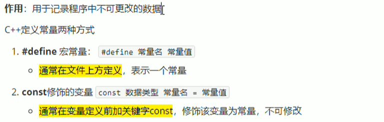
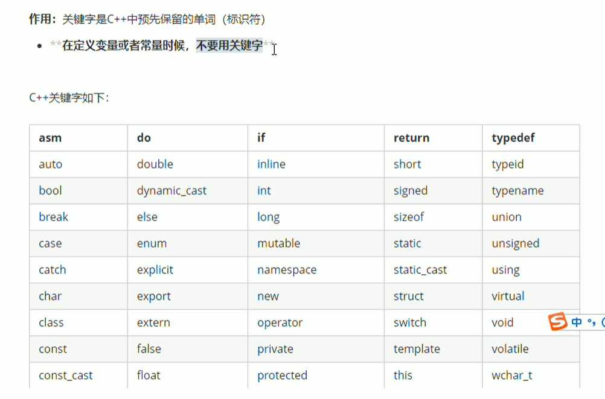
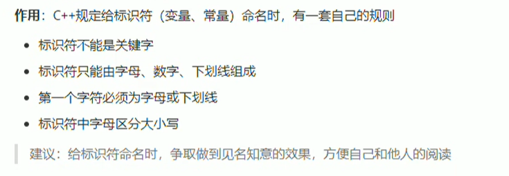
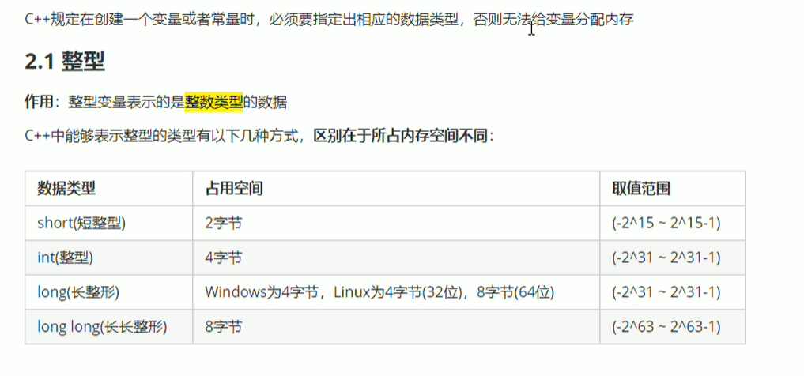
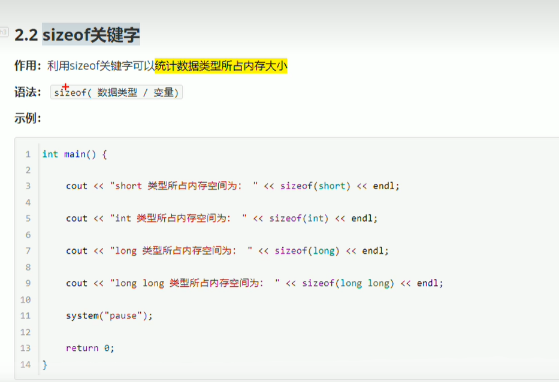

<h1 style="text-align: center; font-family: 'Menlo'">01.C++基础</h1>

[TOC]

# 1 C++基础

## 1.1 变量


存在的意义：方便我们管理内存空间。

```c++
#include <iostream>

using namespace std;

int main(void) {
	// 创建变量 ： 数据类型 变量名 = 变量初始值；

	int a = 10;
	cout << "a = " << a << endl;
	return 0;
}

```



```c++
#include <iostream>
using namespace std;

//constexpr auto pi = 3.15159;
// 宏常量 一般定义在文件上方
#define Pi 3.14159

int main(void) {
	/*
	* 定义常量的两种方式
	*	第一种：#define 常量名 常量值 -- 通常在文件上方定义，表示一个常量
	*	第二种：const修饰的变量 const 数据类型 常量名 = 常量值 -- 通常在变量定义前加关键字const 修饰该变量为常量，不可修改
	*/

	//Pi = 3.1415926;  // 这儿报错 通过不了编译 常量不可修改
	const int Day = 7;
	//Day = 10;  // 这儿报错 通过不了编译 常量不可修改
	cout << Day << endl;
	cout << Pi << endl;
	return 0;
}

```

## 1.2 关键字



## 1.3 标识符



## 1.4 数据类型


### 1.4.1 整型



### 1.4.2 `sizeof`关键字




