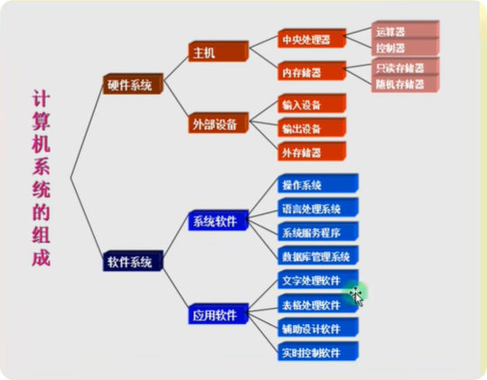
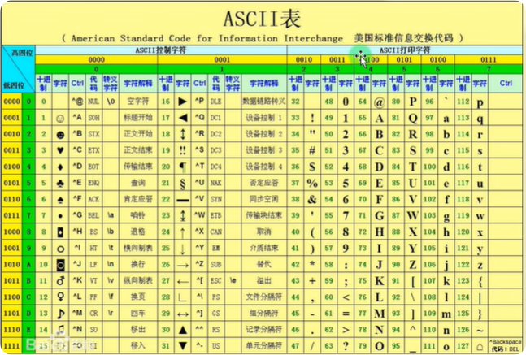
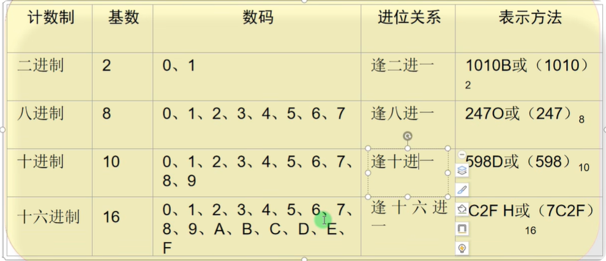
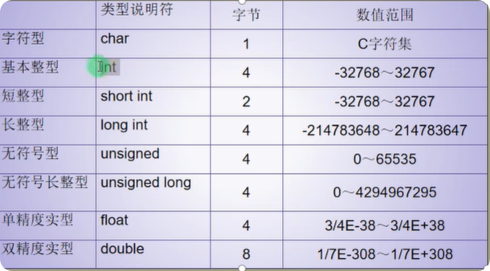
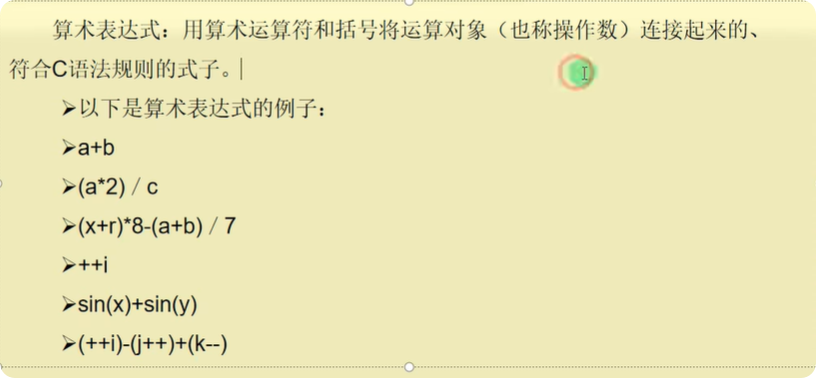

<h1 style="font-family: '楷体'; text-align: center; font-size: 50px;"> C语言基础 </h1>

[TOC]

# 1 C 语言设计入门

## 1.1 什么是C语言

### 1.1.1 软件

一系列按照特定顺序组织的计算机数据和指令的集合。

### 1.1.2 常见的软件

系统软件：

`DOS` `windows` `Linux` `IOS` `ANdroid` `HarmonyOS`等

应用软件：

微信 `QQ`等

### 1.1.3 什么是开发

制作软件

## 1.2 计算机系统组成



## 1.3 ASCII码



## 1.4 数制及其转换

二进制：`B`(`binary`)

八进制：`O`(`Octonary`)

十进制：`D`(`Decimal`)

十六进制：`H`(`Hexadecimal`)



## 1.5 指令

指令是对计算机进行程序控制的最小单位，指令的集合称为指令系统

## 1.6 编译器

类似于翻译官，翻译高级语言程序为机器可执行的指令。

## 1.7 C语言特点

- 代码量小
- 执行速度快
- 功能强大
- 编程自由
- 编写代码周期长
- 可移植性差
- 过于自由，经验不足容易出错
- 对平台库依赖比较多

## 1.8 第一个C语言程序

```C
// #include 预处理器命令

// 单行注释
/* 单行注释 */

/*
 * 多行注释
 * */

// 按ctrl + F5执行程序、编译程序
#include <stdio.h>

int main(void){
    printf("Hello, World!");  // 用于格式化输出在屏幕上
    printf("你好，世界！");  // 用于格式化输出在屏幕上
    return 0;  // 用于退出程序
}
```

#  2 数据类型、运算符与表达式

## 2.1 数据类型

程序中使用的变量应该是先定义再使用。

- 数据类型：按被定义变量的性质、表示形式、占据存储空间的多少、构造特点来划分
  - 基本数据类型
    - 整型
    - 字符型
    - 实型
      - 单精度型
      - 双精度型
    - 枚举类型
  - 构造数据类型
    - 数组类型
    - 结构体类型
    - 共用体类型
  - 指针类型
  - 空类型
- 存储类型
- 作用域



## 2.2 常量和符号常量

在程序执行过程中，其值不会发生改变的量称为常量

直接常量：

整型常量：12， 0， -3

实型常量：1.1， -1.23

字符常量：'a','b'

标识符：用来标识变量名，符号常量名，函数名，数组名，类型名，文件名的有效字符序列

## 2.3 算术表达式



## 2.4 实例

```C
#include <stdio.h>
#include <cfloat>

int main(void) {
	printf("hello, world!\n");
	// a = 10;
	// printf("%d\n", a);
	// printf("%d\n", sizeof(int));
	// printf("%d\n", sizeof(float));

	printf("浮点数的最小值：%E\n", FLT_MIN);
	printf("浮点数的最大值：%E\n", FLT_MAX);

	return 0;
}
```

```C
#include <stdio.h>

#define PRICE 10

int main(void) {
	int num;
	int totalValue;
	num = 2;
	totalValue = num * PRICE;
	printf("%d", totalValue);
	return 0;
}
```


