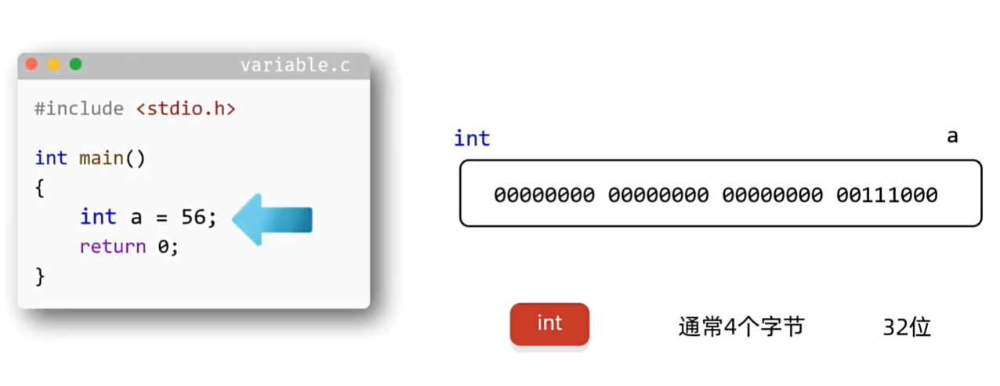
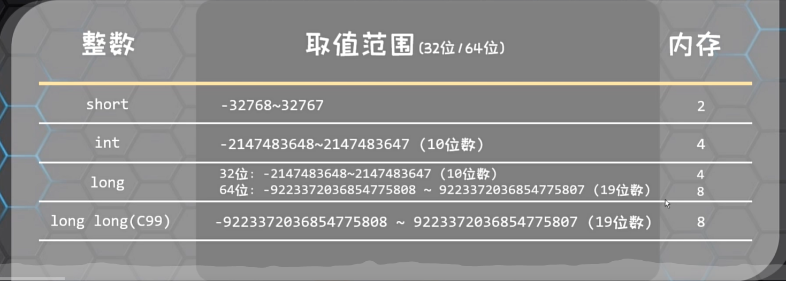
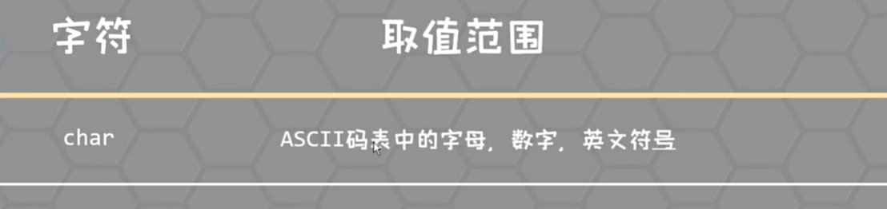

<h1 style="text-align: center; font-family: '仿宋';">02.C语言核心语法</h1>

[TOC]

# 1 数据类型

## 1.1 数据类型的作用：





## 1.2 数据类型

### 1.2.1 整数类型





```C
short a = 256;
int b = 153;
long c = 153564L;
long long d = 15134653LL;  // C99才有的
printf("%d \n", a);
printf("%d \n", b);
printf("%ld \n", c);
printf("%lld \n", d);

printf("%zu \n", sizeof(short));  // 2
printf("%zu \n", sizeof(int));  // 4
printf("%zu \n", sizeof(long));  // 4
printf("%zu \n", sizeof(long long));  // 8
```

```C
// 定义数据类型的完整形态
short int a = 256;
int b = 153;
long int c = 153564L;
long long int d = 15134653LL;
```

```C
// 有符号整数
unsigned int f = 1564;
printf("%u \n", f);
```


### 1.2.2 小数类型


```C
float a = 3.14F;
printf("%f \n", a);  // 3.140000
printf("%.2f \n", a);  // 3.14

double b = 3.1415926;  
printf("%lf \n", b);// 3.141593
printf("%.2lf \n", b);//3.14

long double c = 3.1415;
printf("%lf \n", c);//3.141500
printf("%.2lf \n", c);//3.14

printf("%zu \n", sizeof(float));//4
printf("%zu \n", sizeof(double));//8
printf("%zu \n", sizeof(long double));//8
```

```C
// unsigned和小数之间是不能组合的
```

### 1.2.3 字符



```C
char a = 'a';
printf("%c ------ %zu ", a, sizeof(char));//a ------ 1
```


# 2 标识符


# 3 键盘录入

`scanf`


```C
char str[10] = "aaa";
// 英文状态下，一个字符占一个字节 一个汉字占两个字节
// 字符串最后都会含有一个结束标记 \0
printf("%s", str);
```

```C
char name[100];

printf("请输入名字 >>> ");
int return_value_scanf = scanf("%s", &name);
printf("你输入的名字是：%s \n", name);
```

```C
// 键盘录入多个数据
int a, b;
scanf("%d %d", &a, &b);
printf("%d %d", a, b);
```


