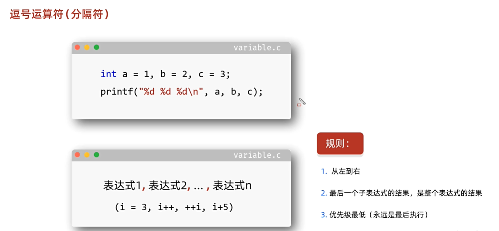
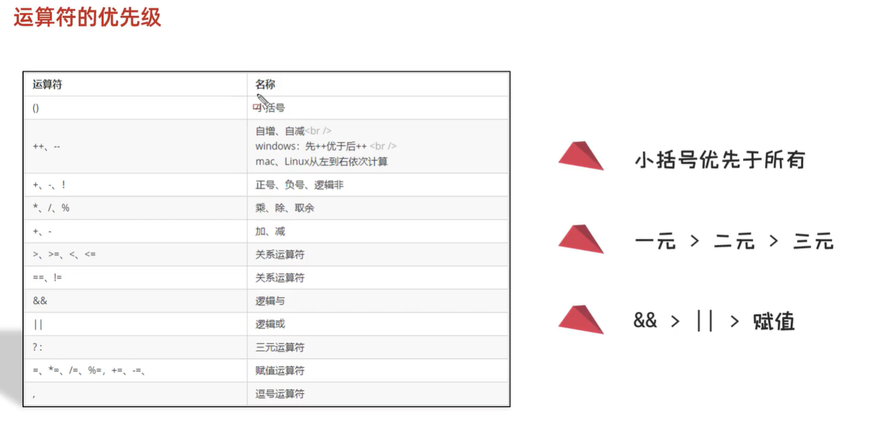

<h1 style="text-align: center; font-family: '仿宋';">03.运算符</h1>

# 1 算数运算符


通用的细节：

- 整数参加计算，结果一定是一个整数

- 小数计算，结果一定是小数

- 整数和小数计算，结果一定是小数

- 小数直接参与计算，那么结果有可能不精确

  ```C
  float a = 3.333333333333333f;
  float b = 6.666666666666666f;
  printf("%f", a + b);  // 10.000000
  ```

除法的细节：

- 不能除0

取余的细节：

- 运算的数据必须全都是整数
- 获取余数的正负，和第一个数字正负保持一致
- 不能除0


```C
// 输入一个三位数 打印出每一位数字
int a;
int c = scanf("%d", &a);
printf("%d \n", a);
int zero_position = a % 10;
int one_position = a / 10 % 10;
int three_position = a / 10 / 10 % 10;
printf("one %d\n", zero_position);
printf("two %d\n", one_position);
printf("three %d\n", three_position);
```


## 1.1 隐式转换

数字在计算的时候，如果数据类型不一样，需要转成一样的才能计算。


## 1.2 强制转换


## 1.3 字符相加


# 2 自增、自减运算符


# 3 赋值运算符


# 4 关系运算符


```C
if (1) {
    printf("True \n");
} else {
    printf("False \n");
}

if (12.3) {
    printf("True \n");
} else {
    printf("False \n");
}

if (0) {
    printf("True \n");
} else {
    printf("False \n");
}

if ('a') {
    printf("True \n");
} else {
    printf("False \n");
}

if ("abc") {
    printf("True \n");
} else {
    printf("False \n");
}

int a[3] = {1, 2, 3};
if (a) {
    printf("True \n");
} else {
    printf("False \n");
}
int b[3];
if (b) {
    printf("b0 %d \n", b[0]);
    printf("b1 %d \n", b[1]);
    printf("b2 %d \n", b[2]);
    printf("True \n");
} else {
    printf("False \n");
}

/*
True
True
False
True
True
True
b0 0
b1 1
b2 1062801408
True
*/
```


# 5 三元运算符


# 6 逗号运算符（分隔符）



```C
int i;
//    i = 0, i++, ++i, i + 5;
printf("%d", (i = 0, i++, ++i, i + 5));  //7
```

# 7 运算符优先级





