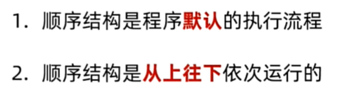
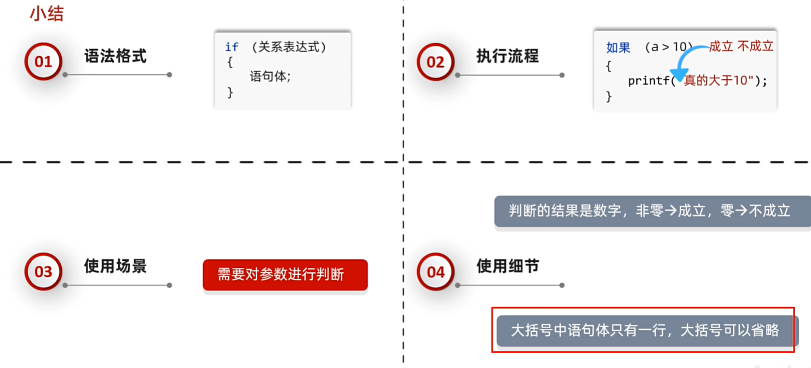
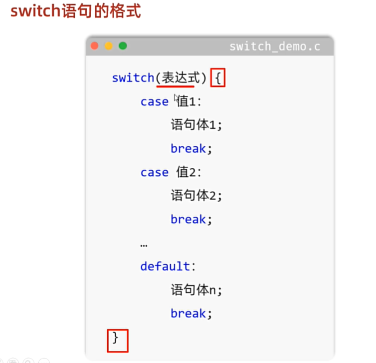
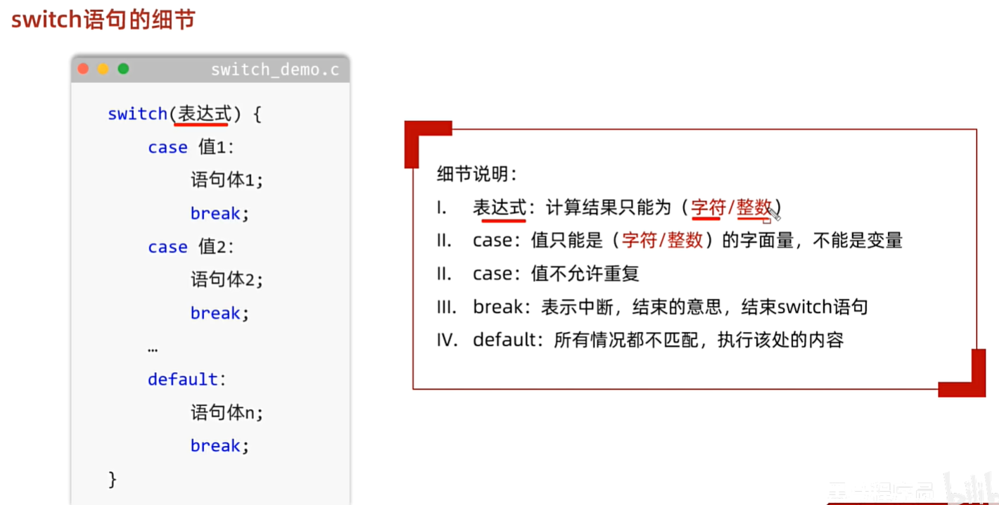
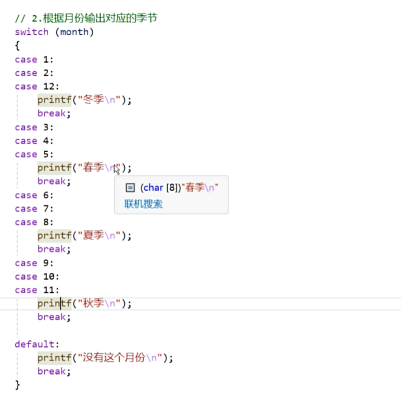
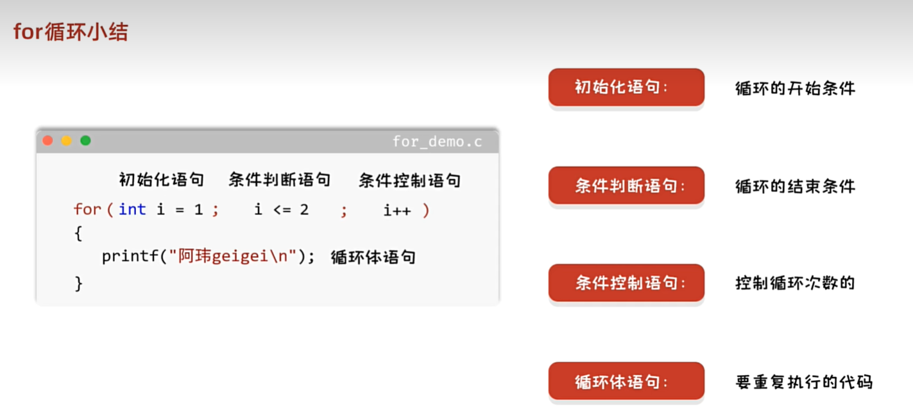
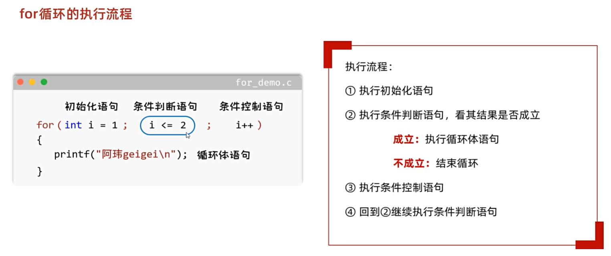
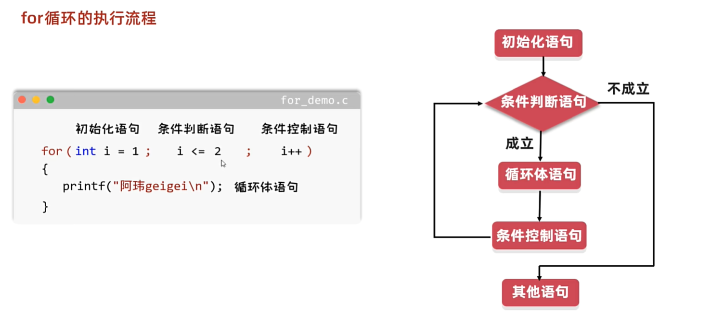
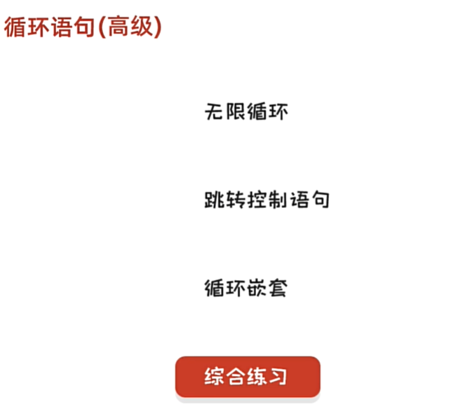
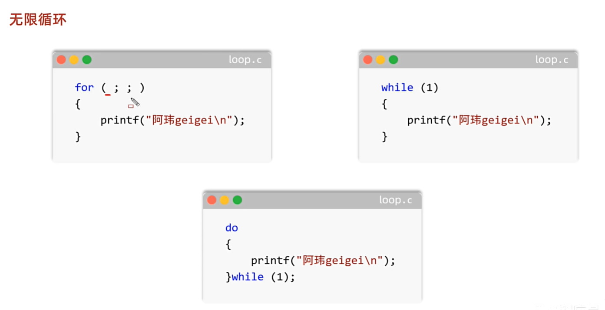

<h1 style="text-align: center; font-family: '仿宋';">04.流程控制语句</h1>

[TOC]

# 1 顺序结构




# 2 分支结构

## 2.1 if



## 2.2 switch case





## 2.1 case穿透



# 3 循环结构

## 3.1 循环








## 3.2 循环语句-高级





# 4 制表符

`\t`制表符：长度可变的大空格

会根据前面字符的个数在后面补空格，让整体的长度达到8或者8的倍数，最少补1个，最多补8个。

作用：在打印表格数据的时候能够对齐。

```c
// 1 ** 1 + 2 ** 2 + 3 **3 + ... + 10 ** 10 = ?
// 计算1的一次方加2的2次方 + ... + 10的10次方的结果
// 用long long类型
// 结果为10405071317

long long res = 0;
for (int num = 1; num <= 10; num++) {
    long long inner_res = 1;
    for (int i = 1; i <= num; i++) {
        inner_res *= num;
    }
    res += inner_res;
}
printf("%lld\n", res);
```

```c
/*
 * 0 - 1000
 * 每一位数字之和等于15
 * */

for (int num = 1; num <= 1000; num++) {
    int sum_ = 0;
    int new_num = num;
    int m;
    while (new_num != 0) {
        m = new_num % 10;
        sum_ += m;
        new_num = new_num / 10;
    }
    if (sum_ == 15) {
        printf("%d \n", num);
    }
}
```


