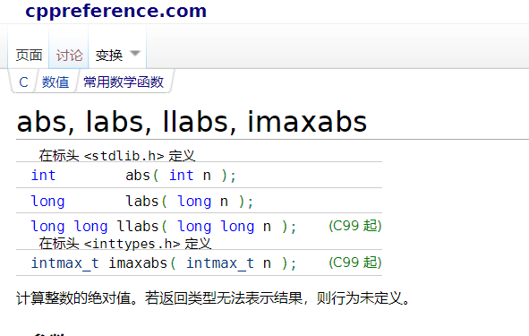
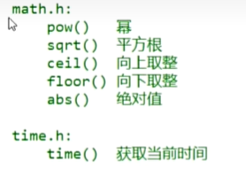

<h1 style="text-align: center; font-family: '仿宋';">05.函数</h1>

[TOC]


# 1 函数


```c
#include <stdio.h>

// 函数的声明
int function(int num1, int num2);

int function_add(int num1, int num2, int num3);


int main(void) {
    int x = function_add(12, 23, 40);
    printf("%d\n", x);
    return 0;
}

int function(int num1, int num2) {
    return num1 + num2;
}

int function_add(int num1, int num2, int num3) {
    return num3 + function(num1, num3);
}
```

# 2 `C`语言中的常见函数


```c
// 函数参考
https://zh.cppreference.com/w/%E9%A6%96%E9%A1%B5
```






```c
srand(1);
// 获取随机数
int num;
num = rand();
printf("%d\n", num);
```


