[TOC]

# 1 数组

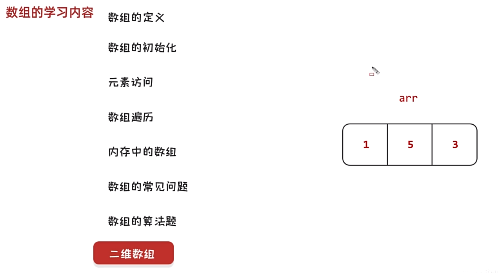

# 2 数组定义

...

# 3 数组的初始化

```c
int a[3];  // 存的是以前的内存里面的值
printf("%d\t", a[0]);
printf("%d\t", a[1]);
printf("%d\t", a[2]);
```

```c
int a[3] = {1};
printf("%d\t", a[0]);
printf("%d\t", a[1]);
printf("%d\t", a[2]);
```

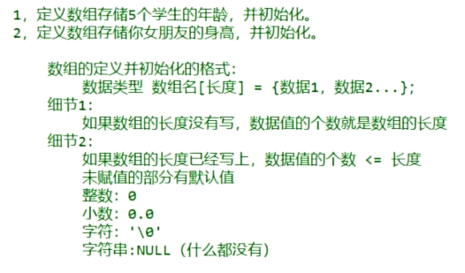

# 4 数组元素的访问

...

# 5 内存中的变量、数组

```c
内存：是软件在运行的时候，用来临时存储数据的
```

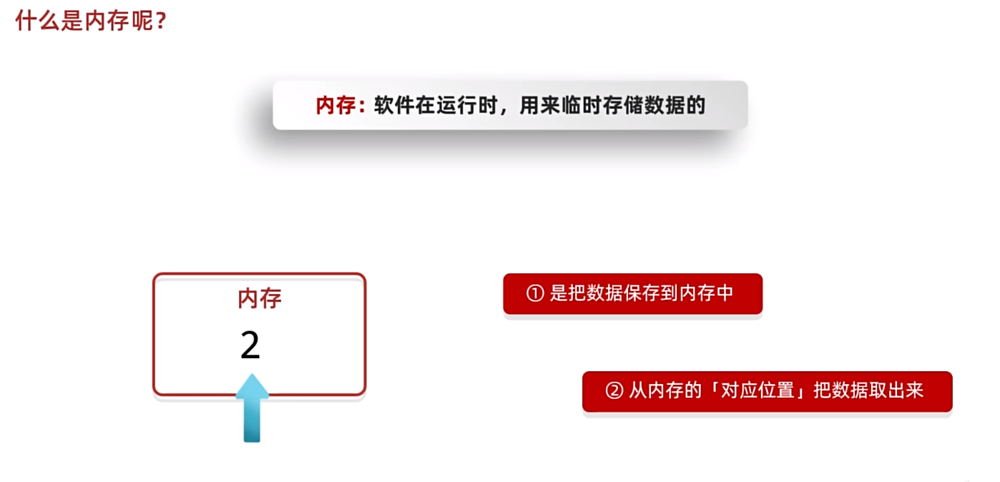

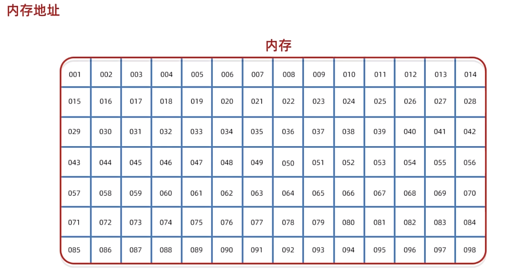

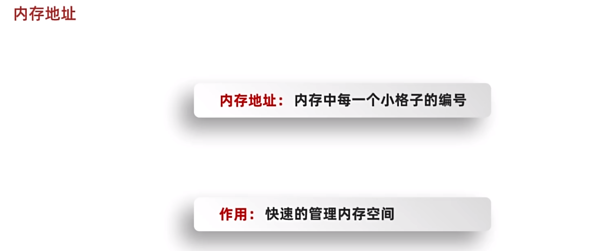

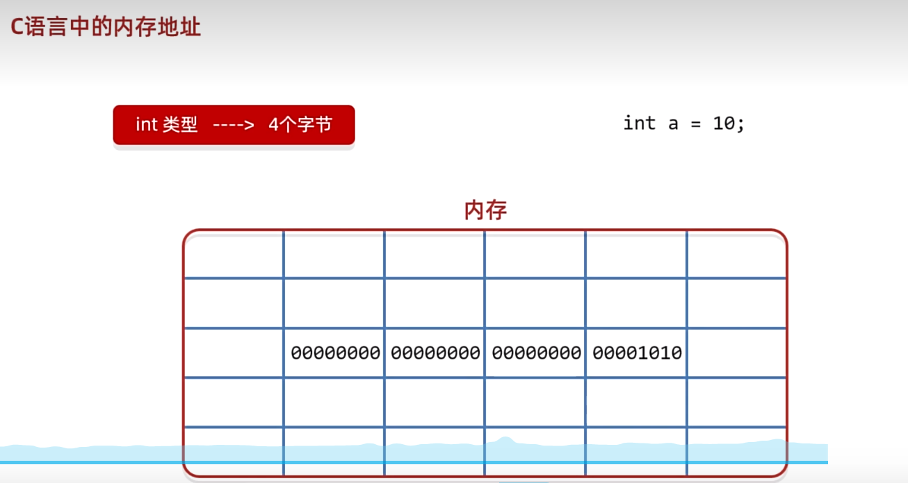

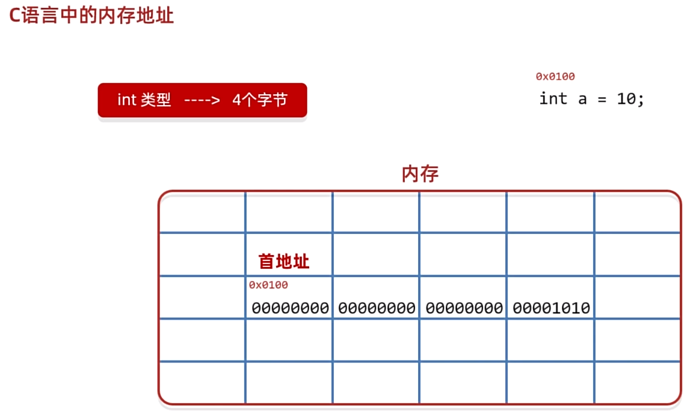

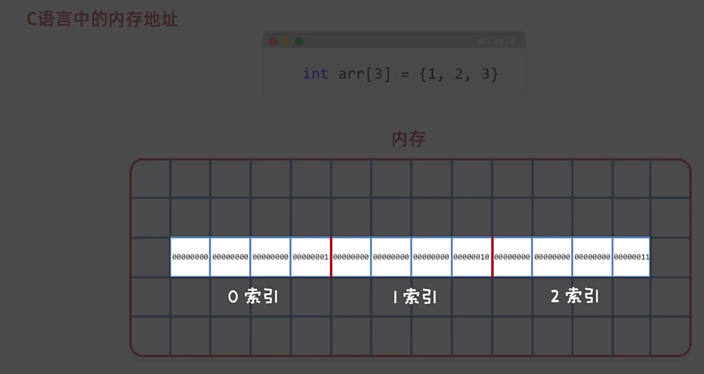

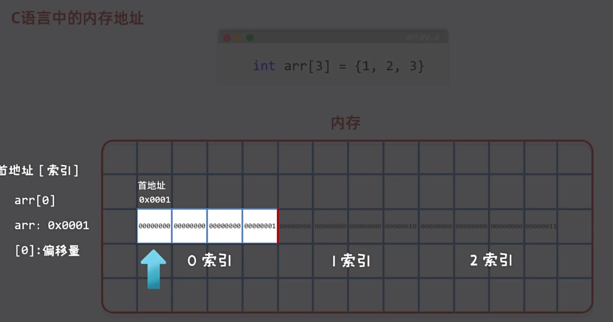

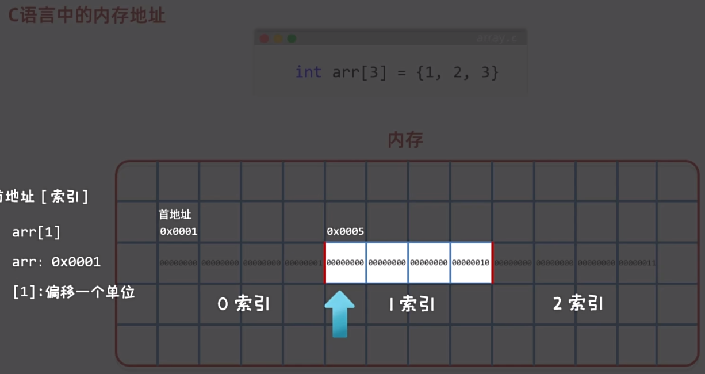

```c
int a[3] = {};
printf("%p\n", &a);
printf("%p\n", &a[0]);
printf("%p\n", &a[1]);
printf("%p\n", &a[2]);
```

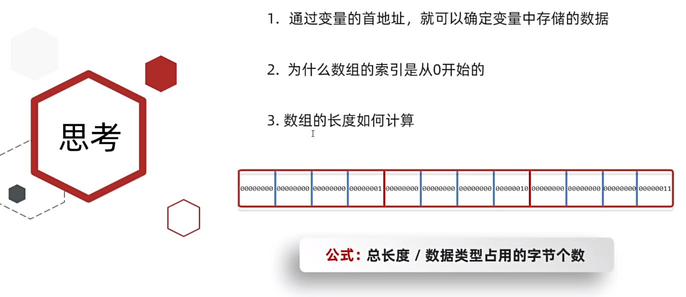

```c
int main(void) {
	void printArray(int array[], int len);
    int a[5] = {1, 2, 3, 4, 5};
    int len = sizeof(a) / sizeof(a[0]);
    printArray(a, len);
    return 0;
}
void printArray(int array[], int len) {
    for (int i = 0; i < len; i++) {
        printf("%d ", array[i]);
    }
    printf("\n");
}
```


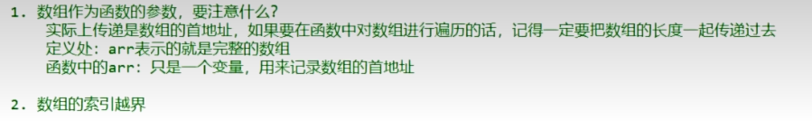

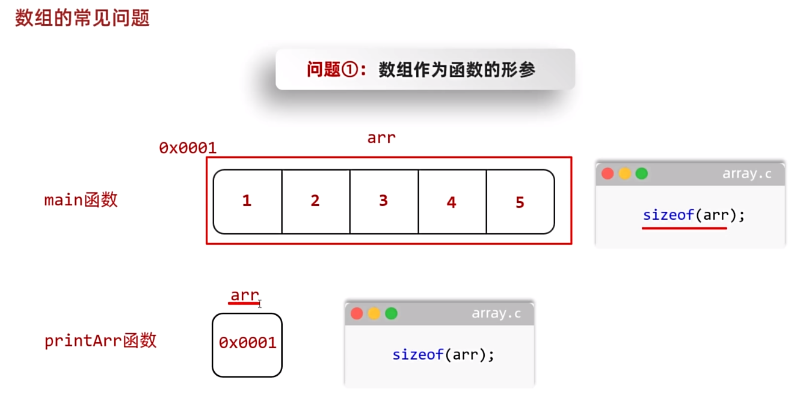

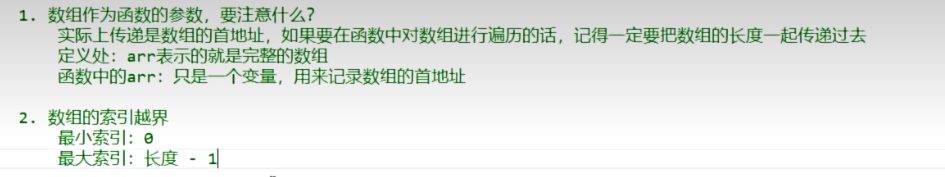

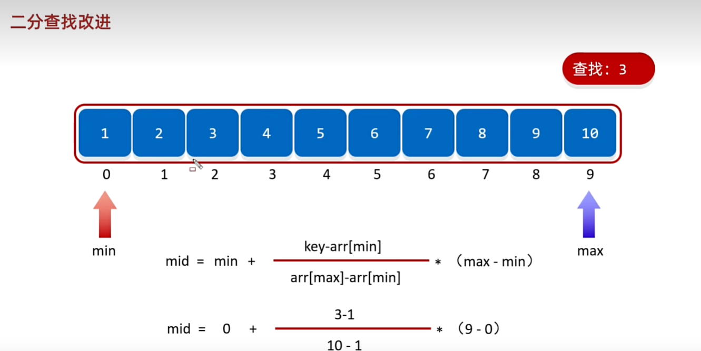

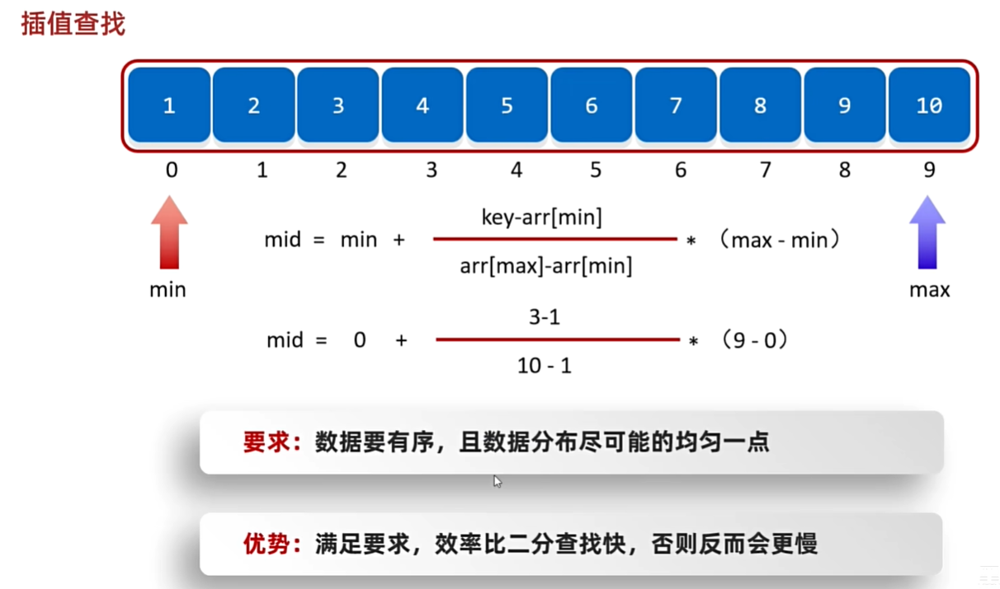

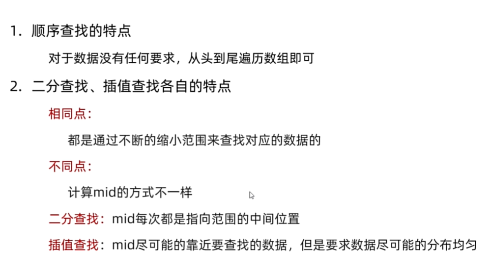

```c
//
// Created by 20866 on 2024/7/5 005.
//

# include <stdio.h>
# include <stdlib.h>
# include <time.h>

int main(void) {
    /*
        int max(int array[], int len);
        int min(int array[], int len);
        int sum(int array[], int len);

        int array[10] = {15, 2, -6, 13, 9, -1, 5, 6, 48, 26};
        int len = sizeof(array) / sizeof(array[0]);
        int max_array, min_array;
        max_array = max(array, len);
        min_array = min(array, len);
        printf("Max number of array: %d \n", max_array);
        printf("Min number of array: %d \n", min_array);

        // 随机产生一个10个数字的数组 每个数字范围1 - 100 求这个数组的和
        int array_rand[10] = {};
        srand(time(NULL));
        int len_rand = sizeof(array_rand) / sizeof(array[0]);
        for (int i = 0; i < len_rand; i++) {
            array_rand[i] = rand() % 100 + 1;
        }
        int array_rand_sum = sum(array_rand, len_rand);
        printf("Sum of array: %d \n", array_rand_sum);
     */
    void printArray(int array[], int len);
    void reverse(int array[], int len);
    void resort(int array[], int len);
    int find(int array[], int target, int len);
    int binarySearch(int array[], int len, int target);
    void bubbleSort(int array[], int len);
    void binarySort(int array[], int len);

    int array[10] = {5, 2, -6, 13, 10, 94, -12, 0, 2, 6};
    int len = sizeof(array) / sizeof(array[0]);
    // printArray(array, len);
    // reverse(array, len);
    // resort(array, len);
    // printArray(array, len);

    /*
        // 键盘录入数组
        int newArray[5] = {};
        for (int i = 0; i < 5; i++) {
            scanf("%d", &newArray[i]);
        }
        printArray(newArray, 5);
     */

    ////查找数据
    // printArray(array, len);
    //int index = find(array, 13, len);
    //printf("%d\n", index);

    //// 二分查找
    //printArray(array, len);
    //int index = binarySearch(array, len, 290);
    //printf("%d\n", index);

    //// 选择排序
    //printArray(array, len);
    //bubbleSort(array, len);
    //printArray(array, len);

    printArray(array, len);
    binarySort(array, len);
    printArray(array, len);
    return 0;
}

// 打印出数组
void printArray(int array[], int len) {
    if (len <= 0) {
        return;
    }
    for (int i = 0; i < len; i++) {
        printf("%d ", array[i]);
    }
    printf("\n");
}

// 求最值
int max(int array[], int len) {
    int max = array[0];
    for (int i = 1; i < len; i++) {
        if (array[i] > max) {
            max = array[i];
        }
    }
    return max;
}

int min(int array[], int len) {
    int min = array[0];
    for (int i = 1; i < len; i++) {
        if (array[i] < min) {
            min = array[i];
        }
    }
    return min;
}

// 求和
int sum(int array[], int len) {
    int
            sum_array = 0;
    for (int i = 0; i < len; i++) {
        sum_array += array[i];
    }
    return sum_array;
}

// 反转数组
void reverse(int array[], int len) {
    int temp;
    for (int i = 0; i < len / 2; i++) {
        temp = array[i];
        array[i] = array[len - i - 1];
        array[len - i - 1] = temp;
    }
}

// 打乱数据
void resort(int array[], int len) {
    srand(1);
    int index_rand, temp;
    for (int i = 0; i < len; i++) {
        index_rand = rand() % len;
        temp = array[i];
        array[i] = array[index_rand];
        array[index_rand] = temp;
    }
}

// 查找、排序
int find(int array[], int target, int len) {
    for (int i = 0; i < len; ++i) {
        if (array[i] == target) {
            return i;
        }
    }
    return -1;
}

// 二分查找
int binarySearch(int array[], int len, int target) {
    int min = 0, max = len - 1, mid;
    while (1) {
        if (min > max) {
            if (array[mid] == target)
                return mid;
            return -1;
        }
        mid = (min + max) / 2;
        if (array[mid] == target) {
            return mid;
        }
        if (array[mid] > target) {
            max = mid - 1;
        }
        if (array[mid] < target) {
            min = mid + 1;
        }
    }
}

// 插值查找
/*
// todo: 这个没能实现 没听懂
int insertSearch(int array[], int len, int target) {
    int min = 0, max = len - 1, mid;
    while (1) {
        if (min > max) {
            if (array[mid] == target)
                return mid;
            return -1;
        }
        mid = (min + max) / 2;
        if (array[mid] == target) {
            return mid;
        }
        if (array[mid] > target) {
            max = mid - 1;
        }
        if (array[mid] < target) {
            min = mid + 1;
        }
    }
}
*/

// 排序
void bubbleSort(int array[], int len) {
    /*
     * 使用冒泡排序对数组进行排序
     * */
    int temp;
    for (int i = 0; i < len - 1; i++) {
        for (int j = 0; j < len - i - 1; j++) {
            if (array[j] > array[j + 1]) {
                temp = array[j];
                array[j] = array[j + 1];
                array[j + 1] = temp;
            }
        }
    }
}

// 排序
void binarySort(int array[], int len) {
    /*
     * 使用选择排序对数组进行排序
     * */
    int temp;
    for (int i = 0; i < len - 1; i++) {
        for (int j = i + 1; j < len; j++) {
            if (array[i] > array[j]) {
                temp = array[i];
                array[i] = array[j];
                array[j] = temp;
            }
        }
    }
}

```


