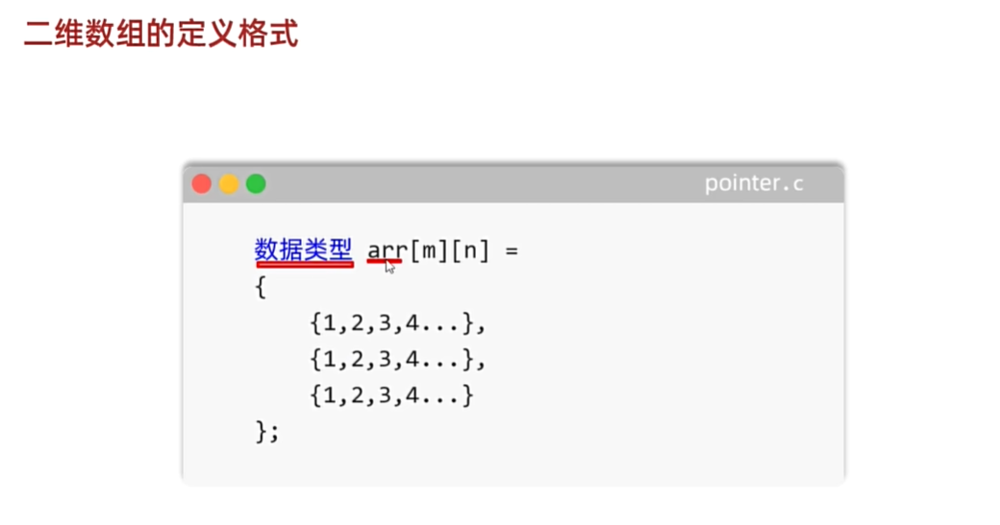

<h1 style="text-align: center; font-family: 'Menlo'">07.指针</h1>

[TOC]

# 1 什么是指针


# 2 指针的作用


## 2.1 利用指针操作其他函数中的变量

普通的传参，传的是值，但是没传指针/引用


`static`:延长一个变量的生命周期，想要让其在整个程序中都能保存的话，就使用`static`静态关键字。

```c
int main(void){
    int *method();
    int *p;
    p = method();
    printf("%d \n", *p);
    printf("%p \n", p);
    return 0;
}

int *method() {
    static int a = 10;
    return &a;
}
```

## 2.2 返回多个值

```c
int main() {
    /*
     * 定义一个函数，求数组的最大值和最小值。
     * 并进行返回。
     * */
    void getMaxAndMin(int array[], int len, int *max, int *min);

    int array[6] = {15, -2, 65, 0, 33, -12};
    int len = sizeof(array) / sizeof(array[0]);
    int max = array[0];
    int min = array[0];
    getMaxAndMin(array, len, &max, &min);
    printf("Max: %d Min: %d \n", max, min);
    return 0;
}
void getMaxAndMin(int array[], int len, int *max, int *min) {
    // 求最大值和最小值
    *max = array[0];
    *min = array[0];
    for (int i = 1; i < len; i++) {
        if (array[i] > *max) {
            *max = array[i];
        } else if (array[i] < *min) {
            *min = array[i];
        } else {
            continue;
        }
    }
}
```

## 2.3 函数的结果和状态分开

```c
int main(void) {
    int divmod(int a, int b, int *res);

    int a = 10;
    int b = 3;
    int res = 0;

    int return_code =  divmod(a, b, &res);
    if (return_code == 0) {
        printf("res = %d \n", res);
    }
    else {
        printf("Error, divided by 0!\n");
    }
    return 0;
}

// 返回值：表示函数计算的状态
int divmod(int a, int b, int *res) {
    if (b == 0) {
        return 1;
    }
    *res = a % b;
    return 0;
}

```

## 2.4 方便地操作数组和函数

这部分会在指针高级阶段讲解。

# 3 指针高级

1. 指针的计算
2. 二级指针和多级指针
3. 数组和指针
4. 函数和指针

## 3.1 指针的计算


```c
// 获取0索引的内存地址
int *p3 = &array[0];
// 获取4索引的内存地址
int *p4 = &array[4];
// p4 - p3间隔了多少步长
printf("%d\n", p4 - p3);
// 这么多步长总共几个字节
printf("%d\n", (p4 - p3) * sizeof(array[0]));
printf("%d\n", (p4 - p3) * sizeof(*p3));
```

## 3.2 指向不明的指针


```c
/*
 * 野指针：指针指向的空间没有分配
 * 悬空指针：指针指向的空间已经分配，但是被释放了
 * */

// 野指针
int a = 10;
int *p1 = &a;
printf("%p\n", p1);
printf("%d\n", *p1);

// p2：野指针
int *p2 = p1 + 10;
printf("%p\n", p2);
printf("%d\n", *p2);


```

## 3.3 没有类型的指针


```c
int main() {
    /*
     * void类型的指针
     * */
    // 定义两个变量
    int a = 10;
    short b = 20;
    // 定义两个指针
    int *p1 = &a;
    short *p2 = &b;
    // 输出打印
    printf("%d\n", *p1);
    printf("%d\n", *p2);

    // 不同类型的指针之间是不能互相赋值的
    // void类型的指针打破上面的观念
    // void没有任何类型，好处是可以接受任意类型的指针记录的内存地址
    // 缺点：void类型指针，无法获取变量里面的数据 也不能进行加减计算
    void *p3 = p1;
    void *p4 = p2;

    // 调用函数交换数据
    void swap(void *p1, void *p2, int len);
    int c = 100;
    int d = 200;
    printf("c = %d, d = %d \n", c, d);
    swap(&c, &d, sizeof(c));
    printf("c = %d, d = %d \n", c, d);
    return 0;
}

// 交换值
// 修改函数使其更有通用性
void swap(void *p1, void *p2, int len) {
    // 将void类型的指针转成char类型的指针
    char *pc1 = p1;
    char *pc2 = p2;
    char temp = 0;
    // 以字节为单位，一个字节一个字节的交换
    for (int i = 0; i < len; i++) {
        temp = *pc1;
        *pc1 = *pc2;
        *pc2 = temp;
        pc1++;
        pc2++;
    }
}
```

## 3.4 二级指针和多级指针


## 3.5 数组和指针


```c
#include "stdio.h"

int main(void) {
    int array[] = {10, 20, 30, 40, 50};
    int len = sizeof(array) / sizeof(array[0]);

    // 获取数组的指针 下面这两种方法完全等价
    int *p1 = array;
//    // int *p2 = &array[0];
//    printf("%d\n", *p1);
//    printf("%d\n", *(p1 + 2));

    // 利用循环和指针遍历数组获取每一个值
    for (int i = 0; i < len; ++i) {
        printf("%d ", *p1++);
        //// 上面一行的写法等价于下面这两行
        //printf("%d ", *p1);
        //p1 ++;
    }
    return 0;
}
```


```c
#include "stdio.h"

int main(void) {
//    int array[] = {10, 20, 30, 40, 50};
//    int len = sizeof(array) / sizeof(array[0]);
//
//    // 获取数组的指针 下面这两种方法完全等价
//    int *p1 = array;
//    printf("%d \n", p1[0]);
////    // int *p2 = &array[0];
////    printf("%d\n", *p1);
////    printf("%d\n", *(p1 + 2));
//
//    // 利用循环和指针遍历数组获取每一个值
//    for (int i = 0; i < len; ++i) {
//        printf("%d ", *p1++);
//        //// 上面一行的写法等价于下面这两行
//        //printf("%d ", *p1);
//        //p1 ++;
//    }

    int array[] = {10, 20, 30, 40, 50};

    // sizeof运算符，不会退化，array还是整体
    printf("%zu \n", sizeof(array));

    // &array获取地址的时候，并不会退化 也是数组的首地址 但是步长：数据类型 * 数组长度
    // array参与计算的时候，会退化为第一个元素的指针 记录的内存地址是第一个元素的首地址 也是数组的首地址 步长：数据类型
    printf("%p\n", array);
    printf("%p\n", &array);

    printf("%p\n", array + 1);
    printf("%p\n", &array + 1);
    return 0;
}
```


## 3.6 二维数组





```c
#include "stdio.h"


int main(void) {
    /*
     * 二维数组
     *     定义和遍历方式
     *     定义格式
     *         数据类型 数组名[m][n] = {
     *             {1, 2, ...},
     *             {3, 4, ...},
     *             ...        ,
     *             {5, 6, ...}
     *         };
     *         int array1[5] = {1, 2, ..};
     *         int array2[5] = {1, 2, ..};
     *         int array[2] = {
     *             array1,
     *             array2
     *         }
     *     遍历方式：利用索引/指针遍历
     *        利用索引
     *            ...
     *        利用指针
     *            ...
     * */
    int array[3][5] = {
            {1, 3, 5, 7, 9},
            {2, 4, 6, 8, 10},
            {11, 13, 15, 17, 19},
    };
    int array_len = sizeof(array) / sizeof(array[0]);
    int inter_len = sizeof(array[0]) / sizeof(array[0][0]);

    for (int i = 0; i < array_len; i++) {
        for (int j = 0; j < inter_len; j++) {
            printf("%d\t", array[i][j]);
        }
        printf("\n");
    }
    return 0;
}
```

上面这种格式的有问题：二维数组里面的每个一维数组都只能是相同长度的

```c
#include "stdio.h"

int main(void) {
    int array1[] = {1, 3, 5, 7, 9};
    int array2[] = {11, 13, 15, 17, 19, 21, 23, 25};
    int array3[] = {111, 113, 115, 117, 119, 120, 121, 122, 123, 124};
    // 预先计算每个数组的长度
    int len_1 = sizeof(array1) / sizeof(array1[0]);
    int len_2 = sizeof(array2) / sizeof(array2[0]);
    int len_3 = sizeof(array3) / sizeof(array3[0]);

    int len[3] = {len_1, len_2, len_3};

    int *array[3] = {
            array1,
            array2,
            array3
    };
    // 利用索引遍历array
    // 使用数组名计算的时候 会退化成指针 -- 内存地址 64bit的计算机 8byte 8byte/int的4byte=2
    for (int i = 0; i < 3; i++) {
        //int len = sizeof(array[i]) / sizeof(array[i][0]);
        for (int j = 0; j < len[i]; j++) {
            printf("%d\t", array[i][j]);
        }
        printf("\n");
    }
    return 0;
}

```

使用指针遍历数组

```c
int main() {	
	int array[3][5] = {
            {1,  3,  5,  7,  9},
            {2,  4,  6,  8,  10},
            {11, 13, 15, 17, 19},
    };

    // 数组指针的数据类型 要跟数组内部元素的类型保持一致
    // 二维数组里面存储的是一维数组int[5]
    int (*p)[5] = array;
    printf("%p\n", array);
    printf("%p\n", array + 1);
    
    for (int i = 0; i < 3; ++i) {
        for (int j = 0; j < 5; ++j) {
            // printf("%d ", array[i][j]);
            printf("%d ", *(*p + j));
        }
        printf("\n");
        p ++;
    }
    return 0;
}
```

```c
int array1[] = {1, 3, 5, 7, 9};
int array2[] = {11, 13, 15, 17, 19};
int array3[] = {111, 113, 115, 117, 119};
// 定义二维指针数组
int *array[3] = {
        array1,
        array2,
        array3,
};
// 获取指针
int **p = array;
// 遍历数组
for (int i = 0; i < 3; ++i) {
    for (int j = 0; j < 5; ++j) {
        printf("%d ", *(*p + j));
    }
    printf("\n");
    p ++;
}
```


## 3.7 数组指针和指针数组


## 3.8 函数和指针


```c
#include <stdio.h>

int main(void) {
    /*
     * 函数指针
     * */
    void method1();
    int method2(int num1, int num2);

    // 定义指针执行两个函数
    void (*p1)() = method1;
    int (*p2)(int, int);
    p2 = method2;
    // 利用函数指针调用函数
    p1();
    int x = p2(10, 20);
    printf("%d\n", x);
    return 0;
}

void method1() {
    printf("Method1\n");
}

int method2(int num1, int num2) {
    printf("Method2\n");
    return num1 + num2;
}

```

```c
#include <stdio.h>

int add(int num1, int num2);

int substract(int num1, int num2);

int mutiply(int num1, int num2);

int divide(int num1, int num2);

int main(void) {
    /*
     * 定义加减乘除四个函数
     * 用户键盘录入三个数字
     * 前两个表示参与计算的数字
     * 第三个数字表示调用的函数
     * 1. 加法
     * 2. 减法
     * 3. 乘法
     * 4. 除法
     * 细节：形参要完全相同并且返回值也要一样的类型才可以
     * */

    // 定义一个数组去装四个函数的指针 -- 函数指针数组
    int (*array[4])(int, int) = {add, substract, mutiply, divide};

    // 让用户键盘录入三个数据
    printf("请录入两个数字用来参与运算，中间使用空格隔开:\n");
    int a, b;
    scanf("%d %d", &a, &b);
    printf("input:%d %d \n", a, b);
    printf("请录入你想要对这两个数进行的操作：1. 加 2. 减 3. 乘 4. 除\n");
    int c;
    scanf("%d", &c);

    // 根据用户选的参数 调用函数
    int res = array[c - 1](a, b);
    printf("result = %d\n", res);
    return 0;
}

int add(int num1, int num2) {
    return num1 + num2;
}

int substract(int num1, int num2) {
    return num1 - num2;
}

int mutiply(int num1, int num2) {
    return num1 * num2;
}

int divide(int num1, int num2) {
    return num1 / num2;
}
```


