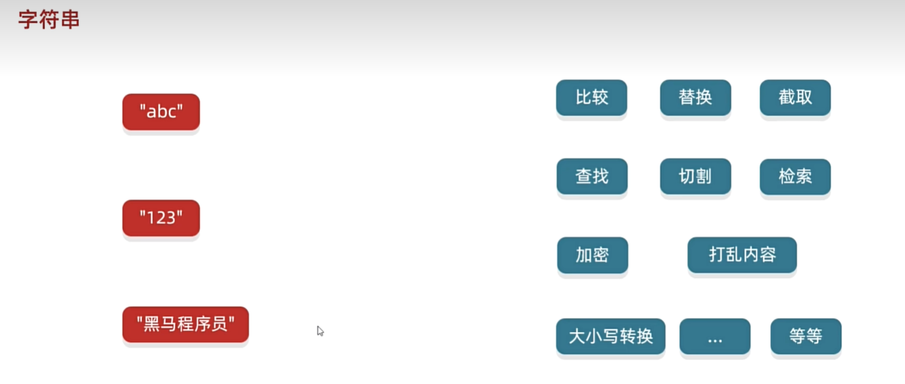
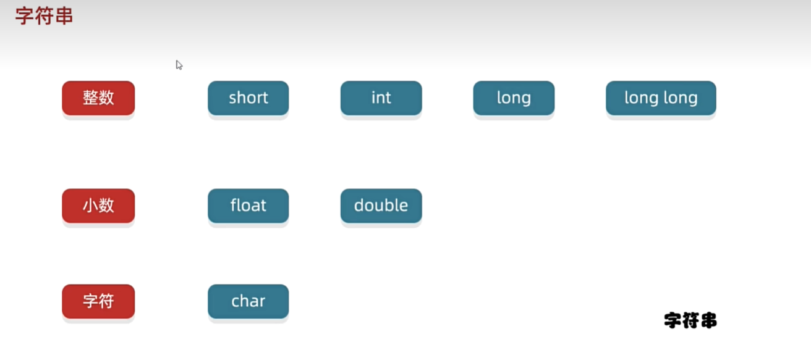
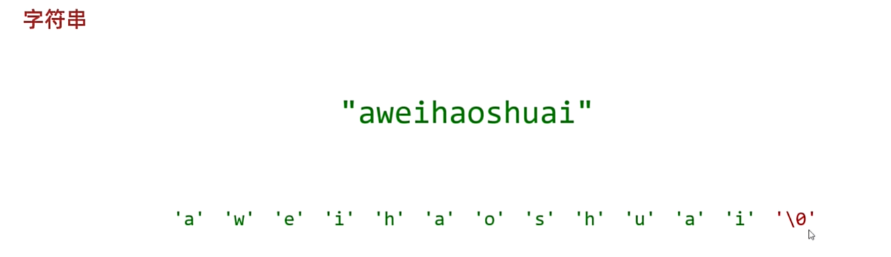
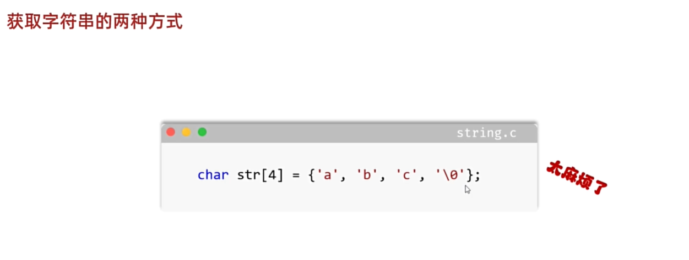
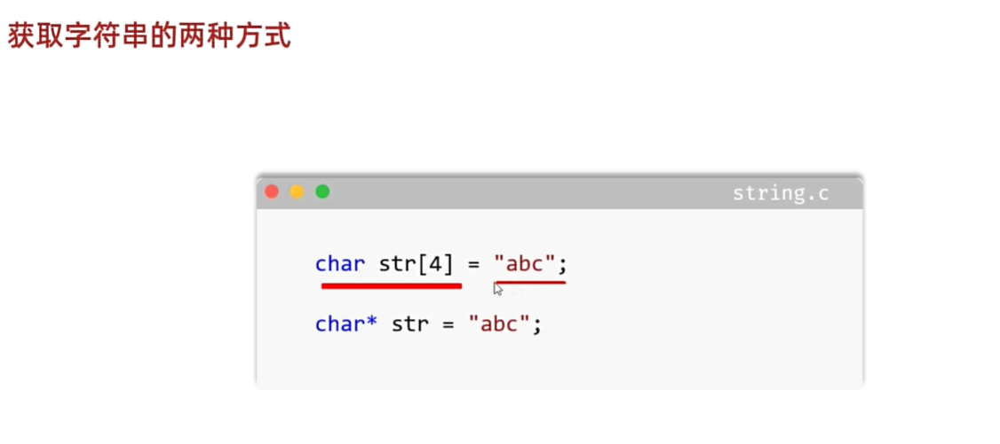
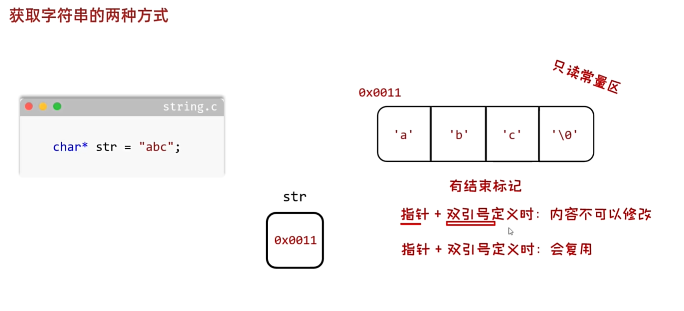
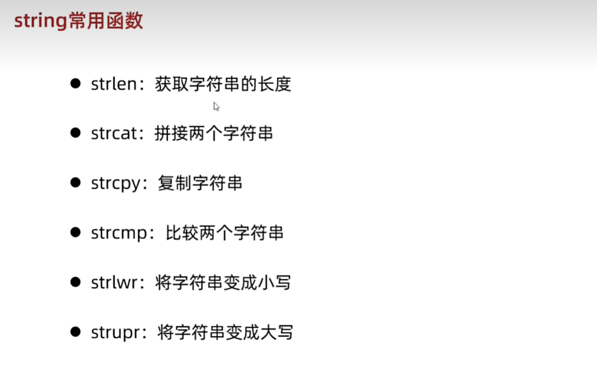

<h1 style="text-align: center; font-family: 'Menlo'">08.字符串</h1>

[TOC]

# 1 字符串概览











```c
/*
 * 细节1：
 *     在底层，实际存储的时候，C语言会帮我们将字符串转换成字符数组进行保存，并且在末尾还要加上'\0'
 * 细节2：
 *     数组的长度要么不写，如果要写，记得把结束标记的空间给预留出来
 * 细节3：
 *     字符数组 + 双引号的方式定义字符串，内容是可以发生改变的。
 * */
char string[] = "computer";
printf("%s\n", string);
printf("%zu\n", sizeof(string));
printf("%zu\n", sizeof(string[0]));
printf("%llu\n", sizeof(string)/sizeof(string[0]));
string[0] = 'Q';
printf("%s\n", string);
printf("--> %c\n", string[0]);
```

```c
// 利用指针 + 双引号的方式定义字符串
char *string = "computer";
char *newString = "computer";  // 检查只读常量区是否有"computer" 如果有的话不再重新创建
/*
 * 细节1：
 *     在底层，实际存储的时候，C语言会帮我们将字符串转换成字符数组进行保存，并且在末尾还要加上'\0'
 * 细节2：
 *     利用指针 + 双引号的方式定义字符串，会将底层的字符数组放在只读常量区
 * 细节3：
 *     只读常量区的特点：
 *         内容不可修改
 *         里面定义的字符串是可以复用的
 * */
printf("%s\n", string);
printf("%c\n", string[0]);

printf("%p\n", string);// 00007ff62305b000
printf("%p\n", newString);// 00007ff62305b000
```



练习：遍历字符串

```c
#include <stdio.h>

int main(void) {
	/*
	* 键盘录入一个字符串 使用程序实现在控制台遍历这个字符串
	*/

	char string[100];
	printf("请录入一个字符串\n");
	int return_num = scanf("%s", string);
	/*printf("输入的字符串是：%s", string);*/
	char* p = string;
	printf("接下来我要遍历这个字符串喽：\n");
	while (1) {
		// 利用指针获取字符串中的数组 知道遇到'\0'
		if (*p == '\0') {
			break;
		}
		printf("%c ", *p);
		p++;
	}
	printf("\n");
	return 0;
}

```

# 2 字符串数组

需求：定义一个数组存储5个学生的名字并进行遍历

```c
#include <stdio.h>

int main(void) 
{
	/*
	* 需求：定义一个数组存储5个学生的名字并进行遍历
	* {"zhangsan", "lisi", "wangwu", "zhaoliu", "qianqi"}
	*/
	char stringArray[5][100] = { "zhangsan", "lisi", "wangwu", "zhaoliu", "qianqi" };
	for (int i = 0; i < 5; i++)
	{
		char* str = stringArray[i];
		printf("%s\n", str);
	}

	// 第二种方式
	char* stringArray1[5] = {
		"zhangsan", 
		"lisi", 
		"wangwu", 
		"zhaoliu", 
		"qianqi",
	};

	for (int i = 0; i < 5; i++)
	{
		char* str = stringArray1[i];
		printf("%s\n", str);
	}

	return 0;
}
```

# 3 string常用函数



```c
#include <stdio.h>
#include <string.h>

int main(void) {
	/*
	* 键盘录入一个字符串 使用程序实现在控制台遍历这个字符串
	*/

	//char string[100];
	//printf("请录入一个字符串\n");
	//int return_num = scanf("%s", string);
	///*printf("输入的字符串是：%s", string);*/
	//char* p = string;
	//printf("接下来我要遍历这个字符串喽：\n");
	//while (1) {
	//	// 利用指针获取字符串中的数组 知道遇到'\0'
	//	if (*p == '\0') {
	//		break;
	//	}
	//	printf("%c ", *p);
	//	p++;
	//}
	//printf("\n");
	char* string1 = "AbC";
	char string2[100] = "aBc";
	char string3[5] = { 'q', 'w', 'e', 'r', '\0' };
	
	// --------------- strlen ---------------
	// 细节1：strlen在统计字符串长度的时候是不计算结束标记的长度的
	// 细节2：一个中文占两个字节
	//int len1 = strlen(string1);// 3
	//int len2 = strlen(string2);// 6
	//int len3 = strlen(string3);// 4

	//printf("len1 = %d,len2 = %d,len3 = %d", len1, len2, len3);

	// --------------- strcat ---------------
	// 将第二个字符串里面的内容全部拷贝到第一个字符串的后面
	// 前提1 -- 第一个字符串是可以被修改的
	// 前提2 -- 第二个字符串具有足够的空间可以容纳拼接的字符串
	/*strcat(string2, string3);
	printf("string2 = %s\nstring3 = %s", string2, string3);*/

	// --------------- strcpy ---------------
	// 将第二个字符串全部内容拷贝到第一个字符串 覆盖第一个字符串的内容
	// 前提1 -- 第一个字符串是可以被修改的
	// 前提2 -- 第二个字符串具有足够的空间可以容纳第二个字符串的完整内容
	/*strcpy(string2, string3);
	printf("%s\n", string2);
	printf("%s\n", string3);*/

	// --------------- strcmp ---------------
	// 完全一样 0
	// 只要有一个不一样 非0
	// 在比较的时候，要求顺序和内容完全一致，才叫做字符串一样
	/*int num1 = strcmp(string1, string2);
	int num2 = strcmp(string2, string3);
	printf("%d\n", num1);
	printf("%d\n", num2);*/

	// --------------- _strlwr ---------------
	// 注意只能修改英文的大小写 改不了中文  
	// 此外，如果是char* string1 = "AbC";定义的字符串是不可以修改的
	/*_strlwr(string2);
	printf("%s\n", string2);*/

	// --------------- strupr ---------------
	strupr(string2);
	printf("%s\n", string2);
	return 0;
}
```

案例：用户登录

需求：已知正确的用户名和密码，请用程序实现模拟用户登录

总共给三次机会，登陆之后，给出相应的提示

```c
#include <stdio.h>
#include <string.h>

int main(void)
{
	/*
	* 案例：用户登录
	* 需求：已知正确的用户名和密码，请用程序实现模拟用户登录
	* 总共给三次机会，登陆之后，给出相应的提示
	*/
	char* rightUsername = "zhangsan";
	char* rightPassword = "qwer1234";
	int count = 1;
	char username[100];
	char password[100];

	// 键盘输入两个字符串，表示用户输入的用户名和密码
	while (count <= 3)
	{
		printf("请输入你的用户名和密码，使用空格分开，或者使用回车分开，请勿使用除上述两种输入以外的其他形式：\n");
		int return_in = scanf("%s %s", username, password);
		if (!strcmp(username, rightUsername) && !strcmp(password, rightPassword))
		{
			printf("right\n");
			break;
		}
		else
		{
			if (count < 3)
			{
				printf("Error username or password, please try again. You can try %d times.\n", 3-count);
				count++;
			}
			else
			{
				printf("Try too many times, please try again after 3 minutes.\n");
				break;
			}
		}
	}
	return 0;
}
```

案例：统计字符次数

```c
// 键盘录入一个字符串，统计该字符串中大写字母、小写字母、数字字符出现的次数。（不考虑其他字符）
#include <stdio.h>
#include <string.h>

int main(void) 
{
	/*
	* 键盘录入一个字符串，统计该字符串中大写字母、小写字母、数字字符出现的次数。（不考虑其他字符）
	*/
	// 键盘录入一个字符串
	char string[100];
	int rn = scanf("%s", string);
	int upperCharNum = 0;
	int lowerCharNum = 0;
	int decimalCharNum = 0;
	for (int i = 0; i < strlen(string); i++)
	{
		if ((string[i] >= 'a') && (string[i] <= 'z'))
		{
			lowerCharNum ++;
		}
		if ((string[i] >= 'A') && (string[i] <= 'Z'))
		{
			upperCharNum ++;
		}
		if ((string[i] >= '0') && (string[i] <= '9'))
		{
			decimalCharNum ++;
		}
	}
	printf("upperCharNum: %d, lowerCharNum: %d, decimalCharNum: %d \n", upperCharNum, lowerCharNum, decimalCharNum);
	return 0;
}
```


