<h1 style="text-align: center; font-family: 'Menlo'">10.结构体</h1>

[TOC]

# 1 结构体概览

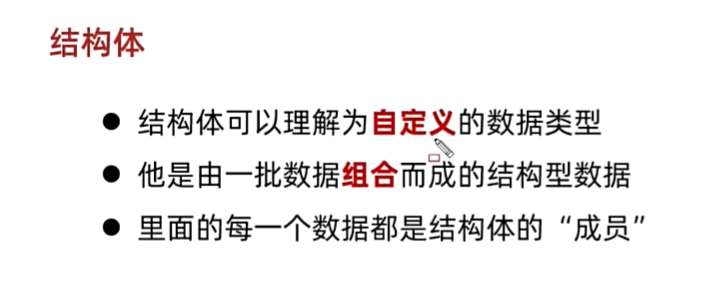

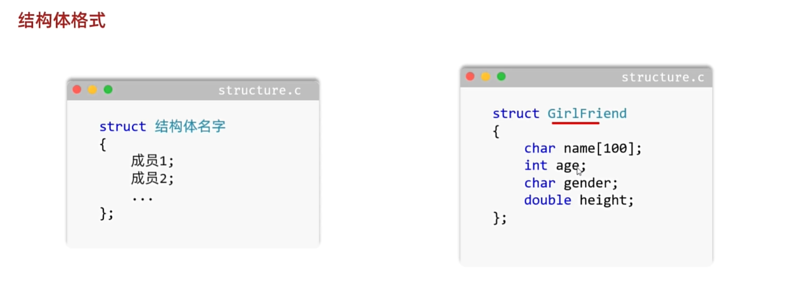

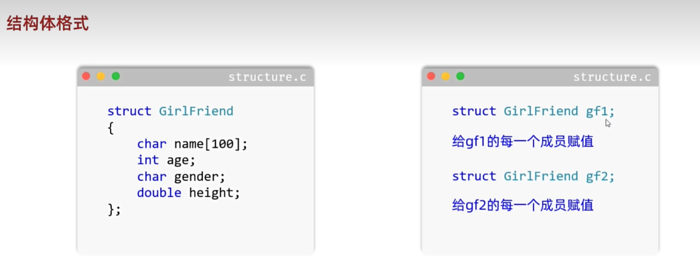

```c
#include <stdio.h>
#include <string.h>

/*
* 结构体：
*     自定义的数据类型
*     就是由很多数据组合成的一个整体
*     每一个数据都是结构体的成员
* 书写的位置：
*     函数里面：
*        局部位置 只能在本函数中使用
*		 函数的外面 全局位置 在所有的函数中都能使用
*/

struct GirlFriends 
{
	/*
	* 自定义结构体 有四个成员对象
	*/
	char name[100];
	int age;
	char gender;
	double height;
};

int main(void) 
{
	// 使用结构体
	// 定义一个GirlFriends类型的变量
	struct GirlFriends friend1;
	//friend1.name = "aaa"; // 这样是不可以的
	strcpy(friend1.name, "小诗诗");
	friend1.gender = 'F';
	friend1.height = 1.65;
	friend1.age = 18;

	printf("name: %s age:  %d height: %f gender: %c\n", friend1.name, friend1.age, friend1.height, friend1.gender);
	return 0;
}

```

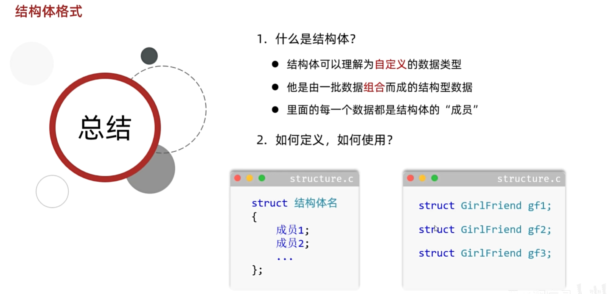

练习：


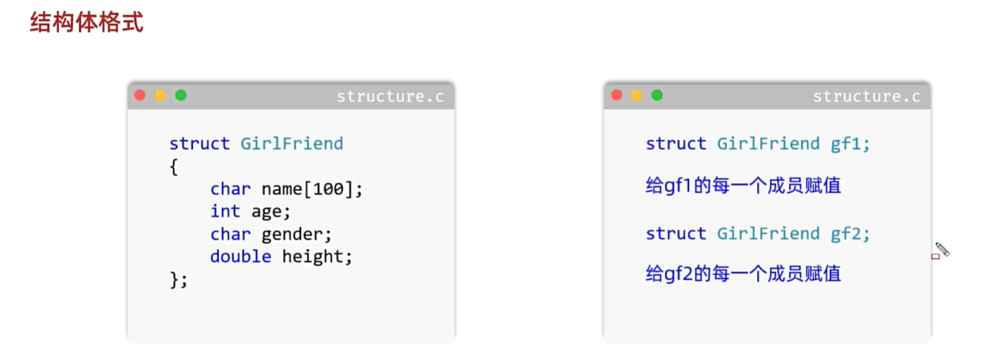

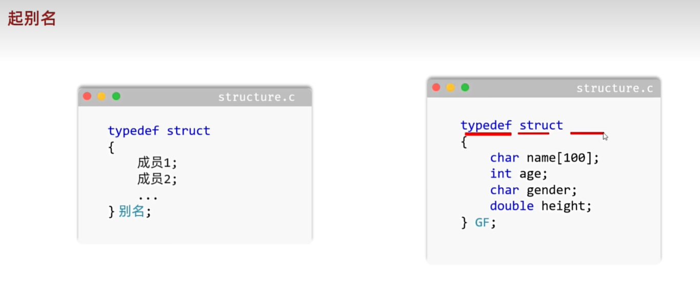

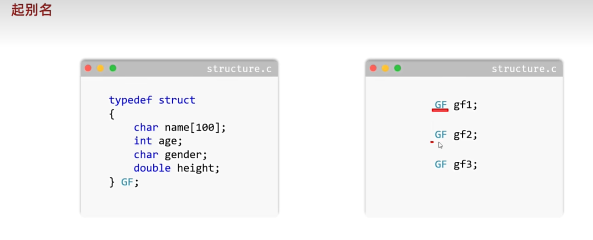

```c
#include <stdio.h>

typedef struct HonorOfKingHero {
    char name[20];  // 姓名
    int attack; // 攻击力
    int defense;  // 防御力
    int hp;  // 血量
} Hero ;


int main(void) {
    /*
        游戏人物
        定义一个结构体表示游戏人物
        属性有：姓名、攻击力、防御力、血量
        要求：把三个游戏人物放入到数组当中，并遍历数组
    */
    Hero hero1 = {"libai", 100, 50, 200};
    Hero hero2 = {"diaochan", 120, 60, 180};
    Hero hero3 = {"zhugeliang", 150, 70, 250};
    Hero heros[3] = {hero1, hero2, hero3};

    // Hero heros[3] = {
    //     {"libai", 100, 50, 200},
    //     {"diaochan", 120, 60, 180},
    //     {"zhugeliang", 150, 70, 250}
    // };

    for (int i=0; i<3; i++) {
        printf("name:%s,attack:%d,defence:%d,hp:%d\n", heros[i].name, heros[i].attack, heros[i].defense, heros[i].hp);
    }

    return 0;
}
```

# 2 结构体作为函数参数

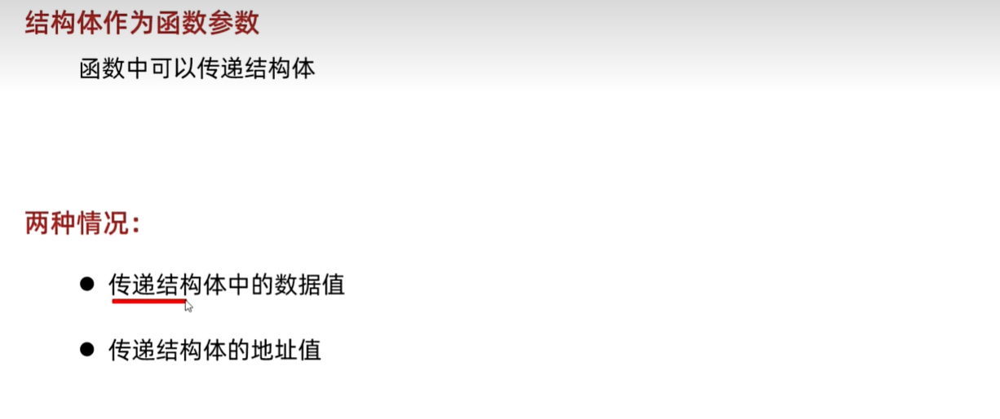

```c
#include <stdio.h>
#include <string.h>

typedef struct Student {
    char name[100];
    int age;
} Stu;
void changeNameAndAge1(Stu arg);
void changeNameAndAge2(Stu *arg);
int main(void) {
    /*
        结构体作为函数参数
        定义一个结构体表示学生
        学生的属性：姓名、年龄
        要求:定义一个函数，修改学生中的数据
    */
    Stu stu1 = {"Tom", 18};
    
    printf("before change: %s %d\n", stu1.name, stu1.age);
    changeNameAndAge2(&stu1);
    printf("after change: %s %d\n", stu1.name, stu1.age);
    return 0;
}

// 细节：
// 如果函数中写的是结构体类型的变量，相当于是定义了一个新的变量
// 此时是吧main函数中stu1中的数据 传递给了method函数 并把stu1中国的数据赋值给了新的变量arg
// 我们在函数中 仅仅是修改了arg中的值，对main函数中stu的值是额你有进行修改的

void changeNameAndAge1(Stu arg) {
    strcpy(arg.name, "Jerry");
    arg.age = 20;
}

// 如果要在函数中修改stu1的值 那么就不要再定义新的变量了
// 直接接受stu1的内存地址 通过内存地址就可以修改
// 指针
// 指针arg记录的是main函数中stu1的内存地址
void changeNameAndAge2(Stu *arg) {
    // 如果要键盘录入 看下面这两行的区别
    // scanf("%s", (*arg).name);  // 本来就是数组首地址 不用加取地址符
    // scanf("%d", &(*arg).age)  // 本来是变量 需要加上取地址符
    strcpy((*arg).name, "Jerry");
    (*arg).age = 20;
}

```

# 3 结构体的嵌套


```c
#include <stdio.h>
#include <string.h>

typedef struct Message {
        char phone[12];
        char email[100];
} Msg;

typedef struct Student {
    char name[100];
    int age;
    char sex;
    double height;
    Msg msg;
}Stu;


int main(void) {
    /*
        结构体嵌套
        定义一个结构体表示学生Student
        Student成员如下：名字、年龄、性别、身高、联系方式
        联系方式Message也是一个结构体，成员如下：
        手机号、电子邮箱
    */

    Stu stu1 = {"zhangsan", 21, 'M', 1.85, {"12345678901", "zhangsan@163.com"}};
    // Stu stu2 = {"lisi", 23, 'F', 1.65, {"1882223333", "lisi@163.com"}};
    // Stu stu3 = {"wangmazi", 23, 'M', 1.78, {"18688887778", "wangwu@163.com"}};

    // 打印输出信息
    printf("name: \t\t%s\n", stu1.name);
    printf("age: \t\t%d\n", stu1.age);
    printf("sex: \t\t%c\n", stu1.sex);
    printf("height: \t%.2lf\n", stu1.height);
    printf("phone: \t\t%s\n", stu1.msg.phone);
    printf("email: \t\t%s\n", stu1.msg.email);

    return 0;
}

```

```c
#include <stdio.h>
#include <string.h>
#include <stdlib.h>
#include <time.h>

struct Spot {
    char name;
    int vote;
};

int main(void) {
    /*
        投票选举某班级组织野外郊游，想要在ABCD四个景点选择其中一个。
        现在班上有80名同学进行投票，找出投票数最多的景点e
        Ps:1，学生投票，用随机数模拟
        2，如果多个景点投票一样的话，A优先于B，B优先于C，C优先于D
    */
    struct Spot spot[4] = {{'A', 0}, {'B', 0}, {'C', 0}, {'D', 0}};

    // 遍历
    for (int i = 0; i < 4; i++) {
        struct Spot temp =  spot[i];
        printf("%c %d \n", temp.name, temp.vote);
    }

    // 模拟投票
    srand(time(NULL));  // 设置种子
    for (int i = 0;i < 80;i ++) {
        // choose含义1:用户的投票 0:A 1:B 2:C 3:D
        // choose含义2:表示spot的索引，通过这个索引就可以获取当前景点的名字和投票数量
        int choose = rand() % 4;  // 0 1 2 3
        spot[choose].vote ++;  // 景点票的数量加1 
    }

    // 遍历
    for (int i = 0; i < 4; i++) {
        struct Spot temp =  spot[i];
        printf("%c %d \n", temp.name, temp.vote);
    }
    // 找出最大票数
    char flag ;
    int max = spot[0].vote;
    for (int i = 1; i < 4; i++) {
        if (spot[i].vote > max) {
            max = spot[i].vote;
            flag = spot[i].name;
        }
    }
    // 按照题目要求 如果得票数相同，按照优先级做出判断
    // 这样的话可以循环遍历每一个结构体数组的元素 判断哪一个vote值最先等于max
    // 这里就不演示了

    printf("The most voted spot is %c with %d votes.\n", flag, max);
    return 0;
}

```

# 4 结构体的内存对齐

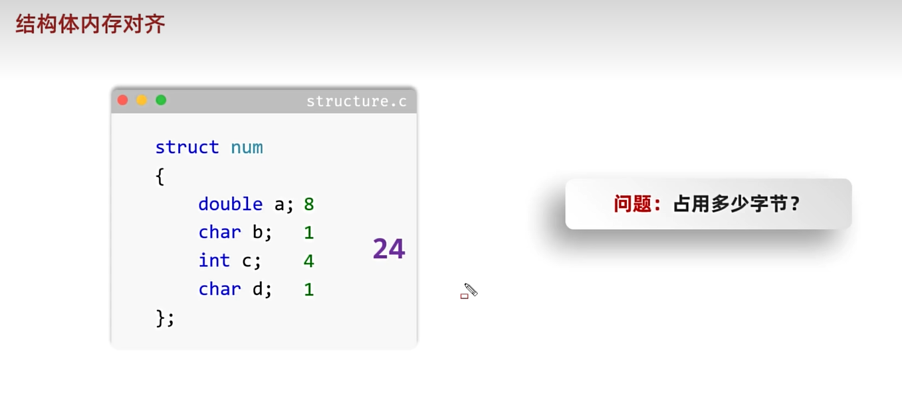

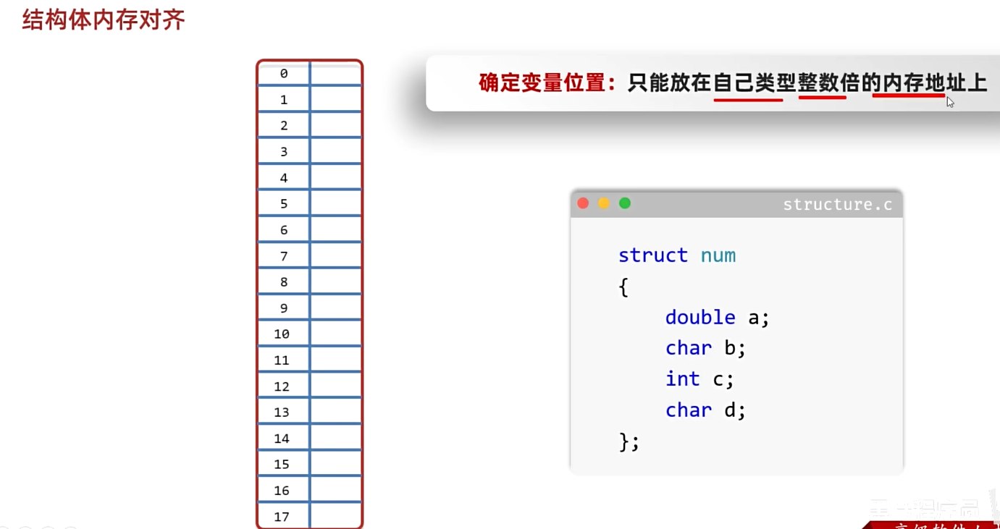

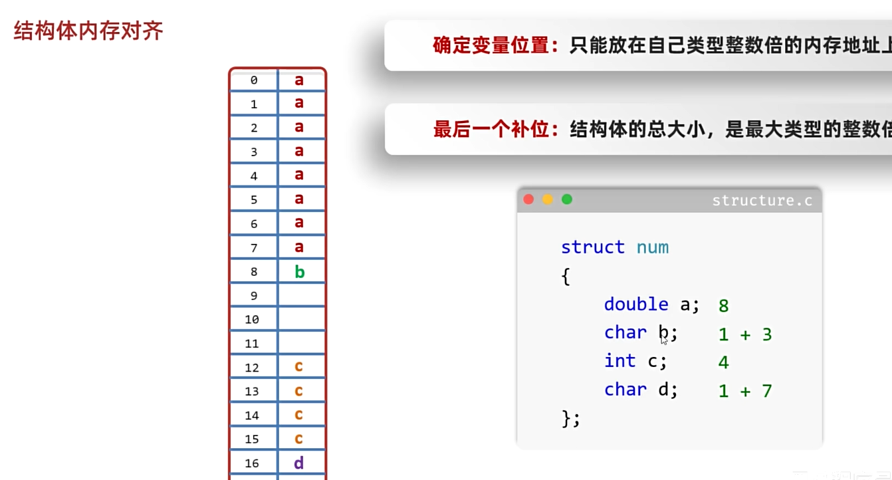

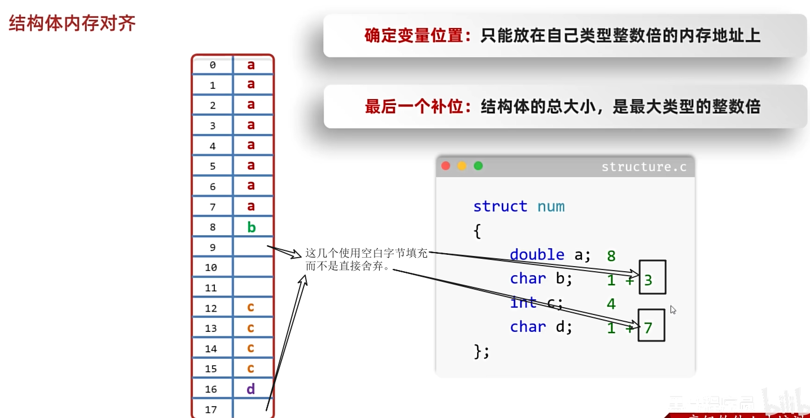

注意：

```c
内存对齐：
    不管是结构体，还是普通的变量都存在内存对齐
    
规则：
    只能放在自己类型整数倍的内存地址上
    
简单理解：
    内存地址／占用字节：结果可以整除
    
举例：
    int存放的位置：内存地址一定能被4整除
	  long long 存放的位置：内存地址一定能被8整除
    double存放的位置：内存地址一定能被8整除
    
结构体的内存对齐：
    结构体在上面的基础上又多了一条，结构体的总大小，是最大类型的整数倍（用来确定最后一个数据补位的情况)
切记！！
    对齐的时候会补空白字节，但是不会改变原本字节的大小char补位之后，本身还是1个字节
```

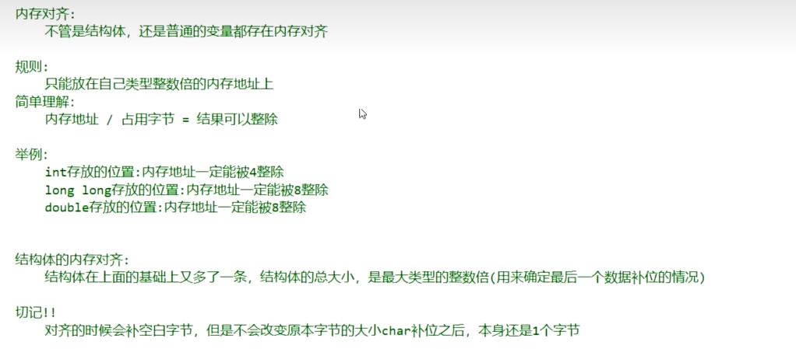

```c
#include <stdio.h>

struct Num {
    double a;
    char b;
    int c;
    char d;
};

struct Num1 {
    double a;
    char b;
    char d;
    int c;
    
};

int main(void) {
    /*
        内存对齐：
            不管是结构体，还是普通的变量都存在内存对齐
            
        规则：
            只能放在自己类型整数倍的内存地址上
            
        简单理解：
            内存地址／占用字节：结果可以整除
            
        举例：
            int存放的位置：内存地址一定能被4整除
            long long 存放的位置：内存地址一定能被8整除
            double存放的位置：内存地址一定能被8整除
            
        结构体的内存对齐：
            结构体在上面的基础上又多了一条，结构体的总大小，是最大类型的整数倍（用来确定最后一个数据补位的情况)
        切记！！
            对齐的时候会补空白字节，但是不会改变原本字节的大小char补位之后，本身还是1个字节
    */
    struct Num num = {125.3, 'b', 26, 'd'};
    int x = sizeof(num);
    printf("%d\n", x);  // 24

    struct Num1 num1 = {125.3, 'b', 'd', 12};
    int y = sizeof(num1);
    printf("%d\n", y);  // 16
    return 0;
}

```

> [!Caution]
>
> 在定义结构体的时候，小的数据类型尽量往上面写，这样比较节约内存。

```c
#include <stdio.h>

struct Num {
    double a;
    char b;
    int c;
    char d;
};

struct Num1 {
    double a;
    char b;
    char d;
    int c;
    
};

struct Num2 {
    char a;
    char b;
    int c;
    double d;
};

int main(void) {
    /*
        内存对齐：
            不管是结构体，还是普通的变量都存在内存对齐
            
        规则：
            只能放在自己类型整数倍的内存地址上
            
        简单理解：
            内存地址／占用字节：结果可以整除
            
        举例：
            int存放的位置：内存地址一定能被4整除
            long long 存放的位置：内存地址一定能被8整除
            double存放的位置：内存地址一定能被8整除
            
        结构体的内存对齐：
            结构体在上面的基础上又多了一条，结构体的总大小，是最大类型的整数倍（用来确定最后一个数据补位的情况)
        切记！！
            对齐的时候会补空白字节，但是不会改变原本字节的大小char补位之后，本身还是1个字节
    */
    struct Num num = {125.3, 'b', 26, 'd'};
    int x = sizeof(num);
    printf("%d\n", x);  // 24

    struct Num1 num1 = {125.3, 'b', 'd', 12};
    int y = sizeof(num1);
    printf("%d\n", y);  // 16

    struct Num2 num2 = {'a', 'b', 12, 126.5};
    int z = sizeof(num2);
    printf("%d\n", z);  // 16
    return 0;
}

```

# 5 共同体

## 5.1 共用体

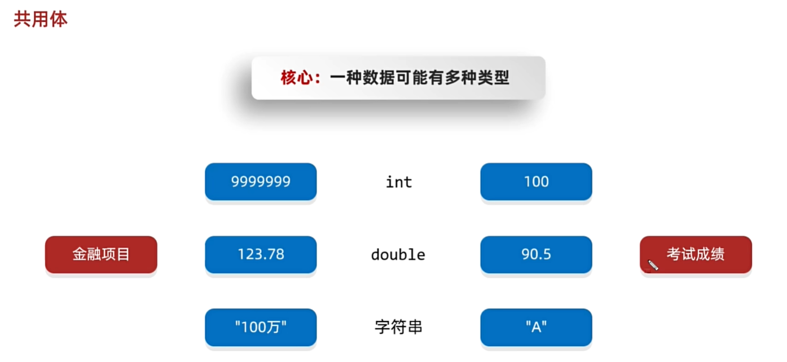

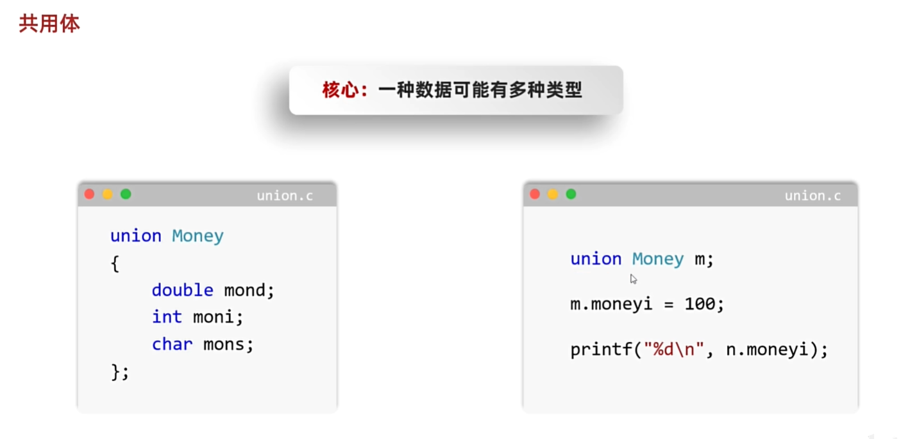

```c
// This is a test file for the community.
// author: wephiles@20866
// time: 2024-07-09 14:28:50

#include <stdio.h>
#include <string.h>

typedef union MoneyType {
    int moneyInt;
    float moneyFloat;
    char moneyString[100];
}MT;

int main(void) {
    /*
    需求：金融项目中，钱有可能是整数，小数，字符串，请定义对应的共同体
    */  
    // 利用共同体定义钱的变量
    union MoneyType salary;
    // MT salary;

    // 赋值
    // 整数moneyInt 小数moneyFloat 字符串moneyString
    // 每次只能赋一个值 赋多个值的时候会出现运行错误 请注意
    salary.moneyInt = 1000;
    // salary.moneyFloat = 1000.54;
    // strcpy(salary.moneyString, "one hundred thousands");

    // 输出打印 上面赋值给哪个类型 下面就从哪个类型取出来
    printf("salary.moneyInt = %d\n", salary.moneyInt);
    // printf("salary.moneyFloat = %lf\n", salary.moneyFloat);
    // printf("salary.moneyString = %s\n", salary.moneyString);
    return 0;
}

```

## 5.2 共用体的特点

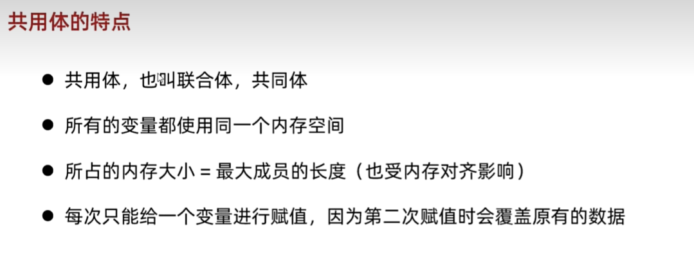

```c
#include <stdio.h>

union TestUnion {
    double d;
    int i;
    char c[100];
};

int main(void) {
    /*
        细节：
            以最大成员的长度为准；
            总大小一定是最大成员的整数倍。
            怎么存就怎么取，否则会出现问题
    */
    union TestUnion un;
    un.d = 3.1415926;
    un.i = 123456789;

    printf("u.d address: %p\n", &un.d);
    printf("u.i address: %p\n", &un.i);
    printf("u.c address: %p\n", &un.c);

    // printf("union size: %zu\n", sizeof(un));  // 104
    // printf("d size: %zu \n", sizeof(un.d));  // 8
    // printf("i size: %zu \n", sizeof(un.i));  // 4
    // printf("c size: %zu \n", sizeof(un.c));  // 100

    return 0;
}

```

## 5.3 结构体和共同体的区别

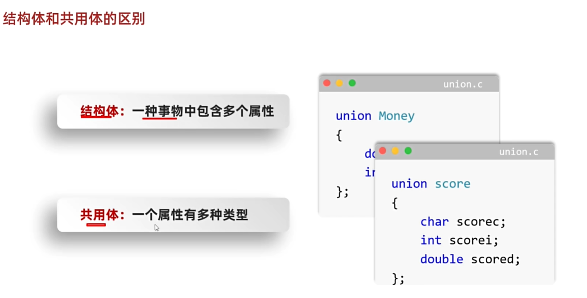

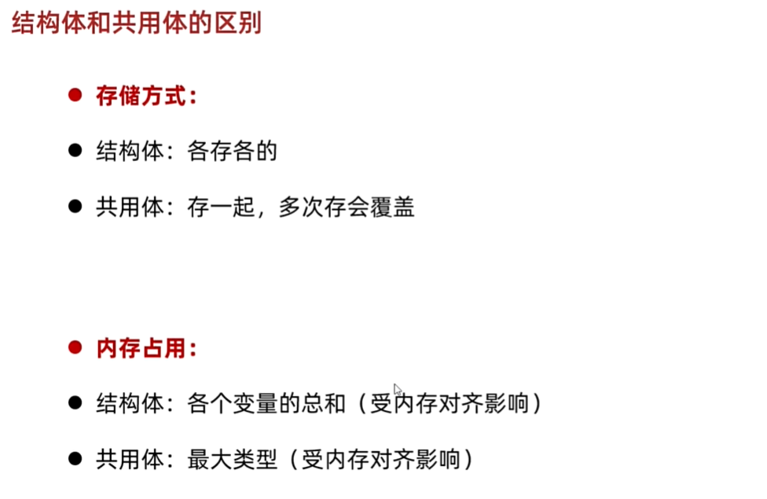


