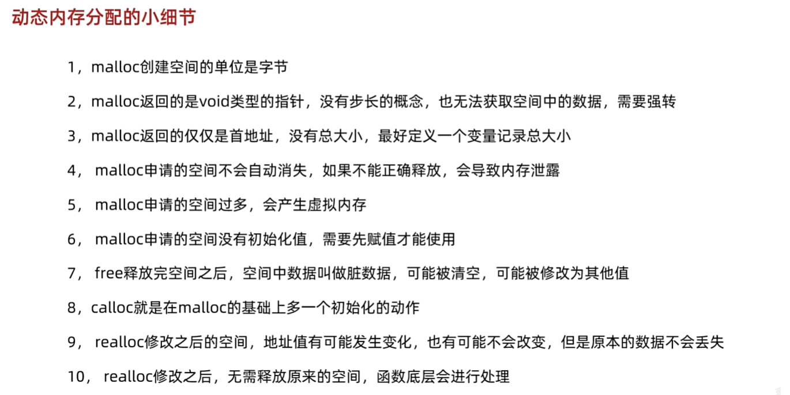
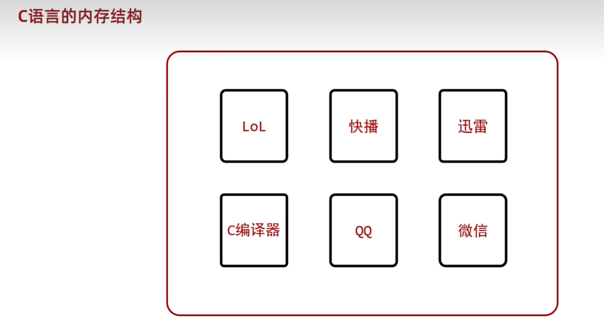
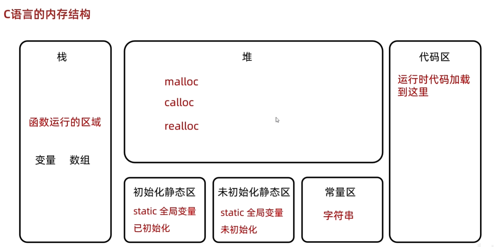
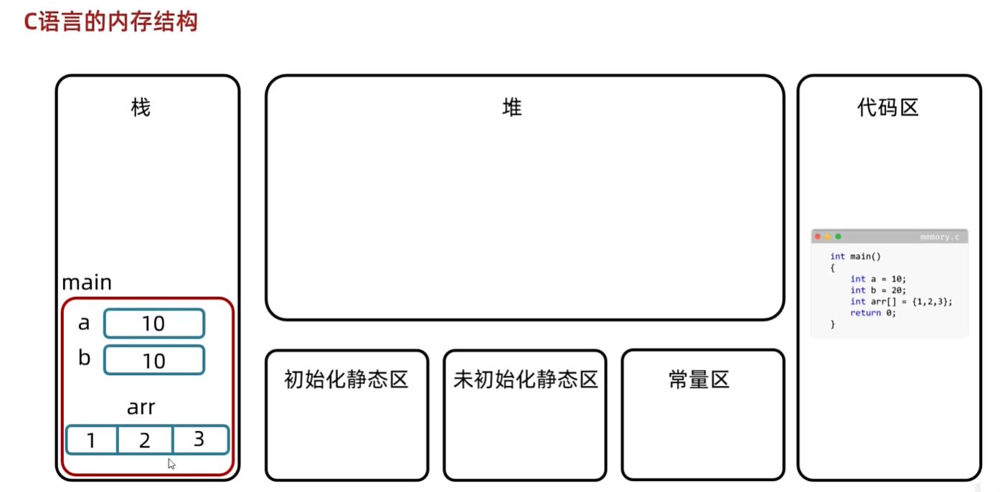
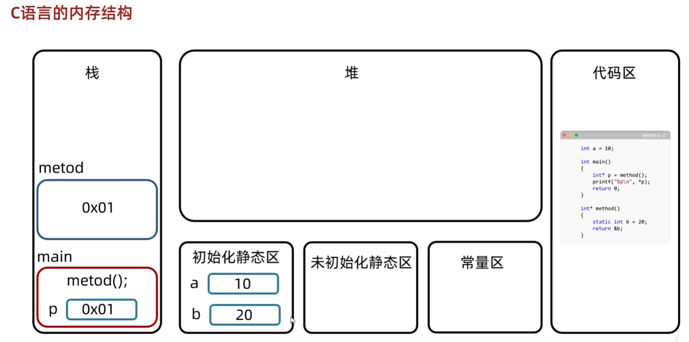
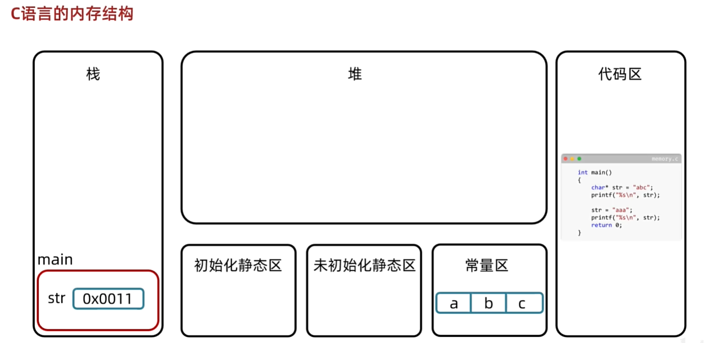
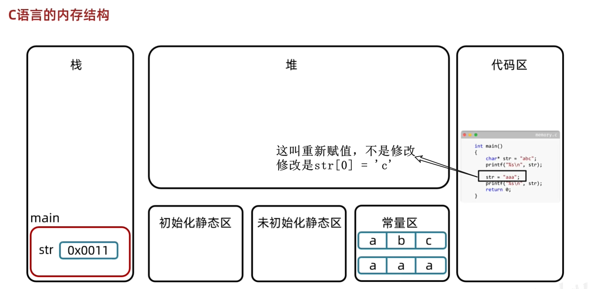
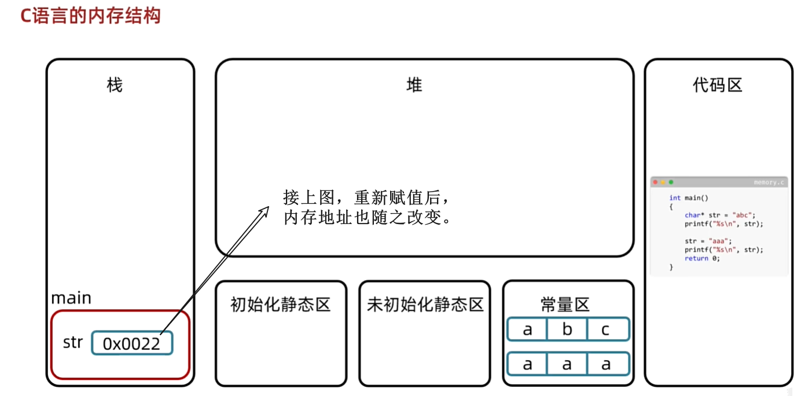
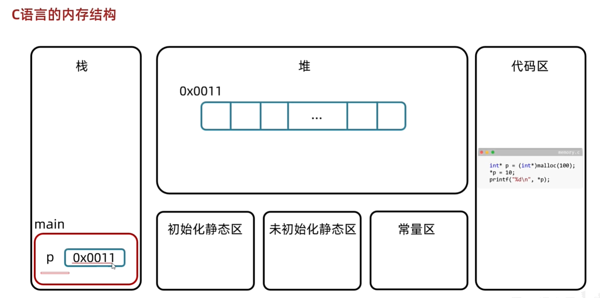

<h1 style="text-align: center; font-family: 'Menlo'">11.动态内存分配</h1>

[TOC]

# 1 动态内存分配


```c
#include <stdio.h>
#include <stdlib.h>

int main() {
    /*
        Memory operation code goes here. 
        These functions are defined in the standard library. 
        So we need to include the stdlib.h header file.

        These function contains: malloc, calloc, realloc and free.

        malloc: 申请连续空间  -- 掌握 效率高
        calloc: 申请空间 + 数据初始化  -- 了解
        realloc: 修改空间大小 -- 了解
        free: 释放空间 -- 掌握
    */

    // 利用malloc申请一片连续空间
    // 申请的空间大小为100个int型数据

    int *p = malloc(100 * sizeof(int));  // malloc返回void*型指针，需要强制类型转换为int*型指针
    // int *p = calloc(10, sizeof(int));  // calloc返回void*型指针，需要强制类型转换为int*型指针


    printf("address of p: %p\n", p);  // 没有赋值 这个值是以前的值
    printf("value of p: %d\n", *p);
    for (int i=0;i<10;i++) {
        *(p + i) = (i + 1) * 10;  // 利用指针运算赋值
        printf("value of p[%d]: %d\n", i, *(p + i));
        // p[i] = i;
        // printf("value of p[%d]: %d\n", i, p[i]);
    }
    printf("\n");
    // 扩容 成为20个大小
    int *q = realloc(p, 20 * sizeof(int));
    for (int i=0;i<20;i++) {
        printf("value of q[%d]: %d\n", i, *(q + i));
    }

    free(q);  // 释放空间 -- 记得一定要释放
    return 0;
}

```

# 2 四个函数的底层细节



```c
#include <stdio.h>
#include <stdlib.h>

int main(void) {
    /*
        1  malloc创建空间的单位是字节
        2  malloc返回的是void类型的指针，没有步长的概念，也无法获取空间中的数据，需要强转 -- 具有通用性
        3  malloc返回的仅仅是首地址，没有总大小，最好定义一个变量记录总大小
        4  malloc申请的空间不会自动消失，如果不能正确释放，会导致内存泄露 -- 及时释放内存
        5  malloc申请的空间过多，会产生虚拟内存
            虚拟内存：当申请的空间过多，因为每一个内存空间不会再刚申请的时候就立马使用
            所以c语言并不会立马就在内存中开辟空间，而是什么时候存储数据了，才会真正的分配空间
            目的：提高内存的使用效率
        6  malloc申请的空间没有初始化值，需要先赋值才能使用
        7  free释放完空间之后，空间中数据叫做脏数据，可能被清空，可能被修改为其他值

        8  calloc就是在malloc的基础上多一个初始化的动作
        9  realloc修改之后的空间，地址值有可能发生变化，也有可能不会改变，但是原本的数据不会丢失
            看原来的空间后面够不够我们分配空间，够了就直接返回原来的地址，不够就重新分配足够的空间。
        10 realloc修改之后，无需释放原来的空间，函数底层会进行处理
            realloc修改之后，无序释放原来的空间，函数底层会进行处理
            如果内存地址没变，底层会在原来的空间后面接着申请
            如果内存地址变了，申请一个新的大空间，将原来的数据拷贝到新的空间中，在将原来的空间free掉。
    */

    /*
    malloc(100);

    int: 能存25个int类型的数
    short: 能存50个
    char: 能存100个
    */

    // // int *：步长
    // // p:首地址
    // int *p = (int *)malloc(25 * sizeof(int));  // 单位是字节 -- 这个例子中 是100字节
    // int size = 25;  // 最多能存多少个int类型的数据
    // void method(int *p, int size);
    // method(p, size);
    // free(p);

    // 5  malloc申请的空间过多，会产生虚拟内存
    int num = 1024 * 1024 * 1024;  // 单次申请空间的字节大小 1GB

    int count = 0;

    // 连续申请空间 如果申请成功 返回首地址 否则返回NULL
    while (1) {
        int *p = malloc(num);
        count ++;
        if (p == NULL) {
            printf("Failed to allocate memory.\n");
            break;
        }
        else {
            printf("%d. Allocated %d bytes at %p.\n", count, num, p);
        }
    }
    return 0;
}

// 遍历数组
void method(int *p, int size) {
    for (int i = 0; i < size; i ++) {
            // 这里进行遍历
            printf("%d ", *(p + i));
        }
}

```

# 3 C语言的内存结构







 








