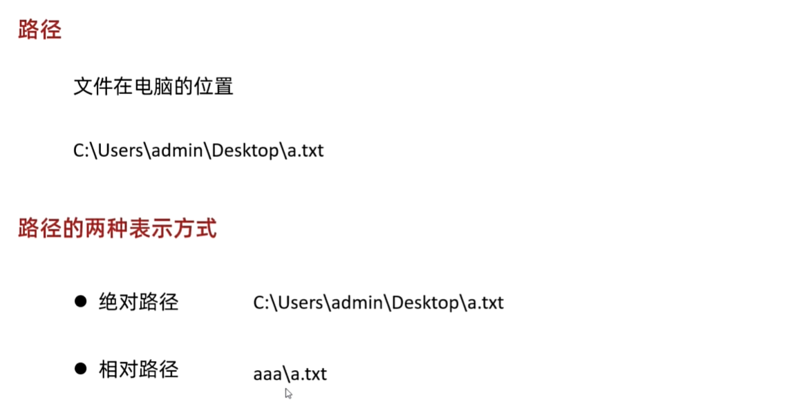
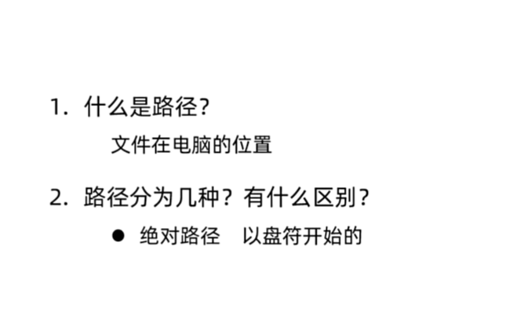
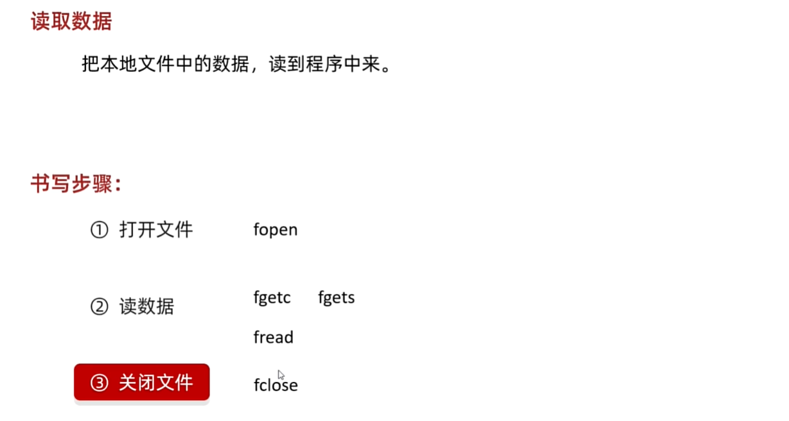
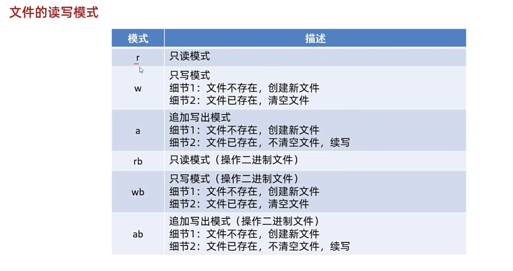
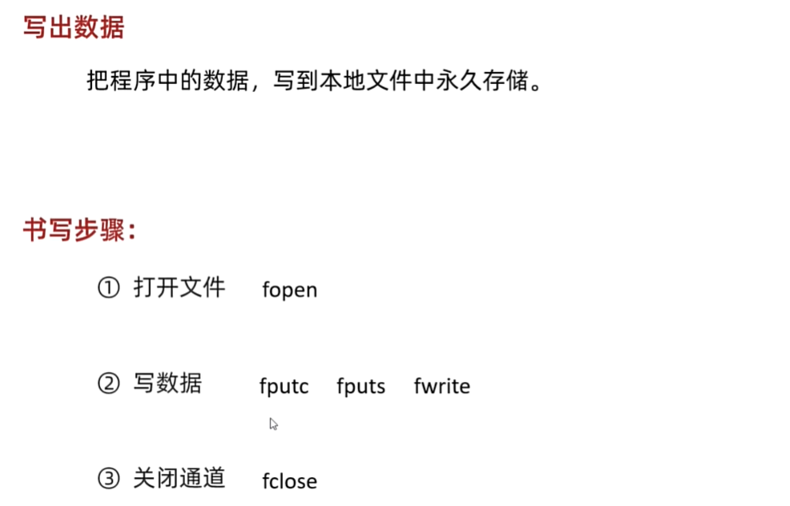
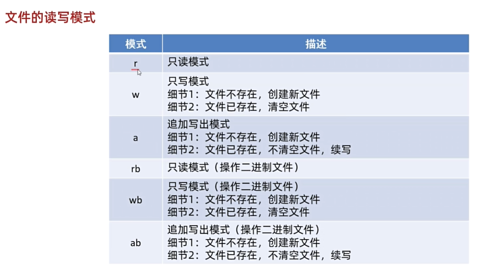
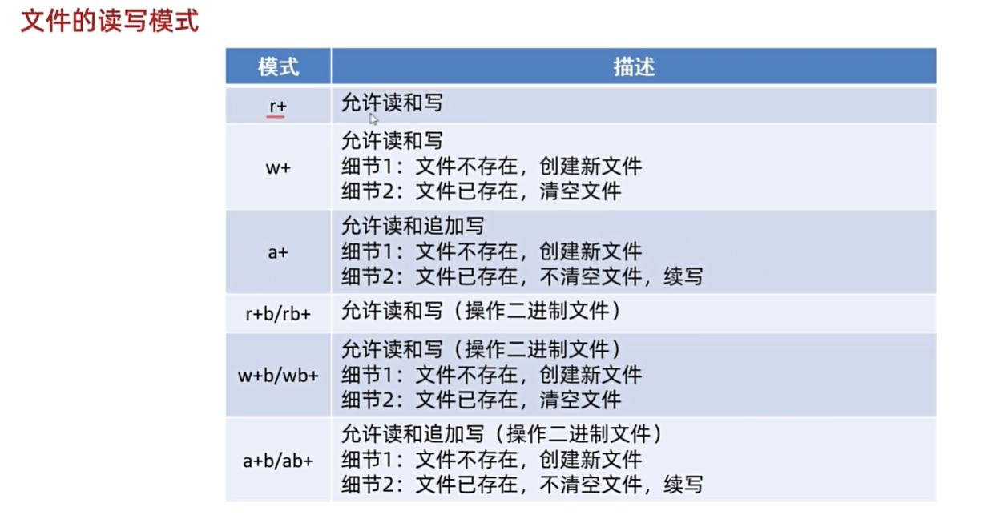

<h1 style="text-align: center; font-family: '楷体'">12.文件</h1>

[TOC]

# 1 文件


# 2 读文件

## 2.1 路径

文件在电脑中的位置。





## 2.2 转义字符`\`

改变其后面一个字符的原本的意思。

```c
#include <stdio.h>

int main(void) {
	/*
	* 绝对路径：
	* 	以盘符开始，c：\aaa\a.txt
	* 相对路径：
	*	不以盘符开始，aaa\a.txt
	* \:在字符串里面叫做转义字符
	*/

	// 路径以字符串的形式存储
	char* file = "F:\\TextFiles\\TxtFiles\\aaa.txt";
	printf("%s \n", file);

	printf("\"\n");
	printf("\\\n");
	return 0;
}
```

## 2.3 读取数据

 



`fgetc`

```c
#include <stdio.h>

int main(void) {
	/*
	* 绝对路径：
	* 	以盘符开始，c：\aaa\a.txt
	* 相对路径：
	*	不以盘符开始，aaa\a.txt
	* \:在字符串里面叫做转义字符
	* 
	* 打开文件：fopen 
	* 写出数据：
	*	fgetc一次读一个字符，读不到返回-1
	*   fgets 一次读一行，读不到返回nu11
	*   fread 一次读多个
	*   fclose 关闭文件
	* 
	* F:\\TextFiles\\TxtFiles\\aaa.txt
	*/

	// 路径以字符串的形式存储
	char* file_path = "F:\\TextFiles\\TxtFiles\\aaa.txt";

	// 打开文件
	FILE * file = fopen(file_path, "r"); // 打开文件

	// 读取数据
	// 一次读一个字符 如果读到了 返回读取到的字符 如果没读到，返回-1
	//int c = fgetc(file);
	//printf("read from file: %c \n", c);  // a

	//c = fgetc(file);
	//printf("read from file: %c \n", c);  // b

	//c = fgetc(file);
	//printf("read from file: %c \n", c);  // c

	//c = fgetc(file);
	//printf("read from file: %d \n", c);  // 10 为什么不是-1

	//c = fgetc(file);
	//printf("read from file: %d \n", c);  // -1
	int c;
	while ((c = fgetc(file)) != -1) {
		printf("%c ", c);
	}

	// 关闭文件
	fclose(file);
	return 0;
}

```

`fgets`

```c
#include <stdio.h>

int main(void) {
    char *file_path = "F:\\TextFiles\\TxtFiles\\aaa.txt";

    // 打开文件
    FILE *fp = fopen(file_path, "r");

    // 读取文件内容
    char string[1024];

    // // fgets细节 
    // // 每次读取一行数据，以换行符为准
    // // 读不到了，返回null
    // // 
    // char *result = fgets(string, 1024, fp);

    // // printf("%s \n", string);
    // printf("%s \n", result);

    // char *result1 = fgets(string, 1024, fp);

    // // printf("%s \n", string);
    // printf("%s \n", result1);

    // char *result2 = fgets(string, 1024, fp);

    // // printf("%s \n", string);
    // printf("%s \n", result2);  // (null)

    // 循环读取
    char *str;
    while ((str = fgets(string, 1024, fp)) != NULL) {
        printf("%s", str);
    }


    // 关闭文件
    fclose(fp);
    return 0;
}

```

`fread`

```c
#include <stdio.h>

int main(void) {
    char *file_path = "F:\\TextFiles\\TxtFiles\\aaa.txt";

    // 打开文件
    FILE *fp = fopen(file_path, "r");

    // 读取文件内容
    /*
        细节：英文一个字符占一个字节 中文字符一个字符占两个字节
        在读取的时候，每次经可能将数组给装满，返回当前读取的有效字节个数。
        文件：100个字节
        数组长度：30
        第一次：读取前面30个字节，将数组给装满，函数返回30
        第二次：读取后面30个字节，将数组装满，函数返回30
        第三次：读取后面30个字节，将数组装满，函数返回30
        第四次：读取剩余10个字节，将数据放在数组中国，函数返回10
        第五次：没有数据可以读取了，返回0
    */
    char array[1024];
    // 第一个参数是存储数据的数组 第二个参数是每个数组元素占用多大字节 第三个是要用这个数组多大的空间存储读到的字符 第四个是文件指针
    int n = fread(array, 1, 1024, fp);  // n代表读到的字节个数
    
    // 输出文件内容
    printf("counts of bytes: %d\n", n);
    printf("%s \n", array);

    // // 第二种方式：循环读取文件内容 -- 这种不会读取后面没有赋值的数据 -- 推荐这种方式
    // char array[1024];
    // int n;
    // while ((n = fread(array, 1, 1024, fp)) != 0) {
    //     for (int i = 0; i < n; i++) {
    //         printf("%c", array[i]);
    //     }
    // }

    // 关闭文件
    fclose(fp);

    return 0;
}
```

# 3 写文件



```c
#include <stdio.h>

int main(void) {
    /*
        打开文件：fopen
        
        写出数据：
        fputc一次写一个字符，返回写出的字符
        fputs一次写一个字符串，写出成功返回非数，一般忽略返回值
        fwrite一次读多个，返回写出的个数

        关闭文件：fclose
    */
    char *file_path = "aaa.txt";

    // 打开文件
    FILE *fp = fopen(file_path, "w");

    // 写数据 fputc 一次写一个字符，返回写出的字符
    char c = fputc(97, fp);  // 写出'a'
    printf("%c\n", c);

    // 写数据 fputs 一次写一个字符串，写出成功返回非数，一般忽略返回值 如果写出失败 返回一个EOF错误end of file -- 文件装满了
    int n = fputs("bcdefg", fp);
    printf("%d\n", n);  // 写出成功返回一个非负数

    // 写数据 fwrite 一次读多个，返回写出的个数
    // 第一个，写入的内容 第二个，数组每个元素占多少字节 第三个，写多少数据（一般写数组长度） 最后一个要写入的文件
    char array[] = {97, 98, 99, 100, 101, 102};

    int n1 = fwrite(array, 1, 6, fp);
    printf("%d\n", n1);  // 写出成功返回6个字符

    // 关闭文件
    fclose(fp);
    return 0;
}

```

# 4 读写模式



```c
#include <stdio.h>

int main(void) {
    /*
        This is a test file for file operation.

        读写模式。
        r：read   只写模式，不能写，如果强行写出，数据是无法写到本地文件的。
        w：write  只读模式
            细节1：如果文件不存在，那么会将文件创建出来，但是需要保证文件目录上的文件夹是存在的
            细节2：如果文件存在，会把文件清空
            细节3：上面的创建或者清空，都是fopen这个函数底层干的事情
        a：append 追加写出模式
            细节1：如果文件不存在，那么会将文件创建出来，但是需要保证文件目录上的文件夹是存在的
            细节2：如果文件存在，不会把文件清空，而是接着写
            细节3：上面的创建或者清空，都是fopen这个函数底层干的事情
    */
    
    return 0;
}

```



# 5 文件的拷贝

```c
#include <stdio.h>

int main(void) {
    /*
    练习：
        利用代码拷贝文件
    要求：
        把"F:\TextFiles\TxtFiles\aaa.txt"拷贝到桌面的"F:\TextFiles\TxtFiles\aaa"文件夹中
    */

    // 打开aaa.txt文件 -- 数据源
    FILE *file1 = fopen("F:\\TextFiles\\TxtFiles\\aaa.txt", "r");

    // 打开aaa文件夹下面的aaa.txt文件 -- 数据目的地
    FILE *file2 = fopen("F:\\TextFiles\\TxtFiles\\aaa\\copy.txt", "w");

    // 循环读取文件内容并写入到目标文件中
    char array[1024];
    int n;
    while ( (n = fread(array, 1, 1024, file1)) != 0) {
        fwrite(array, 1, n, file2);
    }

    fclose(file1);
    fclose(file2);
    return 0;
}

```


