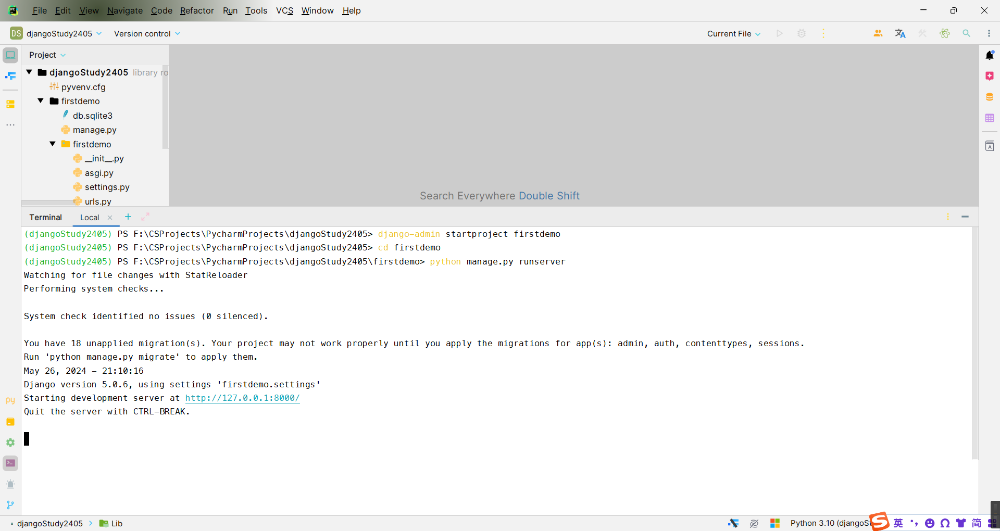
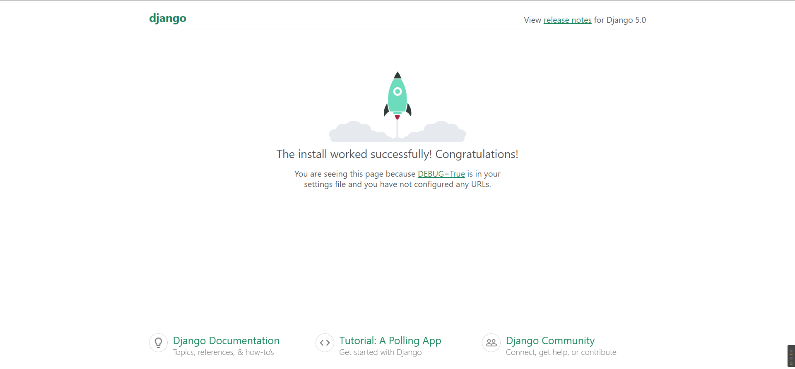
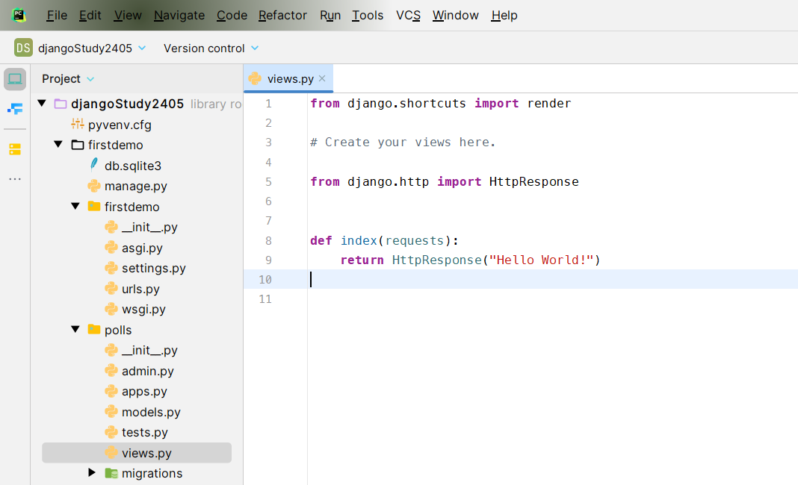
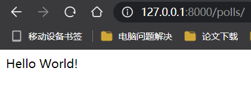

# 创建`Django`项目

以一个案例来学习`django`   -- 投票应用

```python
>>> django-admin startproject django项目名
```

创建了什么

```python
django项目名/
    manage.py
    django项目名/
        __init__.py
        settings.py
        urls.py
        asgi.py
        wsgi.py
```

- 最外层的 `django项目名/` 根目录只是你项目的容器， 根目录名称对 `Django`没有影响，你可以将它重命名为任何你喜欢的名称。

- `manage.py`: 一个让你用各种方式管理 Django 项目的命令行工具。你可以阅读 [django-admin 和 manage.py](https://docs.djangoproject.com/zh-hans/5.0/ref/django-admin/) 获取所有 `manage.py` 的细节。

- 里面一层的 `django项目名/` 目录包含你的项目，它是一个纯 `Python` 包。它的名字就是当你引用它内部任何东西时需要用到的 Python 包名。 (比如 `django项目名.urls`).

- `mysite/__init__.py`：一个空文件，告诉 Python 这个目录应该被认为是一个 Python 包。如果你是 Python 初学者，阅读官方文档中的 [更多关于包的知识](https://docs.python.org/3/tutorial/modules.html#tut-packages)。

- `mysite/settings.py`：Django 项目的配置文件。如果你想知道这个文件是如何工作的，请查看 [Django 配置](https://docs.djangoproject.com/zh-hans/5.0/topics/settings/) 了解细节。
- `mysite/urls.py`：Django 项目的 URL 声明，就像你网站的“目录”。阅读 [URL调度器](https://docs.djangoproject.com/zh-hans/5.0/topics/http/urls/) 文档来获取更多关于 URL 的内容。
- `mysite/asgi.py`：作为你的项目的运行在 ASGI 兼容的 Web 服务器上的入口。阅读 [如何使用 ASGI 来部署](https://docs.djangoproject.com/zh-hans/5.0/howto/deployment/asgi/) 了解更多细节。
- `mysite/wsgi.py`：作为你的项目的运行在 WSGI 兼容的Web服务器上的入口。阅读 [如何使用 WSGI 进行部署](https://docs.djangoproject.com/zh-hans/5.0/howto/deployment/wsgi/) 了解更多细节。

==后文 我创建的`django`项目名称是`firstdemo`==

切换到我们刚创建的`django项目名`目录下：

然后运行下面这条命令：

```python
>>> python manage.py runserver
```

如果运行成功了，那么就会显示下面这样的：



你已经启动了 Django 开发服务器，这是一个用纯 Python 编写的轻量级网络服务器。我们在 Django 中包含了这个服务器，所以你可以快速开发，而不需要处理配置生产服务器的问题 -- 比如 Apache -- 直到你准备好用于生产。

现在是个提醒你的好时机：**千万不要** 将这个服务器用于和生产环境相关的任何地方。这个服务器只是为了开发而设计的。（我们在网络框架方面是专家，在网络服务器方面并不是。）

服务器现在正在运行，通过浏览器访问 http://127.0.0.1:8000/ 。你将看到一个“祝贺”页面，有一只火箭正在发射。你成功了！



- 更换端口

默认情况下，[`runserver`](https://docs.djangoproject.com/zh-hans/5.0/ref/django-admin/#django-admin-runserver) 命令会将服务器设置为监听本机内部 IP 的 8000 端口。

如果你想更换服务器的监听端口，请使用命令行参数。举个例子，下面的命令会使服务器监听 8080 端口：

```
$ python manage.py runserver 8080
```

如果你想要修改服务器监听的IP，在端口之前输入新的。比如，为了监听所有服务器的公开IP（这你运行 Vagrant 或想要向网络上的其它电脑展示你的成果时很有用），使用：

```
$ python manage.py runserver 0.0.0.0:8000
```

关于这个简易服务器的完整信息可以在 [`runserver`](https://docs.djangoproject.com/zh-hans/5.0/ref/django-admin/#django-admin-runserver) 文档中找到。

会自动重新加载的服务器 [`runserver`](https://docs.djangoproject.com/zh-hans/5.0/ref/django-admin/#django-admin-runserver)

用于开发的服务器在需要的情况下会对每一次的访问请求重新载入一遍 Python 代码。所以你不需要为了让修改的代码生效而频繁的重新启动服务器。然而，一些动作，比如添加新文件，将不会触发自动重新加载，这时你得自己手动重启服务器。

现在你的开发环境——这个“项目” ——已经配置好了，你可以开始干活了。

在 Django 中，每一个应用都是一个 Python 包，并且遵循着相同的约定。Django 自带一个工具，可以帮你生成应用的基础目录结构，这样你就能专心写代码，而不是创建目录了。

- 项目 VS 应用

项目和应用有什么区别？应用是一个专门做某件事的网络应用程序——比如博客系统，或者公共记录的数据库，或者小型的投票程序。项目则是一个网站使用的配置和应用的集合。项目可以包含很多个应用。应用可以被很多个项目使用。

你的应用可以存放在任何 [Python 路径](https://docs.python.org/3/tutorial/modules.html#tut-searchpath) 中定义的路径。在这个教程中，我们将在你的 `manage.py` 同级目录下创建投票应用。这样它就可以作为顶级模块导入，而不是 `mysite` 的子模块。

# 创建应用

请确定你现在处于 `manage.py` 所在的目录下，然后运行这行命令来创建一个应用：

```python
>>> python manage.py startapp polls
```

这将创建一个名为 `polls` 的目录，其布局如下：

```python
polls/
    __init__.py
    admin.py
    apps.py
    migrations/
        __init__.py
    models.py
    tests.py
    views.py
```

这个目录结构包括了投票应用的全部内容。

# 编写第一个视图

在`polls/views.py`：

```python
from django.http import HttpResponse

def index(requests):
    return HttpResponse("Hello World!")
```



这是 `Django `中最简单的视图。如果想看见效果，我们需要将一个 `URL `映射到它——这就是我们需要 `URLconf `的原因了。

要在 `polls `目录中创建一个 `URL `配置，请**创建一个名为 `urls.py` 的文件**。现在你的应用程序目录应该如下所示：

```
polls/
    __init__.py
    admin.py
    apps.py
    migrations/
        __init__.py
    models.py
    tests.py
    urls.py
    views.py
```

在polls/urls.py里面：
```python
from django.urls import path

from . import views

urlpatterns = {
    path("", views.index, name="index"),
}
```

下一步是要在根 URLconf 文件中指定我们创建的 `polls.urls` 模块。在 `mysite/urls.py` 文件的 `urlpatterns` 列表里插入一个 `include()`， 如下：

firstdemo/urls.py

里面本来有：

```
from django.contrib import admin
from django.urls import path

urlpatterns = [
    path("admin/", admin.site.urls),
]
```

我们要再添加一点东西

```
from django.contrib import admin
from django.urls import include, path

urlpatterns = [
    path("polls/", include("polls.urls")),
    path("admin/", admin.site.urls),
]
```

函数 [`include()`](https://docs.djangoproject.com/zh-hans/5.0/ref/urls/#django.urls.include) 允许引用其它 `URLconfs`。每当 `Django `遇到 [`include()`](https://docs.djangoproject.com/zh-hans/5.0/ref/urls/#django.urls.include) 时，它会截断与此项匹配的 `URL `的部分，并将剩余的字符串发送到 `URLconf `以供进一步处理。

我们设计 [`include()`](https://docs.djangoproject.com/zh-hans/5.0/ref/urls/#django.urls.include) 的理念是使其可以即插即用。因为投票应用有它自己的 `URLconf`( `polls/urls.py` )，他们能够被放在 `"/polls/" `， `"/fun_polls/" `，`"/content/polls/"`，或者其他任何路径下，这个应用都能够正常工作。

何时使用 [`include()`](https://docs.djangoproject.com/zh-hans/5.0/ref/urls/#django.urls.include)

当包括其它 URL 模式时你应该总是使用 `include()` ， `admin.site.urls` 是唯一例外。

你现在把 `index` 视图添加进了 URLconf。通过以下命令验证是否正常工作：

如果你已经运行了`>>> python manange.py runserver`那么你可以不用再重新启动`server`,如果你还没有运行，那么你需要运行一下了。



函数 [`path()`](https://docs.djangoproject.com/zh-hans/5.0/ref/urls/#django.urls.path) 具有四个参数，两个必须参数：`route` 和 `view`，两个可选参数：`kwargs` 和 `name`。现在，是时候来研究这些参数的含义了。

### [`path()`](https://docs.djangoproject.com/zh-hans/5.0/ref/urls/#django.urls.path) 参数： `route`[¶](https://docs.djangoproject.com/zh-hans/5.0/intro/tutorial01/#path-argument-route)

`route` 是一个匹配 URL 的准则（类似正则表达式）。当 Django 响应一个请求时，它会从 `urlpatterns` 的第一项开始，按顺序依次匹配列表中的项，直到找到匹配的项。

这些准则不会匹配 GET 和 POST 参数或域名。例如，URLconf 在处理请求 `https://www.example.com/myapp/` 时，它会尝试匹配 `myapp/` 。处理请求 `https://www.example.com/myapp/?page=3` 时，也只会尝试匹配 `myapp/`。

### [`path()`](https://docs.djangoproject.com/zh-hans/5.0/ref/urls/#django.urls.path) 参数： `view`[¶](https://docs.djangoproject.com/zh-hans/5.0/intro/tutorial01/#path-argument-view)

当 Django 找到了一个匹配的准则，就会调用这个特定的视图函数，并传入一个 [`HttpRequest`](https://docs.djangoproject.com/zh-hans/5.0/ref/request-response/#django.http.HttpRequest) 对象作为第一个参数，被“捕获”的参数以关键字参数的形式传入。稍后，我们会给出一个例子。

### [`path()`](https://docs.djangoproject.com/zh-hans/5.0/ref/urls/#django.urls.path) 参数： `kwargs`[¶](https://docs.djangoproject.com/zh-hans/5.0/intro/tutorial01/#path-argument-kwargs)

任意个关键字参数可以作为一个字典传递给目标视图函数。本教程中不会使用这一特性。

### [`path()`](https://docs.djangoproject.com/zh-hans/5.0/ref/urls/#django.urls.path) 参数： `name`[¶](https://docs.djangoproject.com/zh-hans/5.0/intro/tutorial01/#path-argument-name)

为你的 URL 取名能使你在 Django 的任意地方唯一地引用它，尤其是在模板中。这个有用的特性允许你只改一个文件就能全局地修改某个 URL 模式。

当你了解了基本的请求和响应流程后，请阅读 [教程的第 2 部分](https://docs.djangoproject.com/zh-hans/5.0/intro/tutorial02/) 开始使用数据库.

# 使用数据库


