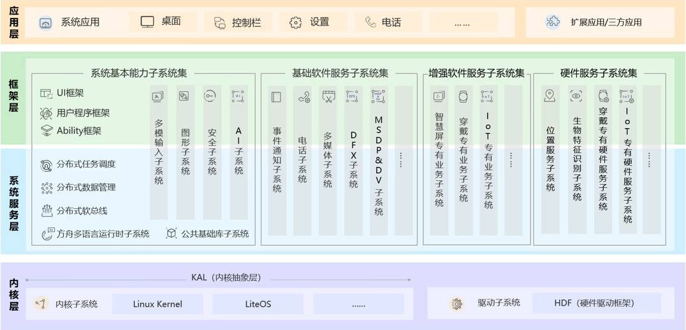
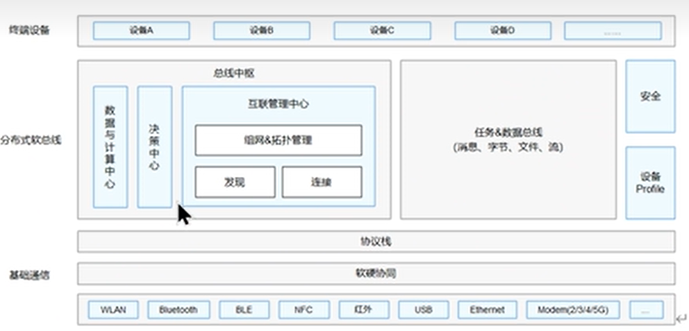
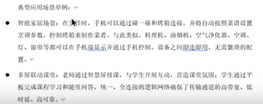
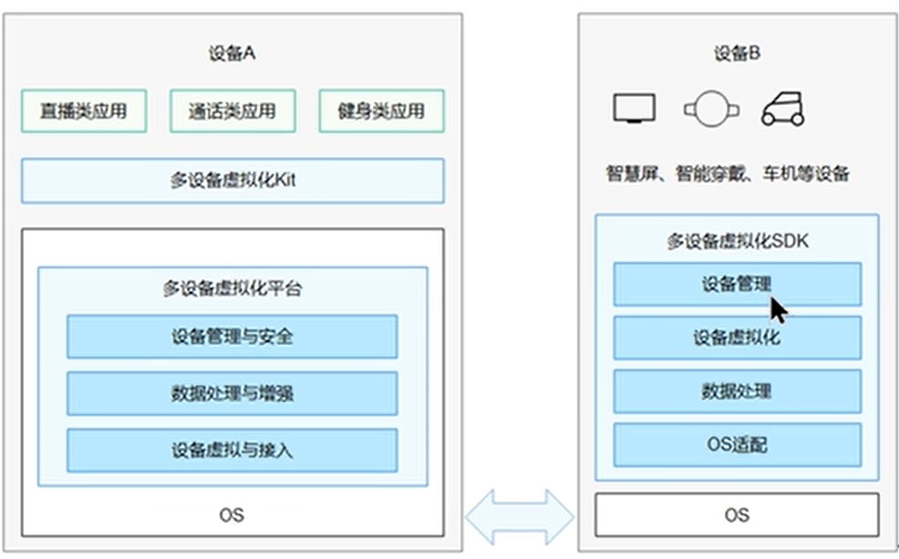
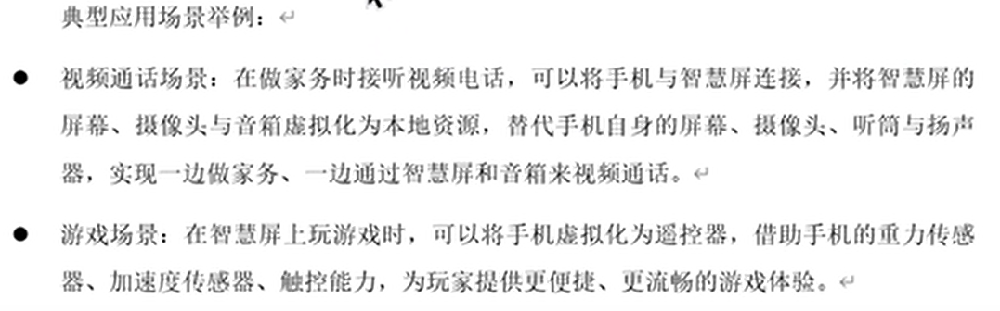
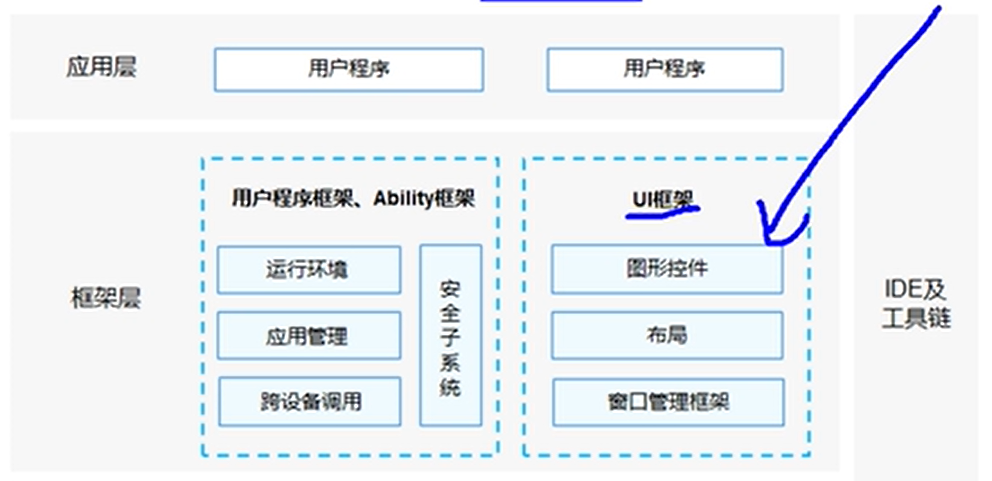

<h1 style="text-align: center;font-size: 40px; font-family: '楷体';">HarmonyOS-4.0 应用开发</h1>

# 1 HarmonyOS概述

## 1.1 系统定义

### 1.1.1 系统定位

- 全新的分布式`OS`。

- `HarmonyOS`三大特征:
    - 在系统层面融为一体 链接硬件 超级终端 -- 资源共享
    - 面向开发者，一次开发 多端部署
    - 一套操作系统可以满足不同能力的设备需求 实现统一`OS`弹性部署 -- 支持多种开发语言的`API`。支持的开发语言包括`ArkTS`语言(推荐)，`JS`、`C/C++`、`Java`。

### 1.1.2 技术框架

- 整体遵循分层框架 
- 从下到上：内核层 --> 系统服务层 --> 框架层 --> 应用层
- 系统功能：系统 --> 子系统 --> 功能/模块

#### 1.1.2.1 内核层

- 内核子系统：`HarmonyOS`.采用多内核设计，支持针对不同资源受限设备选用适合的`OS`内核。内核抽象层（`KAL`，`KernelAbstractLayer`）通过屏蔽多内核差异，对上层提供基础的内核能力，包括进程/线程管理、内存管理、文件系统、网络管理和外设管理等。
- 驱动子系统：硬件驱动框架（`HDF`）是`HarmonyOS`硬件生态开放的基础，提供统一外设访问能力和驱动开发、管理框架。驱动程序是由第三方开发的程序。

#### 1.1.2.2 系统服务层

系统服务层是`HarmonyOS`的核心能力集合，通过框架层对应用程序提供服务。该层包含以下几个部分：

- 系统基本能力子系统集：为分布式应用在`HarmonyOS`.多设备上的运行、调度、迁移等操作提供了基础能力，由分布式软总线、分布式数据管理、分布式任务调度、方舟多语言运行时、公共基础库、多模输入、图形、安全、`AI`等子系统组成。其中，方舟运行时提供了`C/C++/JS`多语言运行时和基础的系统类库，也为使用方舟编译器静态化的`Java`程序（即应用程序或框架层中使用`Java`语言开发的部分）提供运行时。
- 基础软件服务子系统集：为`HarmonyOS`.提供公共的、通用的软件服务，由事件通知、电话、多媒体、`DFX`（`DesignFor X`）、`MSDP&DV` 等子系统组成。
- 增强软件服务子系统集：为`HarmonyOS`提供针对不同设备的、差异化的能力增强型软件服务，由智慧屏专有业务、穿戴专有业务、`IoT`专有业务等子系统组成。
- 硬件服务子系统集：为`HarmonyOS`提供硬件服务，由位置服务、生物特征识别、穿戴专有硬件服务、`IoT`专有硬件服务等子系统组成。

根据不同设备形态的部署环境，基础软件服务子系统集、增强软件服务子系统集、硬件服务子系统集内部可以按子系统粒度裁剪，每个子系统内部又可以按功能粒度裁剪。

#### 1.1.2.3 框架层

框架层为`HarmonyOS`应用开发提供了`ArkTS/JS/C/C++/Java`等多语言的用户程序框架，两种`UI`框架（包括适用于`ArkTS／JS`语言的方舟开发框架即`ArkUI`、适用于`Java` 语言的`JavaUI` 框架），以及各种软硬件服务对外开放的多语言框架`API`。根据系统的组件化裁剪程度，`HarmonyOs`设备支持的`API`也会有所不同。

#### 1.1.2.4 应用层

应用层包括系统应用和第三方非系统应用。`HarmonyOs`.的应用由一个或多个`FA`（`Feature Ability`）或 `PA`（`Particle Ability`）组成。其中，`FA` 有`UI` 界面，提供与用户交互的能力；而`PA`无`UI`界面，提供后台运行任务的能力以及统一的数据访问抽象。`FA`在进行用户交互时所需的后台数据访问也需要由对应的`PA`提供支撑。基于`FA/PA`开发的应用，能够实现特定的业务功能，支持跨设备调度与分发，为用户提供一致、高效的应用体验。

## 1.2 技术特性

### 1.2.1 硬件互助、资源共享

多种设备之间能够实现硬件互助、资源共享，依赖的关键技术包括分布式软总线、分布式设备虚拟化、分布式数据管理、分布式任务调度等。

#### 1.2.1.1 分布式软总线

分布式软总线是手机、平板、智能穿戴、智慧屏、车机等分布式设备的通信基座，为设备之间的互联互通提供了统一的分布式通信能力，为设备之间的无感发现和零等待传输创造了条件。开发者只需聚焦于业务逻辑的实现，无需关注组网方式与底层协议。分布式软总线示意图如下。

#### 1.2.1.2 分布式设备虚拟化

分布式设备虚拟化平台可以实现不同设备的资源融合、设备管理、数据处理，多种设备共同形成一个超级虚拟终端。针对不同类型的任务，为用户匹配并选择能力合适的执行硬件，让业务连续地在不同设备间流转，充分发挥不同设备的能力优势，如显示能力、摄像能力、音频能力、交互能力以及传感器能力等。分布式设备虚拟化示意图如下。

#### 1.2.1.3 分布式数据管理

分布式数据管理基于分布式软总线的能力，实现应用程序数据和用户数据的分布式管理。用户数据不再与单一物理设备绑定，业务逻辑与数据存储分离，跨设备的数据处理如同本地数据处理一样方便快捷，让开发者能够轻松实现全场景、多设备下的数据存储、共享和访问，为打造一致、流畅的用户体验创造了基础条件。分布式数据管理示意图如下。

#### 1.2.1.4 分布式任务调度

分布式任务调度基于分布式软总线、分布式数据管理、分布式Profile等技术特性，构建统一的分布式服务管理（发现、同步、注册、调用）机制，支持对跨设备的应用进行远程启动、远程调用、远程连接以及迁移等操作，能够根据不同设备的能力、位置、业务运行状态、资源使用情况，以及用户的习惯和意图，选择合适的设备运行分布式任务。

#### 1.2.1.5 分布式连接能力

分布式连接能力提供了智能终端底层和应用层的连接能力，通过USB接口共享终端部分硬件资源和软件能力。开发者基于分布式连接能力，可以开发相应形态的生态产品为消

### 1.2.2 一次开发，多端部署

`HarmonyOS`提供了用户程序框架、`Ability`框架以及`UI`框架，支持应用开发过程中多终端的业务逻辑和界面逻辑进行复用，能够实现应用的一次开发、多端部署，提升了跨设备应用的开发效率。一次开发、多端部署示意图见下图。（其中，`UI`框架支持使用`ArkTS`、`JS`、`Java`语言进行开发，并提供了丰富的多态控件，可以在手机、平板、智乘穿戴、智慧屏、车机上显示不同的`UI`效果。采用业界主流设计方式，提供多种响应式布局方案，支持棚格化布局，满足不同屏幕的界面适配能力。

### 1.2.3 统一OS，弹性部署

`HarmonyOS`通过组件化和小型化等设计方法，支持多种终端设备按需弹性部署，能够适配不同类别的硬件资源和功能需求。支撑通过编译链关系去自动生成组件化的依赖关系，形成组件树依赖图，支撑产品系统的便捷开发，降低硬件设备的开发门槛。

- 支持各组件的选择（组件可有可无）：根据硬件的形态和需求，可以选择所需的组件。
- 支持组件内功能集的配置（组件可大可小）：根据硬件的资源情况和功能需求，可以选择配置组件中的功能集。例如，选择配置图形框架组件中的部分控件。
- 支持组件间依赖的关联（平台可大可小）：根据编译链关系，可以自动生成组件化的依赖关系。例如，选择图形框架组件，将会自动选择依赖的图形引擎组件等。

