<h1 style="text-align: center;font-size: 40px; font-family: '楷体';">HarmonyOS 快速上手</h1>

> [!Caution]
>
> 注意，这部分内容可以去看华为官方的[`ArkTS`文档](https://developer.huawei.com/consumer/cn/doc/harmonyos-guides-V2/start-overview-0000001478061421-V2)
>
> 网址为：https://developer.huawei.com/consumer/cn/doc/harmonyos-guides-V2/start-overview-0000001478061421-V2

# 1 下载与安装`DevEco Studio`

1. 网址：`https://developer.huawei.com/consumer/cn/deveco-studio/`
    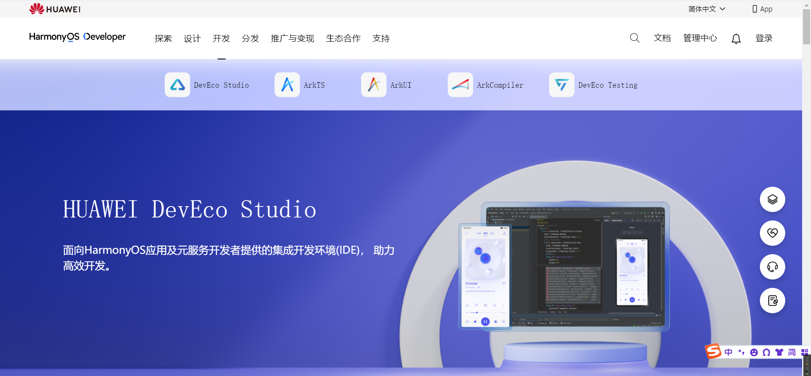

    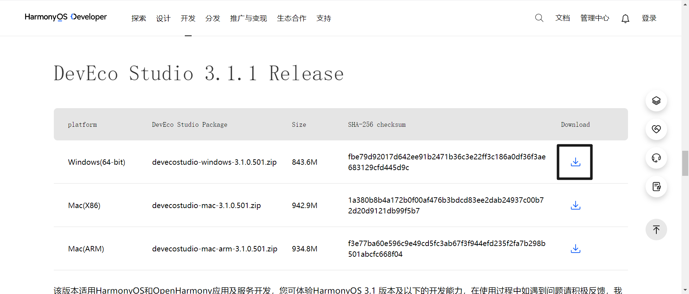

2. 无脑安装即可，安装步骤很简洁，并且可以不用勾选加入环境变量这个选项。

3. 配置环境：安装好`node.js`、`ohpm`和`sdk`

    1. `ohpm`：`open harmony package manager` -- 管理第三方库的工具

4. 安装的东西
    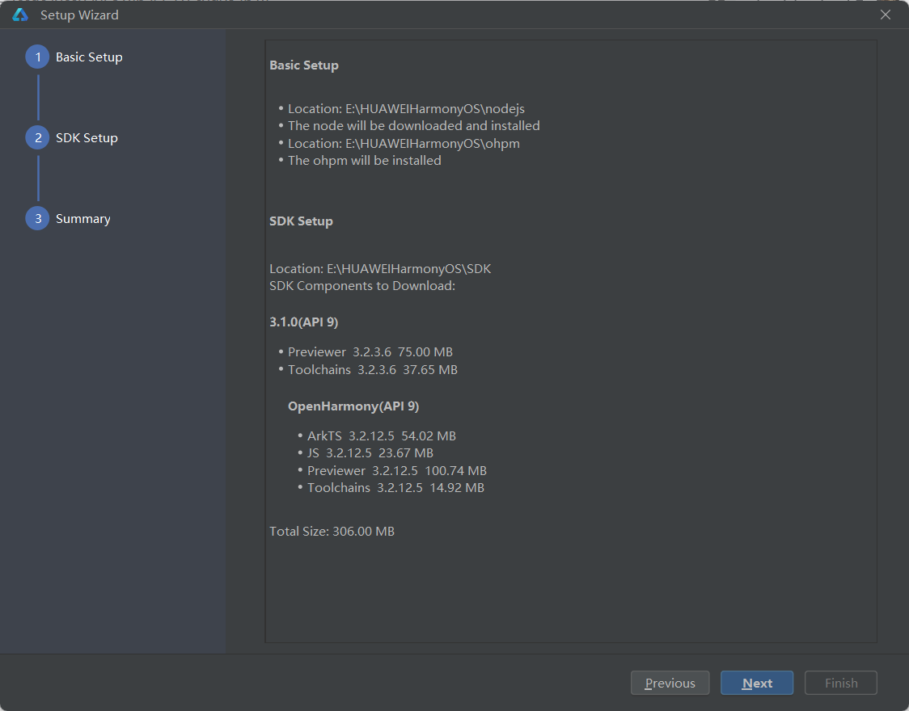

# 2 创建项目

上述准备工作做完后，进入集成开发环境创建项目：

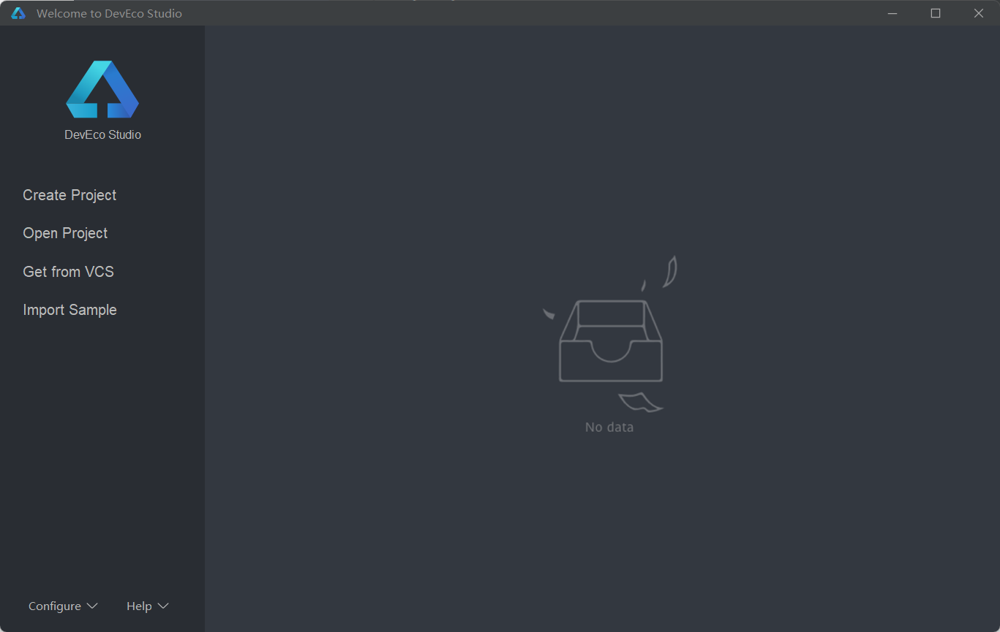

可以先调一下字体等。

点击`Create Project`

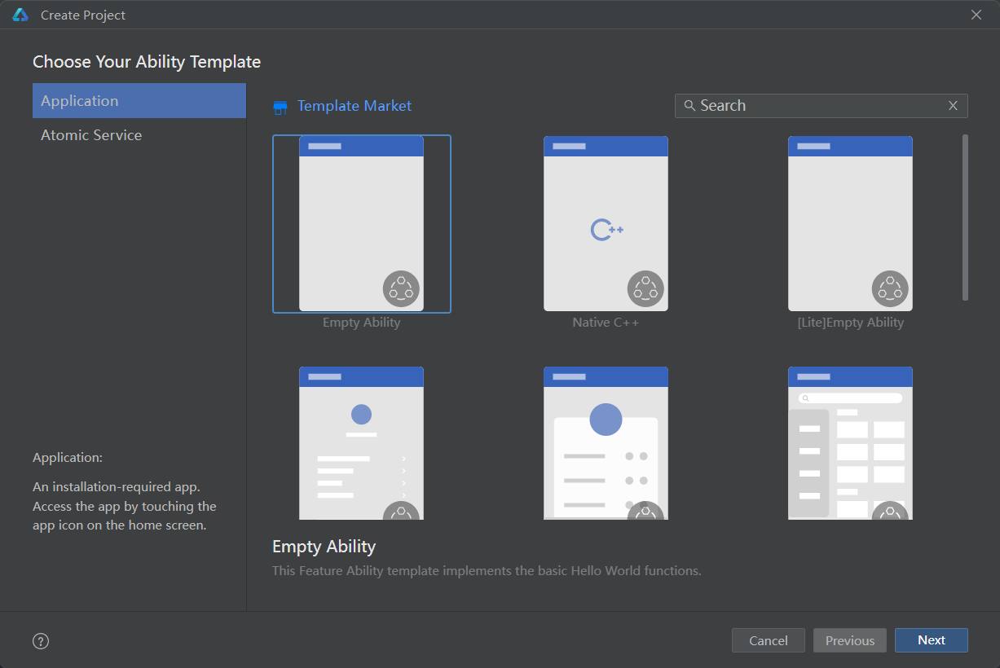

点击`Application`

`Ability`，是鸿蒙中能力的抽象

点击`Empty Ability`，再点击`next`

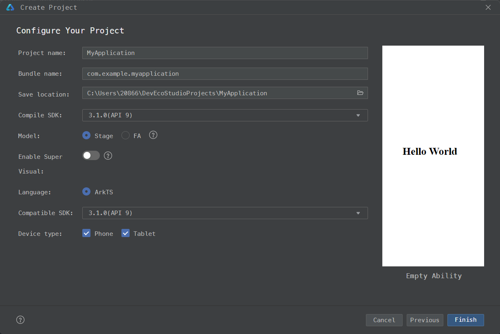

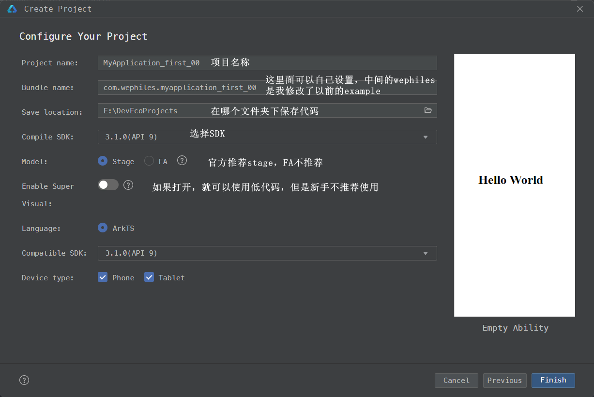

点击`finish`。

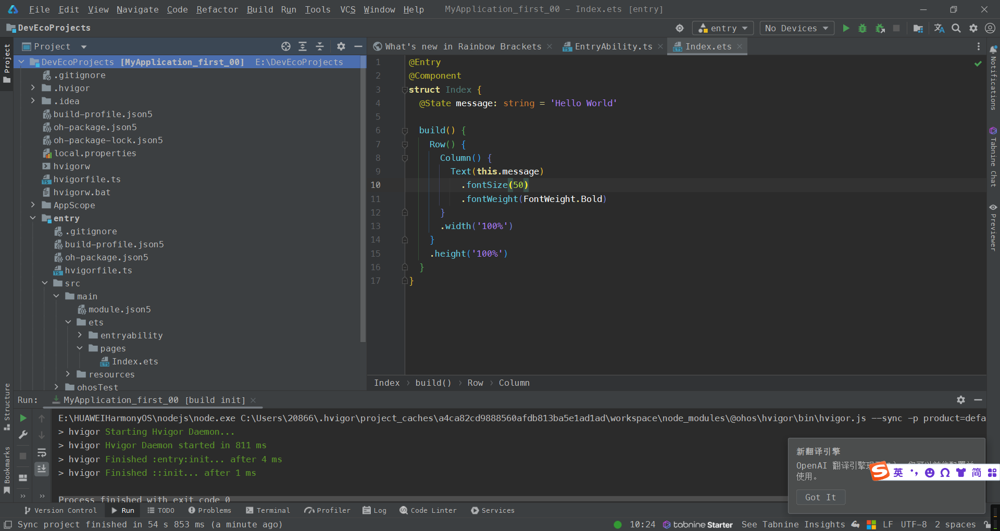

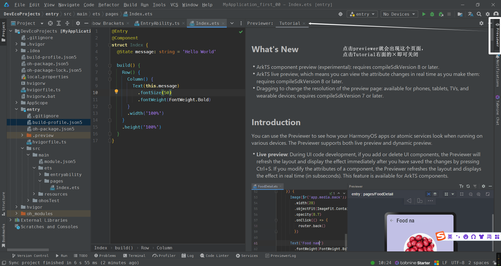

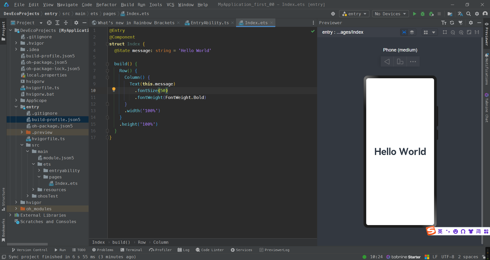

## `ArkTS`工程目录结构

我的：

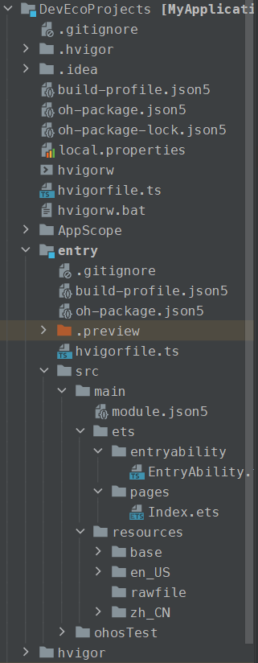

官网的：

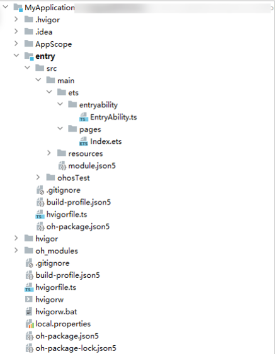

- **`AppScope` > `app.json5`**：应用的全局配置信息。
- **`entry`**：`HarmonyOS`工程模块，编译构建生成一个`HAP`包。
    - **`src` > `main` > `ets`**：用于存放`ArkTS`源码。
    - **`src `> `main `> `ets` > `entryability`**：应用/服务的入口。
    - **`src `> `main `> `ets `> `pages`**：应用/服务包含的页面。
    - **`src `> `main` > `resources`**：用于存放应用/服务所用到的资源文件，如图形、多媒体、字符串、布局文件等。关于资源文件，详见[资源分类与访问](https://developer.huawei.com/consumer/cn/doc/harmonyos-guides-V2/resource-categories-and-access-0000001711674888-V2)。
    - **`src `> `main `> `module.json5`**：`Stage`模型模块配置文件。主要包含`HAP`包的配置信息、应用/服务在具体设备上的配置信息以及应用/服务的全局配置信息。具体的配置文件说明，详见[module.json5配置文件](https://developer.huawei.com/consumer/cn/doc/harmonyos-guides-V2/module-configuration-file-0000001427744540-V2)。
    - **`build-profile.json5`**：当前的模块信息、编译信息配置项，包括`buildOption`、`targets`配置等。其中`targets`中可配置当前运行环境，默认为`HarmonyOS`。
    - **`hvigorfile.ts`**：模块级编译构建任务脚本，开发者可以自定义相关任务和代码实现。
- **`oh_modules`**：用于存放三方库依赖信息。关于原`npm`工程适配`ohpm`操作，请参考[历史工程迁移](https://developer.huawei.com/consumer/cn/doc/harmonyos-guides-V2/project_overview-0000001053822398-V2)。
- **`build-profile.json5`**：应用级配置信息，包括签名、产品配置等。
- **`hvigorfile.ts`**：应用级编译构建任务脚本。

