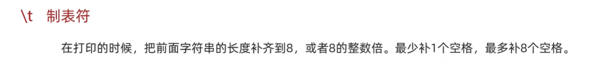
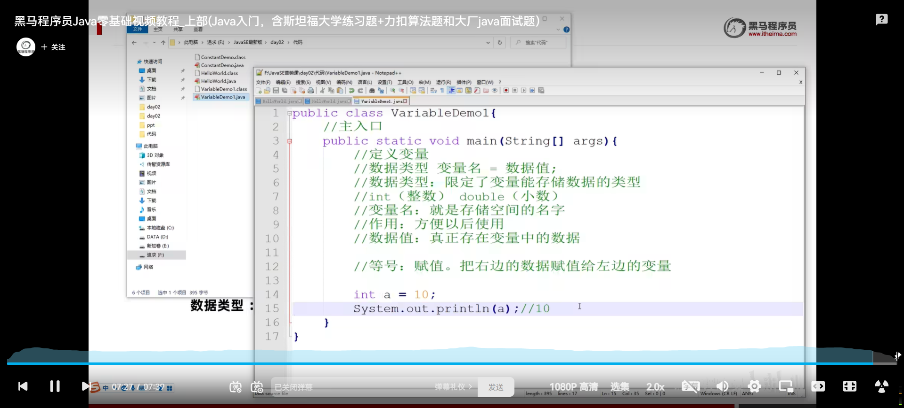
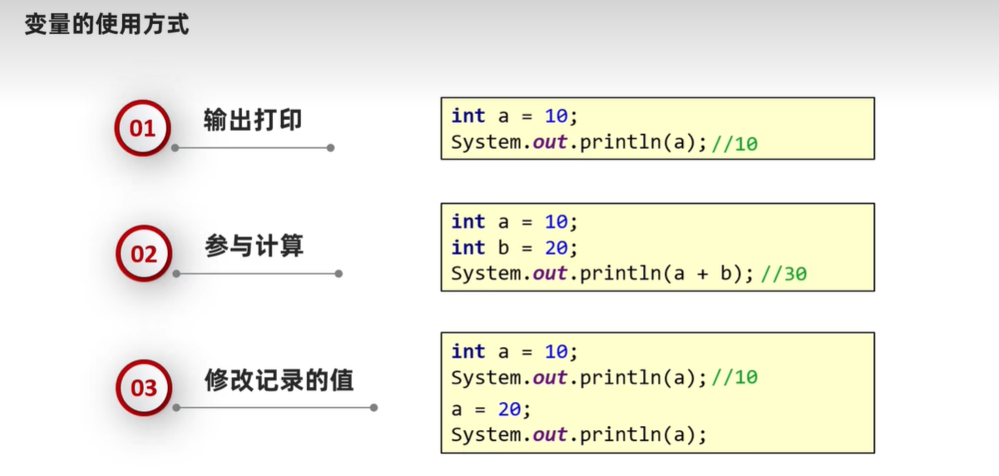

<h1 style="text-align: center; font-family: 'Menlo'">02.Java基础</h1>

[TOC]

# 1 Java基础语法

## 1.1 注释


## 1.2 关键字


### 1.2.1 class


## 1.3 字面量


注意：null是不能直接打印 的，需要以字符串的新式打印。

特殊的字面量：




## 1.4 变量




变量的注意事项：




变量小案例：

公交车到站后车内还有几个人。

## 1.5 补充 - 计算机的存储规则


## 1.6 数据类型

### 1.6.1 基本数据类型


```java
public class VariableDemo1 {
  public static void main(String[] args) {
    byte b = 10;
    System.out.println(b);

    short s = 25;
    System.out.println(s);
		
    int i = 120;
    System.out.println(i);

    long l = 9999999999L;
    // 细节：定义long类型的数据的时候，需要在后面加上一个L作为后缀
    // l可以大写可以小写
    System.out.println(l);

    float f = 12.354F;
    // 细节：定义float类型的数据的时候，需要在后面加上一个F作为后缀
    System.out.println(f);

    double d = 1.126;
    System.out.println(d);
      
    char c = '中';
    System.out.println(c);

    boolean bo = true;
    System.out.println(bo);
      
  	String str = "窝嫩叠.";
    System.out.println(str);
  }
}

```


### 1.6.2 引用数据类型

在后面学

## 1.7 标识符


## 1.8 键盘录入


```java
import java.util.Scanner;
public class ScannerDemo {
    public static void main(String[] args) {
        Scanner sc = new Scanner(System.in);
        int num = sc.nextInt();
        System.out.println(num);
    }
}
```

## 1.9 IDEA


### 1.9.1 下载和安装

此处省略

### 1.9.2 第一个IDEA代码

项目结构：


新建项目：

新建项目 - 新建Empty Project，填好名字，选好位置 - 点击File - Project Structure【新建模块（我们的学习默认每一天的代码都看作一个模块）】


经过上述步骤，会出现下面的页面：


点击Modules，选择New Models


名字起好，接下来是新建package：新建package的时候，起名字的时候`com.xxx.这个包的作用`的形式 -- 将网站域名反写，www就不要写了。--在开发的过程中


然后新建java类，编写程序，运行即可。


# 2 运算符和表达式


## 2.1 运算符和表达式


## 2.2 算数运算符


```java
package com.wephiles.test_demo;

public class ArithmeticOperators {
    /*
    * 算数运算符demo
    * */
    public static void main(String[] args) {
        /*
        * 主函数 测试用
        * */
        System.out.println(3 + 2);
        System.out.println(3 - 1);
        System.out.println(3 * 2);
        System.out.println(3 / 2);  // 1 -- 整数参与运算 只会得到整数
        System.out.println(3.0 / 2);  // 1.5 小数参与计算 结果有可能不精确
        // 结论：在代码中如果有小数 有可能出现结果不准确的结果
        System.out.println(1.1 + 1.01);
        System.out.println(1.1 - 1.01);
        System.out.println(1.1 * 1.01);
    }
}

```

取余运算符的应用场景：


案例：键盘拆分

键盘录入一个三位数，将其拆分为个位、十位、百位。

```java
package com.wephiles.test;
import java.util.Scanner;

public class Test1 {
    public static void main(String[] args) {
        /*
         *
         * */
        Scanner sc = new Scanner(System.in);
        System.out.println("请输入一个三位数：");
        int number = sc.nextInt();
        if (number < 100 || number > 999) {
            System.out.println("输入错误！");
        } else {
            int ge = number % 10;
            int shi = number / 10 % 10;
            int bai = number / 100 % 10;
            System.out.println("个位：" + ge);
            System.out.println("十位：" + shi);
            System.out.println("百位：" + bai);
        }
    }
}

```

## 2.3 算数运算符的高级用法


### 2.3.1 隐式转换


### 2.3.2 强制转换


### 2.3.3 字符串的+运算


## 2.4 自增自减运算符


## 2.5 赋值运算符


> [!Caution]
>
> 细节：`+= -= *= /= %=` 在底层都隐含了强制类型转换

## 2.6 关系运算符


## 2.7 逻辑运算符


## 2.8 短路逻辑运算符


## 2.9 三元运算符


```java
package com.jinyu.demo1;

public class VariableDemo {
    public static void main(String[] args) {
        int a = 10;
        int b = 20;
//        int max_num = a > b ? a : b; // 这条语句和下面的语句效果相同
        int max_num = Math.max(a, b);
        System.out.println(max_num);
    }
}

```

## 2.10 运算符优先级


# 3 原码、反码、补码


原码：十进制数据的二进制表现形式，最左边是符号位，0为正，1为负。

```java
8个bit ---> 一个字节 ---> 
最大值 01111111  --> +127
最小值 11111111  --> -128
```

利用原码对正数进行计算的时候，是没有问题的 -- 但是对负数进行计算的时候，会出问题。

看下面例子，

从 10000000（-0，也就是整数0）加一，应该是1，但是在计算机中使用二进制算出来却是：-1（10000000 + 1 = 10000001）

以此类推，发现使用原码进行负数的运算的时候，会出问题！！！


于是乎 -- 出现了反码：注意，正数原码和反码相同（意思是说，正数使用原码进行计算的时候，压根不会出现问题，所以正数不需要反码 -- 也可以说，正数原码和反码相等）


注意看下面这张图，下面这张图第一个行是使用反码 + 1 得出来的数组，第二行时第一行这个数字的原码（计算出来结果是-55）


我们发现，使用反码进行负数计算的时候，竟然能够计算正确！！！


但是使用反码还有一个问题：如果是-1 + 1（`1111 1110`（反码） + 1 = `1111 1111`（反码），再取反，得到原码->结果是`1000 0000`，即-0），我们发现到这还能够计算正确。

但是如果我们在这个的基础上再进行+1操作呢？ 反码(1111 1111 + 1 = 1 0000，0000，溢出了，丢弃最高位，得到`0000 0000`)，

这时候，我们发现-0 + 1的结果是+0 -- 出现了错误。

再比如，如果是-5 + 6呢？ --> -5的原码是`1000 0101`，反码是`1111 1010`，

而6的原码是`0000 0110`（-5 + 6 = -5的反码+ 6的反码（也是6的原码） = `1111 11010` + `0000 0110` = `0000 0000`），呕吼，出现问题了，发现结果是0，而不是1，出现了一个误差。

问题所在 --> 在反码中，0有两种表现形式 --> `0000 0000`和`1111 1111`

==>出现了补码 --> 错一个位，--> 这就是为什么在计算补码的时候，需要将反码+1的原因。(只限于负数，正数的原码反码补码都一样)


看下面这张图，最后还空出了一位。注意，在计算中，数字的存储是以补码的形式存储的。


# 4 其他运算符


