<h1 style="text-align: center; font-family: 'Menlo'">03.判断和循环</h1>

[TOC]

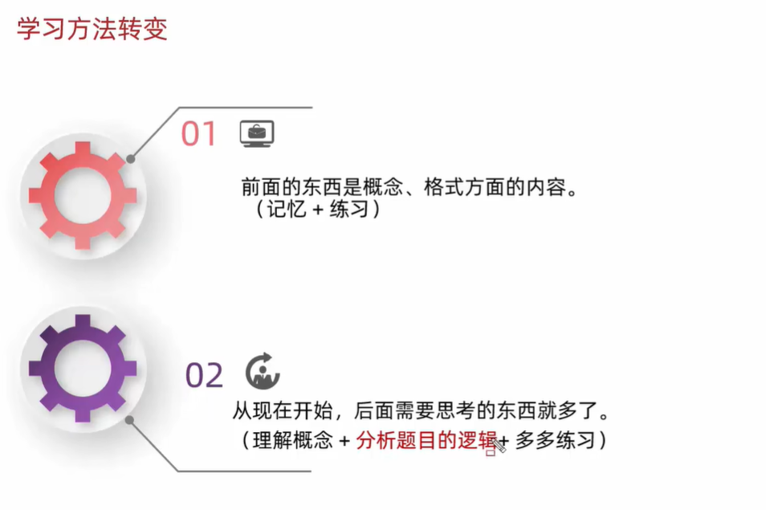

# 1 流程控制语句

## 1.1 顺序结构

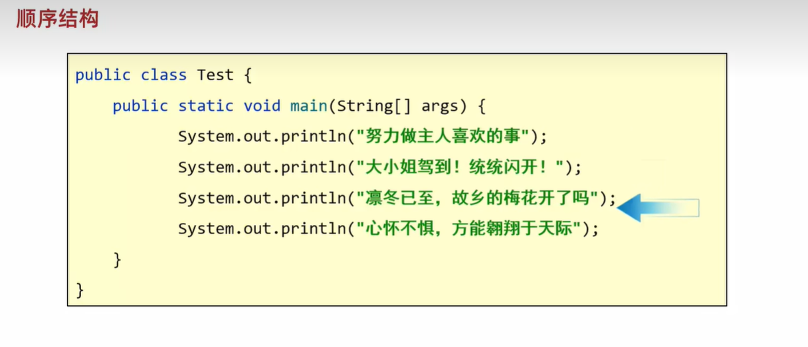

## 1.2 分支结构

### 1.2.1 if

#### 1.2.1.1 if的第一种格式

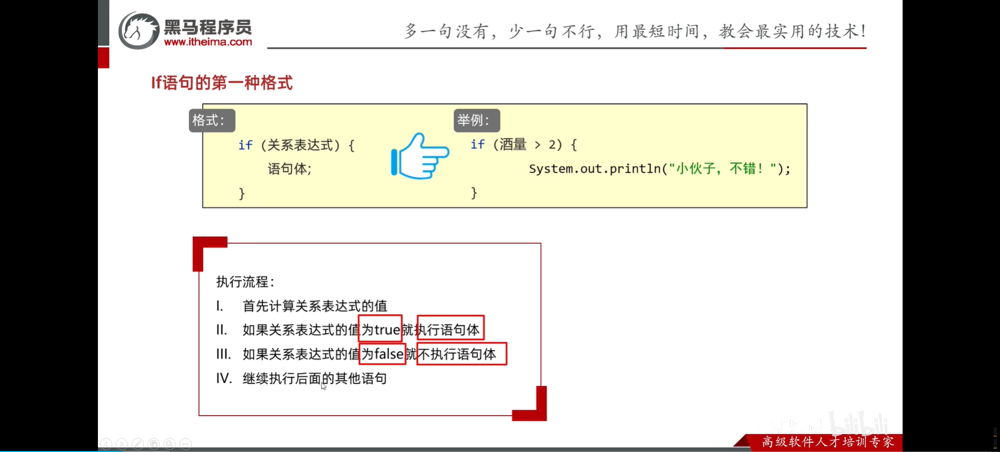

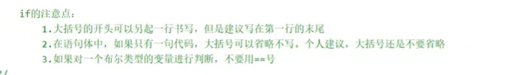

#### 1.2.1.2 if第二种格式

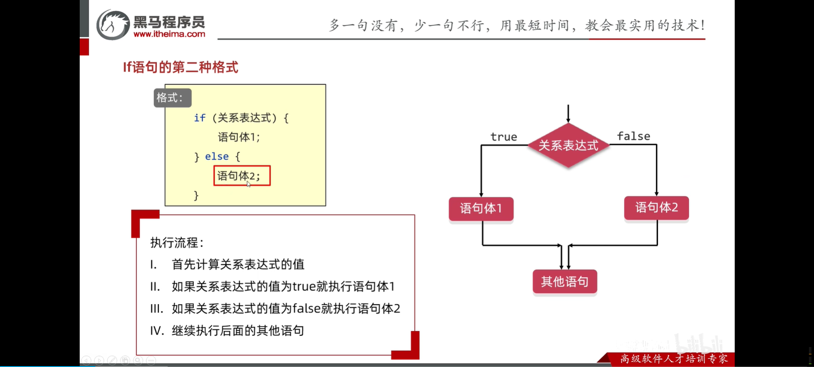

#### 1.2.1.3 if第三种格式

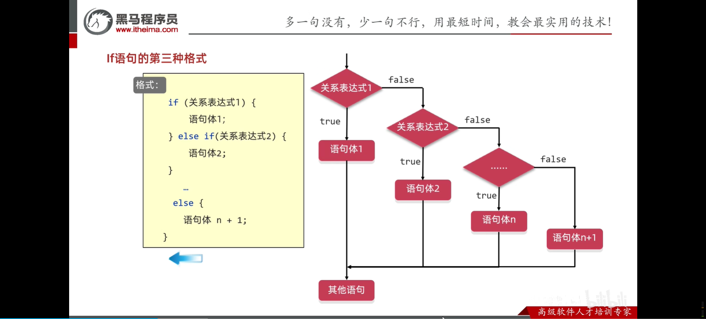

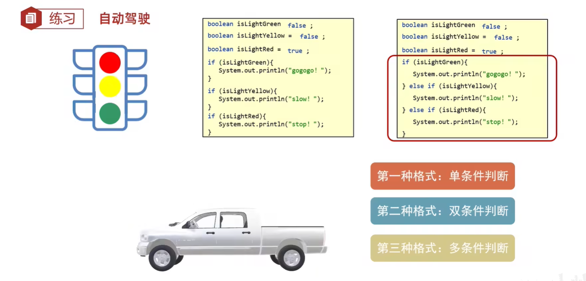

### 1.2.2 switch

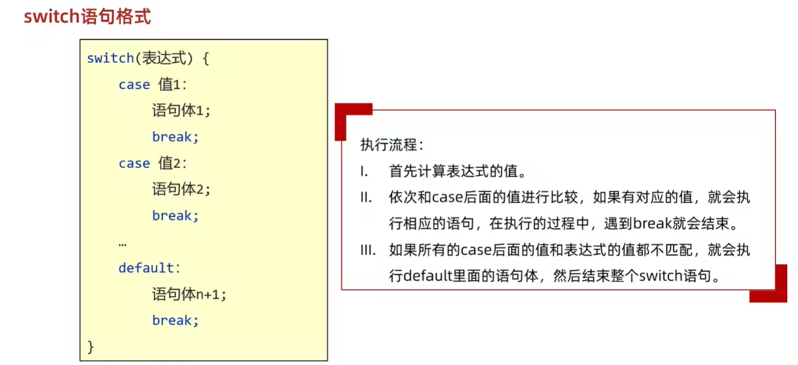

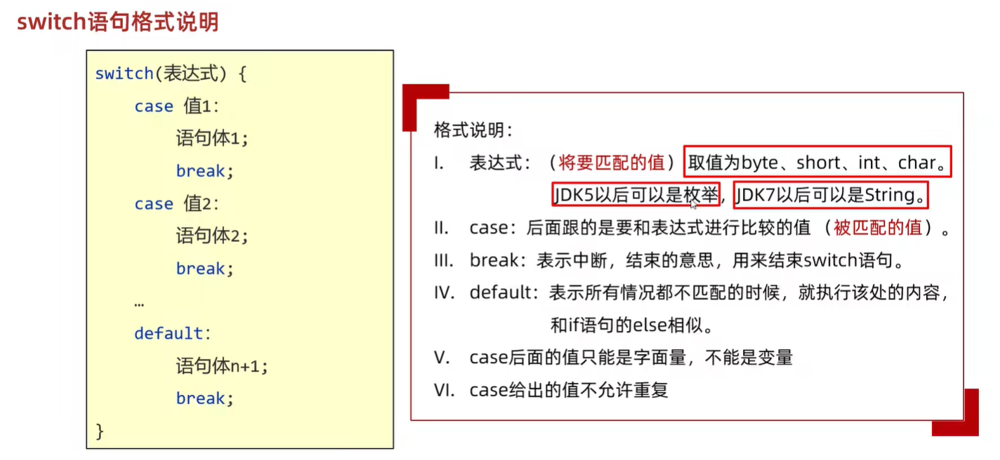

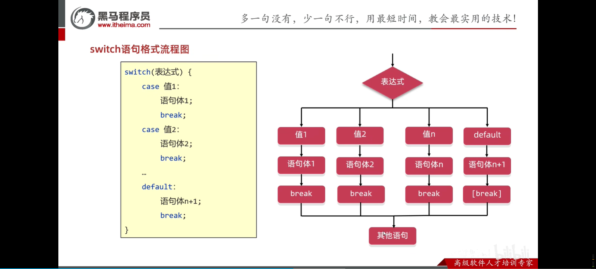

#### 1.2.2.1 switch的其他知识点

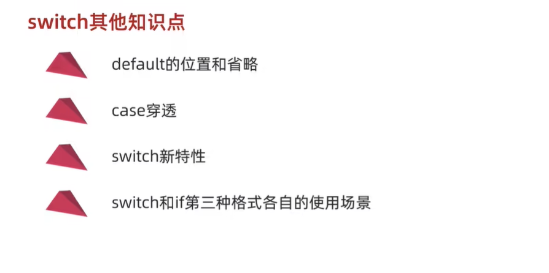

1. default的位置和省略：

    - 位置：不一定写在最下面，我们可以写在任意位置，只不过习惯写在最下面

    - default可以省略，语法没问题，不建议省略

2. case穿透：

    - 首先还是会拿着小括号中表达式的值跟下面每一个case进行匹配。如果匹配上了，就会执行对应的语句体，如果此时发现了break，那么结束整个switch语句。如果没有发现break，那么程序会继续执行下一个case的语句体，一直遇到break或者右大括号为止。

    - 使用场景：如果多个case的语句体重复了，那么我们考虑利用case穿透去简化代码。

3. switch新特性：`jdk12+`

    ```java
    int number = 3;
    switch (number) {
        case 1 -> System.out.println("一");
        case 2 -> System.out.println("二");
        case 3 -> {
            System.out.println("三");
            System.out.println("大括号里面只有一行代码，那么这个大括号可以省略！否则不可省略。");
        }
        default -> System.out.println("Error.");
    }
    ```

4. if第三种格式和switch
    - switch和if第三种格式各自的使用场景：if的第三种格式一般用于对范围的判断；switch则把有限个数据一一列举出来，让我们任选其一

练习：

```java
Scanner sc = new Scanner(System.in);
System.out.println("请输入星期数\n>>> ");
int week = sc.nextInt();
switch (week) {
    case 1, 2, 3, 4, 5 -> System.out.println("工作日。");
    case 6, 7 -> System.out.println("休息日。");
    default -> System.out.println("输入错误！");
}
```

## 1.3 循环结构

### 1.3.1 for循环

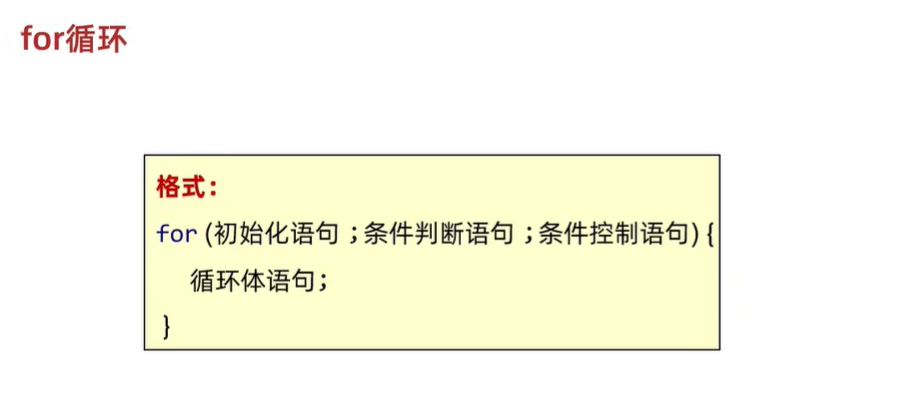

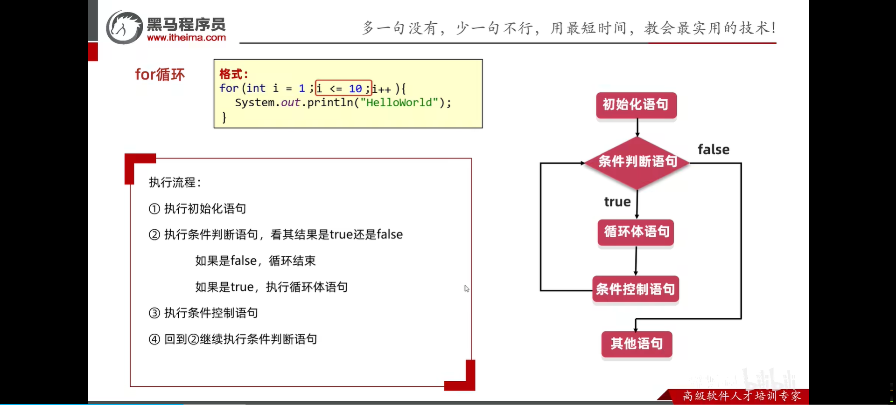

### 补充-变量的作用范围

变量的作用范围是属于==当前大括号==的！

//扩展小点：

1. 求和的变量不能定义在循环的里面，因为变量只在所属的大括号中有效

2. 如果我们把变量定义在循环的里面，
    1. 那么当前变量只能在本次循环中有效。
    2. 当本次循环结束之后，变量就会从内存中消失。
    3. 第二次循环开始的时候，又会重新定义一个新的变量。

### 1.3.2 while循环

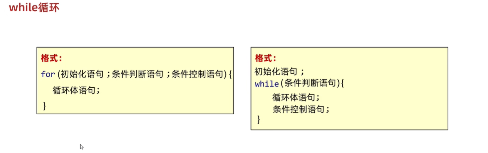

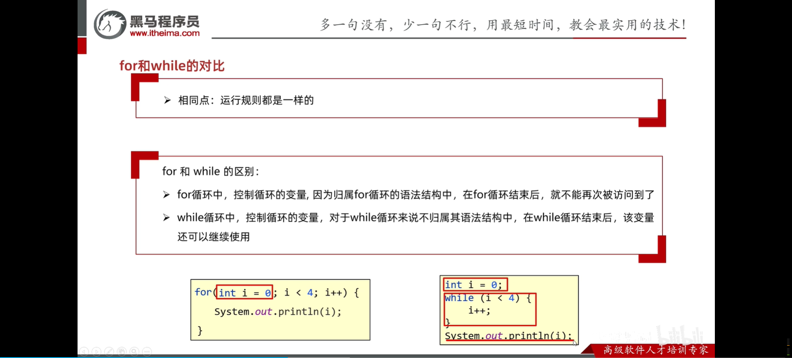

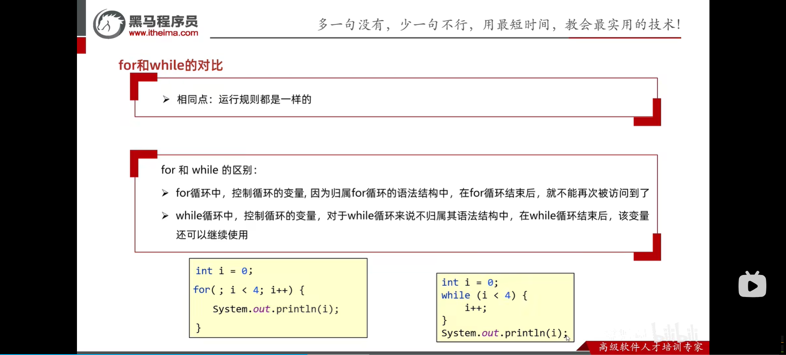

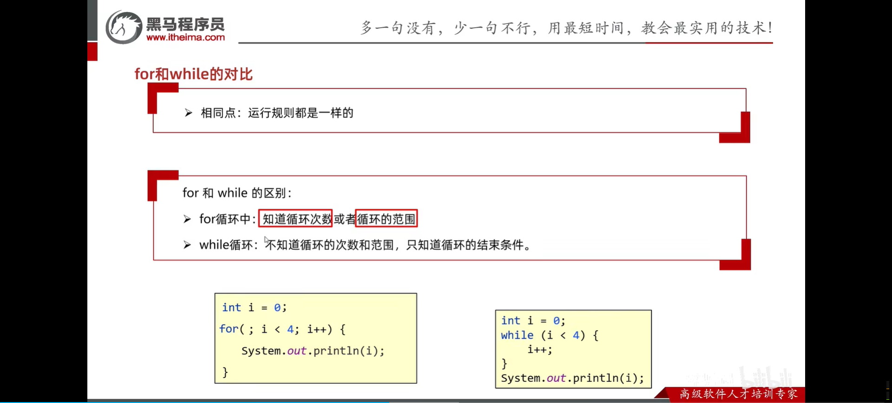

案例：判断回文数

```java
/*
* 回文数判断 -- 力扣题目
*
* 需求：给你一个整数number。
* 如果number是一个回文整数，打印true，否则，返回false。
* 解释：回文数是指正序（从左向右）和倒序（从右向左）读都是一样的整数。
* 例如，121是回文，而123不是。
* */
int number = 12321;
int temp = number;  // temp用来记录，原本的数
int add = 0;  // 最终反过来的和
while (number != 0) {
    int m = number % 10;  // 最后一位
    number = number / 10; // 取整后的数

    add = add * 10 + m;
}
if (temp == add) {
    System.out.println(STR."\{temp}是一个回文数");
} else {
    System.out.println(STR."\{temp}不是一个回文数");
}
```

案例：求商和余数 - 力扣题目

```java
/*
 * 需求：给定两个整数，被除数和除数（都是正数，且不超过int的范围）
 * 将两数相除，要求不使用乘法、除法和%运算符。
 * 得到商和余数。
 * */
Scanner sc = new Scanner(System.in);
System.out.println("请输入被除数：");
int dividend = sc.nextInt();

System.out.println("请输入除数：");
int divisor = sc.nextInt();

int quotient = 0;  // 商
int remainder = 0;  // 余数

// 只要被除数大于等于除数 那么就会循环
while (dividend >= divisor){
    dividend -= divisor;
    quotient ++; // 记录减的次数 -- 商
}
// 循环结束之后 dividend变量记录的就是余数
System.out.println("商: " + quotient);
System.out.println("余数: " + dividend);
```

### 1.3.3 do while循环

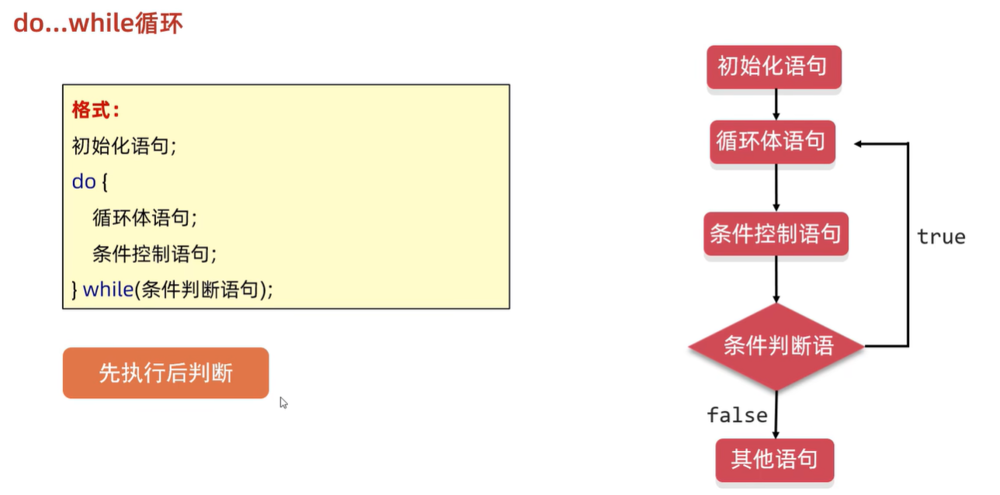

# 2 循环高级

## 2.1 无限循环

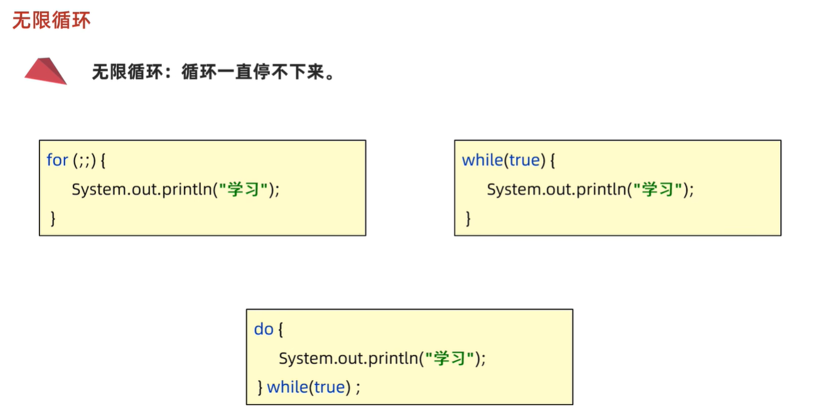

## 2.2 跳转控制语句

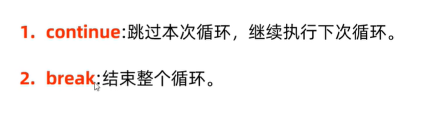

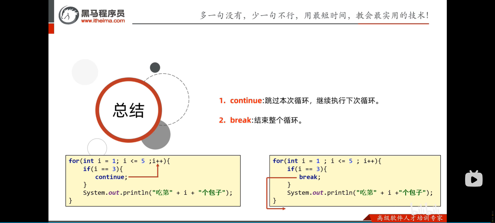

## 2.3 练习题

### 2.3.1 逢7过

```java
package com.jinyu.test;

public class SevenPass {
    public static void main(String[] args) {
        /*
         * 朋友聚会的时候可能会玩一个游戏：逢7过
         * 游戏规则：从任意一个数字开始报数，当你要报的数字是包含7或者是7的倍数时都要说过：过
         * 需求：使用程序在控制台打印出1-100之间的满足逢七必过规则的数据
         * */
        for (int i = 1; i <= 100; i++) {
            if ((i % 7 == 0) || (i / 10 % 10 == 7) || (i / 10 == 7)) {
                System.out.println("过");
            } else {
                System.out.println(i);
            }
        }

        // --END MAIN--
    }
}

```

### 2.3.2 求平方根

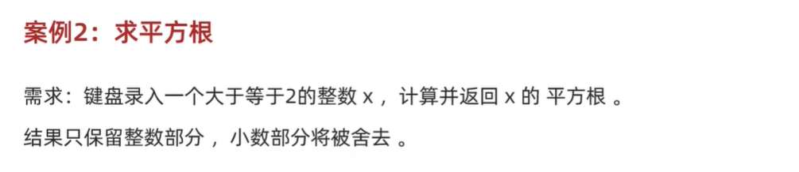

```java
package com.jinyu.test;

public class SquareRoot {
    public static void main(String[] args) {
        /*
         * 需求：键盘录入一个大于等于2的整数X，计算并返回×的平方根。
         * 结果只保留整数部分，小数部分将被舍去。
         * */

        int number = 16;
        for (int i = 2; i < number / 2 + 1; i++) {
            if (i * i > number) {
                System.out.println(STR."result is: \{(i - 1)}");
                break;
            }
        }
        // --END MAIN--
    }
}

```

### 2.3.3 求质数

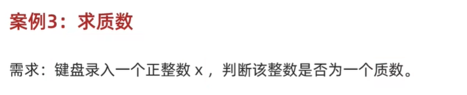

```java
package com.jinyu.test;

public class PrimeNumber {
    public static void main(String[] args) {
        /*
         * 判断一个数是不是质数
         * */
        int number = 7;
        boolean flag = false;
        for (int i = 2; i < number; i++) {
            if (number % i == 0) {
                flag = true;
                break;
            }
        }
        if (flag) {
            System.out.println("This is a prime number.");
        } else {
            System.out.println("This is not a prime number.");
        }

        // --END MAIN--
    }
}

```

进行一个优化：

```java
import static java.lang.Math.sqrt;
/*
 * 优化一下上述算法 -- 上述算法时间复杂度较高
 * 81
 * 1 81
 * 3 27
 * 9 9
 * 下面有这个结论：
 *  - 以81的平方根为中心，并且假设 a * b = 81
 *  - 那么a和b中，其中一个必定是小于等于9的
 *  - 另外一个是大于等于9的
 * */
int number = 7;
boolean flag = false;
for (int i = 2; i <= sqrt(number) + 1; i++) {
    if (number % i == 0) {
        flag = true;
        break;
    }
}
if (flag) {
    System.out.println("This is a prime number.");
} else {
    System.out.println("This is not a prime number.");
}
```

### 2.3.4 猜数字小游戏


```java
// 随机数的使用
Random rd = new Random();
// 这个rd.nextInt(10)里面的参数，表示的是生成随机数的范围
// 这个范围是从0开始的 到(这个参数-1)结束 -- 类似于左闭右开
// 口诀：包头不包尾 包左不包右
int number = rd.nextInt(10);
System.out.println(number);
```

```java
// 随机数的使用
Random rd = new Random();

// 秘诀：以7 - 15之间的随机数生成为例
// 让这个范围头尾都减去一个数，让开头从0开始，于是发现要减7： 7 - 7 = 0，15 - 7 = 8
// 于是，新的范围是0 - 8(包含8)
// 于是，nextInt的参数就是 9
// 最后再在后面加上减去的数，在这个例子里是：+7
int number = rd.nextInt(9) + 7;
System.out.println(number);
```

```java
// 案例：猜数字小游戏
/*
 * @Author     : 20866
 * @CreateTime : 2024/7/14 014
 * @ProjectName: base_code_1
 * @PackageName: com.jinyu.test
 * @ClassName  : GuessNumber
 */

package com.jinyu.test;

import java.util.Random;
import java.util.Scanner;

public class GuessNumber {
    public static void main(String[] args) {
        /*
         * 猜数字小游戏
         * 程序自动生成 1 - 100之间的随机数字，使用程序实现猜出这个数字是多少。
         * */
        Random rd = new Random();
        int number = rd.nextInt(100) + 1;
        System.out.println(number);

        Scanner sc = new Scanner(System.in);

        while (true) {
            System.out.println("Please input the number which you have guessed!");
            int guessNum = sc.nextInt();
            if (guessNum == number) {
                System.out.println("Wow, you are so excellent, it is right!");
                break;
            } else if (guessNum > number) {
                System.out.println("Oh no, you guessed a wrong number, and this number is bigger than right number, please try again.");
            } else {
                System.out.println("Oh no, you guessed a wrong number, and this number is smaller than right number, please try again.");
            }
        }
        
        // --END MAIN--
    }
}

```


