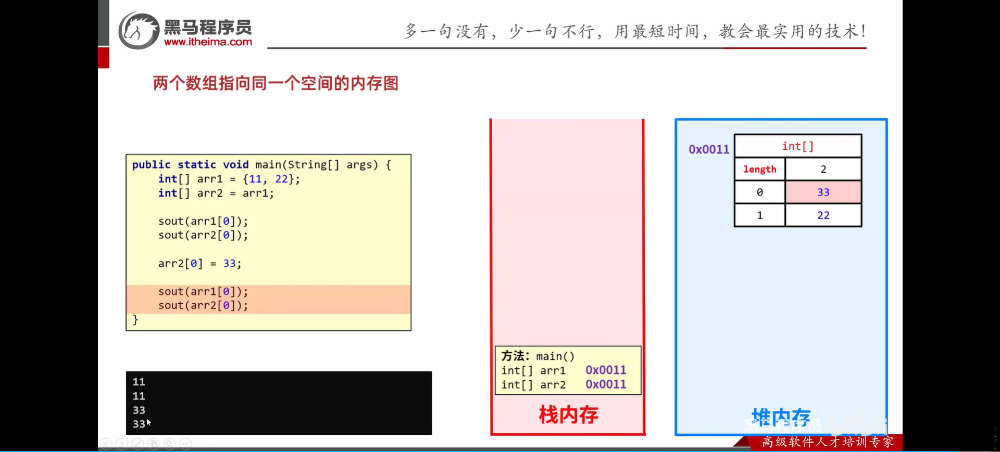
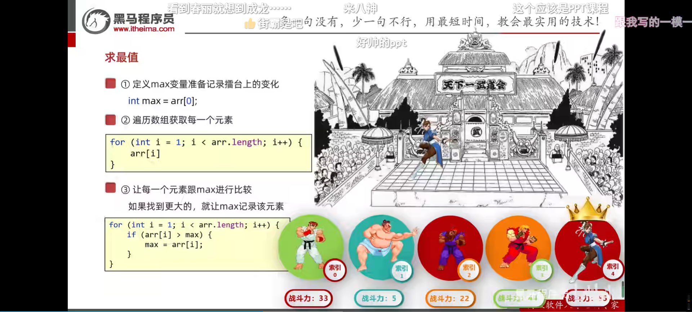

<h1 style="text-align: center; font-family: 'Menlo'">04.数组</h1>

[TOC]


# 1 数组介绍

什么是数组


# 2 数组的定义和静态初始化

## 2.1 数组的定义


格式一比较常用。

## 2.2 数组的初始化


### 2.2.1 静态初始化


```java
int[] array = new int[]{
        1, 2, 3
};  // 数组静态初始化
```

简化初始化：


```java
int[] newArray = {10, 20, 30};  // 数组静态初始化 -- 简化版
```


```java
/*
 * @Author     : 20866@20866
 * @CreateTime : 12:51
 * @ProjectName: base_code_1
 * @PackageName: com.jinyu.array_demo
 * @FileName   : com.jinyu.array_demo/DefineArray.java
 * @ClassName  : DefineArray
 */

package com.jinyu.array_demo;

import java.util.Arrays;

public class DefineArray {
    public static void main(String[] args) {
        int[] array = new int[]{
                1, 2, 3
        };  // 数组静态初始化
        double[] newArray = {10.25, 20.0, 30};  // 数组静态初始化 -- 简化版

        System.out.println(Arrays.toString(array));  // [1, 2, 3]
        System.out.println(array);  // 数组的地址值：[I@723279cf
        // 数组的地址值：[I@723279cf
        // 其中的[代表这是个数组
        // I代表这是个存储int类型数据的数组
        // @：间隔符号，没有意义 后面723279cf是十六进制，是真正的地址值
        System.out.println(newArray); // [D@10f87f48
        System.out.println(array[0]);
        System.out.println(array[1]);
        System.out.println(array[2]);
        System.out.println(newArray[0]);
        System.out.println(newArray[1]);
        System.out.println(newArray[2]);
        
        array[2] = 100;
        System.out.println(array[0]);
        System.out.println(array[1]);
        System.out.println(array[2]);
        
        // --END--
    }
}

```

### 2.2.2 动态初始化


```java
// 数组动态初始化
// 由我们自己指定数组长度，由虚拟机给出默认的初始化值
int[] array = new int[3];
for (int j : array) {
    System.out.println(j);
}
array[0] = 1;
for (int i = 0; i < array.length; i++) {
    System.out.println(array[i]);
}
// 数组默认初始化值
// 整数  ---  0
// 浮点  ---  0.0
// 字符  ---  '\u0000' (也就是空格)
// 布尔  ---  false
// 引用  ---  null
```

### 2.2.3 动态/静态初始化的区别


# 3 数组访问


# 4 数组的遍历

```java
/*
 * @Author     : wephiles@20866
 * @CreateTime : 13:14
 * @ProjectName: base_code_1
 * @PackageName: com.jinyu.array_demo
 * @FileName   : com.jinyu.array_demo/TraverseArray.java
 * @ClassName  : TraverseArray
 */

package com.jinyu.array_demo;

public class TraverseArray {
    public static void main(String[] args) {
        /*
        * 遍历数组。
        * */
        int [] array = {1, 5, 3, 8, 7};
        // 方式1
        for (int i = 0; i < 5; i++) {
            System.out.println(array[i]);
        }

        // 方式2 计算出长度
        // Idea：自动生成遍历数组的方式 数组名.fori, 点击回车即可快速生成遍历代码
        for (int i = 0; i < array.length; i++) {
            System.out.println(array[i]);
        }

        // 方式3 增强的for循环
        for (int i : array) {
            System.out.println(i);
        }

        // --END--
    }
}

```

# 5 数组内存图

Java内存分配：





# 6 数组常见问题


# 7 数组常见操作

## 7.1 求最值



## 7.2 求和

...

## 7.3 交换数据

...

## 7.4 打乱数据

```java
/*
 * @Author     : wephiles@20866
 * @CreateTime : 15:21
 * @ProjectName: base_code_1
 * @PackageName: com.jinyu.test
 * @FileName   : com.jinyu.test/RandomSort.java
 * @ClassName  : RandomSort
 */


package com.jinyu.test;

import java.util.Random;

public class RandomSort {
    public static void main(String[] args) {
        /*
         * 打乱数组中的数据
         * */

        int[] array = {1, 2, 3, 4, 5};

        // 遍历
        for (int j : array) {
            System.out.print(STR."\{j} ");
        }

        System.out.println();

        Random rd = new Random();
        for (int i = 0; i < array.length; i++) {
            int newIndex = rd.nextInt(array.length);
            int temp = array[i];
            array[i] = array[newIndex];
            array[newIndex] = temp;
        }

        // 遍历
        for (int j : array) {
            System.out.print(STR."\{j} ");
        }
        // --END--
    }
}

```


