<h1 style="text-align: center; font-family: 'Menlo'">06.第一阶段练习题</h1>

[TOC]


# 1 第一题 订机票

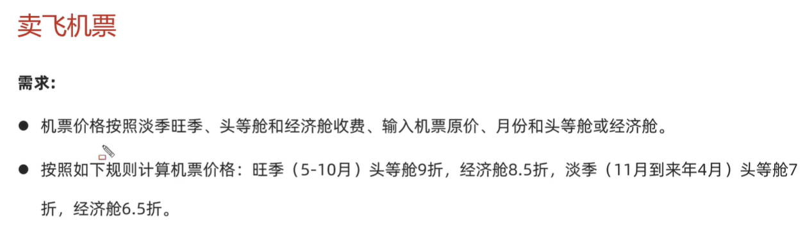

```java
/*
 * @Author       : wephiles@20866
 * @CreateTime   : 2024-07-14 17:52
 * @ProjectName  : base_code_1
 * @PackageName  : com.jinyu.practice
 * @FileName     : com.jinyu.practice/AirplaneTicket.java
 * @ClassName    : AirplaneTicket
 * @Description  : You must take your place in the circle of life.
 * @PersonalSite : https://github.com/wephiles or https://gitee.com/wephiles
 */

package com.jinyu.practice;

import java.util.Scanner;

public class AirplaneTicket {
    public static void main(String[] args) {
        /*
         * 机票价格按照淡季旺季、头等舱和经济舱收费、输入机票原价、月份和头等舱或经济舱。
         * 按照如下规则计算机票价格：旺季（5-10月）头等舱9折，经济舱8.5折，淡季（11月到来年4月）头等舱7折，经济舱6.5折。
         * */
        Scanner sc = new Scanner(System.in);
        System.out.println("请输入机票原价");
        int price = sc.nextInt();
        System.out.println("请输入现在的月份");
        int month = sc.nextInt();
        System.out.println("请输入您要购买的是头等舱还是经济舱 1.头等舱 2.经济舱");
        int level = sc.nextInt();

        switch (month) {
            // ctrl + alt + M :自动抽取方法
            // 旺季
            case 5, 6, 7, 8, 9, 10 -> getPrice(price, level, 0.85, 0.9);
            // 淡季
            case 11, 12, 1, 2, 3, 4 -> getPrice(price, level, 0.65, 0.7);
            // 月份输入错误
            default -> System.out.println("没有这个月份，输入错误！");
        }
    }

    public static void getPrice(int price, int level, double economyDiscount, double firstDiscount) {
        
        double realPrice;
        if (level == 1) {
            // 头等舱
            realPrice = price * firstDiscount;
            System.out.println(STR."您需要支付的机票费用是\{realPrice}");
        } else if (level == 2) {
            // 经济舱
            realPrice = price * economyDiscount;
            System.out.println(STR."您需要支付的机票费用是\{realPrice}");
        } else {
            System.out.println("没有这个舱位，输入错误！");
        }
    }
}

```

# 2 第二题 找质数

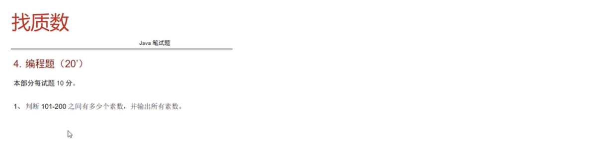

```java
/*
 * @Author       : wephiles@20866
 * @CreateTime   : 2024-07-14 18:23
 * @ProjectName  : base_code_1
 * @PackageName  : com.jinyu.practice
 * @FileName     : com.jinyu.practice/FindPrimeNumber.java
 * @ClassName    : FindPrimeNumber
 * @Description  : You must take your place in the circle of life.
 * @PersonalSite : https://github.com/wephiles or https://gitee.com/wephiles
 */

package com.jinyu.practice;

import static java.lang.Math.sqrt;

public class FindPrimeNumber {

    public static void main(String[] args) {
        int count = 0;
        for (int i = 101; i <= 200; i++) {
            if (isPrime(i)) {
                count++;
                System.out.println(STR."\{i}is a prime!");
            }
        }
        System.out.println(count);
    }

    public static boolean isPrime(int number) {
        for (int i = 2; i < sqrt(number) + 1; i++) {
            if (number % i == 0) {
                return false;
            }
        }
        return true;
    }
}

```

# 3 第三题 开发验证码

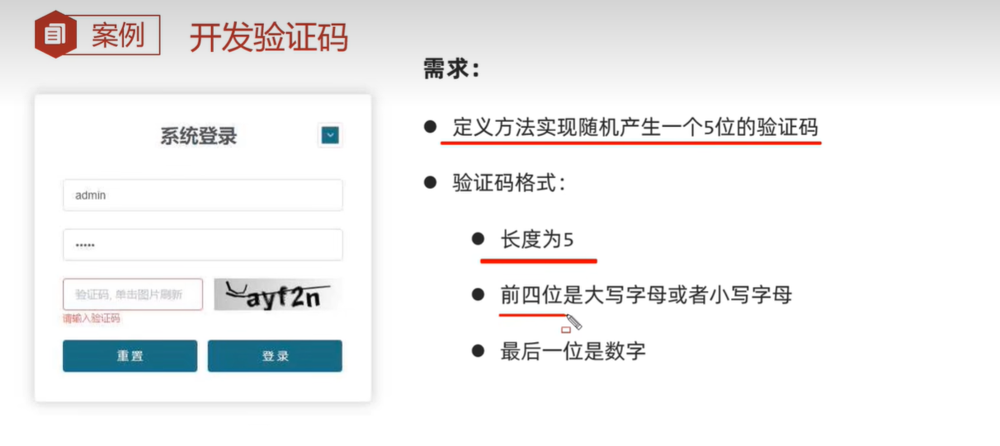

```java
/*
 * @Author       : wephiles@20866
 * @CreateTime   : 2024-07-15 14:39
 * @ProjectName  : base_code_1
 * @PackageName  : com.jinyu.practice
 * @FileName     : com.jinyu.practice/CaptchaGenerate.java
 * @ClassName    : CaptchaGenerate
 * @Description  : You must take your place in the circle of life.
 * @PersonalSite : https://github.com/wephiles or https://gitee.com/wephiles
 */

package com.jinyu.practice;

import java.util.Random;

public class CaptchaGenerate {
    public static void main(String[] args) {
        /*
         * 定义方法
         * 实现随机产生一个5位的验证码
         * 验证码格式：长度为5 前四位是大写字母或者小写字母 最后一位是数字
         * */
        // 如果想要在一堆没有什么规律的数据中随机抽取
        // 再随机抽取一个索引
        // a: 97 z:122 A: 65 Z: 90
        char[] string = new char[52];
        for (int i = 0; i < string.length; i++) {
            if (i >= 26) {
                string[i] = (char) (65 + i - 26);
            } else {
                string[i] = (char) (97 + i);
            }
        }

        /*for (char c : string) {
            System.out.print(STR."\{c} ");
        }*/
        Random rd = new Random();
        String captcha = "";
        for (int i = 0; i < 4; i++) {
            int randomIndex = rd.nextInt(52);
            captcha += string[randomIndex];
        }
        captcha += rd.nextInt(10);

        System.out.println(captcha);
    }
}

```

# 4 第四题 复制数组元素

数组元素的复制


```java
// 省略
```

# 5 第五题 评委打分

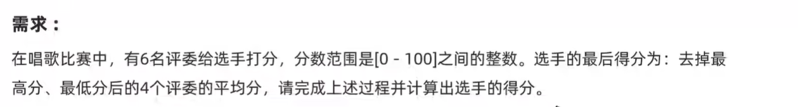

```java
/*
 * @Author       : wephiles@20866
 * @CreateTime   : 2024-07-15 15:03
 * @ProjectName  : base_code_1
 * @PackageName  : com.jinyu.practice
 * @FileName     : com.jinyu.practice/JudgesScores.java
 * @ClassName    : JudgesScores
 * @Description  : You must take your place in the circle of life.
 * @PersonalSite : https://github.com/wephiles or https://gitee.com/wephiles
 */

package com.jinyu.practice;

public class JudgesScores {
    public static void main(String[] args) {
        /*
         * 评委打分，六个评委，分数范围是 0 - 100 之间的整数，选手最后得分为去掉最高分、最低分后的四个评委的平均分
         * */

        int[] scores = {85, 95, 78, 88, 98, 87};
        int max = scores[0], min = scores[0];
        for (int i = 1; i < scores.length; i++) {
            if (scores[i] > max) {
                max = scores[i];
            }
            if (scores[i] < min) {
                min = scores[i];
            }
        }
        int sum = 0;
        for (int score : scores) {
            sum += score;
        }
        double realScore = (sum - max - min) / ((scores.length - 2) * 1.0);
        System.out.println(realScore);
    }
}

```

# 6 第六题 数字加密

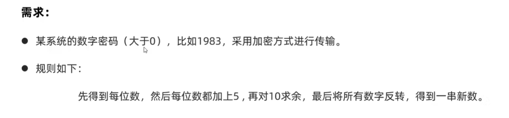

```java
/*
 * @Author       : wephiles@20866
 * @CreateTime   : 2024-07-15 15:15
 * @ProjectName  : base_code_1
 * @PackageName  : com.jinyu.practice
 * @FileName     : com.jinyu.practice/DigitalEncryption.java
 * @ClassName    : DigitalEncryption
 * @Description  : You must take your place in the circle of life.
 * @PersonalSite : https://github.com/wephiles or https://gitee.com/wephiles
 */

package com.jinyu.practice;

public class DigitalEncryption {
    public static void main(String[] args) {
        int password = 12345;
        int flag = password;
        int passwordLen = 0;
        // 计算数组长度
        while (password != 0) {
            password = password / 10;
            passwordLen++;
        }
        int[] array = new int[passwordLen];
        password = flag;
        int index = passwordLen - 1;
        // 将每个数据存到数组中
        while (password != 0) {
            int m = password % 10;
            array[index] = m;
            index--;
            password = password / 10;
        }

        /*// 遍历
        for (int j : array) {
            System.out.print(STR."\{j} ");
        }*/

        for (int i = 0; i < array.length; i++) {
            array[i] += 5;
            array[i] %= 10;
        }
        for (int i = 0; i < (array.length / 2); i++) {
            int temp = array[i];
            array[i] = array[array.length - i - 1];
            array[array.length - i - 1] = temp;
        }
        /*// 遍历
        for (int j : array) {
            System.out.print(STR."\{j} ");
        }*/
        // 拼接
        int number = 0;
        for (int i = 0; i < array.length; i++) {
            number = number * 10 + array[i];
        }
        System.out.println(number);
    }
}

```

# 7 第七题 数字解密

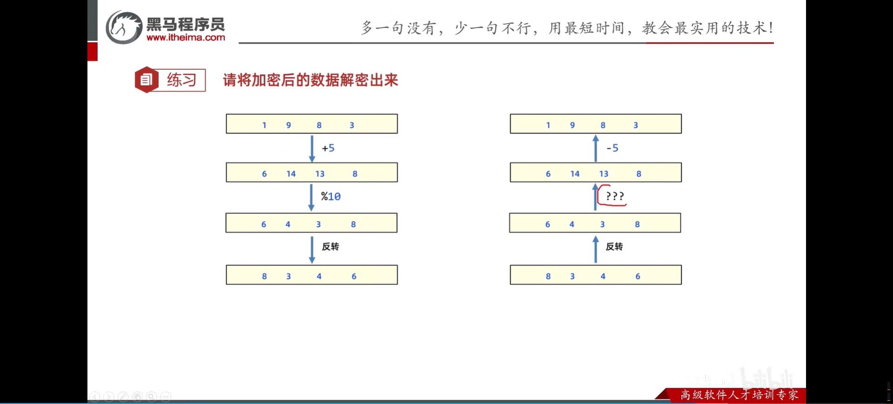

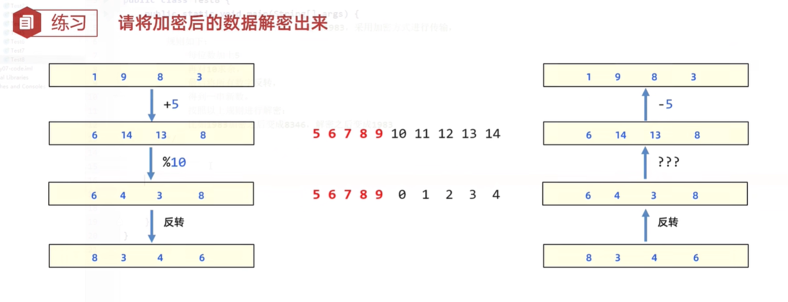

```java
/*
 * @Author       : wephiles@20866
 * @CreateTime   : 2024-07-15 15:46
 * @ProjectName  : base_code_1
 * @PackageName  : com.jinyu.practice
 * @FileName     : com.jinyu.practice/NumberDecrypt.java
 * @ClassName    : NumberDecrypt
 * @Description  :
 * @Motto        : You must take your place in the circle of life.
 * @PersonalSite : https://github.com/wephiles or https://gitee.com/wephiles
 */

package com.jinyu.practice;

public class NumberDecrypt {
    public static void main(String[] args) {
        int[] array = {8, 3, 4, 6};
        // 翻转
        for (int i = 0; i < array.length / 2; i++) {
            int temp = array[i];
            array[i] = array[array.length - i - 1];
            array[array.length - i - 1] = temp;
        }
        // 处理对10取余的解密
        for (int i = 0; i < array.length; i++) {
            if (array[i] >= 0 && array[i] <= 4) {
                array[i] += 10;
            }
        }

        // 每一位 -5
        for (int i = 0; i < array.length; i++) {
            array[i] -= 5;
        }

        // 拼接
        int number = 0;
        for (int i = 0; i < array.length; i++) {
            number = number * 10 + array[i];
        }
        System.out.println(number);
    }
}

```

# 8 第八题 抢红包

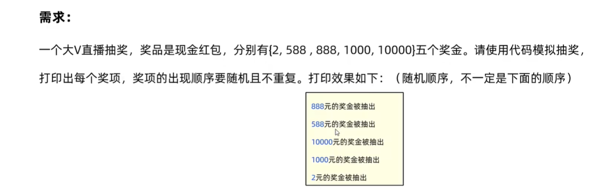

```java
略
```

# 9 第九题 模拟双色球

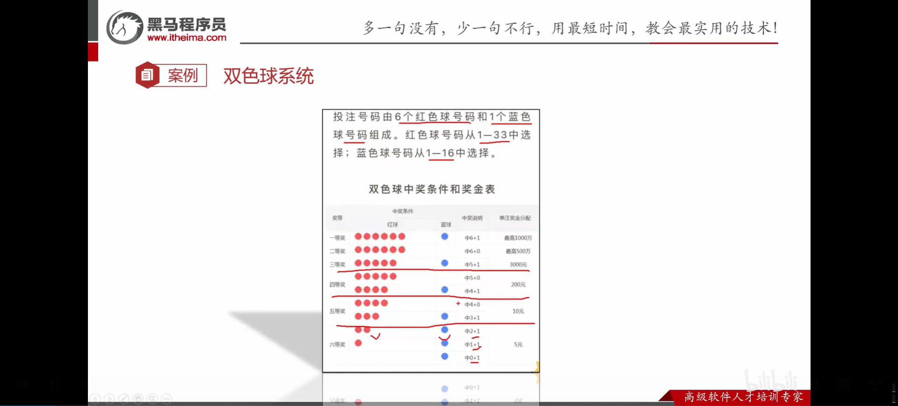

```java
```

# 10 第十题 二维数组


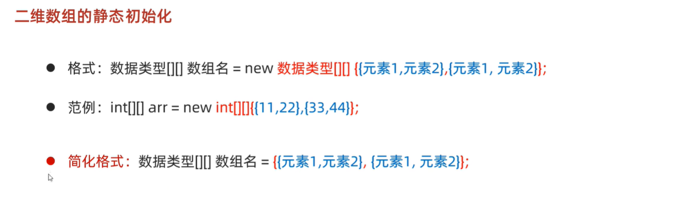

```java
/*
 * @Author       : wephiles@20866
 * @CreateTime   : 2024-07-15 17:59
 * @ProjectName  : base_code_1
 * @PackageName  : com.jinyu.array_demo
 * @FileName     : com.jinyu.array_demo/TwoDimension.java
 * @ClassName    : TwoDimension
 * @Description  :
 * @Motto        : You must take your place in the circle of life.
 * @PersonalSite : https://github.com/wephiles or https://gitee.com/wephiles
 */

package com.jinyu.array_demo;


public class TwoDimension {
    public static void main(String[] args) {
        int[][] array = {
                {1, 2, 3, 4, 5},
                {11, 22, 33},
                {111, 222, 333}
        };

        for (int i = 0; i < array.length; i++) {
            for (int j = 0; j < array[i].length; j++) {
                System.out.print(STR."\{array[i][j]} ");
            }
            System.out.println();
        }

        // 动态初始化
        int[][] newArray = new int[2][3];
        newArray[0][0] = 10;

        for (int i = 0; i < newArray.length; i++) {
            for (int j = 0; j < newArray[i].length; j++) {
                System.out.print(STR."\{newArray[i][j]} ");
            }
            System.out.println();
        }
    }
}

```

## 10.1 二维数组内存图

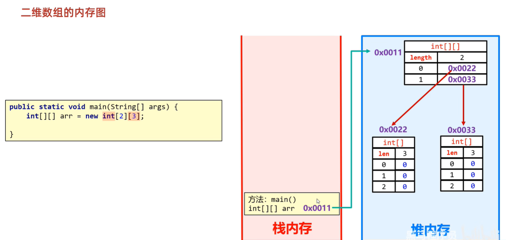

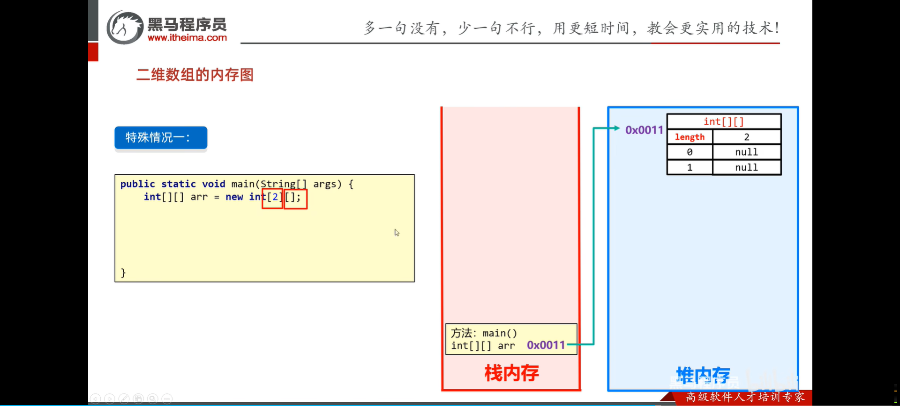

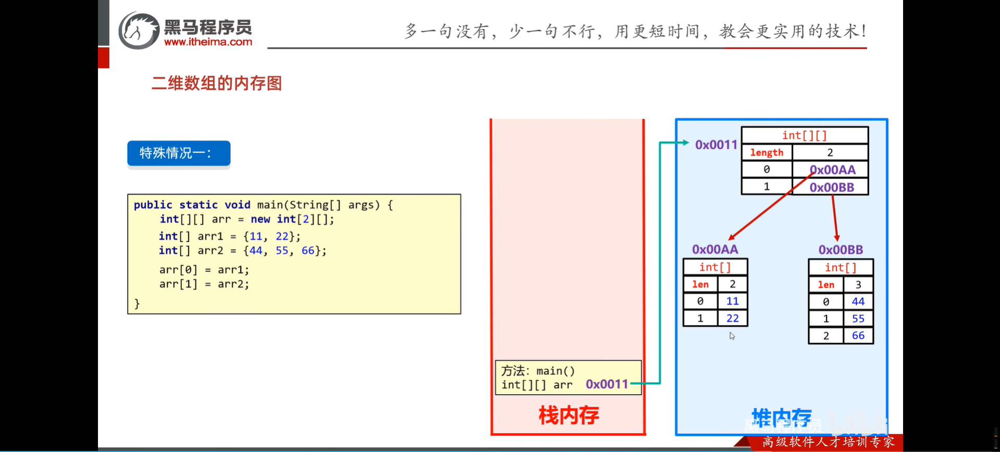

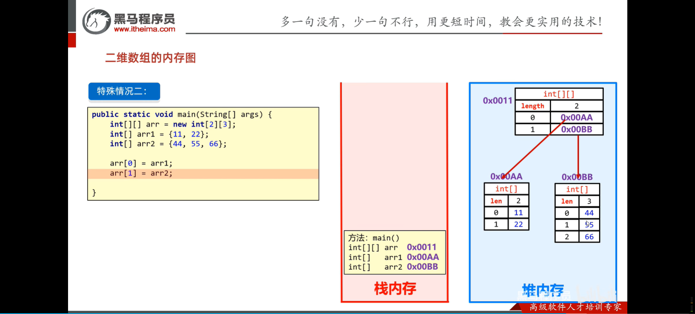

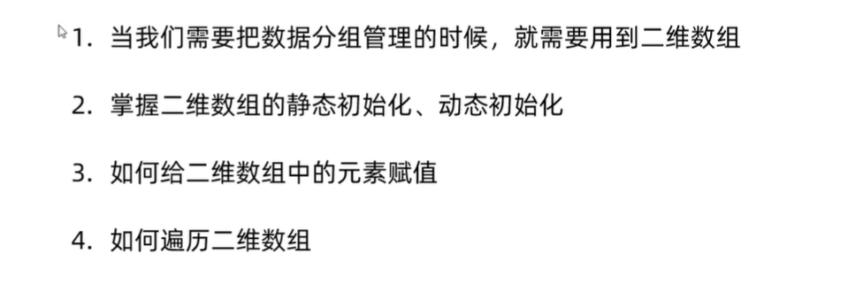


