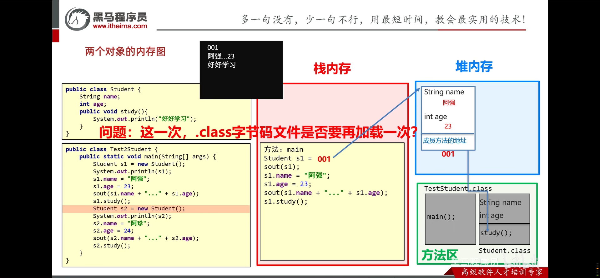

<h1 style="text-align: center; font-family: 'Menlo'">07.面向对象</h1>

[TOC]

# 1 什么是面向对象


# 2 设计对象并使用

## 2.1 类和对象


```java
// Phone.java

/*
 * @Author       : wephiles@20866
 * @CreateTime   : 2024-07-17 17:42
 * @ProjectName  : base_code_1
 * @PackageName  : com.jinyu.oop
 * @FileName     : com.jinyu.oop/Phone.java
 * @ClassName    : Phone
 * @Description  :
 * @Motto        : You must take your place in the circle of life.
 * @PersonalSite : https://github.com/wephiles or https://gitee.com/wephiles
 */

package com.jinyu.oop;

public class Phone {
    String brand;
    double price;

    public void call() {
        System.out.println("打电话...");
    }

    public void playGame() {
        System.out.println("玩游戏...");
    }
}

```

```java
// PhoneTest.java

/*
 * @Author       : wephiles@20866
 * @CreateTime   : 2024-07-17 17:43
 * @ProjectName  : base_code_1
 * @PackageName  : com.jinyu.oop
 * @FileName     : com.jinyu.oop/PhoneTest.java
 * @ClassName    : PhoneTest
 * @Description  :
 * @Motto        : You must take your place in the circle of life.
 * @PersonalSite : https://github.com/wephiles or https://gitee.com/wephiles
 */

package com.jinyu.oop;

public class PhoneTest {
    public static void main(String[] args) {
        // 创建手机对象
        Phone phone = new Phone();

        // 给手机对象赋值
        phone.brand = "nuojiya ";
        phone.price = 1988.5;

        System.out.println(phone.brand);
        System.out.println(phone.price);
        // 调用手机中的方法即可
        phone.call();
        phone.playGame();
    }
}

```


## 2.2 定义类的补充注意事项


练习题：


```java
// GirlFriend.java

/*
 * @Author       : wephiles@20866
 * @CreateTime   : 2024-07-17 17:56
 * @ProjectName  : base_code_1
 * @PackageName  : com.jinyu.oop
 * @FileName     : com.jinyu.oop/GirlFriendTest.java
 * @ClassName    : GirlFriendTest
 * @Description  :
 * @Motto        : You must take your place in the circle of life.
 * @PersonalSite : https://github.com/wephiles or https://gitee.com/wephiles
 */

package com.jinyu.oop;

public class GirlFriendTest {
    public static void main(String[] args) {
        GirlFriend gf1 = new GirlFriend();
        gf1.age = 18;
        gf1.gender = "女";
        gf1.name = "小诗诗";

        System.out.println(gf1.age);
        System.out.println(gf1.gender);
        System.out.println(gf1.name);
    }
}

```


## 2.3 开发中设计的类

名词提炼法:


以试卷考试为例：


# 3 **封装**


## 3.1 private关键字


## 3.2 this关键字


# 4 构造方法


```java
// FriendTest.java
/*
 * @Author       : wephiles@20866
 * @CreateTime   : 2024-07-22 20:07
 * @ProjectName  : base_code_1
 * @PackageName  : com.jinyu.oop
 * @FileName     : com.jinyu.oop/FriendTest.java
 * @ClassName    : FriendTest
 * @Description  :
 * @Motto        : You must take your place in the circle of life.
 * @PersonalSite : https://github.com/wephiles or https://gitee.com/wephiles
 */

package com.jinyu.oop;

public class FriendTest {
    public static void main(String[] args) {
        // 细节：如果我们没有写构造方法，虚拟机会为我们自动加一个空参构造方法
        Student zhangsan = new Student(18, "张三");
//        zhangsan.setAge(10);
//        zhangsan.setName("张三");

        System.out.println(zhangsan.getName());
        System.out.println(zhangsan.getAge());
    }
}

```

```java
// Student.java

/*
 * @Author       : wephiles@20866
 * @CreateTime   : 2024-07-22 20:03
 * @ProjectName  : base_code_1
 * @PackageName  : com.jinyu.oop
 * @FileName     : com.jinyu.oop/Student.java
 * @ClassName    : Student
 * @Description  : 
 * @Motto        : You must take your place in the circle of life.
 * @PersonalSite : https://github.com/wephiles or https://gitee.com/wephiles
 */

package com.jinyu.oop;

public class Student {
    private String name;
    private int age;

    public Student(int age, String name) {
        this.age = age;
        this.name = name;
    }

    public int getAge() {
        return this.age;
    }

    public String getName() {
        return this.name;
    }

    public void setAge(int age) {
        this.age = age;
    }

    public void setName(String name) {
        this.name = name;
    }
}

```

构造方法注意事项：


# 5 标准`JavaBean`


例子：


实现：

```java
/*
 * @Author       : wephiles@20866
 * @CreateTime   : 2024-07-23 20:53
 * @ProjectName  : base_code_1
 * @PackageName  : com.jinyu.oop
 * @FileName     : com.jinyu.oop/User.java
 * @ClassName    : User
 * @Description  :
 * @Motto        : You must take your place in the circle of life.
 * @PersonalSite : https://github.com/wephiles or https://gitee.com/wephiles
 */

package com.jinyu.oop;

public class User {
    // 属性
    private String userName;
    private String password;
    private String email;
    private char gender;
    private int age;

    public User() {
    }

    public User(String userName, String password, String email, char gender, int age) {
        this.userName = userName;
        this.password = password;
        this.email = email;
        this.gender = gender;
        this.age = age;
    }

    /**
     * 获取
     *
     * @return userName
     */
    public String getUserName() {
        return userName;
    }

    /**
     * 设置
     *
     * @param userName
     */
    public void setUserName(String userName) {
        this.userName = userName;
    }

    /**
     * 获取
     *
     * @return password
     */
    public String getPassword() {
        return password;
    }

    /**
     * 设置
     *
     * @param password
     */
    public void setPassword(String password) {
        this.password = password;
    }

    /**
     * 获取
     *
     * @return email
     */
    public String getEmail() {
        return email;
    }

    /**
     * 设置
     *
     * @param email
     */
    public void setEmail(String email) {
        this.email = email;
    }

    /**
     * 获取
     *
     * @return gender
     */
    public char getGender() {
        return gender;
    }

    /**
     * 设置
     *
     * @param gender
     */
    public void setGender(char gender) {
        this.gender = gender;
    }

    /**
     * 获取
     *
     * @return age
     */
    public int getAge() {
        return age;
    }

    /**
     * 设置
     *
     * @param age
     */
    public void setAge(int age) {
        this.age = age;
    }

    public String toString() {
        return "User{userName = " + userName + ", password = " + password + ", email = " + email + ", gender = " + gender + ", age = " + age + "}";
    }

    // 空参构造函数
    /*public User() {

    }

    // 带有全部参数的构造函数
    public User(String userName, String password, String email, char gender, int age) {
        this.userName = userName;
        this.password = password;
        this.email = email;
        this.gender = gender;
        this.age = age;
    }*/

    /*public void setUserName(String userName) {
        this.userName = userName;
    }
    public String getUserName() {
        return this.userName;
    }*/

    // 快捷键生成 构造方法 set和get方法 -- alt + insert
    // 选择constructor -- 生成构造方法

    /*public User() {
    }

    public User(String userName, String password, String email, char gender, int age) {
        this.userName = userName;
        this.password = password;
        this.email = email;
        this.gender = gender;
        this.age = age;
    }
    // 生成get和set方法 -- 选择getter and setter

    public String getUserName() {
        return userName;
    }

    public void setUserName(String userName) {
        this.userName = userName;
    }

    public String getPassword() {
        return password;
    }

    public void setPassword(String password) {
        this.password = password;
    }

    public String getEmail() {
        return email;
    }

    public void setEmail(String email) {
        this.email = email;
    }

    public char getGender() {
        return gender;
    }

    public void setGender(char gender) {
        this.gender = gender;
    }

    public int getAge() {
        return age;
    }

    public void setAge(int age) {
        this.age = age;
    }*/

    // 还有 -- 插件PTG，1秒生成标准JavaBean
    // 右键点击编辑代码空白区域 选择Ptg to JavaBean

}

```

# 6 对象内存图


## 6.1 一个对象的内存图


默认初始化 ->


显式初始化 -> 注意在内存的堆区域，那里的null应该是“张三”，0应该是23 （与左边那个Student类对比着看）


## 6.2 多个对象的内存图





答案是 -- 不需要！！！

## 6.3 两个引用指向同一个对象


代码还在继续...


当堆里面的数据已经没有指向其的指针，那么内存就会被回收。


## 6.4 基本数据类型和引用数据类型


