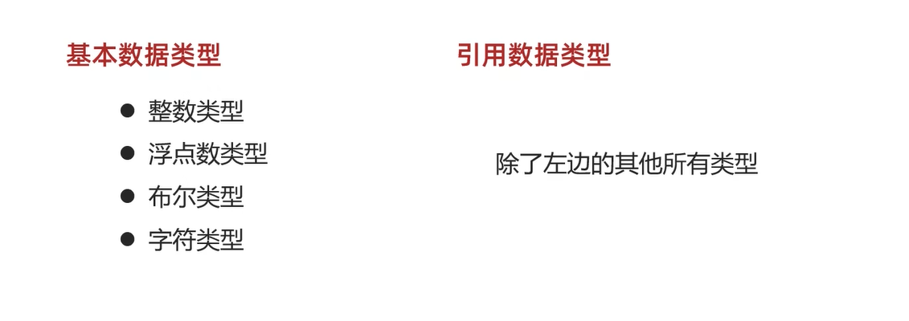
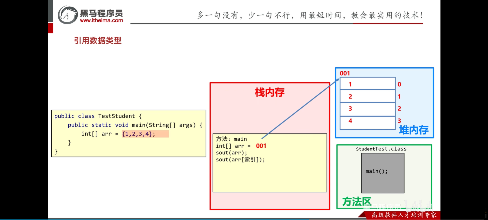
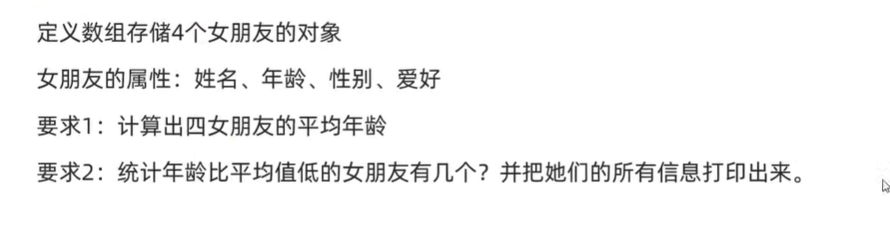
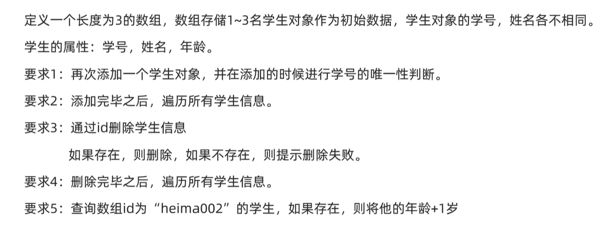

<h1 style="text-align: center; font-family: 'Menlo'">07.面向对象</h1>

[TOC]

# 1 什么是面向对象


# 2 设计对象并使用

## 2.1 类和对象


```java
// Phone.java

/*
 * @Author       : wephiles@20866
 * @CreateTime   : 2024-07-17 17:42
 * @ProjectName  : base_code_1
 * @PackageName  : com.jinyu.oop
 * @FileName     : com.jinyu.oop/Phone.java
 * @ClassName    : Phone
 * @Description  :
 * @Motto        : You must take your place in the circle of life.
 * @PersonalSite : https://github.com/wephiles or https://gitee.com/wephiles
 */

package com.jinyu.oop;

public class Phone {
    String brand;
    double price;

    public void call() {
        System.out.println("打电话...");
    }

    public void playGame() {
        System.out.println("玩游戏...");
    }
}

```

```java
// PhoneTest.java

/*
 * @Author       : wephiles@20866
 * @CreateTime   : 2024-07-17 17:43
 * @ProjectName  : base_code_1
 * @PackageName  : com.jinyu.oop
 * @FileName     : com.jinyu.oop/PhoneTest.java
 * @ClassName    : PhoneTest
 * @Description  :
 * @Motto        : You must take your place in the circle of life.
 * @PersonalSite : https://github.com/wephiles or https://gitee.com/wephiles
 */

package com.jinyu.oop;

public class PhoneTest {
    public static void main(String[] args) {
        // 创建手机对象
        Phone phone = new Phone();

        // 给手机对象赋值
        phone.brand = "nuojiya ";
        phone.price = 1988.5;

        System.out.println(phone.brand);
        System.out.println(phone.price);
        // 调用手机中的方法即可
        phone.call();
        phone.playGame();
    }
}

```


## 2.2 定义类的补充注意事项


练习题：


```java
// GirlFriend.java

/*
 * @Author       : wephiles@20866
 * @CreateTime   : 2024-07-17 17:56
 * @ProjectName  : base_code_1
 * @PackageName  : com.jinyu.oop
 * @FileName     : com.jinyu.oop/GirlFriendTest.java
 * @ClassName    : GirlFriendTest
 * @Description  :
 * @Motto        : You must take your place in the circle of life.
 * @PersonalSite : https://github.com/wephiles or https://gitee.com/wephiles
 */

package com.jinyu.oop;

public class GirlFriendTest {
    public static void main(String[] args) {
        GirlFriend gf1 = new GirlFriend();
        gf1.age = 18;
        gf1.gender = "女";
        gf1.name = "小诗诗";

        System.out.println(gf1.age);
        System.out.println(gf1.gender);
        System.out.println(gf1.name);
    }
}

```


## 2.3 开发中设计的类

名词提炼法:


以试卷考试为例：


# 3 **封装**


## 3.1 private关键字


## 3.2 this关键字


# 4 构造方法


```java
// FriendTest.java
/*
 * @Author       : wephiles@20866
 * @CreateTime   : 2024-07-22 20:07
 * @ProjectName  : base_code_1
 * @PackageName  : com.jinyu.oop
 * @FileName     : com.jinyu.oop/FriendTest.java
 * @ClassName    : FriendTest
 * @Description  :
 * @Motto        : You must take your place in the circle of life.
 * @PersonalSite : https://github.com/wephiles or https://gitee.com/wephiles
 */

package com.jinyu.oop;

public class FriendTest {
    public static void main(String[] args) {
        // 细节：如果我们没有写构造方法，虚拟机会为我们自动加一个空参构造方法
        Student zhangsan = new Student(18, "张三");
//        zhangsan.setAge(10);
//        zhangsan.setName("张三");

        System.out.println(zhangsan.getName());
        System.out.println(zhangsan.getAge());
    }
}

```

```java
// Student.java

/*
 * @Author       : wephiles@20866
 * @CreateTime   : 2024-07-22 20:03
 * @ProjectName  : base_code_1
 * @PackageName  : com.jinyu.oop
 * @FileName     : com.jinyu.oop/Student.java
 * @ClassName    : Student
 * @Description  : 
 * @Motto        : You must take your place in the circle of life.
 * @PersonalSite : https://github.com/wephiles or https://gitee.com/wephiles
 */

package com.jinyu.oop;

public class Student {
    private String name;
    private int age;

    public Student(int age, String name) {
        this.age = age;
        this.name = name;
    }

    public int getAge() {
        return this.age;
    }

    public String getName() {
        return this.name;
    }

    public void setAge(int age) {
        this.age = age;
    }

    public void setName(String name) {
        this.name = name;
    }
}

```

构造方法注意事项：


# 5 标准`JavaBean`


例子：


实现：

```java
/*
 * @Author       : wephiles@20866
 * @CreateTime   : 2024-07-23 20:53
 * @ProjectName  : base_code_1
 * @PackageName  : com.jinyu.oop
 * @FileName     : com.jinyu.oop/User.java
 * @ClassName    : User
 * @Description  :
 * @Motto        : You must take your place in the circle of life.
 * @PersonalSite : https://github.com/wephiles or https://gitee.com/wephiles
 */

package com.jinyu.oop;

public class User {
    // 属性
    private String userName;
    private String password;
    private String email;
    private char gender;
    private int age;

    public User() {
    }

    public User(String userName, String password, String email, char gender, int age) {
        this.userName = userName;
        this.password = password;
        this.email = email;
        this.gender = gender;
        this.age = age;
    }

    /**
     * 获取
     *
     * @return userName
     */
    public String getUserName() {
        return userName;
    }

    /**
     * 设置
     *
     * @param userName
     */
    public void setUserName(String userName) {
        this.userName = userName;
    }

    /**
     * 获取
     *
     * @return password
     */
    public String getPassword() {
        return password;
    }

    /**
     * 设置
     *
     * @param password
     */
    public void setPassword(String password) {
        this.password = password;
    }

    /**
     * 获取
     *
     * @return email
     */
    public String getEmail() {
        return email;
    }

    /**
     * 设置
     *
     * @param email
     */
    public void setEmail(String email) {
        this.email = email;
    }

    /**
     * 获取
     *
     * @return gender
     */
    public char getGender() {
        return gender;
    }

    /**
     * 设置
     *
     * @param gender
     */
    public void setGender(char gender) {
        this.gender = gender;
    }

    /**
     * 获取
     *
     * @return age
     */
    public int getAge() {
        return age;
    }

    /**
     * 设置
     *
     * @param age
     */
    public void setAge(int age) {
        this.age = age;
    }

    public String toString() {
        return "User{userName = " + userName + ", password = " + password + ", email = " + email + ", gender = " + gender + ", age = " + age + "}";
    }

    // 空参构造函数
    /*public User() {

    }

    // 带有全部参数的构造函数
    public User(String userName, String password, String email, char gender, int age) {
        this.userName = userName;
        this.password = password;
        this.email = email;
        this.gender = gender;
        this.age = age;
    }*/

    /*public void setUserName(String userName) {
        this.userName = userName;
    }
    public String getUserName() {
        return this.userName;
    }*/

    // 快捷键生成 构造方法 set和get方法 -- alt + insert
    // 选择constructor -- 生成构造方法

    /*public User() {
    }

    public User(String userName, String password, String email, char gender, int age) {
        this.userName = userName;
        this.password = password;
        this.email = email;
        this.gender = gender;
        this.age = age;
    }
    // 生成get和set方法 -- 选择getter and setter

    public String getUserName() {
        return userName;
    }

    public void setUserName(String userName) {
        this.userName = userName;
    }

    public String getPassword() {
        return password;
    }

    public void setPassword(String password) {
        this.password = password;
    }

    public String getEmail() {
        return email;
    }

    public void setEmail(String email) {
        this.email = email;
    }

    public char getGender() {
        return gender;
    }

    public void setGender(char gender) {
        this.gender = gender;
    }

    public int getAge() {
        return age;
    }

    public void setAge(int age) {
        this.age = age;
    }*/

    // 还有 -- 插件PTG，1秒生成标准JavaBean
    // 右键点击编辑代码空白区域 选择Ptg to JavaBean

}

```

# 6 对象内存图


## 6.1 一个对象的内存图


默认初始化 ->


显式初始化 -> 注意在内存的堆区域，那里的null应该是“张三”，0应该是23 （与左边那个Student类对比着看）


## 6.2 多个对象的内存图


答案是 -- 不需要！！！

## 6.3 两个引用指向同一个对象


代码还在继续...


当堆里面的数据已经没有指向其的指针，那么内存就会被回收。


## 6.4 基本数据类型和引用数据类型







# 7 this的内存原理


 

# 8 成员变量和局部变量的区别


# 9 面向对象综合训练

## 9.1 文字版格斗游戏


```java
// Role.java
/*
 * @Author       : wephiles@20866
 * @CreateTime   : 2024-07-28 9:25
 * @ProjectName  : base_code_2
 * @PackageName  : com.jinyu.test
 * @FileName     : com.jinyu.test/Role.java
 * @ClassName    : Role
 * @Description  :
 * @Motto        : You must take your place in the circle of life.
 * @PersonalSite : https://github.com/wephiles or https://gitee.com/wephiles
 */

package com.jinyu.test;

import java.util.Random;

public class Role {
    private String name;
    private int blood;

    public Role() {

    }

    public Role(String name, int blood) {
        this.name = name;
        this.blood = blood;
    }

    public String getName() {
        return name;
    }

    public void setName(String name) {
        this.name = name;
    }

    public int getBlood() {
        return blood;
    }

    public void setBlood(int blood) {
        this.blood = blood;
    }

    // 定义一个方法用以攻击别人
    // 谁攻击谁
    // 方法的调用者去工具参数
    public void attack(Role role) {
        // 计算造成的伤害 1 ~ 20
        Random rd = new Random();
        int hurt = rd.nextInt(20) + 1;
        // 收到伤害，计算还剩多少血量
        int remainBlood = role.getBlood() - hurt;

        // 判断是否小于0 如果为负数，那么修改为0
        remainBlood = remainBlood < 0 ? 0 : remainBlood;
        role.setBlood(remainBlood);
        System.out.println(this.getName() +
                "举起拳头打了" + role.getName() +
                "一下，" + role.getName() +
                "掉了" +
                hurt +
                "滴血。" +
                role.getName() +
                "还剩" +
                remainBlood +
                "血量。");
    }
}

```

```java
// GameTest.java
/*
 * @Author       : wephiles@20866
 * @CreateTime   : 2024-07-28 9:22
 * @ProjectName  : base_code_2
 * @PackageName  : com.jinyu.test
 * @FileName     : com.jinyu.test/FightGame.java
 * @ClassName    : FightGame
 * @Description  :
 * @Motto        : You must take your place in the circle of life.
 * @PersonalSite : https://github.com/wephiles or https://gitee.com/wephiles
 */

package com.jinyu.test;

public class GameTest {
    public static void main(String[] args) {
        // 文字格斗游戏 测试
        Role r1 = new Role("乔峰", 100);
        Role r2 = new Role();
        r2.setName("鸠摩智");
        r2.setBlood(100);

        // 开始格斗
        while (true) {
            // r1攻击r2
            r1.attack(r2);
            if (r2.getBlood() == 0) {
                System.out.println(r2.getName() + "被击败，游戏结束。");
                break;
            }

            r2.attack(r1);
            if (r1.getBlood() == 0) {
                System.out.println(r1.getName() + "被击败，游戏结束。");
                break;
            }

        }
    }
}

```

优化：


```java
/*
 * @Author       : wephiles@20866
 * @CreateTime   : 2024-07-28 9:22
 * @ProjectName  : base_code_2
 * @PackageName  : com.jinyu.test
 * @FileName     : com.jinyu.test/FightGame.java
 * @ClassName    : FightGame
 * @Description  :
 * @Motto        : You must take your place in the circle of life.
 * @PersonalSite : https://github.com/wephiles or https://gitee.com/wephiles
 */

package com.jinyu.test;

public class GameTest {
    public static void main(String[] args) {
        // 文字格斗游戏 测试
        Role r1 = new Role("乔峰", 100, '男');
        Role r2 = new Role();
        r2.setName("鸠摩智");
        r2.setBlood(100);
        r2.setGender('男');
        r2.setFace('男');

        r1.showRoleInfo();
        r2.showRoleInfo();

        // 开始格斗
        while (true) {
            // r1攻击r2
            r1.attack(r2);
            if (r2.getBlood() == 0) {
                System.out.println(r2.getName() + "被击败，游戏结束。");
                break;
            }

            r2.attack(r1);
            if (r1.getBlood() == 0) {
                System.out.println(r1.getName() + "被击败，游戏结束。");
                break;
            }
        }
    }
}

```

```java
/*
 * @Author       : wephiles@20866
 * @CreateTime   : 2024-07-28 9:25
 * @ProjectName  : base_code_2
 * @PackageName  : com.jinyu.test
 * @FileName     : com.jinyu.test/Role.java
 * @ClassName    : Role
 * @Description  :
 * @Motto        : You must take your place in the circle of life.
 * @PersonalSite : https://github.com/wephiles or https://gitee.com/wephiles
 */

package com.jinyu.test;

import java.util.Random;

public class Role {
    private String name;
    private int blood;
    private char gender;  // 性别
    private String face;  // 长相 随机产生
    String[] boyFaces = {"风流俊雅", "气宇轩昂", "相貌英俊", "五官端正", "相貌平平", "一塌糊涂", "面目狰狞"};
    String[] girlFaces = {"美奂绝伦", "沉鱼落雁", "婷婷玉立", "身材娇好", "相貌平平", "相貌简陋", "惨不忍睹"};
    String[] attacksDesc = {
            "%s使出了一招【背心钉】，转到对方的身后，一掌向%s背心的灵台穴拍去。",
            "%s使出了一招【游空探爪】，飞起身形自半空中变掌为抓锁向%s。",
            "%s大喝一声，身形下伏，一招【劈雷坠地】，捶向%s双腿。",
            "%s运气于掌，一瞬间掌心变得血红，一式【掌心雷】，推向%s。",
            "%s阴手翻起阳手跟进，一招【没遮拦】，结结实实的捶向%s。",
            "%s上步抢身，招中套招，一招【劈挂连环】，连环攻向%s。"
    };

    String[] injuredsDesc = {
            "结果%s退了半步，毫发无损",
            "结果给%s造成一处瘀伤",
            "结果一击命中，%s痛得弯下腰",
            "结果%s痛苦地闷哼了一声，显然受了点内伤",
            "结果%s摇摇晃晃，一跤摔倒在地",
            "结果%s脸色一下变得惨白，连退了好几步",
            "结果『轰』的一声，%s口中鲜血狂喷而出",
            "结果%s一声惨叫，像滩软泥般塌了下去"
    };


    public Role() {

    }

    public Role(String name, int blood, char gender) {
        this.name = name;
        this.blood = blood;
        this.gender = gender;
        this.setFace(gender);
    }

    public char getGender() {
        return gender;
    }

    public void setGender(char gender) {
        this.gender = gender;
    }

    public String getFace() {
        return face;
    }

    public void setFace(char gender) {
        Random rd = new Random();
        if (gender == '男') {
            int index = rd.nextInt(boyFaces.length);
            this.face = boyFaces[index];
        } else if (gender == '女') {
            int index = rd.nextInt(girlFaces.length);
            this.face = girlFaces[index];
        } else {
            this.face = "面目狰狞";
        }
    }


    public String getName() {
        return name;
    }

    public void setName(String name) {
        this.name = name;
    }

    public int getBlood() {
        return blood;
    }

    public void setBlood(int blood) {
        this.blood = blood;
    }

    // 定义一个方法用以攻击别人
    // 谁攻击谁
    // 方法的调用者去工具参数
    public void attack(Role role) {
        Random rd = new Random();
        int indexAttacksDesc = rd.nextInt(this.attacksDesc.length);
        String KunFu = this.attacksDesc[indexAttacksDesc];
        // 输出攻击的效果
        System.out.printf(KunFu, this.getName(), role.getName());

        // 计算造成的伤害 1 ~ 20
        int hurt = rd.nextInt(20) + 1;
        // 收到伤害，计算还剩多少血量
        int remainBlood = role.getBlood() - hurt;

        // 判断是否小于0 如果为负数，那么修改为0
        remainBlood = remainBlood < 0 ? 0 : remainBlood;
        role.setBlood(remainBlood);

        // 受伤的描述
        // 血量>90 0索引 80-90 1索引 70-80 2索引 60-70 3索引 50-60 4索引 ... 10-20 6 索引 <10 7索引
        if (remainBlood > 90) {
            System.out.printf(this.injuredsDesc[0], role.getName());
        } else if (remainBlood > 80 && remainBlood <= 90) {
            System.out.printf(this.injuredsDesc[1], role.getName());
        } else if (remainBlood > 70 && remainBlood <= 80) {
            System.out.printf(this.injuredsDesc[2], role.getName());
        } else if (remainBlood > 60 && remainBlood <= 70) {
            System.out.printf(this.injuredsDesc[3], role.getName());
        } else if (remainBlood > 40 && remainBlood <= 60) {
            System.out.printf(this.injuredsDesc[4], role.getName());
        } else if (remainBlood > 20 && remainBlood <= 40) {
            System.out.printf(this.injuredsDesc[5], role.getName());
        } else if (remainBlood > 10 && remainBlood <= 20) {
            System.out.printf(this.injuredsDesc[6], role.getName());
        } else {
            System.out.printf(this.injuredsDesc[7], role.getName());
        }
        System.out.println();
    }

    public void showRoleInfo() {
        System.out.print("姓名为：" + getName());
        System.out.print(" 性别为：" + getGender());
        System.out.print(" 血量为：" + getBlood());
        System.out.print(" 颜值为：" + getFace());
        System.out.println();
    }
}

```

## 9.2 对象数组练习

### 9.2.1 练习1


```java
/*
 * @Author       : wephiles@20866
 * @CreateTime   : 2024-07-29 19:52
 * @ProjectName  : base_code_2
 * @PackageName  : com.jinyu.test
 * @FileName     : com.jinyu.test/Goods.java
 * @ClassName    : ObjectArray
 * @Description  :
 * @Motto        : You must take your place in the circle of life.
 * @PersonalSite : https://github.com/wephiles or https://gitee.com/wephiles
 */

package com.jinyu.test;

public class Goods {
    private String id;
    private String name;
    private double price;
    private int remainder;  // 库存

    public Goods() {
    }

    public Goods(String id, String name, double price, int remainder) {
        this.id = id;
        this.name = name;
        this.price = price;
        this.remainder = remainder;
    }

    public String getId() {
        return id;
    }

    public void setId(String id) {
        this.id = id;
    }

    public String getName() {
        return name;
    }

    public void setName(String name) {
        this.name = name;
    }

    public double getPrice() {
        return price;
    }

    public void setPrice(double price) {
        this.price = price;
    }

    public int getRemainder() {
        return remainder;
    }

    public void setRemainder(int remainder) {
        this.remainder = remainder;
    }
}

```

```java
/*
 * @Author       : wephiles@20866
 * @CreateTime   : 2024-07-29 19:57
 * @ProjectName  : base_code_2
 * @PackageName  : com.jinyu.test
 * @FileName     : com.jinyu.test/GoodsTest.java
 * @ClassName    : GoodsTest
 * @Description  :
 * @Motto        : You must take your place in the circle of life.
 * @PersonalSite : https://github.com/wephiles or https://gitee.com/wephiles
 */

package com.jinyu.test;

public class GoodsTest {
    public static void main(String[] args) {
        Goods basket = new Goods("A0001", "篮子", 10.5, 100);
        Goods ball = new Goods("A0002", "球", 100, 10);
        Goods computer = new Goods("A0003", "电脑", 5000, 5);
        Goods[] goods = {basket, ball, computer};
        for (int i = 0; i < goods.length; i++) {
            System.out.println(goods[i].getId());
            System.out.println(goods[i].getName());
            System.out.println(goods[i].getPrice());
            System.out.println(goods[i].getRemainder());
        }
    }
}

```

### 9.2.2 练习2


补充：键盘录入

```java
/*
 * @Author       : wephiles@20866
 * @CreateTime   : 2024-07-29 20:03
 * @ProjectName  : base_code_2
 * @PackageName  : com.jinyu.tes1
 * @FileName     : com.jinyu.tes1/Input.java
 * @ClassName    : Input
 * @Description  :
 * @Motto        : You must take your place in the circle of life.
 * @PersonalSite : https://github.com/wephiles or https://gitee.com/wephiles
 */

package com.jinyu.tes1;

import java.util.Scanner;

public class Input {
    public static void main(String[] args) {
        // 键盘录入 -- 体系1
        // 下面两个--遇到空格/制表符/空格就会停止接收 这些数据后面的数据就不会接收了
        // 剩余的会被传到下一行
        // nextDouble()
        // next()  接收字符串
        Scanner sc = new Scanner(System.in);

//        System.out.println("请输入一个整数");
//        int x = sc.nextInt();
//        System.out.println(x);
//
//        System.out.println("请再次输入一个整数");
//        int y = sc.nextInt();
//        System.out.println(y);

//        System.out.println("请输入字符串");
//        String str = sc.next();
//        System.out.println(str);
//
//        System.out.println("请再次输入字符串");
//        String str1 = sc.next();
//        System.out.println(str1);
				
        // 键盘录入 -- 体系2
        // nextLine()  接收字符串
        // 可以接受空格/制表符 遇到回车才会停止接收数据
        System.out.println("请输入一些内容");
        String line1 = sc.nextLine();
        System.out.println(line1);

        System.out.println("请输入一些内容");
        String line2 = sc.nextLine();
        System.out.println(line2);
    }
}

```

此外，键盘录入的两套体系是不能混用的

```java
/*
 * @Author       : wephiles@20866
 * @CreateTime   : 2024-07-29 20:03
 * @ProjectName  : base_code_2
 * @PackageName  : com.jinyu.tes1
 * @FileName     : com.jinyu.tes1/Input.java
 * @ClassName    : Input
 * @Description  :
 * @Motto        : You must take your place in the circle of life.
 * @PersonalSite : https://github.com/wephiles or https://gitee.com/wephiles
 */

package com.jinyu.tes1;

import java.util.Scanner;

public class Input {
    public static void main(String[] args) {
        // 键盘录入
        // 下面两个--遇到空格/制表符/空格就会停止接收 这些数据后面的数据就不会接收了
        // 剩余的会被传到下一行
        // nextDouble()
        // next()  接收字符串
        Scanner sc = new Scanner(System.in);

//        System.out.println("请输入一个整数");
//        int x = sc.nextInt();
//        System.out.println(x);
//
//        System.out.println("请再次输入一个整数");
//        int y = sc.nextInt();
//        System.out.println(y);

//        System.out.println("请输入字符串");
//        String str = sc.next();
//        System.out.println(str);
//
//        System.out.println("请再次输入字符串");
//        String str1 = sc.next();
//        System.out.println(str1);

        // nextLine()  接收字符串
        // 可以接受空格/制表符 遇到回车才会停止接收数据
        /*System.out.println("请输入一些内容");
        String line1 = sc.nextLine();
        System.out.println(line1);

        System.out.println("请输入一些内容");
        String line2 = sc.nextLine();
        System.out.println(line2);*/

        // 混用上述两个体系的输入
        // 有弊端 -- 先用nextInt再用nextLine的时候会导致下面的nextLine接受不到新的数据
        System.out.println("请输入一个整数");
        int x = sc.nextInt();
        System.out.println(x);

        System.out.println("请输入一个字符串");
        String str = sc.nextLine();
        System.out.println(str);
    }
}

```

代码实现：

```java
/*
 * @Author       : wephiles@20866
 * @CreateTime   : 2024-08-04 12:05
 * @ProjectName  : base_code_2
 * @PackageName  : com.jinyu.test
 * @FileName     : com.jinyu.test/Car.java
 * @ClassName    : Car
 * @Description  :
 * @Motto        : You must take your place in the circle of life.
 * @PersonalSite : https://github.com/wephiles or https://gitee.com/wephiles
 */

package com.jinyu.test;

public class Car {
    private String rand;
    private int price;
    private String color;

    public Car() {
    }

    public Car(String rand, int price, String color) {
        this.rand = rand;
        this.price = price;
        this.color = color;
    }

    public String getRand() {
        return rand;
    }

    public void setRand(String rand) {
        this.rand = rand;
    }

    public int getPrice() {
        return price;
    }

    public void setPrice(int price) {
        this.price = price;
    }

    public String getColor() {
        return color;
    }

    public void setColor(String color) {
        this.color = color;
    }
}

```

```java
/*
 * @Author       : wephiles@20866
 * @CreateTime   : 2024-08-04 12:16
 * @ProjectName  : base_code_2
 * @PackageName  : com.jinyu.test
 * @FileName     : com.jinyu.test/CarTest.java
 * @ClassName    : CarTest
 * @Description  :
 * @Motto        : You must take your place in the circle of life.
 * @PersonalSite : https://github.com/wephiles or https://gitee.com/wephiles
 */

package com.jinyu.test;

import java.util.Scanner;

public class CarTest {
    public static void main(String[] args) {
        // 创建一个Car类型的数组
        Car[] array = new Car[3];

        // 创建汽车对象 数据来自于键盘录入
        Scanner sc = new Scanner(System.in);
        for (int i = 0; i < array.length; i++) {
            System.out.println("请输入第" + (i + 1) + "个汽车的信息：");
            Car car = new Car();

            System.out.print("brand: ");
            String brand = sc.next();
            car.setRand(brand);

            System.out.print("price: ");
            int price = sc.nextInt();
            car.setPrice(price);

            System.out.print("color: ");
            String color = sc.next();
            car.setColor(color);

            array[i] = car;
        }

        for (Car car : array) {
            System.out.println(car.getRand());
            System.out.println(car.getPrice());
            System.out.println(car.getColor());
            System.out.println(car.getClass());
        }
    }
}

```


### 9.2.3 练习3


```java
/*
 * @Author       : wephiles@20866
 * @CreateTime   : 2024-08-04 12:33
 * @ProjectName  : base_code_2
 * @PackageName  : com.jinyu.test
 * @FileName     : com.jinyu.test/Phone.java
 * @ClassName    : Phone
 * @Description  :
 * @Motto        : You must take your place in the circle of life.
 * @PersonalSite : https://github.com/wephiles or https://gitee.com/wephiles
 */

package com.jinyu.test;

public class Phone {
    private String brand;
    private int price;
    private String color;

    public Phone() {
    }

    public Phone(String brand, int price, String color) {
        this.brand = brand;
        this.price = price;
        this.color = color;
    }

    public String getBrand() {
        return brand;
    }

    public void setBrand(String brand) {
        this.brand = brand;
    }

    public int getPrice() {
        return price;
    }

    public void setPrice(int price) {
        this.price = price;
    }

    public String getColor() {
        return color;
    }

    public void setColor(String color) {
        this.color = color;
    }
}

```

```java
/*
 * @Author       : wephiles@20866
 * @CreateTime   : 2024-08-04 12:36
 * @ProjectName  : base_code_2
 * @PackageName  : com.jinyu.test
 * @FileName     : com.jinyu.test/PhoneTest.java
 * @ClassName    : PhoneTest
 * @Description  :
 * @Motto        : You must take your place in the circle of life.
 * @PersonalSite : https://github.com/wephiles or https://gitee.com/wephiles
 */

package com.jinyu.test;

public class PhoneTest {
    public static void main(String[] args) {
        Phone phone1 = new Phone("遥遥领先", 8888, "red");
        Phone phone2 = new Phone("apple", 9594, "blue");
        Phone phone3 = new Phone("mi", 5555, "yellow");

        double averagePrice;
        averagePrice = (phone1.getPrice() + phone2.getPrice() + phone3.getPrice()) / 3.0;
        System.out.println(averagePrice);
    }
}

```

### 9.2.4 练习4



```java
/*
 * @Author       : wephiles@20866
 * @CreateTime   : 2024-08-04 12:42
 * @ProjectName  : base_code_2
 * @PackageName  : com.jinyu.test
 * @FileName     : com.jinyu.test/GirlFriend.java
 * @ClassName    : GirlFriend
 * @Description  :
 * @Motto        : You must take your place in the circle of life.
 * @PersonalSite : https://github.com/wephiles or https://gitee.com/wephiles
 */

package com.jinyu.test;

public class GirlFriend {
    private String name;
    private int age;
    private char gender;
    private String hobby;

    public GirlFriend() {
    }

    public GirlFriend(String name, int age, char gender, String hobby) {
        this.name = name;
        this.age = age;
        this.gender = gender;
        this.hobby = hobby;
    }

    public String getName() {
        return name;
    }

    public void setName(String name) {
        this.name = name;
    }

    public int getAge() {
        return age;
    }

    public void setAge(int age) {
        this.age = age;
    }

    public char getGender() {
        return gender;
    }

    public void setGender(char gender) {
        this.gender = gender;
    }

    public String getHobby() {
        return hobby;
    }

    public void setHobby(String hobby) {
        this.hobby = hobby;
    }
}

```

```java
/*
 * @Author       : wephiles@20866
 * @CreateTime   : 2024-08-04 12:43
 * @ProjectName  : base_code_2
 * @PackageName  : com.jinyu.test
 * @FileName     : com.jinyu.test/GirlFriendTest.java
 * @ClassName    : GirlFriendTest
 * @Description  :
 * @Motto        : You must take your place in the circle of life.
 * @PersonalSite : https://github.com/wephiles or https://gitee.com/wephiles
 */

package com.jinyu.test;

public class GirlFriendTest {
    public static void main(String[] args) {
        /*
         * 定义数组存储4个女朋友的对象
         * 女朋友的属性：姓名、年龄、性别、爱好
         * 要求
         *   1：计算出四女朋友的平均年龄要求
         *   2：统计年龄比平均值低的女朋友有几个？并把她们的所有信息打印出来。
         * */
        GirlFriend[] girlFriends = new GirlFriend[4];

        // 创建女朋友对象
        GirlFriend girlFriend1 = new GirlFriend("小诗诗", 18, '女', "唱");
        GirlFriend girlFriend2 = new GirlFriend("小白白", 19, '女', "跳");
        GirlFriend girlFriend3 = new GirlFriend("小西西", 21, '女', "rap");
        GirlFriend girlFriend4 = new GirlFriend("小贝贝", 20, '女', "篮球");

        girlFriends[0] = girlFriend1;
        girlFriends[1] = girlFriend2;
        girlFriends[2] = girlFriend3;
        girlFriends[3] = girlFriend4;

        double averageAge;
        int sum = 0;
        int count = 0;

        for (GirlFriend girlFriend : girlFriends) {
            sum += girlFriend.getAge();
        }
        averageAge = sum * 1.0 / girlFriends.length;

        for (GirlFriend girlFriend : girlFriends) {
            if (girlFriend.getAge() < averageAge) {
                count++;

                System.out.println(girlFriend.getAge());
                System.out.println(girlFriend.getGender());
                System.out.println(girlFriend.getHobby());
                System.out.println(girlFriend.getName());
                System.out.println();
            }
        }
        System.out.println(count);
    }
}

```

### 9.2.5 练习5



```java
/*
 * @Author       : wephiles@20866
 * @CreateTime   : 2024/08/13 20:52
 * @ProjectName  : base_code_2
 * @PackageName  : com.jinyu.test
 * @FileName     : com.jinyu.test/TestStudent.java
 * @ClassName    : TestStudent
 * @Description  : This is the description of this script.
 * @Motto        : You must take your place in the circle of life.
 * @PersonalSite : https://github.com/wephiles or https://gitee.com/wephiles
 */

package com.jinyu.test;

public class TestStudent {
    public static void main(String[] args) {
        /*
         * 定义一个长度为3的数组，数组存储1~3名 学生对象作为初始数据，学生对象的学号，姓名各不相同。
         * 学生的属性：学号，姓名，年龄。
         * 要求1：再次添加一个学生对象，并在添加的时候进行学号的唯一性判断。
         * 要求2：添加完毕之后，遍历所有学生信息。
         * 要求3：通过id删除学生信息
         * 如果存在，则删除，如果不存在，则提示删除失败。
         * 要求4：删除完毕之后，遍历所有学生信息。
         * 要求5：查询数组id为2的学生，如果存在，则将他的年龄+1岁
         * */
        Student student1 = new Student(1, "张三", 20);
        Student student2 = new Student(2, "李四", 21);
        Student student3 = new Student(3, "王五", 19);
        Student[] students = new Student[3];
        students[0] = student1;
        students[1] = student2;
        students[2] = student3;

        // 再次添加一个学生对象
        Student student4 = new Student(4, "赵六", 20);
        if (contains(student4, students)) {
            // ID已经存在
            System.out.println("ID已经存在了，请重新分配ID");
        } else {
            // ID不存在
            int len = getCount(students);
            if (len == students.length) {
                // 已经满了
                // 创建一个新数组 长度=老数组长度 + 1
                // 将老数组的元素都存到新数组中去
                Student[] newArray = createArray(students);
                newArray[students.length] = student4;
                traverse(students);
            } else {
                // 还没有存满
                students[len] = student4;
                traverse(students);
            }
        }

        // 通过ID删除一个学生 如果ID存在那么删除 如果不存在那么提示删除失败
        int id = 3;
        int index = getIndex(id, students);
        if (index == -1) {
            System.out.println("索引不存在！");
        } else {
            // 删除这个索引上的数据
            students[index] = null;
        }
        traverse(students);

        // 查询ID为2的学生 将其年龄 + 1
        int indexForAge = getIndex(2, students);
        if (indexForAge != -1) {
            // 存在 年龄 + 1
            students[indexForAge].setAge(students[indexForAge].getAge() + 1);
        } else {
            // 不存在
            System.out.println("输入错误，没有ID为2的学生");
        }
        traverse(students);
    }

    public static int getIndex(int id, Student[] students) {
        for (int i = 0; i < students.length; i++) {
            if ((students[i] != null) && (students[i].getId() == id)) {
                return i;
            }
        }
        return -1;
    }

    public static void traverse(Student[] array) {
        for (Student student : array) {
            if (student != null) {
                System.out.print("age: " + student.getAge() + " ");
                System.out.print("id: " + student.getId() + " ");
                System.out.println("name: " + student.getName());
            }
        }
    }

    public static int getCount(Student[] students) {
        int count = 0;
        for (Student student : students) {
            if (student != null) {
                count++;
            }
        }
        return count;
    }

    // 判断ID是否重复
    public static boolean contains(Student student, Student[] students) {
        for (Student stu : students) {
            if (stu != null) {
                if (student.getId() == stu.getId()) {
                    return true;
                }
            }

        }
        return false;
    }

    public static Student[] createArray(Student[] oldArray) {
        Student[] newArray = new Student[oldArray.length + 1];
        for (int i = 0; i < oldArray.length; i++) {
            newArray[i] = oldArray[i];
        }
        return newArray;
    }
}

```

```java
/*
 * @Author       : wephiles@20866
 * @CreateTime   : 2024/08/13 20:50
 * @ProjectName  : base_code_2
 * @PackageName  : com.jinyu.test
 * @FileName     : com.jinyu.test/Student.java
 * @ClassName    : Student
 * @Description  : This is the description of this script.
 * @Motto        : You must take your place in the circle of life.
 * @PersonalSite : https://github.com/wephiles or https://gitee.com/wephiles
 */

package com.jinyu.test;

public class Student {
    // 学生类
    private int id;
    private String name;
    private int age;

    public Student() {
    }

    public Student(int id, String name, int age) {
        this.id = id;
        this.name = name;
        this.age = age;
    }

    public int getId() {
        return id;
    }

    public void setId(int id) {
        this.id = id;
    }

    public String getName() {
        return name;
    }

    public void setName(String name) {
        this.name = name;
    }

    public int getAge() {
        return age;
    }

    public void setAge(int age) {
        this.age = age;
    }
}

```


