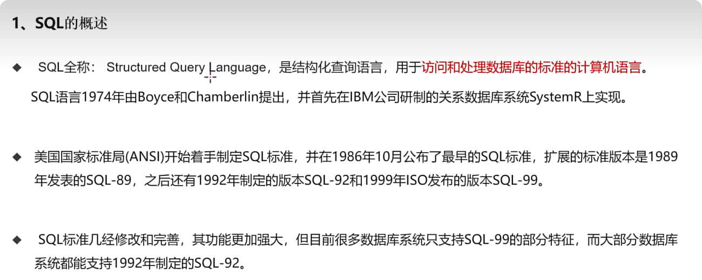
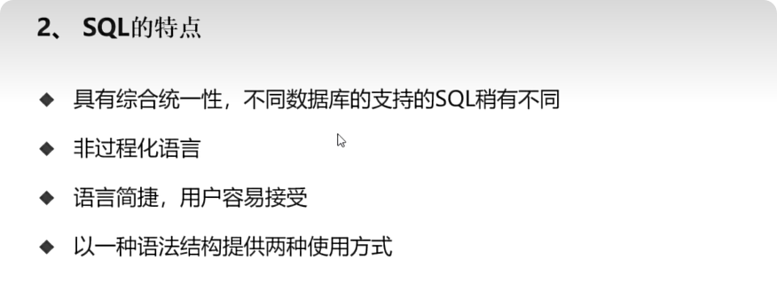
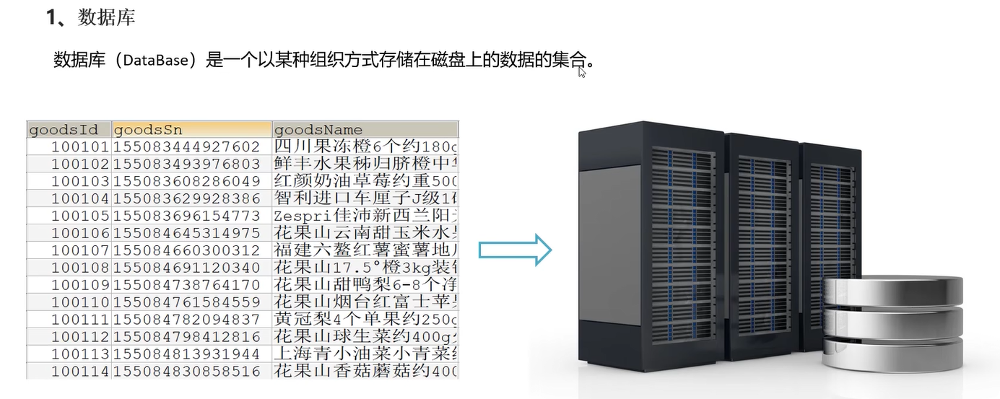
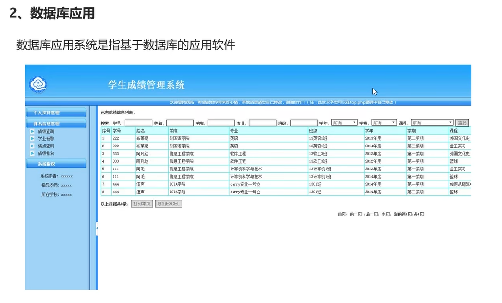
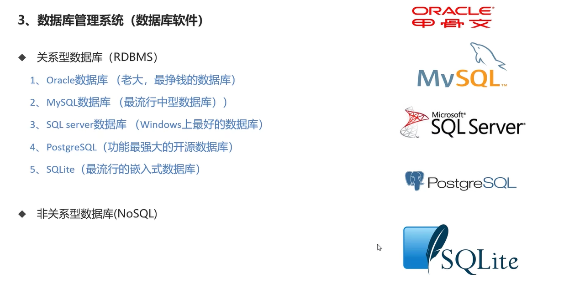
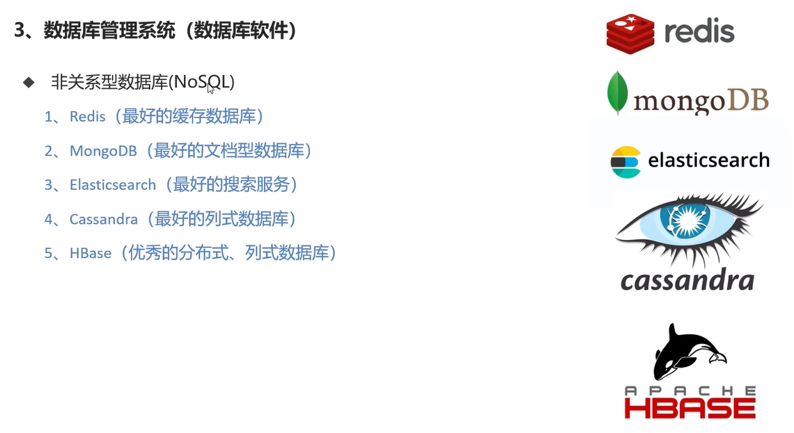
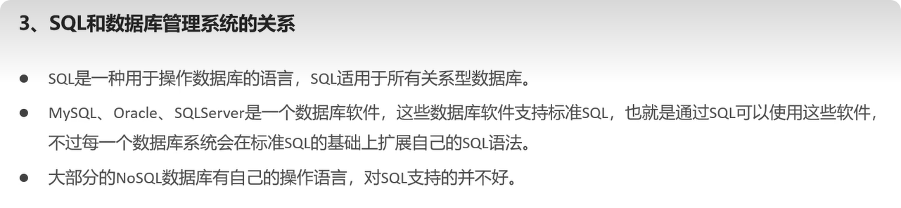
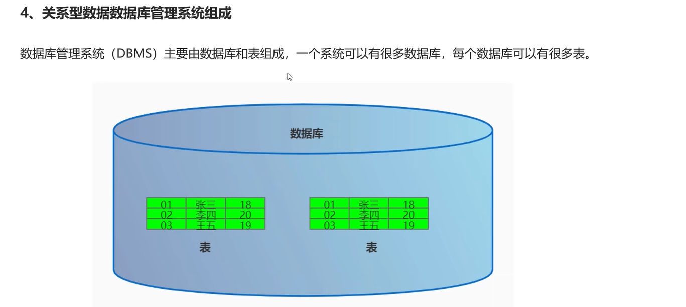

[TOC]

# 1 课程介绍

学`MySQL`

# 2 计算机语言介绍

- 机器语言
- 汇编语言
- 高级语言

# 3 `SQL`语言基础






语法特点:

- 对关键字大小写不敏感

- 可以单行或者多行书写,以分号结束

- `SQL`的注释:

  ```sql
  -- 单行注释,注意这个--后面必须要加一个空格
  
  # 单行注释 #后面可以不加空格
  
  /*
  多行注释
  多行注释
  */
  ```

# 4 数据库系统简介















