<h1 style="text-align: center;font-size: 40px; font-family: '楷体';">MySQL</h1>

[TOC]

# 1 MySQL简介

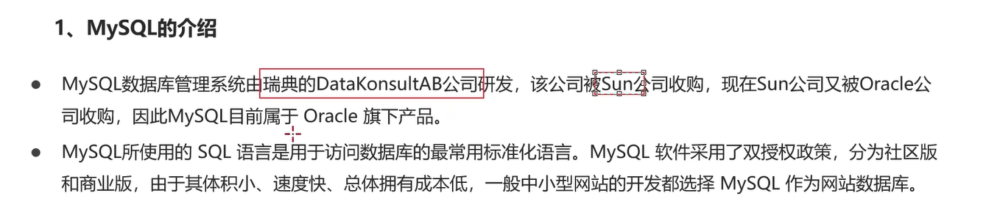

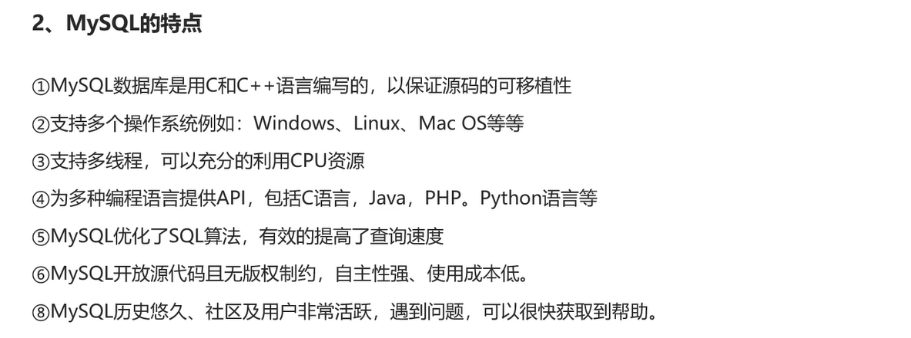

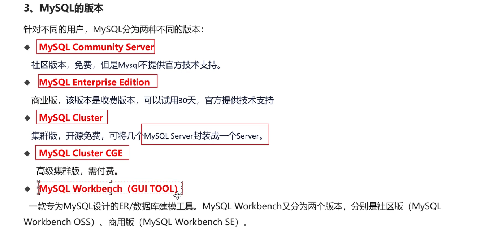

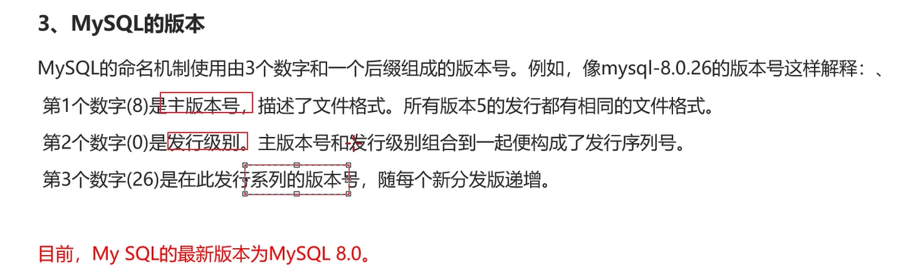

# 2 `MySQL`安装和使用

这个步骤可以去查看网络上的一些帖子.

# 3 `MySQL`的卸载


# 4 图形化管理工具

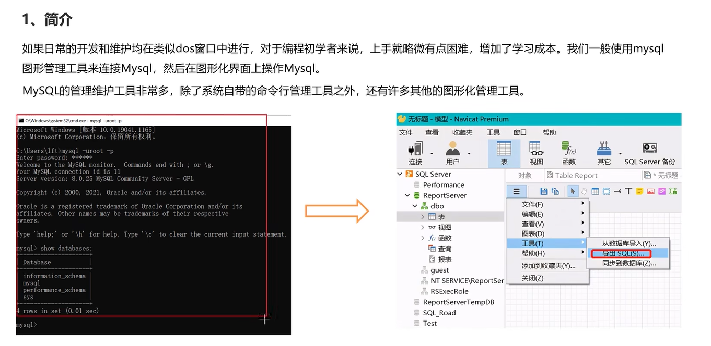


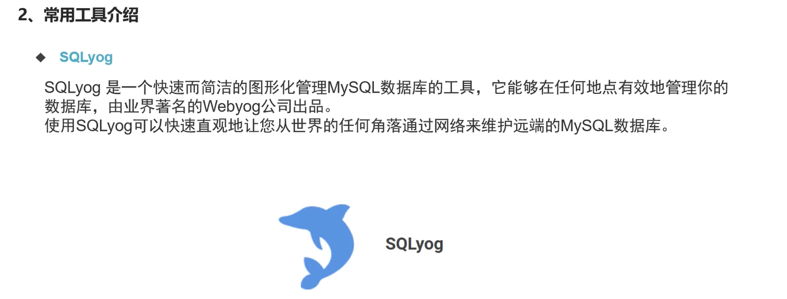

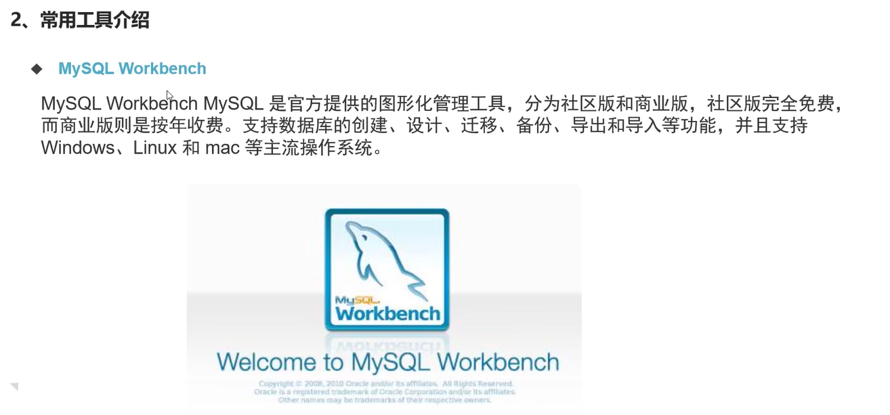


## 4.1 `Navicat`安装和使用

可以去网络山找下载安装及破解教程,这里不再赘述.

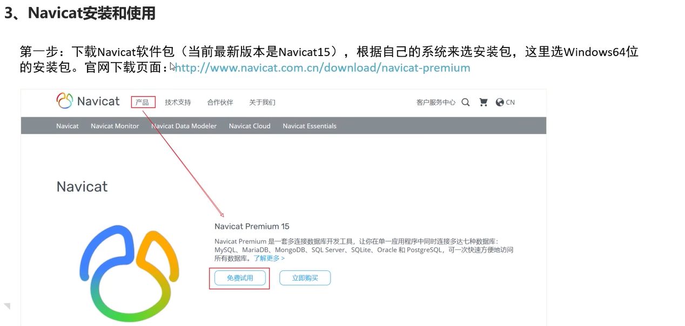

## 4.2 `SQLYog`安装和使用

官网地址: `https://sqlyog.en.softonic.com/`

下载安装步骤可以参考:`https://blog.csdn.net/weixin_43364551/article/details/116754626`

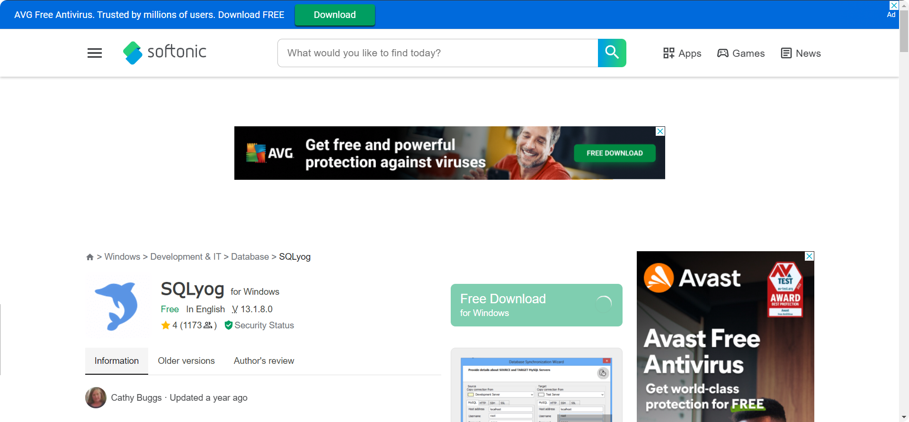

点击`free download for windows`

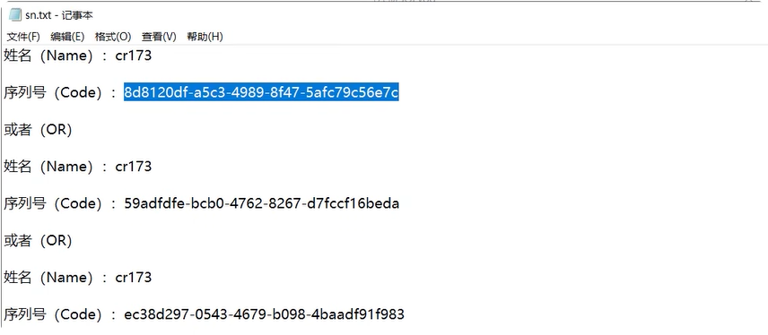

## 4.3 图形化界面连接数据库

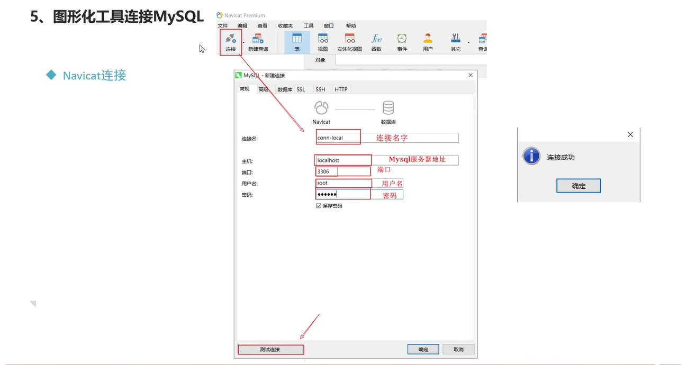

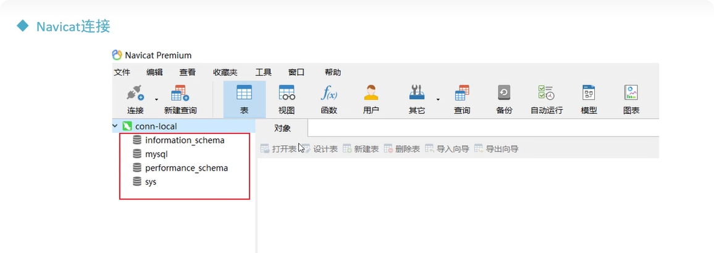

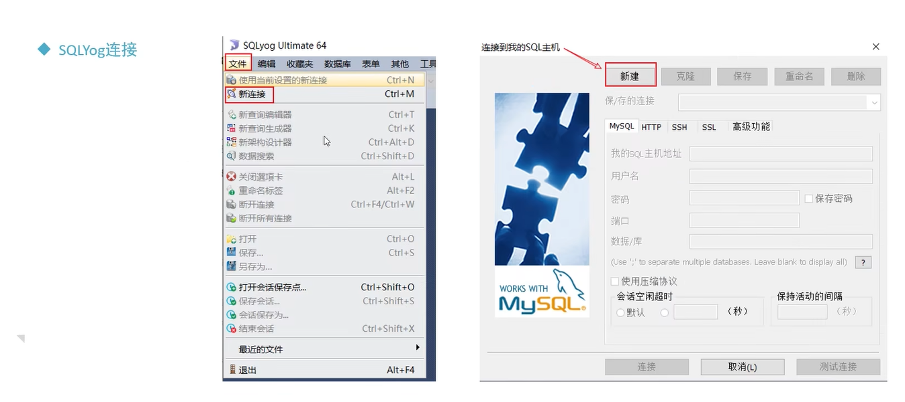

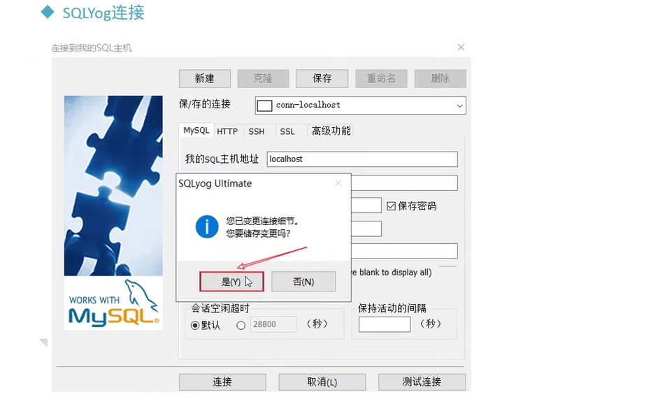

# 5 MySQL数据库基本操作 -- `DDL`

## 5.1 `DDL` -- 不涉及到数据

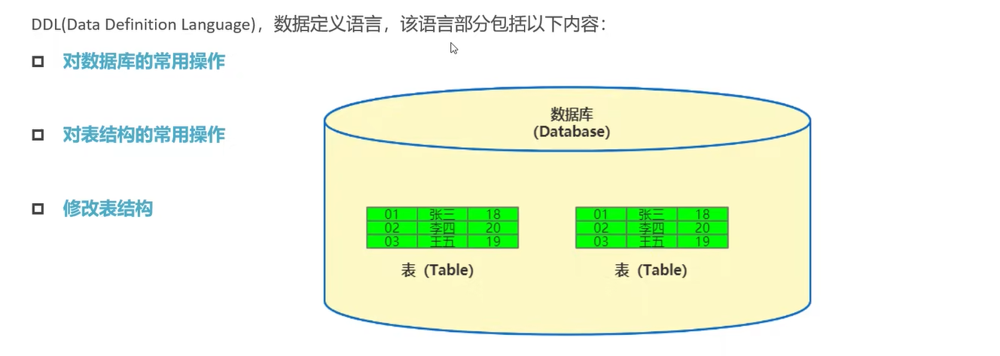

## 5.2 对数据库的常用操作

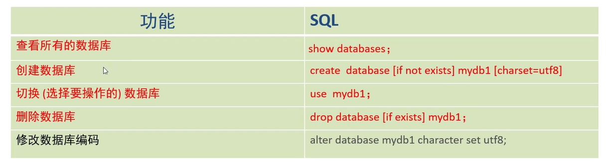

### 5.2.1 数据库操作

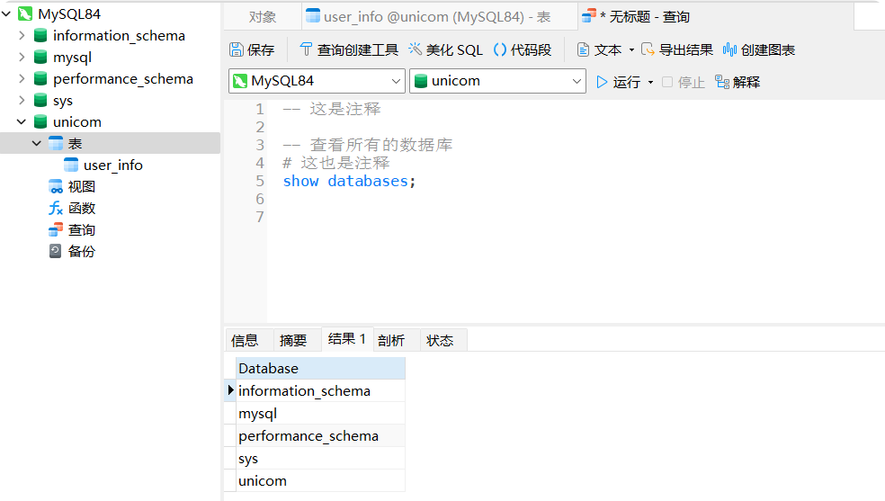

```sql
-- 这是注释
# 这也是注释

-- 查看所有的数据库
show databases;

# 创建数据库
create database test_db;
create database if not exists test_db;

# 选择使用哪一个数据库
use test_db;

# 删除数据库
drop database test_db;
drop database if exists test_db;

# 修改数据库编码
alter database mydb_1 charset set utf8;
```

### 5.2.2 创建表

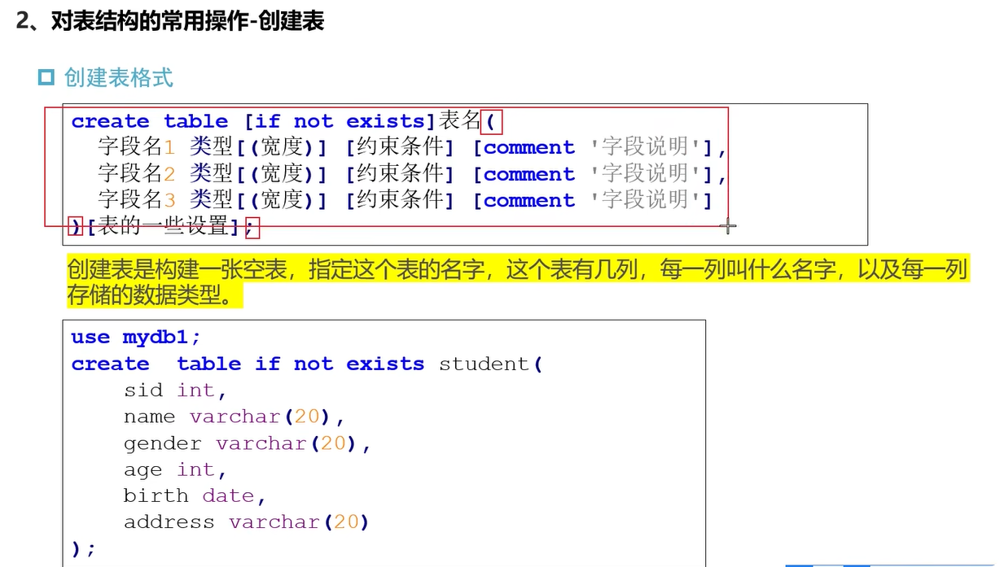

### 5.2.3 数据类型

- 数值类型

  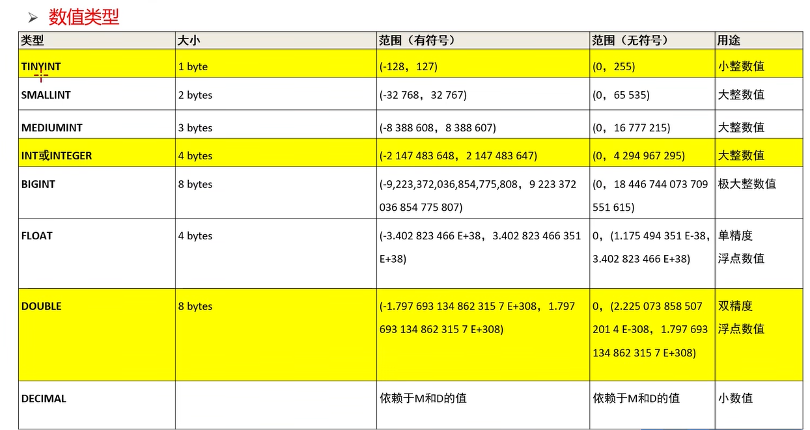

- 日期和时间类型

  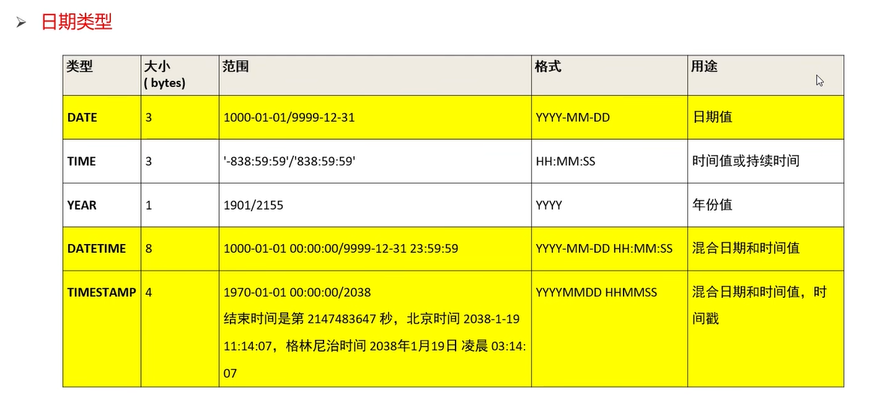

- 字符串类型 -- 一般用单引号括起来

  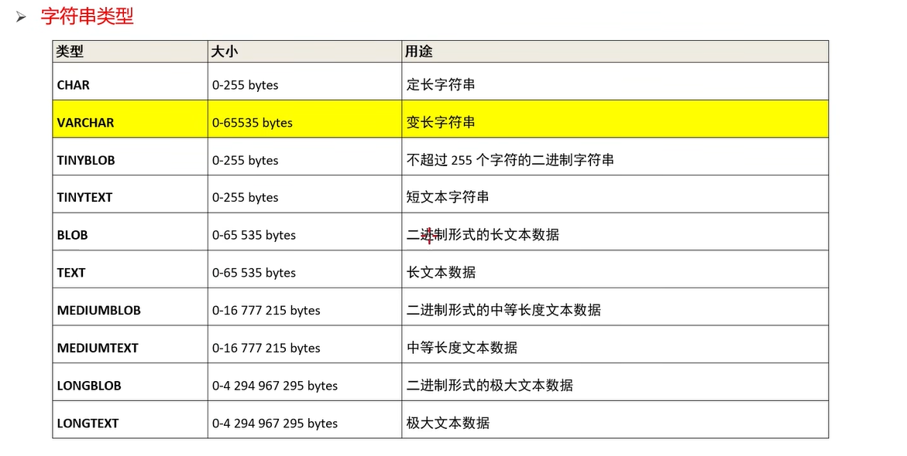

### 5.2.4 其他操作


```sql
# 查看当前数据库所有表
show tables;

# 查看指定表的创建语句
SHOW create table student;
# 所得的输出：
# CREATE TABLE `student` (
#  `sid` int DEFAULT NULL,
#  `name` varchar(20) DEFAULT NULL,
#  `gender` char(4) DEFAULT NULL,
#  `age` int DEFAULT NULL,
#  `birth` date DEFAULT NULL,
#  `address` varchar(64) DEFAULT NULL
#) ENGINE=InnoDB DEFAULT CHARSET=utf8mb4 COLLATE=utf8mb4_0900_ai_ci

# 查看表结构
desc student;

# 删除表
drop table student;
```

### 5.2.5 对表结构的常用操作--修改表结构格式

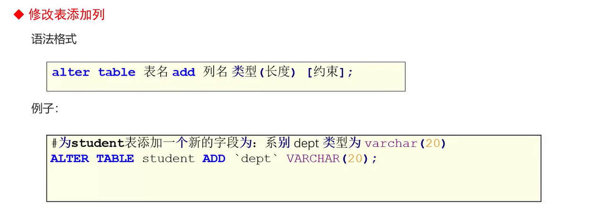

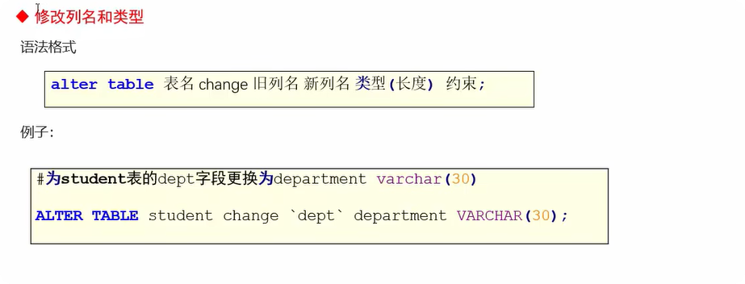


```sql
-- 修改表结构

-- -- 添加列
-- alter table student add dept varchar(20);

-- -- 修改列名和类型
-- alter table student change dept department varchar(30);

-- -- 删除列
-- alter table student drop department;


-- 修改表名
rename table student to stu;
```

# 6 `MySQL`数据库基本操作 - `DML`

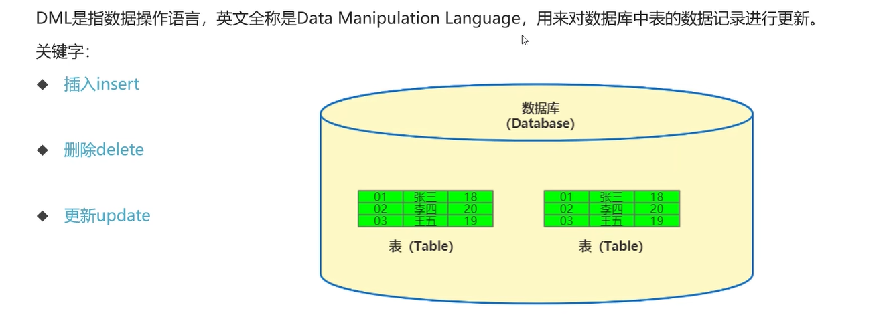

## 6.1 数据插入

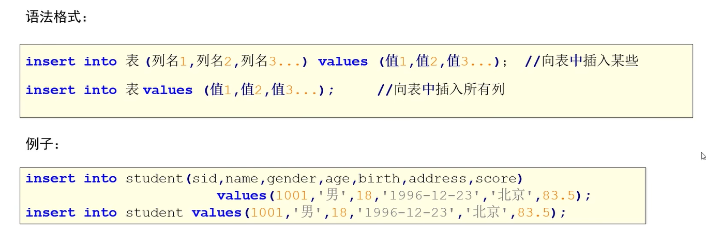

```sql
insert into 
```


