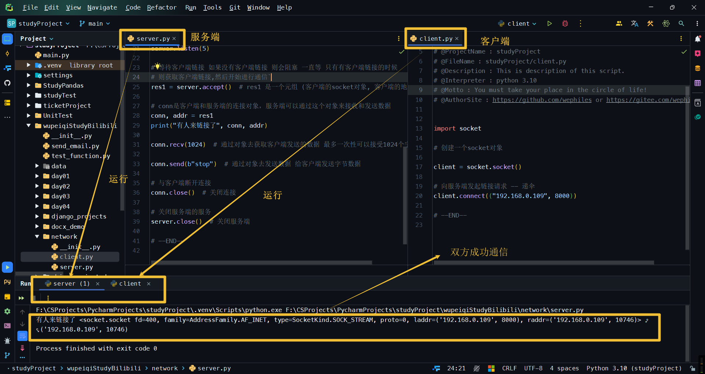
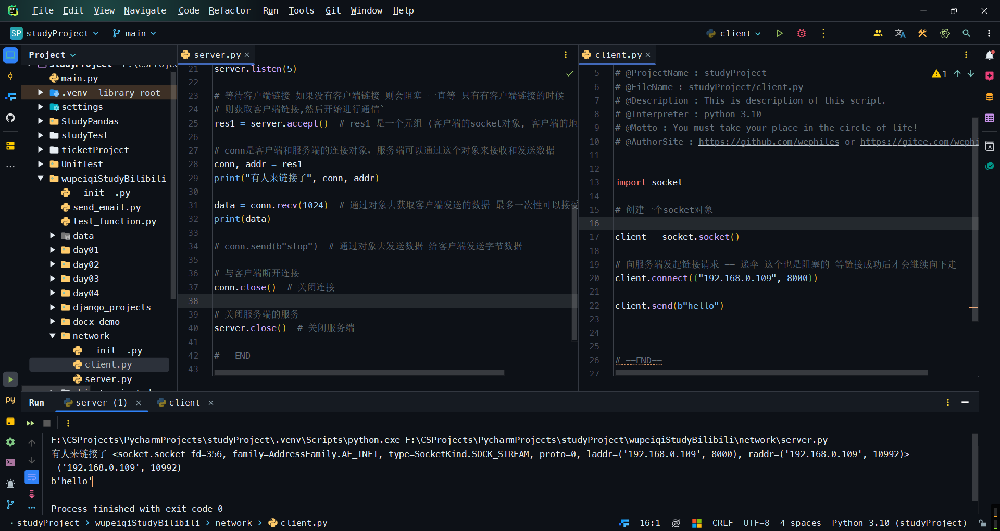
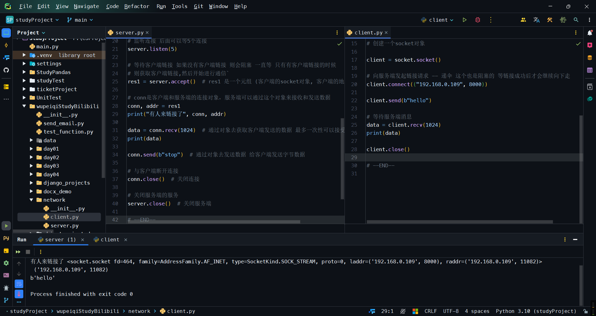
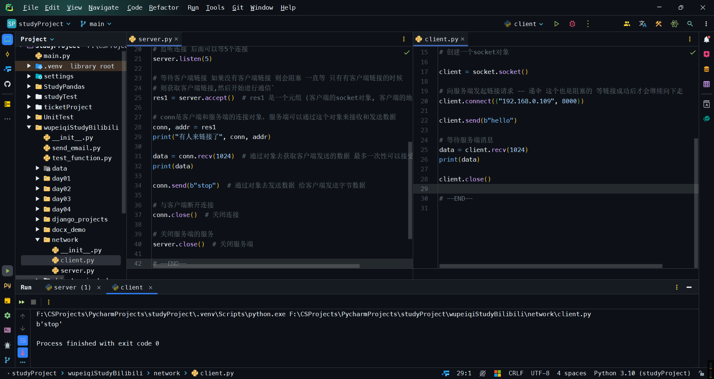

<h1 style="text-align: center;font-size: 40px; font-family: '楷体';">网络编程-day10-1</h1>

[TOC]

一些网络概念：

- 软件
    - 客户端 `CS`架构 `client-server` 有的有`server`,有的没有`server`
    - 浏览器 `BS`架构 `browser-server`
- 如何实现相互通信
    写俩软件,软件之间相互通信 -- 用**文件**进行通信
    通过介质比如 交换机 / 网线 / 路由器 / `IP`地址等
    物理地址(`MAC`地址)
    局域网:广播
    公网`IP`(是要掏钱的) / 私网
    看内网`IP`: `cmd`里面使用`ipconfig`命令

- 总结:
    - 相互通信本质上是发送 `01010101010101`
    - 交换机的作用：组成一个局域网 交换信息的方式是广播
    - 路由器
    - 通过`ipconfig`查看自己的内网`IP`
    - 公网`IP`,需要掏钱

# 一 网络编程示例

```python
# server.py
import socket

# 创建一个socket对象
server = socket.socket()

# 绑定IP和端口
server.bind(("192.168.0.109", 8000))

# 监听连接 后面可以等5个连接
server.listen(5)

# 等待客户端链接 如果没有客户端链接 则会阻塞 一直等 只有有客户端链接的时候
# 则获取客户端链接,然后开始进行通信`
res1 = server.accept()  # res1 是一个元组 (客户端的socket对象, 客户端的地址)

# conn是客户端和服务端的连接对象，服务端可以通过这个对象来接收和发送数据
conn, addr = res1
print("有人来链接了", conn, addr)

conn.recv(1024)  # 通过对象去获取客户端发送的数据 最多一次性可以接受1024个字节

conn.send(b"stop")  # 通过对象去发送数据 给客户端发送字节数据

# 与客户端断开连接
conn.close()  # 关闭连接

# 关闭服务端的服务
server.close()  # 关闭服务端
```

```python
# client.py

import socket

# 创建一个socket对象

client = socket.socket()

# 向服务端发起链接请求 -- 递伞
client.connect(("192.168.0.109", 8000))
```



```python
# server.py

import socket

# 创建一个socket对象
server = socket.socket()

# 绑定IP和端口
server.bind(("192.168.0.109", 8000))

# 监听连接 后面可以等5个连接
server.listen(5)

# 等待客户端链接 如果没有客户端链接 则会阻塞 一直等 只有有客户端链接的时候
# 则获取客户端链接,然后开始进行通信`
res1 = server.accept()  # res1 是一个元组 (客户端的socket对象, 客户端的地址)

# conn是客户端和服务端的连接对象，服务端可以通过这个对象来接收和发送数据
conn, addr = res1
print("有人来链接了", conn, addr)

data = conn.recv(1024)  # 通过对象去获取客户端发送的数据 最多一次性可以接受1024个字节
print(data)

# conn.send(b"stop")  # 通过对象去发送数据 给客户端发送字节数据

# 与客户端断开连接
conn.close()  # 关闭连接

# 关闭服务端的服务
server.close()  # 关闭服务端
```

```python
# client.py

import socket

# 创建一个socket对象

client = socket.socket()

# 向服务端发起链接请求 -- 递伞 这个也是阻塞的 等链接成功后才会继续向下走
client.connect(("192.168.0.109", 8000))

client.send(b"hello")
```



```python
# client.py
import socket

# 创建一个socket对象

client = socket.socket()

# 向服务端发起链接请求 -- 递伞 这个也是阻塞的 等链接成功后才会继续向下走
client.connect(("192.168.0.109", 8000))

client.send(b"hello")

# 等待服务端消息
data = client.recv(1024)
print(data)

client.close()
```

```python
# server.py

import socket

# 创建一个socket对象
server = socket.socket()

# 绑定IP和端口
server.bind(("192.168.0.109", 8000))

# 监听连接 后面可以等5个连接
server.listen(5)

# 等待客户端链接 如果没有客户端链接 则会阻塞 一直等 只有有客户端链接的时候
# 则获取客户端链接,然后开始进行通信`
res1 = server.accept()  # res1 是一个元组 (客户端的socket对象, 客户端的地址)

# conn是客户端和服务端的连接对象，服务端可以通过这个对象来接收和发送数据
conn, addr = res1
print("有人来链接了", conn, addr)

data = conn.recv(1024)  # 通过对象去获取客户端发送的数据 最多一次性可以接受1024个字节
print(data)

conn.send(b"stop")  # 通过对象去发送数据 给客户端发送字节数据

# 与客户端断开连接
conn.close()  # 关闭连接

# 关闭服务端的服务
server.close()  # 关闭服务端
```





# 二 自动回复示例

在`Python3`中，`send/recv`都是字节

在`Python2`中，`send/recv`都是字符串


`Python3`中，字符串是`unicode`存储的。

`Python2`中，字符串是直接使用`utf-8`存储的

服务端：

```python
import socket

server = socket.socket()

server.bind(("192.168.0.101", 8002))

server.listen(5)

while True:
    conn, addr = server.accept()
    while True:
        # data是字节类型
        data = conn.recv(1024)
        if data == 'exit':
            print("关闭")
            break
        response = data + b' SB'
        conn.send(response)
    conn.close()
```

客户端

```python
import socket

client = socket.socket()

client.connect(("192.168.0.101", 8002))

while True:
    name = input("请输入姓名>>> ")
    if name == 'exit':
        break
    # 转换成字节发过去
    client.send(name.encode("utf-8"))
    response = client.recv(1024)
    print(response.decode("utf-8"))
client.close()
```


