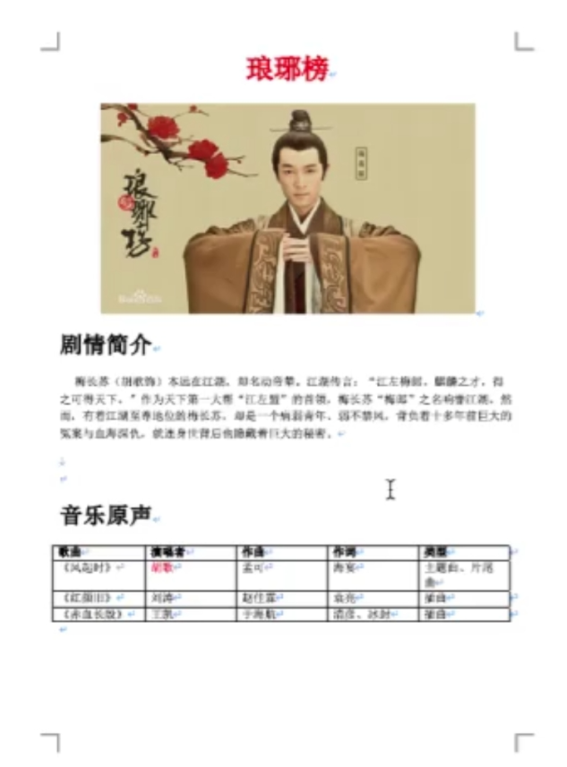
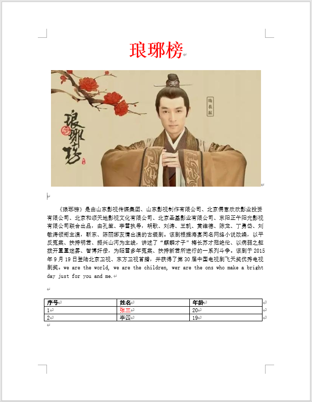
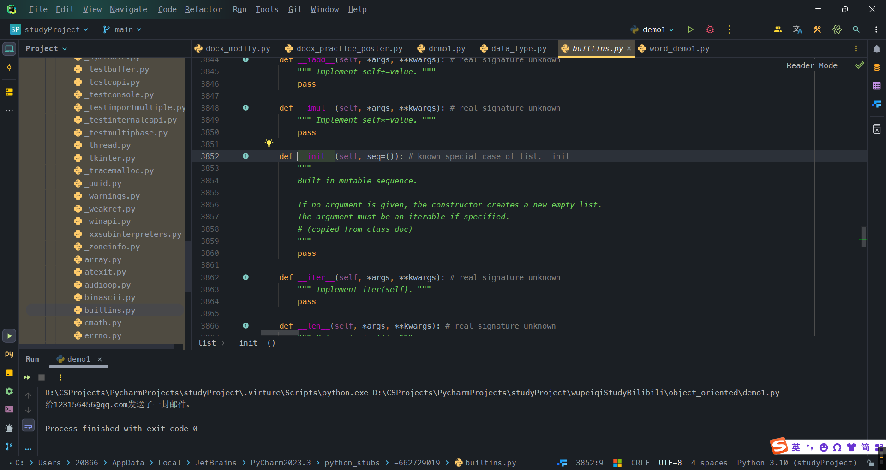

<h1 style="text-align: center;font-size: 40px; font-family: '楷体';">模块和面向对象-day10</h1>

今日概要：

- 第三方模块 -- `word`
- 面向对象

# 1 `Word`格式-第三方模块

- 自定义模块
- 内置模块
- 第三方模块
    - `requests`
    - `bs4`
    - `openpyxl`
    - `python-docx`

## 1.1 快速上手

```python
pip install python-docx
```

- `docx`文件，本质上是压缩包

- `docx`文件本质上是由标签将数据包裹起来的(`XML`格式文档)

    ```xml
    <h>asdfghjkl</h>
    <p>
    	<xxx>qwertyuiop</xxx>
    </p>
    ```

`docx`中的两个概念

- `paragraph`段落
    - `run`小段
- `table`表格

问题

- 从上到下解析`word`文件，遇到表格、图片时无法解析出内容。

## 1.2 读取

### 1.2.1 文本

```python
import docx

doc_obj = docx.Document("./docx_files/demo.docx")

# 获取所有段落
paragraphs = doc_obj.paragraphs

for p in paragraphs:
    print(p.text, "\t", p.style.name)
```

### 1.2.2 图片

```python
import docx

doc_obj = docx.Document("./docx_files/demo.docx")

# 读取文本和图片
paragraphs = doc_obj.paragraphs
# 获取所有段落 p_obj对象 (读取xml文档并将文档格式处理)

for p_obj in paragraphs:
    # print(p.text, "\t", p.style.name)
    # 看看原始内容是什么
    print(p_obj._p.xml)
    break
```


而如果标题下面是图片:稍微改一下word,让标题下面是图片.


获取图片`ID `-- 通过正则表达式拿出来. 

```python
import docx
import re

doc_obj = docx.Document("./docx_files/demo.docx")

# # 获取所有段落
# # paragraphs = doc_obj.paragraphs
#
# # for p in paragraphs:
# #     print(p.text, "\t", p.style.name)
#
# for data in doc_obj.tables:
#     print(data)

# 读取文本和图片
paragraphs = doc_obj.paragraphs
# 获取所有段落 p_obj对象 (读取xml文档并将文档格式处理)
i = 0
for p_obj in paragraphs:
    # print(p.text, "\t", p.style.name)

    # 看看原始内容是什么
    # print(p_obj._p.xml)

    if "Graphic" in p_obj._p.xml:  # 代表这里面有图片
        # 是图片 获取图片id
        img_id = re.findall(r'<a:blip r:embed="(\w+)">', p_obj._p.xml)[0]

        # 引用 -- 会存在一个地方
        ...
    else:
        print(p_obj.text)
```

获取所有图片`id` 和 图片路径的对应关系：

```python
import docx
from docx.parts.image import ImagePart

# {rId5: "", rId6: "", ...}
doc_obj = docx.Document(r".\docx_files\demo.docx")

img_rel_dict = {}

# 别问为什么 问就是看的老师写的 老师是看源码的 所以我也不知道为什么要这么写
for item in doc_obj.part.rels.values():
    # print(item)  # <docx.opc.rel._Relationship object at 0x000001A129101F90> --这样式的对象

    # print(item.target_part)  # 下面两行是这行打印语句的输出(截取了一部分)
    # # <docx.parts.image.ImagePart object at 0x000001CD50CB1FF0>
    # # <docx.parts.settings.SettingsPart object at 0x000001CD50CB2050>

    if type(item.target_part) == ImagePart:
        print(item, item.rId, item.target_part.partname)
        img_rel_dict[item.rId] = item.target_part.partname

print(img_rel_dict)
```


遍历word中的每一个段落，并获取所有的文字和图片地址。

```python
import re
import docx
from docx.parts.image import ImagePart

# {rId5: "", rId6: "", ...}
doc_obj = docx.Document(r".\docx_files\demo.docx")

img_rel_dict = {}

# #################### 1. 获取ID和图片路径的对应关系 ####################

# 别问为什么 问就是看的老师写的 老师是看源码的 所以我也不知道为什么要这么写
for item in doc_obj.part.rels.values():
    # print(item)  # <docx.opc.rel._Relationship object at 0x000001A129101F90> --这样式的对象

    # print(item.target_part)  # 下面两行是这行打印语句的输出(截取了一部分)
    # # <docx.parts.image.ImagePart object at 0x000001CD50CB1FF0>
    # # <docx.parts.settings.SettingsPart object at 0x000001CD50CB2050>

    if type(item.target_part) == ImagePart:
        # print(item, item.rId, item.target_part.partname)
        img_rel_dict[item.rId] = item.target_part.partname

# #################### 2. 读取word文件 ####################
paragraphs = doc_obj.paragraphs
# 获取所有段落 p_obj对象 (读取xml文档并将文档格式处理)
for p_obj in paragraphs:
    # print(p.text, "\t", p.style.name)

    # 看看原始内容是什么
    # print(p_obj._p.xml)

    if "Graphic" in p_obj._p.xml:  # 代表这里面有图片
        # 是图片 获取图片id
        img_id = re.findall(r'<a:blip r:embed="(\w+)">', p_obj._p.xml)[0]

        # 找到图片的路径
        img_path = img_rel_dict[img_id]
        print(img_path)
    else:
        print(p_obj.text)
```

对`word`文件处理和解压

```python
# 1. 重命名
import shutil

# rename

file_path = r".\docx_files\demo.docx"
zip_file_path = r".\docx_files\demo.zip"

shutil.copy(file_path, zip_file_path)

# 2. 解压
import shutil

# rename

file_path = r".\docx_files\demo.docx"
zip_file_path = r".\docx_files\demo.zip"

# # 拷贝并压缩
# shutil.copy(file_path, zip_file_path)

# 解压
shutil.unpack_archive(filename=zip_file_path, extract_dir=r".\target_folder", format="zip")
```

文本和表格

- 基于底层来进行处理
- 段落和表格 -- 内部已解析，只不过把他们独立地存放了。 注意，这个`CT_P`和`CT_Tbl`是中间类型的数据

```python
import docx

doc_obj = docx.Document("./docx_files/demo.docx")

for p in doc_obj.paragraphs:
    print(p.text)

for t in doc_obj.tables:
    print(t)
```

```xml
<h>asdfghjkl</h>            -> CT_P(段落)     -> paragraph 对象
<p 假设这是个表格标签.>         -> CT_Tbl(表格)   -> table 对象
	<xxx>qwertyuiop</xxx>
</p>
```

```python
import docx

doc_obj = docx.Document("./docx_files/demo.docx")

# 循环中间类型格式的数据

body = doc_obj.element.body

for child in body.iterchildren():
    print(type(child), child)
```


逐行获取表格或者段落(在一起，按照顺序找出来)

```python
import docx
from docx.oxml.table import CT_Tbl
from docx.oxml.text.paragraph import CT_P
from docx.table import Table
from docx.text.paragraph import Paragraph

doc_obj = docx.Document("./docx_files/demo.docx")

# 循环中间类型格式的数据

body = doc_obj.element.body

for child in body.iterchildren():
    # print(type(child), child)
    if type(child) == CT_Tbl:  # 表格类型
        table_obj = Table(child, body)  # 表格对象
        print(table_obj)
    elif type(child) == CT_P:  # 段落类型
        paragraph_obj = Paragraph(child, body)  # 段落对象
        print(paragraph_obj.text)
```


根据兑现获取文本：

```python
# paragraph对象： paragraph_obj.text
# table对象：
import docx

doc_obj = docx.Document("./docx_files/demo.docx")
table_obj = doc_obj.tables[0]


def get_table_list(table_obj):
    """
    获取表格数据
    Args:
        table_obj ():

    Returns:

    """
    table_list = []
    # 表格对象
    for row_obj in table_obj.rows:
        row_list = []
        for cell_obj in row_obj.cells:
            row_list.append(cell_obj.text)
        table_list.append(row_list)
    return table_list
print(get_table_list(table_obj))
# [['序号', '姓名', '年龄'], ['1', '张三', '20'], ['2', '李四', '19']]
```

结合文本和表格：

```python
import docx
from pprint import pprint
from docx.oxml.table import CT_Tbl
from docx.oxml.text.paragraph import CT_P
from docx.table import Table
from docx.text.paragraph import Paragraph

doc_obj = docx.Document("./docx_files/demo.docx")


def get_table_list(table_obj):
    """
    获取表格数据
    Args:
        table_obj ():

    Returns:

    """
    table_list = []
    # 表格对象
    for row_obj in table_obj.rows:
        row_list = []
        for cell_obj in row_obj.cells:
            row_list.append(cell_obj.text)
        table_list.append(row_list)
    return table_list


# 循环中间类型格式的数据

body = doc_obj.element.body

for child in body.iterchildren():
    # print(type(child), child)
    if type(child) == CT_Tbl:  # 表格类型
        table_obj = Table(child, body)  # 表格对象
        data = get_table_list(table_obj)
        pprint(data)
    elif type(child) == CT_P:  # 段落类型
        paragraph_obj = Paragraph(child, body)  # 段落对象
        print(paragraph_obj.text)
```


## 1.3 写入

### 1.3.1 段落

```python
import docx

doc_obj = docx.Document()  # 创建新文档

doc_obj.add_paragraph(text='Hello, world!')
doc_obj.add_paragraph(text='你好，世界！')
doc_obj.add_paragraph(text='去死吧，小日本鬼子！')

doc_obj.save('./docx_files/write_demo.docx')
```

### 1.3.2 段落和小段(`run`)

```python
import docx

doc_obj = docx.Document()  # 创建新文档

# 返回的对象 代指文档的段落
p1 = doc_obj.add_paragraph(text='Hello, world!')
p1.add_run(text="I love you!")

p2 = doc_obj.add_paragraph(text='你好，世界！')
p2.add_run(text="爱你呦！")

p3 = doc_obj.add_paragraph(text='去死吧，小日本鬼子！')
p3.add_run(text="滚！")

doc_obj.save('./docx_files/write_demo.docx')
```

### 1.3.3 添加格式


```python
import docx

doc_obj = docx.Document()  # 创建新文档

# 返回的对象 代指文档的段落
doc_obj.add_paragraph(text='Hello, world!', style="Heading 1")
doc_obj.add_paragraph(text=' hahaha')


doc_obj.add_paragraph(text='python is my favorite language', style="Heading 2")


doc_obj.save('./docx_files/write_demo_1.docx')
```

### 1.3.4 样式

#### 1.3.4.1 字体大小

```python
import docx
from docx.shared import Pt

doc_obj = docx.Document()  # 创建新文档

# 返回的对象 代指文档的段落
p1 = doc_obj.add_paragraph(text='Hello, world!', style="Heading 1")
run_obj_1 = p1.add_run(text=" I love you!")
# 改字号
run_obj_1.font.size = Pt(24)
p1.add_run(text=" I love you!")

doc_obj.save('./docx_files/write_demo_2.docx')
```

#### 1.3.4.2 颜色

```python
import docx
from docx.shared import Pt, RGBColor

doc_obj = docx.Document()  # 创建新文档

# 返回的对象 代指文档的段落
p1 = doc_obj.add_paragraph(text='Hello, world!', style="Heading 1")
run_obj_1 = p1.add_run(text=" I love you!")
# 改字号
run_obj_1.font.size = Pt(24)

# 改颜色
run_obj_1.font.color.rgb = RGBColor(100, 149, 237)
p1.add_run(text=" I love you!").bold = True

doc_obj.save('./docx_files/write_demo_2.docx')
```

#### 1.3.4.3 加粗

```python
import docx
from docx.shared import Pt, RGBColor

doc_obj = docx.Document()  # 创建新文档

# 返回的对象 代指文档的段落
p1 = doc_obj.add_paragraph(text='Hello, world!', style="Heading 1")
run_obj_1 = p1.add_run(text=" I love you!")
# 改字号
run_obj_1.font.size = Pt(24)

# 改颜色
run_obj_1.font.color.rgb = RGBColor(100, 149, 237)

# 加粗
run_obj_1.font.bold = True

p1.add_run(text=" I love you!")

doc_obj.save('./docx_files/write_demo_2.docx')
```

#### 1.3.4.4 斜体

```python
import docx
from docx.shared import Pt, RGBColor

doc_obj = docx.Document()  # 创建新文档

# 返回的对象 代指文档的段落
p1 = doc_obj.add_paragraph(text='Hello, world!', style="Heading 1")
run_obj_1 = p1.add_run(text=" I love you!")
# 改字号
run_obj_1.font.size = Pt(24)

# 改颜色
run_obj_1.font.color.rgb = RGBColor(100, 149, 237)

# 加粗
run_obj_1.font.bold = True

# 斜体
run_obj_1.font.italic = True

p1.add_run(text=" I love you!")

doc_obj.save('./docx_files/write_demo_2.docx')
```

#### 1.3.4.5 怎么找这些样式

```python
# 先找到font类型的名字：
print(run_obj_1.font)  # <docx.text.font.Font object at 0x0000029972EB3520>
```

```python
# 然后根据这些类型得到名字将这个类导入
from docx.text.font import Font
```

```python
# 然后可以进入这个类，查看相关的类型
```

#### 1.3.4.6 对齐方式

```python
import docx
from docx.enum.text import WD_ALIGN_PARAGRAPH

doc_obj = docx.Document()  # 创建新文档

# 返回的对象 代指文档的段落
p1 = doc_obj.add_paragraph(text='Hello, world!', style="Heading 1")
p1.paragraph_format.alignment = WD_ALIGN_PARAGRAPH.CENTER

doc_obj.save('./docx_files/write_demo_2.docx')
```

#### 1.3.4.7 缩进

```python
import docx
from docx.shared import Pt

doc_obj = docx.Document()  # 创建新文档

# 返回的对象 代指文档的段落
p1 = doc_obj.add_paragraph(text='Hello, world!', style="Heading 1")
p2 = doc_obj.add_paragraph(text='Hello, world!', style="Heading 2")
p3 = doc_obj.add_paragraph(text='Hello, world!Hello, world!Hello, world!Hello, world!Hello, world!')
p3.paragraph_format.left_indent = Pt(20)  # 全部缩进
p3.paragraph_format.first_line_indent = Pt(20)  # 首行缩进

p4 = doc_obj.add_paragraph(text='Hello, world!', style="Heading 3")
doc_obj.save('./docx_files/write_demo_3.docx')
```

#### 1.3.4.8 行间距

```python
import docx
from docx.shared import Pt

doc_obj = docx.Document()  # 创建新文档

# 返回的对象 代指文档的段落
p1 = doc_obj.add_paragraph(text='Hello, world!', style="Heading 1")
p2 = doc_obj.add_paragraph(text='Hello, world!', style="Heading 2")
p3 = doc_obj.add_paragraph(text='Hello, world!Hello, world!Hello, world!Hello, world!Hello, world!Hello, world!Hello, '
                                'world!Hello, world!Hello, world!Hello, world!')
# p3.paragraph_format.line_spacing = Pt(50)  # 设置行间距 50磅
p3.paragraph_format.line_spacing = 1.5  # 设置行间距 1.5倍

p4 = doc_obj.add_paragraph(text='Hello, world!', style="Heading 3")
doc_obj.save('./docx_files/write_demo_4.docx')
```

#### 1.3.4.9 换行

```python
import docx
from docx.shared import Pt

doc_obj = docx.Document()  # 创建新文档

# 返回的对象 代指文档的段落
p1 = doc_obj.add_paragraph(text='Hello, world! I am balabala')
run_obj_1 = p1.add_run("hahahaha")
run_obj_1.add_break()
run_obj_1 = p1.add_run("哈哈")
p2 = doc_obj.add_paragraph(text='Hello, python!')

doc_obj.save('./docx_files/write_demo_4.docx')
```

#### 1.3.4.10 换页

```python
import docx
from docx.shared import Pt
from docx.enum.text import WD_BREAK

doc_obj = docx.Document()  # 创建新文档

# 返回的对象 代指文档的段落
p1 = doc_obj.add_paragraph(text='Hello, world! I am balabala')
run_obj_1 = p1.add_run("hahaha")
run_obj_1.add_break(break_type=WD_BREAK.PAGE)
run_obj_1 = p1.add_run("哈哈")
p2 = doc_obj.add_paragraph(text='Hello, python!')

doc_obj.save('./docx_files/write_demo_5.docx')
```

### 1.3.5 写入表格

```python
import itertools

import docx
from docx.shared import Pt, RGBColor, Cm
from docx.enum.text import WD_BREAK
from docx.table import Table

doc_obj = docx.Document()  # 创建新文档

# 返回的对象 代指文档的段落
p1 = doc_obj.add_paragraph(text='添加表格：')

old_data_list = [['序号', '姓名', '年龄'],
                 ['1', '张三', '20'],
                 ['2', '李四', '19']]
data_list = list(itertools.chain(*old_data_list))

# tb_obj = doc_obj.add_table(rows=3, cols=3, style="Table Grid")
tb_obj = doc_obj.add_table(rows=3, cols=3, style="Light List Accent 3")
tb_obj.rows[0].height = Cm(3)  # 行高
tb_obj.rows[0].cells[0].width = Cm(3)  # 列宽

index = 0
row_count = 1
for row_obj in tb_obj.rows:
    for cell_obj in row_obj.cells:
        p_obj = cell_obj.add_paragraph()
        run_obj = p_obj.add_run(text=data_list[index])
        # run_obj.font.size = Pt(12)
        # run_obj.font.name = "宋体"
        if row_count == 1:
            run_obj.bold = True
            run_obj.font.size = Pt(20)
            run_obj.font.color.rgb = RGBColor(0, 139, 139)
        index += 1
    row_count += 1

p2 = doc_obj.add_paragraph(text='完美！')

doc_obj.save('./docx_files/write_demo_6.docx')
```

##### 1.3.5.1 补充：`itertools` -- Python内置模块

```python
import itertools


v1 = [1, 2, 3, 4, 5, 6, 7, 8, 9, 10]
v2 = [11, 22, 33, 44]
v3 = [111, 222, 333, 444]

data = itertools.chain(v1, v2, v3)
# print(data, type(data))
# for item in data:
#     print(item)

data_list = list(data)
print(data_list)  # [1, 2, 3, 4, 5, 6, 7, 8, 9, 10, 11, 22, 33, 44, 111, 222, 333, 444]
```

```python
import itertools

data_list = [[1, 2, 3, 4, 5, 6, 7, 8, 9, 10],
             [11, 22, 33, 44],
             [111, 222, 333, 444]]


data = list(itertools.chain(data_list[0], data_list[1], data_list[2]))

print(data)  # [1, 2, 3, 4, 5, 6, 7, 8, 9, 10, 11, 22, 33, 44, 111, 222, 333, 444]

# 上面这个太麻烦，写成下面这样就会简单一点
import itertools

data_list = [[1, 2, 3, 4, 5, 6, 7, 8, 9, 10],
             [11, 22, 33, 44],
             [111, 222, 333, 444]]


data = list(itertools.chain(*data_list))

print(data)  # [1, 2, 3, 4, 5, 6, 7, 8, 9, 10, 11, 22, 33, 44, 111, 222, 333, 444]
```

```python
c1 = tb.cell(1, 1)
c2 = tb.cell(1, 2)
c1.merge(c2)  # 合并单元格
```

### 1.3.6 写入图片

```python
import docx
from docx.shared import Pt, RGBColor, Cm
from docx.enum.text import WD_BREAK
from docx.table import Table

doc_obj = docx.Document()  # 创建新文档

# 返回的对象 代指文档的段落
p1 = doc_obj.add_paragraph(text='添加图片')

pic_obj = doc_obj.add_picture(r".\docx_files\assets\a.jpg")

# # 图片 -- 固定宽高
# pic_obj.width = Cm(5)
# pic_obj.height = Cm(5)

# 图片 --  按照比例缩放
pic_obj.width = int(pic_obj.width * 0.2)
pic_obj.height = int(pic_obj.height * 0.2)


p2 = doc_obj.add_paragraph(text='完美！')

doc_obj.save('./docx_files/write_demo_7.docx')
```

## 1.4 修改

- 修改段落文本

```python
import docx

doc_obj = docx.Document(r".\docx_files\demo.docx")
p_1 = doc_obj.paragraphs[0]
p_1.text = "哈哈哈哈哈"

doc_obj.save(r".\docx_files\demo_modified.docx")
```

- 段前插入段落

```python
import docx

doc_obj = docx.Document(r".\docx_files\demo.docx")
p_1 = doc_obj.paragraphs[1]
data = p_1.insert_paragraph_before(text="计算机科学与技术")  # data也是Paragraph对象

doc_obj.save(r".\docx_files\demo_modified.docx")
```

- 小段(`run`)中添加内容

```python
import docx
from docx.parts.image import ImagePart

doc_obj = docx.Document(r".\docx_files\demo.docx")
p_1 = doc_obj.paragraphs[0]

run_obj_1 = p_1.runs[1]
# print(run_obj_1.text

# run_obj_1.text = "阿里嘎多美羊羊桑"
run_obj_1.add_text(text="阿里嘎多美羊羊桑")

doc_obj.save(r".\docx_files\demo_modified.docx")
```

- 小段(`run`)中添加图片

```python
import docx
from docx.parts.image import ImagePart

doc_obj = docx.Document(r".\docx_files\demo.docx")

p1 = doc_obj.paragraphs[0]
r1 = p1.add_run()
pic_obj = r1.add_picture(r".\docx_files\assets\b.jpg")

pic_obj.width = int(pic_obj.width * 0.1)
pic_obj.height = int(pic_obj.height * 0.1)

doc_obj.save(r".\docx_files\demo_modified.docx")
```

- 表格插入数据
    ```python
    import docx
    from docx.parts.image import ImagePart
    
    doc_obj = docx.Document(r".\docx_files\demo.docx")
    
    table_obj = doc_obj.tables[0]
    row_add_obj = table_obj.add_row()
    for cell in row_add_obj.cells:
        cell.add_paragraph("哈哈")
    
    doc_obj.save(r".\docx_files\demo_modified_1.docx")
    ```

## 1.5 删除

- 删除段落
    ```python
    import docx
    from docx.parts.image import ImagePart
    
    doc_obj = docx.Document(r".\docx_files\demo.docx")
    
    paragraph_obj_0 = doc_obj.paragraphs[0]
    
    # # 清空(但不是删除)
    # paragraph_obj_0.clear()
    
    # # 删除 -- 找到父级 然后再删除  父级.remove(子级)
    # doc_obj._body._body.remove(paragraph_obj_0._p)
    
    # 找到自己的父级 然后通过父级删除自己
    paragraph_obj_0._element.getparent().remove(paragraph_obj_0._p)
    
    doc_obj.save(r".\docx_files\demo_modified_4.docx")
    ```

- 删除小段(`run`) -- 通过源码找到的
    ```python
    import docx
    from docx.parts.image import ImagePart
    
    doc_obj = docx.Document(r".\docx_files\demo.docx")
    
    paragraph_obj_0 = doc_obj.paragraphs[0]
    # [<docx.text.run.Run object at 0x000001DE90731450>, <docx.text.run.Run object at 0x000001DE90731630>,
    # <docx.text.run.Run object at 0x000001DE90731690>, <docx.text.run.Run object at 0x000001DE907316F0>,
    # <docx.text.run.Run object at 0x000001DE90731750>, <docx.text.run.Run object at 0x000001DE907317B0>]
    print(paragraph_obj_0.runs)
    
    paragraph_obj_0._p.remove(paragraph_obj_0._p.r_lst[1])
    
    doc_obj.save(r".\docx_files\demo_modified_5.docx")
    ```

- 删除整个表格
    ```python
    import docx
    from docx.parts.image import ImagePart
    
    doc_obj = docx.Document(r".\docx_files\demo.docx")
    tb_obj = doc_obj.tables[0]
    tb_obj._element.getparent().remove(tb_obj._tbl)
    
    doc_obj.save(r".\docx_files\demo_modified_5.docx")
    ```

- 删除表格某一行
    ```python
    import docx
    from docx.parts.image import ImagePart
    
    doc_obj = docx.Document(r".\docx_files\demo.docx")
    tb_obj = doc_obj.tables[0]
    row_obj = tb_obj.rows[2]
    
    row_obj._element.getparent().remove(row_obj._element)
    
    doc_obj.save(r".\docx_files\demo_modified_6.docx")
    ```

- 删除表格多个单元格
    ```python
    import docx
    from docx.parts.image import ImagePart
    
    doc_obj = docx.Document(r".\docx_files\demo.docx")
    tb_obj = doc_obj.tables[0]
    
    col_obj = tb_obj.columns[1]
    for cell in col_obj.cells:
        cell._element.getparent().remove(cell._element)
    
    doc_obj.save(r".\docx_files\demo_modified_7.docx")
    ```

## 1.6 案例

做下面这个东西：



> [!Caution]
>
> 注意，下面的这些代码做出来的效果和上面案例要求的稍微有些出入，因为设置**剧情简介**和**音乐原声**两个为标题或者加粗、加大字体的方式和设置标题 **琅琊榜** 的方式一样，这里就不写了。


```python
import docx
import itertools
from docx.shared import Pt, RGBColor
from docx.enum.text import WD_ALIGN_PARAGRAPH
from docx.oxml.ns import qn

doc_obj = docx.Document()  # 创建一个空白的文档

# 设置全局字体
doc_obj.styles["Normal"].font.name = "宋体"
doc_obj.styles["Normal"]._element.rPr.rFonts.set(qn("w:eastAsia"), "宋体")

# 写标题
p_title_obj = doc_obj.add_paragraph()
p_title_obj.paragraph_format.alignment = WD_ALIGN_PARAGRAPH.CENTER

run_obj = p_title_obj.add_run(text="琅琊榜")
run_obj.font.bold = True
run_obj.font.size = Pt(36)
run_obj.font.color.rgb = RGBColor(255, 0, 0)

p_img_obj = doc_obj.add_picture("./琅琊榜.jpg")
# p_img_obj.paragraph_format.alignment = WD_ALIGN_PARAGRAPH.CENTER

p_img_obj.width = int(p_img_obj.width * 0.75)
p_img_obj.height = int(p_img_obj.height * 0.75)

doc_obj.add_paragraph("\n")

# 读取文件内容
text = ""
with open("琅琊榜.txt", "r", encoding="utf-8") as fp:
    for line in fp:
        line = line.strip()
        if not line:
            continue
        text += line

p_text_obj = doc_obj.add_paragraph()
# p_text_obj.paragraph_format.left_indent = Pt(20)
run_text_obj = p_text_obj.add_run(text=text)

data_list = [['序号', '姓名', '年龄'],
             ['1', '张三', '20'],
             ['2', '李四', '19']]
tb_list = list(itertools.chain(*data_list))

tb_obj = doc_obj.add_table(rows=3, cols=3, style="Table Grid")

index = 0
row_count = 1
for row_obj in tb_obj.rows:
    for cell_obj in row_obj.cells:
        p_obj = cell_obj.add_paragraph()
        run_obj = p_obj.add_run(text=tb_list[index])
        if row_count == 1:
            # 表头
            run_obj.font.bold = True
        index += 1
    row_count += 1

doc_obj.save(r"./poster_template.docx")  # 保存文档
```

效果如下图：


在上面这个的基础上加上：首行缩进,并且在上面所作的案例的表格多了一个换行，去掉它！

```python
import docx
import itertools
from docx.shared import Pt, RGBColor
from docx.enum.text import WD_ALIGN_PARAGRAPH
from docx.oxml.ns import qn

doc_obj = docx.Document()  # 创建一个空白的文档

# 设置全局字体
doc_obj.styles["Normal"].font.name = "宋体"
doc_obj.styles["Normal"]._element.rPr.rFonts.set(qn("w:eastAsia"), "宋体")

# 写标题
p_title_obj = doc_obj.add_paragraph()
p_title_obj.paragraph_format.alignment = WD_ALIGN_PARAGRAPH.CENTER

run_obj = p_title_obj.add_run(text="琅琊榜")
run_obj.font.bold = True
run_obj.font.size = Pt(36)
run_obj.font.color.rgb = RGBColor(255, 0, 0)

p_img_obj = doc_obj.add_picture("./琅琊榜.jpg")
# p_img_obj.paragraph_format.alignment = WD_ALIGN_PARAGRAPH.CENTER

p_img_obj.width = int(p_img_obj.width * 0.75)
p_img_obj.height = int(p_img_obj.height * 0.75)

doc_obj.add_paragraph("")

# 读取文件内容
text = ""
with open("琅琊榜.txt", "r", encoding="utf-8") as fp:
    for line in fp:
        line = line.strip()
        if not line:
            continue
        text += line

p_text_obj = doc_obj.add_paragraph()
# p_text_obj.paragraph_format.left_indent = Pt(20)
run_text_obj = p_text_obj.add_run(text=text)
p_text_obj.paragraph_format.first_line_indent = Pt(20)

doc_obj.add_paragraph()
# # 测试字体
# p_test_obj = doc_obj.add_paragraph()
# run_test_obj = p_test_obj.add_run(
#     text="We are the world, we are the children, we are the ons who make a bright day for you and me.哈哈。")
# run_test_obj.font.name = "Menlo"

data_list = [['序号', '姓名', '年龄'],
             ['1', '张三', '20'],
             ['2', '李四', '19']]
tb_list = list(itertools.chain(*data_list))

tb_obj = doc_obj.add_table(rows=3, cols=3, style="Table Grid")

index = 0
row_count = 1
for row_obj in tb_obj.rows:
    for cell_obj in row_obj.cells:
        cell_obj.text = tb_list[index]
        if row_count == 1:
            # 表头
            cell_obj.paragraphs[0].runs[0].font.bold = True
        index += 1
    row_count += 1

# 找到表中某一部分并改变颜色
# 注意这里面的表的其实索引都是从0开始的
cell_obj_add_red = tb_obj.cell(1, 1)  # 相当于第二行第二列
cell_obj_add_red.paragraphs[0].runs[0].font.color.rgb = RGBColor(255, 0, 0)

doc_obj.save(r"./poster_template.docx")  # 保存文档
```


补充：让图片居中：

```python
import docx
import itertools
from docx.shared import Pt, RGBColor
from docx.enum.text import WD_ALIGN_PARAGRAPH, WD_PARAGRAPH_ALIGNMENT
from docx.oxml.ns import qn

doc_obj = docx.Document()  # 创建一个空白的文档

# 设置全局字体
doc_obj.styles["Normal"].font.name = "宋体"
doc_obj.styles["Normal"]._element.rPr.rFonts.set(qn("w:eastAsia"), "宋体")

# 写标题
p_title_obj = doc_obj.add_paragraph()
p_title_obj.paragraph_format.alignment = WD_ALIGN_PARAGRAPH.CENTER

run_obj = p_title_obj.add_run(text="琅琊榜")
run_obj.font.bold = True
run_obj.font.size = Pt(36)
run_obj.font.color.rgb = RGBColor(255, 0, 0)

# 图片 图片居中
pic_center_add_obj = doc_obj.add_paragraph()
pic_center_add_obj.alignment = WD_PARAGRAPH_ALIGNMENT.CENTER

run_obj_center_obj = pic_center_add_obj.add_run("")

p_img_obj = run_obj_center_obj.add_picture("./琅琊榜.jpg")
# p_img_obj.paragraph_format.alignment = WD_ALIGN_PARAGRAPH.CENTER

p_img_obj.width = int(p_img_obj.width * 0.75)
p_img_obj.height = int(p_img_obj.height * 0.75)

doc_obj.add_paragraph("")

# 读取文件内容
text = ""
with open("琅琊榜.txt", "r", encoding="utf-8") as fp:
    for line in fp:
        line = line.strip()
        if not line:
            continue
        text += line

p_text_obj = doc_obj.add_paragraph()
# p_text_obj.paragraph_format.left_indent = Pt(20)
run_text_obj = p_text_obj.add_run(text=text)
p_text_obj.paragraph_format.first_line_indent = Pt(20)

doc_obj.add_paragraph()
# # 测试字体
# p_test_obj = doc_obj.add_paragraph()
# run_test_obj = p_test_obj.add_run(
#     text="We are the world, we are the children, we are the ons who make a bright day for you and me.哈哈。")
# run_test_obj.font.name = "Menlo"

data_list = [['序号', '姓名', '年龄'],
             ['1', '张三', '20'],
             ['2', '李四', '19']]
tb_list = list(itertools.chain(*data_list))

tb_obj = doc_obj.add_table(rows=3, cols=3, style="Table Grid")

index = 0
row_count = 1
for row_obj in tb_obj.rows:
    for cell_obj in row_obj.cells:
        cell_obj.text = tb_list[index]
        if row_count == 1:
            # 表头
            cell_obj.paragraphs[0].runs[0].font.bold = True
        index += 1
    row_count += 1

# 找到表中某一部分并改变颜色
# 注意这里面的表的其实索引都是从0开始的
cell_obj_add_red = tb_obj.cell(1, 1)  # 相当于第二行第二列
cell_obj_add_red.paragraphs[0].runs[0].font.color.rgb = RGBColor(255, 0, 0)

doc_obj.save(r"./poster_template.docx")  # 保存文档
```

效果：



# 2 面向对象

- `Java`语言：只支持面向对象方式
- `python`语言：
    - 面向过程【不推荐】
    - 函数式【推荐】
    - 面向对象【比较推荐】了解、能看懂、看源码

函数式编程：代码重用性、可读性较好

```python
def func(函数参数):
    ...
    
def something(函数参数):
    ...
    
def run(函数参数):
    ...
    
if __name__ == "__main__":
    run()
```

面向对象编程：

```python
class 类的名字:
	def func(self, 函数参数):
		...
	def something(self, 函数参数):
    	...
```

## 2.1 初识面向对象

```python
def send_email(to_email):
    msg = "给{}发送了一封邮件。".format(to_email)
    print(msg)
send_email("45646@qq.com")
```

如果要基于面向对象实现上述过程：

- 定义类和方法
    ```python
    # 类名：首字母大写 大驼峰写法
    class MessageInfo:
        
        # 在类找中定义方法
        def send_email(self, to_email):
            msg = "给{}发送了一封邮件。".format(to_email)
            print(msg)
    ```

- 调用类中的方法

    - 根据类名实例化一个对象 类名()
        ```python
        obj = MessageInfo()
        ```

    - 调用方法时 -- 使用对象.方法名() 注意，其中第一个`self`参数不需要自己传递值 -- `self`是调用它的这个对象

        ```python
        obj.send_email("123156456@qq.com")
        ```

        - 意思是：self实在python内部传递的，默认会将调用此方法的对象传递进去，比如说，`obj.send_email("123156456@qq.com")`，那`self`这个参数所传递过去的值为`obj`这个对象。

    - 代码再复杂一点
        ```python
        class Message:
            
            def send_email(self, to_email):
                msg = "给{}发送了一封邮件。".format(to_email)
                print(msg)
                
            def send_dingding(self, to_email):
                msg = "给{}发送了一封钉钉消息。".format(to_email)
                print(msg)
                
            def send_wechat(self, to_email):
                msg = "给{}发送了一封微信消息。".format(to_email)
                print(msg)
                
        # 实例化Message类的对象
        # 1. 与其他的类关联
        # 2. 一块内存，可以存放数据
        obj = Message()
        obj.send_email("xxxx")
        obj.send_dingding("xx")
        obj.send_wechat("qqq")
        ```
    

## 2.2 什么是对象

示例一：

```python
class Message:
    
    def send_email(self, to_email):
        msg = "给{}发送了一封邮件。".format(to_email)
        print(msg)
        
    def send_dingding(self, to_email):
        msg = "给{}发送了一封钉钉消息。".format(to_email)
        print(msg)
        
    def send_wechat(self, to_email):
        msg = "给{}发送了一封微信消息。".format(to_email)
        print(msg)
        
# 实例化Message类的对象
# 1. 与其他的类关联
# 2. 一块内存，可以存放数据
obj = Message()
obj.send_email("xxxx")
obj.send_dingding("xx")
obj.send_wechat("qqq")
```


示例二：

```python
class Message:
    
    def send_email(self, to_email):
        msg = "给{}发送了一封邮件。".format(to_email)
        print(msg)
        
    def send_dingding(self, to_email):
        msg = "给{}发送了一封钉钉消息。".format(to)
        print(msg)
        
    def send_wechat(self, to_email):
        msg = "给{}发送了一封微信消息。".format(to)
        print(msg)
obj = Message()
obj.company = "这是个公司名"
obj.number = 100000
```


示例三：

```python
class Message:
    
    def send_email(self, to):
        msg = "给{}的{}发送了一封邮件。".format(self.company, to)
        print(msg)
        
    def send_dingding(self, to_email):
        msg = "给{}发送了一封钉钉消息。".format(to)
        print(msg)
        
    def send_wechat(self, to_email):
        msg = "给{}发送了一封微信消息。".format(to)
        print(msg)
obj = Message()
obj.company = "这是个公司名"
obj.number = 100000

obj.send_email("123@qq.com")
```


示例四：

```python
class Message:
    
    def send_email(self, to):
        msg = "给{}的{}发送了一封邮件。".format(self.company, to)
        print(msg)
        
    def send_dingding(self, to_email):
        msg = "给{}的{}发送了一封钉钉消息。".format(self.company, to)
        print(msg)
        
    def send_wechat(self, to_email):
        msg = "给{}的{}发送了一封微信消息。".format(self.company, to)
        print(msg)

# 根据类实例化对象
obj = Message()
obj.company = "这是个公司名"
obj.number = 100000

obj.send_email("123@qq.com")

# 只要根据类实例化对象，就创建一块内存

# 根据类实例化对象
new = Message()
obj.company = "这是个公司名1"
obj.number = 1000000

new.send_email("456@qq.com")
```


示例五：

```python
class Message:
    # 非常特殊的方法 不用自己调用 在内部实例化对象的时候调用
    def __init__(self, city):
        self.company = "这是一个公司名2"  
        # 等价于: obj1.company = "这是一个公司名2"
        self.city = city
    def send_email(self, to):
        msg = "给 {} 的 {} 发送了一封邮件。".format(self.city, to)
        print(msg)
    def send_dingding(self, to_email):
        msg = "给 {} 的 {} 发送了一封钉钉消息。".format(self.company, to)
        print(msg)
    def send_wechat(self, to_email):
        msg = "给 {} 的 {} 发送了一封微信消息。".format(self.company, to)
        print(msg)
# 1. 创建空对象  并且 空对象和类关联起来
# 2. 自动执行 __init__(self)方法 -- obj1.__init__()
obj1 = Message("哈哈")  
obj2 = Message("嘻嘻")

obj1.send_email("A")  # 给 哈哈 的 A 发送了一封邮件
obj1.send_email("B")  # 给 哈哈 的 B 发送了一封邮件

obj1.send_email("C")  # 给 这是一个公司名2 的 C 发送了一封邮件
obj1.send_email("D")  # 给 这是一个公司名2 的 D 发送了一封邮件
```


小结：

- 在面向对象中，`self`是什么？

    - 我的答案：`self`是一个特殊的参数，当一个实例化的对象被初始化后，`self`就被赋值成为这个被初始化的对象。
    - 老师的答案：
        - `self`本质上是一个参数，这个参数的值是由python内部传递【特殊】
        - 对象.方法(`self`)，`self`等于什么？ -- 当前方法是由哪个对象调用的，`self`就等于哪个对象

- 在面向对象中，`__init__()`方法
    ```python
    __init__(self)  一般称为初始化方法，当 `类名()` 即: 根据类名实例化对象时,自动调用
    ```

- 一般情况下,把函数放在类中 + `self`作为参数 -- 就将其称为方法
    ```python
    # 函数
    def func():
        ...
        
    class 类名(注意首字母大写):
        # 方法
        def func():
            ...
    ```

- 对象的作用是
    ```python
    将很多的数据封装到一个对象中,再通过这个对象可以再进行调用里面的数据.
    ```

案例:用户注册

```python
"""
{
	{"username": "computer", "password":"132456"},
	{"username": "computer", "password":"132456"},
	{"username": "computer", "password":"132456"}
}
"""
user_list = []

while True:
    user = input("用户名")
    if user.upper() == "Q":
        break
    password = input("用户密码")
    info = {"username": user, "password": password}
    user_list.append(info)
for item in user_list:
    msg = "{} < == > {}".format(item["username"], item["password"])
    print(msg)
```

调整--使用面向对象

```python
class UserInfo:
    def __init__(self, a1, a2):
        self.username = a1
        self.password = a2
        
# [对象(), 对象(), 对象()]
user_list = []

while True:
    user = input("用户名")
    if user.upper() == "Q":
        break
    password = input("用户密码")
    obj = UserInfo(user, password)
    user_list.append(obj)
for item in user_list:
    print(item.username)
    print(item.password)
    msg = "{} < == > {}".format(item.username, item.password)
    print(msg)
```

回忆一下: 在对象(包裹)中封装一些值.

回忆:

```python
class Foo:
    def f1(self):
        pass

    def f2(self):
        pass
    
    def f3(self, a1, a2):
        return a1 + a2
    
obj = Foo()

obj.f1()
obj.f2()
res = obj.f3(1, 2)
print(res)
```

```python
v1 = list()
v1.append(123)
# 按住键盘上的Ctrl键，点击v1 = list()的哪个list，pycharm中会弹出一些源码
```




> [!Caution]
>
> 我们以前学习的数据类型,本质上还是 对象 + 类

### 案例:警匪游戏

```python
class Police:
    """警察类."""
    
    def __init__(self, name, age, hit_point):
        self.name = name
        self.age = age
        self.hit_point = hit_points
        
    def catch(self):
        """抓小偷"""
        self.hit_point += 100
        
    def smoking(self):
        """抽烟"""
        self.hit_point -= 50
        
    def shoot(self, user):
        """开枪"""
        user.hit_points -= 100
        self.hit_point -= 10
        
# (name="computer", age=19, hit_points=1100)
p1 = Police("computer", 19, 1100)
print(p1.hit_point)  # 1100
p1.catch()
print(p1.hit_point)  # 1200

p2 = Police("science", 23, 1200)
print(p2.hit_point)  # 1200
p2.smoking()
print(p2.hit_point)  # 1150

p3 = Police("technology", 24, 1300)
print(p3.hit_point)  # 1300
p3.catch()
p3.smoking()
print(p3.hit_point)  # 1350
```

```python
class Police:
    """警察类."""
    
    def __init__(self, name, age, hit_point):
        self.name = name
        self.age = age
        self.hit_point = hit_points
        
    def catch(self):
        """抓小偷"""
        self.hit_point += 100 
        
    def smoking(self):
        """抽烟"""
        self.hit_point -= 50
        
    def shoot(self, user):
        """开枪"""
        user.hit_points -= 100
        self.hit_point -= 10
        
# (name="computer", age=19, hit_points=1100)
p1 = Police("computer", 19, 1100)
p2 = Police("science", 23, 1200)
p3 = Police("technology", 24, 1300)

p1.shoot(p3)
print(p1.hit_point)  # 1090
print(p3.hit_point)  # 1200

p3.shoot(p1)
print(p1.hit_point)  # 990
print(p3.hit_point)  # 1190
```

```python
class Police:
    """警察类."""
    
    def __init__(self, name, age, hit_points):
        self.name = name
        self.age = age
        self.hit_points = hit_points
        
    def catch(self):
        """抓小偷"""
        self.hit_points += 100 
        
    def smoking(self):
        """抽烟"""
        self.hit_points -= 50
        
    def shoot(self, user):
        """开枪"""
        user.hit_points -= 100
        self.hit_points -= 10
        
class Terriorist:
    """恐怖分子类。"""
    def __init__(self, name, hit_points):
        self.name = name
        self.hit_points = hit_points
    
    def shoot(self, user):
        """射击"""
        user.hit_points -= 200
        
    def strafe(self, user_list):
        """扫射"""
        for user in user_list:
            user.hit_points -= 200
        
    def bomb(self, user_list):
        """炸"""
        for user in user_list:
            user.hit_points -= 300
        self.hit_points -= 100
        
p1 = Police("computer", 19, 1100)
p2 = Police("science", 23, 1200)
p3 = Police("technology", 24, 1300)

t1 = Terriorist("恐怖分子1", 42, 800)
t1 = Terriorist("恐怖分子2", 46, 1000)

p3.shoot(t2)  # Police.shoot()方法
t2.bomb([p3, p1])  # Terriorist.bomb()方法
t2.bomb([t1])  # Terriorist.bomb()方法

t1.strafe([t2, t2])
```

## 2.3 面向对象三大特性

### 2.3.1 封装

1. 一种定义:将数据打包放到对象中。

```python
class UserInfo:
	def __init__(self):
        self.name = name
        self.age = age
        self.email = email
        
obj1 = UserInof(“computer”, 22, "xxx@qq.ocm")
obj2 = UserInof(“computer”, 22, "xxx@qq.ocm")
obj3 = UserInof(“computer”, 22, "xxx@qq.ocm")
```

2. 另一种定义 -- 归类:将同一类型的函数,汇总到一类中.

```python
class Message:
    def email(self):
        pass
    def wechat(self):
        pass
    
    ...
    
class FileHandler:
    def txt(self):
        pass
    
    def txt(self):
        pass
    
    ...
```

### 2.3.2 继承

子承父业 -- 为什么要有继承,继承存在的意义

```python
class Foo:
    pass

class Son(Foo):
	pass
```

```python
class F1:
    
    def show(self):
        print(123)
        
    def do(self):
        pass
    
class F2:
    
    def show(self):
        print(123)
        
    def exec(self):
        pass
```

我们发现上述代码中`show`函数在类`F1`和`F2`中都有为了代码的可重用性,我们可以按照下面这样写:

```python
class Base:
    def show(self):
        print(123)
        
class F1(Base):
        
    def do(self):
        pass
    
class F2(Base):
        
    def exec(self):
        pass
```

#### 2.3.2.1 示例一

```python
class Base:
    def show(self):
        print("123")
        
class Son(Base):
        
    def do(self):
        print("do")
        
s1 = Son()

# 当前对象是由哪个类创建出来的,找方法的时候,优先去创建它的这个类里面去找.
s1.方法()

s1.do()  # do
s1.show()  # 传的self参数是:s1对象,依然是调用这个方法的对象

b1 = Base()
b1.show()  # "123"
b1.do()  # 报错
```


#### 2.3.2.2 示例二

```python
class Base:
    def show(self):
        print("123")
        
    def do(self):
        print("Base do")
        
class Son(Base):
        
    def do(self):
        print("do")
        
s1 = Son()

# 当前对象是由哪个类创建出来的,找方法的时候,优先去创建它的这个类里面去找.

s1.do()
s1.show()

b1 = Base()
b1.show()
b1.do()
```

> [!Note]
>
> 要点:
>
> ```python
> self本质是什么:
>     - 本质上是一个参数
>     - 由哪个对象调用这个方法,self就是哪个对象.
> ```

#### 2.3.2.3 示例三

```python
class Base:
    def show(self):
        print("123")
        
    def do(self):
        print("Base do")
        
class Son(Base):
        
    def do(self):
        print("do")
        
    def show(self):
        print("show")
        self.do()
        
s1 = Son()
s1.show()  # 
"""
show
do
"""
```

> [!Important]
>
> `self`本质上是一个参数，哪个对象调用了方法，`self`就是哪个对象。
>
> 对象.方法()时，优先去创建这个对象的类中找方法，找不到再去根据继承关系向上寻找。

#### 2.3.2.4 实例四

```python
class Base:
    def show(self):
        print("show")
        self.do()
        
    def do(self):
        print("Base do")
        
class Son(Base):
        
    def do(self):
        print("do")

s1 = Son()
s1.show()
"""
show
Base do
"""
```

#### 2.3.2.5 示例五

```python
class Base:
    def show(self):
        print("show")
        self.do()
        
    def do(self):
        print("Base do")
        
class Son(Base):
        
    def do(self):
        print("do")

b1 = Base()
b1.show()
"""
show
Base do
"""
```

#### 2.3.2.6 示例六

```python
class F1:
    ...
    
class F2:
    ...

class Foo(F1, F2):
    ...
    
# 多继承 -- 寻找成员时，优先去自己的类中找，如果没有，那就先去左边的类里面找
```

```python
class TCPServer:
    def f1(self):
        print("TCPServer")
        
class ThreadingMixIn:
    def f1(self):
        print("ThreadingMixIn")
        
class ThreadingTCPServer(ThreadingMixIn, TCPServer):
    def run(self):
        print("before")
        self.f1()
        print("afters")

obj = ThreadingTCPServer()
obj.run()

>>> before
>>> ThreadingMixIn
>>> after
```

#### 2.3.2.7 实例七

```python
class BaseServer:
    def run(self):
        print("RUN")
        self.f1()

class TCPServer(BaseServer):
    def f1(self):
        print("TCPServer")
        
class ThreadingMixIn:
    def f1(self):
        print("ThreadingMixIn")
        
class ThreadingTCPServer(ThreadingMixIn, TCPServer):
    pass

obj = ThreadingTCPServer()
obj.run()
>>> RUN
>>> ThreadingMixIn
>>> 
```

### 2.3.3 多态

`Java`等编程语言中，多态是比较重要的，在`python`中默认支持多态。

多态 -- 多种形态，多种类型。

```python
# arg参数可以使多种形态 多种类型。多类型 各种各样的类型
def func(arg):
    arg.send()
    
# 对于这个func函数，arg可以传递各种类型的对象 + 只要有对应的方法就行了(在这个函数中是send方法)

class F1:
    def send(self):
        pass
    
class F2:
    def send(self):
        pass
    
obj1 = F1()
obj2 = F2()
func(obj1)
func(obj2)
```

在`Java`中：

```python
pubic void func(String v1){
    
}
func("aaa")  // √
func(12345)  // ×

// 要想实现可以传递多种形态和多种类型的参数，需要使用多态来实现
```

面向对象三大特性：封装、继承、多态

扩展：有兴趣了解更多数据类型的：参照下面这些链接：

老版本：`https://www.bilibili.com/video/BV18E411V7ku`

新版本：`https://www.bilibili.com/video/BV1m54y1r7zE`

还有一个：`https://www.bilibili.com/video/BV11h41157bb`

# 3 面向对象补充

> [!Tip]
>
> 这部分是观看视频所记的笔记，视频链接为：https://www.bilibili.com/video/BV18E411V7ku

内容概要：

1. 函数式编程和面向对象的对比

2. 面向对象如何编程

3. 面向对象三大特性：

    3.1 封装

    3.2 继承

    3.3 多态

4. 成员
5. 组合(建模、耦合等)

## 3.1 函数式编程和面向对象的对比

开发一个消息提醒的功能(发邮件 短信 微信的提醒)

函数式编程的优点：调用简单、定义简单

面向对象的缺点：调用复杂、定义复杂  优点：可归类，将一堆类似的功能放到一起

```python
class F1:
    def __init__(self):  # 这个函数：只要 类名() 就会自动调用这个方法 -- 构造方法
        pass
```

通过构造方法，可以将数据打包，以后需要使用的时候直接去拿就可以了。

## 3.2 面向对象的应用

如果遇到很多函数都要用到同一个参数的时候，可以使用面向对象的方式编程

1. 将数据封装到对象中，以供自己在方法中调用
2. 将数据封装到对象中，以供其它函数调用

```python
class FileHandler:
    
    def read_first(self, file_path):
        pass
    
    def read_second(self, file_path):
        pass
    
    def read_last(self, file_path):
        pass
```

上述程序，我们可以看出来，实现这些方法都需要一个文件路径来打开文件再进行操作，所以可以这样写：

```python
class FileHandler:
    def __init__(self, file_path):
        self.file_path = file_path
    
    def read_first(self):
        with open(self.file_path, "r", encoding="utf-8") as fp:
            ...
    
    def read_second(self):
        with open(self.file_path, "r", encoding="utf-8") as fp:
            ...
    
    def read_last(self):
        with open(self.file_path, "r", encoding="utf-8") as fp:
            ...
```

还可以进行优化：我们发现上述代码，如果我们要先读第一行`read_first`，再读第二行`read_second`最后读最后一行`read_last`，那么我们需要像下面这样写：

```python
F = FileHandler("./db.txt")
F.read_first()
F.read_second()
F.read_last()
```

但是如果这样写，就会导致一个文件打开三次 -- 于是可以再进行优化，优化如下：

```python
class FileHandler:
    def __init__(self, file_path):
        self.file_path = file_path
        self.f = open(file_path, "r")
    
    def read_first(self):
        self.f.read()
        pass
    
    def read_second(self):	
        self.f.read()
        pass
    
    def read_last(self):
        self.f.read()
        pass
    
F = FileHandler("./db.txt")
F.read_first()
F.read_second()
F.read_last()
F.obj.close()  # 打开文件记得关闭
```

```python
# 下面这种打包的思想
def func(*args, **kwargs):
    print(args)
    print(kwargs["k1"])


func(1, 2, 3, k1=1, k2=3)

# 也可以使用面向对象的思想来实现
def new_func(arg):
    arg.k1
    arg.k2
    arg.k6


class Foo:
    def __init__(self, k1, k2, k6):
        self.k1 = k1
        self.k2 = k2
        self.k6 = k6
obj = Foo(111, 222, 333)
new_func(obj)
        
```

### 练习：信息管理系统

1. 用户登录
2. 显示当前用户信息
3. 查看当前用户所有的账单
4. 购买了姑娘形状的抱枕

```python
class Account:

    def __init__(self):
        self.name = None

    def info(self):
        """
        打印用户信息
        Returns:

        """
        print("用户名：", self.name)

    def account(self):
        """
        打印用户账单
        Returns:

        """
        pass

    def buy_pillow(self):
        """
        购买抱枕
        Returns:

        """
        pass

    def login(self):
        user = input("请输入用户名：")
        password = input("请输入密码：")
        if password == "123456":
            self.name = user
            while True:
                print("1 查看用户信息 2 查看用户啊账单 3 购买抱枕")
                num_choose = int(input("""请输入选项："""))
                if num_choose == 1:
                    self.info()
                elif num_choose == 2:
                    self.account()
                elif num_choose == 3:
                    self.buy_pillow()
                else:
                    print("输入错误，请重新输入！")
                break
            print("登录成功！")
        else:
            print("登录失败！")


obj = Account()
obj.login()
```

## 3.3 如何编写面向对象程序

### 3.3.1 什么时候写、如何写

1. 方式一：归类 + 提取公共值 -- 反推
    ```python
    def file_read(file_path):
        pass
    
    
    def file_update(file_path):
        pass
    
    
    def file_delete(file_path):
        pass
    
    
    def file_add(file_path):
        pass
    
    
    def excel_read(file_path):
        pass
    
    
    def excel_update(file_path):
        pass
    
    
    def excel_delete(file_path):
        pass
    
    
    def excel_add(file_path):
        pass
    ```

    --> 归类：仁者见仁 智者见智

    ```python
    class File:
    	def file_read(file_path):
        	pass
    
        def file_update(file_path):
            pass
    
    
        def file_delete(file_path):
            pass
    
    
        def file_add(file_path):
            pass
    
    class ExcelFile:
            
        def excel_read(file_path):
            pass
    
    
        def excel_update(file_path):
            pass
    
    
        def excel_delete(file_path):
            pass
    
    
        def excel_add(file_path):
            pass
    ```

    提取公共值：

    ```python
    class File:
        
        def __init__(self, file_path):
            self.file_path = file_path
        
    	def file_read(file_path):
        	pass
    
        def file_update(file_path):
            pass
    
    
        def file_delete(file_path):
            pass
    
    
        def file_add(file_path):
            pass
    
    class ExcelFile:
        def __init__(self, file_path):
            self.file_path = file_path
            
        def excel_read(file_path):
            pass
    
    
        def excel_update(file_path):
            pass
    
    
        def excel_delete(file_path):
            pass
    
    
        def excel_add(file_path):
            pass
    ```

2. 方式二：正向编写

    > [!IMPORTANT]
    >
    > 在指定类中编写和当前类相关的所有代码

    ```python
    class Message:
        def email(self):
            pass
        
        def wechat(self):
            pass
        
    class Person:
        
        def __init__(self, gender, age, name):
            self.gender = gender
            self.age = age
            self.name = name
            
        def sing(self):
            pass
        def dancing(self):
            pass
        def rap(self):
            pass
        def basketball(self):
            pass
        
    obj = Person("男", 18, "computer")
    ...
    ```

## 3.4 三大特性

### 3.4.1 封装

将相关功能打包(封装)到一个类中

将数据打包(封装)到一个对象中

### 3.4.2 继承

自己(子类/派生类)有就用自己的，没有就用父亲(基类)的。

子类和父类是相对而言的。

为什么要有继承 -- 为了复用，提高代码重用性。

### 3.4.3 多态

鸭子模型：只要可以嘎嘎叫，那就是鸭子。

- `python`原生支持多态
- 崇尚鸭子模型
- 传参时无需指定类型

## 3.5 成员

1. 类的成员
    ```python
    class Foo:
        def __init__(self, name):
            self.name = name  # 实例变量/对象变量/字段 -- 作用是对对象初始化
    	def func(self):
            pass
    # obj = Foo("haha")  # Foo类的实例/对象
    ```

2. 成员共分为三类：

    1. 变量/字段

        - 实例变量(字段)

            - 公有实例变量
                ```python
                class Foo:
                    def __init__(self, name):
                        self.name = name  # 公有实例变量
                        self.age = 123  # 公有实例变量
                    def func(self):
                        # 公有变量 在内部调用
                        print(self.name)
                obj = Foo("computer")
                
                # 公有变量在外部调用
                print(obj.name)
                print(obj.age)
                ```

            - 私有实例变量
                ```python
                class Foo:
                    def __init__(self, name):
                        self.__name = name  # 私有实例变量
                        self.age = 123  # 公有实例变量
                        
                    def func(self):
                        print(self.__name)  # 类内部调用私有实例变量 -- 间接访问
                
                obj = Foo("computer")
                
                # 公有变量在外部调用
                print(obj.age)
                
                # 类外部调用私有变量
                print(__name)  # 报错，显示“没有__name这个属性”
                obj.func()  # 可以访问
                ```

        - 类变量(静态字段) -- 可以直接通过类进行访问

            ```python
            class Foo:
                country = "中国"  # 类变量(静态字段) -- 在内存中，这个变量是放在类那个空间里面 -- 如果每个对象里面都需要设置一个相同的值，并且要改都改，要删都删，那就可以将其提取为类变量。
                def __init__(self, name):
                    self.name = name  # 实例变量/对象变量/字段 -- 作用是对对象初始化
                    
            	def func(self):
                    pass
            obj = Foo("computer")
            obj1 = Foo("science")
            
            print(obj.country)  # 中国
            print(obj1.country)  # 中国
            ```

            ```python
            obj.country = "美国"  # 只改的是自己对象所在内存区域的country变量，和Foo类里面的country没有关系
            print(obj.country)  # 美国
            print(obj1.country)  # 中国
            ```

            ```python
            Foo.country = "美国"
            print(obj.country)  # 美国
            print(obj1.country)  # 美国
            ```

            - 公有类变量
                ```python
                class Foo:
                    country = "中国"
                    def __init__(self):
                        pass
                    
                	def func(self):
                        # 内部调用
                        print(self.country)
                        print(Foo.country)
                # 外部调用
                print(Foo.country)
                obj = Foo()
                print(obj.country)
                print(Foo.country)
                ```

            - 私有类限量
                ```python
                class Foo:
                    __country = "中国"
                    def __init__(self):
                        pass
                    
                	def func(self):
                        # 内部调用
                        print(self.__country)
                        print(Foo.__country)
                # 外部直接调用
                print(Foo.__country)  # 无法调用
                obj = Foo()
                print(obj.__country)  # 无法调用
                print(Foo.__country)  # 无法调用
                
                obj.func()  # 外部间接调用，可以调用
                ```

            - 如果非要访问，也不是不行
                ```python
                class Foo:
                    def __init__(self, name):
                        self.__name = name
                        
                obj = Foo("hahaha")
                obj.__name  # 无法访问
                
                print(obj._Foo__name)  # 可以访问但不推荐
                ```

        - 准则：以后

            - 对于实例变量/字段，访问时使用对象访问，`obj.xxx`
            - 对于类变量/静态字段，访问时，使用类来访问,如果实在不方便时，使用对象访问。

        思考题：私有变量，不仅外部无法访问，其子类也无法访问。那问题来了，如何验证？

        ```python
        class Base(object):  #python 3+ 所有、任何类都会继承object类，不管写不写object
            __private = "私有"
            
        class Foo(Base):
            def func(self):
                print(self.__private)
                print(Foo.__private)
        
        Foo().func()  # 无法调用
        ```

        ```python
        class Base(object):  #python 3+ 所有、任何类都会继承object类，不管写不写object
            __private = "私有"
            
            def tell(self):
                print(Base.__private)
            
        class Foo(Base):
            def func(self):
                print(self.__private)
                print(Foo.__private)
        
        Foo().tell()  # 可以调用
        ```

    2. 方法

        - 方法(实例方法) -- 当实例方法里面如果需要调用到构造方法里面的值的时候才需要用到实例方法
            ```python
            class Foo(object):
                
                def __init__(self, name):
                    self.name = name
                    
                def func(self):
                    # 实例方法
                    print("实例方法")
                    print(self.name)
                    
            obj = Foo("computer")
            obj.func()
            ```

        - 静态方法 -- 如果方法中无需使用构造方法中封装的数据、对象中封装的方法时，那就写静态方法
            ```python
            class Foo(object):
                
                def __init__(self, name):
                    self.name = name
                    
                def func(self):
                    # 实例方法
                    print(self, "实例方法")
                    print(self.name)
                    
                @staticmethod
                def display():  
                    # 静态方法
                    print(123)
                
                @classmethod
                def show(cls, a, b):
                    """类方法"""
                    print(999)
                    
            obj = Foo("computer")
            obj.func()
            obj.show(1, 2)  # cls传递的是当前类
            ```

        - 类方法 -- 可以帮我们自动识别当前类 -- 如果在方法中会使用到当前类那么就可以使用类方法。
            ```python
            class Foo(object):
                
                def __init__(self, name):
                    self.name = name
                    
                def func(self):
                    # 实例方法
                    print(self, "实例方法")
                    print(self.name)
                    
                @staticmethod
                def display():  
                    # 静态方法
                    print(123)
                
                @classmethod
                def show(cls, a, b):
                    """类方法"""
                    print(999)
                    
            obj = Foo("computer")
            obj.func()
            obj.show(1, 2)  # cls传递的是当前类
            
            ```

        - 公有方法
            ```python
            
            ```

        - 私有方法
            ```python
            class Foo(object):
                def __init__(self):
                    # 这是特殊方法
                    self.name = "computer"
            
                def __display(self, arg):
                    # 私有实例方法
                    print("私有方法")
                    print(arg)
                    
                def func(self):
                    self.__display(233)
            
            
            obj = Foo()
            obj.__display("hello")  # 无法访问
            
            obj.func()  # 可以访问
            ```

            ```python
            class Foo(object):
                def __init__(self):
                    # 这是特殊方法
                    self.name = "computer"
            	
                @staticmethod
                def __display(arg):
                    # 私有静态方法
                    print("私有静态方法")
                    print(arg)
                    
                def func(self):
                    self.__display(233)
            
            
            obj = Foo()
            obj.__display("hello")  # 无法访问
            
            obj.func()  # 可以访问
            Foo.func()  # 可以访问
            ```

            ```python
            # 私有类方法 一样的
            ```

    3. 属性(特性) -- 通过方法改造出来的 -- 当一个方法不需要传递参数(只有一个`self`)，并且`return`一个东西时 -- 属性也有公有和私有之分
        改造之前：

        ```python
        class Foo(object):
            def __init__(self):
                pass
        
            def start(self):
                # 私有方法方法
                return 1
            
            def end(self):
                return 10
            
            
        obj = Foo()
        obj.start()
        obj.end()
        ```

        改造之后：

        ```python
        class Foo(object):
            def __init__(self):
                pass
        
            @property
            def start(self):
                # 私有方法方法
                return 1
        
            @property
            def end(self):
                return 10
        
        
        obj = Foo()
        print(obj.start)
        print(obj.end)
        ```

        > [!Caution]
        >
        > **当将方法变成属性时，不能传参数。**

        

### 3.5.1 面试题

> [!Important]
>
> 面试题：静态方法/实例方法/类方法的区别：
>
> - 如果在方法中不使用关于对象的方法，那么就使用静态方法；
> - 如果我们需要使用对象中封装的数据，那么就使用实例方法；
> - 如果我们需要在方法中使用当前类，那么就使用类方法

### 3.5.2 练习题：分页

- 面向过程：

```python
data_list = []

for i in range(1, 301):
    data_list.append("alex-%s" % i)


page_size = 10

print("请输入要查看的页码，输入q/Q退出。")
while True:

    page_num_str = input(">>> ")
    if page_num_str.upper() == "Q":
        break
    page_num = int(page_num_str)
    page_start_index = (page_num - 1) * page_size + 1
    page_end_index = page_num * page_size
    for item in range(page_start_index - 1, page_end_index):
        print(data_list[item], end=" ")
    print()
```

- 面向对象

```python
# 我的：
class Pagination(object):
    """
    处理分页类
    """

    def __init__(self, current_page_num):
        """
        初始化分页类
        Args:
            total_page_num (): 总页数
        """
        self.current_page_num = current_page_num
        self.page_size = 2

    def get_start_index(self):
        """
        获取开始索引
        Returns:

        """
        page_start_index = (self.current_page_num - 1) * self.page_size + 1
        return page_start_index

    def get_end_index(self):
        """
        获取结束索引
        Returns:

        """
        page_end_index = self.current_page_num * self.page_size
        return page_end_index
```

```python
# 老师的：
class Pagination(object):
    """
    处理分页类
    """

    def __init__(self, current_page_num, page_size=10, ):
        """
        初始化分页类
        Args:
            current_page_num (int): 当前页数
            page_size (int): 一页有多少条数据
        """
        self.current_page_num = current_page_num
        self.page_size = page_size

    def start(self):
        """
        获取开始索引
        Returns:

        """
        return (self.current_page_num - 1) * self.page_size + 1

    def end(self):
        """
        获取结束索引
        Returns:

        """
        return self.current_page_num * self.page_size


def main() -> int:
    data_list = []

    for i in range(1, 301):
        data_list.append("alex-%s" % i)

    print("请输入要查看的页码，输入q/Q退出。")
    while True:
        page_num_str = input(">>> ")
        if page_num_str.upper() == "Q":
            break
        page_num = int(page_num_str)
        pagination_obj = Pagination(page_num, 20)
        page_start_index = pagination_obj.start()
        page_end_index = pagination_obj.end()
        for item in range(page_start_index - 1, page_end_index):
            print(data_list[item], end=" ")
        print()

    return 0


if __name__ == '__main__':
    main()
```

优化一下：

```python
# 老师的：
class Pagination(object):
    """
    处理分页类
    """

    def __init__(self, current_page_num, page_size=10, ):
        """
        初始化分页类
        Args:
            current_page_num (int): 当前页数
            page_size (int): 一页有多少条数据
        """
        self.current_page_num = current_page_num
        self.page_size = page_size

    @property
    def start(self):
        """
        获取开始索引
        Returns:

        """
        return (self.current_page_num - 1) * self.page_size + 1

    @property
    def end(self):
        """
        获取结束索引
        Returns:

        """
        return self.current_page_num * self.page_size


def main() -> int:
    data_list = []

    for i in range(1, 301):
        data_list.append("alex-%s" % i)

    print("请输入要查看的页码，输入q/Q退出。")
    while True:
        page_num_str = input(">>> ")
        if page_num_str.upper() == "Q":
            break
        page_num = int(page_num_str)
        pagination_obj = Pagination(page_num, 20)
        page_start_index = pagination_obj.start
        page_end_index = pagination_obj.end
        for item in range(page_start_index - 1, page_end_index):
            print(data_list[item], end=" ")
        print()

    return 0


if __name__ == '__main__':
    main()
```

另外一种分类方式：

```python
class Pagination(object):
    """
    处理分页类
    """

    def __init__(self, current_page_num, page_size=10, ):
        """
        初始化分页类
        Args:
            current_page_num (int): 当前页数
            page_size (int): 一页有多少条数据
        """
        self.current_page_num = current_page_num
        self.page_size = page_size

    @property
    def start(self):
        """
        获取开始索引
        Returns:

        """
        return (self.current_page_num - 1) * self.page_size

    @property
    def end(self):
        """
        获取结束索引
        Returns:

        """
        return self.current_page_num * self.page_size

    def show(self, data_list):
        """
        打印分页的那一页的数据
        Returns:

        """
        page_start_index = self.start
        page_end_index = self.end
        print(data_list[page_start_index:page_end_index])


def main() -> int:
    data_list = []

    for i in range(1, 301):
        data_list.append("alex-%s" % i)

    print("请输入要查看的页码，输入q/Q退出。")
    while True:
        page_num_str = input(">>> ")
        if page_num_str.upper() == "Q":
            break
        page_num = int(page_num_str)

        pagination_obj = Pagination(page_num, page_size=10)
        pagination_obj.show(data_list)

    return 0


if __name__ == '__main__':
    main()
```

## 3.6 嵌套


