<h1 style="text-align: center;font-size: 40px; font-family: '楷体';">前端开发HTML-day11</h1>

[TOC]

概要：

```python
目的：开发一个平台(网站)
	- 前端开发:HTML、CSS、JavaScript
	- web框架: 接收请求并处理
	- MySQL数据库: 存储数据的地方 
    
快速上手
	基于Flask框架快速搭建一个网站
    
深入学习
	基于Django框架(主要)
```

# 1 快速开发网站

需要安装`flask`模块

```python
>>> pip install flask
```

```python
from flask import Flask

app = Flask(__name__)


# 创建了网址 /show/info 和函数 index 的映射关系
# 以后用户在浏览器访问 http://localhost:5000/show/info 时，会自动执行 index 函数
@app.route('/show/info')  # 注意最后面不带斜杠
def index():
    """

    Returns:

    """
    return "<h1>哈哈哈哈</h1>"


if __name__ == '__main__':
    app.run()
```

下面展示了`Flask`后台正在运行


下面展示了浏览器访问的结果：


咱们的网站和别人的网站不一样：

- 我们的难看，别人的好看。浏览器可以识别很多标签和数据。


- `Flask`框架支持：将所有的这些字符串写到一个文件中去

    ```python
    from flask import Flask, render_template
    
    app = Flask(__name__)
    
    
    # 创建了网址 /show/info 和函数 index 的映射关系
    # 以后用户在浏览器访问 http://localhost:5000/show/info 时，会自动执行 index 函数
    @app.route('/show/info')  # 注意最后面不带斜杠
    def index():
        """
    
        Returns:
    
        """
        # 调用 render_template 函数，传入模板文件名和数据字典，Flask自动打开来这个文件 读取内容 返回渲染后的 HTML 代码
        # 这个文件默认回去当前项目目录下的templates文件夹中找
        return render_template('index.html', name='wephiles')
    
    
    if __name__ == '__main__':
        app.run()
        
        # 自定义主机和端口号
        # app.run(host="", port="")
    ```

    ```python
    # index.html
    
    <!DOCTYPE html>
    <html lang="en">
    <head>
        <meta charset="UTF-8">
        <title>xxx</title>
    </head>
    <body>
        <h1>哈哈哈哈</h1>
        <h1>嘻嘻嘻嘻</h1>
    </body>
    </html>
    ```

    运行结果：

    

# 2 标签

## 2.1 编码(`head`标签里边的)

我们给服务器发请求，服务器返回给我们的数据中有个`<meta charset="UTF-8">`，我们的浏览器拿到数据后，就要进行编码

```html
<meta charset="UTF-8">
```

## 2.2 `title` `head`标签里边的

```html
<title>这是title</title>
```


## 2.3 标题 - 块级标签

```html
<h1>一级标题</h1>
<h2>二级标题</h2>
<h3>三级标题</h3>
<h4>四级标题</h4>
<h5>五级标题</h5>
<h6>六级标题</h6>
```


## 2.4 `div` 和 `span`

```html
<div>
    内容
</div>

<span> QWERTY </span>
```

- `div` 一个人占一整行 块级标签

    ```html
    <div>abcd</div>
    <div>efgh</div>
    ```

- `span` 自己有多大就占多大 行内标签(内联标签)

    ```html
    <span>abcd</span>
    <span>efgh</span>
    ```

注意，这两个标签比较素 + `css`样式

## 2.5 超链接 -- 行内标签

```html
跳转到别人的网站
<a href="https://www.baidu.com"> 点击跳转 </a>

# 跳转到自己的网站其他的地址
<a href="/get/news"> 点击跳转 </a>
```

## 2.6 图片 -- 行内标签

```html


- 网络上的照片


- 自己的图片
	- 在项目中新建一个叫static的目录，图片就放在里面
	- 在页面上引入图片的时候：需要在图片名前面加上/static/

```

设置图片宽高：

```html
定义高度，会将图片按比例缩放


定义宽度和高度


设置比例

```

## 小结

- 学习的标签
    ```html
    <h1></h1>
    <div></div>
    <span></span>
    <a></a>
    
    ```

- 划分

    - 块级标签
        - `h`系列
        - `div`
    - 行内标签
        - `span`
        - `a`
        - `img`

- 嵌套

    ```html
    <div>
        <span>xxx</span>
        
        <a></a>
    </div>
    ```

    ```html
    <h1>商品列表</h1>
        <a href="https://www.baidu.com" target="_blank"></a>
        <a href="https://www.baidu.com" target="_blank"></a>
        <a href="https://www.baidu.com"></a>
        <a href="https://www.baidu.com"></a>
    
    其中a标签中的target="_blank"，如果有这个属性，那么点击这个图片以后会新打开一个页面，在新打开的页面中显示链接的内容，原来的页面保持不变。
    ```

## 2.7 列表

无序列表

```html
<ul>
    <li>a</li>
    <li>b</li>
    <li>c</li>
</ul>
```


有序列表

```html
<ol>
    <li>a</li>
    <li>b</li>
    <li>c</li>
</ol>
```


## 2.8 表格

```html
<table border="1">  <!-- border属性设置边框 -->
    <thead>
    	<tr> <th>ID</th> <th>Name</th> <th>Age</th></tr>
    </thead>
    
    <tbody>
    	<tr> <td>10</td> <td>计算机</td> <td>18</td></tr>
        <tr> <td>10</td> <td>科学</td> <td>18</td></tr>
        <tr> <td>10</td> <td>技术</td> <td>18</td></tr>
        <tr> <td>10</td> <td>电脑</td> <td>18</td></tr>
        <tr> <td>10</td> <td>问题</td> <td>18</td></tr>
    </tbody>
</table>
```

未加边框:


加上边框:


## 案例

```html
<!DOCTYPE html>
<html lang="en">
<head>
    <meta charset="UTF-8">
    <title>user list</title>
</head>
<body>
<table border="1">
    <thead>
    <tr>
        <th>ID</th>
        <th>Name</th>
        <th>Photo</th>
        <th>Email</th>
        <th>Operator</th>
    </tr>
    </thead>

    <tbody>
    <tr>
        <td>0</td>
        <td>computer</td>
        <td></td>
        <td>123@163.com</td>
        <td>
            <a href="https://www.baidu.com">编辑</a>
            <a href="https://www.baidu.com">删除</a>
        </td>
    </tr>
    <tr>
        <td>1</td>
        <td>computer</td>
        <td></td>
        <td>123@163.com</td>
        <td>
            <a href="https://www.baidu.com">编辑</a>
            <a href="https://www.baidu.com">删除</a>
        </td>
    </tr>
    <tr>
        <td>2</td>
        <td>computer</td>
        <td></td>
        <td>123@163.com</td>
        <td>
            <a href="https://www.baidu.com">编辑</a>
            <a href="https://www.baidu.com">删除</a>
        </td>
    </tr>
    <tr>
        <td>3</td>
        <td>computer</td>
        <td></td>
        <td>123@163.com</td>
        <td>
            <a href="https://www.baidu.com">编辑</a>
            <a href="https://www.baidu.com">删除</a>
        </td>
    </tr>
    <tr>
        <td>4</td>
        <td>computer</td>
        <td></td>
        <td>123@163.com</td>
        <td>
            <a href="https://www.baidu.com">编辑</a>
            <a href="https://www.baidu.com">删除</a>
        </td>
    </tr>
    </tbody>
    
</table>
</body>
</html>
```


## 2.9 `input`系列 -- 行内标签

```html
<input type="text"/>
<input type="password"/>
<input type="file"/>

<!-- 两者的name属性相同->就是两者只能选一个 -->
<input type="radio" name="n1"/>男
<input type="radio" name="n1"/>女

<input type="checkbox"/>唱
<input type="checkbox"/>跳
<input type="checkbox"/>rap
<input type="checkbox"/>篮球
<input type="checkbox"/>dance
<input type="checkbox"/>sing
```


```html
<input type="button" value="这是Button里面显示的东西"/> <!-- 普通的按钮 -->
```


```html
<input type="submit" value="这是submit里面显示的东西"/> <!-- 提交表单 -->
```


## 2.10 下拉框 -- 行内标签

```html
<!-- 只能选一个 -->
<select>
    <option>北京</option>
    <option>上海</option>
    <option>广州</option>
</select>
```


```html
<!-- 能选择多个 选中其中一个 按住shift键，点击其他的就行 -->
<select multiple>
    <option>北京</option>
    <option>上海</option>
    <option>广州</option>
</select>
```


## 2.11 多行文本

```html
<textarea></textarea>
```


```html
<!-- 初始的大小为3行 可以理解为默认高度-->
<textarea rows="3"></textarea>
```

## 案例：用户注册

```python
@app.route("/user/register/")
def register():
    return render_template("register.html", name="JinYu")
```

```html
<!DOCTYPE html>
<html lang="en">
<head>
    <meta charset="UTF-8">
    <title>Title</title>
</head>
<body>
<h1>用户注册</h1>
<div>
    用户名 : <input type="text"/>
</div>

<div>
    密 码 : <input type="password"/>
</div>

<div>
    性别 : <input type="radio" name="sex"> 男 <input type="radio" name="sex"> 女
</div>

<div>
    爱好:
    <input type="checkbox">篮球
    <input type="checkbox">足球
    <input type="checkbox">乒乓球
    <input type="checkbox">排球
</div>


<div>
    城市:
    <select name="city" id="city">
        <option>天水</option>
        <option>兰州</option>
        <option>西安</option>
        <option>北京</option>
        <option>天津</option>
    </select>
</div>

<div>
    熟悉的编程语言:
    <select name="language" id="language" multiple>
        <option>Python</option>
        <option>C</option>
        <option>C++</option>
        <option>Go</option>
        <option>java</option>
    </select>
</div>

<div>
    备注 : <textarea>...</textarea>
</div>

<div>
    <input type="button" value="提交">
    <input type="submit" value="submit">
</div>
</body>
</html>
```


## 总结

1. `flask`的工作流程：


2. 网络请求
    - 在浏览器的`URL`中写入一个地址并访问
        ```python
        浏览器会发送数据过去，本质上发送的是字符串
        "GET /explore http1.1\r\nhost: ...\r\n...\r\n\r\n"
        "POST /explore http1.1\r\nhost: ...\r\n...\r\n\r\n数据"
        ```

    - 浏览器向后端发送请求时

        - `get`请求【URL访问、表单提交】
            - 点击链接
            - 关键字搜索
            - `url`搜索
            - 向后台传入数据时，数据会拼接在`url`上
        - `post`请求【只能表单提交】
            - 提交数据 -- 表单
            - 数据不在`url`中体现，而是在请求体中。

## 案例：用户注册

新创建一个项目

新创建一个`flask`程序文件。 -- `get`请求

如果要将数据提交给后台 -- 就需要一个`form`标签将一些输入的数据包裹在里面。

`button`只是一个普通的按钮,而`submit`是专门和表单配合的.

```html
<h1>用户注册</h1>
<div>
    <form method="方法" action="提交的地址">
        用户名 : <input type="text"/>
        密 码 : <input type="password"/>
        <div>
            <input type="submit" value="submit">
        </div>
    </form>
</div>
```

```html
注意:如果要用get方法传递值到后端,那么需要首先用form将需要传递的标签全都包裹起来
并且form标签里面需要定义提交地址action和method方法,并且form标签里面唏嘘要有submit
另外,如果需要将传递的信息在url里面体现,那么需要在input标签里面加上name值
<h1>用户注册</h1>
<form method="get" action="/wephiles/index">
    <div>
        用户名 : <input type="text" name="name"/>
        密 码 : <input type="password" name="password"/>
    </div>
    <div>
        <input type="button" value="提交">
        <input type="submit" value="submit">
    </div>
</form>
```

```python
from flask import Flask, render_template

app = Flask(__name__)


@app.route("/register", methods=["GET"])
def register():
    return render_template("register.html")


if __name__ == '__main__':
    app.run()
```

浏览器显示效果:注意看`url`


注意:在form里面的标签有:input系列/textarea/select

**一定注意:必须要写name属性**


```python
from flask import Flask, render_template, request

app = Flask(__name__)


@app.route("/register", methods=["GET"])
def register():
    return render_template("register.html")


@app.route("/do/reg", methods=["GET"])
def do_register():
    # request接受通过get形式发送过来的数据
    print(request.args)

    return str(request.args)


@app.route("/post/reg", methods=["POST"])
def post_register():
    # request接受通过post形式发送过来的数据
    print(request.form)
    return str(request.form)


if __name__ == '__main__':
    app.run()
```

```html
<!DOCTYPE html>
<html lang="en">
<head>
    <meta charset="UTF-8">
    <title>Title</title>
</head>
<body>
<h1>用户注册</h1>

<!--<form method="get" action="/do/reg">-->
<!--    <div>-->
<!--        用户名 : <input type="text" name="name"/>-->
<!--        密 码 : <input type="password" name="password"/>-->
<!--    </div>-->
<!--    <div>-->
<!--        <input type="button" value="提交">-->
<!--        <input type="submit" value="submit">-->
<!--    </div>-->
<!--</form>-->

<form method="post" action="/post/reg">
    <div>
        用户名 : <input type="text" name="name"/>
        密 码 : <input type="password" name="password"/>
    </div>
    <div>
        <input type="button" value="提交">
        <input type="submit" value="submit">
    </div>
</form>
<!--<div>-->
<!--    性别 : <input type="radio" name="sex"> 男 <input type="radio" name="sex"> 女-->
<!--</div>-->

<!--<div>-->
<!--    爱好:-->
<!--    <input type="checkbox">篮球-->
<!--    <input type="checkbox">足球-->
<!--    <input type="checkbox">乒乓球-->
<!--    <input type="checkbox">排球-->
<!--</div>-->


<!--<div>-->
<!--    城市:-->
<!--    <select name="city" id="city">-->
<!--        <option>天水</option>-->
<!--        <option>兰州</option>-->
<!--        <option>西安</option>-->
<!--        <option>北京</option>-->
<!--        <option>天津</option>-->
<!--    </select>-->
<!--</div>-->

<!--<div>-->
<!--    熟悉的编程语言:-->
<!--    <select name="language" id="language" multiple>-->
<!--        <option>Python</option>-->
<!--        <option>C</option>-->
<!--        <option>C++</option>-->
<!--        <option>Go</option>-->
<!--        <option>java</option>-->
<!--    </select>-->
<!--</div>-->

<!--<div>-->
<!--    备注 : <textarea>...</textarea>-->
<!--</div>-->

<!--<div>-->
<!--    <input type="button" value="提交">-->
<!--    <input type="submit" value="submit">-->
<!--</div>-->
</body>
</html>

```

完整版:

```python
from flask import Flask, render_template, request

app = Flask(__name__)


@app.route("/register", methods=["GET"])
def register():
    return render_template("register.html")


@app.route("/do/reg", methods=["GET"])
def do_register():
    # request接受通过get形式发送过来的数据
    print(request.args)

    return str(request.args)


@app.route("/post/reg", methods=["POST"])
def post_register():
    # request接受通过post形式发送过来的数据
    print(request.form.get("user"))
    print(request.form.get("password"))
    print(request.form.get("sex"))
    print(request.form.getlist("hobby"))
    print(request.form.get("city"))
    print(request.form.getlist("language"))
    print(request.form.get("more"))
    return str(request.form)


if __name__ == '__main__':
    app.run()
```

```html
<!DOCTYPE html>
<html lang="en">
<head>
    <meta charset="UTF-8">
    <title>Title</title>
</head>
<body>
<h1>用户注册</h1>

<form method="post" action="/post/reg">
    <div>
        用户名 : <input type="text" name="name"/>
    </div>

    <div>
        密 码 : <input type="password" name="password"/>
    </div>

    <div>
        性别 : <input type="radio" name="sex" value="1"> 男 <input type="radio" name="sex" value="2"> 女
    </div>

    <div>
        爱好:
        <input type="checkbox" name="hobby" value="10">篮球
        <input type="checkbox" name="hobby" value="11">足球
        <input type="checkbox" name="hobby" value="12">乒乓球
        <input type="checkbox" name="hobby" value="13">排球
    </div>

    <div>
        城市:
        <select name="city">
            <option value="ts">天水</option>
            <option value="lz">兰州</option>
            <option value="xa">西安</option>
            <option value="bj">北京</option>
            <option value="tj">天津</option>
        </select>
    </div>

    <div>
        熟悉的编程语言:
        <select name="language" id="language" multiple>
            <option value="python">Python</option>
            <option value="c">C</option>
            <option value="cpp">C++</option>
            <option value="go">Go</option>
            <option value="java">java</option>
        </select>
    </div>

    <div>
        备注 :
        <textarea name="more">

    </textarea>
    </div>

    <div>
        <input type="submit" value="submit">
    </div>
</form>
</body>
</html>

```

改进`flask`后端文件和`html`文件:将两个分别处理的函数综合到一起,这样就可以根据请求方法的不同来进行不同的操作逻辑.

```python
from flask import Flask, render_template, request

app = Flask(__name__)


@app.route("/register", methods=["GET", "POST"])
def register():
    if request.method == 'GET':
        return render_template("register.html")
    else:
        # request接受通过post形式发送过来的数据
        print(request.form.get("user"))
        print(request.form.get("password"))
        print(request.form.get("sex"))
        print(request.form.getlist("hobby"))
        print(request.form.get("city"))
        print(request.form.getlist("language"))
        print(request.form.get("more"))
        return "<h1> 恭喜你,注册成功! </h1>"


@app.route("/do/reg", methods=["GET"])
def do_register():
    # request接受通过get形式发送过来的数据
    print(request.args)

    return str(request.args)


@app.route("/post/reg", methods=["POST"])
def post_register():
    # request接受通过post形式发送过来的数据
    print(request.form.get("user"))
    print(request.form.get("password"))
    print(request.form.get("sex"))
    print(request.form.getlist("hobby"))
    print(request.form.get("city"))
    print(request.form.getlist("language"))
    print(request.form.get("more"))
    return str(request.form)


if __name__ == '__main__':
    app.run()
```

```html
<!DOCTYPE html>
<html lang="en">
<head>
    <meta charset="UTF-8">
    <title>Title</title>
</head>
<body>
<h1>用户注册</h1>

<form method="post" action="/register">
    <div>
        用户名 : <input type="text" name="user"/>
    </div>

    <div>
        密 码 : <input type="password" name="password"/>
    </div>

    <div>
        性别 : <input type="radio" name="sex" value="1"> 男 <input type="radio" name="sex" value="2"> 女
    </div>

    <div>
        爱好:
        <input type="checkbox" name="hobby" value="10">篮球
        <input type="checkbox" name="hobby" value="11">足球
        <input type="checkbox" name="hobby" value="12">乒乓球
        <input type="checkbox" name="hobby" value="13">排球
    </div>

    <div>
        城市:
        <select name="city">
            <option value="ts">天水</option>
            <option value="lz">兰州</option>
            <option value="xa">西安</option>
            <option value="bj">北京</option>
            <option value="tj">天津</option>
        </select>
    </div>

    <div>
        熟悉的编程语言:
        <select name="language" id="language" multiple>
            <option value="python">Python</option>
            <option value="c">C</option>
            <option value="cpp">C++</option>
            <option value="go">Go</option>
            <option value="java">java</option>
        </select>
    </div>

    <div>
        备注 :
        <textarea name="more">

    </textarea>
    </div>

    <div>
        <input type="submit" value="submit">
    </div>
</form>
</body>
</html>

```

# 3 `CSS`样式

专门用来美化标签。

## 3.1 快速了解

```html

<div style="color: red">
    ...
</div>

style="..."
```

## 3.2 应用方式

### 3.2.1 在标签上

```html

<div style="color: red">
    ...
</div>
```

### 3.2.2 在`head`里面写`style`标签

```html
<!DOCTYPE html>
<html lang="en">
<head>
    <meta charset="UTF-8">
    <title>这是title</title>
    <style>
        .c1{
            color: red;
		}
    </style>
</head>
<body>
<h1>哈哈哈哈</h1>
<h2>嘻嘻嘻嘻</h2>
<div class="c1">abcd</div>
<div>efgh</div>
<div>

    <a href="https://www.baidu.com"> 点击跳转 </a> <br>
    <a href="/get/news"> 点击跳转 </a>
</div>


</body>
</html>
```

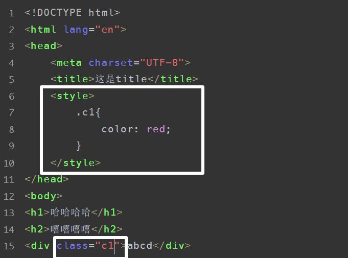

### 3.2.3 写到文件中

```css
.c1{
    height: 100px;
}

.c2{
    color: red;
}
```

```html
<!DOCTYPE html>
<html lang="en">
<head>
    <meta charset="UTF-8">
    <title>这是title</title>
    <link rel="stylesheet" href="common.css"/>
</head>
<body>
<h1>哈哈哈哈</h1>
<h2>嘻嘻嘻嘻</h2>
<div class="c1">abcd</div>
<div class="c2">efgh</div>
<div>

    <a href="https://www.baidu.com"> 点击跳转 </a> <br>
    <a href="/get/news"> 点击跳转 </a>
</div>


</body>
</html>
```

与`flask`协同使用`css`

```html
<!DOCTYPE html>
<html lang="en">
<head>
    <meta charset="UTF-8">
    <title>Title</title>
    <style>
        .c1 {
            color: red;
        }
        .c2{
            height: 60px;
        }
    </style>
    <link rel="stylesheet" href="/static/commons.css"/>
</head>
<body>
<h1 class="c1">用户注册</h1>
<h1 class="c3">添加用户信息</h1>
<div>
    <form method="get" action="/wephiles/index">
        <div class="c2">
            用户名 : <input type="text"/>
        </div>

        <div class="c2">
            密 码 : <input type="password"/>
        </div>

        <div class="c4">
            电话号码 : <input type="text"/>
        </div>

        <div>
            <!-- <input type="button" value="提交"> -->
            <input type="submit" value="submit">
        </div>
    </form>
</div>
</body>
</html>

```

```python
@app.route("/user/register/")
def register():
    return render_template("register.html", name="JinYu")


if __name__ == '__main__':
    app.run()
```

## 有个问题

用`flask`开发很不方便,每次改动都要重启并且每个文件都放在固定的地方.

有没有一种方法,可以让我们快速地编写前端代码并查看效果,最后再将页面集成到`Flask`中?

有! `pycharm`为我们提供了一种非常便捷开发前端的工具.

创建新的普通项目:写一个`html`文档.

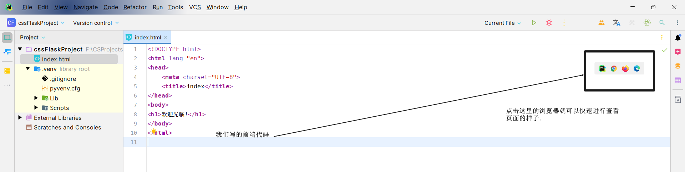

## 3.3 `CSS`选择器

```html
<!DOCTYPE html>
<html lang="en">
<head>
    <meta charset="UTF-8">
    <title>index</title>
    <style>
        /*类选择器*/
        .c1 {

            color: red;
        }
        /*id选择器*/
        #x1 {
            color: cornflowerblue;
        }
        /*标签选择器*/
        li{
            color: pink;
        }
    </style>
</head>
<body>
<h1>欢迎光临!</h1>

<div class="c1">aaa</div>
<div id="x1">bbb</div>
<div>ccc</div>

<ul>
    <li>a</li>
    <li>b</li>
    <li>c</li>
</ul>

<ol>
    <li>x</li>
    <li>y</li>
    <li>z</li>
</ol>
</body>
</html>
```

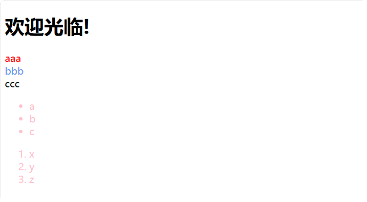

- `id`选择器

- 类选择器(用的最多)

- 标签选择器

- 属性选择器
  ```html
  <!DOCTYPE html>
  <html lang="en">
  <head>
      <meta charset="UTF-8">
      <title>index</title>
      <style>
          /*类选择器*/
          .c1 {
  
              color: red;
          }
          /*id选择器*/
          #x1 {
              color: cornflowerblue;
          }
          /*标签选择器*/
          li{
              color: pink;
          }
          /*属性选择器*/
          input[type="text"]{
              border: 2px solid blue;
          }
      </style>
  </head>
  <body>
  <h1>欢迎光临!</h1>
  
  <div class="c1">aaa</div>
  <div id="x1">bbb</div>
  <div>ccc</div>
  
  <ul>
      <li>a</li>
      <li>b</li>
      <li>c</li>
  </ul>
  
  <ol>
      <li>x</li>
      <li>y</li>
      <li>z</li>
  </ol>
  username: <input type="text"/>
  password: <input type="password"/>
  
  </body>
  </html>
  ```

  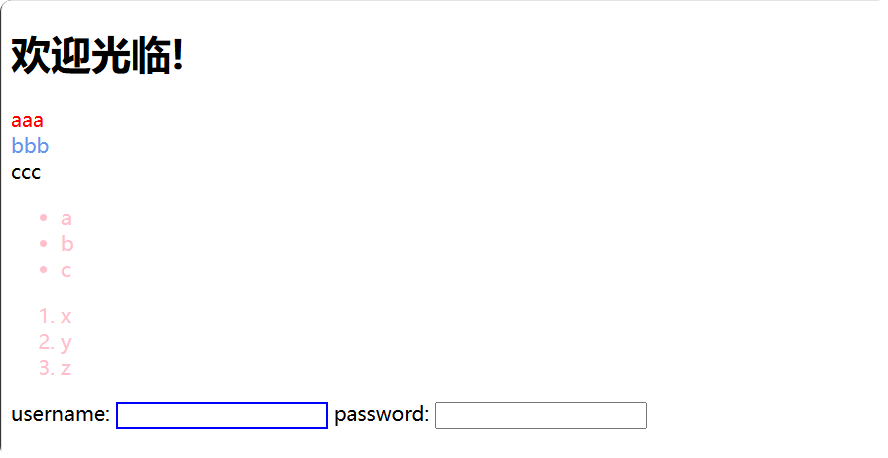

  ```html
  <!DOCTYPE html>
  <html lang="en">
  <head>
      <meta charset="UTF-8">
      <title>index</title>
      <style>
          /*类选择器*/
          .c1 {
  
              color: red;
          }
          /*id选择器*/
          #x1 {
              color: cornflowerblue;
          }
          /*标签选择器*/
          li{
              color: pink;
          }
          /*属性选择器*/
          input[type="text"]{
              border: 2px solid blue;
          }
          /* ... */
          .v1[xx="456"]{
              color: gold;
          }
      </style>
  </head>
  <body>
  <h1>欢迎光临!</h1>
  
  <div class="c1">aaa</div>
  <div id="x1">bbb</div>
  <div>ccc</div>
  <div class="v1" xx="123">xxx</div>
  <div class="v1" xx="456">yyy</div>
  <div class="v1" xx="999">zzz</div>
  
  <ul>
      <li>a</li>
      <li>b</li>
      <li>c</li>
  </ul>
  
  <ol>
      <li>x</li>
      <li>y</li>
      <li>z</li>
  </ol>
  username: <input type="text"/>
  password: <input type="password"/>
  
  </body>
  </html>
  ```

  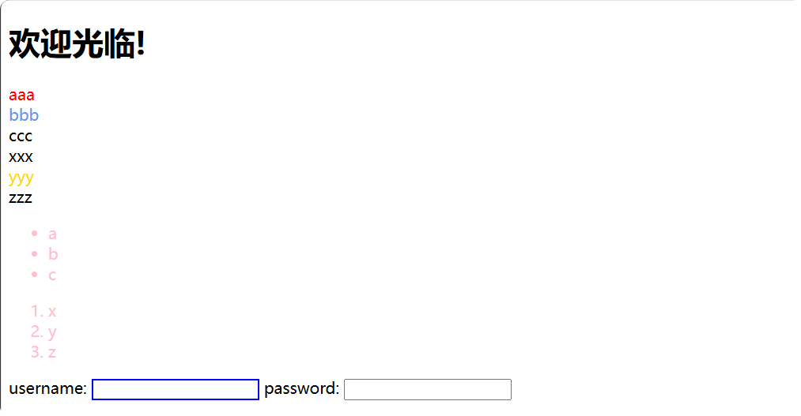

- 后代选择器
  ```html
  <!DOCTYPE html>
  <html lang="en">
  <head>
      <meta charset="UTF-8">
      <title>index</title>
      <style>
          /*类选择器*/
          .c1 {
  
              color: red;
          }
  
          /*id选择器*/
          #x1 {
              color: cornflowerblue;
          }
  
          /*标签选择器*/
          li {
              color: pink;
          }
  
          /*属性选择器*/
          input[type="text"] {
              border: 2px solid blue;
          }
  
          .v1[xx="456"] {
              color: gold;
          }
  
          /* 后代选择器 */
          .yy li{
              color: blue;
          }
      </style>
  </head>
  <body>
  <h1>欢迎光临!</h1>
  
  <div class="c1">aaa</div>
  <div id="x1">bbb</div>
  <div>ccc</div>
  <div class="v1" xx="123">xxx</div>
  <div class="v1" xx="456">yyy</div>
  <div class="v1" xx="999">zzz</div>
  
  <ul>
      <li>a</li>
      <li>b</li>
      <li>c</li>
  </ul>
  
  <div class="yy">
      <ul>
          <li>001</li>
          <li>002</li>
          <li>003</li>
      </ul>
  </div>
  
  <ol>
      <li>x</li>
      <li>y</li>
      <li>z</li>
  </ol>
  username: <input type="text"/>
  password: <input type="password"/>
  
  </body>
  </html>
  
  ```

  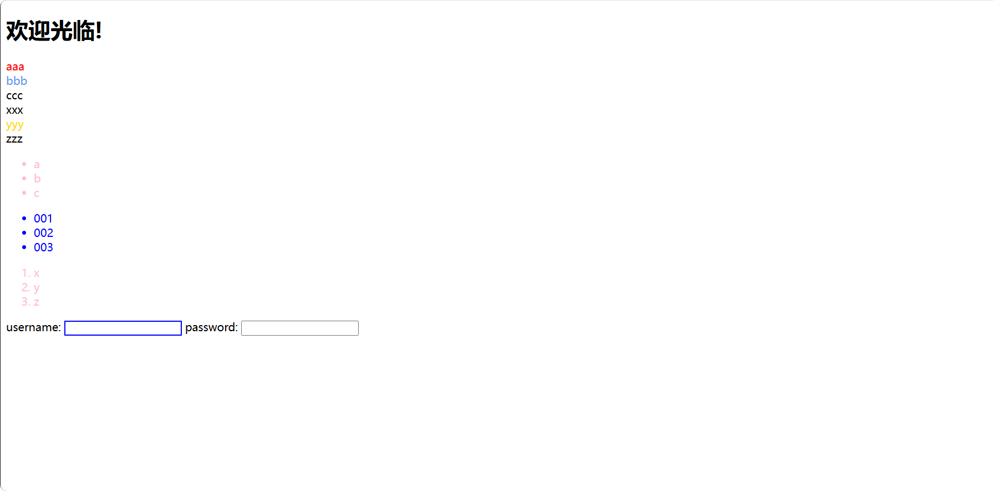

  ```html
  <!DOCTYPE html>
  <html lang="en">
  <head>
      <meta charset="UTF-8">
      <title>index</title>
      <style>
          /*类选择器*/
          .c1 {
  
              color: red;
          }
  
          /*id选择器*/
          #x1 {
              color: cornflowerblue;
          }
  
          /*标签选择器*/
          li {
              color: pink;
          }
  
          /*属性选择器*/
          input[type="text"] {
              border: 2px solid blue;
          }
  
          .v1[xx="456"] {
              color: gold;
          }
  
          /* 后代选择器 */
          .yy li{
              color: blue;
          }
          /* 会找到.yy下面的所有a标签 */
          .yy a{
              color: greenyellow;
          }
          /* 只会找.yy的儿子中的a标签 */
          .yy > a{
              color: indigo;
          }
      </style>
  </head>
  <body>
  <h1>欢迎光临!</h1>
  
  <div class="c1">aaa</div>
  <div id="x1">bbb</div>
  <div>ccc</div>
  <div class="v1" xx="123">xxx</div>
  <div class="v1" xx="456">yyy</div>
  <div class="v1" xx="999">zzz</div>
  
  <ul>
      <li>a</li>
      <li>b</li>
      <li>c</li>
  </ul>
  
  <div class="yy">
      <a>computer</a>
      <div>
          <a>Google</a>
      </div>
      <ul>
          <li>001</li>
          <li>002</li>
          <li>003</li>
      </ul>
  </div>
  
  <ol>
      <li>x</li>
      <li>y</li>
      <li>z</li>
  </ol>
  username: <input type="text"/>
  password: <input type="password"/>
  
  </body>
  </html>
  
  ```

  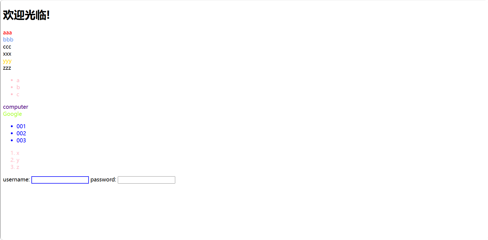

## 3.4 多个和覆盖

如果内容没重复:就会同时应用.

```html
<!DOCTYPE html>
<html lang="en">
<head>
    <meta charset="UTF-8">
    <title>用户信息</title>
    <style>
        .c1{
            /* 文本颜色 */
            color: red;
            /* 边框 */
            border: 1px solid red;
        }

        .c2{
            font-size: 28px;
        }
    </style>
</head>
<body>
<div class="c1 c2">
    计算机科学与技术
</div>
</body>
</html>
```

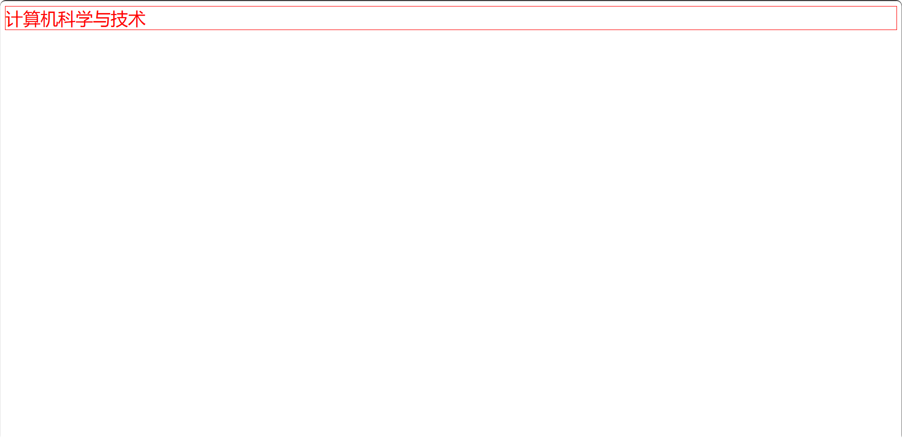

如果内容重复了:

下面的会将上面的覆盖掉.

```html
<!DOCTYPE html>
<html lang="en">
<head>
    <meta charset="UTF-8">
    <title>用户信息</title>
    <style>
        .c1{
            /* 文本颜色 */
            color: red;
            /* 边框 */
            border: 1px solid red;
        }

        .c2{
            font-size: 28px;
            color: blue;
        }
    </style>
</head>
<body>
<div class="c1 c2">
    计算机科学与技术
</div>
</body>
</html>
```

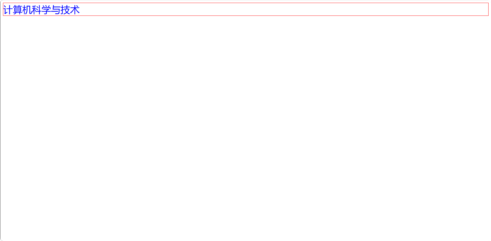

如果重复了,但是不让其进行覆盖:

```html
<!DOCTYPE html>
<html lang="en">
<head>
    <meta charset="UTF-8">
    <title>用户信息</title>
    <style>
        .c1{
            /* 文本颜色 */
            color: red !important;
            /* 边框 */
            border: 1px solid red;
        }

        .c2{
            font-size: 28px;
            color: blue;
        }
    </style>
</head>
<body>
<div class="c1 c2">
    计算机科学与技术
</div>
</body>
</html>
```

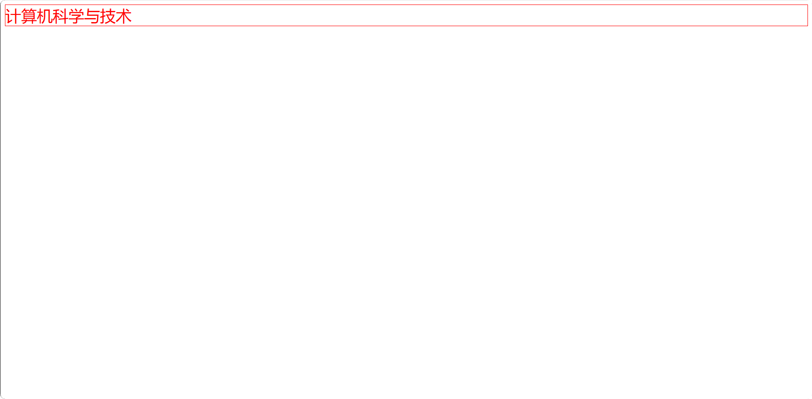

## 3.5 样式

### 3.5.1 高度和宽度

```html
.c1{
    height: 300px;
    width: 500px;
}
```

#### 3.5.1.1 关于宽度

- 宽度还支持**百分比**.但是高度不支持
- 行内标签设置宽高:默认无效.
- 块级标签设置宽高:默认有效.

### 3.5.2 块级标签&行内标签

- 块级标签
- 行内标签
- `css`样式: 标签 --> `display: inline-block`

```html
<!DOCTYPE html>
<html lang="en">
<head>
    <meta charset="UTF-8">
    <title>Title</title>
    <style>
        .c1{
            display: inline-block;
            height: 50px;
            width: 100px;
            border: 2px solid black;
        }
    </style>
</head>
<body>
    <div class="c1">乔拜登</div>
    <span class="c1">特朗普</span>
</body>
</html>
```

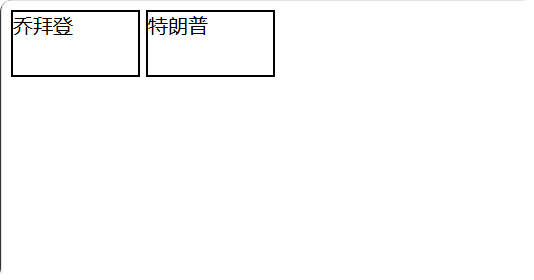

#### 3.5.2.1 块级标签和行内标签的转换

```html
<div style="display: inline">
    xxx
</div>

<span style="display: block">yyy</span>
```

注意:块级标签用得多 此外还有块级-行内标签用的多

### 3.5.3 字体和颜色

```html
<!DOCTYPE html>
<html lang="en">
<head>
    <meta charset="UTF-8">
    <title>Title</title><style>
        .c1{
            color: red;
            /*color: #FFFF00;*/
          font-size: 18px;
        }
    </style>

</head>
<body>
  <div class="c1">计算机与信息工程学院</div>
  <div class="c2">计算机科学与技术</div>
</body>
</html>
```

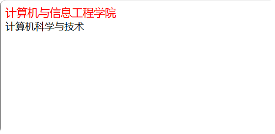

```html
<!DOCTYPE html>
<html lang="en">
<head>
    <meta charset="UTF-8">
    <title>Title</title><style>
        .c1{
            color: red;
            /*color: #FFFF00;*/
          font-size: 18px;
          font-weight: 600;
          font-family: '楷体', 'Consolas', 'Menlo';
        }
    </style>

</head>
<body>
  <div class="c1">计算机与信息工程学院</div>
  <div class="c2">计算机科学与技术</div>
</body>
</html>
```


### 3.5.4 对齐方式

```html
<!DOCTYPE html>
<html lang="en">
<head>
    <meta charset="UTF-8">
    <title>Title</title><style>
        .c1{
          /*height: 59px;*/
          width: 300px;
          border: 2px solid red;

          /*水平居中*/
          text-align: center;

          /*垂直居中 前提是只有一行*/
          height: 59px;
          line-height: 59px;
        }
    </style>

</head>
<body>
  <div class="c1">计算机与信息工程学院</div>
  <div class="c2">计算机科学与技术</div>
</body>
</html>
```

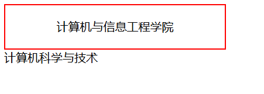

### 3.5.5 浮动

```html
<div class="c1">
    <span>计算机与信息工程学院</span>
    <span style="float: right;">计算机科学与技术</span>
</div>
```

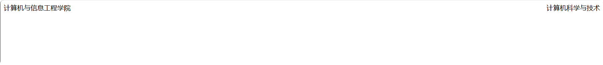

`div`默认是块级标签,如果让`div`浮动起来,那么就会变成行内的样式.

```html
<!DOCTYPE html>
<html lang="en">
<head>
    <meta charset="UTF-8">
    <title>Title</title>
    <style>
        .item {
            float: left;
            height: 300px;
            width: 300px;
            border: 2px solid red;
        }
    </style>

</head>
<body>
<div>
    <div class="item"> 计算机 </div>
    <div class="item"> 科学 </div>
</div>
</body>
</html>
```

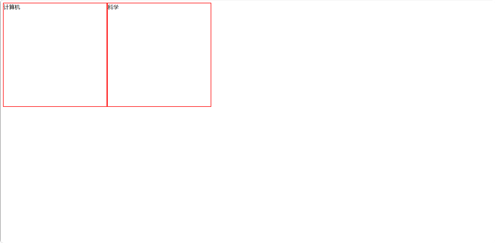

但是这样有个小问题:如果让标签浮动起来,就有可能出现脱离文档流的问题.

```html
<!DOCTYPE html>
<html lang="en">
<head>
    <meta charset="UTF-8">
    <title>Title</title>
    <style>
        .item {
            float: left;
            height: 300px;
            width: 300px;
            border: 2px solid red;
        }
    </style>

</head>
<body>
<div style="background-color: blue;">
    <div class="item"> 计算机 </div>
    <div class="item"> 科学 </div>
</div>
</body>
</html>
```

我们发现上面的`background-color`没有效果 -- 孩子们没有将外面大的`div`撑起来. --> 可以解决.加一个`<div style="clear: both;"></div>`


解决方法:

```html
<!DOCTYPE html>
<html lang="en">
<head>
    <meta charset="UTF-8">
    <title>Title</title>
    <style>
        .item {
            float: left;
            height: 300px;
            width: 300px;
            border: 2px solid red;
        }
    </style>

</head>
<body>
<div style="background-color: blue;">
    <div class="item"> 计算机 </div>
    <div class="item"> 科学 </div>
    <div style="clear: both;"></div>
</div>
</body>
</html>
```

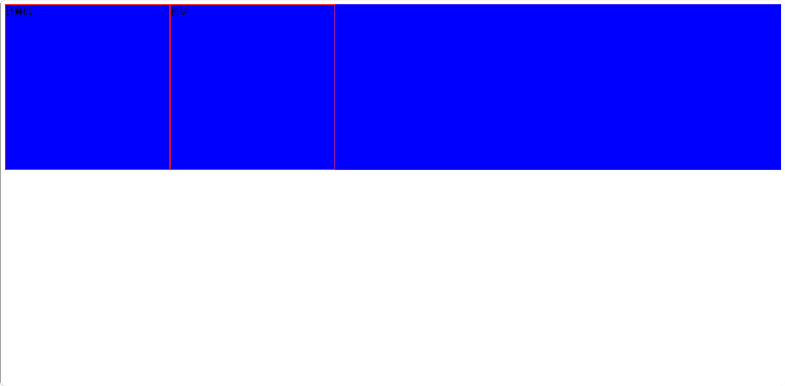

### 3.5.6 内边距

给自己的内部设置的边距.

```html
<!DOCTYPE html>
<html lang="en">
<head>
    <meta charset="UTF-8">
    <title>Title</title>
    <style>
        .outer{
            border: 2px solid black;
            height: 200px;
            width: 400px;
            /* 上 右 下 左 */
            padding: 20px 10px 10px;
            /*padding-top: 20px;*/
            /*padding-left: 10px;*/
            /*padding-right: 10px;*/
            /*padding-bottom: 10px;*/
        }
    </style>
</head>
<body>
<div class="outer">
    <div style="background-color: gold;">听妈妈的话</div>
    <div>要早点回家</div>
</div>
</body>
</html>
```

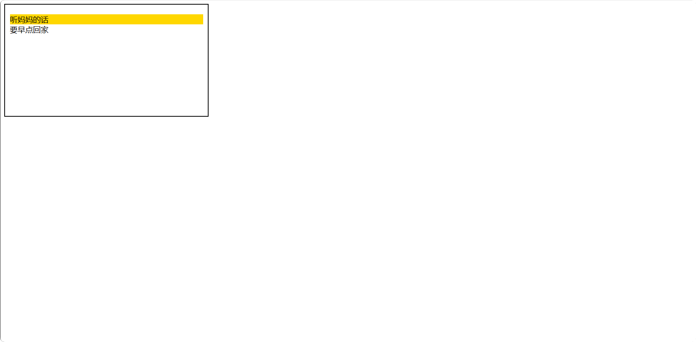

### 3.5.7 外边距

我与别人加点距离.

```html
<!DOCTYPE html>
<html lang="en">
<head>
    <meta charset="UTF-8">
    <title>Title</title>
</head>
<body>
    <div style="height: 40px; background-color: #f2f2f2;">计算机技术 Python</div>
    <div style="height: 40px; background-color: #f2f200; margin-top: 40px;">计算机技术 Java</div>
</body>
</html>
```

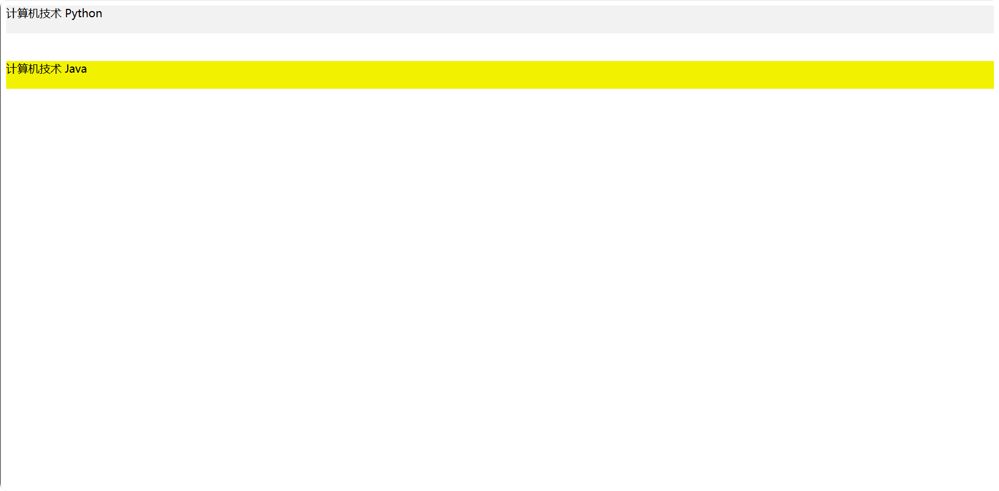

### 3.5.8 案例 -- 小米商城

> [!Caution]
>
> 注意：`html`中整个`body`区域都会和浏览器整个页面有个边距，如果不想要有边距，可以在`CSS`中这样写：

```css
body{
    margin: 0;
}
```

> [!Note]
>
> 怎么让**区域(不是文本)**在水平方向居中呢?必须要设置宽度,并且要将`margin`像下面这样设置:
> ```css
> div{
>     width: 180px;
>     margin: 0 auto;
> }
> ```
>
> 此外,父亲如果没有高度和宽度,但是儿子/孙子有,那么父亲的大小就会被儿子/孙子的大小撑起来.

```html
<!DOCTYPE html>
<html lang="en">
<head>
    <meta charset="UTF-8">
    <title>小米商城-瑾瑜</title>
    <style>
        body {
            margin: 0;
        }

        .header {
            /*height: 40px;*/
            font-size: 12px;
            color: #b0b0b0;
            background: #333;
        }

        .header a{
            height: 40px;
            display: inline-block;
            /*border-right-style: solid;*/
            margin-right: 10px;
        }

        .container{
            width: 1226px;
            /*margin-left: auto;*/
            /*margin-right: auto;*/
            margin: 0 auto;
        }

        .header .menu {
            float: left;
            /*height: 40px;*/
            line-height: 40px;
            font-family: '微软雅黑', '华文细黑', 'Menlo', serif;
        }

        .header .account {
            float: right;
            /*height: 40px;*/
            line-height: 40px;
            font-family: '华文细黑', 'Menlo', serif;
        }
    </style>
</head>
<body>
<div class="header">
    <div class="container">
        <div class="menu">
            <a>小米商城</a>
            <a>MIUI</a>
            <a>IoT</a>
            <a>云服务</a>
            <a>天星数科</a>
            <a>有品</a>
            <a>小爱开放平台</a>
            <a>企业团购</a>
            <a>资质证照</a>
            <a>协议规则</a>
            <a>下载App</a>
            <a>智能生活</a>
        </div>
        <div class="account">
            <a>登录</a>
            <a>注册</a>
            <a>消息通知</a>
            <a>购物车</a></div>
        <div style="clear: both;"></div>
    </div>
</div>
</body>
</html>
```

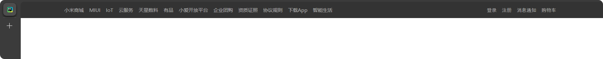

