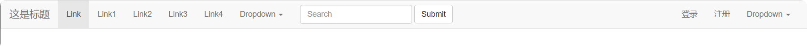

<h1 style="text-align: center;font-size: 40px; font-family: '楷体';">前端开发CSS、Bootstrap-day12</h1>


[TOC]

概要:

- 案例的应用(利用之前所学知识)
- `CSS`的补充+案例
- 模板+CSS+构建页面
- 模板 -- `Bootstrap`

# 1 内容回顾

- `html`标签 -- 记住、背会

  - `div`
  - `span`
  - `a`
  - `img`
  - `input`
  - `ul`
  - `li`
  - `ol`
  - `table`
  - `form`

- `CSS`样式

  - 引入
    - 标签上
    - `head`标签里面
    - 文件
  - 选择
    - `.` -- 类选择
    - `#` -- `id`选择
    - `div` -- 标签选择
    - `.c1 div` -- 后代选择

  - `CSS`样式
    - 宽度
    - 高度
    - 块级&行内
    - 浮动
    - 字体
    - 对齐方式
    - 内边距
    - 外边距

# 2 案例`1` - 小米商城

## 2.1 划分区域


## 2.2 搭建骨架

```html
<!DOCTYPE html>
<html lang="en">
<head>
    <meta charset="UTF-8">
    <title>小米商城-瑾瑜</title>
    <style>
        body {
            margin: 0;
        }

        .header {
            /*height: 40px;*/
            font-size: 12px;
            color: #b0b0b0;
            background: #333;
        }

        .header a {
            height: 40px;
            display: inline-block;
            /*border-right-style: solid;*/
            margin-right: 10px;
        }

        .header .container {
            width: 1226px;
            /*margin-left: auto;*/
            /*margin-right: auto;*/
            margin: 0 auto;
        }

        .header .menu {
            float: left;
            /*height: 40px;*/
            line-height: 40px;
            font-family: '微软雅黑', '华文细黑', 'Menlo', serif;
        }

        .header .account {
            float: right;
            /*height: 40px;*/
            line-height: 40px;
            font-family: '华文细黑', 'Menlo', serif;
        }

        .sub-header {
            height: 100px;
            background: #f2f2f2;
        }

        .sub-header .container {
            width: 1226px;
            /*margin-left: auto;*/
            /*margin-right: auto;*/
            margin: 0 auto;
            font-size: 16px;
            font-family: '微软雅黑', '华文细黑', 'Menlo', serif;
            height: 100px;
        }

        .sub-header .logo {
            width: 234px;
            height: 100px;
            line-height: 100px;
            float: left;
        }

        .sub-header .menu-list {
            /*width: 234px;*/
            line-height: 100px;
            height: 100px;
            float: left;
        }

        .sub-header .menu-list a:hover{
            /*鼠标放上去就会应用下面的效果:*/
            color: #b0b0b0;
        }

        .sub-header .menu-list a{
            /*width: 234px;*/
            padding: 0 5px;
            display: inline-block;
            height: 100px;
            line-height: 100px;
            margin-right: 5px;
            color: #333;
            /* 取消下划线 */
            text-decoration: none;
        }

        .sub-header .search {
            /*width: 234px;*/
            height: 100px;
            line-height: 100px;
            float: right;
        }

        .sub-header .xiaomi_logo {
            /* a标签是行内标签 如果只设置margin-top,那么还是不会变 所以要搞成inline-block */
            display: inline-block;
            margin-top: 22px;
        }
    </style>
</head>
<body>

<div class="header">
    <div class="container">
        <div class="menu">
            <a>小米商城</a>
            <a>MIUI</a>
            <a>IoT</a>
            <a>云服务</a>
            <a>天星数科</a>
            <a>有品</a>
            <a>小爱开放平台</a>
            <a>企业团购</a>
            <a>资质证照</a>
            <a>协议规则</a>
            <a>下载App</a>
            <a>智能生活</a>
        </div>
        <div class="account">
            <a>登录</a>
            <a>注册</a>
            <a>消息通知</a>
            <a>购物车</a></div>
        <div style="clear: both;"></div>
    </div>
</div>

<div class="sub-header">
    <div class="container">
        <div class="logo">
            <a class="xiaomi_logo" href="https://www.baidu.com">
                
            </a>
        </div>
        <div class="menu-list">
            <a href="https://www.baidu.com">Xiaomi手机</a>
            <a href="https://www.baidu.com">Redmi手机</a>
            <a href="https://www.baidu.com">电视</a>
            <a href="https://www.baidu.com">笔记本</a>
            <a href="https://www.baidu.com">平板</a>
            <a href="https://www.baidu.com">家电</a>
            <a href="https://www.baidu.com">路由器</a>
            <a href="https://www.baidu.com">服务中心</a>
            <a href="https://www.baidu.com">社区</a>
        </div>
        <div class="search">搜索</div>
        <div style="clear: both;"></div>
    </div>
</div>
</body>
</html>
```


## 2.3 小结

- `a`标签是行内标签，高度和边距（内外边距）都是无效的
- 垂直居中
  - 文本:`line-height`
  - 区域: 计算边距
- `a`标签默认有下划线
- 某个标签的`hover`:设置鼠标放上去的样式.

## 2.4 小米商城 - 推荐区域


```html
<!DOCTYPE html>
<html lang="en">
<head>
    <meta charset="UTF-8">
    <title>小米商城-瑾瑜</title>
    <style>
        body {
            margin: 0;
        }

        img {
            width: 100%;
            height: 100%;
        }

        .left {
            float: left;
        }

        .header {
            /*height: 40px;*/
            font-size: 12px;
            color: #b0b0b0;
            background: #333;
        }

        .header a {
            height: 40px;
            display: inline-block;
            /*border-right-style: solid;*/
            margin-right: 10px;
        }

        .container {
            width: 1226px;
            /*margin-left: auto;*/
            /*margin-right: auto;*/
            margin: 0 auto;
        }

        .header .container {
            width: 1226px;
            /*margin-left: auto;*/
            /*margin-right: auto;*/
            margin: 0 auto;
        }

        .header .menu {
            float: left;
            /*height: 40px;*/
            line-height: 40px;
            font-family: '微软雅黑', '华文细黑', 'Menlo', serif;
        }

        .header .account {
            float: right;
            /*height: 40px;*/
            line-height: 40px;
            font-family: '华文细黑', 'Menlo', serif;
        }

        .sub-header {
            height: 100px;
            background: #f2f2f2;
        }

        .sub-header .container {
            width: 1226px;
            /*margin-left: auto;*/
            /*margin-right: auto;*/
            margin: 0 auto;
            font-size: 16px;
            font-family: '微软雅黑', '华文细黑', 'Menlo', serif;
            height: 100px;
        }

        .sub-header .logo {
            width: 234px;
            height: 100px;
            line-height: 100px;
            float: left;
        }

        .sub-header .menu-list {
            /*width: 234px;*/
            line-height: 100px;
            height: 100px;
            float: left;
        }

        .sub-header .menu-list a:hover {
            /*鼠标放上去就会应用下面的效果:*/
            color: #b0b0b0;
        }

        .sub-header .menu-list a {
            /*width: 234px;*/
            padding: 0 5px;
            display: inline-block;
            height: 100px;
            line-height: 100px;
            margin-right: 5px;
            color: #333;
            /* 取消下划线 */
            text-decoration: none;
        }

        .sub-header .search {
            /*width: 234px;*/
            height: 100px;
            line-height: 100px;
            float: right;
        }

        .sub-header .xiaomi_logo {
            /* a标签是行内标签 如果只设置margin-top,那么还是不会变 所以要搞成inline-block */
            display: inline-block;
            margin-top: 22px;
        }

        .slider .slider-img {
            width: 1226px;
            height: 460px;
            margin-left: auto;
            margin-right: auto;
        }

        .slider .slider-img img {
            /*占父亲区域的宽高后,下面控制图片和父亲区域一样大*/
            width: 100%;
            height: 100%;
        }

        .news .channel {
            background: #5f5750;
            width: 228px;
            height: 164px;
            padding: 3px;
        }

        .news .list-item {
            width: 316px;
            height: 170px;
        }

        .news .channel .item {
            height: 86px;
            width: 76px;
            text-align: center;
            /*border: 1px solid red;*/
        }

        .news .channel .item img{
            height: 24px;
            width: 24px;
            display: block;
            margin: 0 auto;
        }
        .news {
            margin-top: 14px;
        }
        .news .channel .item a{
            opacity: 0.5;
            text-decoration: none;
            display: inline-block;
            padding-top: 18px;
            font-size: 12px;
            color: rgba(255,255,255,0.7);
        }

        .news .channel .item a:hover {
            opacity: 1;
        }

        .news .channel .item a div {
            margin-bottom: 4px;
        }
    </style>
</head>
<body>

<div class="header">
    <div class="container">
        <div class="menu">
            <a>小米商城</a>
            <a>MIUI</a>
            <a>IoT</a>
            <a>云服务</a>
            <a>天星数科</a>
            <a>有品</a>
            <a>小爱开放平台</a>
            <a>企业团购</a>
            <a>资质证照</a>
            <a>协议规则</a>
            <a>下载App</a>
            <a>智能生活</a>
        </div>
        <div class="account">
            <a>登录</a>
            <a>注册</a>
            <a>消息通知</a>
            <a>购物车</a></div>
        <div style="clear: both;"></div>
    </div>
</div>

<div class="sub-header">
    <div class="container">
        <div class="logo">
            <a class="xiaomi_logo" href="https://www.baidu.com">
                
            </a>
        </div>
        <div class="menu-list">
            <a href="https://www.baidu.com">Xiaomi手机</a>
            <a href="https://www.baidu.com">Redmi手机</a>
            <a href="https://www.baidu.com">电视</a>
            <a href="https://www.baidu.com">笔记本</a>
            <a href="https://www.baidu.com">平板</a>
            <a href="https://www.baidu.com">家电</a>
            <a href="https://www.baidu.com">路由器</a>
            <a href="https://www.baidu.com">服务中心</a>
            <a href="https://www.baidu.com">社区</a>
        </div>
        <div class="search">搜索</div>
        <div style="clear: both;"></div>
    </div>
</div>

<div class="slider">
    <div class="container">
        <div class="slider-img">
            
        </div>
    </div>
</div>

<div class="news">
    <div class="container">
        <div class="channel left">
            <div class="item left">
                <a href="https://www.baidu,com">
                    <div>
                        
                    </div>
                    <span>小米秒杀</span>
                </a>
            </div>
            <div class="item left">
                <a href="https://www.baidu,com">
                    <div>
                        
                    </div>
                    <span>企业团购</span>
                </a>
            </div>
            <div class="item left">
                <a href="https://www.baidu,com">
                    <div>
                        
                    </div>
                    <span>F码通道</span>
                </a>
            </div>
            <div class="item left">
                <a href="https://www.baidu,com">
                    <div>
                        
                    </div>
                    <span>米粉卡</span>
                </a>
            </div>
            <div class="item left">
                <a href="https://www.baidu,com">
                    <div>
                        
                    </div>
                    <span>以旧换新</span>
                </a>
            </div>
            <div class="item left">
                <a href="https://www.baidu,com">
                    <div>
                        
                    </div>
                    <span>话费充值</span>
                </a>
            </div>
            <div style="clear: both;"></div>
        </div>
        <div class="list-item left" style="margin-left: 14px;">
            
        </div>
        <div class="list-item left" style="margin-left: 15px;">
            
        </div>
        <div class="list-item left" style="margin-left: 15px;">
            
        </div>
        <div style="clear: both;"></div>
    </div>
</div>

<div style="height: 500px;"></div>
</body>
</html>
```


小结:`opacity`是透明度值为`0 ~ 1`

# 3 `CSS`知识点

## 3.1 伪类`hover`

hover有两种使用方式：

- 第一种
  ```html
  <!DOCTYPE html>
  <html lang="en">
  <head>
      <meta charset="UTF-8">
      <title>Title</title>
      <style>
          .c1 {
              color: red;
              font-size: 20px;
          }
  
          .c1:hover {
              color: green;
              font-size: 30px;
          }
  
          .c2 {
              height: 50px;
              width: 50px;
              border: 1px solid yellow;
          }
  
          .c2:hover {
              border: 2px solid blue;
          }
      </style>
  </head>
  <body>
  <div class="c1"> 计算机 </div>
  <div class="c2"> 技术 </div>
  </body>
  </html>
  
  ```

- 第二种
  ```html
  <!DOCTYPE html>
  <html lang="en">
  <head>
      <meta charset="UTF-8">
      <title>Title</title>
      <style>
          .c1 {
              color: red;
              font-size: 20px;
          }
  
          .c1:hover {
              color: green;
              font-size: 30px;
          }
  
          .c2 {
              height: 50px;
              width: 50px;
              border: 1px solid yellow;
          }
  
          .c2:hover {
              border: 2px solid blue;
          }
  
          .download {
              display: none;
          }
  
          .app:hover .download{
              display: block;
          }
  
          .app:hover .title{
              color: red;
          }
      </style>
  </head>
  <body>
  <div class="c1"> 计算机 </div>
  <div class="c2"> 技术 </div>
  
  <div class="app">
      <div class="title">
          点击下载APP
      </div>
      <div class="download">
          
      </div>
  </div>
  </body>
  </html>
  ```

  

## 3.2 伪类`after`

```html
<!DOCTYPE html>
<html lang="en">
<head>
    <meta charset="UTF-8">
    <title>Title</title>
    <style>
        .clearfix:after {
            content: "";
            display: block;
            clear: both;
        }

        .c1:after {
            content: " science";
        }

        .item {
            float: left;
        }
    </style>
</head>
<body>
<div class="c1">
    computer
</div>

<div class="c1">
    technology
</div>

<div class="clearfix">
    <div class="item">
        1
    </div>

    <div class="item">
        2
    </div>

    <div class="item">
        3
    </div>

</div>
</body>
</html>
```

## 3.3 `position`

- `fixed`

- `relative`
- `absolute`

### 3.3.1 `fixed`

固定在窗口的某个位置

**案例：返回顶部**

```html
<!DOCTYPE html>
<html lang="en">
<head>
    <meta charset="UTF-8">
    <title>小米商城-瑾瑜</title>
    <style>
        body {
            margin: 0;
        }

        img {
            width: 100%;
            height: 100%;
        }

        .left {
            float: left;
        }

        .header {
            /*height: 40px;*/
            font-size: 12px;
            color: #b0b0b0;
            background: #333;
        }

        .header a {
            height: 40px;
            display: inline-block;
            /*border-right-style: solid;*/
            margin-right: 10px;
        }

        .container {
            width: 1226px;
            /*margin-left: auto;*/
            /*margin-right: auto;*/
            margin: 0 auto;
        }

        .header .container {
            width: 1226px;
            /*margin-left: auto;*/
            /*margin-right: auto;*/
            margin: 0 auto;
        }

        .header .menu {
            float: left;
            /*height: 40px;*/
            line-height: 40px;
            font-family: '微软雅黑', '华文细黑', 'Menlo', serif;
        }

        .header .account {
            float: right;
            /*height: 40px;*/
            line-height: 40px;
            font-family: '华文细黑', 'Menlo', serif;
        }

        .sub-header {
            height: 100px;
            background: #f2f2f2;
        }

        .sub-header .container {
            width: 1226px;
            /*margin-left: auto;*/
            /*margin-right: auto;*/
            margin: 0 auto;
            font-size: 16px;
            font-family: '微软雅黑', '华文细黑', 'Menlo', serif;
            height: 100px;
        }

        .sub-header .logo {
            width: 234px;
            height: 100px;
            line-height: 100px;
            float: left;
        }

        .sub-header .menu-list {
            /*width: 234px;*/
            line-height: 100px;
            height: 100px;
            float: left;
        }

        .sub-header .menu-list a:hover {
            /*鼠标放上去就会应用下面的效果:*/
            color: #b0b0b0;
        }

        .sub-header .menu-list a {
            /*width: 234px;*/
            padding: 0 5px;
            display: inline-block;
            height: 100px;
            line-height: 100px;
            margin-right: 5px;
            color: #333;
            /* 取消下划线 */
            text-decoration: none;
        }

        .sub-header .search {
            /*width: 234px;*/
            height: 100px;
            line-height: 100px;
            float: right;
        }

        .sub-header .xiaomi_logo {
            /* a标签是行内标签 如果只设置margin-top,那么还是不会变 所以要搞成inline-block */
            display: inline-block;
            margin-top: 22px;
        }

        .slider .slider-img {
            width: 1226px;
            height: 460px;
            margin-left: auto;
            margin-right: auto;
        }

        .slider .slider-img img {
            /*占父亲区域的宽高后,下面控制图片和父亲区域一样大*/
            width: 100%;
            height: 100%;
        }

        .news .channel {
            background: #5f5750;
            width: 228px;
            height: 164px;
            padding: 3px;
        }

        .news .list-item {
            width: 316px;
            height: 170px;
        }

        .news .channel .item {
            height: 86px;
            width: 76px;
            text-align: center;
            /*border: 1px solid red;*/
        }

        .news .channel .item img{
            height: 24px;
            width: 24px;
            display: block;
            margin: 0 auto;
        }

        .news {
            margin-top: 14px;
        }

        .news .channel .item a{
            opacity: 0.5;
            text-decoration: none;
            display: inline-block;
            padding-top: 18px;
            font-size: 12px;
            color: rgba(255,255,255,0.7);
        }

        .news .channel .item a:hover {
            opacity: 1;
        }

        .news .channel .item a div {
            margin-bottom: 4px;
        }

        .back {
            position: fixed;
            width: 60px;
            height: 60px;
            border: 1px solid red;
            right: 0;
            bottom: 20px;
        }
    </style>
</head>
<body>

<div class="header">
    <div class="container">
        <div class="menu">
            <a>小米商城</a>
            <a>MIUI</a>
            <a>IoT</a>
            <a>云服务</a>
            <a>天星数科</a>
            <a>有品</a>
            <a>小爱开放平台</a>
            <a>企业团购</a>
            <a>资质证照</a>
            <a>协议规则</a>
            <a>下载App</a>
            <a>智能生活</a>
        </div>
        <div class="account">
            <a>登录</a>
            <a>注册</a>
            <a>消息通知</a>
            <a>购物车</a></div>
        <div style="clear: both;"></div>
    </div>
</div>

<div class="sub-header">
    <div class="container">
        <div class="logo">
            <a class="xiaomi_logo" href="https://www.baidu.com">
                
            </a>
        </div>
        <div class="menu-list">
            <a href="https://www.baidu.com">Xiaomi手机</a>
            <a href="https://www.baidu.com">Redmi手机</a>
            <a href="https://www.baidu.com">电视</a>
            <a href="https://www.baidu.com">笔记本</a>
            <a href="https://www.baidu.com">平板</a>
            <a href="https://www.baidu.com">家电</a>
            <a href="https://www.baidu.com">路由器</a>
            <a href="https://www.baidu.com">服务中心</a>
            <a href="https://www.baidu.com">社区</a>
        </div>
        <div class="search">搜索</div>
        <div style="clear: both;"></div>
    </div>
</div>

<div class="slider">
    <div class="container">
        <div class="slider-img">
            
        </div>
    </div>
</div>

<div class="news">
    <div class="container">
        <div class="channel left">
            <div class="item left">
                <a href="https://www.baidu,com">
                    <div>
                        
                    </div>
                    <span>小米秒杀</span>
                </a>
            </div>
            <div class="item left">
                <a href="https://www.baidu,com">
                    <div>
                        
                    </div>
                    <span>企业团购</span>
                </a>
            </div>
            <div class="item left">
                <a href="https://www.baidu,com">
                    <div>
                        
                    </div>
                    <span>F码通道</span>
                </a>
            </div>
            <div class="item left">
                <a href="https://www.baidu,com">
                    <div>
                        
                    </div>
                    <span>米粉卡</span>
                </a>
            </div>
            <div class="item left">
                <a href="https://www.baidu,com">
                    <div>
                        
                    </div>
                    <span>以旧换新</span>
                </a>
            </div>
            <div class="item left">
                <a href="https://www.baidu,com">
                    <div>
                        
                    </div>
                    <span>话费充值</span>
                </a>
            </div>
            <div style="clear: both;"></div>
        </div>
        <div class="list-item left" style="margin-left: 14px;">
            
        </div>
        <div class="list-item left" style="margin-left: 15px;">
            
        </div>
        <div class="list-item left" style="margin-left: 15px;">
            
        </div>
        <div style="clear: both;"></div>
    </div>
</div>

<div class="back">返回顶部</div>

<div style="height: 500px;"></div>
</body>
</html>
```


**案例：对话框**

```html
<!DOCTYPE html>
<html lang="en">
<head>
    <meta charset="UTF-8">
    <title>Title</title>
    <style>
        body {
            margin: 0;
            background: #b0b0b0;
        }

        .mask {
            background-color: #333333;
            position: fixed;
            left: 0;
            right: 0;
            top: 0;
            bottom: 0;
            opacity: 0.7;
            z-index: 9;
        }

        .dialog {
            position: fixed;
            height: 300px;
            width: 500px;
            background: white;

            /*水平居中*/
            /*top: 200px;*/
            /*left: 50%;*/
            /*margin-left: -250px;*/

            /*水平居中*/
            left: 0;
            right: 0;
            margin: 0 auto;
            top: 200px;
            z-index: 999;
        }

    </style>
</head>
<body>
<div class="mask">
    巴拉巴拉巴拉巴拉巴拉巴拉
    <div class="dialog">这是对话框</div>
</div>
</body>
</html>
```


### 3.3.2 `relative & abslute`

```html
<!DOCTYPE html>
<html lang="en">
<head>
    <meta charset="UTF-8">
    <title>Title</title>
    <style>
        .c1 {
            /* 外边的 */
            position: relative;
            height: 300px;
            width: 400px;
            border: 1px solid red;
            margin: 100px;
        }

        .c1 .c2 {
            height: 59px;
            width: 59px;
            background-color: indigo;
            /* 里边的 */
            position: absolute;
            right: 0;
            top: 0;
        }
    </style>
</head>
<body>
<div class="c1">
    <div class="c2">

    </div>
</div>

</body>
</html>
```


**案例：小米商城下载APP**

```html
<!DOCTYPE html>
<html lang="en">
<head>
    <meta charset="UTF-8">
    <title>小米商城-瑾瑜</title>
    <style>
        body {
            margin: 0;
        }

        img {
            width: 100%;
            height: 100%;
        }

        .left {
            float: left;
        }

        .header {
            /*height: 40px;*/
            font-size: 12px;
            color: #b0b0b0;
            background: #333;
        }

        .header a {
            height: 40px;
            display: inline-block;
            /*border-right-style: solid;*/
            margin-right: 10px;
        }

        .container {
            width: 1226px;
            /*margin-left: auto;*/
            /*margin-right: auto;*/
            margin: 0 auto;
        }

        .header .container {
            width: 1226px;
            /*margin-left: auto;*/
            /*margin-right: auto;*/
            margin: 0 auto;
        }

        .header .menu {
            float: left;
            /*height: 40px;*/
            line-height: 40px;
            font-family: '微软雅黑', '华文细黑', 'Menlo', serif;
        }

        .header .account {
            float: right;
            /*height: 40px;*/
            line-height: 40px;
            font-family: '华文细黑', 'Menlo', serif;
        }

        .sub-header {
            height: 100px;
            background: #f2f2f2;
        }

        .sub-header .container {
            width: 1226px;
            /*margin-left: auto;*/
            /*margin-right: auto;*/
            margin: 0 auto;
            font-size: 16px;
            font-family: '微软雅黑', '华文细黑', 'Menlo', serif;
            height: 100px;
        }

        .sub-header .logo {
            width: 234px;
            height: 100px;
            line-height: 100px;
            float: left;
        }

        .sub-header .menu-list {
            /*width: 234px;*/
            line-height: 100px;
            height: 100px;
            float: left;
        }

        .sub-header .menu-list a:hover {
            /*鼠标放上去就会应用下面的效果:*/
            color: #b0b0b0;
        }

        .sub-header .menu-list a {
            /*width: 234px;*/
            padding: 0 5px;
            display: inline-block;
            height: 100px;
            line-height: 100px;
            margin-right: 5px;
            color: #333;
            /* 取消下划线 */
            text-decoration: none;
        }

        .sub-header .search {
            /*width: 234px;*/
            height: 100px;
            line-height: 100px;
            float: right;
        }

        .sub-header .xiaomi_logo {
            /* a标签是行内标签 如果只设置margin-top,那么还是不会变 所以要搞成inline-block */
            display: inline-block;
            margin-top: 22px;
        }

        .slider .slider-img {
            width: 1226px;
            height: 460px;
            margin-left: auto;
            margin-right: auto;
        }

        .slider .slider-img img {
            /*占父亲区域的宽高后,下面控制图片和父亲区域一样大*/
            width: 100%;
            height: 100%;
        }

        .news .channel {
            background: #5f5750;
            width: 228px;
            height: 164px;
            padding: 3px;
        }

        .news .list-item {
            width: 316px;
            height: 170px;
        }

        .news .channel .item {
            height: 86px;
            width: 76px;
            text-align: center;
            /*border: 1px solid red;*/
        }

        .news .channel .item img {
            height: 24px;
            width: 24px;
            display: block;
            margin: 0 auto;
        }

        .news {
            margin-top: 14px;
        }

        .news .channel .item a {
            opacity: 0.5;
            text-decoration: none;
            display: inline-block;
            padding-top: 18px;
            font-size: 12px;
            color: rgba(255, 255, 255, 0.7);
        }

        .news .channel .item a:hover {
            opacity: 1;
        }

        .news .channel .item a div {
            margin-bottom: 4px;
        }

        .back {
            position: fixed;
            width: 60px;
            height: 60px;
            border: 1px solid red;
            right: 0;
            bottom: 20px;
        }

        .app {
            position: relative;
        }

        .app .download {
            position: absolute;
            height: 70px;
            width: 70px;
            /*top: 30px;*/
            display: none;
        }

        .app:hover .download {
            display: block;
        }
    </style>
</head>
<body>

<div class="header">
    <div class="container">
        <div class="menu">
            <a>小米商城</a>
            <a>MIUI</a>
            <a>IoT</a>
            <a>云服务</a>
            <a>天星数科</a>
            <a>有品</a>
            <a>小爱开放平台</a>
            <a>企业团购</a>
            <a>资质证照</a>
            <a>协议规则</a>
            <a class="app">
                下载App
                <div class="download">
                    
                </div>
            </a>
            <a>智能生活</a>
        </div>
        <div class="account">
            <a>登录</a>
            <a>注册</a>
            <a>消息通知</a>
            <a>购物车</a></div>
        <div style="clear: both;"></div>
    </div>
</div>

<div class="sub-header">
    <div class="container">
        <div class="logo">
            <a class="xiaomi_logo" href="https://www.baidu.com">
                
            </a>
        </div>
        <div class="menu-list">
            <a href="https://www.baidu.com">Xiaomi手机</a>
            <a href="https://www.baidu.com">Redmi手机</a>
            <a href="https://www.baidu.com">电视</a>
            <a href="https://www.baidu.com">笔记本</a>
            <a href="https://www.baidu.com">平板</a>
            <a href="https://www.baidu.com">家电</a>
            <a href="https://www.baidu.com">路由器</a>
            <a href="https://www.baidu.com">服务中心</a>
            <a href="https://www.baidu.com">社区</a>
        </div>
        <div class="search">搜索</div>
        <div style="clear: both;"></div>
    </div>
</div>

<div class="slider">
    <div class="container">
        <div class="slider-img">
            
        </div>
    </div>
</div>

<div class="news">
    <div class="container">
        <div class="channel left">
            <div class="item left">
                <a href="https://www.baidu,com">
                    <div>
                        
                    </div>
                    <span>小米秒杀</span>
                </a>
            </div>
            <div class="item left">
                <a href="https://www.baidu,com">
                    <div>
                        
                    </div>
                    <span>企业团购</span>
                </a>
            </div>
            <div class="item left">
                <a href="https://www.baidu,com">
                    <div>
                        
                    </div>
                    <span>F码通道</span>
                </a>
            </div>
            <div class="item left">
                <a href="https://www.baidu,com">
                    <div>
                        
                    </div>
                    <span>米粉卡</span>
                </a>
            </div>
            <div class="item left">
                <a href="https://www.baidu,com">
                    <div>
                        
                    </div>
                    <span>以旧换新</span>
                </a>
            </div>
            <div class="item left">
                <a href="https://www.baidu,com">
                    <div>
                        
                    </div>
                    <span>话费充值</span>
                </a>
            </div>
            <div style="clear: both;"></div>
        </div>
        <div class="list-item left" style="margin-left: 14px;">
            
        </div>
        <div class="list-item left" style="margin-left: 15px;">
            
        </div>
        <div class="list-item left" style="margin-left: 15px;">
            
        </div>
        <div style="clear: both;"></div>
    </div>
</div>

<div class="back">返回顶部</div>

<div style="height: 500px;"></div>
</body>
</html>

```


## 3.4 `border`

```html
<!DOCTYPE html>
<html lang="en">
<head>
    <meta charset="UTF-8">
    <title>Title</title>
    <style>
        .c1 {
            height: 100px;
            width: 100px;
            /*border: 1px solid red;*/

            /*border: 1px dotted #333333;*/

            /*border: 1px solid red;*/
            /*border-left: 4px solid green;*/

            /*border: 1px solid red;*/
            /*!* 透明色 *!*/
            /*border-left: 4px solid transparent;*/

            border-left: 2px solid transparent;
        }

        .c1:hover {
            border-left: 2px solid yellow;
        }
    </style>
</head>
<body>
<div class="c1">
    菜单
</div>
</body>
</html>
```


## 3.5 背景色

```css
background-color: red;
```

# 4 `Bootstrap`

别人帮我们写好的很多`CSS`样式

- 下载`Bootstrap`
  截止目前，最新的是`V5`版本的`bootstrap`

  ```text
  https://v5.bootcss.com/
  ```

  这个教程是`V3`版本的`bootstrap`
  ```text
  https://v3.bootcss.com/
  ```

  

  点击下载`Bootstrap`，进入下面页面，点击**用于生产环境的`Bootstrap`**
  

  下载完毕后解压。

  

- 使用

  - 在页面上引入`Bootstrap`

  - 编写`html`代码，按照`Bootstrap`的约束 + 自定制

    

## 4.1 初识`Bootstrap`

```html
<!DOCTYPE html>
<html lang="en">
<head>
    <meta charset="UTF-8">
    <title>Title</title>
    <!--    &lt;!&ndash; 开发版本 &ndash;&gt;-->
    <!--    <link rel="stylesheet" href=".\static\plugins\bootstrap-3.4.1\css\bootstrap.css"/>-->
    <!-- 生产版本 -->
    <link rel="stylesheet" href=".\static\plugins\bootstrap-3.4.1\css\bootstrap.min.css"/>
</head>

<body>
<input type="button" value="提交"/>
<input type="button" value="提交" class="btn-primary"/>
<input type="button" value="提交" class="btn-success"/>
<input type="button" value="提交" class="btn-danger"/>
<input type="button" value="提交" class="btn-danger btn-xs"/>
</body>
</html>
```


## 4.2 导航

```html
<!DOCTYPE html>
<html lang="en">
<head>
    <meta charset="UTF-8">
    <title>Title</title>
    <link  rel="stylesheet" href=".\static\plugins\bootstrap-3.4.1\css\bootstrap.min.css"/>
    <style>
        .navbar {
            /* 去掉导航栏上的圆角 */
            border-radius: 0;
        }
    </style>
</head>
<body>
<div class="navbar navbar-default">
    <div class="container-fluid">
        <!-- Brand and toggle get grouped for better mobile display -->
        <div class="navbar-header">
            <button type="button" class="navbar-toggle collapsed" data-toggle="collapse" data-target="#bs-example-navbar-collapse-1" aria-expanded="false">
                <span class="sr-only">Toggle navigation</span>
                <span class="icon-bar"></span>
                <span class="icon-bar"></span>
                <span class="icon-bar"></span>
            </button>
            <a class="navbar-brand" href="#">这是标题</a>
        </div>

        <!-- Collect the nav links, forms, and other content for toggling -->
        <div class="collapse navbar-collapse" id="bs-example-navbar-collapse-1">
            <ul class="nav navbar-nav">
                <li class="active"><a href="#">Link <span class="sr-only">(current)</span></a></li>
                <li><a href="#">Link1</a></li>
                <li><a href="#">Link2</a></li>
                <li><a href="#">Link3</a></li>
                <li><a href="#">Link4</a></li>
                <li class="dropdown">
                    <a href="#" class="dropdown-toggle" data-toggle="dropdown" role="button" aria-haspopup="true" aria-expanded="false">Dropdown <span class="caret"></span></a>
                    <ul class="dropdown-menu">
                        <li><a href="#">Action</a></li>
                        <li><a href="#">Another action</a></li>
                        <li><a href="#">Something else here</a></li>
                        <li role="separator" class="divider"></li>
                        <li><a href="#">Separated link</a></li>
                        <li role="separator" class="divider"></li>
                        <li><a href="#">One more separated link</a></li>
                    </ul>
                </li>
            </ul>
            <form class="navbar-form navbar-left">
                <div class="form-group">
                    <input type="text" class="form-control" placeholder="Search">
                </div>
                <button type="submit" class="btn btn-default">Submit</button>
            </form>
            <ul class="nav navbar-nav navbar-right">
                <li><a href="#">登录</a></li>
                <li><a href="#">注册</a></li>
                <li class="dropdown">
                    <a href="#" class="dropdown-toggle" data-toggle="dropdown" role="button" aria-haspopup="true" aria-expanded="false">Dropdown <span class="caret"></span></a>
                    <ul class="dropdown-menu">
                        <li><a href="#">Action</a></li>
                        <li><a href="#">Another action</a></li>
                        <li><a href="#">Something else here</a></li>
                        <li role="separator" class="divider"></li>
                        <li><a href="#">Separated link</a></li>
                    </ul>
                </li>
            </ul>
        </div><!-- /.navbar-collapse -->
    </div><!-- /.container-fluid -->
</div>
</body>
</html>
```



## 4.3 栅格

- 把整划分成12格。
  ```html
  <!DOCTYPE html>
  <html lang="en">
  <head>
      <meta charset="UTF-8">
      <title>Title</title>
      <link rel="stylesheet" href="static/plugins/bootstrap-3.4.1/css/bootstrap.css"/>
  </head>
  <body>
  <div>
      <div class="col-xs-2" style="background-color: #2b542c; height: 20px;"></div>
      <div class="col-xs-10" style="background-color: #122b40; height: 20px;"></div>
  </div>
  </body>
  </html>
  ```

  

- 分类

  - 响应式:根据屏幕宽度不同
    ```text
    .col-lg- 1170px
    .col-md- 970px
    .col-sm- 750px
    ```

    ```html
    <div>
        <div class="col-lg-6" style="background-color: #2b542c; height: 20px;"></div>
        <div class="col-lg-6" style="background-color: #122b40; height: 20px;"></div>
    </div>
    ```

    

    

  - 非响应式:无论怎么调整浏览器窗口的大小,这些栅格所占的比例大小不会变,并且还是会左右放在一起(不会因为窗口太窄而换行显示).
    ```html
    <div>
        <div class="col-xs-2" style="background-color: #2b542c; height: 20px;"></div>
        <div class="col-xs-10" style="background-color: #122b40; height: 20px;"></div>
    </div>
    ```

    

    

- 列偏移
  ```html
  <div>
  	<div class="col-sm-offset-2 col-xs-6" style="background-color: #122b40; height: 20px;"></div>
  <div>
  ```

  

## 4.4 `container`

下面两个代码框所展示的效果不一样

```html
<div class="container"><!-- class="continer" bootstrap会自动将整个栅格两边加上一些空白 -->
    <div class="col-sm-9">left</div>
    <div class="col-sm-3">right</div>
</div>
```

注意下面的`left`和`right`


```html
<div class="container-fluid"><!-- class="continer-fluid" bootstrap会自动将整个栅格两边加上边距 -->
    <div class="col-sm-9">left</div>
    <div class="col-sm-3">right</div>
</div>
```


## 4.5 面板

```html
<div class="panel panel-primary">
  <div class="panel-body">
    Panel content
  </div>
  <div class="panel-footer">Panel footer</div>
</div>
```

## 4.6 媒体对象

```html
<div class="media">
            <div class="media-left">
                <a href="#">
                    
                </a>
            </div>
            <div class="media-body">
                <h4 class="media-heading">媒体对象标题</h4>
                这是媒体对象--测试.
                这是媒体对象--测试.
                这是媒体对象--测试.
                这是媒体对象--测试.
            </div>
        </div>
        <div class="media">
            <div class="media-left">
                <a href="#">
                    
                </a>
            </div>
            <div class="media-body">
                <h4 class="media-heading">媒体对象标题</h4>
                这是媒体对象--测试.
                这是媒体对象--测试.
                这是媒体对象--测试.
                这是媒体对象--测试.
            </div>
        </div>
        <div class="media">
            <div class="media-left">
                <a href="#">
                    
                </a>
            </div>
            <div class="media-body">
                <h4 class="media-heading">媒体对象标题</h4>
                这是媒体对象--测试.
                这是媒体对象--测试.
                这是媒体对象--测试.
                这是媒体对象--测试.
            </div>
        </div>
        <div class="media">
            <div class="media-left">
                <a href="#">
                    
                </a>
            </div>
            <div class="media-body">
                <h4 class="media-heading">媒体对象标题</h4>
                这是媒体对象--测试.
                这是媒体对象--测试.
                这是媒体对象--测试.
                这是媒体对象--测试.
            </div>
        </div>
        <div class="media">
            <div class="media-left">
                <a href="#">
                    
                </a>
            </div>
            <div class="media-body">
                <h4 class="media-heading">媒体对象标题</h4>
                这是媒体对象--测试.
                这是媒体对象--测试.
                这是媒体对象--测试.
                这是媒体对象--测试.
            </div>
        </div>
```

## 4.7 分页

```html
<div aria-label="Page navigation">
            <ul class="pagination">
                <li>
                    <a href="#" aria-label="Previous">
                        <span aria-hidden="true">&laquo;</span>
                    </a>
                </li>
                <li><a href="#">1</a></li>
                <li class="active"><a href="#">2</a></li>
                <li><a href="#">3</a></li>
                <li><a href="#">4</a></li>
                <li><a href="#">5</a></li>
                <li>
                    <a href="#" aria-label="Next">
                        <span aria-hidden="true">&raquo;</span>
                    </a>
                </li>
            </ul>
        </div>
```

## 案例: 博客页面


实现:

```html
<!DOCTYPE html>
<html lang="en">
<head>
    <meta charset="UTF-8">
    <title>Title</title>
    <link rel="stylesheet" href="static/plugins/bootstrap-3.4.1/css/bootstrap.css"/>
</head>
<body>

<div class="navbar navbar-default">
    <div class="container-fluid">
        <!-- Brand and toggle get grouped for better mobile display -->
        <div class="navbar-header">
            <button type="button" class="navbar-toggle collapsed" data-toggle="collapse" data-target="#bs-example-navbar-collapse-1" aria-expanded="false">
                <span class="sr-only">Toggle navigation</span>
                <span class="icon-bar"></span>
                <span class="icon-bar"></span>
                <span class="icon-bar"></span>
            </button>
            <a class="navbar-brand" href="#">这是标题</a>
        </div>

        <!-- Collect the nav links, forms, and other content for toggling -->
        <div class="collapse navbar-collapse" id="bs-example-navbar-collapse-1">
            <ul class="nav navbar-nav">
                <li class="active"><a href="#">Link <span class="sr-only">(current)</span></a></li>
                <li><a href="#">Link1</a></li>
                <li><a href="#">Link2</a></li>
                <li><a href="#">Link3</a></li>
                <li><a href="#">Link4</a></li>
                <li class="dropdown">
                    <a href="#" class="dropdown-toggle" data-toggle="dropdown" role="button" aria-haspopup="true" aria-expanded="false">Dropdown <span class="caret"></span></a>
                    <ul class="dropdown-menu">
                        <li><a href="#">Action</a></li>
                        <li><a href="#">Another action</a></li>
                        <li><a href="#">Something else here</a></li>
                        <li role="separator" class="divider"></li>
                        <li><a href="#">Separated link</a></li>
                        <li role="separator" class="divider"></li>
                        <li><a href="#">One more separated link</a></li>
                    </ul>
                </li>
            </ul>
            <form class="navbar-form navbar-left">
                <div class="form-group">
                    <input type="text" class="form-control" placeholder="Search">
                </div>
                <button type="submit" class="btn btn-default">Submit</button>
            </form>
            <ul class="nav navbar-nav navbar-right">
                <li><a href="#">登录</a></li>
                <li><a href="#">注册</a></li>
                <li class="dropdown">
                    <a href="#" class="dropdown-toggle" data-toggle="dropdown" role="button" aria-haspopup="true" aria-expanded="false">Dropdown <span class="caret"></span></a>
                    <ul class="dropdown-menu">
                        <li><a href="#">Action</a></li>
                        <li><a href="#">Another action</a></li>
                        <li><a href="#">Something else here</a></li>
                        <li role="separator" class="divider"></li>
                        <li><a href="#">Separated link</a></li>
                    </ul>
                </li>
            </ul>
        </div><!-- /.navbar-collapse -->
    </div><!-- /.container-fluid -->
</div>

<!--<div class="container">&lt;!&ndash; class="continer" bootstrap会自动将整个栅格两边加上一些大空白 &ndash;&gt;-->
<div class="container-fluid clearfix"><!-- class="continer-fluid" bootstrap会自动将整个栅格两边加上边距 -->
    <div class="col-sm-9">
        <div class="media">
            <div class="media-left">
                <a href="#">
                    
                </a>
            </div>
            <div class="media-body">
                <h4 class="media-heading">媒体对象标题</h4>
                这是媒体对象--测试.
                这是媒体对象--测试.
                这是媒体对象--测试.
                这是媒体对象--测试.
            </div>
        </div>
        <div class="media">
            <div class="media-left">
                <a href="#">
                    
                </a>
            </div>
            <div class="media-body">
                <h4 class="media-heading">媒体对象标题</h4>
                这是媒体对象--测试.
                这是媒体对象--测试.
                这是媒体对象--测试.
                这是媒体对象--测试.
            </div>
        </div>
        <div class="media">
            <div class="media-left">
                <a href="#">
                    
                </a>
            </div>
            <div class="media-body">
                <h4 class="media-heading">媒体对象标题</h4>
                这是媒体对象--测试.
                这是媒体对象--测试.
                这是媒体对象--测试.
                这是媒体对象--测试.
            </div>
        </div>
        <div class="media">
            <div class="media-left">
                <a href="#">
                    
                </a>
            </div>
            <div class="media-body">
                <h4 class="media-heading">媒体对象标题</h4>
                这是媒体对象--测试.
                这是媒体对象--测试.
                这是媒体对象--测试.
                这是媒体对象--测试.
            </div>
        </div>
        <div class="media">
            <div class="media-left">
                <a href="#">
                    
                </a>
            </div>
            <div class="media-body">
                <h4 class="media-heading">媒体对象标题</h4>
                这是媒体对象--测试.
                这是媒体对象--测试.
                这是媒体对象--测试.
                这是媒体对象--测试.
            </div>
        </div>

        <div aria-label="Page navigation">
            <ul class="pagination">
                <li>
                    <a href="#" aria-label="Previous">
                        <span aria-hidden="true">&laquo;</span>
                    </a>
                </li>
                <li><a href="#">1</a></li>
                <li class="active"><a href="#">2</a></li>
                <li><a href="#">3</a></li>
                <li><a href="#">4</a></li>
                <li><a href="#">5</a></li>
                <li>
                    <a href="#" aria-label="Next">
                        <span aria-hidden="true">&raquo;</span>
                    </a>
                </li>
            </ul>
        </div>
    </div>

    <div class="col-sm-3">
        <div class="panel panel-primary">
            <div class="panel-body">
                最新推荐
            </div>
            <div class="panel-footer">这是最新推荐的内容 --测试面板功能</div>
        </div>
        <div class="panel panel-primary">
            <div class="panel-body">
                24热门
            </div>
            <div class="panel-footer">这是24热门的内容 --测试面板功能</div>
        </div>
    </div>


</div>
</body>
</html>
```


## 案例:登录

类似于下面这样:


- 宽度 + 区域居中
- 内边距
- `bootstrap`表单

我的:

```html
<!DOCTYPE html>
<html lang="en">
<head>
    <meta charset="UTF-8">
    <title>login</title>
    <link rel="stylesheet" href="static/plugins/bootstrap-3.4.1/css/bootstrap.css"/>
</head>
<body>
<div class="container" style="border: 1px solid black; margin-top: 50px; margin-left: auto; margin-right: auto; padding: 20px; width: 500px;">
    <div style="margin: 0 auto; width: 400px;">
        <form>
            <div class="form-group">
                <label for="exampleInputEmail1">用户名或手机号</label>
                <input type="text" class="form-control" id="exampleInputEmail1" placeholder="请输入用户名或手机号">
            </div>
            <div class="form-group">
                <label for="exampleInputPassword1">密码</label>
                <input type="password" class="form-control" id="exampleInputPassword1" placeholder="请输入密码">
            </div>
            <div class="form-group">
                <label for="exampleInputFile">上传文件</label>
                <input type="file" id="exampleInputFile">
                <p class="help-block">Example block-level help text here.</p>
            </div>
            <div class="checkbox">
                <label>
                    <input type="checkbox"> Check me out
                </label>
            </div>
            <button type="submit" class="btn btn-primary">Submit</button>
        </form>
    </div>
</div>
</body>
</html>
```

效果:


老师的:

```html
<!DOCTYPE html>
<html lang="en">
<head>
    <meta charset="UTF-8">
    <title>Title</title>
    <link rel="stylesheet" href="static/plugins/bootstrap-3.4.1/css/bootstrap.css"/>

    <style>
        .account {
            width: 500px;
            /*height: 400px;*/
            border: 1px solid black;
            border-radius: 5px;
            margin-left: auto;
            margin-right: auto;
            margin-top: 100px;
            padding: 20px 30px;
            /* 增加阴影 */
            /* 水平 垂直 阴影多大 颜色*/
            box-shadow: -5px 5px 5px #aaa;
        }

        .account h1 {
            text-align: center;
            margin-top: 5px;
        }
    </style>
</head>
<body>
<div class="account">
    <h1>用户登录</h1>

    <form>
        <div class="form-group">
            <label for="exampleInputEmail1">用户名</label>
            <input type="email" class="form-control" id="exampleInputEmail1" placeholder="请输入用户名">
        </div>
        <div class="form-group">
            <label for="exampleInputPassword1">密码</label>
            <input type="password" class="form-control" id="exampleInputPassword1" placeholder="请输入密 码">
        </div>
        <div class="form-group">
            <label for="exampleInputFile">File input</label>
            <input type="file" id="exampleInputFile">
            <p class="help-block">Example block-level help text here.</p>
        </div>
        <div class="checkbox">
            <label>
                <input type="checkbox"> Check me out
            </label>
        </div>
        <button type="submit" class="btn btn-primary">登 录</button>
    </form>

</div>
</body>
</html>
```

效果:


## 案例:后台管理


我的:

```html
<!DOCTYPE html>
<html lang="en">
<head>
    <meta charset="UTF-8">
    <title>Title</title>
    <link rel="stylesheet" href="static/plugins/bootstrap-3.4.1/css/bootstrap.css"/>
</head>
<body>
<div class="container">
    <nav class="navbar navbar-default">
        <div class="container-fluid">
            <!-- Brand and toggle get grouped for better mobile display -->
            <div class="navbar-header">
                <button type="button" class="navbar-toggle collapsed" data-toggle="collapse" data-target="#bs-example-navbar-collapse-1" aria-expanded="false">
                    <span class="sr-only">Toggle navigation</span>
                    <span class="icon-bar"></span>
                    <span class="icon-bar"></span>
                    <span class="icon-bar"></span>
                </button>
                <a class="navbar-brand" href="#">Brand</a>
            </div>

            <!-- Collect the nav links, forms, and other content for toggling -->
            <div class="collapse navbar-collapse" id="bs-example-navbar-collapse-1">
                <ul class="nav navbar-nav">
                    <li class="active"><a href="#">Link <span class="sr-only">(current)</span></a></li>
                    <li><a href="#">Link</a></li>
                    <li class="dropdown">
                        <a href="#" class="dropdown-toggle" data-toggle="dropdown" role="button" aria-haspopup="true" aria-expanded="false">Dropdown <span class="caret"></span></a>
                        <ul class="dropdown-menu">
                            <li><a href="#">Action</a></li>
                            <li><a href="#">Another action</a></li>
                            <li><a href="#">Something else here</a></li>
                            <li role="separator" class="divider"></li>
                            <li><a href="#">Separated link</a></li>
                            <li role="separator" class="divider"></li>
                            <li><a href="#">One more separated link</a></li>
                        </ul>
                    </li>
                </ul>
                <form class="navbar-form navbar-left">
                    <div class="form-group">
                        <input type="text" class="form-control" placeholder="Search">
                    </div>
                    <button type="submit" class="btn btn-default">Submit</button>
                </form>
                <ul class="nav navbar-nav navbar-right">
                    <li><a href="#">Link</a></li>
                    <li class="dropdown">
                        <a href="#" class="dropdown-toggle" data-toggle="dropdown" role="button" aria-haspopup="true" aria-expanded="false">Dropdown <span class="caret"></span></a>
                        <ul class="dropdown-menu">
                            <li><a href="#">Action</a></li>
                            <li><a href="#">Another action</a></li>
                            <li><a href="#">Something else here</a></li>
                            <li role="separator" class="divider"></li>
                            <li><a href="#">Separated link</a></li>
                        </ul>
                    </li>
                </ul>
            </div><!-- /.navbar-collapse -->
        </div><!-- /.container-fluid -->
    </nav>
    <caption>后台管理-员工信息</caption>
    <div style="margin-top: 30px;">
        <button type="button" class="btn btn-primary">新建</button>
        <button type="button" class="btn btn-danger">删除</button>
        <button type="button" class="btn btn-success">编辑</button>
    </div>
    <div class="table-responsive" style="margin-top: 5px;">
        <table class="table table-bordered">

            <thead>
            <tr>
                <th>#</th>
                <th>First Name</th>
                <th>Last Name</th>
                <th>Username</th>
            </tr>
            </thead>
            <tbody>
            <tr>
                <th scope="row">1</th>
                <td>Mark</td>
                <td>Otto</td>
                <td>@mdo</td>
            </tr>
            <tr>
                <th scope="row">2</th>
                <td>Jacob</td>
                <td>Thornton</td>
                <td>@fat</td>
            </tr>
            <tr>
                <th scope="row">3</th>
                <td>Larry</td>
                <td>the Bird</td>
                <td>@twitter</td>
            </tr>
            </tbody>
        </table>
    </div>


</body>
</html>
```


老师的:

```html
<!DOCTYPE html>
<html lang="en">
<head>
    <meta charset="UTF-8">
    <title>Title</title>
    <style>
        .navbar {
            /* 去掉导航栏上的圆角 */
            border-radius: 0;
        }
    </style>
    <link rel="stylesheet" href="static/plugins/bootstrap-3.4.1/css/bootstrap.css"/>
</head>
<body>
<div class="navbar navbar-default">
    <div class="container">
        <!-- Brand and toggle get grouped for better mobile display -->
        <div class="navbar-header">
            <button type="button" class="navbar-toggle collapsed" data-toggle="collapse" data-target="#bs-example-navbar-collapse-1" aria-expanded="false">
                <span class="sr-only">Toggle navigation</span>
                <span class="icon-bar"></span>
                <span class="icon-bar"></span>
                <span class="icon-bar"></span>
            </button>
            <a class="navbar-brand" href="#">这是标题</a>
        </div>

        <!-- Collect the nav links, forms, and other content for toggling -->
        <div class="collapse navbar-collapse" id="bs-example-navbar-collapse-1">
            <ul class="nav navbar-nav">
                <li class="active"><a href="#">Link <span class="sr-only">(current)</span></a></li>
                <li><a href="#">Link1</a></li>
                <li><a href="#">Link2</a></li>
                <li><a href="#">Link3</a></li>
                <li><a href="#">Link4</a></li>
                <li class="dropdown">
                    <a href="#" class="dropdown-toggle" data-toggle="dropdown" role="button" aria-haspopup="true" aria-expanded="false">Dropdown <span class="caret"></span></a>
                    <ul class="dropdown-menu">
                        <li><a href="#">Action</a></li>
                        <li><a href="#">Another action</a></li>
                        <li><a href="#">Something else here</a></li>
                        <li role="separator" class="divider"></li>
                        <li><a href="#">Separated link</a></li>
                        <li role="separator" class="divider"></li>
                        <li><a href="#">One more separated link</a></li>
                    </ul>
                </li>
            </ul>
            <form class="navbar-form navbar-left">
                <div class="form-group">
                    <input type="text" class="form-control" placeholder="Search">
                </div>
                <button type="submit" class="btn btn-default">Submit</button>
            </form>
            <ul class="nav navbar-nav navbar-right">
                <li><a href="#">登录</a></li>
                <li><a href="#">注册</a></li>
                <li class="dropdown">
                    <a href="#" class="dropdown-toggle" data-toggle="dropdown" role="button" aria-haspopup="true" aria-expanded="false">Dropdown <span class="caret"></span></a>
                    <ul class="dropdown-menu">
                        <li><a href="#">Action</a></li>
                        <li><a href="#">Another action</a></li>
                        <li><a href="#">Something else here</a></li>
                        <li role="separator" class="divider"></li>
                        <li><a href="#">Separated link</a></li>
                    </ul>
                </li>
            </ul>
        </div><!-- /.navbar-collapse -->
    </div><!-- /.container-fluid -->
</div>
<div class="container">
    <button type="button" class="btn btn-primary">新建</button>
    <button type="button" class="btn btn-danger">删除</button>
    <button type="button" class="btn btn-success">编辑</button>


    <div style="margin-top: 10px;">
        <table class="table table-bordered table-striped table-hover">
            <thead>
            <tr>
                <th>#</th>
                <th>First Name</th>
                <th>Last Name</th>
                <th>Username</th>
            </tr>
            </thead>
            <tbody>
            <tr>
                <th scope="row">1</th>
                <td>Mark</td>
                <td>Otto</td>
                <td>@mdo</td>
            </tr>
            <tr>
                <th scope="row">2</th>
                <td>Jacob</td>
                <td>Thornton</td>
                <td>@fat</td>
            </tr>
            <tr>
                <th scope="row">3</th>
                <td>Larry</td>
                <td>the Bird</td>
                <td>@twitter</td>
            </tr>
            </tbody>
        </table>
    </div>
</div>
</body>
</html>
```


## 调整:嵌套在面板里面

```html
<!DOCTYPE html>
<html lang="en">
<head>
    <meta charset="UTF-8">
    <title>Title</title>
    <style>
        .navbar {
            /* 去掉导航栏上的圆角 */
            border-radius: 0;
        }
    </style>
    <link rel="stylesheet" href="static/plugins/bootstrap-3.4.1/css/bootstrap.css"/>
</head>
<body>
<div class="navbar navbar-default">
    <div class="container">
        <!-- Brand and toggle get grouped for better mobile display -->
        <div class="navbar-header">
            <button type="button" class="navbar-toggle collapsed" data-toggle="collapse" data-target="#bs-example-navbar-collapse-1" aria-expanded="false">
                <span class="sr-only">Toggle navigation</span>
                <span class="icon-bar"></span>
                <span class="icon-bar"></span>
                <span class="icon-bar"></span>
            </button>
            <a class="navbar-brand" href="#">这是标题</a>
        </div>

        <!-- Collect the nav links, forms, and other content for toggling -->
        <div class="collapse navbar-collapse" id="bs-example-navbar-collapse-1">
            <ul class="nav navbar-nav">
                <li class="active"><a href="#">Link <span class="sr-only">(current)</span></a></li>
                <li><a href="#">Link1</a></li>
                <li><a href="#">Link2</a></li>
                <li><a href="#">Link3</a></li>
                <li><a href="#">Link4</a></li>
                <li class="dropdown">
                    <a href="#" class="dropdown-toggle" data-toggle="dropdown" role="button" aria-haspopup="true" aria-expanded="false">Dropdown <span class="caret"></span></a>
                    <ul class="dropdown-menu">
                        <li><a href="#">Action</a></li>
                        <li><a href="#">Another action</a></li>
                        <li><a href="#">Something else here</a></li>
                        <li role="separator" class="divider"></li>
                        <li><a href="#">Separated link</a></li>
                        <li role="separator" class="divider"></li>
                        <li><a href="#">One more separated link</a></li>
                    </ul>
                </li>
            </ul>
            <form class="navbar-form navbar-left">
                <div class="form-group">
                    <input type="text" class="form-control" placeholder="Search">
                </div>
                <button type="submit" class="btn btn-default">Submit</button>
            </form>
            <ul class="nav navbar-nav navbar-right">
                <li><a href="#">登录</a></li>
                <li><a href="#">注册</a></li>
                <li class="dropdown">
                    <a href="#" class="dropdown-toggle" data-toggle="dropdown" role="button" aria-haspopup="true" aria-expanded="false">Dropdown <span class="caret"></span></a>
                    <ul class="dropdown-menu">
                        <li><a href="#">Action</a></li>
                        <li><a href="#">Another action</a></li>
                        <li><a href="#">Something else here</a></li>
                        <li role="separator" class="divider"></li>
                        <li><a href="#">Separated link</a></li>
                    </ul>
                </li>
            </ul>
        </div><!-- /.navbar-collapse -->
    </div><!-- /.container-fluid -->
</div>
<div class="container">

    <div class="panel panel-default">
        <div class="panel-heading">
            <h3 class="panel-title">表单区域</h3>
        </div>
        <div class="panel-body">
            <form class="form-inline">
                <div class="form-group">
                    <label for="exampleInputName2">姓名</label>
                    <input type="text" class="form-control" id="exampleInputName2" placeholder="姓名">
                </div>
                <div class="form-group">
                    <label for="exampleInputEmail2">邮箱</label>
                    <input type="email" class="form-control" id="exampleInputEmail2" placeholder="邮箱">
                </div>
                <button type="submit" class="btn btn-primary">提 交</button>
            </form>
        </div>
    </div>

    <button type="button" class="btn btn-primary">新建</button>
    <button type="button" class="btn btn-danger">删除</button>
    <button type="button" class="btn btn-success">编辑</button>

    <div class="panel panel-default" style="margin-top: 10px;">
        <!-- Default panel contents -->
        <div class="panel-heading">员工信息</div>
        <div class="panel-body">
            <p>注意事项: ...... </p>
        </div>

        <!-- Table -->
        <table class="table table-bordered table-striped table-hover">
            <thead>
            <tr>
                <th>ID</th>
                <th>姓名</th>
                <th>邮箱</th>
                <th>操作</th>
            </tr>
            </thead>
            <tbody>
            <tr>
                <th scope="row">1</th>
                <td>Mark</td>
                <td>@Otto</td>
                <td>
                    <a href="#" class="btn btn-primary btn-xs active" role="button">编辑</a>
                    <a href="#" class="btn btn-danger btn-xs active" role="button">删除</a>
                </td>
            </tr>
            <tr>
                <th scope="row">2</th>
                <td>Jacob</td>
                <td>@Thornton</td>
                <td>
                    <a href="#" class="btn btn-primary btn-xs active" role="button">编辑</a>
                    <a href="#" class="btn btn-danger btn-xs active" role="button">删除</a>
                </td>
            </tr>
            <tr>
                <th scope="row">3</th>
                <td>Larry</td>
                <td>@the Bird</td>
                <td>
                    <a href="#" class="btn btn-primary btn-xs active" role="button">编辑</a>
                    <a href="#" class="btn btn-danger btn-xs active" role="button">删除</a>
                </td>
            </tr>
            </tbody>
        </table>
    </div>
    <nav aria-label="Page navigation">
        <ul class="pagination">
            <li>
                <a href="#" aria-label="Previous">
                    <span aria-hidden="true">&laquo;</span>
                </a>
            </li>
            <li class="active"><a href="#">1</a></li>
            <li><a href="#">2</a></li>
            <li><a href="#">3</a></li>
            <li><a href="#">4</a></li>
            <li><a href="#">5</a></li>
            <li>
                <a href="#" aria-label="Next">
                    <span aria-hidden="true">&raquo;</span>
                </a>
            </li>
        </ul>
    </nav>
</div>
</body>
</html>

```


## 4.8 图标

- `bootstrap`:不多

- `fontawesome`组件:

  ```text
  找图标:https://fontawesome.com/v4/icons/
  下载/找图标:https://fontawesome.dashgame.com/#google_vignette
  使用CDN:
  	<link rel="stylesheet" href="https://cdn.staticfile.org/font-awesome/4.7.0/css/font-awesome.css">
  	<link rel="stylesheet" href="https://lf3-cdn-tos.bytecdntp.com/cdn/expire-1-M/font-awesome/4.7.0/css/font-awesome.min.css">
  ```


```html
<!DOCTYPE html>
<html lang="en">
<head>
    <meta charset="UTF-8">
    <title>Title</title>
    <style>
        .navbar {
            /* 去掉导航栏上的圆角 */
            border-radius: 0;
        }
    </style>
    <link rel="stylesheet" href="static/plugins/bootstrap-3.4.1/css/bootstrap.css"/>
    <link rel="stylesheet" href="https://cdn.staticfile.org/font-awesome/4.7.0/css/font-awesome.css">
</head>
<body>
<div class="navbar navbar-default">
    <div class="container">
        <!-- Brand and toggle get grouped for better mobile display -->
        <div class="navbar-header">
            <button type="button" class="navbar-toggle collapsed" data-toggle="collapse" data-target="#bs-example-navbar-collapse-1" aria-expanded="false">
                <span class="sr-only">Toggle navigation</span>
                <span class="icon-bar"></span>
                <span class="icon-bar"></span>
                <span class="icon-bar"></span>
            </button>
            <a class="navbar-brand" href="#">这是标题</a>
        </div>

        <!-- Collect the nav links, forms, and other content for toggling -->
        <div class="collapse navbar-collapse" id="bs-example-navbar-collapse-1">
            <ul class="nav navbar-nav">
                <li class="active"><a href="#">Link <span class="sr-only">(current)</span></a></li>
                <li><a href="#">Link1</a></li>
                <li><a href="#">Link2</a></li>
                <li><a href="#">Link3</a></li>
                <li><a href="#">Link4</a></li>
                <li class="dropdown">
                    <a href="#" class="dropdown-toggle" data-toggle="dropdown" role="button" aria-haspopup="true" aria-expanded="false">Dropdown <span class="caret"></span></a>
                    <ul class="dropdown-menu">
                        <li><a href="#">Action</a></li>
                        <li><a href="#">Another action</a></li>
                        <li><a href="#">Something else here</a></li>
                        <li role="separator" class="divider"></li>
                        <li><a href="#">Separated link</a></li>
                        <li role="separator" class="divider"></li>
                        <li><a href="#">One more separated link</a></li>
                    </ul>
                </li>
            </ul>
            <form class="navbar-form navbar-left">
                <div class="form-group">
                    <input type="text" class="form-control" placeholder="Search">
                </div>
                <button type="submit" class="btn btn-default">Submit</button>
            </form>
            <ul class="nav navbar-nav navbar-right">
                <li><a href="#">登录</a></li>
                <li><a href="#">注册</a></li>
                <li class="dropdown">
                    <a href="#" class="dropdown-toggle" data-toggle="dropdown" role="button" aria-haspopup="true" aria-expanded="false">Dropdown <span class="caret"></span></a>
                    <ul class="dropdown-menu">
                        <li><a href="#">Action</a></li>
                        <li><a href="#">Another action</a></li>
                        <li><a href="#">Something else here</a></li>
                        <li role="separator" class="divider"></li>
                        <li><a href="#">Separated link</a></li>
                    </ul>
                </li>
            </ul>
        </div><!-- /.navbar-collapse -->
    </div><!-- /.container-fluid -->
</div>
<div class="container">

    <div class="panel panel-default">
        <div class="panel-heading">
            <h3 class="panel-title">
                <span class="glyphicon glyphicon-check" aria-hidden="true"></span>
                表单区域
            </h3>
        </div>
        <div class="panel-body">
            <form class="form-inline">
                <div class="form-group">
                    <label for="exampleInputName2">姓名</label>
                    <input type="text" class="form-control" id="exampleInputName2" placeholder="姓名">
                </div>
                <div class="form-group">
                    <label for="exampleInputEmail2">邮箱</label>
                    <input type="email" class="form-control" id="exampleInputEmail2" placeholder="邮箱">
                </div>
                <button type="submit" class="btn btn-primary">
                    <!--                    <span class="glyphicon glyphicon-floppy-disk" aria-hidden="true"></span>-->
                    <i class="fa fa-save" aria-hidden="true"></i>
                    保存
                </button>
            </form>
        </div>
    </div>

    <button type="button" class="btn btn-primary">新建</button>
    <button type="button" class="btn btn-danger">删除</button>
    <button type="button" class="btn btn-success">编辑</button>

    <div class="panel panel-default" style="margin-top: 10px;">
        <!-- Default panel contents -->
        <div class="panel-heading">
            <span class="glyphicon glyphicon-th-list" aria-hidden="true"></span>
            数据列表
        </div>
        <div class="panel-body">
            <p>注意事项: ...... </p>
        </div>

        <!-- Table -->
        <table class="table table-bordered table-striped table-hover">
            <thead>
            <tr>
                <th>ID</th>
                <th>姓名</th>
                <th>邮箱</th>
                <th>操作</th>
            </tr>
            </thead>
            <tbody>
            <tr>
                <th scope="row">1</th>
                <td>Mark</td>
                <td>@Otto</td>
                <td>
                    <a href="#" class="btn btn-primary btn-xs active" role="button">编辑</a>
                    <a href="#" class="btn btn-danger btn-xs active" role="button">
                        <i class="fa fa-trash" aria-hidden="true" style="color: red;"></i>
                    </a>
                </td>
            </tr>
            <tr>
                <th scope="row">2</th>
                <td>Jacob</td>
                <td>@Thornton</td>
                <td>
                    <a href="#" class="btn btn-primary btn-xs active" role="button">编辑</a>
                    <a href="#" class="btn btn-danger btn-xs active" role="button">删除</a>
                </td>
            </tr>
            <tr>
                <th scope="row">3</th>
                <td>Larry</td>
                <td>@the Bird</td>
                <td>
                    <a href="#" class="btn btn-primary btn-xs active" role="button">编辑</a>
                    <a href="#" class="btn btn-danger btn-xs active" role="button">删除</a>
                </td>
            </tr>
            </tbody>
        </table>
    </div>
    <nav aria-label="Page navigation">
        <ul class="pagination">
            <li>
                <a href="#" aria-label="Previous">
                    <span aria-hidden="true">&laquo;</span>
                </a>
            </li>
            <li class="active"><a href="#">1</a></li>
            <li><a href="#">2</a></li>
            <li><a href="#">3</a></li>
            <li><a href="#">4</a></li>
            <li><a href="#">5</a></li>
            <li>
                <a href="#" aria-label="Next">
                    <span aria-hidden="true">&raquo;</span>
                </a>
            </li>
        </ul>
    </nav>
</div>
</body>
</html>

```


# 5 bootstrap依赖

依赖`JavaScript`类库 -- `jQuery`

- 下载`jQuery`
- 在页面上应用`bootstrap`的`JavaScript`的类库

在`body`标签的上面这样写引入`jQuery`和`bootstrap`的`js`文件,使用`bootstrap`的`css`就会产生动态效果:

```html
<script src="static/js/jquery37/jquery-3.7.1.js">
</script>

<script src="./static/plugins/bootstrap-3.4.1/js/bootstrap.js">
</script>
</body>
```


# 6 `JavaScript`

- 编程语言 -- 动态
- 运行在浏览器上
- 类库(模块)

案例:模态框(`javascript`)
```html
<!DOCTYPE html>
<html lang="en">
<head>
    <meta charset="UTF-8">
    <title>Title</title>
    <link rel="stylesheet" href="static/plugins/bootstrap-3.4.1/css/bootstrap.css"/>
    <link rel="stylesheet" href="https://cdn.staticfile.org/font-awesome/4.7.0/css/font-awesome.css">
</head>
<body>

<div class="navbar navbar-default">
    <div class="container-fluid">
        <!-- Brand and toggle get grouped for better mobile display -->
        <div class="navbar-header">
            <button type="button" class="navbar-toggle collapsed" data-toggle="collapse" data-target="#bs-example-navbar-collapse-1" aria-expanded="false">
                <span class="sr-only">Toggle navigation</span>
                <span class="icon-bar"></span>
                <span class="icon-bar"></span>
                <span class="icon-bar"></span>
            </button>
            <a class="navbar-brand" href="#">这是标题</a>
        </div>

        <!-- Collect the nav links, forms, and other content for toggling -->
        <div class="collapse navbar-collapse" id="bs-example-navbar-collapse-1">
            <ul class="nav navbar-nav">
                <li class="active"><a href="#">Link <span class="sr-only">(current)</span></a></li>
                <li><a href="#">Link1</a></li>
                <li><a href="#">Link2</a></li>
                <li><a href="#">Link3</a></li>
                <li><a href="#">Link4</a></li>
                <li class="dropdown">
                    <a href="#" class="dropdown-toggle" data-toggle="dropdown" role="button" aria-haspopup="true" aria-expanded="false">Dropdown <span class="caret"></span></a>
                    <ul class="dropdown-menu">
                        <li><a href="#">Action</a></li>
                        <li><a href="#">Another action</a></li>
                        <li><a href="#">Something else here</a></li>
                        <li role="separator" class="divider"></li>
                        <li><a href="#">Separated link</a></li>
                        <li role="separator" class="divider"></li>
                        <li><a href="#">One more separated link</a></li>
                    </ul>
                </li>
            </ul>
            <form class="navbar-form navbar-left">
                <div class="form-group">
                    <input type="text" class="form-control" placeholder="Search">
                </div>
                <button type="submit" class="btn btn-default">
                    <i class="fa fa-search" aria-hidden="true"></i>
                </button>
            </form>
            <ul class="nav navbar-nav navbar-right">
                <li><a href="#">登录</a></li>
                <!--                <li><a href="#">注册</a></li>-->
                <li>
                    <!-- Button trigger modal -->
                    <!--                    <a href="#">-->
                    <!--                        <button type="button" class="btn btn-primary btn-xs" data-toggle="modal" data-target="#myModal">-->
                    <!--                            登 录-->
                    <!--                        </button>-->
                    <a data-toggle="modal" data-target="#myModal">
                        登录
                    </a>
                    <!--                    </a>-->
                </li>
                <li class="dropdown">
                    <a href="#" class="dropdown-toggle" data-toggle="dropdown" role="button" aria-haspopup="true" aria-expanded="false">Dropdown <span class="caret"></span></a>
                    <ul class="dropdown-menu">
                        <li><a href="#">Action</a></li>
                        <li><a href="#">Another action</a></li>
                        <li><a href="#">Something else here</a></li>
                        <li role="separator" class="divider"></li>
                        <li><a href="#">Separated link</a></li>
                    </ul>
                </li>
            </ul>
        </div><!-- /.navbar-collapse -->
    </div><!-- /.container-fluid -->
</div>

<!--<div class="container">&lt;!&ndash; class="continer" bootstrap会自动将整个栅格两边加上一些大空白 &ndash;&gt;-->
<div class="container-fluid clearfix"><!-- class="continer-fluid" bootstrap会自动将整个栅格两边加上边距 -->
    <div class="col-sm-9">
        <div class="media">
            <div class="media-left">
                <a href="#">
                    
                </a>
            </div>
            <div class="media-body">
                <h4 class="media-heading">
                    媒体对象标题
                </h4>
                <div>
                    <i class="fa fa-star" aria-hidden="true" style="color: #4cae4c;"></i>
                    <i class="fa fa-star" aria-hidden="true" style="color: #4cae4c;"></i>
                    <i class="fa fa-star" aria-hidden="true" style="color: #4cae4c;"></i>
                    <i class="fa fa-star" aria-hidden="true" style="color: #4cae4c;"></i>
                    <i class="fa fa-star-half-empty" aria-hidden="true" style="color: #4cae4c;"></i>
                </div>

                这是媒体对象--测试.

                <div>
                    <i class="fa fa-calendar" aria-hidden="true"></i> 2024.05.30
                </div>
            </div>
        </div>
        <div class="media">
            <div class="media-left">
                <a href="#">
                    
                </a>
            </div>
            <div class="media-body">
                <h4 class="media-heading">媒体对象标题</h4>
                这是媒体对象--测试.
                这是媒体对象--测试.
                这是媒体对象--测试.
                这是媒体对象--测试.
            </div>
        </div>
        <div class="media">
            <div class="media-left">
                <a href="#">
                    
                </a>
            </div>
            <div class="media-body">
                <h4 class="media-heading">媒体对象标题</h4>
                这是媒体对象--测试.
                这是媒体对象--测试.
                这是媒体对象--测试.
                这是媒体对象--测试.
            </div>
        </div>
        <div class="media">
            <div class="media-left">
                <a href="#">
                    
                </a>
            </div>
            <div class="media-body">
                <h4 class="media-heading">媒体对象标题</h4>
                这是媒体对象--测试.
                这是媒体对象--测试.
                这是媒体对象--测试.
                这是媒体对象--测试.
            </div>
        </div>
        <div class="media">
            <div class="media-left">
                <a href="#">
                    
                </a>
            </div>
            <div class="media-body">
                <h4 class="media-heading">媒体对象标题</h4>
                这是媒体对象--测试.
                这是媒体对象--测试.
                这是媒体对象--测试.
                这是媒体对象--测试.
            </div>
        </div>

        <div aria-label="Page navigation">
            <ul class="pagination">
                <li>
                    <a href="#" aria-label="Previous">
                        <span aria-hidden="true">&laquo;</span>
                    </a>
                </li>
                <li><a href="#">1</a></li>
                <li class="active"><a href="#">2</a></li>
                <li><a href="#">3</a></li>
                <li><a href="#">4</a></li>
                <li><a href="#">5</a></li>
                <li>
                    <a href="#" aria-label="Next">
                        <span aria-hidden="true">&raquo;</span>
                    </a>
                </li>
            </ul>
        </div>
    </div>

    <div class="col-sm-3">
        <div class="panel panel-primary">
            <div class="panel-body">
                最新推荐
            </div>
            <div class="panel-footer">这是最新推荐的内容 --测试面板功能</div>
        </div>
        <div class="panel panel-primary">
            <div class="panel-body">
                24热门
            </div>
            <div class="panel-footer">这是24热门的内容 --测试面板功能</div>
        </div>
        <!--        <div class="media">-->
        <!--            <div class="media-left">-->
        <!--                <a href="#">-->
        <!--                    
        <!--                         src="data:image/svg+xml;base64,PD94bWwgdmVyc2lvbj0iMS4wIiBlbmNvZGluZz0iVVRGLTgiIHN0YW5kYWxvbmU9InllcyI/PjxzdmcgeG1sbnM9Imh0dHA6Ly93d3cudzMub3JnLzIwMDAvc3ZnIiB3aWR0aD0iNjQiIGhlaWdodD0iNjQiIHZpZXdCb3g9IjAgMCA2NCA2NCIgcHJlc2VydmVBc3BlY3RSYXRpbz0ibm9uZSI+PCEtLQpTb3VyY2UgVVJMOiBob2xkZXIuanMvNjR4NjQKQ3JlYXRlZCB3aXRoIEhvbGRlci5qcyAyLjYuMC4KTGVhcm4gbW9yZSBhdCBodHRwOi8vaG9sZGVyanMuY29tCihjKSAyMDEyLTIwMTUgSXZhbiBNYWxvcGluc2t5IC0gaHR0cDovL2ltc2t5LmNvCi0tPjxkZWZzPjxzdHlsZSB0eXBlPSJ0ZXh0L2NzcyI+PCFbQ0RBVEFbI2hvbGRlcl8xOGZjMzVkMTk1NSB0ZXh0IHsgZmlsbDojQUFBQUFBO2ZvbnQtd2VpZ2h0OmJvbGQ7Zm9udC1mYW1pbHk6QXJpYWwsIEhlbHZldGljYSwgT3BlbiBTYW5zLCBzYW5zLXNlcmlmLCBtb25vc3BhY2U7Zm9udC1zaXplOjEwcHQgfSBdXT48L3N0eWxlPjwvZGVmcz48ZyBpZD0iaG9sZGVyXzE4ZmMzNWQxOTU1Ij48cmVjdCB3aWR0aD0iNjQiIGhlaWdodD0iNjQiIGZpbGw9IiNFRUVFRUUiLz48Zz48dGV4dCB4PSIxMy4xNzUyMTg1ODIxNTMzMiIgeT0iMzYuNTU5OTk5OTQyNzc5NTQiPjY0eDY0PC90ZXh0PjwvZz48L2c+PC9zdmc+"-->
        <!--                         data-holder-rendered="true" style="width: 64px; height: 64px;">-->
        <!--                </a>-->
        <!--            </div>-->
        <!--            <div class="media-body">-->
        <!--                <h4 class="media-heading">Top aligned media</h4>-->
        <!--                <p>Cras sit amet nibh libero, in gravida nulla. Nulla vel metus scelerisque ante sollicitudin commodo. Cras purus odio, vestibulum in vulputate at, tempus viverra turpis. Fusce condimentum nunc ac nisi vulputate fringilla. Donec lacinia congue felis in faucibus.</p>-->
        <!--                <p>Donec sed odio dui. Nullam quis risus eget urna mollis ornare vel eu leo. Cum sociis natoque penatibus et magnis dis parturient montes, nascetur ridiculus mus.</p>-->
        <!--            </div>-->
        <!--        </div>-->
    </div>
</div>


<!-- Modal -->
<div class="modal fade" id="myModal" tabindex="-1" role="dialog" aria-labelledby="myModalLabel">
    <div class="modal-dialog" role="document">
        <div class="modal-content">
            <div class="modal-header">
                <button type="button" class="close" data-dismiss="modal" aria-label="Close"><span aria-hidden="true">&times;</span></button>
                <h4 class="modal-title" id="myModalLabel">提示</h4>
            </div>
            <div class="modal-body">
                详细信息...
            </div>
            <div class="modal-footer">
                <button type="button" class="btn btn-default" data-dismiss="modal">关闭</button>
                <button type="button" class="btn btn-primary">Save changes</button>
            </div>
        </div>
    </div>
</div>

<script src="static/js/jquery37/jquery-3.7.1.js">
</script>

<script src="./static/plugins/bootstrap-3.4.1/js/bootstrap.js">
</script>

</body>
</html>
```


