<h1 style="text-align: center;font-size: 40px; font-family: '楷体';">JavaScript & jQuery - day13</h1>


[TOC]

今日概要:

- `JavaScript`是一门编程语言,浏览器就是`JavaScript`的解释器
- `DOM` 和 `BOM` -- 相当于`python`的内置模块
- `jQuery` -- 相当于`JavaScript`语言的第三方模块

# 1 `JavaScript`

`JavaScript`是一门编程语言,来让程序实现动态效果.

```html
<!DOCTYPE html>
<html lang="en">
<head>
    <meta charset="UTF-8">
    <title>Title</title>
    <style>
        .menus {
            width: 200px;
            border: 1px solid red;
        }

        .header {
            background-color: gold;
            padding: 20px 10px;
        }
    </style>
</head>
<body>
<div class="menus">
    <div class="header" onclick="my_function()">标题</div>
    <div class="item">内容</div>
</div>

<script type="text/javascript">
    function my_function() {
        // alert("你好啊！");
        confirm("是否要继续？");
    }
</script>
</body>
</html>
```

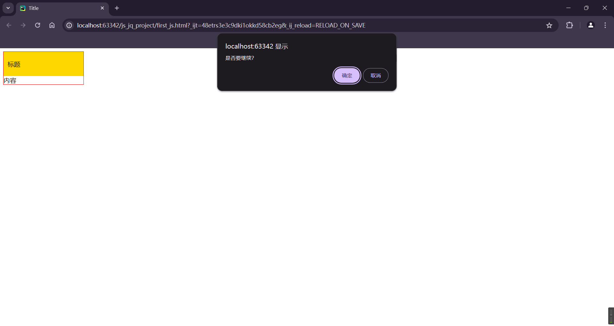

## 1.1 代码位置

只能放在两个地方:

- `head`标签里面,`CSS`样式的下面 -- 不推荐放在上面
- `body`标签**里面**的最底部 -- 推荐放下边

```html
<!DOCTYPE html>
<html lang="en">
<head>
    <meta charset="UTF-8">
    <title>Title</title>
    <style>
        /*这是CSS样式代码*/
    </style>
    <script>
        // 这里写JavaScript代码
    </script>
</head>
<body>
<h1>这是html标签</h1>
<script type="text/javascript">
    // 这里也可以写JavaScript代码
</script>
</body>
</html>
```

## 1.2 `js`代码的存在形式

可以写在当前`html`里面,也可以写在文件中导入使用.

导入的时候 -- 也放在下面位置(`body`里面的最底部)

## 1.3 注释

- `html`:
  `<!-- 这是注释 -->`

- `css`:
  `/* 这是注释 */`

- `javascript`:

  ```js
  // 这是注释
  /* 这也是注释 */
  ```

## 1.4 `JavaScript`变量

`JavaScript`是一种编程语言.

- 变量:
  ```js
  <script>
      var name = "computer";
  </script>
  ```

- 输出:
  ```js
  <script>
      var name = "computer";
  		console.log(name);
  </script>
  ```

  怎么查看输出:在浏览器,右键,检查,点击`Console`.

  ```html
  <!DOCTYPE html>
  <html lang="en">
  <head>
      <meta charset="UTF-8">
      <title>Title</title>
      <style>
          /*这是CSS样式代码*/
      </style>
      <!--    <script type="text/javascript">-->
      <!--        // 这里写JavaScript代码-->
      <!--    </script>-->
      <script src="example.js">
          // 这里写JavaScript代码
      </script>
  </head>
  <body>
  <h1 onclick="my_function()">这是html标签</h1>
  <!--<script type="text/javascript">-->
  <!--    // 这里也可以写JavaScript代码-->
  <!--</script>-->
  <!--<script src="example.js"></script>-->
  <script>
      var name = "computer";
      console.log(name);
  </script>
  </body>
  </html>
  
  ```

  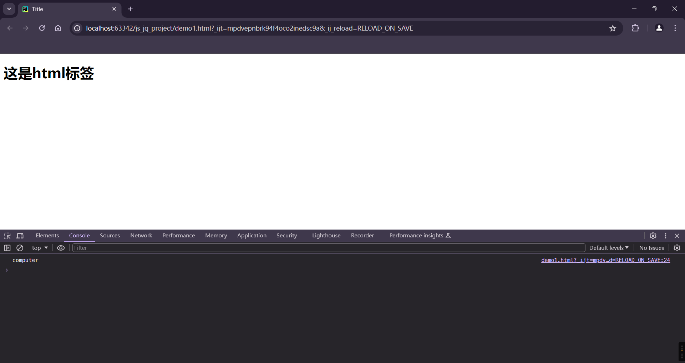

## 1.5 字符串类型

```js
// 声明
var name = "computer";
var name = String("computer");
```

```js
// 常见功能
var name = "computer science";
var v1 = name.length;
var v2 = name[1];  // var v2 = name.charAt(1); 两个效果一样
var v3 = name.trim();  // 去除空白
var v4 = name.substring(1, 2);  // 前取后不取
```

## 案例:跑马灯

```html
<!DOCTYPE html>
<html lang="en">
<head>
    <meta charset="UTF-8">
    <title>Title</title>
</head>
<body>
<span id="txt">
    欢迎来到中华人民共和国！
</span>

<script>
    function light() {
        // 去html中找到某个标签并获取内容(DOM)
        let tag_obj = document.getElementById("txt");
        let data_string = tag_obj.innerText;
        console.log(data_string);

        // 动态起来 一直把第一个字符获取到 放到最后面
        let first_char = data_string[0];
        let other_string = data_string.substring(1, data_string.length);
        let new_string = other_string + first_char

        console.log(new_string)

        // 在html标签中更新内容
        tag_obj.innerText = new_string
    }

    // js中的定时器
    setInterval(light, 1000);
</script>
</body>
</html>
```

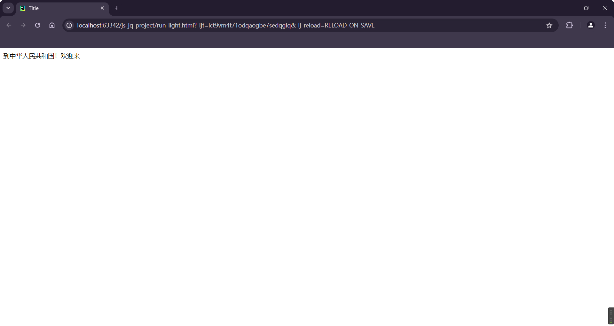

## 1.6 数组

```js
// 定义

var v1 = [11, 22, 33, 44];
var v2 = Array([11, 22, 33, 44]);
```

```js
// 操作
var v1 = [11, 22, 33, 44];

x = v1[2];
v1[0] = 10;

v1.push("999");  // 尾部追加
v1.unshift("computer");  // 头部追加
v1.splice(2, 0, 123);  // 按照索引添加 第二个参数0是固定的,就这么写就OK

v1.pop();  // 尾部删除
v1.shift();  // 头部删除
v1.splice(2, 1);  // 按照索引添加,第二个参数1是固定的
```

```js
var v1 = [11, 22, 33, 44];

for (var index in v1) {
    // index: 索引
}
```

```js
for (var i = 0; i < v1.length; i ++) {
    // i: 索引
}
```

也有`continue`和`break`关键字

## 案例:动态数据

```html
<!DOCTYPE html>
<html lang="en">
<head>
    <meta charset="UTF-8">
    <title>动态数据</title>
</head>
<body>
<ul id="city">
    <!--    <li>beijing</li>-->
    <!--    <li>shanghai</li>-->
    <!--    <li>shenzhen</li>-->

</ul>

<script type="text/javascript">
    var city_list = ["beijing", "shanghai", "shenzhen", "wuhan", "guangzhou"];
    for (var index in city_list) {
        var text = city_list[index];
        // 添加文本
        var tag_obj = document.createElement("li");

        // 在li标签中写入内容
        tag_obj.innerText = text

        // 添加到标签里面
        var parent = document.getElementById("city")

        parent.appendChild(tag_obj)
    }
</script>
</body>
</html>
```

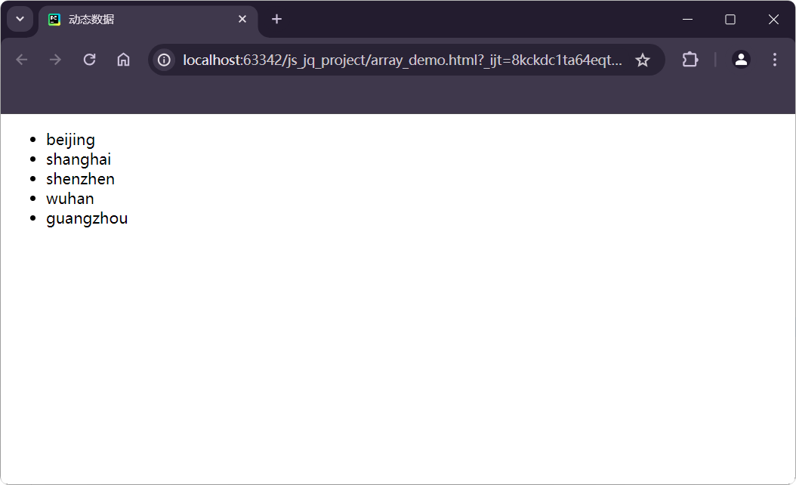

## 1.7 对象(字典)

```js
info = {
    "name": "xxx",
    "age": 18
}

info = {
    name: "xxx",
    age: 18,
}
```

```js
info.age
info.name = "yyy"

info["age"]
info["age"] = 20

delete info["age"]
```

```js
info = {
    name: "xxx",
    age: 18,
}

for (var key in info) {
    // 遍历键
}
```

## 案例:动态表格

```js
<!DOCTYPE html>
<html lang="en">
<head>
    <meta charset="UTF-8">
    <title>动态表格</title>
</head>
<body>
<table border="1">
    <thead>
    <tr>
        <th>ID</th>
        <th>name</th>
        <th>age</th>
    </tr>
    </thead>
    <tbody id="body">

    </tbody>
</table>

<script type="text/javascript">
    var data_list = [
        {id: 1, name: "xxx", age: 19,},
        {id: 2, name: "xxx", age: 19,},
        {id: 3, name: "xxx", age: 19,},
        {id: 4, name: "xxx", age: 19,},
        {id: 5, name: "xxx", age: 19,},
        {id: 6, name: "xxx", age: 19,},
    ];
    // 创建tr

    for (var idx in data_list) {
        var info = data_list[idx]
        var tr = document.createElement("tr");
        for (key in info) {
            var text = info[key];
            var td = document.createElement("td");
            td.innerText = text;
            tr.appendChild(td);
        }
        tr.appendChild(td);
        var body = document.getElementById("body");
        body.appendChild(tr);
    }

</script>
</body>
</html>
```

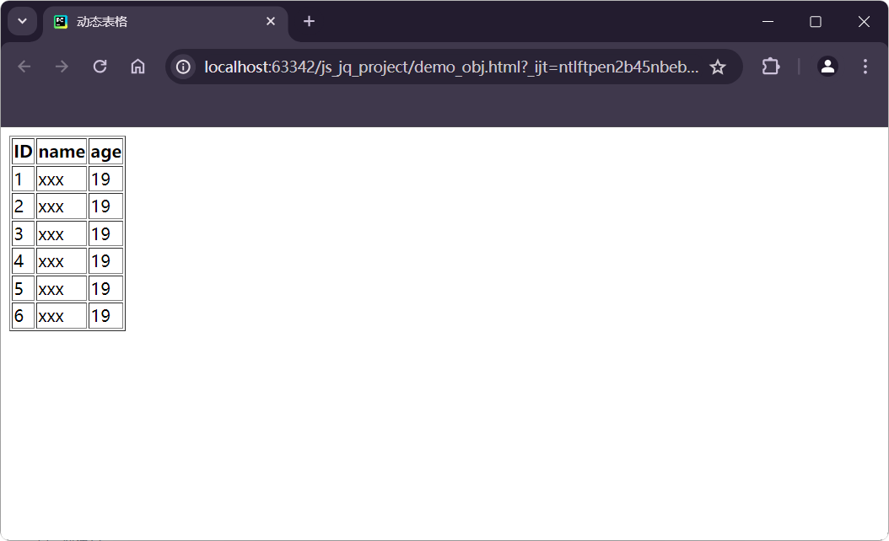


## 1.8 条件语句

```js
if (条件) {
    
}else{
    
}
```

```js
if (条件) {
    //
}else if (条件) {
    //
}else {
    //
}
```

## 1.9 函数

```js
function 函数名() {
    // 函数体
}

// 执行函数
函数名()
```

# 2 DOM

`DOM`就是一个模块,模块可以对`HTML`页面中的标签进行操作.

```js
// 根据ID获取标签
var tag = document.getElementByID("city");

// 获取标签中的文本
tag.innerText

// 设置标签中的文本
tag.innerText = "xxxxxx"
```

```js
// 创建标签
 var tag = document.createElement("city");

// 往里面写内容
tag.innerText = "哈哈哈哈哈"
```

```html
<ul id="city">
</ul>

<script type="text/javascript">
    var tag_obj = document.createElement("li");
    // 在li标签中写入内容
    tag_obj.innerText = "text"
    // 添加到标签里面
    var parent = document.getElementById("city")
    parent.appendChild(tag_obj)
</script>
```

## 2.1 事件绑定

```html
<!DOCTYPE html>
<html lang="en">
<head>
    <meta charset="UTF-8">
    <title>事件绑定</title>
</head>
<body>
<input type="button" value="点击提交" ondbclick="my_func()"/>
<ul id="city">

</ul>

<script type="text/javascript">
    var city_list = ["beijing", "shanghai", "shenzhen", "wuhan", "guangzhou"];

    function my_func() {
        for (var index in city_list) {
            var text = city_list[index];
            // 添加文本
            var tag_obj = document.createElement("li");

            // 在li标签中写入内容
            tag_obj.innerText = text

            // 添加到标签里面
            var parent = document.getElementById("city")

            parent.appendChild(tag_obj)
        }
    }
</script>
</body>
</html>
```

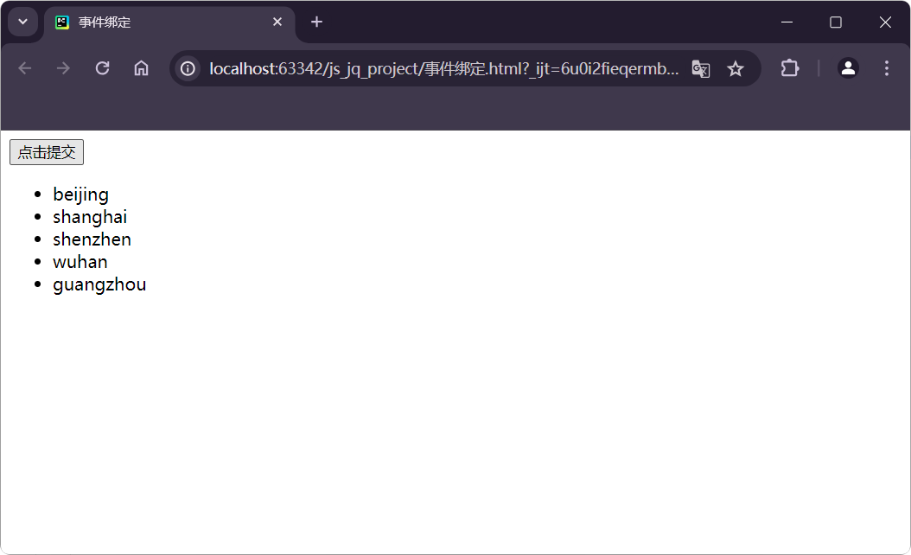

```html
<!DOCTYPE html>
<html lang="en">
<head>
    <meta charset="UTF-8">
    <title>事件绑定</title>
</head>
<body>
<input type="text" placeholder="请输入内容" id="txt"/>
<input type="button" value="点击提交" onclick="my_func()"/>
<ul id="city">

</ul>

<script type="text/javascript">
    var city_list = ["beijing", "shanghai", "shenzhen", "wuhan", "guangzhou"];

    function my_func() {
        tag = document.getElementById("txt");
        var text = tag.value

        if ((text.length > 0) && (text !== " ")) {
            // 添加文本
            var tag_obj = document.createElement("li");

            // 在li标签中写入内容
            tag_obj.innerText = text;

            // 添加到标签里面
            var parent = document.getElementById("city");

            parent.appendChild(tag_obj);
            tag.value = "";
        }else{
            alert("输入为空,请重新输入.");
        }
    }
</script>
</body>
</html>
```

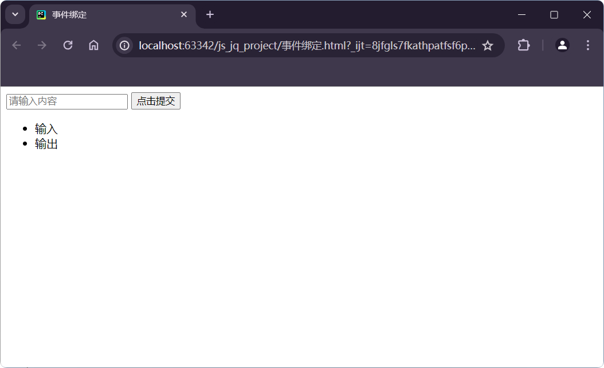


`DOM`可以实现很多操作,但是比较繁琐.所以我们用`jQuery`

# 快速回顾以前所有的知识

- 在`utf-8`编码中,中文占`3`个字节,在`GBK`编码中,中文占`2`个字节.

- `python`解释器默认会用`utf-8`编码去解释代码.

- `python`字符串格式化(三种)

  ```python
  "aaaaaaa{} {}".fromat(12, 13)
  "%s %d" % ("xxx", 18)
  
  name = "xxx"
  age = 19
  f"xx{name} {age}"
  ```

- 数据类型
  ```python
  int bool str list tuple dict set float None
  	- 转换为布尔值为False: 空值 None 0
      - 可变:字典 列表 集合
      - 不可哈希:字典 列表 集合 -- 字典的键和集合的值必须是可哈希的类型
  主要的数据类型
  	- str
      	- 独有:strip split upper lower startswith endswith join
          - 公共:len [] [::] for in
      - list
      	- 独有:append insert remove pop
          - 公共: ...
      - dict
      	- 独有: get keys values items
          - 公共: ..
  ```

- 运算符
  ```python
  + - * / ...
  1 < a < 3
  特殊的逻辑运算(整体结果取决于谁,就是谁)
  	99 and 88 --> 88
      [] or 10 --> 10
      "xxx" or [] --> "xxx"
  ```

- 推导式
  ```python
  [i for i in range(10) if i < 5]
  ```

- 函数
  ```python
  基础知识
  	- 参数 位置传参 关键字传参
      - 定义
      - 返回值 默认返回None
  进阶知识
  	- python以函数为作用域
      - 全局变量 字母全部大写
      - 局部变量 global的作用:说明局部变量是引用全局的变量 而不是在局部新建
      - 内置函数 bin hex sorted divmod max min open
      
  文件操作
  	- 打开
      - 模式 r w a rb wb ab w/wb/a/ab --> 文件不存在的时候会新建 但是所在目录不存在,都会报错
    - 关闭
  	- 使用with上下文管理
  ```

- 模块
  ```python
  分类
    - 自定义模块
    - 内置模块
  	- time json os re datetime
    - 第三方模块
      - requests openpyxl python-docx flask
      
  查看当前目录下所有的文件
  os.listdir(只获取以及目录) / os.walk(只获取所有目录)
  时间模块
      时间戳 datetime 字符串
  json模块
    - json本质上是字符串 有一些自己的格式要求 例如:没有元组 没有单引号
    - json.dumps序列化时,只能序列化python常用的数据类型
  
  re模块
    - \d
    - \w
    - re.search()
    - re.findall()
    - re.match()
    - 贪婪匹配(默认)
    - 非贪婪匹配(在个数后面加?)
  ```

- 面向对象
  ```python
  面向对象三大特性:
      - 封装
      - 继承
      - 多态
  ```

- 前端开发
  ```python
  HTML
  CSS
  JavaScript
  ```

# 3 `JQuery`

`jQuery`是一个`JavaScript`第三方模块(第三方类库)

- 基于`jQuery`,自己开发一个功能
- 现成的工具 依赖`jQuery` 例如:`bootstrap`动态效果

## 3.1 快速上手

- 下载`jQuery`
- 应用`jQuery`
  ```html
  <!DOCTYPE html>
  <html lang="en">
  <head>
      <meta charset="UTF-8">
      <title>Title</title>
  </head>
  <body>
  
  <h1 id="txt">计算机科学</h1>
  
  <script src="./static/js/jquery37/jquery-3.7.1.js"></script>
  <script>
      // 利用jQuery中的功能实现某些效果
  
      // 找到id=txt的标签 获取内容 内容修改
      $("#txt").text("计算机技术");
  </script>
  </body>
  </html>
  ```

## 3.2 寻找标签 -- 直接寻找

- `ID`

  ```html
  <div id="aaa">
      xxxxx
  </div>
  
  <div id="bbb">
      xxxx
  </div>
  
  <div id="ccc">
      xxx
  </div>
  ```

  ```js
  $("#aaa")
  $("#bbb")
  $("#ccc")
  ```

- 类(样式)
  ```html
  <div class="aaa">
      xxxxx
  </div>
  
  <div class="aaa">
      xxxx
  </div>
  
  <div class="bbb">
      xxx
  </div>
  ```

  ```js
  $(".aaa")
  $(".bbb")
  ```

- 标签
  ```html
  <h1 class="aaa">
      xxxxx
  </h1>
  
  <div class="aaa">
      xxxx
  </div>
  
  <div class="bbb">
      xxx
  </div>
  ```

  ```js
  $("h1")
  ```

- 层级
  ```html
  <div class="c1">
      <h1 class="c2">
      	<a>xxxxx</a>
  	</h1>
      xxxx
  </div>
  
  <div class="bbb">
      xxx
  </div>
  ```

  ```js
  $(".c1 .c2 a")
  ```

- 多选择器
  ```html
  <div id="c1">
      <h1 class="c3">
      	<a>xxxxx</a>
  	</h1>
      xxxx
  </div>
  
  <div id="c2">
      xxx
      <ul>
          <li>xxx</li>
          <li>xxx</li>
      </ul>
  </div>
  ```

  ```js
  $("#c3,#c2,li")
  ```

- 属性选择器
  ```html
  <input type="text" name="a1" />
  <input type="text" name="a2" />
  <input type="text" name="a3" />
  ```

  ```js
  $("input[name='a1']")
  ```

## 3.3 寻找标签 -- 间接寻找

- 找兄弟
  ```html
  <div id="c1">
      <div>a</div>
      <div id="c2">b</div>
  	<div>c</div>
      <div>d</div>
      xxxx
  </div>
  ```

  ```js
  // 上一个兄弟
  $("#c2").prev()
  
  // 下一个兄弟
  $("#c2").next()
  
  // ...
  $("#c2").next().next()
  
  // 找到所有的其他兄弟
  $("#c2").siblings()
  ```

- 找父子
  ```html
  <div id="c5">
      <div id="c1"  class="p10">
          <div>a</div>
          <div id="c2">b</div>
          <div>c</div>
          <div>d</div>
          xxxx
      </div>
      <div id="c3" class="p11">
          <div>a</div>
          <div id="c4">b</div>
          <div>c</div>
          <div>d</div>
          xxxx
      </div>
  </div>
  ```

  ```js
  $("#c2").parent()
  $("#c2").parent().parent()
  
  // 所有儿子
  $("#c2").children(".p10")
  // 所有子孙
  $("#c2").find(".p10")
  ```

案例:菜单切换

```html
<!DOCTYPE html>
<html lang="en">
<head>
    <meta charset="UTF-8">
    <title>Title</title>
    <style>
        .menus {
            height: 800px;
            width: 100px;
            border: 1px solid red;
        }

        .menus .header {
            background-color: gold;
            padding: 10px 5px;
        }

        .menus .content a {
            display: block;
            padding: 10px 5px;
            border-bottom: 1px dotted #dddddd;
        }

        .hide {
            display: none;
        }
    </style>
</head>
<body>
<div class="menus">
    <div class="item">
        <div class="header"  onclick="click_me(this)">abcdef</div>
        <div class="content hide">
            <a>aaa</a>
            <a>bbb</a>
            <a>ccc</a>
            <a>ddd</a>
            <a>eee</a>
            <a>fff</a>
        </div>
    </div>

    <div class="item">
        <div class="header" onclick="click_me(this)">qwerty</div>
        <div class="content hide">
            <a>qqq</a>
            <a>www</a>
            <a>eee</a>
            <a>rrr</a>
            <a>ttt</a>
            <a>yyy</a>
        </div>
    </div>
</div>

<script src="./static/js/jquery37/jquery-3.7.1.js"></script>
<script>
    // 利用jQuery中的功能实现某些效果

    function click_me(self) {
        // $(self) 表示当前点击的标签
        var has_class = $(self).next().hasClass("hide");
        if (has_class) {
            $(self).next().removeClass("hide");
        }else {
            $(self).next().addClass("hide");
        }

    }
</script>
</body>
</html>
```

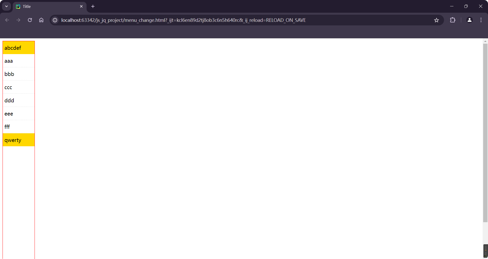

改进:

```html
<!DOCTYPE html>
<html lang="en">
<head>
    <meta charset="UTF-8">
    <title>Title</title>
    <style>
        .menus {
            height: 800px;
            width: 100px;
            border: 1px solid red;
        }

        .menus .header {
            background-color: gold;
            padding: 10px 5px;
            cursor: pointer;
        }

        .menus .content a {
            display: block;
            padding: 10px 5px;
            border-bottom: 1px dotted #dddddd;
        }

        .hide {
            display: none;
        }
    </style>
</head>
<body>
<div class="menus">
    <div class="item">
        <div class="header" onclick="click_me(this)">abcdef</div>
        <div class="content hide">
            <a>aaa</a>
            <a>bbb</a>
            <a>ccc</a>
            <a>ddd</a>
            <a>eee</a>
            <a>fff</a>
        </div>
    </div>

    <div class="item">
        <div class="header" onclick="click_me(this)">qwerty</div>
        <div class="content hide">
            <a>qqq</a>
            <a>www</a>
            <a>eee</a>
            <a>rrr</a>
            <a>ttt</a>
            <a>yyy</a>
        </div>
    </div>

    <div class="item">
        <div class="header" onclick="click_me(this)">abcdef</div>
        <div class="content hide">
            <a>aaa</a>
            <a>bbb</a>
            <a>ccc</a>
            <a>ddd</a>
            <a>eee</a>
            <a>fff</a>
        </div>
    </div>

    <div class="item">
        <div class="header" onclick="click_me(this)">qwerty</div>
        <div class="content hide">
            <a>qqq</a>
            <a>www</a>
            <a>eee</a>
            <a>rrr</a>
            <a>ttt</a>
            <a>yyy</a>
        </div>
    </div>
</div>

<script src="./static/js/jquery37/jquery-3.7.1.js"></script>
<script>
    // 利用jQuery中的功能实现某些效果

    function click_me(self) {
        // $(self) 表示当前点击的标签
        var has_class = $(self).next().hasClass("hide");
        if (has_class) {
            $(self).next().removeClass("hide");
            $(self).parent().siblings().find(".content").addClass("hide")
        } else {
            $(self).next().addClass("hide");
        }

    }
</script>
</body>
</html>
```

## 3.4 操作样式

- `addClass()`
- `removeClass()`
- `hasClass()`

## 3.5 值的操作

```html
<div id="c1">内容</div>
```

```js
$("#c1").txte()  // 获取文本内容
$("#c1").txte("需要设置的内容")  // 设置文本内容
```

-----------------------------------

```html
<input type="text" id="c2"/>
```

```js
$("#c2").val()  // 获取用户输入的值
$("#c2").val("设置的值")  // 设置值
```

案例:

```html
<!DOCTYPE html>
<html lang="en">
<head>
    <meta charset="UTF-8">
    <title>Title</title>
</head>
<body>
<input type="text" id="txtUser" placeholder="name"/>
<input type="text" id="txtEmail" placeholder="email"/>
<input type="button" value="提 交" onclick="get_info()"/>

<ul id="view">
</ul>

<script src="./static/js/jquery37/jquery-3.7.1.js"></script>
<script>
    // 利用jQuery中的功能实现某些效果

    function get_info() {
        // 获取用户输入的用户名和密码
        var name = $("#txtUser").val();
        var email = $("#txtEmail").val();

        add_str = name + "-" + email

        // 创建li标签并在里面写入内容
        var new_li = $("<li>").text(add_str)

        // 放进ul标签里面
        $("#view").append(new_li)
    }
</script>
</body>
</html>

```

## 3.6 绑定事件

```html
<ul>
    <li>百度</li>
    <li>阿里</li>
    <li>搜狗</li>
    <li>腾讯</li>
</ul>

<script src="./static/js/jquery37/jquery-3.7.1.js"></script>
<script>
    // 利用jQuery中的功能实现某些效果
    $("li").click(
        // 表示当点击这个标签时会自动执行这个函数
        my_function(){
            // $(this)  -> 表示当前你点击的哪个标签
        }
    )
</script>
```

```html
<!DOCTYPE html>
<html lang="en">
<head>
    <meta charset="UTF-8">
    <title>Title</title>
</head>
<body>
<ul>
    <li>百度</li>
    <li>阿里</li>
    <li>搜狗</li>
    <li>腾讯</li>
</ul>

<script src="./static/js/jquery37/jquery-3.7.1.js"></script>
<script>
    // 利用jQuery中的功能实现某些效果

    // 表示当点击这个标签时会自动执行这个函数
    $("li").click(function(){
        // $(this)  -> 表示当前你点击的哪个标签
        var text = $(this).text();
        console.log(text)
    },);
</script>
</body>
</html>
```

## 3.7 删除标签

```html
<div id="c1">
    巴拉巴拉
</div>
```

```javascript
$(".c1").remove()
```

```html
<!DOCTYPE html>
<html lang="en">
<head>
    <meta charset="UTF-8">
    <title>Title</title>
</head>
<body>
<ul>
    <li>百度</li>
    <li>阿里</li>
    <li>搜狗</li>
    <li>腾讯</li>
</ul>

<script src="./static/js/jquery37/jquery-3.7.1.js"></script>
<script>
    // 利用jQuery中的功能实现某些效果

    // 表示当点击这个标签时会自动执行这个函数
    $("li").click(function(){
        // $(this)  -> 表示当前你点击的哪个标签
        $(this).remove()
    },);
</script>
</body>
</html>
```

## 3.8 当页面框架加载完成之后执行的代码

```html
<!DOCTYPE html>
<html lang="en">
<head>
    <meta charset="UTF-8">
    <title>Title</title>
</head>
<body>
<ul>
    <li>百度</li>
    <li>阿里</li>
    <li>搜狗</li>
    
    <li>腾讯</li>
</ul>

<script src="./static/js/jquery37/jquery-3.7.1.js"></script>
<script>
    // 利用jQuery中的功能实现某些效果

    $(
        function () {
            // 当页面框架加载完成后,自动执行
        }
    )

    // 表示当点击这个标签时会自动执行这个函数
    $("li").click(function(){
        // $(this)  -> 表示当前你点击的哪个标签
        $(this).remove()
    },);
</script>
</body>
</html>
```

## 案例:表格操作

```html
<!DOCTYPE html>
<html lang="en">
<head>
    <meta charset="UTF-8">
    <title>Title</title>
</head>
<body>
<table border="1" style="border: 1px solid black;">
    <thead>
    <tr>
        <th>ID</th>
        <th>name</th>
        <th>email</th>
        <th>操作</th>
    </tr>
    </thead>

    <tbody>
    <tr>
        <td>1</td>
        <td>xxx</td>
        <td>xxx@123</td>
        <td><input type="button" value="delete" class="delete"/></td>
    </tr>

    <tr>
        <td>2</td>
        <td>xxx</td>
        <td>xxx@123</td>
        <td><input type="button" value="delete" class="delete"/></td>
    </tr>

    <tr>
        <td>3</td>
        <td>xxx</td>
        <td>xxx@123</td>
        <td><input type="button" value="delete" class="delete"/></td>
    </tr>

    <tr>
        <td>4</td>
        <td>xxx</td>
        <td>xxx@123</td>
        <td><input type="button" value="delete" class="delete"/></td>
    </tr>
    </tbody>
</table>

<script src="./static/js/jquery37/jquery-3.7.1.js"></script>
<script>
    // 利用jQuery中的功能实现某些效果

    $(
        function () {
            // 当页面框架加载完成后,自动执行
            $(".delete").click(
                function () {
                    // 删除当前行的数据
                    $(this).parent().parent().remove();
                }
            )
        }
    )
</script>
</body>
</html>
```

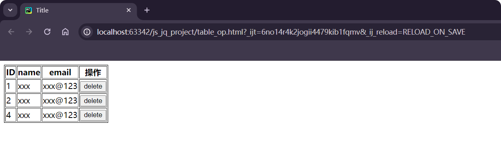

# 案例:前端整合

- `html`
- `CSS`
- `JavaScript`,`jQuery`

- `BootStrap`(动态效果依赖`jQuery`)

```html
<!DOCTYPE html>
<html lang="en">
<head>
    <meta charset="UTF-8">
    <title>整合</title>
    <link rel="stylesheet" href="./static/plugins/bootstrap-3.4.1/css/bootstrap.css"/>
    <link rel="stylesheet" href="./static/plugins/font-awesome-4.7.0/font-awesome-4.7.0/css/font-awesome.css">

    <style>
        body {
            margin: 0;
        }

        .navbar {
            border-radius: 0;
        }

        .lunbo-img {
            width: 1920px;
            height: 1080px;
        }
    </style>
</head>
<body>

<div class="navbar navbar-inverse">
    <div class="container-fluid">
        <!-- Brand and toggle get grouped for better mobile display -->
        <div class="navbar-header">
            <button type="button" class="navbar-toggle collapsed" data-toggle="collapse" data-target="#bs-example-navbar-collapse-1" aria-expanded="false">
                <span class="sr-only">???</span>
                <span class="icon-bar">logo</span>
                <span class="icon-bar"></span>
                <span class="icon-bar"></span>
            </button>
            <a class="navbar-brand" href="#">
                
            </a>
        </div>

        <!-- Collect the nav links, forms, and other content for toggling -->
        <div class="collapse navbar-collapse" id="bs-example-navbar-collapse-1">
            <ul class="nav navbar-nav">
                <li class="active"><a href="#">Home <span class="sr-only">(current)</span></a></li>
                <li><a href="#">Link1</a></li>
                <li><a href="#">Link2</a></li>
                <li class="dropdown">
                    <a href="#" class="dropdown-toggle" data-toggle="dropdown" role="button" aria-haspopup="true" aria-expanded="false">Dropdown <span class="caret"></span></a>
                    <ul class="dropdown-menu">
                        <li><a href="#">Action</a></li>
                        <li><a href="#">Another action</a></li>
                        <li><a href="#">Something else here</a></li>
                        <li role="separator" class="divider"></li>
                        <li><a href="#">Separated link</a></li>
                        <li role="separator" class="divider"></li>
                        <li><a href="#">One more separated link</a></li>
                    </ul>
                </li>
            </ul>
            <form class="navbar-form navbar-left">
                <div class="form-group">
                    <label>
                        <input type="text" class="form-control" placeholder="Search">
                    </label>
                </div>
                <button type="submit" class="btn btn-default">Submit</button>
            </form>
            <ul class="nav navbar-nav navbar-right">
                <li><a href="#">登录</a></li>
                <li><a href="#">注册</a></li>
                <li class="dropdown">
                    <a href="#" class="dropdown-toggle" data-toggle="dropdown" role="button" aria-haspopup="true" aria-expanded="false"> wephiles <span class="caret"></span></a>
                    <ul class="dropdown-menu">
                        <li><a href="#">
                            <i class="fa fa-user-circle-o" aria-hidden="true" style="margin-right: 5px;"></i>
                            个人信息
                        </a></li>
                        <li><a href="#">
                            <i class="fa fa-cog" aria-hidden="true" style="margin-right: 5px;"></i>
                            系统设置
                        </a></li>
                        <li><a href="#">
                            <i class="fa fa-edit" aria-hidden="true" style="margin-right: 5px;"></i>
                            更多信息
                        </a></li>
                        <li role=" separator" class="divider"></li>
                        <li><a href="#">
                            <i class="fa fa-times" aria-hidden="true" style="margin-right: 5px;"></i>
                            退出登录
                        </a></li>
                    </ul>
                </li>
            </ul>
        </div><!-- /.navbar-collapse -->
    </div><!-- /.container-fluid -->
</div>

<div class="container">
    <div>
        <!-- Button trigger modal -->
        <button type="button" class="btn btn-primary btn-xs" data-toggle="modal" data-target="#myModal">
            提 交
        </button>

        <!-- Modal -->
        <div class="modal fade" id="myModal" tabindex="-1" role="dialog" aria-labelledby="myModalLabel">
            <div class="modal-dialog" role="document">
                <div class="modal-content">
                    <div class="modal-header">
                        <button type="button" class="close" data-dismiss="modal" aria-label="Close"><span aria-hidden="true">&times;</span></button>
                        <h4 class="modal-title" id="myModalLabel">注意</h4>
                    </div>
                    <div class="modal-body">
                        这是提示信息...
                    </div>
                    <div class="modal-footer">
                        <button type="button" class="btn btn-default" data-dismiss="modal">取消</button>
                        <button type="button" class="btn btn-primary">确认</button>
                    </div>
                </div>
            </div>
        </div>
    </div>

    <div style="margin-top: 10px;">
        <div class="bs-example-tooltips">
            <button type="button" class="btn btn-default" data-toggle="tooltip" data-placement="left" title="" data-original-title="Tooltip on left">Tooltip on left</button>
            <button type="button" class="btn btn-default" data-toggle="tooltip" data-placement="top" title="" data-original-title="Tooltip on top">Tooltip on top</button>
            <button type="button" class="btn btn-default" data-toggle="tooltip" data-placement="bottom" title="" data-original-title="Tooltip on bottom">Tooltip on bottom</button>
            <button type="button" class="btn btn-default" data-toggle="tooltip" data-placement="right" title="" data-original-title="Tooltip on right">Tooltip on right</button>
        </div>
    </div>

    <div style="margin-top: 10px;">
        <button type="button" class="btn btn-default" data-container="body" data-toggle="popover" data-placement="left" data-content="Vivamus sagittis lacus vel augue laoreet rutrum faucibus.">
            Popover on 左侧
        </button>

        <button type="button" class="btn btn-default" data-container="body" data-toggle="popover" data-placement="top" data-content="Vivamus sagittis lacus vel augue laoreet rutrum faucibus.">
            Popover on 顶部
        </button>

        <button type="button" class="btn btn-default" data-container="body" data-toggle="popover" data-placement="bottom" data-content="Vivamus
sagittis lacus vel augue laoreet rutrum faucibus.">
            Popover on 底部
        </button>

        <button type="button" class="btn btn-default" data-container="body" data-toggle="popover" data-placement="right" data-content="Vivamus sagittis lacus vel augue laoreet rutrum faucibus.">
            Popover on 右侧
        </button>
    </div>

    <div style="margin-top: 10px;">
        <div id="carousel-example-generic" class="carousel slide" data-ride="carousel">
            <!-- Indicators -->
            <ol class="carousel-indicators">
                <li data-target="#carousel-example-generic" data-slide-to="0" class="active"></li>
                <li data-target="#carousel-example-generic" data-slide-to="1"></li>
                <li data-target="#carousel-example-generic" data-slide-to="2"></li>
                <li data-target="#carousel-example-generic" data-slide-to="3"></li>
            </ol>

            <!-- Wrapper for slides -->
            <div class="carousel-inner" role="listbox">
                <div class="item active">
                    
                    <div class="carousel-caption">
                        a
                    </div>
                </div>
                <div class="item">
                    
                    <div class="carousel-caption">
                        b
                    </div>
                </div>
                <div class="item">
                    
                    <div class="carousel-caption">
                        c
                    </div>
                </div>
                <div class="item">
                    
                    <div class="carousel-caption">
                        d
                    </div>
                </div>
            </div>

            <!-- Controls -->
            <a class="left carousel-control" href="#carousel-example-generic" role="button" data-slide="prev">
                <span class="glyphicon glyphicon-chevron-left" aria-hidden="true"></span>
                <span class="sr-only">Previous</span>
            </a>
            <a class="right carousel-control" href="#carousel-example-generic" role="button" data-slide="next">
                <span class="glyphicon glyphicon-chevron-right" aria-hidden="true"></span>
                <span class="sr-only">Next</span>
            </a>
        </div>
    </div>

    <div style="height: 1000px; width: 200px;"></div>
</div>

<script src="./static/js/jquery37/jquery-3.7.1.js"></script>
<script src="./static/plugins/bootstrap-3.4.1/js/bootstrap.js"></script>
<script>
    $(function () {
        $('[data-toggle="tooltip"]').tooltip()
    })


    $(function () {
        $('[data-toggle="popover"]').popover()
    })
    $('#example').popover(options)
</script>
</body>
</html>

```

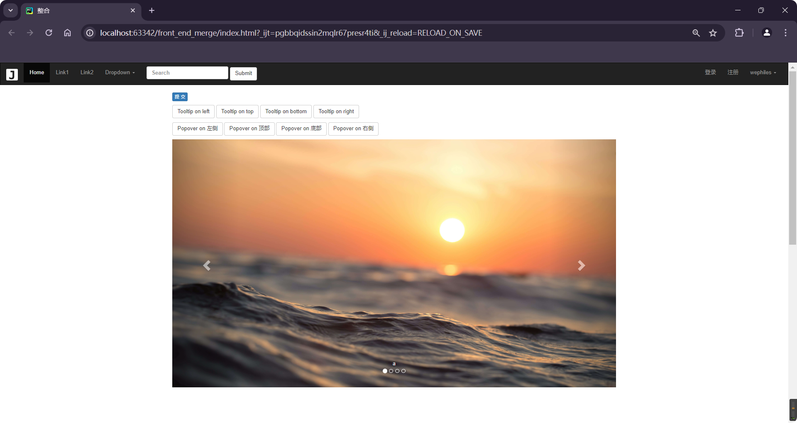

# 案例:添加页面

> 人员信息录入功能 需要提供用户信息
>
> - 用户名 年龄 薪资 部门 入职时间(`*`)
> - 时间:使用插件,不能输入.`datetimepicker`
> - 去`https://www.bootcss.com/p/bootstrap-datetimepicker/index.htm`查看信息并且下载插件`bootstrap-datetimepicker`
> - 也可以参考一下`datepicker` :  `https://bootstrap-datepicker.readthedocs.io/en/latest/keyboard.html`
> - 使用方式参考`https://blog.csdn.net/qq_28633249/article/details/77142352`

```html
<!DOCTYPE html>
<html lang="en">
<head>
    <meta charset="UTF-8">
    <title>添加页面</title>
    <link rel="stylesheet" href="./static/plugins/bootstrap-3.4.1/css/bootstrap.css"/>
    <link rel="stylesheet" href="./static/plugins/font-awesome-4.7.0/font-awesome-4.7.0/css/font-awesome.css">
    <link rel="stylesheet" href="./static/plugins/bootstrap-datetimepicker-master/css/bootstrap-datetimepicker.css">
</head>
<body>

<div class="container" style="margin-top: 10px;">
    <form class="form-horizontal">
        <div class="row clearfix">
            <div class="form-group col-xs-6">
                <label class="col-sm-2 control-label">姓名</label>
                <div class="col-sm-10">
                    <input type="email" class="form-control" placeholder="输入姓名">
                </div>
            </div>
            <div class="form-group col-xs-6">
                <label class="col-sm-2 control-label">密码</label>
                <div class="col-sm-10">
                    <input type="password" class="form-control" placeholder="输入密码">
                </div>
            </div>
        </div>

        <div class="row clearfix">
            <div class="form-group col-xs-6">
                <label class="col-sm-2 control-label">部门</label>
                <div class="col-sm-10">
                    <select class="form-control">
                        <option>研发部</option>
                        <option>产品部</option>
                        <option>法务部</option>
                        <option>人事部</option>
                    </select>
                </div>
            </div>
            <div class="form-group col-xs-6">
                <label class="col-sm-2 control-label">薪资</label>
                <div class="col-sm-10">
                    <input type="password" class="form-control" placeholder="输入薪资">
                </div>
            </div>
        </div>

        <div class="row clearfix">
            <div class="form-group col-xs-6">
                <label class="col-sm-2 control-label">入职日期</label>
                <div class="col-sm-10">
<!--                    <input type="text" value="2012-06-15 14:45" readonly class="form_datetime form-control"  placeholder="入职日期">-->
                    <input type="text" class="dt form-control" placeholder="入职日期">
                </div>

            </div>
            <div class="form-group col-xs-6">
                <div class="col-sm-offset-2 col-sm-10">
                    <div class="checkbox">
                        <label>
                            <input type="checkbox"> 记住用户名和密码
                        </label>
                    </div>
                </div>
            </div>
        </div>
        <div class="row clearfix">
            <div class="form-group col-xs-6">
                <div class="col-sm-offset-2 col-sm-10">
                    <button type="submit" class="btn btn-primary">提 交</button>
                </div>
            </div>
        </div>
    </form>
</div>

<script src="./static/js/jquery37/jquery-3.7.1.js"></script>
<script src="./static/plugins/bootstrap-3.4.1/js/bootstrap.js"></script>
<script src="./static/plugins/bootstrap-datetimepicker-master/js/bootstrap-datetimepicker.js"></script>
<script src="./static/plugins/bootstrap-datetimepicker-master/js/locales/bootstrap-datetimepicker.zh-CN.js"></script>

<script>
    $(function () {
        $(".dt").datetimepicker(
            {
                format: 'yyyy-mm-dd',
                startDate: 0,
                autoClose: true,
                language: "zh-CN",
            });
    })

</script>
</body>
</html>

```

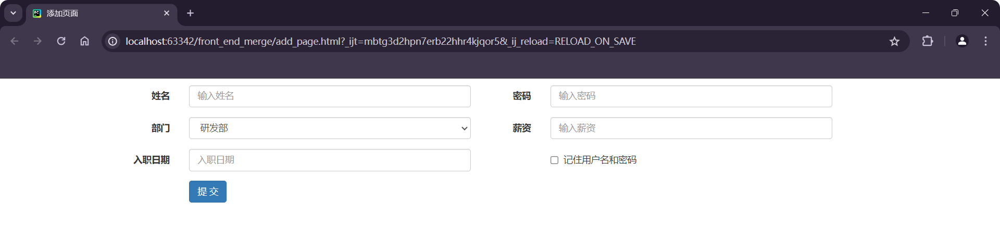


