<h1 style="text-align: center;font-size: 40px; font-family: '楷体';">MySQL数据库 - day14</h1>

[TOC]

今日概要

- 初始网站

- `MySQL`安装 & 配置
- `MySQL`启动 & 关闭
- 指令
- `python`第三方模块发送指令并获取`MySQL`返回的结果

# 1 初识网站

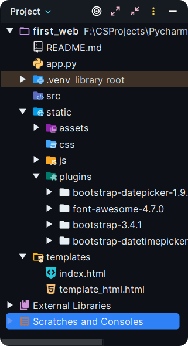

```python
# app.py

from flask import Flask, render_template

app = Flask(__name__)


@app.route("/show")
def index():
    return render_template("index.html", title="Hello World")


if __name__ == '__main__':
    app.run()

# --END--

```

```html
<!-- index.html -->

<!DOCTYPE html>
<html lang="en">
<head>
    <meta charset="UTF-8">
    <title>你是遥遥的路，山野大雾里的灯。</title>
    <link rel="stylesheet" href="./static/plugins/bootstrap-3.4.1/css/bootstrap.css"/>
    <link rel="stylesheet" href="./static/plugins/font-awesome-4.7.0/font-awesome-4.7.0/css/font-awesome.css">
    <link rel="stylesheet" href="./static/plugins/bootstrap-datetimepicker-master/css/bootstrap-datetimepicker.css">
</head>
<body>

<div class="navbar navbar-default">
    <div class="container">
        <!-- Brand and toggle get grouped for better mobile display -->
        <div class="navbar-header">
            <button type="button" class="navbar-toggle collapsed" data-toggle="collapse" data-target="#bs-example-navbar-collapse-1" aria-expanded="false">
                <span class="sr-only">Toggle navigation</span>
                <span class="icon-bar"></span>
                <span class="icon-bar"></span>
                <span class="icon-bar"></span>
            </button>
            <a class="navbar-brand" href="#">Brand</a>
        </div>

        <!-- Collect the nav links, forms, and other content for toggling -->
        <div class="collapse navbar-collapse" id="bs-example-navbar-collapse-1">
            <ul class="nav navbar-nav">
                <li class="active"><a href="#">Link <span class="sr-only">(current)</span></a></li>
                <li><a href="#">Link</a></li>
                <li class="dropdown">
                    <a href="#" class="dropdown-toggle" data-toggle="dropdown" role="button" aria-haspopup="true" aria-expanded="false">Dropdown <span class="caret"></span></a>
                    <ul class="dropdown-menu">
                        <li><a href="#">Action</a></li>
                        <li><a href="#">Another action</a></li>
                        <li><a href="#">Something else here</a></li>
                        <li role="separator" class="divider"></li>
                        <li><a href="#">Separated link</a></li>
                        <li role="separator" class="divider"></li>
                        <li><a href="#">One more separated link</a></li>
                    </ul>
                </li>
            </ul>
            <form class="navbar-form navbar-left">
                <div class="form-group">
                    <input type="text" class="form-control" placeholder="Search">
                </div>
                <button type="submit" class="btn btn-default">Submit</button>
            </form>
            <ul class="nav navbar-nav navbar-right">
                <li><a href="#">Link</a></li>
                <li class="dropdown">
                    <a href="#" class="dropdown-toggle" data-toggle="dropdown" role="button" aria-haspopup="true" aria-expanded="false">Dropdown <span class="caret"></span></a>
                    <ul class="dropdown-menu">
                        <li><a href="#">Action</a></li>
                        <li><a href="#">Another action</a></li>
                        <li><a href="#">Something else here</a></li>
                        <li role="separator" class="divider"></li>
                        <li><a href="#">Separated link</a></li>
                    </ul>
                </li>
            </ul>
        </div><!-- /.navbar-collapse -->
    </div><!-- /.container-fluid -->
</div>

<div class="container">
    <table class="table">
        <caption>Optional table caption.</caption>
        <thead>
        <tr>
            <th>#</th>
            <th>First Name</th>
            <th>Last Name</th>
            <th>Username</th>
        </tr>
        </thead>
        <tbody>
        <tr>
            <th scope="row">1</th>
            <td>Mark</td>
            <td>Otto</td>
            <td>@mdo</td>
        </tr>
        <tr>
            <th scope="row">2</th>
            <td>Jacob</td>
            <td>Thornton</td>
            <td>@fat</td>
        </tr>
        <tr>
            <th scope="row">3</th>
            <td>Larry</td>
            <td>the Bird</td>
            <td>@twitter</td>
        </tr>
        </tbody>
    </table>
</div>

<!--<h1>这是 /show， index.html </h1>-->
<!--<h1>用户列表</h1>-->

<script src="./static/js/jquery37/jquery-3.7.1.js"></script>
<script src="./static/plugins/bootstrap-3.4.1/js/bootstrap.js"></script>
<script src="./static/plugins/bootstrap-datetimepicker-master/js/bootstrap-datetimepicker.js"></script>
<script src="./static/plugins/bootstrap-datetimepicker-master/js/locales/bootstrap-datetimepicker.zh-CN.js"></script>
<script>
    /// ...
</script>
</body>
</html>
```

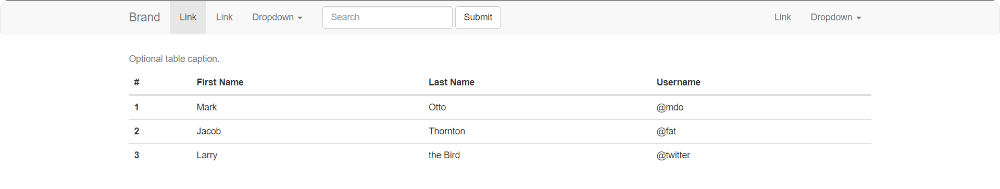

- 默认编写的是静态的效果
- 动态页面 -- 需要用到`web`框架的功能

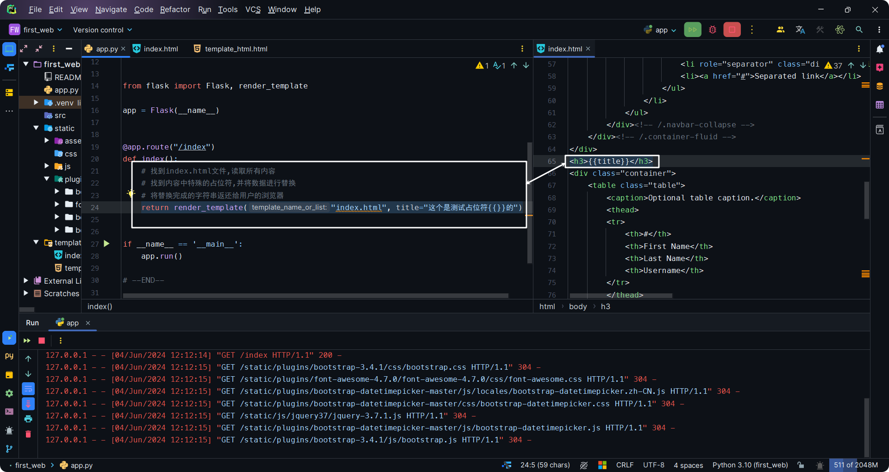

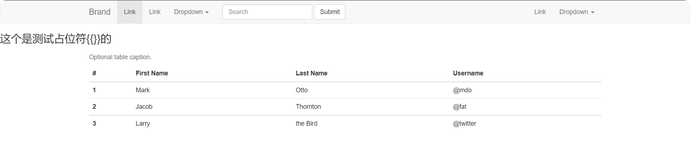

上面展示了占位符`{{...}}`的用法.

还可以进行循环:

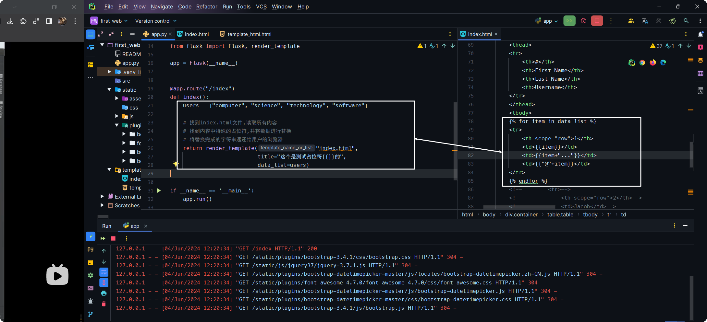

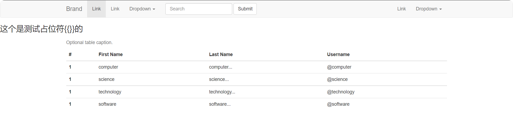

网站开发中数据流向 -->

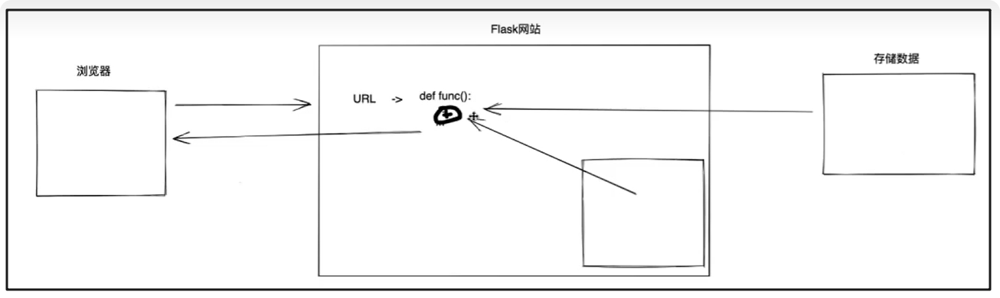

对于目前我们来看,什么可以做数据的存储.

- `txt`文件 -- 操作繁琐 性能不高

- `excel`文件 -- 操作繁琐 性能不高

- 专业软件 -- 数据库(管理系统)

  ```python
  MySQL(*免费)
  Oracle/SQLServer/DB2/Access
  ```

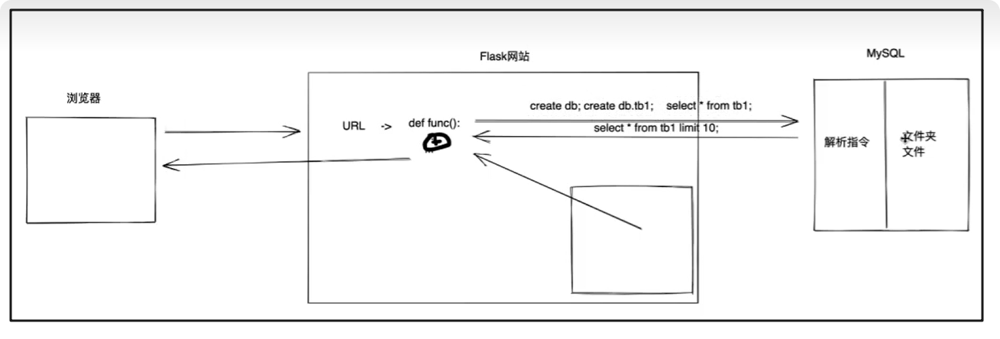

# 2 安装MySQL -- 看教程就行

> 安装`MySQL8.0`版本教程 -- 参考https://blog.csdn.net/weixin_39289696/article/details/128850498

# 3 启动`MySQL`

两种方式:

- 临时启动

  ```cmd
  >>> ...\bin\mysqld.exe
  ```

- 长期启动 -- 制作服务 -- 这个是根据武沛齐老师的视频教程进行对`MySQL5.7`版本进行制作服务的教程,不一定能用于`MySQL8.0`.

  ```cmd
  >>> ...\bin\mysqld.exe --install mysql...(后面这个mysql...是个名字,自己随便取,但是尽量以mysql开头方便寻找)
  ```

  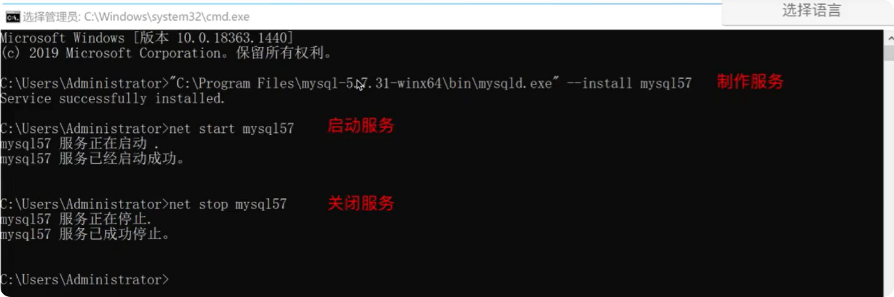

我的电脑里面的MySQL服务名字为:`mysql84`

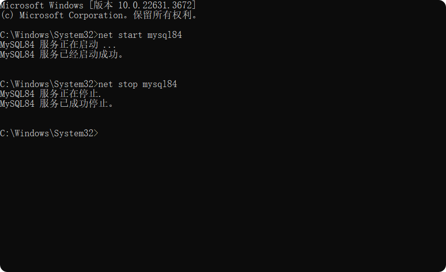

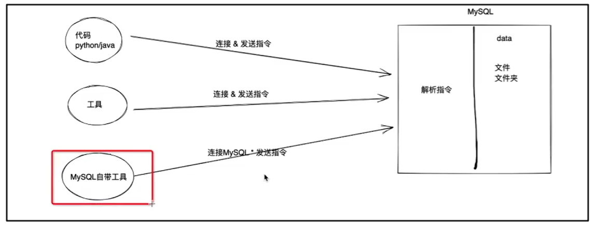

# 4 连接测试

```cmd
>>> ...bin\mysql.exe -h 127.0.0.1 -u root -P 3306 -p
```

或者把`...\bin`目录加入环境变量,可以直接这么运行:

```cmd
>>> mysql -u root -p
```

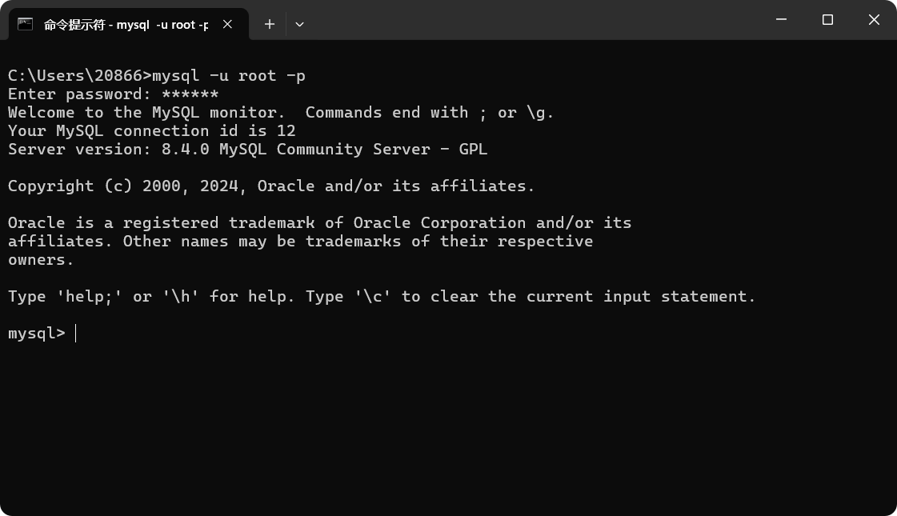

## 4.1 首次登录设置密码

```cmd
mysql> set password=password("写你的密码"); -- 这个在我的电脑上貌似没用
```

## 4.2 查看现在已有的文件夹(数据库)

```cmd
mysql> show databases;
```

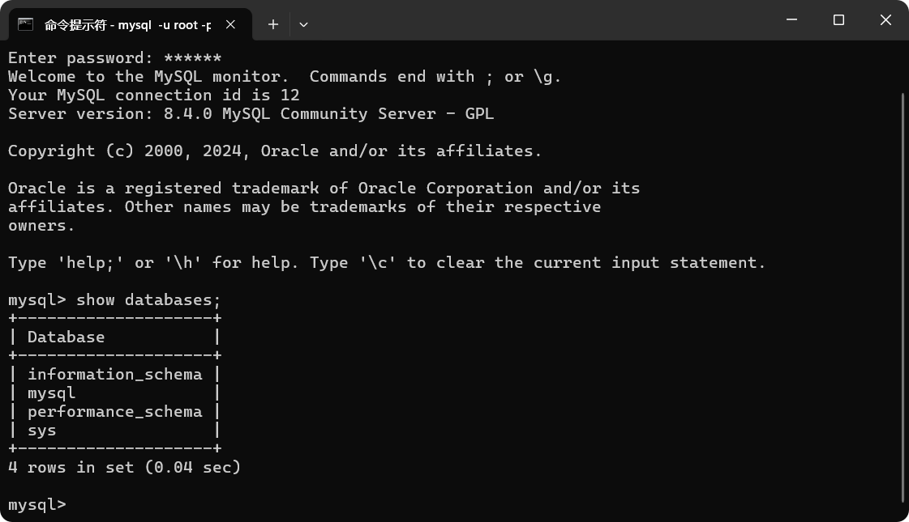

## 4.3 退出登录(关闭连接)

```cmd
mysql> exit
```

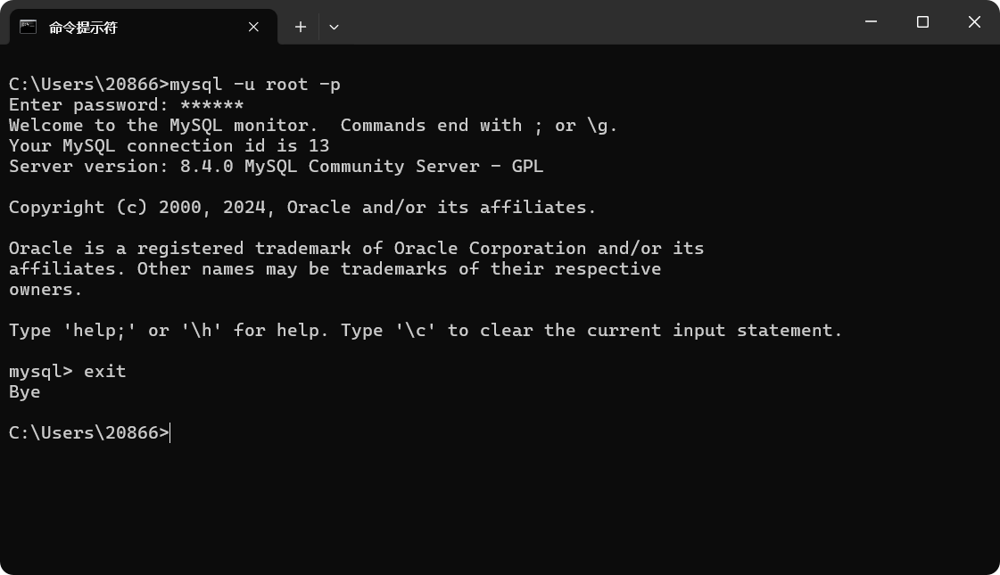

## 4.4 再次连接

需要提供密码了.

```cmd
>>> mysql -u root -p
```

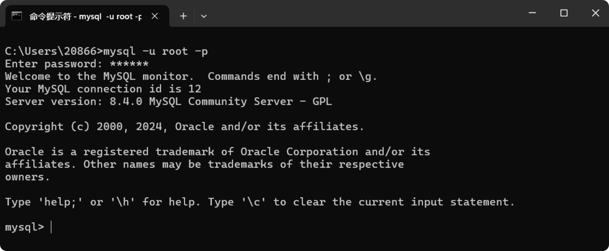

# 5 忘记密码 

```cmd
默认情况下,启动MySQL时,需要用户输入账户名/密码
修改MySQL配置,重新启动mysql(无账号模式)
	mysql -u root -p
	重新设置密码
	退出
在重新修改MySQL配置文件 重新启动MySQL(需要账户的模式)
	mysql -u root -p
	新密码
```

这一步具体操作省略,可以参照网络上的教程.

# 6 `MySQL`指令


在`MySQL`和我们平时的认知不同的概念:

| `MySQL` | 认知              |
| ------- | ----------------- |
| 数据库  | 文件夹            |
| 数据表  | 文件(`excel`文件) |

## 6.1 数据库管理(文件夹)

- 查看已有的数据库表

  ```sql
  >>> show databases;
  ```

  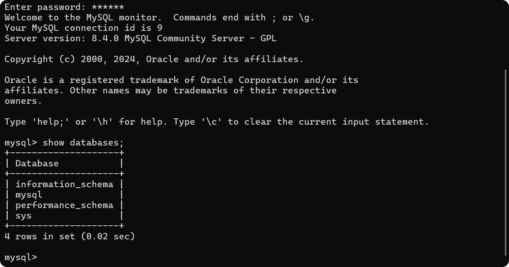

- 创建数据库

  ```sql
  create database 数据库名字;
  create database 数据库名字 default charset utf8 collate utf8_general_ci;
  ```

  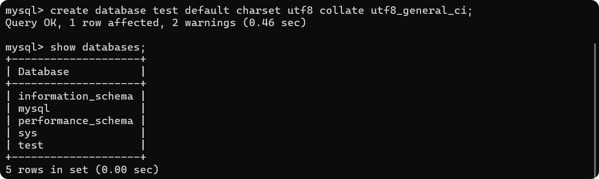

- 删除数据库

  ```sql
  drop database test;
  ```

- 进入数据库

  ```sql
  use 数据库名;
  ```

- 查看所进入数据库下面的所有数据表

  ```sql
  show tables;
  ```

## 6.2 数据表管理(文件)

- 进入数据库

  ```sql
  use 数据库名;
  ```

- 查看当前数据库下面的所有表

  ```sql
  show tables;
  ```

- 创建数据表

  ```sql
  create table 表名称(
  	  列名称 类型,
      列名称 类型,
      列名称 类型,
  ) default charset=utf8;
  ```

  ```sql
  create table test_table_1(
      id int,
      name varchar(16),
      age int
  ) default charset=utf8;
  ```

  效果:

  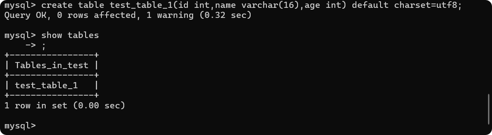

  ```sql
  create table tb1(
      id int,
      name varchar(16),
      age int
  ) default charset=utf8;
  ...
  ```

  ```sql
  create table tb1(
      id int,
      name varchar(16) not null, -- 不允许为空
      age int null  -- 允许为空
  ) default charset=utf8;
  ```

  ```sql
  create table tb1(
      id int,
      name varchar(16) not null,
      age int default 3  -- 插入数据时,如果没传值,默认值为3
  ) default charset=utf8;
  ```

  主键一般用于表示当前行的编号，不能重复

  一般情况下，我们常见表时会这么写：

  ```sql
  create table tb1(
      id int not null auto_increment primary key,
      name varchar(16),
      age int
  ) default charset=utf8;
  ```

- 删除表

  ```sql
  drop table 表名;
  ```

- 展示表的详细信息

  ```sql
  desc 表名称;
  ```

  ```sql
  +-------+-------------+------+-----+---------+----------------+
  | Field | Type        | Null | Key | Default | Extra          |
  +-------+-------------+------+-----+---------+----------------+
  | id    | int         | NO   | PRI | NULL    | auto_increment |
  | name  | varchar(16) | YES  |     | NULL    |                |
  | age   | int         | YES  |     | NULL    |                |
  +-------+-------------+------+-----+---------+----------------+
  ```

  

  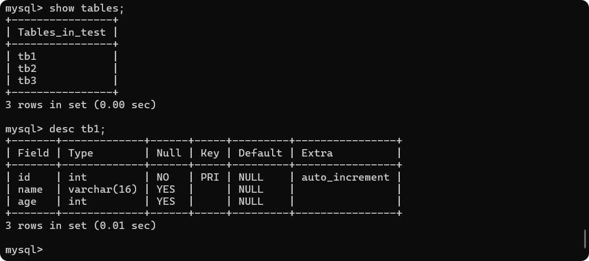

## 6.3 常用数据类型

- `tinyint`

  ```sql
  有符号 -128 ~ 127 [默认]
  无符号 0 ~ 255
  ```

  ```sql
  create table tb4(
      id int not null auto_increment primary key,
      age tinyint unsigned
  ) default charset=utf8;
  ```

- `int`

  ```sql
  有符号 -2147483648 ~ 2147483647 [默认]
  无符号 0 ~ 4294967295
  ```

- `bigint`

  ```sql
  有符号 -9223372036854775808 ~ 9223372036854775807 [默认]
  无符号 0 ~ 18446744073709551615
  ```

  练习题:

  ```sql
  # 创建表
  create table tb2(
      id bigint not null auto_increment primary key,
      salary int,
      age tinyint
  ) default charset=utf8;
  
  # 插入数据
  insert into tb2 (salary,age) values(10000, 18);
  insert into tb2 (salary,age) values(20000, 19);
  
  # 批量插入
  insert into tb2 (salary,age) values(30000, 38),(45000, 48),(56000, 28);
  
  # 查看表中数据
  select * from tb2;
  ```

- `float`

- `double`

- `decimal`

  ```sql
  准确的小数值,m是数字总个数(负号不算),d是小数点后位数,m最大值为65,d最大值为30
  
  例如:
  create table tb3(
      id bigint not null auto_increment primary key,
      salary decimal(8, 2)
  ) default charset=utf8;
  
  insert into tb3 (salary) values(1.28), (2.369), (4.265);
  ```

- `char` -- 查询速度快

  ```sql
  # 定长字符串 即使没有存够11个字符,也还是会存11个字符
  
  create table tb4(
      id bigint not null auto_increment primary key,
      mobile char(11)
  ) default charset=utf8;
  
  insert into tb4(mobile) values("151"), ("18811112222");
  ```

- `varchar` 节省空间

  ```sql
  # 变长字符串 真实数据有多长,就存多长
  create table tb5(
      id bigint not null auto_increment primary key,
      mobile varchar(11)
  ) default charset=utf8;
  
  insert into tb4(mobile) values("151"), ("18811112222");
  ```

- `text`

  ```sql
  # 可容纳65535个字符
  # 一般存储文章或者新闻
  ```

- `mediumtext`

  ```sql
  # 16 777 215个字符
  ```

- `longtext`

  ```sql
  # 4 294 967 295/4GB
  ```

- `datetime`

  ```sql
  YYYY-MM-DD HH:MM:SS (1000-01-01 00:00:00 / 9999-12-31 23:56:59)
  ```

- `date`

  ```sql
  YYYY-MM-DD (1000-01-01 / 9999-12-31)
  ```

  练习题:用户表

  ```sql
  create table user_info(
      id int not null auto_increment primary key,
      name varchar(64) not null,
      mobile varchar(11),
      password char(64) not null,
      age tinyint,
      salary decimal(10, 2),
      ctime datetime 
      
  ) default charset=utf8;
  
  insert into user_info(name,mobile,password,age,salary,ctime) 
  values("computer", "18811112222", "123456", 18, 10000.256, "2012-12-02 12:40:45"), 
  	("science", "18844445555", "654321", 23, 1000000.356, "2002-10-02 12:20:35");
  ```

  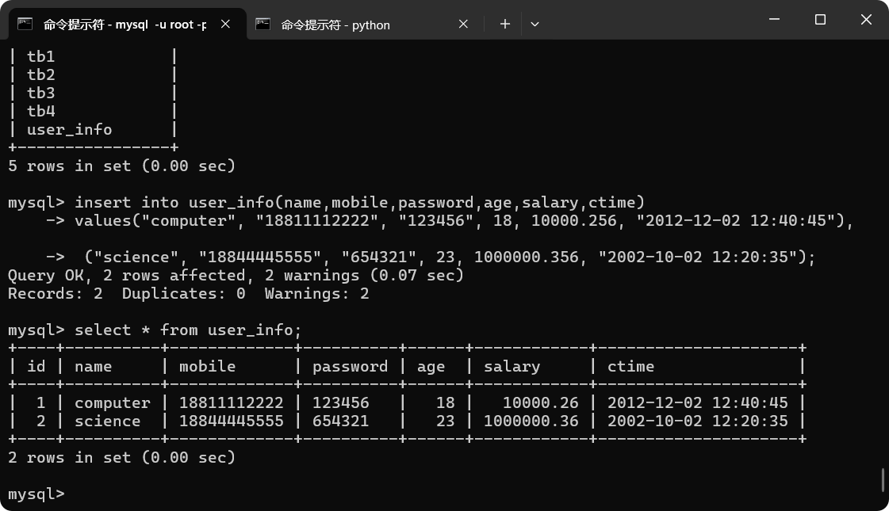

我们平时在开发系统 的时候,一般情况下:

- 创建数据库
- 创建数据表

需要提前通过上述命令创建

## 6.4 数据行操作(数据的增删改查)

### 6.4.1 新增数据

```sql
insert into 表名 (列名1, 列名2, ...) values(值1, 值2, ...), (值a, 值b, ...);

insert into user_info(name,mobile,password,age,salary,ctime) 
values("techoology", "18866662222", "987654", 30, 100000.256, "2018-12-02 12:40:45"), 
	("software", "18833335555", "456789", 21, 1000000.356, "2002-10-02 12:20:35");
```

### 6.4.2 删除数据

```sql
delete from 表名;
delete from 表名 where 条件;
```

```sql
delete from user_info where id = 8;
delete from user_info where id in (1, 5);
```

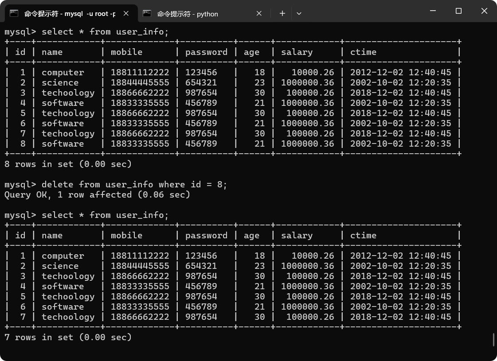

### 6.4.3 修改数据

```sql
update 表名 
set 列=值;

update 表名 
set 列=值, 列=值, 列=值;

update 表名 
set 列=值
where 条件;

update 表名 
set 列=值+10
where 条件;
```

```sql
update user_info
set age=40,name="python"
where id=5;
```

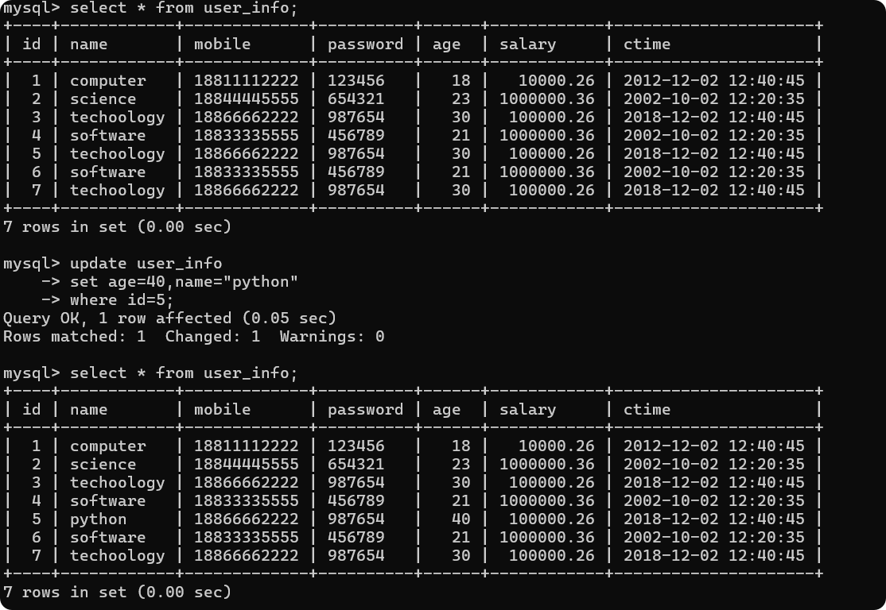

### 6.4.4 查询数据

```sql
select * from 表名;

select 列名称,列名称,列名称,... 
from 表名
where 条件;
```

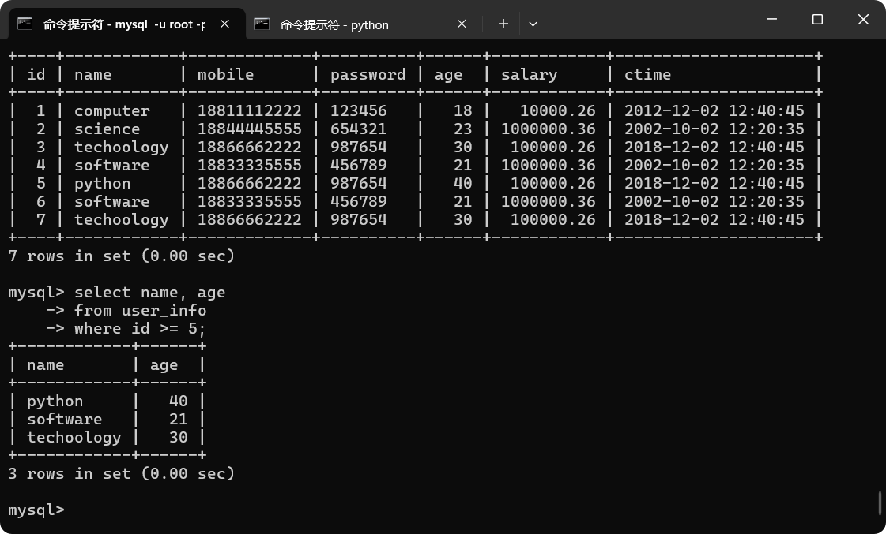

# 7 案例:员工管理

- 使用MySQL内部的工具,

  - 创建数据库`unicom`

    ```sql
    create database unicom default charset utf8 collate utf8_general_ci;
    ```

  - 创建数据表 `admin`

    ```sql
    表名:admin
    列:
    	id 整形 自增 主键
    	username 字符串 不允许为空
    	password 字符串 不为空
    	mobile 字符串 不为空
    ```

    ```sql
    create table user_info (
    	id int not null auto_increment primary key, 
    	username varchar(16) not null,
      	password char(64) not null,
      	mobile char(11)
    )default charset=utf8;
    ```

    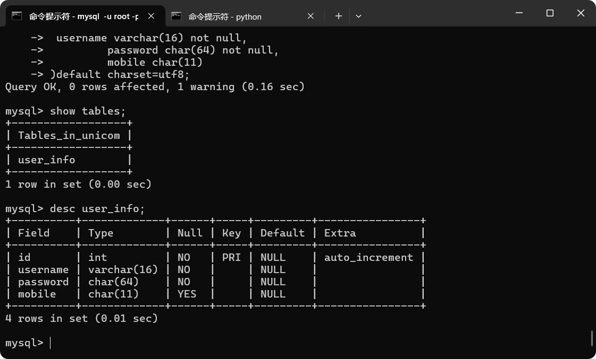

- python代码实现:

  - 添加用户
  - 删除用户
  - 查看用户信息
  - 更新用户信息

## 7.1 创建表结构

去上面找下面这张图的语句

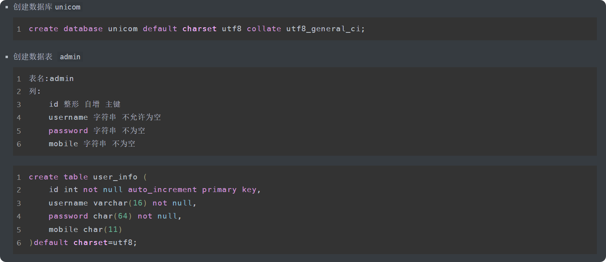

## 7.2 `python`操作`MySQL`

> 用`python`代码连接`MySQL`数据库并发送指令

### 7.2.1 创建数据

```cmd
>>> pip install pymysql
```

```python
import pymysql

# 链接mysql
conn = pymysql.connect(host='localhost',
                       port=3306;
                       user='root',
                       password='******',
                       charset='utf8',
                       db='unicom')

# 游标
cursor = conn.cursor(cursor=pymysql.cursors.DictCursor)

# 发送指令
cursor.execute("insert into user_info (username, password, mobile) values('计算机', '123456', '18822223333');")
# 使用了insert必须要commit
conn.commit()

# 关闭链接
cursor.close()
conn.close()
```

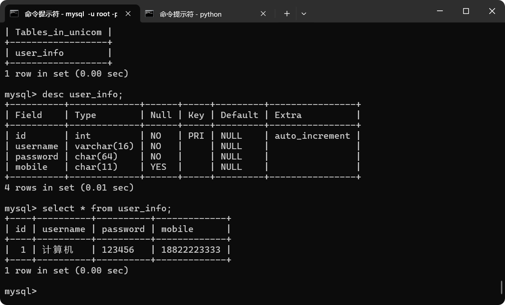

```python
import pymysql

# 链接mysql
conn = pymysql.connect(host='localhost',
                       user='root',
                       port=3306,
                       password='******',
                       charset='utf8',
                       db='unicom')

# 游标
cursor = conn.cursor(cursor=pymysql.cursors.DictCursor)

sql = "insert into user_info (username, password, mobile) values(%s, %s, %s);"

# sql1 = "insert into user_info (username, password, mobile) values(%(n1)s, %(n2)s, %(n3)s);"
# cursor.execute(sql1, {"n1": "computer", "n2": "987654321", "n3": "15333331111"})

# 发送指令 千万不要用字符串格式化去做sql的拼接 安全隐患 -- SQL注入
cursor.execute(sql, ["好运来", "654321", "15211112222"])

# 使用了insert必须要commit
conn.commit()

# 关闭链接
cursor.close()
conn.close()
```

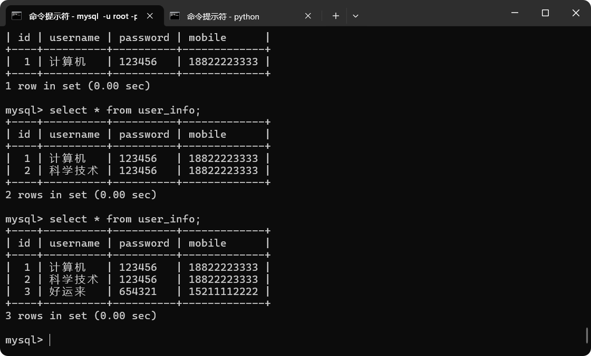

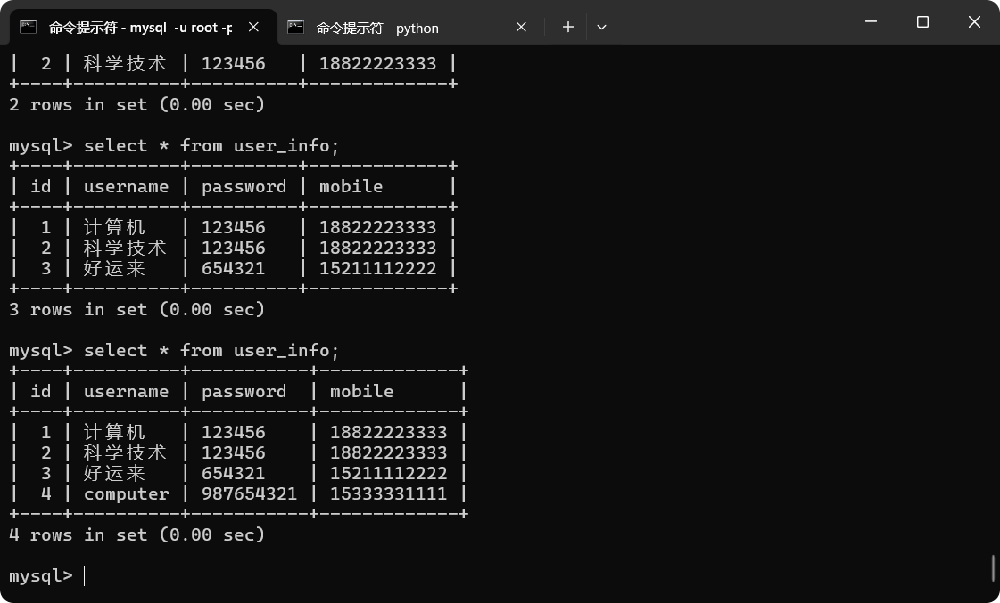

```python
import pymysql

# 链接mysql
conn = pymysql.connect(host='localhost',
                       user='root',
                       port=3306,
                       password='******',
                       charset='utf8',
                       db='unicom')

# 游标
cursor = conn.cursor(cursor=pymysql.cursors.DictCursor)
while True:
    user_name = input("your name. >>>")
    password = input("your password. >>>")
    mobile = input("your phone number. >>>")
    if user_name.upper() == "Q" or password.upper() == 'Q' or mobile.upper() == 'Q':
        break

    sql = "insert into user_info (username, password, mobile) values(%s, %s, %s);"
    # sql1 = "insert into user_info (username, password, mobile) values(%(n1)s, %(n2)s, %(n3)s);"
    # 发送指令 千万不要用字符串格式化去做sql的拼接 安全隐患 -- SQL注入
    cursor.execute(sql, [user_name, password, mobile])
    # cursor.execute(sql1, {"n1": "computer", "n2": "987654321", "n3": "15333331111"})
    # 使用了insert必须要commit
    conn.commit()

# 关闭链接
cursor.close()
conn.close()
```

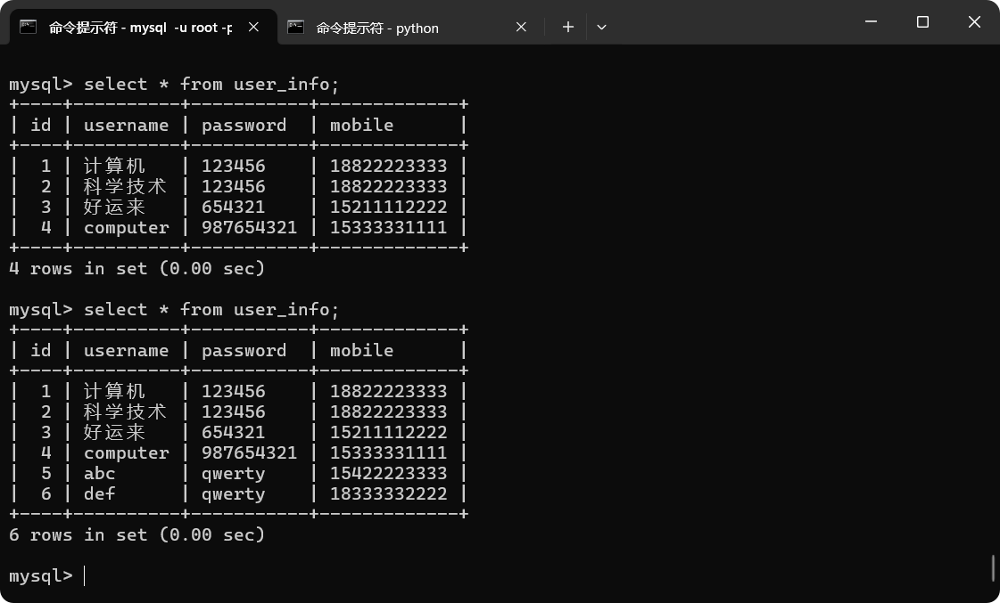

### 7.2.2 查询数据

```python
# -*- coding: utf-8 -*-
# @CreateTime : 2024/6/5 005 15:18
# @Author : wephiles@20866
# @IDE : PyCharm
# @ProjectName : first_web
# @FileName : first_web/python_mysql_search.py
# @Description : This is description of this script.
# @Interpreter : python 3.10
# @Motto : You must take your place in the circle of life!
# @AuthorSite : https://github.com/wephiles or https://gitee.com/wephiles
# @Copyright : © 2024 wephiles. All rights reserved.

import pymysql
from pprint import pprint

conn = pymysql.connect(
    host='localhost',
    user='root',
    password='******',
    database='unicom',
    charset='utf8',
)

cursor = conn.cursor(cursor=pymysql.cursors.DictCursor)

# 查询
sql = "select * from user_info where id > %s"
cursor.execute(sql, [2, ])
conn.commit()

# 获取符合条件的所有数据
data_list = cursor.fetchall()

for row_dict in data_list:
    print(row_dict)

cursor.close()
conn.close()

# --END--

```

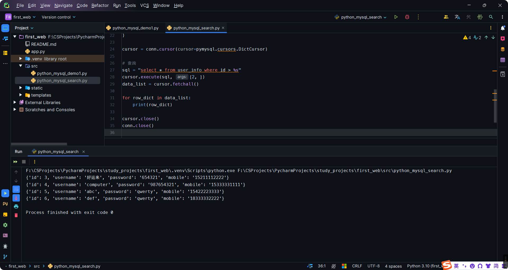

```python
# 获取满足条件的第一条数据字典
res = cursor.fetchone()
print(res)
```

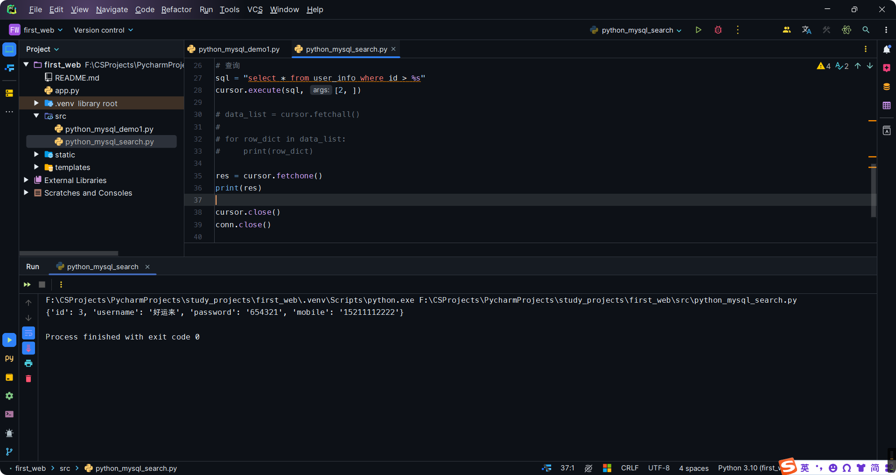

### 7.2.3 删除数据

```python
import pymysql
from pprint import pprint

conn = pymysql.connect(
    host='localhost',
    user='root',
    password='******',
    database='unicom',
    charset='utf8',
)

cursor = conn.cursor(cursor=pymysql.cursors.DictCursor)

# 查询
sql = "delete from user_info where username=%s"
cursor.execute(sql, ['def', ])
conn.commit()

# data_list = cursor.fetchall()
#
# for row_dict in data_list:
#     print(row_dict)

cursor.close()
conn.close()
```

### 7.2.4 修改数据

```python
import pymysql
from pprint import pprint

conn = pymysql.connect(
    host='localhost',
    user='root',
    password='******',
    database='unicom',
    charset='utf8',
)

cursor = conn.cursor(cursor=pymysql.cursors.DictCursor)

# 查询
sql = "update user_info set username=%s where id=%s"
cursor.execute(sql, ['姬霓太美', 5, ])
conn.commit()

cursor.close()
conn.close()
```

### 7.2.5 强调

> [!Caution]
>
> 在进行新增、修改、删除的时候，必须要执行`conn.commit()`。否则不会生效！
>
> 对于`SQL`语句，不要用`Python`格式化语句，会被`SQL`注入，一定要用`execute`里面的参数传入数据。

# 8 案例：`Flask` + `MySQL`

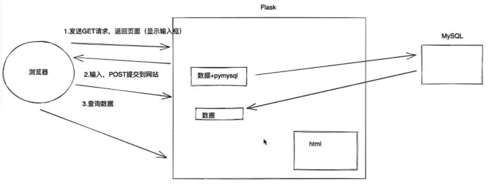

## 8.1 添加用户

```
from flask import Flask, render_template, request, redirect
import pymysql

app = Flask(__name__)


@app.route("/add/user", methods=["GET", "POST"])
def add_user():
    if request.method == "GET":
        return render_template("add_user.html")
    user_name = request.form.get("user")
    password = request.form.get("pwd")
    mobile = request.form.get("mobile")
    conn = pymysql.connect(
        host="localhost",
        user="root",
        password="637847",
        port=3306,
        db="unicom",
        charset="utf8"
    )
    cursor = conn.cursor(cursor=pymysql.cursors.DictCursor)
    sql = "insert into user_info (username, password, mobile) values(%s, %s, %s)"
    cursor.execute(sql, (user_name, password, mobile))
    conn.commit()

    cursor.close()
    conn.close()
    # return "添加成功：" + user_name + "|" + password + "|" + mobile
    return render_template("show_info.html",
                           user_name=user_name,
                           password=password,
                           mobile=mobile, )


if __name__ == '__main__':
    app.run()
```

```html
<h1>添加用户</h1>

<form method="post" action="/add/user">
    <div>
        用户名 <input type="text" name="user" placeholder="用户名"/>
    </div>
    <div>
        密码 <input type="password" name="pwd" placeholder="密码"/>
    </div>
    <div>
        手机号 <input type="mobile" name="mobile" placeholder="手机号"/>
    </div>
    <div>
        <input type="submit" value="提 交"/>
    </div>
</form>
```

## 8.2 查询所有用户

```python
from flask import Flask, render_template, request, redirect
import pymysql

app = Flask(__name__)


@app.route("/add/user", methods=["GET", "POST"])
def add_user():
    if request.method == "GET":
        return render_template("add_user.html")
    user_name = request.form.get("user")
    password = request.form.get("pwd")
    mobile = request.form.get("mobile")
    conn = pymysql.connect(
        host="localhost",
        user="root",
        password="637847",
        port=3306,
        db="unicom",
        charset="utf8"
    )
    cursor = conn.cursor(cursor=pymysql.cursors.DictCursor)
    sql = "insert into user_info (username, password, mobile) values(%s, %s, %s)"
    cursor.execute(sql, (user_name, password, mobile))
    conn.commit()

    cursor.close()
    conn.close()
    # return "添加成功：" + user_name + "|" + password + "|" + mobile
    return render_template("show_info.html",
                           user_name=user_name,
                           password=password,
                           mobile=mobile, )


@app.route("/show/user")
def show_user():
    conn = pymysql.connect(
        host="localhost",
        user="root",
        password="637847",
        port=3306,
        db="unicom",
        charset="utf8"
    )
    cursor = conn.cursor(cursor=pymysql.cursors.DictCursor)
    sql = "select * from user_info"
    cursor.execute(sql)
    data_list = cursor.fetchall()
    cursor.close()
    conn.close()

    # return data_list
    return render_template("show_user.html", data_list=data_list)


if __name__ == '__main__':
    app.run()
```

```html
<!DOCTYPE html>
<html lang="en">
<head>
    <meta charset="UTF-8">
    <title>见与不见都与你一生相拥。</title>
</head>
<body>
<h1>用户列表</h1>


<table border="1">
    <thead>
    <tr>
        <th>
            #
        </th>
        <th>
            用户名
        </th>
        <th>
            用户密码
        </th>
        <th>
            手机号
        </th>
    </tr>
    </thead>

    <tbody>
    
    <tr>
        <td>
            {{ item.id }}
        </td>
        <td>
            {{ item.username }}
        </td>
        <td>
            {{ item.password }}
        </td>
        <td>
            {{ item.mobile }}
        </td>
    </tr>
    
    </tbody>
</table>
</body>
</html>
```


