<h1 style="text-align: center;font-size: 40px; font-family: '楷体';">Django - day15</h1>

[TOC]

前期知识总结概要

- `python`
- 前端
- `MySQL`
- `python` `web`框架
  - `flask`框架,自身短小精悍+第三方组件
  - `django`框架,自己内部已经集成了【主要】

# 1 初识`Django`

## 1.1 安装`django`

```cmd
pip install django
```

```python
...\python310
	- python.exe
    - Scripts
    	- pip.exe
        - django-admin.exe  【帮助我们创建django项目中的文件/文件夹】
    - Lib
    	- 内置模块
    	- site-packages
        	- openpyxl
            - requests
            - flask
            - django  【django框架源码】
```

## 1.2 创建项目

> `django`中的项目会有一些默认的文件和文件夹

### 1.2.1 在终端

- 打开终端

- 进入想要创建`django`项目的目录(项目放在哪)

  ```python
  # 我的目录:
  F:\CSProjects\PycharmProjects\study_projects\django_projets
  ```

- 执行命令`python安装目录\Scripts\django-admin.exe startproject 项目名`

  如果已经将`python安装目录\Scripts`加入到环境变量了,那么可以直接运行`django-admin.exe startproject 项目名`

  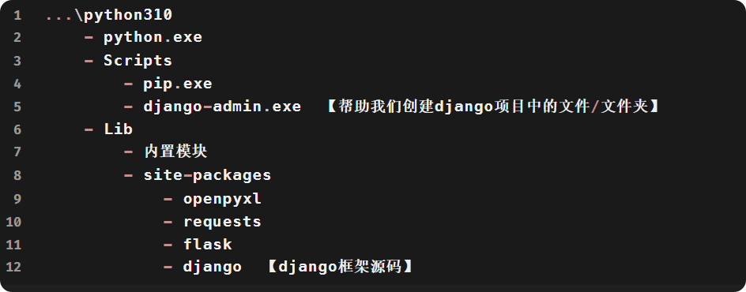

  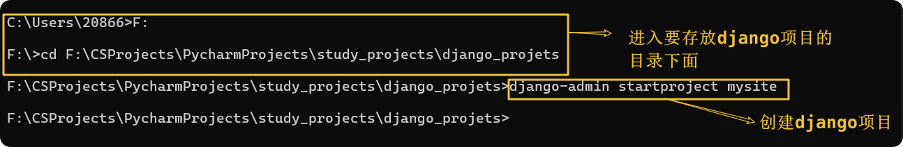

- 执行上述命令后,可以看到在我们的项目所在目录底下有一个`mysite`文件夹:
  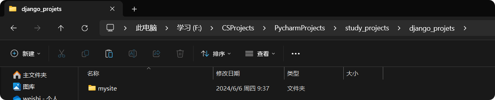

- 这个文件夹底下有一些文件:
  ```python
  ...\django_projects
  	- mysite
      	- mysite
          	- __init__.py
              - asgi.py
              - settings.py
              - urls.py
              - wsgi.py
          - manage.py
  ```

  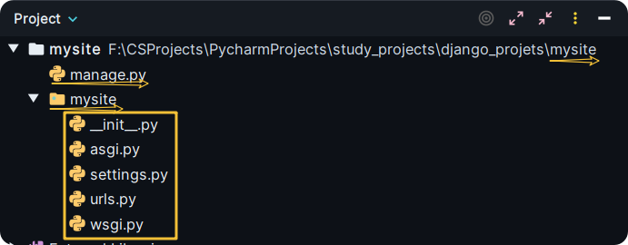

### 1.2.2 基于`pycharm`创建`django`项目--`pycharm`专业版

进入新建项目的页面:

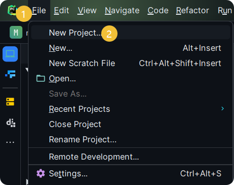

点击`New Project`进入:

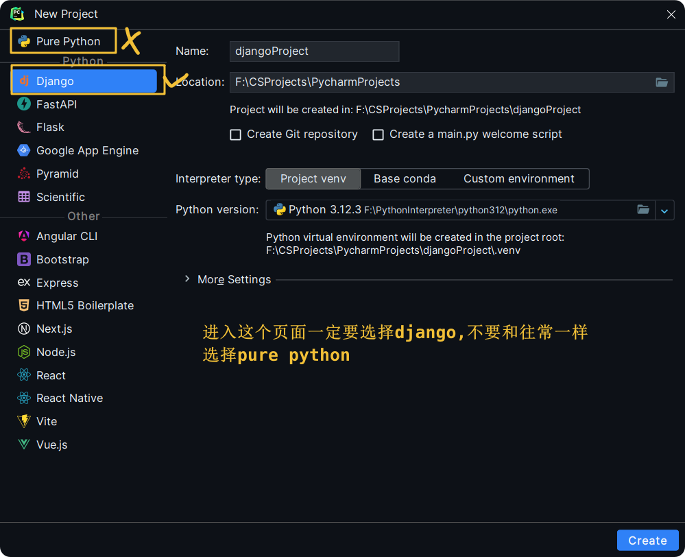

配置一下环境等,此外,刚才在哪个解释器安装的django,就要选择那个解释器 -- 看自己电脑的情况

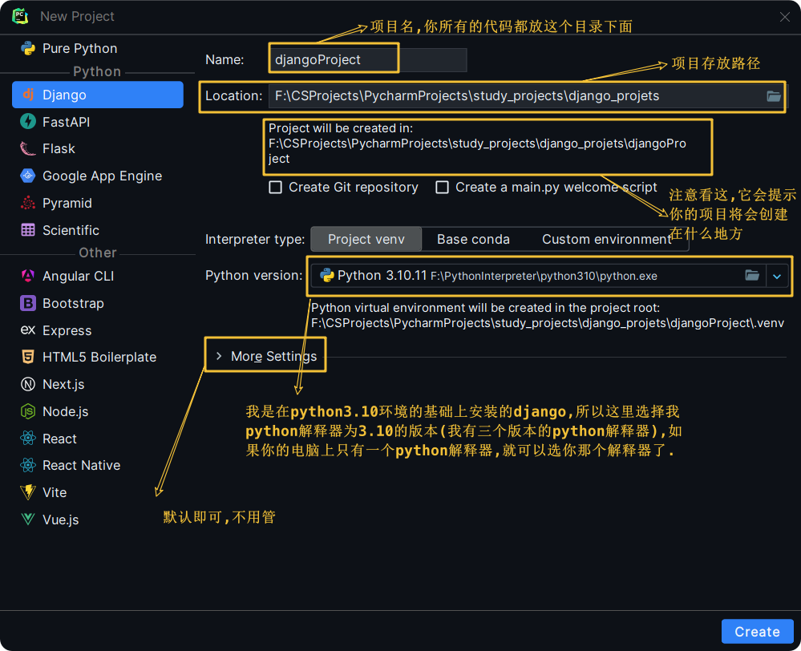

> [!Caution]
>
> 不要把项目为你教案/代码文件放到python安装目录下面!!!不要在解释器安装路径下面手动创建任何文件.

项目文件层级:

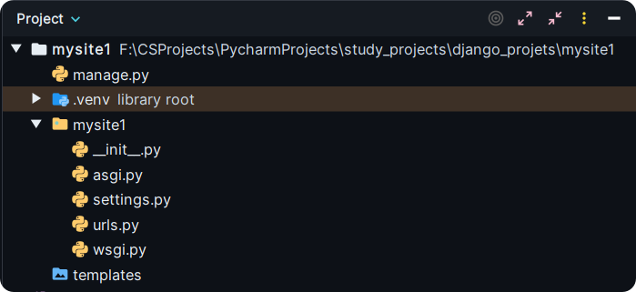

> [!Note]
>
> 我们发现`pycharm`创建的项目和命令行创建的项目有一些差别
>
> `pycharm`:创建了一个`templates`目录,删除先
>
> `pycharm`:`settings`文件里面加了一些数据

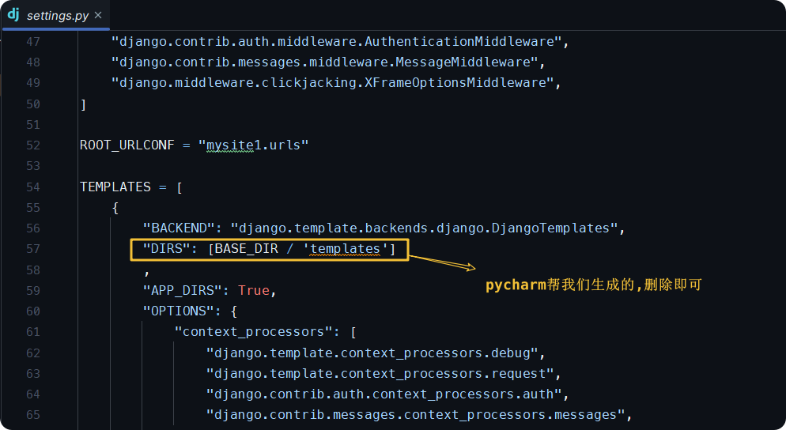

## 1.3 默认创建的项目文件介绍:

```python
- mysite
	- manage.py       【项目管理,启动项目/创建app/数据管理 不要动】
	- mysite
		- __init__.py
		- settings.py 【项目配置文件】
		- urls.py     【url和函数的对应关系 -- 常操作的文件】
        - asgi.py     【接受网络请求 不要动 异步方式】
		- wsgi.py     【接受网络请求 不要动 同步方式】
    
```

## 1.4 `app`

```python
- 项目
	- app 用户管理
    	- 表结构
        - 函数
        - HTML模板
        - CSS
    - app 订单管理
    - app 后台管理
    - app 网站
    - app API
    
注意:我们目前用不到多APP
```

### 1.4.1 创建`app`

在`pycharm`的`terminal`里面运行(因为我们已经默认进入了`mysite1`项目):`python manage.py startapp app名字`

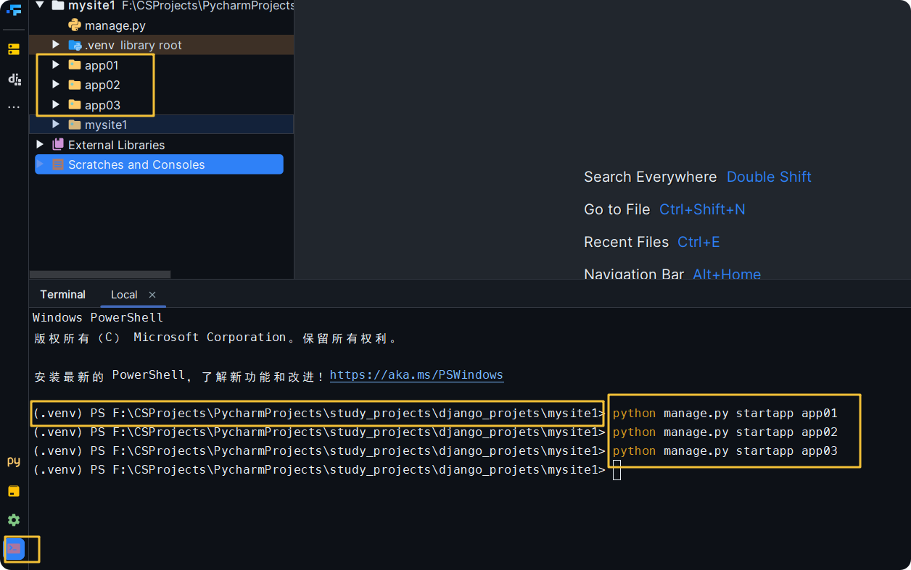

这时候项目层级就变成了这样:

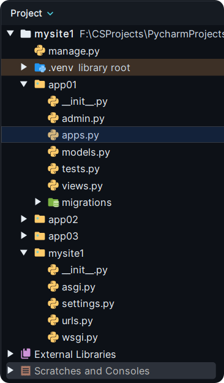

```python
- mysite1
	- manage.py 
	- app01
    	- __init__.py
        - admin.py    【固定，不用动 默认提供了admin后台管理】
        - apps.py     【固定，不用动 app启动类】
        - models.py   【**重要** 专门用于操作数据库】
        - tests.py    【固定，不用动】
        - views.py    【**重要** 函数定义在这儿】
        - migrations  【固定，不用动 数据库变更记录】
        	- __init__.py
    - app02
    	- ...
    - app03
    	- ...
    - mysite1
    	- __init__.py
		- settings.py 【项目配置文件】
		- urls.py     【**重要** url和函数的对应关系 -- 常操作的文件】
        - asgi.py     【接受网络请求 不要动 异步方式】
		- wsgi.py     【接受网络请求 不要动 同步方式】
```

# 2 快速上手

- 先要确保`app`已经注册

  ```python
  - 找到settings.py文件
  - 找到INSTALLED_APPS，在里面添加一项 
  	- 添加什么东西呢？ 找到app01，下面有个apps.py文件，打开
      - 看到里面有个类，叫App01Config（我的叫这个，个人根据自己的情况看自己的是啥）
      - 最后再加上 'app01.apps.叫App01Config'
  ```

  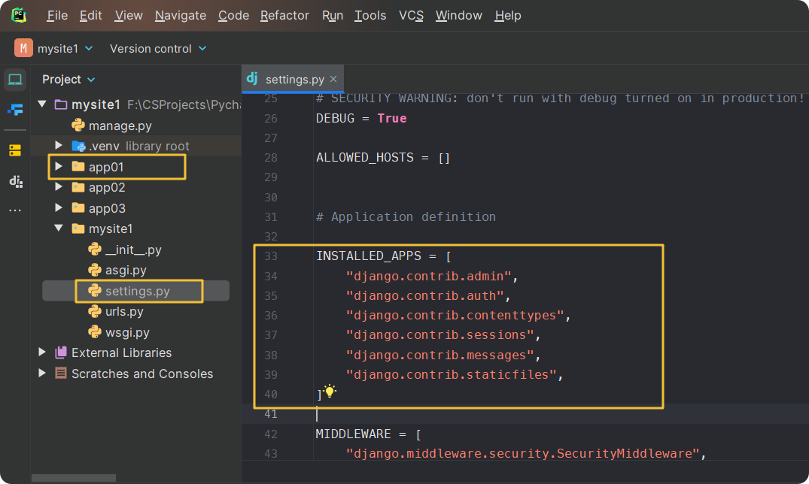

  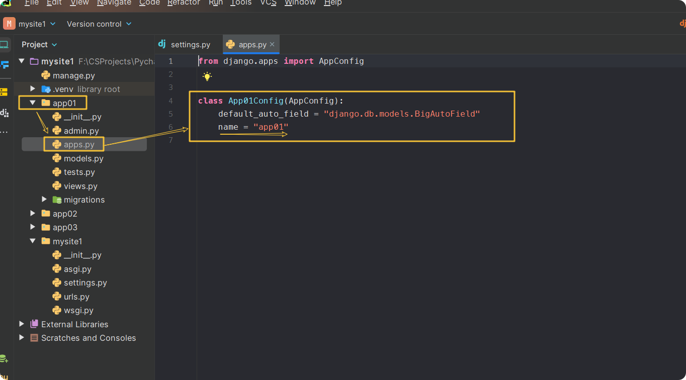

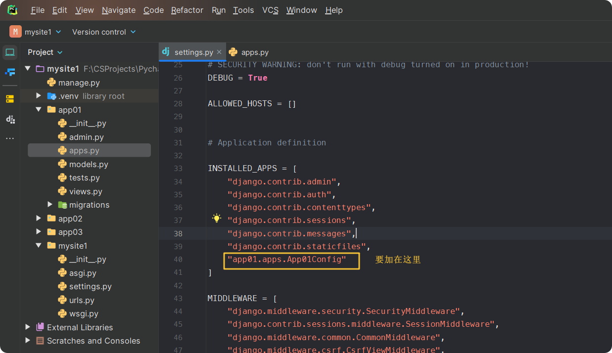

- 编写`url`和视图函数的对应关系

  ```python
  # urls.py
  
  from django.contrib import admin
  from django.urls import path
  
  from app01 import views
  
  urlpatterns = [
      # # 默认的，我们先不用
      # path("admin/", admin.site.urls),
  
      # 访问www.xxx.com/index -> 自动执行第二个参数所指向的函数 这个函数我们卸载app的views里面
      path("index/", views.index),
  ]
  ```

  ```python
  # views.py
  
  from django.shortcuts import render, HttpResponse
  
  
  # Create your views here.
  def index(request):
      """
  
      Args:
          request (): 默认参数
  
      Returns:
  
      """
      return HttpResponse("欢迎使用")
  ```

- 启动`django`项目

  - 命令行启动：`python manage.py runserver`

    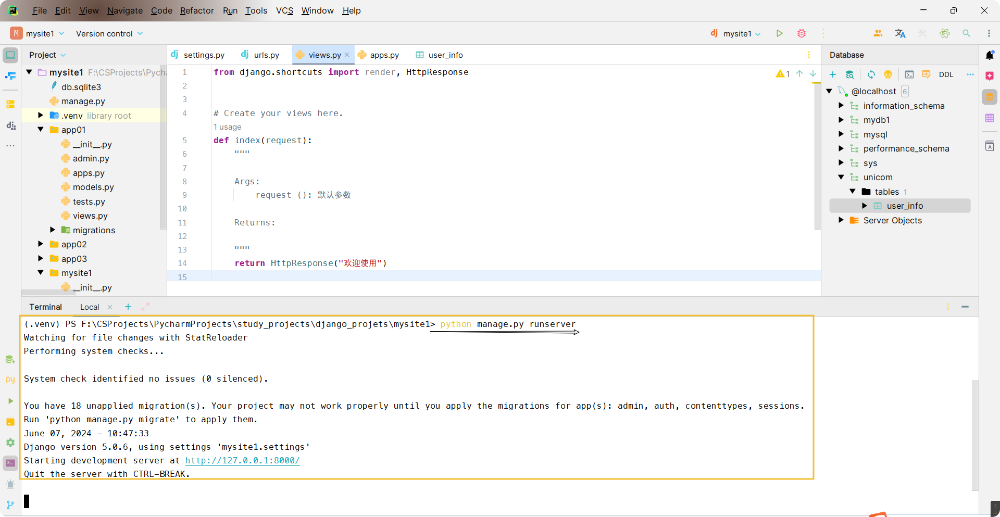

  - `pycharm`启动：

    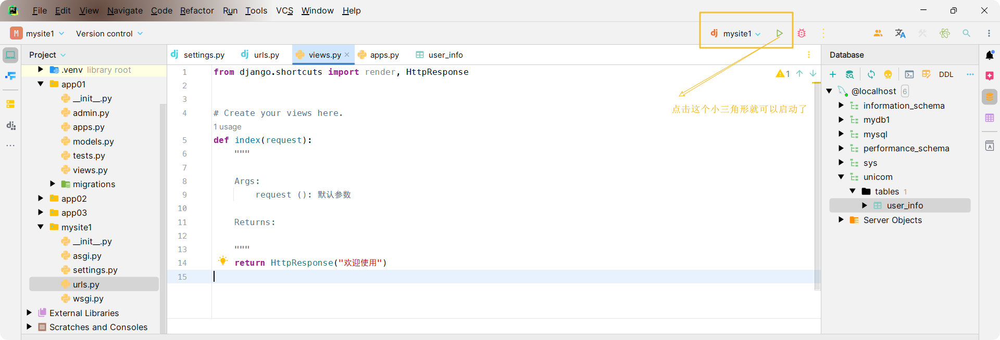

启动起来后，稍微访问一下：

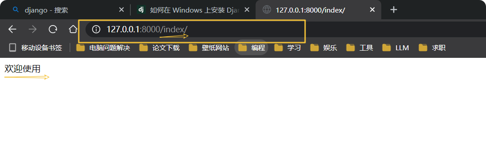


## 2.1 再写一个页面

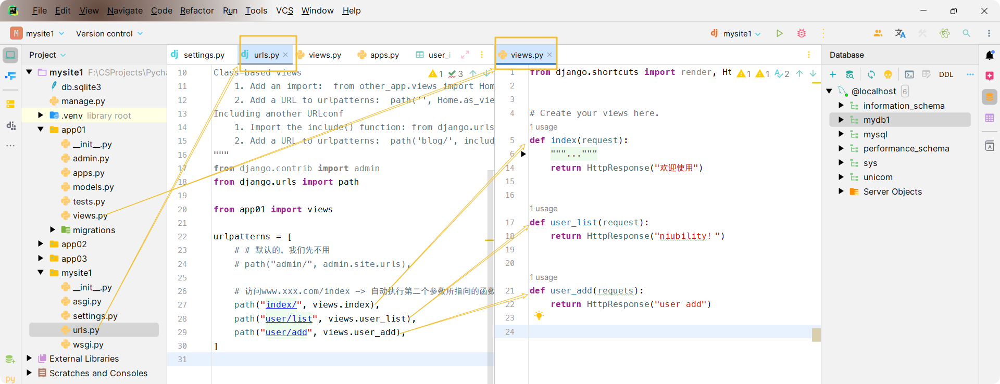

## 2.2 `templates`模板

> [!Caution]
>
> 注意：这个文件夹下面的`html`文件名不能叫`index.html`，否则会报错


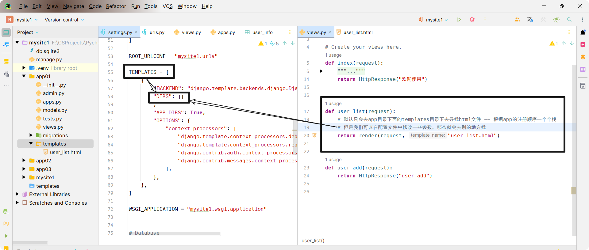

** 需要修改，这么写：`"DIRS": [os.path.join(BASE_DIR, 'templates')]`

## 2.3 静态文件

在开发过程中一般将：

- 图片
- `CSS`
- `JS`

都当作静态文件处理。在`django`中，要放在`app`的`static`下面

注意：

1. 在`app`目录下创建`static`文件夹

2. 在`app`目录下面创建`templates`文件夹

3. 如果需要引入静态样式：

   ```html
   
   ...这是你的HTML代码 按照下一行的方式引入css
   <link rel="stylesheet" href=""/>
   ...这是你的html代码
   ...
   <script src=""></script>    
   </body>
   </html>
   ```

## 小结-创建`Django`项目的顺序

- 首先打开终端,进入想要创建项目的目录

- 安装`python`虚拟环境

  ```python
  >>>python -m venv .venv
  ```

- 进入我们创建的虚拟环境,激活虚拟环境

  ```python
  >>>cd \.venv\Scripts
  >>>activate
  ```

- 激活后会在最前面出现`(.venv)`

- 下载`Django`

  ```python
  >>>pip install django
  ```

- 创建`Django`项目(需要回到你想创建`Django`项目的地方)

  ```python
  >>>django-admin startproject 你的项目名称
  ```

- 创建完毕

## 2.4 模板的语法

本质上：在`html`中写一些占位符，用数据对这些占位符进行填充和处理

### 2.4.1 传递单个值

```html
<div>
    {{ n1 }}
</div>
```

```python
def test_templates(request):
    name = "computer"
    roles = ["computer", "admin", "ceo"]
    # 注意传进去的参数的键要对应上
    the_dict = {"n1": name, "n2": roles}
    return render(request,
                  "test_templates.html",
                  the_dict)
```

### 2.4.2 取传进去的列表里面某一个值

```html
<div>
    {{ n2.0 }}
</div>
<div>
    {{ n2.1 }}
</div>
<div>
    {{ n2.2 }}
</div>
```

### 2.4.3 循环一个列表

```html

	<span>{{ item }}</span>

```

### 2.4.3 传一个字典，根据键获取值

```python
def test_templates(request):
    name = "computer"
    roles = ["computer", "admin", "ceo"]
    user_info = {"username": "admin", "password": "123456", "email": "123@qq.com"}

    the_dict = {"n1": name, "n2": roles, "n3": user_info}
    return render(request,
                  "test_templates.html",
                  the_dict)
```

```html
<div>
    {{ n3.username }}
</div>

<div>
    {{ n3.password }}
</div>

<div>
    {{ n3.email }}
</div>
```

### 2.4.4 字典的for循环 -- 循环`keys` `values` 和 `items`

```python
def test_templates(request):
    name = "computer"
    roles = ["computer", "admin", "ceo"]
    user_info = {"username": "admin", "password": "123456", "email": "123@qq.com"}

    the_dict = {"n1": name, "n2": roles, "n3": user_info}
    return render(request,
                  "test_templates.html",
                  the_dict)
```

```html
<div>
    <ul>
        
            <li> {{ item }} </li>
        
    </ul>
</div>

<div>
    <ul>
        
            <li> {{ item }} </li>
        
    </ul>
</div>

<div>
    <ul>
        
            <li> {{ item }} </li>
        
    </ul>
</div>
```

### 2.4.5 列表套字典

```html
<div>
    {{ n4 }}
</div>

<div>
    {{ n4.0 }}
</div>

<div>
    {{ n4.0.username }}
</div>

<div>
    
        <div>{{ item.username }} -- {{ item.password }}</div>
    
</div>
```

### 2.4.6 条件语句

```html
<div>
    
        <h1>哒哒哒哒哒</h1>
    
        <h1>xxx</h1>
    
        <h1>咕噜咕噜咕噜</h1>
    
</div>
```

> [!Caution]
>
> 这个模板语法是`Django`开发的，

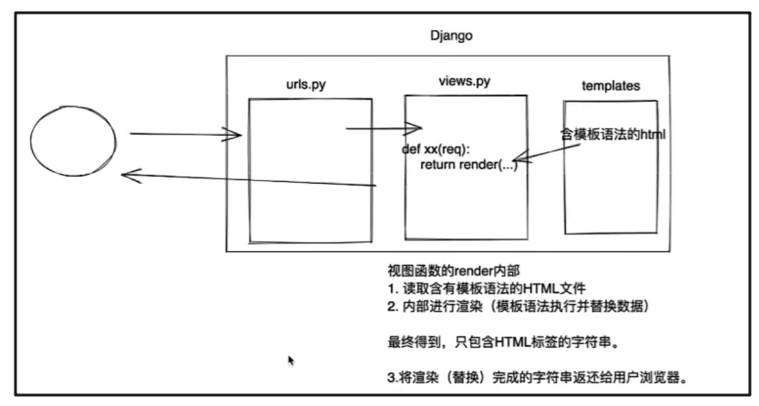


## 2.5 从网络下载，然后传到`Django`后台

```python
import re
import requests

headers = {
    "User-Agent": "Mozilla/5.0 (Windows NT 10.0; Win64; x64) AppleWebKit/537.36 (KHTML, like Gecko) Chrome/125.0.0.0 Safari/537.36"
}

start_url = "https://www.chinaunicom.com.cn/43/menu01/1/column05?pageNo="
msg_list = list()
for k in range(9):
    url = start_url + str(k)
    response_text = requests.get(url=url, headers=headers).text
    title_list = re.findall(r'<td width="1000" data-v-00a8aa21>(.+?)</td>', response_text)
    time_list = re.findall(r'<td align="right" width="200" class="time" data-v-00a8aa21>(.+?)</td>', response_text)
    print(title_list)
    print(time_list)
    msg_list.append((title_list, time_list))
```

## 2.6 请求和响应

```python
def something(request):
    # request是一个对象 封装了用户通过浏览器发来的所有请求相关的数据

    # 获取用户请求方式
    x = request.method

    # 在url上传递一些值：
    # .../?n1=123&n2=999
    n1 = request.GET.get("n1")
    n2 = request.GET.get("n2")

    # 如果发送的是post请求 (在请求体中提交数据) 获取对象
    print(request.POST)

    a_dict = {"x": x,
              "n1": n1,
              "n2": n2}
    # 响应
    return render(request, "something.html", a_dict)
```

```html
哈哈哈哈
<h1>{{ x }}</h1>

<h1>{{ n1 }}</h1>

<h1>{{ n2 }}</h1>
```


还有一个响应：`redirect`

```python
def something(request):
    # request是一个对象 封装了用户通过浏览器发来的所有请求相关的数据

    # 获取用户请求方式
    x = request.method

    # 在url上传递一些值：
    # .../?n1=123&n2=999
    n1 = request.GET.get("n1")
    n2 = request.GET.get("n2")

    # 如果发送的是post请求 (在请求体中提交数据) 获取对象
    print(request.POST)

    a_dict = {"x": x,
              "n1": n1,
              "n2": n2}
    # 响应
    # return render(request, "something.html", a_dict)
    # 响应 -- 重定向
    # return redirect("https://www.baidu.com")
    return redirect("/index/")
```

注意：响应的`redirect`是按照第二种方式处理的重定向

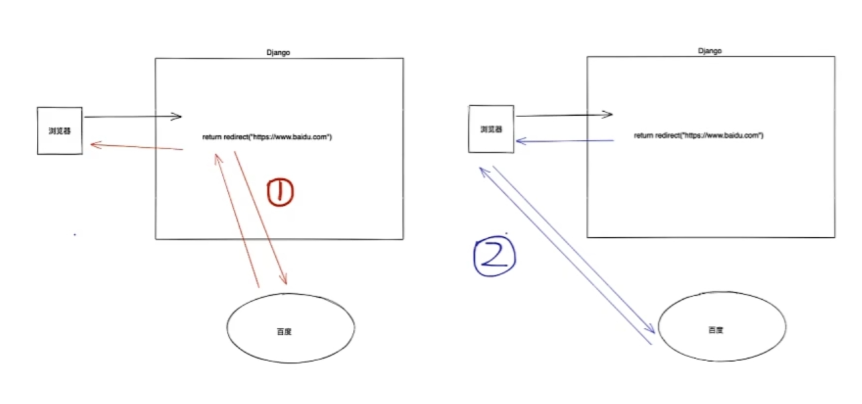

如果出现下面的错误:`django`比`Flask`多了一层`CSRF`校验

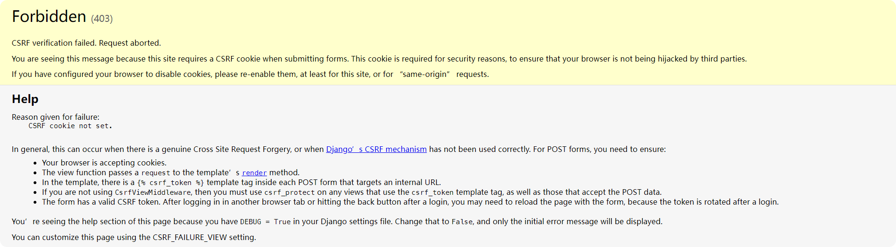

解决方法：

```html
<form method="post" action="/login/">
...这是你表单里面的内容...

</form>
```

```python
def user_login(request):
    if request.method == "GET":
        return render(request, "login.html")
    else:
        username = request.POST.get("username")
        password = request.POST.get("password")
        if username == "admin" and password == "123456":
            return HttpResponse("登录成功")
        else:
            return render(request, "login.html", {"error_msg": "账号密码错误，检查账户密码重新登录"})
```

```python
def user_login(request):
    if request.method == "GET":
        return render(request, "login.html")
    username = request.POST.get("username")
    password = request.POST.get("password")
    if username == "admin" and password == "123456":
        return redirect("/index")
    return render(request, "login.html", {"error_msg": "账号密码错误，检查账户密码重新登录"})
```

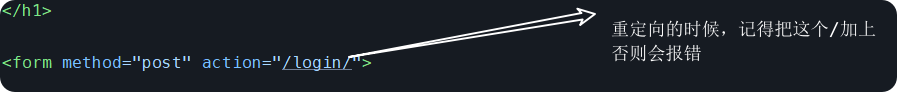

# 3 数据库操作

- `MySQL `+ `pymysql`

```python
import pymysql


conn = pymysql.connect(
)
...
```

- `django`开发--更简单地操作数据库，内部提供了`ORM`框架

  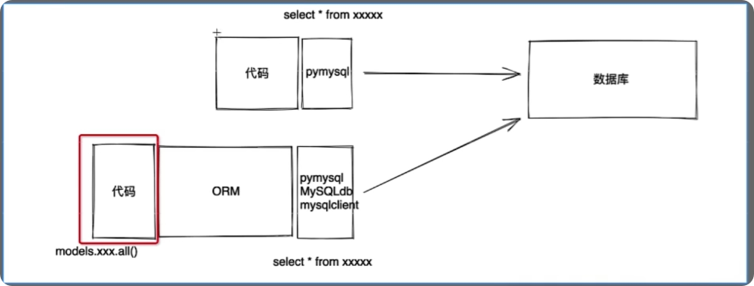

## 3.1 安装第三方模块

```python 
pip install mysqlclient
```

## 3.2 `ORM`

`ORM`可以帮助我们做两件事：

- 创建、修改和删除数据库中的表，不用写`SQL`语句，但是**无法创建数据库**
- 操作表中的数据，不用写`SQL`语句

### 3.3 自己创建数据库

```python
create database db_op default charset utf8 collate utf8_general_ci;
```

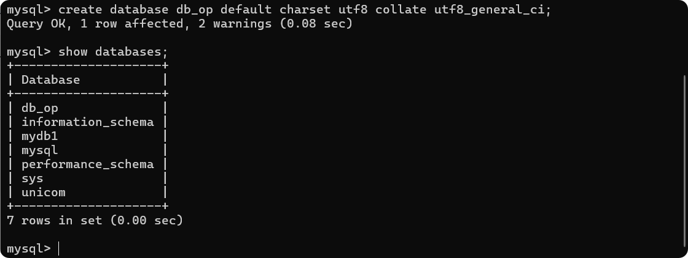

## 3.4 `django`链接数据库

在`settings.py`里面修改配置

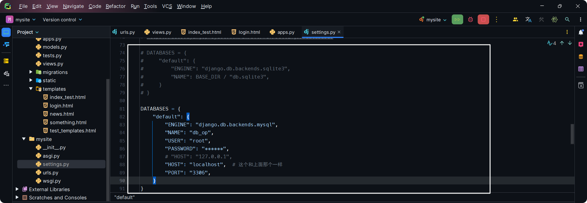

账号密码写自己的就行。

## 3.5 基于`Django`操作表（增删改） -- 在`models.py`文件中

```python
# models.py

from django.db import models

class UserInfo(models.Model):  # 必须这么写
    name = models.CharField(max_length=32)
    password = models.CharField(max_length=64)
    age = models.IntegerField()

# 上面这些代码和下面的代码一样：    
# create table app名称_userinfo (
#     id bigint auto_increment, 
#     name varchar(32),
#     password varchar(64),
#     age int
# );
```

接下来就是执行命令：

主要：在做以下操作之前，需要`app`已注册

```cmd
python manage.py makemigrations
python manage.py migrate
```

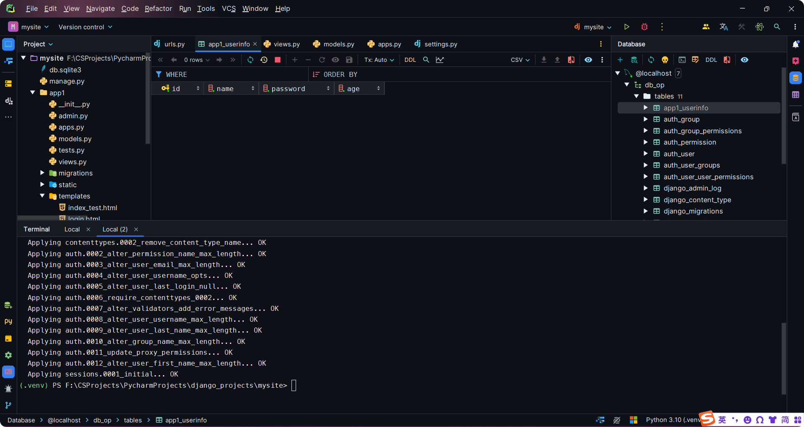

> [!Caution]
>
> 注意，只要`models.py`文件里面的内容有改动，都需要
>
> ```python
> python manage.py makemigrations
> python manage.py migrate
> ```
>
> 此外，如果要给已经存在的数据表添加一列，这时候有个问题：很可能以前的表里面已经有数据了，那么我们应该怎么加这一列呢？
>
> 如果直接修改类里面的数据，并且使用
>
> ```python
> python manage.py makemigrations
> python manage.py migrate
> ```
>
> 那么就会出现让我们选择的两个项目：
>
> 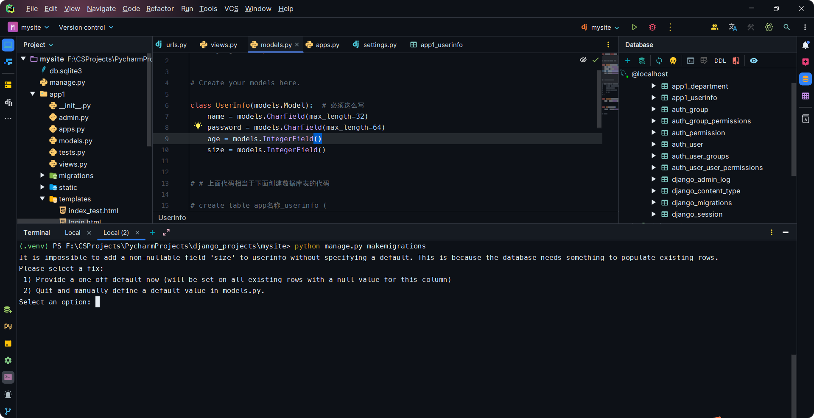
>
> 选第一个，我们后面命令行传什么数据，那么默认填充这个我们输入的数据
>
> 如果选第二个，那么我们就会直接退出，此时要在我们的类里面设置默认值
>
> 所以新增列的时候一定要注意！！！
>
> 也可以让其可以为空：
>
> 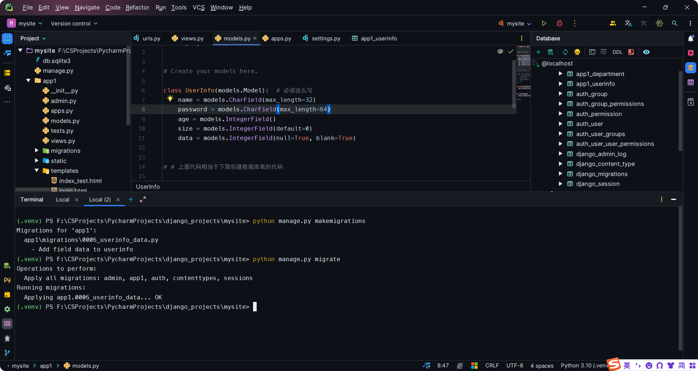

以后如果想对表结构进行调整：

- 在`models.py`里面操作即可

- 命令

  ```python
  python manage.py makemigrations
  python manage.py migrate
  ```

## 3.6 操作数据表中的数据

```python
# 新建数据示例
Department.objects.create(title='信息部')
UserInfo.objects.create(name="computer", password="123456", age=18)
```

```python
# 在views.py里面操作

def test_orm(request):
    # 测试ORM操作表中的数据
	# 新建
    models.Department.objects.create(title="瑞克")
    models.Department.objects.create(title="莫蒂")
    models.Department.objects.create(title="桑美")
    models.UserInfo.objects.create(name="computer", password="123456", age=18)
    models.UserInfo.objects.create(name="science", password="123456", age=18)
    models.UserInfo.objects.create(name="technology", password="123456", age=18)
    return HttpResponse("操作成功")
	
    # 删除
	models.Department.objects.filter(id=3).delete()
    models.Department.objects.all().delete()  # 删除所有表里面的数据
    
    # 筛选 获取数据
    # 获取所有数据 返回的东西类似于列表 每一行都是一个对象
    query_set = models.UserInfo.objects.all()
    data_list = []
    for obj in query_set:
        data_list.append((obj.id, obj.name, obj.password, obj.age, ))
    
    # 获取某些信息
    data = models.UserInfo.objects.filter(id=1).first()
    # 就算只能查出一条数据 返回的也是一个对象列表只不过只有一条数据

    data_list = [[data.id, data.name, data.password, data.age]]
    
    # 更新
    models.UserInfo.objects.filter(id=3).update(password="999999")
```

## 案例：用户管理

### 展示数据

- 针对userinfo这个表
  - 展示用户列表

```python
def info_list(request):
    # 获取数据库中所有用户信息
    data_obj_list = models.UserInfo.objects.all()
    param_list = list()
    for item in data_obj_list:
        param_list.append((item.id, item.name, item.password, item.age))
    data_dict = {'n1': param_list}
    return render(request, "info_list.html", data_dict)
```

```html
<!DOCTYPE html>
<html lang="en">
<head>
    <meta charset="UTF-8">
    <title>info_list</title>
</head>
<body>
<h1>INFO LIST</h1>

{{ n1 }}

<table>
    <thead>
    <tr>
        <th>
            id
        </th>
        <th>
            name
        </th>
        <th>
            password
        </th>
        <th>
            age
        </th>
    </tr>
    </thead>
    <tbody>
    
        <tr>
            <td>
                {{ item.0 }}
            </td>
            <td>
                {{ item.1 }}
            </td>
            <td>
                {{ item.2 }}
            </td>
            <td>
                {{ item.3 }}
            </td>
        </tr>
    
    </tbody>
</table>
</body>
</html>
```

也可以这么写：

```python
def info_list(request):
    # 获取数据库中所有用户信息
    data_obj_list = models.UserInfo.objects.all()
    # param_list = list()
    # for item in data_obj_list:
    #     param_list.append((item.id, item.name, item.password, item.age))
    # data_dict = {'n1': param_list}
    return render(request, "info_list.html", {"data_list": data_obj_list})
```

```html
<!DOCTYPE html>
<html lang="en">
<head>
    <meta charset="UTF-8">
    <title>info_list</title>
</head>
<body>
<h1>INFO LIST</h1>

{#{{ n1 }}#}

<table>
    <thead>
    <tr>
        <th>
            id
        </th>
        <th>
            name
        </th>
        <th>
            password
        </th>
        <th>
            age
        </th>
    </tr>
    </thead>
    <tbody>
    
        <tr>
            <td>
                {{ item.id }}
            </td>
            <td>
                {{ item.name }}
            </td>
            <td>
                {{ item.password }}
            </td>
            <td>
                {{ item.age }}
            </td>
        </tr>
    
    </tbody>
</table>
</body>
</html>
```

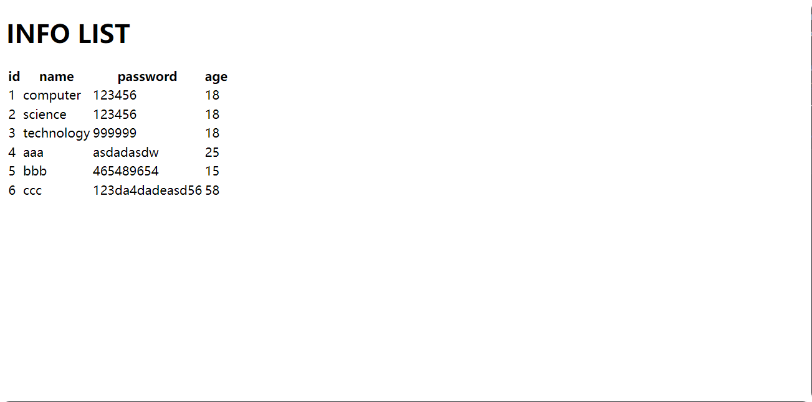

### 添加用户

- `url`
- 函数
  - `get`显示页面
  - `post` 提交 写入数据库

```python
def info_add(request):
    if request.method == "GET":
        return render(request, "user_add.html")
    name = request.POST.get("name")
    password = request.POST.get("password")
    age = request.POST.get("age")

    models.UserInfo.objects.create(name=name, password=password, age=age)
    return redirect("/info/list/")
```

```html
<!DOCTYPE html>
<html lang="en">
<head>
    <meta charset="UTF-8">
    <title>UserAdd</title>
</head>
<body>
<h1>UserAdd</h1>

<form action="/info/add/" method="post">
    <input type="text" name="name" placeholder="name"/>
    <input type="password" name="password" placeholder="password"/>
    <input type="text" name="age" placeholder="age"/>
    <input type="submit" value="提交" />
    
</form>
</body>
</html>
```

### 删除用户

```python
def info_del(request):
    nid = request.GET.get('nid')
    models.UserInfo.objects.filter(id=nid).delete()
    return redirect("/info/list")
```

```html
<!DOCTYPE html>
<html lang="en">
<head>
    <meta charset="UTF-8">
    <title>info_list</title>
</head>
<body>
<h1>INFO LIST</h1>

{#{{ n1 }}#}

<table border="1">
    <thead>
    <tr>
        <th>
            id
        </th>
        <th>
            name
        </th>
        <th>
            password
        </th>
        <th>
            age
        </th>
        <th>
            操作
        </th>
    </tr>
    </thead>
    <tbody>
    
        <tr>
            <td>
                {{ item.id }}
            </td>
            <td>
                {{ item.name }}
            </td>
            <td>
                {{ item.password }}
            </td>
            <td>
                {{ item.age }}
            </td>
            <td>
                <a>编辑</a>
                <a href="http://127.0.0.1:8000/info/del/?nid={{ item.id }}">删除</a>
            </td>
        </tr>
    
    </tbody>
</table>
</body>
</html>
```

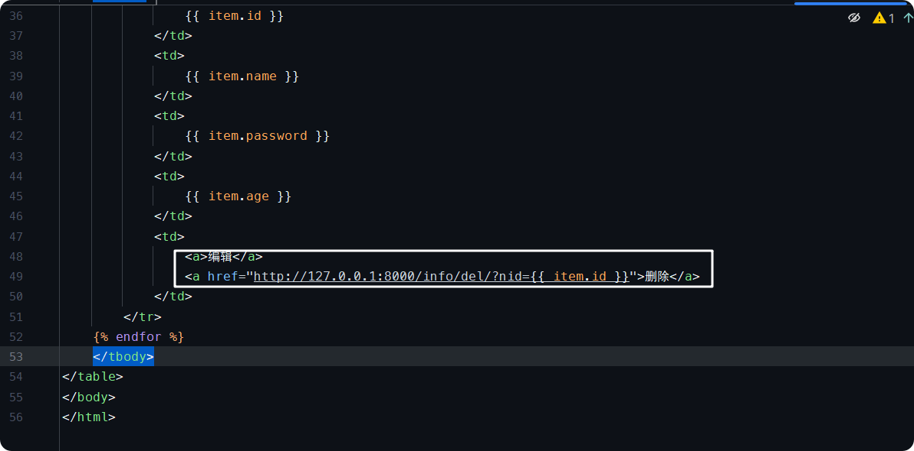


