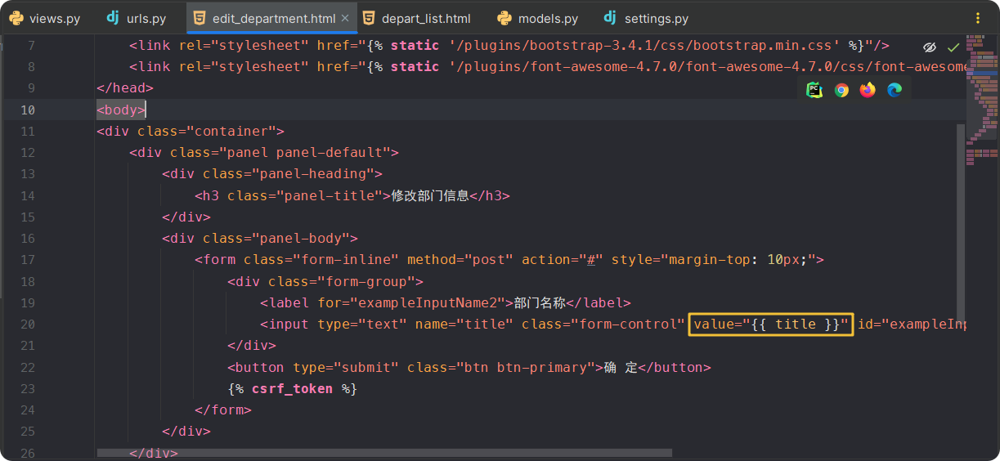
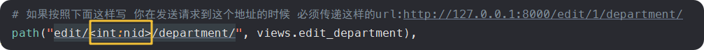
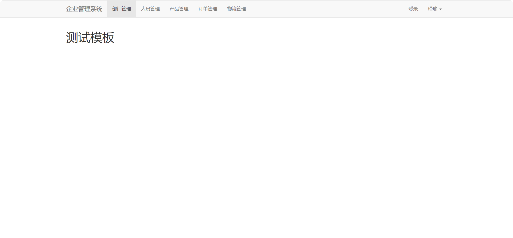
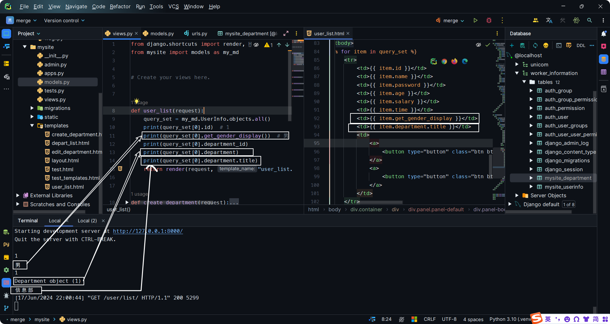
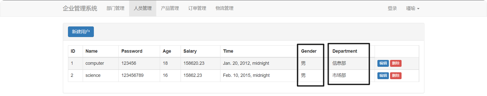
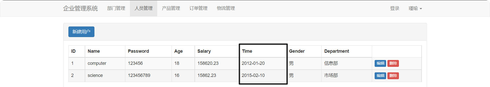

<h1 style="text-align: center;font-size: 40px; font-family: '楷体';">Django - day16</h1>

[TOC]

主题：员工管理系统

# 1 新建一个`Django`项目

# 2 创建`app`

# 3 设计表结构

```python
from django.db import models


# Create your models here.

class Department(models.Model):
    """部门表"""
    # id = models.BigAutoField(verbose_name='ID', primary_key=True, )
    title = models.CharField(verbose_name="部门标题--verbose_name参数表示备注信息", max_length=20)


class UserInfo(models.Model):
    """员工表"""
    name = models.CharField(verbose_name="员工姓名", max_length=10)
    password = models.CharField(verbose_name="密码", max_length=64)
    age = models.IntegerField(verbose_name="年龄")

    # decimal_places=2小数点位数 max_digits=10最大长度
    salary = models.DecimalField(verbose_name="账户余额", decimal_places=2, max_digits=10, default=0)
    time = models.DateTimeField(verbose_name="入职时间")

    # 这个是django里面做的约束 和数据库无关 写性别的时候只能写1/2,1代表男 2代表女
    gender_choices = (
        (1, '男'),
        (2, '女'),
    )
    gender = models.SmallIntegerField(verbose_name="性别", choices=gender_choices)

    # 外键 所属部门 部门名称/部门ID？ -- 两者都有存
    # 根据范式，存ID（节省内存开销）
    # 但是特大企业根据企业要求，存名称，查询次数会很多 会去连表（连表操作会比较耗时），允许数据冗余
    # 对部门ID，要约束吗？ -- 需要约束(不能乱写)--只能是部门表中已经存在的ID

    # # 这样写没约束：
    # department_id = models.CharField(verbose_name='这是备注', max_length=20)

    # 你得这样写 to是与哪张表关联 to_field是与哪一列做关联
    # django自动 -写的是department，但是生成数据的时候 叫department_id

    # # 部门被删除了 -- 直接删除用户（级联删除）
    # department = models.ForeignKey(to=Department, to_field='id', on_delete=models.CASCADE)

    # 部门被删除了 -- 不删除用户但是置空
    department = models.ForeignKey(to=Department, to_field='id', on_delete=models.SET_NULL, null=True, blank=True)

```

# 4 在`MySQL`中生成表

```python
python manage.py makemigrations
python manage.py migrate
```

# 5 静态文件管理

# 6 部门管理

注意，后续有更优解，但是先体验一下原始的方式做。

## 6.1 部门列表、添加部门

```python
# views.py

from django.shortcuts import render, HttpResponse, redirect
from mysite import models as my_md


# Create your views here.


def user_list(request):
    return render(request, "user_list.html")


def create_department(request):
    if request.method == 'GET':
        return render(request, "create_department.html")
    title = request.POST.get('title')
    my_md.Department.objects.create(title=title)
    return redirect("/department/list/")


def depart_list(request):
    data_list = my_md.Department.objects.all()

    return render(request,
                  "depart_list.html",
                  {'data_list_obj': data_list})

```

```python
# urls.py

from django.contrib import admin
from django.urls import path
from mysite import views

urlpatterns = [
    # path("admin/", admin.site.urls),
    path("user/list/", views.user_list),
    path("department/list/", views.depart_list),
    path("create/department/", views.create_department),
]

```

```html
<!-- create_department.html -->

<!DOCTYPE html>
<html lang="en">
<head>
    <meta charset="UTF-8">
    <title>Create Department</title>
    <link rel="stylesheet" href=""/>
    <link rel="stylesheet" href=""/>
</head>
<body>
<div class="container">
    <div class="panel panel-default">
        <div class="panel-heading">
            <h3 class="panel-title">新建部门</h3>
        </div>
        <div class="panel-body">
            <form class="form-inline" method="post" action="#" style="margin-top: 10px;">
                <div class="form-group">
                    <label for="exampleInputName2">部门名称</label>
                    <input type="text" name="title" class="form-control" id="exampleInputName2" placeholder="input department title">
                </div>
                <button type="submit" class="btn btn-primary">确 定</button>
                
            </form>
        </div>
    </div>
</div>

<script src=""></script>
<script src=""></script>
</body>
</html>
```

```html
<!-- depart_list.html -->


<!DOCTYPE html>
<html lang="en">
<head>
    <meta charset="UTF-8">
    <title>Depart List</title>
    <link rel="stylesheet" href=""/>
    <link rel="stylesheet" href=""/>
    <style>
        .navbar {
            border-radius: 0;
        }
    </style>
</head>
<body>

<div class="navbar navbar-default">
    <div class="container">
        <!-- Brand and toggle get grouped for better mobile display -->
        <div class="navbar-header">
            <button type="button" class="navbar-toggle collapsed" data-toggle="collapse" data-target="#bs-example-navbar-collapse-1" aria-expanded="false">
                <span class="sr-only">Toggle navigation</span>
                <span class="icon-bar"></span>
                <span class="icon-bar"></span>
                <span class="icon-bar"></span>
            </button>
            <a class="navbar-brand" href="#">企业管理系统</a>
        </div>

        <!-- Collect the nav links, forms, and other content for toggling -->
        <div class="collapse navbar-collapse" id="bs-example-navbar-collapse-1">
            <ul class="nav navbar-nav">
                <li class="active"><a href="/department/list/">
                    部门管理
                    <span class="sr-only">(current)</span>
                </a>
                </li>
                <li><a href="/user/list/">人员管理</a></li>
                <li><a href="#">产品管理</a></li>
                <li><a href="#">订单管理</a></li>
                <li><a href="#">物流管理</a></li>
            </ul>

            <ul class="nav navbar-nav navbar-right">
                <li><a href="#">登录</a></li>
                <li class="dropdown">
                    <a href="#" class="dropdown-toggle" data-toggle="dropdown" role="button" aria-haspopup="true" aria-expanded="false">
                        瑾瑜 <span class="caret"></span></a>
                    <ul class="dropdown-menu">
                        <li><a href="#">个人资料</a></li>
                        <li><a href="#">我的信息</a></li>
                        <li><a href="#">系统设置</a></li>
                        <li role="separator" class="divider"></li>
                        <li><a href="#">注销登录</a></li>
                    </ul>
                </li>
            </ul>
        </div>
    </div>
</div>

<div class="container">
    <div>
        <div class="panel panel-default">
            <div class="panel-heading">
                <a class="btn btn-primary" href="/create/department/" target="_blank">新建部门</a>
            </div>
            <div class="panel-body">
                <table class="table table-hover table-bordered table-striped">
                    <thead>
                    <tr>
                        <th>ID</th>
                        <th>Title</th>
                        <th>Operate</th>
                    </tr>
                    </thead>

                    <tbody>
                    
                        <tr>
                            <td>{{ item.id }}</td>
                            <td>{{ item.title }}</td>
                            <td>
                                <a>
                                    <button type="button" class="btn btn-primary btn-xs">编辑</button>
                                </a>
                                <a>
                                    <button type="button" class="btn btn-danger btn-xs">删除</button>
                                </a>
                            </td>
                        </tr>
                    
                    </tbody>
                </table>
            </div>
        </div>
    </div>
</div>
<script src=""></script>
<script src=""></script>
</body>
</html>

```

```html
<!-- user_list.html -->

<!DOCTYPE html>
<html lang="en">
<head>
    <meta charset="UTF-8">
    <title>Depart List</title>
    <link rel="stylesheet" href=""/>
    <link rel="stylesheet" href=""/>
    <style>
        .navbar {
            border-radius: 0;
        }
    </style>
</head>
<body>

<div class="navbar navbar-default">
    <div class="container">
        <!-- Brand and toggle get grouped for better mobile display -->
        <div class="navbar-header">
            <button type="button" class="navbar-toggle collapsed" data-toggle="collapse" data-target="#bs-example-navbar-collapse-1" aria-expanded="false">
                <span class="sr-only">Toggle navigation</span>
                <span class="icon-bar"></span>
                <span class="icon-bar"></span>
                <span class="icon-bar"></span>
            </button>
            <a class="navbar-brand" href="#">企业管理系统</a>
        </div>

        <!-- Collect the nav links, forms, and other content for toggling -->
        <div class="collapse navbar-collapse" id="bs-example-navbar-collapse-1">
            <ul class="nav navbar-nav">
                <li><a href="/department/list/">部门管理</a></li>
                <li class="active"><a href="/department/list/">
                    人员管理
                    <span class="sr-only">(current)</span>
                </a>
                </li>
                <li><a href="#">产品管理</a></li>
                <li><a href="#">订单管理</a></li>
                <li><a href="#">物流管理</a></li>
            </ul>

            <ul class="nav navbar-nav navbar-right">
                <li><a href="#">登录</a></li>
                <li class="dropdown">
                    <a href="#" class="dropdown-toggle" data-toggle="dropdown" role="button" aria-haspopup="true" aria-expanded="false">
                        瑾瑜 <span class="caret"></span></a>
                    <ul class="dropdown-menu">
                        <li><a href="#">个人资料</a></li>
                        <li><a href="#">我的信息</a></li>
                        <li><a href="#">系统设置</a></li>
                        <li role="separator" class="divider"></li>
                        <li><a href="#">注销登录</a></li>
                    </ul>
                </li>
            </ul>
        </div>
    </div>
</div>

<div class="container">
    <div>
        <div class="panel panel-default">
            <div class="panel-heading">
                <a class="btn btn-primary" href="#" target="_blank">新建用户</a>
            </div>
            <div class="panel-body">
                <table class="table table-hover table-bordered table-striped">
                    <thead>
                    <tr>
                        <th>ID</th>
                        <th>Title</th>
                        <th>Operate</th>
                        <th>Operate</th>
                        <th>Operate</th>
                        <th>Operate</th>
                        <th>Operate</th>
                        <th>Operate</th>
                    </tr>
                    </thead>

                    <tbody>
                    
                        <tr>
                            <td>{{ item.id }}</td>
                            <td>{{ item.title }}</td>
                            <td>{{ item.title }}</td>
                            <td>{{ item.title }}</td>
                            <td>{{ item.title }}</td>
                            <td>{{ item.title }}</td>
                            <td>{{ item.title }}</td>
                            <td>{{ item.title }}</td>
                            <td>
                                <a>
                                    <button type="button" class="btn btn-primary btn-xs">编辑</button>
                                </a>
                                <a>
                                    <button type="button" class="btn btn-danger btn-xs">删除</button>
                                </a>
                            </td>
                        </tr>
                    
                    </tbody>
                </table>
            </div>
        </div>
    </div>
</div>


<script src=""></script>
<script src=""></script>
</body>
</html>
```

## 6.2 删除部门

```python
def delete_department(request):
    del_id = request.GET.get('nid')
    my_md.Department.objects.filter(id=del_id).delete()
    # return render(request, )
    return redirect('/department/list/')
```

```html
<a href="http://127.0.0.1:8000/delete/department/?nid={{ item.id }}">
    <button type="button" class="btn btn-danger btn-xs">删除</button>
</a>
```

## 6.3 编辑部门

```python
# views.py
def edit_department(request, nid):
    row_obj = my_md.Department.objects.filter(id=nid).first()
    title_department = row_obj.title

    return render(request, "edit_department.html", {"title": title_department})

# urls.py
from django.contrib import admin
from django.urls import path
from mysite import views

urlpatterns = [
    # path("admin/", admin.site.urls),
    path("user/list/", views.user_list),
    path("department/list/", views.depart_list),
    path("create/department/", views.create_department),
    path("delete/department/", views.delete_department),

    # 如果按照下面这样写 你在发送请求到这个地址的时候 必须传递这样的url:http://127.0.0.1:8000/edit/1/department/
    path("edit/<int:nid>/department/", views.edit_department),
]
```

```html
<!-- edit_department.html -->

<!DOCTYPE html>
<html lang="en">
<head>
    <meta charset="UTF-8">
    <title>Edit Department</title>
    <link rel="stylesheet" href=""/>
    <link rel="stylesheet" href=""/>
</head>
<body>
<div class="container">
    <div class="panel panel-default">
        <div class="panel-heading">
            <h3 class="panel-title">修改部门信息</h3>
        </div>
        <div class="panel-body">
            <form class="form-inline" method="post" action="#" style="margin-top: 10px;">
                <div class="form-group">
                    <label for="exampleInputName2">部门名称</label>
                    <input type="text" name="title" class="form-control" value="{{ title }}" id="exampleInputName2" placeholder="input department title">
                </div>
                <button type="submit" class="btn btn-primary">确 定</button>
                
            </form>
        </div>
    </div>
</div>

<script src=""></script>
<script src=""></script>
</body>
</html>
```





再完整一下：

```python
# views.py

def edit_department(request, nid):
    if request.method == 'GET':
        # 获取的是queryset对象列表 即使只有一个对象 也会返回列表
        row_obj = my_md.Department.objects.filter(id=nid).first()
        title_department = row_obj.title

        return render(request, "edit_department.html", {"title": title_department})
    title = request.POST.get('title')
    my_md.Department.objects.filter(id=nid).update(title=title)
    return redirect('/department/list/')
```

# 7 模板的继承

- 部门列表
- 添加部门
- 编辑部门

我们发现我们的每个页面都有一个一样的导航条 -- 重复的操作 -- 模板的继承 -- 重复的东西写到模板里面即可

在`templates`目录里面创建一个名为`layout`的模板`html`文件：

```html

<!DOCTYPE html>
<html lang="en">
<head>
    <meta charset="UTF-8">
    <title>Title</title>
    <link rel="stylesheet" href=""/>
    <link rel="stylesheet" href=""/>
    <style>
        .navbar {
            border-radius: 0;
        }
    </style>
</head>
<body>

<div class="navbar navbar-default">
	...这里为了能够看清楚，把导航栏的细节全删了。  
</div>

<div class="container">
    注意看下面这条语句
    
</div>
<script src=""></script>
<script src=""></script>
</body>
</html>

```

其他`html`想要应用上述模板：

```html



<h1>测试模板</h1>


```



## 7.1 定义模板

```html
<!DOCTYPE html>
<html lang="en">
<head>
    <meta charset="UTF-8">
    <title>Title</title>
    <link rel="stylesheet" href=""/>
    <style>
    	...
    </style>
    
</head>
<body>
<h1>标题</h1>
    


<h1>底部</h1>


<script src=""></script>
    
</body>
</html>
```

## 7.2 继承模板

```html



<link rel="stylesheet" href=""/>


这里写你新加的内容



<script src=""></script>
```





```python
def user_list(request):
    query_set = my_md.UserInfo.objects.all()
    print(query_set[0].id)  # 1
    print(query_set[0].get_gender_display())  # 男
    print(query_set[0].department_id)
    print(query_set[0].department)
    print(query_set[0].department.title)
    return render(request, "user_list.html", {'query_set': query_set})
```

```html

    <tr>
        <td>{{ item.id }}</td>
        <td>{{ item.name }}</td>
        <td>{{ item.password }}</td>
        <td>{{ item.age }}</td>
        <td>{{ item.salary }}</td>
        <td>{{ item.time }}</td>
        <td>{{ item.get_gender_display }}</td>
        <td>{{ item.department.title }}</td>
        <td>
            <a>
                <button type="button" class="btn btn-primary btn-xs">编辑</button>
            </a>
            <a>
                <button type="button" class="btn btn-danger btn-xs">删除</button>
            </a>
        </td>
    </tr>

```

如果想要将时间改成字符串的形式：按照下面的方式写：

```html

    <tr>
        ...
        <td>{{ item.time|date:"Y-m-d" }}</td>
        ...
    </tr>

```



# 8 新建用户

- 原始方法理思路：不会采用（本质） 比较麻烦
  - 需要做数据校验
  - 没有错误提示
  - 页面上每一个字段都需要我们重新写一遍
  - 关联数据需要我们手动获取并展示

- `Django`组件
  - `Form`组件 -- 只能做前三个
  - `ModelForm`组件（最简便） -- 四个都能做

```python
# views.py
from django.shortcuts import render, HttpResponse, redirect
from mysite import models as my_md


# Create your views here.


def user_list(request):
    query_set = my_md.UserInfo.objects.all()
    # print(query_set[0].id)  # 1
    # print(query_set[0].get_gender_display())  # 男
    # print(query_set[0].department_id)
    # print(query_set[0].department)
    # print(query_set[0].department.title)
    return render(request, "user_list.html", {'query_set': query_set})


def user_add(request):
    """
    添加用户
    Args:
        request ():

    Returns:

    """
    if request.method == "GET":
        context = {
            'gender_choices': my_md.UserInfo.gender_choices,
            'depart_list': my_md.Department.objects.all(),
        }
        return render(request, 'user_add.html', context)
    name = request.POST.get('name')
    password = request.POST.get('password')
    age = request.POST.get('age')
    gender = request.POST.get('gender')
    time = request.POST.get('time')
    salary = request.POST.get('salary')
    department = request.POST.get('department')
    print(name, password, age, gender, time, salary, department)
    my_md.UserInfo.objects.create(name=name,
                                  password=password,
                                  age=age,
                                  gender=gender,
                                  time=time,
                                  salary=salary,
                                  department_id=department)
    return redirect('/user/list/')


def create_department(request):
    if request.method == 'GET':
        return render(request, "create_department.html")
    title = request.POST.get('title')
    my_md.Department.objects.create(title=title)
    return redirect("/department/list/")


def depart_list(request):
    data_list = my_md.Department.objects.all()

    return render(request,
                  "depart_list.html",
                  {'data_list_obj': data_list})


def delete_department(request):
    del_id = request.GET.get('nid')
    my_md.Department.objects.filter(id=del_id).delete()
    # return render(request, )
    return redirect('/department/list/')


def edit_department(request, nid):
    if request.method == 'GET':
        # 获取的是queryset对象列表 即使只有一个对象 也会返回列表
        row_obj = my_md.Department.objects.filter(id=nid).first()
        title_department = row_obj.title

        return render(request, "edit_department.html", {"title": title_department})
    title = request.POST.get('title')
    my_md.Department.objects.filter(id=nid).update(title=title)
    return redirect('/department/list/')


def test_templates(request):
    return render(request, 'test_templates.html')

```

```python
# urls.py
from django.contrib import admin
from django.urls import path
from mysite import views

urlpatterns = [
    # path("admin/", admin.site.urls),
    path("user/list/", views.user_list),
    path("user/add/", views.user_add),

    path("department/list/", views.depart_list),
    path("create/department/", views.create_department),
    path("delete/department/", views.delete_department),

    # 如果按照下面这样写 你在发送请求到这个地址的时候
    # 必须传递这样的url:http://127.0.0.1:8000/edit/1/department/
    # 必须传递这样的url:http://127.0.0.1:8000/edit/10/department/
    path("edit/<int:nid>/department/", views.edit_department),

    path("test/templates/", views.test_templates),
]
```

```python
# models.py


from django.db import models


# Create your models here.

class Department(models.Model):
    """部门表"""
    # id = models.BigAutoField(verbose_name='ID', primary_key=True, )
    title = models.CharField(verbose_name="部门标题--verbose_name参数表示备注信息", max_length=20)


class UserInfo(models.Model):
    """员工表"""
    name = models.CharField(verbose_name="员工姓名", max_length=10)
    password = models.CharField(verbose_name="密码", max_length=64)
    age = models.IntegerField(verbose_name="年龄")

    # decimal_places=2小数点位数 max_digits=10最大长度
    salary = models.DecimalField(verbose_name="账户余额", decimal_places=2, max_digits=10, default=0)
    time = models.DateTimeField(verbose_name="入职时间")

    # 这个是django里面做的约束 和数据库无关 写性别的时候只能写1/2,1代表男 2代表女
    gender_choices = (
        (1, '男'),
        (2, '女'),
    )
    gender = models.SmallIntegerField(verbose_name="性别", choices=gender_choices)

    # 外键 所属部门 部门名称/部门ID？ -- 两者都有存
    # 根据范式，存ID（节省内存开销）
    # 但是特大企业根据企业要求，存名称，查询次数会很多 会去连表（连表操作会比较耗时），允许数据冗余
    # 对部门ID，要约束吗？ -- 需要约束(不能乱写)--只能是部门表中已经存在的ID

    # # 这样写没约束：
    # department_id = models.CharField(verbose_name='这是备注', max_length=20)

    # 你得这样写 to是与哪张表关联 to_field是与哪一列做关联
    # django自动 -写的是department，但是生成数据的时候 叫department_id

    # # 部门被删除了 -- 直接删除用户（级联删除）
    # department = models.ForeignKey(to=Department, to_field='id', on_delete=models.CASCADE)

    # 部门被删除了 -- 不删除但是置空
    department = models.ForeignKey(to=Department, to_field='id', on_delete=models.SET_NULL, null=True, blank=True)

```

下面一个代码框展示的是`user_add.html`文件的内容。

```html




    <div class="panel panel-default">
        <div class="panel-heading">新建用户</div>
        <div class="panel-body">
            <form action="/user/add/" method="post">
                
                <div class="form-group">
                    <label for="name">姓名</label>
                    <input type="text" class="form-control" id="name" placeholder="姓名" name="name">
                </div>

                <div class="form-group">
                    <label for="password">密码</label>
                    <input type="password" class="form-control" id="password" placeholder="密码" name="password">
                </div>

                <div class="form-group">
                    <label for="age">年龄</label>
                    <input type="text" class="form-control" id="age" placeholder="年龄" name="age">
                </div>

                <div class="form-group">
                    <label for="name">性别</label>
                    {#                    <input type="text" class="form-control" id="name" placeholder="姓名">#}
                    <select class="form-control" name="gender">
                        
                            <option value="{{ item.0 }}">{{ item.1 }}</option>
                        
                    </select>
                </div>

                <div class="form-group">
                    <label for="time">时间</label>
                    <input type="text" class="form-control" id="time" placeholder="时间" name="time">
                </div>

                <div class="form-group">
                    <label for="salary">薪资</label>
                    <input type="text" class="form-control" id="salary" placeholder="薪资" name="salary">
                </div>

                <div class="form-group">
                    <label>部门</label>
                    <select class="form-control" name="department">
                        
                            <option value="{{ item.id }}">{{ item.title }}</option>
                        
                    </select>
                </div>

                <button type="submit" class="btn btn-primary">Submit</button>
            </form>
        </div>
    </div>


```

## 8.1 初识`Form`

### 8.1.1 `views.py`

```python
class MyForm(...Form):
    user = forms.CharField(widget=forms.Input)  # 帮我们显示成input框
    password = forms.CharField(widget=forms.Input)  # 帮我们显示成input框
    email = forms.CharField(widget=forms.Input)  
    ...

def user_add(request):
    if request.method == "GET":
        form = MyForm()  # 实例化一个MyForm对象
        return render(request, 'user_add.html', {"form": form})
    ...
```

### 8.1.2 `user_add.html`:

```html
<form>
    
    {{ form.user }}
    {{ form.password }}
    {{ form.email }}
</form>

<form>
    
    
        {{ field }}
	
</form>
```

## 8.2 `ModelForm`

### 8.2.1 `models.py`

```python
class UserInfo(models.Model):
    """员工表"""
    name = models.CharField(verbose_name="员工姓名", max_length=10)
    password = models.CharField(verbose_name="密码", max_length=64)
    age = models.IntegerField(verbose_name="年龄")

    # decimal_places=2小数点位数 max_digits=10最大长度
    salary = models.DecimalField(verbose_name="账户余额", decimal_places=2, max_digits=10, default=0)
    time = models.DateTimeField(verbose_name="入职时间")

    # 这个是django里面做的约束 和数据库无关 写性别的时候只能写1/2,1代表男 2代表女
    gender_choices = (
        (1, '男'),
        (2, '女'),
    )
    gender = models.SmallIntegerField(verbose_name="性别", choices=gender_choices)

    # 外键 所属部门 部门名称/部门ID？ -- 两者都有存
    # 根据范式，存ID（节省内存开销）
    # 但是特大企业根据企业要求，存名称，查询次数会很多 会去连表（连表操作会比较耗时），允许数据冗余
    # 对部门ID，要约束吗？ -- 需要约束(不能乱写)--只能是部门表中已经存在的ID

    # # 这样写没约束：
    # department_id = models.CharField(verbose_name='这是备注', max_length=20)

    # 你得这样写 to是与哪张表关联 to_field是与哪一列做关联
    # django自动 -写的是department，但是生成数据的时候 叫department_id

    # # 部门被删除了 -- 直接删除用户（级联删除）
    # department = models.ForeignKey(to=Department, to_field='id', on_delete=models.CASCADE)

    # 部门被删除了 -- 不删除但是置空
    department = models.ForeignKey(to=Department, to_field='id', on_delete=models.SET_NULL, null=True, blank=True)
```

### 8.2.2 `views.py`

```python
class MyForm(ModelForm):
    xx = form.CharField("...")
    class meta():
        model = UserInfo
        fields = ["name", "password", "age", "xx"]
        
def user_add(request):
    if request.method == "GET":
        form = MyForm()  # 实例化一个MyForm对象
        return render(request, 'user_add.html', {"form": form})
    ...
```

### 8.3 新建用户-基于modelform

```python
# models.py
class Department(models.Model):
    """部门表"""
    # id = models.BigAutoField(verbose_name='ID', primary_key=True, )
    title = models.CharField(verbose_name="部门标题", max_length=20)

    def __str__(self):
        return self.title
    
# views.py
class UserModelForm(forms.ModelForm):
    class Meta:
        model = my_md.UserInfo
        fields = ["name", "password", "age", "salary", "time", "gender", "department"]

def user_model_form_add(request):
    """
    添加用户-基于ModelForm
    Args:
        request ():

    Returns:

    """
    form = UserModelForm()
    return render(request,
                  "user_add_modelform.html",
                  {"form": form})
    
# urls.py
from django.contrib import admin
from django.urls import path
from mysite import views

urlpatterns = [
    # path("admin/", admin.site.urls),
    path("user/list/", views.user_list),
    path("user/add/", views.user_add),
    path("user/modelform/add/", views.user_model_form_add),

    path("department/list/", views.depart_list),
    path("create/department/", views.create_department),
    path("delete/department/", views.delete_department),

    # 如果按照下面这样写 你在发送请求到这个地址的时候
    # 必须传递这样的url:http://127.0.0.1:8000/edit/1/department/
    # 必须传递这样的url:http://127.0.0.1:8000/edit/10/department/
    path("edit/<int:nid>/department/", views.edit_department),

    path("test/templates/", views.test_templates),
]
```

```html
<form action="/user/modelform/add/" method="post">
    
    {# form.name.label是name字段对应的verbose_name #}
    {# 下面这几行这样写有点复杂 #}
    {#                {{ form.name.label }}: {{ form.name }}#}
    {#                {{ form.password.label }}: {{ form.password }}#}
    {#                {{ form.age.label }}: {{ form.age }}#}
    {# 按照下面的样子 循环写就OK了 #}
    
        {{ field.label }}: {{ field }}
    
    <button type="submit" class="btn btn-primary">Submit</button>
</form>
```

美化一下：

```python
# views.py
class UserModelForm(forms.ModelForm):
    class Meta:
        model = my_md.UserInfo
        fields = ["name", "password", "age", "salary", "time", "gender", "department"]

        # 可以像下面这样写 但是不建议 太麻烦了
        # widgets = {
        #     "name": forms.TextInput(attrs={"class": 'form-control'}),
        #     "password": forms.PasswordInput(attrs={"class": 'form-control'}),
        #     "age": forms.PasswordInput(attrs={"class": 'form-control'}),
        #     "salary": forms.PasswordInput(attrs={"class": 'form-control'}),
        #     ...
        # }

    # 这样写
    def __init__(self, *args, **kwargs):
        super().__init__(*args, **kwargs)

        # 循环找到所有插件 添加样式
        for name, field in self.fields.items():
            # # 如果想要跳过某一个input框
            # if name == "password":
            #     continue
            field.widget.attrs = {"class": "form-control"}

# models.py
class Department(models.Model):
    """部门表"""
    # id = models.BigAutoField(verbose_name='ID', primary_key=True, )
    title = models.CharField(verbose_name="部门标题", max_length=20)

    def __str__(self):
        return self.title


class UserInfo(models.Model):
    """员工表"""
    name = models.CharField(verbose_name="员工姓名", max_length=10)
    password = models.CharField(verbose_name="密码", max_length=64)
    age = models.IntegerField(verbose_name="年龄")

    # decimal_places=2小数点位数 max_digits=10最大长度
    salary = models.DecimalField(verbose_name="账户余额", decimal_places=2, max_digits=10, default=0)
    time = models.DateTimeField(verbose_name="入职时间")

    # 这个是django里面做的约束 和数据库无关 写性别的时候只能写1/2,1代表男 2代表女
    gender_choices = (
        (1, '男'),
        (2, '女'),
    )
    gender = models.SmallIntegerField(verbose_name="性别", choices=gender_choices)

    # 外键 所属部门 部门名称/部门ID？ -- 两者都有存
    # 根据范式，存ID（节省内存开销）
    # 但是特大企业根据企业要求，存名称，查询次数会很多 会去连表（连表操作会比较耗时），允许数据冗余
    # 对部门ID，要约束吗？ -- 需要约束(不能乱写)--只能是部门表中已经存在的ID

    # # 这样写没约束：
    # department_id = models.CharField(verbose_name='这是备注', max_length=20)

    # 你得这样写 to是与哪张表关联 to_field是与哪一列做关联
    # django自动 -写的是department，但是生成数据的时候 叫department_id

    # # 部门被删除了 -- 直接删除用户（级联删除）
    # department = models.ForeignKey(to=Department, to_field='id', on_delete=models.CASCADE)

    # 部门被删除了 -- 不删除但是置空
    department = models.ForeignKey(Department, verbose_name="部门", to_field='id', on_delete=models.SET_NULL, null=True, blank=True)

```

```python
# urls.py
from django.contrib import admin
from django.urls import path
from mysite import views

urlpatterns = [
    # path("admin/", admin.site.urls),
    path("user/list/", views.user_list),
    path("user/add/", views.user_add),
    path("user/modelform/add/", views.user_model_form_add),

    path("department/list/", views.depart_list),
    path("create/department/", views.create_department),
    path("delete/department/", views.delete_department),

    # 如果按照下面这样写 你在发送请求到这个地址的时候
    # 必须传递这样的url:http://127.0.0.1:8000/edit/1/department/
    # 必须传递这样的url:http://127.0.0.1:8000/edit/10/department/
    path("edit/<int:nid>/department/", views.edit_department),

    path("test/templates/", views.test_templates),
]

```

```html
# user_add_modelform.html





    <div class="panel panel-default">
        <div class="panel-heading">新建用户</div>
        <div class="panel-body">
            <form action="/user/add/" method="post">
                
                
                    <div class="form-group">
                        <label for="name">{{ field.label }}</label>
                        {{ field }}
                    </div>
                
                <button type="submit" class="btn btn-primary">Submit</button>
            </form>
        </div>
    </div>

```

数据校验、错误提示：

如果想要报错信息用中文显示：在`settings.py`里面：改成这样子。

```python
# LANGUAGE_CODE = "en-us"
LANGUAGE_CODE = "zh-hans"
```


