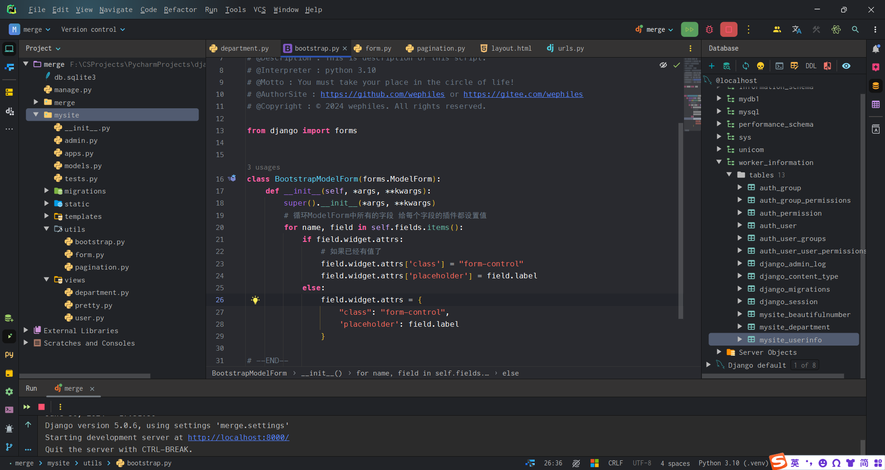

<h1 style="text-align: center;font-size: 40px; font-family: '楷体';">Django - day17</h1>

[TOC]

建议：

`ModelForm`--针对数据库中的某个表

其他 -- `Form`

# 1 用户管理

## 1.1 编辑用户

- 点击编辑 跳转到编辑页面 将编辑的`ID`携带过去
- 编辑页面（默认显示一些数据 -- 根据`ID`获取数据并展示出来）
- 提交时也要做数据校验
- 在数据库中更新

```python
# views.py
def user_edit(request, uid):
    """
    编辑用户
    Args:
        request ():
        uid ():

    Returns:

    """
    row_obj = my_md.UserInfo.objects.filter(id=uid).first()
    if request.method == 'GET':
        # 根据id获取要编辑的那一行数据
        # 显示默认值 instance=row_obj
        form = UserModelForm(instance=row_obj)
        return render(request,
                      'user_edit.html',
                      {'form': form})
    # 提交以后
    form = UserModelForm(data=request.POST, instance=row_obj)
    if form.is_valid():
        # 更新 默认保存的是用户输入的所有数据
        form.save()

        # 在用户输入的以外再加一些值
        # form.instance.字段名 = 值

        return redirect('/user/list/')
    return render(request,
                  'user_edit.html',
                  {'form': form})
```

## 1.2 删除用户

```python
# views.py
def user_delete(request, uid):
    my_md.UserInfo.objects.filter(id=uid).delete()
    return redirect('/user/list/')
```

```html
<a href="/delete/{{ item.id }}/user">
    <button type="button" class="btn btn-danger btn-xs">删除</button>
</a>
```

# 2 靓号管理

## 2.1 表结构


根据表结构创建`models.py`中的类.

```python
class BeautifulNumber(models.Model):
    """ 靓号类，创建靓号数据表 """
    level_choices = (
        (1, '王者'),
        (2, '星耀'),
        (3, '钻石'),
        (4, '铂金'),
        (5, '黄金'),
    )
    status_choices = (
        (1, '已占用'),
        (2, '未占用'),
    )
    mobile = models.CharField(verbose_name="手机号", max_length=11)
    # blank=True, null=True -> 可以为空 默认是不允许为空
    price = models.DecimalField(verbose_name="价格", decimal_places=2, max_digits=10, default=0, blank=True, null=True)
    level = models.SmallIntegerField(verbose_name="级别", choices=level_choices, default=1)
    status = models.SmallIntegerField(verbose_name='状态', choices=status_choices, default=2)
```

手动添加一些数据，用以测试。

## 2.2 靓号列表

- `url`

- 函数

  - 获取所有靓号

  - 展示出来

    ```python
    id 号码 价格 级别 状态
    ```

    ```python
    def beautiful_list(request):
        # 排序 按照"id"表示ASC "-id"表示DESC
        query_set = my_md.BeautifulNumber.objects.all().order_by("-level")
        return render(request,
                      'beautiful_number_list.html',
                      {'query_set': query_set})
    ```
    
    ```html
    
    
    
        <div>
            <div class="panel panel-default">
                <div class="panel-heading">
                    <a class="btn btn-primary" href="#" target="_blank">新建靓号</a>
                </div>
                <div class="panel-body">
                    <table class="table table-hover table-bordered table-striped">
                        <thead>
                        <tr>
                            <th>ID</th>
                            <th>Number</th>
                            <th>Price</th>
                            <th>Level</th>
                            <th>Status</th>
                            <th>Operation</th>
                        </tr>
                        </thead>
    
                        <tbody>
                        
                            <tr>
                                <td>{{ item.id }}</td>
                                <td>{{ item.mobile }}</td>
                                <td>{{ item.price }}</td>
                                <td>{{ item.get_level_display }}</td>
                                <td>{{ item.get_status_display }}</td>
                                <td>
                                    <a href="#">
                                        <button type="button" class="btn btn-primary btn-xs">编辑</button>
                                    </a>
                                    <a href="#">
                                        <button type="button" class="btn btn-danger btn-xs">删除</button>
                                    </a>
                                </td>
                            </tr>
                        
                        </tbody>
                    </table>
                </div>
            </div>
        </div>
    
    
    ```

## 2.3 新建靓号

- 列表页面点击跳转

- `url`

- `modelform`类

- 函数

  - 实例化`modelform`类的对象

    ```python
    from django import forms
    
    class Xxx(forms.ModelForm):
        pass
    ```

  - 通过`render`将这个实例化的对象传入`html`

  - 通过循环展示所有的字段

- 点击提交

  - 数据校验
  - 保存到数据库
  - 跳转回靓号列表


```python
# views.py
class PrettyNumberModelForm(forms.ModelForm):
    # 手机号校验 - 使用正则 记得：from django.core.validators import RegexValidator
    mobile = forms.CharField(
        label="手机号",
        validators=[RegexValidator(r'^1[3-9]\d{9}$', '手机号格式错误！')],
        # widgets=forms.TextInput(),
    )

    class Meta:
        # fields = ["mobile", "price", "level", "status"]  # 自定义展示字段
        fields = '__all__'  # 展示所有字段
        # exclude = ['mobile']  # 不展示哪些字段
        model = my_md.BeautifulNumber
        # widgets = {
        #     "mobile": forms.TextInput(attrs={"class": "form-control"})
        # }

    def __init__(self, *args, **kwargs):
        super().__init__(*args, **kwargs)
        for name, field in self.fields.items():
            field.widget.attrs = {"class": "form-control"}

    # 数据校验方式二 函数要定义成: clean_字段名():
    def clean_mobile(self):
        # 获取用户输入的数据
        txt_mobile = self.cleaned_data['mobile']
        # 校验不通过
        if len(txt_mobile) != 11:
            raise ValidationError("格式错误！")
        # 验证通过 将用户输入的值返回 记得from django.core.exceptions import ValidationError
        return txt_mobile
```

```python
# urls.py
from django.contrib import admin
from django.urls import path
from mysite import views

urlpatterns = [
    # path("admin/", admin.site.urls),
    path("user/list/", views.user_list),
    path("user/add/", views.user_add),
    path("user/modelform/add/", views.user_model_form_add),
    path("edit/<int:uid>/user/", views.user_edit),
    path("delete/<int:uid>/user/", views.user_delete),

    path("department/list/", views.depart_list),
    path("create/department/", views.create_department),
    path("delete/department/", views.delete_department),

    # 如果按照下面这样写 你在发送请求到这个地址的时候
    # 必须传递这样的url:http://127.0.0.1:8000/edit/1/department/
    # 必须传递这样的url:http://127.0.0.1:8000/edit/5/department/
    path("edit/<int:nid>/department/", views.edit_department),

    path("beautiful/list/", views.beautiful_list),
    path("beautiful/add/", views.add_number),

    path("test/templates/", views.test_templates),
]
```

```html



    <div class="container">
        <div class="panel panel-default">
            <div class="panel-heading">
                <h3 class="panel-title">
                    新建靓号
                </h3>
            </div>
            <div class="panel-body">
                <form action="/beautiful/add/" method="post" novalidate>
                    
                    
                        <div class="form-group">
                            <label>{{ field.label }}</label>
                            {{ field }}
                            <span style="color: red;">{{ field.errors.0 }}</span>
                        </div>
                    
                    <button type="submit" class="btn btn-primary">提 交</button>
                </form>
            </div>
        </div>
    </div>


```

## 2.3 编辑靓号

加点东西：不允许手机号重复

- 添加数据 ： 正则 不允许重复

```python
# 这个需要添加到clean_mobile方法中
exists = models.PrettyNumber.objects.filter(mobile="18888888888").exists()
```

- 编辑数据 正则 手机号不能存在

```python
# 排除自己这行数据以外，在其他的数据里面查找手机号是否重复 -- 主要作用于编辑数据的时候防止出现相同的数据（并且还可以防止不修改手机号但是修改其他字段值导致手机号重复这样的逻辑错误）
models.PrettyNumber.objects.filter(mobile="18888888888").exclude(id=2)
```

---

```python
# views.py -- 也可以为添加数据和编辑数据两个操作每个操作都写一个ModelForm类 这里懒得写了 只写一个！！注意
class PrettyNumberModelForm(forms.ModelForm):
    # 手机号校验 - 使用正则 记得：from django.core.validators import RegexValidator
    mobile = forms.CharField(
        label="手机号",
        validators=[RegexValidator(r'^1[3-9]\d{9}$', '手机号格式错误！')],
        # widgets=forms.TextInput(),
        # disabled=True,  # 加入这个参数就可以使这个字段不可修改
    )

    class Meta:
        # fields = ["mobile", "price", "level", "status"]  # 自定义展示字段
        fields = '__all__'  # 展示所有字段
        # exclude = ['mobile']  # 不展示哪些字段
        model = my_md.BeautifulNumber
        # widgets = {
        #     "mobile": forms.TextInput(attrs={"class": "form-control"})
        # }

    def __init__(self, *args, **kwargs):
        super().__init__(*args, **kwargs)
        for name, field in self.fields.items():
            field.widget.attrs = {"class": "form-control"}

    # 数据校验方式二 函数要定义成: clean_字段名():
    def clean_mobile(self):
        # # 当前编辑这一行的id
        # current_id = self.instance.pk

        # 获取用户输入的数据
        txt_mobile = self.cleaned_data['mobile']
        exists = my_md.BeautifulNumber.objects.exclude(id=self.instance.pk).filter(mobile=txt_mobile).exists()
        if exists:
            raise ValidationError("手机号已存在.")

        # 校验不通过
        if len(txt_mobile) != 11:
            raise ValidationError("格式错误！")

        # 验证通过 将用户输入的值返回 记得from django.core.exceptions import ValidationError
        return txt_mobile
```

```python
# urls.py
from django.contrib import admin
from django.urls import path
from mysite import views

urlpatterns = [
    # path("admin/", admin.site.urls),
    path("user/list/", views.user_list),
    path("user/add/", views.user_add),
    path("user/modelform/add/", views.user_model_form_add),
    path("edit/<int:uid>/user/", views.user_edit),
    path("delete/<int:uid>/user/", views.user_delete),

    path("department/list/", views.depart_list),
    path("create/department/", views.create_department),
    path("delete/department/", views.delete_department),

    # 如果按照下面这样写 你在发送请求到这个地址的时候
    # 必须传递这样的url:http://127.0.0.1:8000/edit/1/department/
    # 必须传递这样的url:http://127.0.0.1:8000/edit/5/department/
    path("edit/<int:nid>/department/", views.edit_department),

    path("beautiful/list/", views.beautiful_list),
    path("beautiful/add/", views.add_number),
    path("beautiful/<int:num>/edit/", views.edit_number),

    path("test/templates/", views.test_templates),
]
```

```html



    <div class="container">
        <div class="panel panel-default">
            <div class="panel-heading">
                <h3 class="panel-title">
                    编辑靓号
                </h3>
            </div>
            <div class="panel-body">
                <form action="#" method="post" novalidate>
                    
                    
                        <div class="form-group">
                            <label>{{ field.label }}</label>
                            {{ field }}
                            <span style="color: red;">{{ field.errors.0 }}</span>
                        </div>
                    
                    <button type="submit" class="btn btn-primary">提 交</button>
                </form>
            </div>
        </div>
    </div>


```

## 2.4 删除靓号

```python
def delete_number(request, num):
    my_md.BeautifulNumber.objects.filter(id=num).delete()
    return redirect("/beautiful/list/")
```

```python
urlpatterns = [
	path("beautiful/<int:num>/delete/", views.delete_number),
]
```

```html



    <div>
        <div class="panel panel-default">
            <div class="panel-heading">
                <a class="btn btn-primary" href="/beautiful/add/" target="_blank">新建靓号</a>
            </div>
            <div class="panel-body">
                <table class="table table-hover table-bordered table-striped">
                    <thead>
                    <tr>
                        <th>ID</th>
                        <th>Number</th>
                        <th>Price</th>
                        <th>Level</th>
                        <th>Status</th>
                        <th>Operation</th>
                    </tr>
                    </thead>

                    <tbody>
                    
                        <tr>
                            <td>{{ item.id }}</td>
                            <td>{{ item.mobile }}</td>
                            <td>{{ item.price }}</td>
                            <td>{{ item.get_level_display }}</td>
                            <td>{{ item.get_status_display }}</td>
                            <td>
                                <a href="/beautiful/{{ item.id }}/edit/">
                                    <button type="button" class="btn btn-primary btn-xs">编辑</button>
                                </a>
                                <a href="/beautiful/{{ item.id }}/delete/">
                                    <button type="button" class="btn btn-danger btn-xs">删除</button>
                                </a>
                            </td>
                        </tr>
                    
                    </tbody>
                </table>
            </div>
        </div>
    </div>




```

## 2.5 搜索靓号

```python
models.PrettyNum.objects.filter(mobile="xxx", id=12)  # 以前的查询

xx = {"mobile": "18888888888", "id": 12}
models.PrettyNum.objects.filter(**xx)  # 牛逼的：解包
```

```python
models.PrettyNum.objects.filter(id=12)        # 等于12
models.PrettyNum.objects.filter(id_gt=12)     # 大于12
models.PrettyNum.objects.filter(id_gte=12)    # 大于等于12

models.PrettyNum.objects.filter(id=12)        # 等于12
models.PrettyNum.objects.filter(id_lt=12)     # 大于12
models.PrettyNum.objects.filter(id_lte=12)    # 大于等于12
```

```python
models.PrettyNum.objects.filter(mobile="188")                 # 等于"188" 筛选
models.PrettyNum.objects.filter(mobile__startswith="188")     # 以188开头 筛选
models.PrettyNum.objects.filter(mobile__endswith="188")       # 以188结尾 筛选
models.PrettyNum.objects.filter(mobile__contains="188")       # 包含188 筛选
```

```python
# views.py
def beautiful_list(request):
    # # 排序 按照"id"表示ASC "-id"表示DESC
    # query_set = my_md.BeautifulNumber.objects.all().order_by("-level")

    value = request.GET.get("q", "")
    data_dict = {}
    if value:
        data_dict['mobile__contains'] = value
    res = my_md.BeautifulNumber.objects.filter(**data_dict).order_by("-level")
    return render(request,
                  'beautiful_number_list.html',
                  {'query_set': res, "value": value})
```

```html
<div style="float: right; width: 250px;" class="clearfix">
<form method="get">
    <div class="input-group">
        <input type="text" class="form-control" name="q" placeholder="{{ value }}">
        <span class="input-group-btn">
        <button class="btn btn-default" type="submit">
            <span class="glyphicon glyphicon-search" aria-hidden="true"></span>
        </button>
        </span>
    </div>
</form>
</div>
```


## 2.6 分页

这个分页直接拿回来用就行了

```pyhon
query_set = models.PrettyNum.objects.all()                # 全部取出
query_set = models.PrettyNum.objects.all()[0:10]          # 取前十条

query_set = models.PrettyNum.objects.filter(id=10)[0:10]  # 第一页
query_set = models.PrettyNum.objects.filter(id=10)[10:20] # 第二页
query_set = models.PrettyNum.objects.filter(id=10)[20:30] # 第三页
```

### 2.6.1 分页逻辑和处理规则

```pyhon
def beautiful_list(request):
    # # 排序 按照"id"表示ASC "-id"表示DESC
    # query_set = my_md.BeautifulNumber.objects.all().order_by("-level")

    # 搜索号码
    value = request.GET.get("q", "")
    data_dict = {}
    if value:
        data_dict['mobile__contains'] = value

    # 分页 page是当前的页数 page_size: 一页有多少个数据
    page_size = 10
    page = int(request.GET.get("page", 1))
    # 找出一页显示的起止位置
    start = (page - 1) * page_size
    end = page * page_size

    # 数据总条数
    total_count = my_md.BeautifulNumber.objects.filter(**data_dict).order_by("-level").count()

    # 页码总数
    page_num, div = divmod(total_count, page_size)
    if div:
        page_num += 1

    # 计算出当前页的前后plus页
    plus = 3
    # 当时数据量比较少的时候 如果可以直接显示  直接显示所有可以显示的页数
    if page_num < 2 - plus + 1:
        start_page = 1
        stop_page = page_num + 1
    else:
        # 当前页面太小 为1或者2 小于3，那么就可以让第一页直接为1
        if page <= plus:
            start_page = 1
            stop_page = 2 * plus + 1
        else:
            # 当前页已经快接近后面的极值了
            # 当前页 + plus > 总页码
            if page + plus > page_num:
                start_page = page_num - 2 * plus
                stop_page = page_num + 1
            else:
                start_page = page - plus
                stop_page = page + plus + 1

    # 生成页码标签
    page_str_list = []

    # 首页
    page_str_list.append('<li><a href="?page=1" aria-label="首页"><span aria-hidden="true">首页</span></a></li>')
    # 上一页
    if page > 1:
        prev_page = '<li><a href="?page={}" aria-label="Previous"><span aria-hidden="true">&laquo;</span></a></li>'.format(page - 1)
    else:
        prev_page = '<li class="disabled"><a aria-label="Previous"><span aria-hidden="true">&laquo;</span></a></li>'.format(1)
    page_str_list.append(prev_page)
    for i in range(start_page, stop_page):
        if i == page:
            ele = '<li class="active"><a href="?page={}">{}</a></li>'.format(i, i)
        else:
            ele = '<li><a href="?page={}">{}</a></li>'.format(i, i)
        page_str_list.append(ele)

    # 下一页
    if page < page_num:
        next_page = '<li><a href="?page={}" aria-label="Next"><span aria-hidden="true">&raquo;</span></a></li>'.format(page + 1)
    else:
        next_page = '<li class="disabled"><a aria-label="Next"><span aria-hidden="true">&raquo;</span></a></li>'
    page_str_list.append(next_page)

    # 尾页
    page_str_list.append('<li><a href="?page={}" aria-label="尾页"><span aria-hidden="true">尾页</span></a></li>'.format(page_num))

    # 将生成的标签传到后端显示 注意要先 from django.utils.safestring import mark_safe
    # 然后用传到后端的数据要用mark_safe这个函数处理一下才可以传给后端 否则只会显示一堆标签字符串 浏览器并不会渲染
    page_string = mark_safe("".join(page_str_list))

    # 一页的起始位置计算出来后 显示一页的数据
    res = my_md.BeautifulNumber.objects.filter(**data_dict).order_by("-level")[start:end]
    data = {'query_set': res,
            "value": value,
            "page_string": page_string}
    return render(request,
                  'beautiful_number_list.html',
                  data)
```

### 2.6.2 封装分页类

```pyhon
"""
自定义分页组件
"""

from django.utils.safestring import mark_safe


class Pagination(object):
    """
    如果要使用此组件，你需要这么做：
    在urls.py里面:
        写好url和视图函数的对应关系；
    在views.py中:
    		# 分页 -- 自定义分页组件
        from mysite.utils.pagination import Pagination
        
        def beautiful_list(request):
            # 1. 根据自己的项目筛选想要的数据
            query_set = my_md.BeautifulNumber.objects.all().order_by("-level")

            # 2. 实例化分页对象 传入你的参数
            page_obj = Pagination(request, query_set=query_set, page_size=10, plus=3)
            data = {
                'query_set': page_obj.page_query_set,  # 分页完毕的数据
                "page_string": page_obj.html(),  # 生成合适的页码
            }
            return render(request,
                          'beautiful_number_list.html',
                          data)
    在html页面中:
        <table class="table table-hover table-bordered table-striped 这是你的数据表展示区" >
            <thead>
            <tr>
                <th>ID</th>
                ...
            </tr>
            </thead>

            <tbody>
             -- 自己展示出自己的数据
                <tr>
                    <td>{{ item.id }}</td>
                    ...
                    <td>
                        <a href="/beautiful/{{ item.id }}/edit/">
                            <button type="button" class="btn btn-primary btn-xs">编辑</button>
                        </a>
                        <a href="/beautiful/{{ item.id }}/delete/">
                            <button type="button" class="btn btn-danger btn-xs">删除</button>
                        </a>
                    </td>
                </tr>
            
            </tbody>
        </table>
        ...

        -- 下面这三行会生成一个分页组件 上面的那些是展示出自己的数据 下面这三行才是真正的分页组件 下面这三行是重点
        <ul class="pagination">
            {{ page_string }}
        </ul>
    """

    def __init__(self, request, query_set, page_param='page', page_size=10, plus=3):
        """
        初始化分页组件。
        Args:
            request (object): 传入的request对象，是django中views文件里视图函数中的那个request参数
            query_set (object): 查询到的所有数据的queryset对象 -- 注意，是所有数据
            page_param (str): 跳转的时候通过get方法传入的参数的值 -- 是个字符串 -- 比如 'page'
            page_size (): 一页的大小
            plus (): 分页，显示某一页的前几页后几页
        """
        # 获取当前页数
        page_str: str = request.GET.get(page_param, '1')

        # 如果获取的是可以转换成数字类型的字符串
        if page_str.isdecimal():
            page = int(page_str)
        else:
            page = 1
        self.page = page
        self.page_size = page_size
        # 找出一页显示的起止位置
        self.start = (self.page - 1) * self.page_size
        self.end = self.page * self.page_size

        # 所有数据的query_set

        self.page_query_set = query_set[self.start:self.end]

        # 数据总条数
        total_count = query_set.count()

        total_page, div = divmod(total_count, self.page_size)
        if div:
            total_page += 1
        self.total_page = total_page

        self.plus = plus

    def html(self):
        # 计算出当前页的前后plus页
        plus = 3
        # 当时数据量比较少的时候 如果可以直接显示  直接显示所有可以显示的页数
        if self.total_page < 2 - plus + 1:
            start_page = 1
            stop_page = self.total_page + 1
        else:
            # 当前页面太小 为1或者2 小于3，那么就可以让第一页直接为1
            if self.page <= plus:
                start_page = 1
                stop_page = 2 * plus + 1
            else:
                # 当前页已经快接近后面的极值了
                # 当前页 + plus > 总页码
                if self.page + self.plus > self.total_page:
                    start_page = self.total_page - 2 * plus
                    stop_page = self.total_page + 1
                else:
                    start_page = self.page - plus
                    stop_page = self.page + plus + 1

        # 生成页码标签
        page_str_list = []

        # 首页
        page_str_list.append('<li><a href="?page=1" aria-label="首页"><span aria-hidden="true">首页</span></a></li>')
        # 上一页
        if self.page > 1:
            prev_page = '<li><a href="?page={}" aria-label="Previous"><span aria-hidden="true">&laquo;</span></a></li>'.format(self.page - 1)
        else:
            prev_page = '<li class="disabled"><a aria-label="Previous"><span aria-hidden="true">&laquo;</span></a></li>'.format(1)
        page_str_list.append(prev_page)
        for i in range(start_page, stop_page):
            if i == self.page:
                ele = '<li class="active"><a href="?page={}">{}</a></li>'.format(i, i)
            else:
                ele = '<li><a href="?page={}">{}</a></li>'.format(i, i)
            page_str_list.append(ele)

        # 下一页
        if self.page < self.total_page:
            next_page = '<li><a href="?page={}" aria-label="Next"><span aria-hidden="true">&raquo;</span></a></li>'.format(self.page + 1)
        else:
            next_page = '<li class="disabled"><a aria-label="Next"><span aria-hidden="true">&raquo;</span></a></li>'
        page_str_list.append(next_page)

        # 尾页
        page_str_list.append('<li><a href="?page={}" aria-label="尾页"><span aria-hidden="true">尾页</span></a></li>'.format(self.total_page))

        # 跳转
        jump_li = """
            <li style="display: inline-block; width: 110px;">
                <form method="get">
                    <div class="input-group">
                        <input type="text" name="page" class="form-control" placeholder="跳转">
                        <span class="input-group-btn">
                        <button class="btn btn-default" type="submit">Go!</button>
                    </span>
                    </div>
                </form>
            </li>
            """
        page_str_list.append(jump_li)
        # 将生成的标签传到后端显示 注意要先 from django.utils.safestring import mark_safe
        # 然后用传到后端的数据要用mark_safe这个函数处理一下才可以传给后端 否则只会显示一堆标签字符串 浏览器并不会渲染
        page_string = mark_safe(''.join(page_str_list))
        return page_string
```

小`bug`：搜索+分页情况下有问题:

搜索玩点击分页，然后我们的搜索条件就没了 -- 怎么解决：

```python
分页的时候，保留原来的搜索条件
http://localhost:8000/beautiful/list/?q=13
http://localhost:8000/beautiful/list/?page=10

http://localhost:8000/beautiful/list/?page=10&q=188
```

```python
"""
自定义分页组件
"""

from django.utils.safestring import mark_safe


class Pagination(object):
    """
    如果要使用此组件，你需要这么做：
    在urls.py里面:
        写好url和视图函数的对应关系；
    在views.py中:
        def beautiful_list(request):
            # 1. 根据自己的项目筛选想要的数据
            query_set = my_md.BeautifulNumber.objects.all().order_by("-level")

            # 2. 实例化分页对象 传入你的参数
            page_obj = Pagination(request, query_set=query_set, page_size=10, plus=3)
            data = {
                'query_set': page_obj.page_query_set,  # 分页完毕的数据
                "page_string": page_obj.html(),  # 生成合适的页码
            }
            return render(request,
                          'beautiful_number_list.html',
                          data)
    在html页面中:
        <table class="table table-hover table-bordered table-striped 这是你的数据表展示区" >
            <thead>
            <tr>
                <th>ID</th>
                ...
            </tr>
            </thead>

            <tbody>
             -- 自己展示出自己的数据
                <tr>
                    <td>{{ item.id }}</td>
                    ...
                    <td>
                        <a href="/beautiful/{{ item.id }}/edit/">
                            <button type="button" class="btn btn-primary btn-xs">编辑</button>
                        </a>
                        <a href="/beautiful/{{ item.id }}/delete/">
                            <button type="button" class="btn btn-danger btn-xs">删除</button>
                        </a>
                    </td>
                </tr>
            
            </tbody>
        </table>
        ...

        -- 下面这三行会生成一个分页组件 上面的那些是展示出自己的数据 下面这三行才是真正的分页组件 下面这三行是重点
        <ul class="pagination">
            {{ page_string }}
        </ul>
    """

    def __init__(self, request, query_set, page_param='page', page_size=10, plus=3):
        """
        初始化分页组件。
        Args:
            request (object): 传入的request对象，是django中views文件里视图函数中的那个request参数
            query_set (object): 查询到的所有数据的queryset对象 -- 注意，是所有数据
            page_param (str): 跳转的时候通过get方法传入的参数的值 -- 是个字符串 -- 比如 'page'
            page_size (): 一页的大小
            plus (): 分页，显示某一页的前几页后几页
        """
        # 防止点击分页的时候页面自动取消搜索结果的小bug
        import copy
        query_dict = copy.deepcopy(request.GET)
        query_dict._mutable = True
        self.query_dict = query_dict
        self.param = page_param

        # 获取当前页数
        page_str: str = request.GET.get(self.param, '1')

        # 如果获取的是可以转换成数字类型的字符串
        if page_str.isdecimal():
            page = int(page_str)
        else:
            page = 1
        self.page = page
        self.page_size = page_size
        # 找出一页显示的起止位置
        self.start = (self.page - 1) * self.page_size
        self.end = self.page * self.page_size

        # 所有数据的query_set

        self.page_query_set = query_set[self.start:self.end]

        # 数据总条数
        total_count = query_set.count()

        total_page, div = divmod(total_count, self.page_size)
        if div:
            total_page += 1
        self.total_page = total_page

        self.plus = plus

    def html(self):
        # 计算出当前页的前后plus页
        plus = 3
        # 当时数据量比较少的时候 如果可以直接显示  直接显示所有可以显示的页数
        if self.total_page < 2 - plus + 1:
            start_page = 1
            stop_page = self.total_page + 1
        else:
            # 当前页面太小 为1或者2 小于3，那么就可以让第一页直接为1
            if self.page <= plus:
                start_page = 1
                stop_page = 2 * plus + 1
            else:
                # 当前页已经快接近后面的极值了
                # 当前页 + plus > 总页码
                if self.page + self.plus > self.total_page:
                    start_page = self.total_page - 2 * plus
                    stop_page = self.total_page + 1
                else:
                    start_page = self.page - plus
                    stop_page = self.page + plus + 1

        # 生成页码标签
        page_str_list = []
        self.query_dict.setlist(self.param, [1])

        page_str_list = ['<li><a href="?{}" aria-label="首页"><span aria-hidden="true">首页</span></a></li>'.format(self.query_dict.urlencode())]

        # 首页
        # 上一页
        if self.page > 1:
            self.query_dict.setlist(self.param, [self.page - 1])
            prev_page = '<li><a href="?{}" aria-label="Previous"><span aria-hidden="true">&laquo;</span></a></li>'.format(self.query_dict.urlencode())
        else:
            self.query_dict.setlist(self.param, [1])
            prev_page = '<li class="disabled"><a aria-label="Previous"><span aria-hidden="true">&laquo;</span></a></li>'
        page_str_list.append(prev_page)
        for i in range(start_page, stop_page):
            self.query_dict.setlist(self.param, [i])
            if i == self.page:
                ele = '<li class="active"><a href="?{}">{}</a></li>'.format(self.query_dict.urlencode(), i)
            else:
                ele = '<li><a href="?{}">{}</a></li>'.format(self.query_dict.urlencode(), i)
            page_str_list.append(ele)

        # 下一页
        if self.page < self.total_page:
            self.query_dict.setlist(self.param, [self.page + 1])
            next_page = '<li><a href="?{}" aria-label="Next"><span aria-hidden="true">&raquo;</span></a></li>'.format(self.query_dict.urlencode())
        else:
            next_page = '<li class="disabled"><a aria-label="Next"><span aria-hidden="true">&raquo;</span></a></li>'
        page_str_list.append(next_page)

        # 尾页
        page_str_list.append('<li><a href="?page={}" aria-label="尾页"><span aria-hidden="true">尾页</span></a></li>'.format(self.total_page))

        # 跳转
        jump_li = """
            <li style="display: inline-block; width: 110px;">
                <form method="get">
                    <div class="input-group">
                        <input type="text" name="page" class="form-control" placeholder="跳转">
                        <span class="input-group-btn">
                        <button class="btn btn-default" type="submit">Go!</button>
                    </span>
                    </div>
                </form>
            </li>
            """
        page_str_list.append(jump_li)
        # 将生成的标签传到后端显示 注意要先 from django.utils.safestring import mark_safe
        # 然后用传到后端的数据要用mark_safe这个函数处理一下才可以传给后端 否则只会显示一堆标签字符串 浏览器并不会渲染
        page_string = mark_safe(''.join(page_str_list))
        return page_string
```

```python
def beautiful_list(request):
    # # 排序 按照"id"表示ASC "-id"表示DESC
    # query_set = my_md.BeautifulNumber.objects.all().order_by("-level")
    # get_obj = copy.deepcopy(request.GET)  # <class 'django.http.request.QueryDict'>
    # from django.http.request import QueryDict
    # # 获取这个是什么对象的
    # # print(type(get_obj))
    #
    # # 让我们的url能够修改
    # get_obj._mutable = True
    # # print(request.GET)  # <QueryDict: {'page': ['23'], 'q': ['13'], 'aaa': ['1'], 'bbb': ['10']}>
    # # print(request.GET.urlencode())  # page=23&q=13&aaa=1&bbb=10
    # get_obj.setlist('page', [11])
    # 搜索号码
    value = request.GET.get("q", "")
    data_dict = {}
    if value:
        data_dict['mobile__contains'] = value
    query_set = my_md.BeautifulNumber.objects.filter(**data_dict).order_by("-level")
    # 实例化分页组件
    page_obj = Pagination(request, query_set=query_set, page_size=10, plus=3)
    data = {'query_set': page_obj.page_query_set,
            "value": value,  # 搜索的数据
            "page_string": page_obj.html()}
    return render(request,
                  'beautiful_number_list.html',
                  data)
```

# 3 日期插件

```python




    <link rel="stylesheet" href="">



    <div class="panel panel-default">
        <div class="panel-heading">新建用户</div>
        <div class="panel-body">
            <form action="/user/modelform/add/" method="post" novalidate> {# novalidate 取消浏览器做的校验 #}
                
                
                    <div class="form-group">
                        <label for="name">{{ field.label }}</label>
                        {{ field }}
                        <span style="color: red;">{{ field.errors.0 }}</span> {# 错误列表 #}
                    </div>
                
                <button type="submit" class="btn btn-primary">提 交</button>
            </form>

        </div>
    </div>




    <script src=""></script>
    <script src=""></script>
    <script>
        $(function() {
            $('#id_time').datepicker({
                format: 'yyyy-mm-dd',
                startData: '0',
                language: 'zh-CN',
                autoclose: true
            });
        });
    </script>

```

取消自动补全，在`ModelForm`里面这样写：

```python
class UserModelForm(forms.ModelForm):
    # 自定义错误校验方式
    name = forms.CharField(min_length=3, label="员工姓名")

    # password = forms.CharField(validators="", label="密码")

    class Meta:
        model = my_md.UserInfo
        fields = ["name", "password", "age", "salary", "time", "gender", "department"]

    # 这样写
    def __init__(self, *args, **kwargs):
        super().__init__(*args, **kwargs)

        # 循环找到所有插件 添加样式
        for name, field in self.fields.items():
            if name == "time":  # 看这个语句块
                field.widget.attrs = {
                    "class": "form-control",
                    'placeholder': field.label,
                    'autocomplete': 'off'
                }
            else:
                field.widget.attrs = {
                    "class": "form-control",
                    'placeholder': field.label
                }
```


# 4 `ModelForm`和`bootstrap`

`ModelForm`帮我们生成`HTML`标签，但是没有`bootstrap`样式

```python
class UserModelForm(forms.ModelForm):
    name = forms.CharField(min_length=3, label='用户名')
    
    class Meta:
        model = models.UserInfo
        fields = ['name', 'password']
form = UserModelFoem()
```

```html
{{ form.name }}       普通的input框
{{ form.password }}   普通的input框
```

- 定义插件

  ```python
  class UserModelForm(forms.ModelForm):
      name = forms.CharField(min_length=3, label='用户名')
      
      class Meta:
          model = models.UserInfo
          fields = ['name', 'password']
          widgets = {
              'name': forms.TextInput(attrs={"class": 'form-control'}),
              'password': forms.TextInput(attrs={"class": 'form-control'}),
              'age': forms.TextInput(attrs={"class": 'form-control'}),
          }
  ```

  ```python
  class UserModelForm(forms.ModelForm):
      name = forms.CharField(min_length=3, 
                             label='用户名', 
                             widgets={"class": 'form-control'}
                             )
      
      class Meta:
          model = models.UserInfo
          fields = ['name', 'password']
  ```

- 重新定义`__init__`方法，批量设置

  ```python
  class UserModelForm(forms.ModelForm):
      name = forms.CharField(min_length=3, 
                             label='用户名', 
                             )
      
      class Meta:
          model = models.UserInfo
          fields = ['name', 'password']
      def __init__(self, *args, **kwargs):
          super().__init__(*args, **kwargs)
          # 循环ModelForm中所有的字段 给每个字段的插件都设置值
          for name, field in self.fields.items():
              field.widget.attrs = {
                      "class": "form-control",
                      'placeholder': field.label
              }
  ```

- 重新定义`__init__`方法，批量设置 -- 优化 如果字段已经有属性 那么就增加

  ```python
  class UserModelForm(forms.ModelForm):
      name = forms.CharField(min_length=3, 
                             label='用户名', 
                             )
      
      class Meta:
          model = models.UserInfo
          fields = ['name', 'password']
      def __init__(self, *args, **kwargs):
          super().__init__(*args, **kwargs)
          # 循环ModelForm中所有的字段 给每个字段的插件都设置值
          for name, field in self.fields.items():
              if field.widgets.attrs:
                  # 如果已经有值了
                  field.widgets.attrs['class'] = "form-control"
                  field.widgets.attrs['placeholder'] = field.label
              else:
                  field.widget.attrs = {
                          "class": "form-control",
                          'placeholder': field.label
                  }
  ```

- 上述修改的代码重用 - 自定义类 - 使用的时候继承即可

  ```python
  class BootstrapModelForm(forms.ModelForm):
      def __init__(self, *args, **kwargs):
          super().__init__(*args, **kwargs)
          # 循环ModelForm中所有的字段 给每个字段的插件都设置值
          for name, field in self.fields.items():
              if field.widget.attrs:
                  # 如果已经有值了
                  field.widget.attrs['class'] = "form-control"
                  field.widget.attrs['placeholder'] = field.label
              else:
                  field.widget.attrs = {
                          "class": "form-control",
                          'placeholder': field.label
                  }
                  
                  
  class UserModelForm(BootstrapModelForm):
      name = forms.CharField(min_length=3, 
                             label='用户名', 
                             )
      
      class Meta:
          model = models.UserInfo
          fields = ['name', 'password']
  ```

# 5 拆分`views.py`和`ModelForm`类





