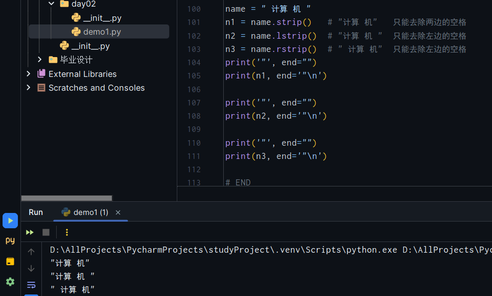

# Python基础-day2

## 上节回顾

-   安装`Python`解释器
-   运行`Python`代码 
    -   交互式
    -   文件式
-   系统环境变量
-   `IDE,pycharm`
    -   项目(文件夹)
    -   文件(代码文件)
    -   右键点击run运行代码
-   `Python`语法
    -   编码 文件是以什么编码保存的就要以什么以什么编码打开
    -   计算机存储的所有数据都是`0101`
    -   输入输出
    -   数据类型 
        -   整型 `int`
        -   字符串 `str`
        -   布尔 `bool`
    -   变量
        -   规范
        -   补充/建议(潜规则)
            -   见名知意 不要学拼音
            -   小驼峰:多个单词使用小驼峰  比如: `user_age`
-   条件语句
    -   注意冒号和缩进

##1. 条件语句补充

### 1.1 基本语句

```
if 条件:
	...
else:
    ...
```

### 1.2 多条件

```python
if 条件1 :
    xxx
elif 条件2 :
    xxx
elif 条件三 :
    xxx
else:
    xxx
```

注意:所有条件中的`else`都可以省略

### 1.3 嵌套

此处省略三万字

## 2. `while `循环

### 2.1 基本格式

```python
while 条件:
    ...
    ...
    ...
```

### 2.2 循环基本使用

```python
i = 0
while i < 10:
    print(i)
```

### 2.3 `break`

```python
break不能独立使用 只能放在循环内部使用 立即跳出循环 并终止循环
```

### 2.4 `continue`

```python
continue也是只能放在循环里面 不能单独使用 跳出这一次循环并开始下一次循环
```

## 3. 字符串格式化

### 3.1 `format`(推荐)

```python
# 占位符:

text= '我的名字叫{0},今年{1}岁'.format("计算机", 20)
print(text)
```

```python
# 占位符:

text = '我的名字叫 {0} ,就是 {0} 的 {0},今年 {1} 岁'.format("计算机", 20)
print(text)
# 我的名字叫 计算机 ,就是 计算机 的 计算机,今年 20 岁
```

```python
# 占位符:

text = '我的名字叫 {0} ,就是 {0} 的 {0},今年 {1} 岁 {0}'.format("计算机", 20)
print(text)
# 我的名字叫 计算机 ,就是 计算机 的 计算机,今年 20 岁 计算机
```

```python
text = '我的名字叫{},我今年{}岁,我爱吃{}'.format("计算机", 20, 'Apple')
print(text)
```

```python
# 比较常用
tpl = "我的名字叫{} 今年{}岁"
v1 = tpl.format("计算机", 19)
v2 = tpl.format("电脑", 20)
print(v1)
print(v2)
```

```python
text = '我的名字叫{name},我今年{age}岁,我爱吃{food}'.format(name="计算机", age=20, food='Apple')
print(text)
```

### 3.2 `%` 

```python
text = '我的名字叫 %s ,今年 %d 岁' % ('计算机', 19)
print(text)
```

```python
text = '我的名字叫 %s ,今年 %d 岁' 
v1 = text % ('计算机', 19)
print(v1)
```

### 3.3 `f-string` `python3.6`以后才有

```python
name = "计算机"
age = 10
text = f'我的名字叫{name}, 我今年{age}岁'
print(text)
```

## 4. 运算符(特殊)

-   算数运算符

-   比较运算符

    ```python
    >
    >=
    <
    <=
    ==
    != (python现已不支持<>)
    ```

-   赋值运算符

    ```python
    =
    +=
    *=
    -*
    /=
    %=
    ```

-   成员运算

    ```python
    text = '日本人不是人'
    v1 = '日本' in text
    v2 = '俄罗斯' in text
    ```

-   逻辑运算

    ```python
    与 and
    或 or
    非 not
    ```

-   关于逻辑运算符的一些特别应用

    -   一般:

        ```python
        v1 = 条件 and/or 条件
        ```

    -   高级用法:**<u>整体结果取决于哪个值,那么就是这个值.</u>** 很少写,面试题

        ```python
        '''
        值 and 值
        
        逻辑运算的结果取决于哪个值,结果等于那个值 
        拿 2 and 4 举例,
        首先判断2,为真,
        	那么只要and后面的值为真,那么就为真,那么值就是后面那个值.
        	如果and后面的值为假,那么就为假,那么值就为前面的那个值.
        	(即前面一个为真以后,and判断的整个语句取决于后面那个值)
        '''
        ```

        ```python
        # v1 = 值 and/or 值
        
        v1 = 1 and 2
        v2 = 2 and 4
        print(v1)
        print(v2)
        
        # 运行结果:
        2
        4
        ```

        ```python
        v1 = 1 and 2
        v2 = 2 and 4
        print(v1)
        print(v2)
        
        v3 = 0 and 1
        v4 = 1 and 0
        print(v3)
        print(v4)
        
        # 运算结果
        2
        4
        0
        0
        ```
        
        ```python
        v1 = 1 and 2
        v2 = 2 and 4
        print(v1)
        print(v2)
        
        v11 = 2 and 1
        v12 = 4 and 2
        print(v11)
        print(v12)
        
        v3 = 0 and 1
        v4 = 1 and 0
        print(v3)
        print(v4)
        
        # 运算结果
        2
        4
        1
        2
        0
        0
        ```
        
        ```python
        v1 = 6 and 9------------------------------------------------------------------>    9
        v1 = 0 and 1------------------------------------------------------------------>    0
        v1 = 88 and 0----------------------------------------------------------------->    0
        v1 = "" and 9----------------------------------------------------------------->    ""
        v1 = "计算机" and "专业"------------------------------------------------------>    "专业"
        
        v1 = 1 or 2------------------------------------------------------------------->    1
        v1 = 0 or 2------------------------------------------------------------------->    2
        v1 = 1 and 8 or 9 and 10 or 11 or 12 and 0 or "" and "计算机"------------------>    8
                8   or    10     or 11 or     0      or  ""  
                     8           8       8       8   
        ```
        
        
        
        ```python
        # 低级写法:
        name = 19
        if bool(name):
            v1 = name
        else:
            v1 = 666
            
        # 高级写法:
        name = 19
        v1 = name or 666
        ```

##5. 计算机中的一些基础概念

### 5.1 进制

计算机底层全都是`01010101010101`(二进制)

在`python`中转换进制:

```python
# 二进制  :  0b000111
# 八进制  :  "0o311"
# 十六进制:  "0x256c"

# 进制转换：
data = 238  # 十进制
bin(data)   # 二进制
oct(data)   # 八进制
hex(data)   # 十六进制

# 其他进制转换为十进制：
d1 = int("0b11101110", base=2)
d2 = int("0o356", base=8)
d3 = int("0xee", base=16)
```


以十进制为中介转换

### 5.2 计算机中的单位

`8G 1T 300M`

-   `b` `(bit)` 位/比特

-   ```python
    0    1位
    1    1位
    ```

-   `B` `(Byte)` 字节

    ```python
    1000 0101			   1个字节
    0000 1111	0010 0101	两个字节
    ```

-   `KB` 千字节

-   `M` 兆

-   `MB` 兆字节

-   `G` 千兆

-   T 万亿

-   `PB`

-   ...

-   假设：办理了`1G`套餐：
    -   `(1024 * 1024 * 8)` 个`bit`
    -   一个汉字，占`2B` -> `16bit`
    -   那么`1G`能发多少个汉字？ `(1024 * 1024 * 8) / 16`

### 5.3 编码

编码 文字与`0101`的对照表

#### 5.3.1 `ASCII`编码

-   `256`个对应关系
-   在`ASCII`码中使用一个字节（`8`位）表示一个符号
-   只能有`256`种可能

#### 5.3.2 `GBK`和`GBK-2312`

-   `GBK-2312`   :   1980年

-   `GBK`        :   包含中日韩等文字 1995年

#### 5.3.3 `unicode`(万国码)

-   `ucs2`    :    用固定的两个字节表示二进制和文字的对应关系 `2 ** 64 = 65535` 

-   `ucs4`    :    用固定的四个字节表示二进制和文字的对应关系 `2 ** 32 = 429467296`

#### 5.3.4 `UTF-8`编码

对`unicode`进行压缩，并且不使用固定字节的编码。

<u>**写代码的时候一定要保存为`UTF-8`编码！**</u>

一般UTF-8对于中文压缩以后，用三个字节表示。

#### 5.3.5 `python`

```python
name = "计算机"                 ->     字符串类型 在Python内部 使用unicode编码存储(ucs4)
data = name.encode('utf-8')     ->     字节类型  使用UTF-8编码存储
```


```python
b'\xe8\xae\xa1 \xe7\xae\x97 \xe6\x9c\xba'
        计           算           机
```

**⚫⚫⚫**<u>在`Python`开发中，以后要做文件存储或者网络传输的时候，不能直接使用字符串，而是需要将字符串压缩成`utf-8`的编码的字节，然后再来传输和存储。</u>

```python
# 在文件中写入字符串
name = "计算机"

# 打开文件
file = open("name.txt", mode='ab')

# 写入内容 
file.write(name.encode('utf-8'))

# 关闭文件
file.close()
```

-   文件编码：

    -   我们自己写的都是文本，按照某种编码存储编码，那么就用的是某一种编码。

    -   读取文件：要读取文件内容，我们需要用同样的编码打开才可以。

    -   `Python`解释器：保存和打开文件的时候，用的是`utf-8`

    -   `Python`将代码读取到内存之后，需要进行语法和词法分析，一定会有不同的数据类型之分；

        ```python
        name = "计算机"   ->   字符串 去unicode对应关系中找
        age = b"aa000"   ->   字节   去UTF-8对应的关系中找
        ```

## 6. 重新学习数据类型(重要)

```python
布尔值   bool
整型     int
字符串   str
列表     list  []
元组     tuple ()
字典     dict  {}
```

```python
n1 = "root"
res = n1.upper()  # res -> "ROOT"
```

```python
list_1 = [1, 2, 3, 4]
list1.append(4)  # 在列表尾部追加一个元素

list_2 = [11, 22, 33]
list_2.append(44)  # 在列表尾部追加一个元素
```

`attention`: 将每个类型的方法封装到类型里面

### 6.1 字符串

#### 6.1.1 如何定义字符串

```python
name = "计算机"
email = "123456@123.com"
```

注意：**<u>字符串是一个不可变的类型</u>**

#### 6.1.2 独有的功能

`upper` `lower` `isdecimal` `strip` `lstrip` `rstrip` `replace`

```python
data = "root"
res = data.功能名()
# 但是，data的值还是原来的值，不会变
```

-   大写 小写

    ```python
    name = "root"
    res = name.upper()  # "ROOT"
    
    name = "Root"
    res = name.lower()  # "root"
    ```

-   `isdecimal` 判断字符串是不是整数

    ```python
    data = "999"
    v1 = int(data)
    
    data = "计算机"
    v1 = int(data)  # 报错
    ```

    -   ❗❗❗关于作用域: 
        -   在`java`中 以**代码块为作用域** 在一个代码块中创建的代码块，那么在代码块外不能访问
        -   在`Python`中，**以函数为作用域**  函数执行到那个点以后创建了代码后 才会创建变量，如果代码执行不到，那么不会创建这个变量

-   `startswith` 和 `endswith` 判断一个字符串是以…开头或者以…结尾

    ```python
    name = "计算机科学与技术"
    
    v1 = name.starswith("计算")  # True
    v2 = name.endswith("技")  # False
    ```

-   `strip/lstrip/rstrip` 去除空白（包含回车 换行 制表符"\t"）

    ```python
    name = " 计算 机 "
    name.strip()      # "计算 机"   只能去除两边的空格
    name.lstrip()     # "计算 机 "  只能去除左边的空格
    name.rstrip()     # " 计算 机"  只能去除左边的空格
    ```

    

-   `replace` 替换，将一个字符串中指定 的内容替换成其他的东西

    ```python
    text = "计算机科学与技术"
    new_text = text.replace("计算机", "软件")
    
    print(text)
    print(new_text)
    ```

    

-   练习题：

    ```python
    # 让用户输入一段文本 如果出现 计算机，替换成***
    
    text = input("请输入您的评论\n>>>")
    new_text = text.replace("计算机", "***")
    print(new_text)
    ```

-   接下来见`day3`
