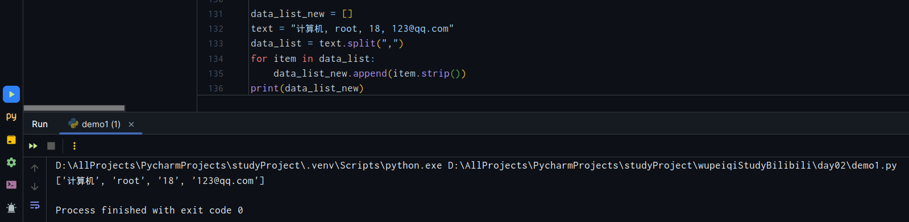
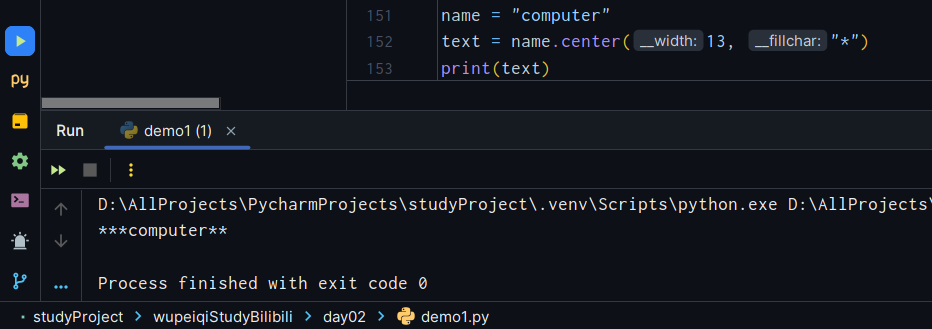
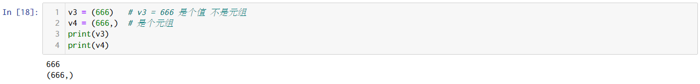
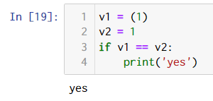

# 数据结构-`day3`

## 1. 字符串类型 `str`

### 1.1 定义

上个文件找

### 1.2 独有功能

-　大写　       `upper`
-　小写　       `lower`
-　是否是数字 　`isdecimal`
-　替换         `replace`
-　去空白       `strip`

-   切割 `split` 切割后得到的是一个列表

    ```python
    file_name = "hello.py"
    
    # 如何获得扩展名
    data_list = file_name.split(".")  # 根据传进去的参数分割
    print(data_list[-1])
    ```

    ```python
    text = "计算机, root, 18, 123@qq.com"
    data_list = text.strip().split(",")
    ```

    

-   字符串拼接

    -   `+`运算符
    -   字符串格式化
    -   列表里面有很多字符串，想让他们按照某个连接符拼接起来

    ```python
    data_list = ["计算机", "科学", "与", "技术"]
    new_data = " ".join(data_list)
    print(new_data)
    #　计算机 科学 与 技术
    ```

-   字符串转换成字节类型 `encode()`

    ```python
    字符串    Unicode
    字节      utf-8
    ```

    ```python
    data = "computer"
    v1 = data.encode("utf-8")
    print(v1)
    # b'computer'
    ```

    ```python
    data = "哈哈"
    v1 = data.encode("utf-8")
    print(v1)
    # b'\xe5\x93\x88\xe5\x93\x88'
    ```

    ```python
    data = "哈哈"
    v1 = data.encode("utf-8")
    v2 = v1.decode("utf-8")
    print(v1, v2)
    
    #　b'\xe5\x93\x88\xe5\x93\x88' 哈哈
    ```

-   长度补足 `center` `ljust` `rjust` 让内容放中间/左边/右边 自己想补啥就补啥

    ```python
    name = "computer"
    text = name.center(13, "*")
    print(text)
    ```

    

    ```python
    name = "computer"
    text = name.rjust(13, "#")
    print(text)
    # computer#####
    ```

    ```python
    name = "computer"
    text = name.rjust(13, "#")
    print(text)
    # #####computer
    ```

-   长度的补足 只能在左边补`0`  `zfill()` 二进制补0用的比较多

    ```python
    name = "computer"
    v1 = name.zfill(10)
    print(v1)
    # 00computer
    ```

### 1.3 公共功能

1.   长度 `len`

     ```python
     name = "cs"
     print(len(name))
     # 2
     ```

2.   索引 `[]`

     ```python
     text = "computer"
     print(text[1])   # o
     print(text[-2])  # e
     ```

3.   切片 `[::]` 字符串是不可变的！ 记住喔

     ```python
     text = "computer"
     text[0:2]  # 前闭后开 co
     text[2:5]  # 前闭后开 mpu
     text[2:-1] # 前闭后开 mpute
     text[2:]   # 前闭后开 mputer
     text[:-1]  # 前闭后开 compute
     text[:]    # 全部     computer
     ```

4.   循环 `for/while` 循环

     ```python
     name = "computer science"
     
     for item in name:
         print(item)
         
     count = 0
     while count < len(name):
         print(name[count])
         count += 1
     
     ```

     ```python
     # range 函数: 生成一个数字列表 左闭右开 一般和for循环结合使用
     v1 = range(5)         # v1 = [0, 1, 2, 3, 4]
     v1 = range(5, 10)     # v1 = [5, 6, 7, 8, 9]
     v2 = range(5, 10, 2)  # [5, 7, 9]
     v2 = range(10, 0, -1) # [10, 9, 8, 7, 6, 5, 4, 3, 2, 1]
     ```

     ```python
     for i in range(1, 100):
     	print(i, end=" ")
     ```

5.   练习题 略

## 2. 列表

有序且可变的容器，元素可以使多个不同的数据类型。

### 2.1 定义

```python
data_list = [1, 2, "计算机"， 2.5]
```

```python
data_list = []
data_list.append(1)
```

注意：列表是可变类型，绝大部分功能是对原列表进行操作

### 2.2 独有功能

1.   追加 `append`

     ```python
     data_list = []
     data_list.append(11)
     data_list.append('计算机')
     ```

2.   插入 `insert` 插入到具体的位置

     ```python
     user_list = ["计算机", "电脑", "计算器"]
     user_list.insert(1, "超级计算机")
     print(user_list)  # ['计算机', '超级计算机', '电脑', '计算器']
     ```

3.   按值删除 `remove` **如果有重复的值 只会删除从左到右第一个匹配的值**  **如果没有找到值，则会报错** —— 可以利用`in`关键字判断是否存在值。

     ```python
     data_list = ['计算机', '超级计算机', '电脑', '计算器']
     data_list.remove('计算机')
     print(data_list)  # ['超级计算机', '电脑', '计算器']
     ```

     ```python
     import random
     random.choice(data_list)  # 去列表里面随机抽取一个值 不会改变列表的值
     ```

4.   按索引删除 `pop` 如果`pop`里面不传参数，那么删除最后一个元素。返回删除的元素值

     ```python
     data_list = ['计算机', '超级计算机', '电脑', '计算器', 'computer', 'science']
     delete_data = data_list.pop(2)
     print(data_list) 
     print(delete_data) 
     '''
     ['计算机', '超级计算机', '计算器', 'computer', 'science']
     电脑
     '''
     ```

5.   清空列表 `clear`

     ```python
     data_list = ['计算机', '超级计算机', '电脑', '计算器', 'computer', 'science']
     print(data_list.clear())
     ```

6.   列表元素排序 `sort`

     ```python
     data_list = [10, 2, -1, 92, 10, 25, 65]
     data_list.sort()  # 从小到大排序
     print(data_list)
     data_list.sort(reverse=True)  # 从小到大排序
     print(data_list)
     
     """
     [-1, 2, 10, 10, 25, 65, 92]
     [92, 65, 25, 10, 10, 2, -1]
     """
     ```

     ```python
     data_list = ['计算机', '科学', '技术']
     data_list.sort()
     print(data_list)
     # ['技术', '科学', '计算机'] —— 基于unicode排序
     ```

### 2.3 公共功能

-   长度 `len(list_name)`
-   索引 从`0`开始 获取值 列表是可变类型
-   删除 `del user_list[2]`

-   切片 

    ```python
    data_list = []
    data_list[0:4]
    data_list[0:-1]
    data_list[2:]
    data_list[:]
    
    # 下面这样也是可以的
    data_list = list()
    print(data_list)  # []
    ```

-   修改

    ```python
    user_list = [11, 22, 33, 44]
    user_list[0:2] = [100, 200, 300, 400]
    user_list  # [100, 200, 300, 400, 33, 44]
    ```

-   删除

    ```python
    del user_list[0:2]
    ```

-   `for`循环

    ```python
    user_list = [11, 22, 33, 44]
    for item in user_list:
        对item做操作
        
    for i in range(0, len(user_list)):
        对user_list[i]操作
    ```

### 2.4 **嵌套**

```python
data_list = [
    "computer",
    "science",
    125,
    259,
    [11, 22, 33, [10, 20, 30]], 
    [["good", "job", "friends"], 44, 55, 66], 
    [77, 88, 99]]
print(data_list)  
# ['computer', 'science', 125, 259, [11, 22, 33, [10, 20, 30]], [['good', 'job', 'friends'], 44, 55, 66], [77, 88, 99]]
```

```python
# 取值
data_list[0]
data_list[0][-1]
data_list[1]
data_list[0][2]
data_list[1][2]
data_list[-2][2[-2]]

# computer
# r
# science
# m
# i
# job
```

### 练习题

用户注册，提示用户输入用户名和密码如果输入了`Q/q`终止。

使用`list`数据结构

## 3 元组

有序且不可变的容器

```python
data = (11, 22, 33)
print(data)
```

### 3.1 定义

**元组元素不允许被替换 长度也不允许被修改 但是元组里面如果有可变元素，那这些可变元素是可以改变的。**

### 3.2易错点

```python
v1 = (11, 22)   # 正确 元组
v2 = (33, 44,)  # 正确 元组 
```

```python
v3 = (666)   # v3 = 666 是个值 不是元组
v4 = (666,)  # 是个元组
```





```python
v1 = ( (1), (2), (3) )
v2 = (1, 2, 3)
v3 = ( (1,), (2,), (3,) )
print(v1)
print(v2)
print(v3)
# (1, 2, 3)
# (1, 2, 3)
# ((1,), (2,), (3,))
```

### 3.3 独有功能

无

### 3.4 公共功能

-   长度 `len`
-   索引
-   切片 注意元组不可变
-   `for`循环 和列表`list`一样

### 3.5 嵌套


