# 数据结构-day4

*   数据类型
    *   **字符串 列表 元组**
    *   集合 **字典** 整型 布尔 None 浮点型 字节类型
*   文件操作
*   函数入门

## 1. 字典类型

定义：字典是一个**无序**且**键不重复**且**元素只能是键值对**的**可变**容器。

```python
info = {'k1': 111, 'k2':999}
```

*   键不能重复 重复会被覆盖

*   ！！！字典的**键必须是可哈希的类型** 但是值可以随便写！
    ```python
    可哈希的     : int bool str tuple
    不可哈希的   : 列表 字典 
    ```

*   ！！！怎么测试是否可哈希：
    ```python
    v1 = 123
    res = hash(v1)
    print(res)
    
    v2 = 'computer'
    res = hash(v2)
    print(res)
    
    v3 = (11, 22, 33)
    res = hash(v3)
    print(res)
    
    # 运行结果：
    """
    123
    8027911955625540668
    -5452407625778563439
    """
    ```

    ```python
    v1 = [123, 456]
    res = hash(v1)
    print(res)
    ```

    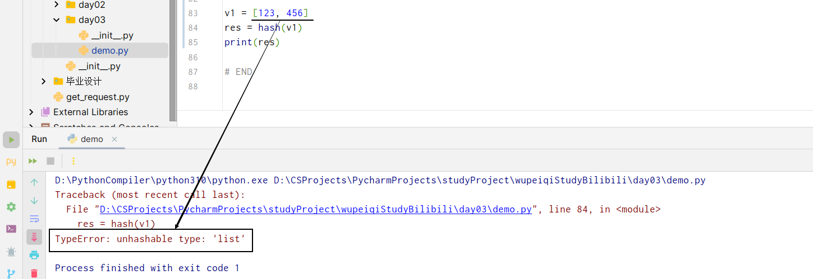

-   字典：在Python3.6之前无序，在3.6之后无序。

### 1.1 定义字典

```python
data = {"k1": 1, 'k2': 2}
```

```python
info = {
    'name': 'computer',
    'age': 10,
    'status': True,
    'hobby': ['sing', 'dance', 'rap', 'basketball']
}
```

```python
info = {}
```

存储信息的时候：

```python
data = {
    "status":True,
    "data": [11, 22, 33]
}

data = {
    "status": False,
    "data": []
}
```

### 1.2 字典独有功能

1.   获取值 字典名.get(“键名”, “查不到后返回的值”)

     ```python
     info = {
         'name': 'computer',
         'age': 10,
         'status': True,
         'hobby': ['sing', 'dance', 'rap', 'basketball']
     }
     # 在字典中根据键获取对应的值
     v1 = info.get("name")
     
     # 若没有 返回空（None）
     v2 = info.get("email")
     
     # 如若找不到，返回指定类型 若能找到 直接返回获取到的值
     v3 = get("email", "xxx")
     ```

     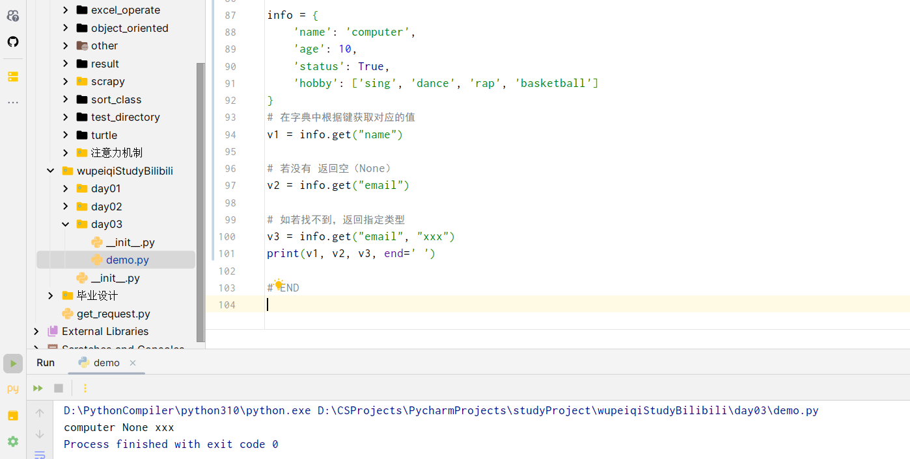

     ```python
     # 案例：使用字典存储用户信息
     user_dict = {
         "computer": '111',
         "science": '222',
         "technology": '333'
     }
     
     user_name = input("请输入用户名")
     user_pwd = input("请输入密码")
     
     # 判断键所对应的值是否存在
     db_password = user_dict.get(user)
     
     if db_password is None:
         print("用户名不存在")
     else:
         if db_password == user_pwd:
             print('登录成功')
         else:
             print('登录失败')
     ```

2.   键 字典名.keys()
     ```python
     info = {
         'name': 'computer',
         'age': 10,
         'status': True,
         'hobby': ['sing', 'dance', 'rap', 'basketball']
     }
     
     # 获取所有的键
     dict_object = info.keys()  # 返回值是一个高仿的列表 支持for循环
     print(dict_object)
     # dict_keys(['name', 'age', 'status', 'hobby'])
     
     for item in info.keys():
         print(item)
     ```

     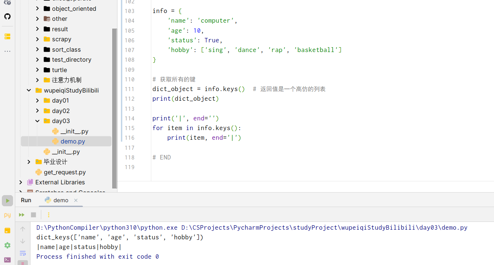

     ```python
     info = {
         'name': 'computer',
         'age': 10,
         'status': True,
         'hobby': ['sing', 'dance', 'rap', 'basketball']
     }
     v1 = list(info.keys())  # 将这个高仿的列表转换成列表
     print(v1)
     
     # ['name', 'age', 'status', 'hobby']
     ```

3.   获取所有的值 字典名.values()

     ```python
     info = {
         'name': 'computer',
         'age': 10,
         'status': True,
         'hobby': ['sing', 'dance', 'rap', 'basketball']
     }
     v1 = list(info.values())  # 将这个高仿的列表转换成列表
     print(v1)
     ```

4.   获取所有的键、值
     ```python
     info = {
         'name': 'computer',
         'age': 10,
         'status': True,
         'hobby': ['sing', 'dance', 'rap', 'basketball']
     }
     print(info.items())  # 高仿的列表
     # dict_items([('name', 'computer'), ('age', 10), ('status', True), ('hobby', ['sing', 'dance', 'rap', 'basketball'])])
     
     for item in info.items():
         print(item)
         
     # 牛逼的来啦！！！解包
     for key, value in info.items():
         print(key, value)
     # 
     ```

     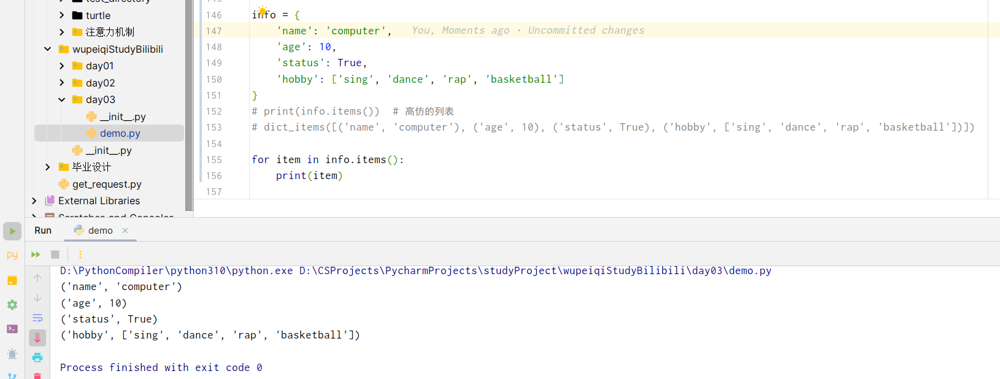

​	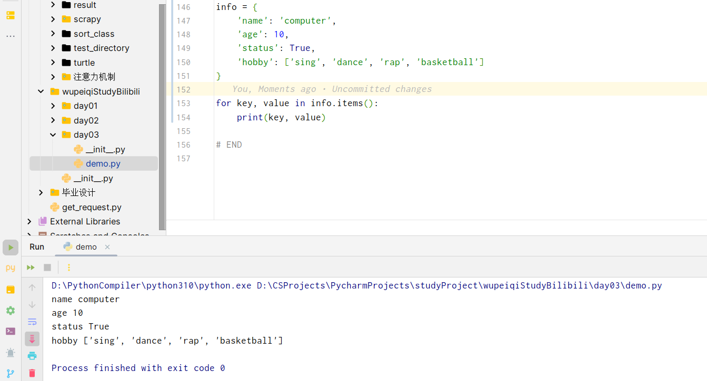列表的解包：

```python
# 列表的解包
v1, v2 = [11, 22]

# 元组的解包
v1, v2 = (11, 22)
```

### 1.3 公共功能

1.   长度：有多少个键值对 就有多长

     ```python
     info = {
         'name': 'computer',
         'age': 10,
         'status': True,
         'hobby': ['sing', 'dance', 'rap', 'basketball']
     }
     
     data = len(info)
     print(data)  # 4
     ```

2.   索引

     ```python
     info = {
         'name': 'computer',
         'age': 10,
         'status': True,
         'hobby': ['sing', 'dance', 'rap', 'basketball']
     }
     
     data = info["name"]
     print(data)  # computer
     
     # 如果写一个不存在的键，那么程序就会报错 和 info.get("xxx")薛薇优点不一样
     v2 = info["name"]
     ```

3.   修改 添加 删除
     ```python
     info = {
         'name': 'computer',
         'age': 10,
         'status': True,
         'hobby': ['sing', 'dance', 'rap', 'basketball']
     }
     
     # 修改
     info["age"] = 100
     # 新增
     info["email"] = 'xxxxxx@xx.com'
     # 删除(若键不存在 那么删除会报错)
     del info["age"]
     
     # 判断！！！键！！！是否存在
     if 'age' in info:
         print('yes')
     else:
         print('不在')
     ```

3.   for循环

     ```python
     # 循环
     for item in info.keys():
         print(item)
         
     for item in info.values():
         print(item)
     
     for k, v in info.items:
         print(key, value)
     ```

### 1.4 练习题

1.   对用户输入的数据进行处理，并构成字典：
     ```python
     info = { }
     print("请输入信息，输入Q/q终止")
     while True:
         text = input(">>> ")  # computer, 123
         if text.upper() == 'Q':
             break
         else:
             string = text.split(",")[0]
             number = int(text.split(",")[1])
             info[string] = number
     ```

2.   快递信息分拣 获取所有城市 将城市信息保存到一个字典中 每个地区对应一个列表，对应这个地区的人

     ```python
     addr_list = [
         ["王*非", "北京市,海淀区","北京市海淀区xxx"],
         ["李*龙", "上海市,浦东新区","上海市浦东新区xxx"],
         ["卜*瑜", "北京市,顺义区","当代北辰悦moma"],
         ["赵*雪", "江苏省,苏州区", "苏州大学"],
     """    ['朱*锴'， ‘上海市,浦东新区','川沙新镇华川家园33号楼503' ],
          ['陈*盼'，'浙江省'，'杭州市'， '闲林街道，西溪华东园，十幢- -单元401。']['司*鹏'，‘河南省，鹤壁市’， '淇滨大道310号鹤壁京立医院' ],
     	['聂*睿', ‘河北省，石家庄市'，，中山路勒泰中心写字楼b座11层']，['张*'， 辽宁省,本溪市'， ，明兴丽城九号楼四单元' ],
     	['冉*晗', '河北省，石家庄市'，，体育南大街385号']，
     	['高*杰', '北京市，朝阳区'，'广渠路42号院3号楼，408']，
     	['李*国', '安徽省,合肥市'， ，新站区淮合花园'],
     	['常*源', '江苏省,南京市'，‘白下路242号，南京市红十字医院，放射科' ],['张*玉'，'河北省，沧州市’，'新居然家居广场']，
     	['王*川','上海市,奉贤区'，'南桥镇贝港七区' ],
          ['冀*庆','河北省，保定市'，‘河北大学坤兴园生活区'],
     	['胡+晨',‘浙江省，宁波市'，‘浙江省宁波市江东区中山首府A座2004室']，['尹*婷' '湖北省,武汉市'，‘武汉大学信息学部']，
     	['李*东','辽宁省,大连市’，'大关- -街3号3-3-1']，
     	[ '张*',天津市，河西区'，'隆昌路94号(天津科技馆) '],
     	[ '刘+', ，湖北省,黄冈市'， '城关镇']
     """
     ]
     
     info = {}
     for item in addr_list:
         name = item[0]
         city = item[1].split(",")[0]
         if city not in info:
             info[city] = []
             info[city].append(name)
         else:
             info[city].append(name)
             print(info)
     # {'北京市': ['王*非', '卜*瑜'], '上海市': ['李*龙'], '江苏省': ['赵*雪']}
     ```

     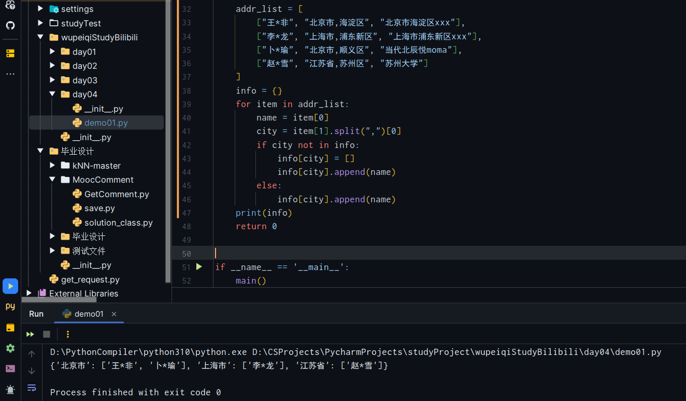

### 1.5 字典的扩展-嵌套

-   容器：元组 列表 字典（键必须是可哈希的-字符串 整型 元组 布尔）

### 1.6字典的扩展-为什么键必须是可哈希的——从底层看

**由于底层存储原理，导致根据键获取值的速度特别快。**

```python
v1 = [11, 22, 33, 44, 55, 66]
```

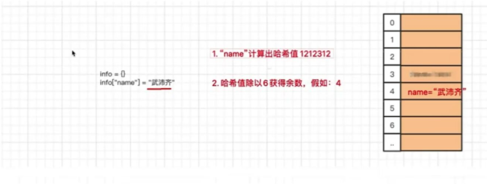

```python
info = {...}

info["name"]
info.get("name")
if "xx" in info:
    pass
```

```python
v1 = [11, 22, 33, 44, 55, 66]
if 44 in v1:
    pass
```

目前不可哈希的只有：列表和字典

### 小结

-   字符串

    -   独有 大小写 去除空白（左右两边） 分割 替换 拼接（join） 字符填充 是否是数字
    -   公共 长度 索引 切片 for循环 in是否包含

-   列表

    -   独有 追加 插入 删除（值） 删除（索引） 清空 排序 
    -   公共 长度 索引（读 删 改） 切片（读 删 改） for循环 in是否包含

-   元组

    -   无独有功能
    -   公共功能 长度 索引 切片 for循环 in是否包含

-   字典

    -   独有 get keys values items

    -   公共 len 索引键（读 删 改 添加） for循环 in是否包含
        ```python
        info = {
            "k1": 123,
            "k2": 456
        }
        ```

## 2. 集合

集合是一个无序 可变 元素必须可哈希 且元素不重复的容器。

### 2.1 定义

```python
v1 = {11, 22, 33, 44, 55}

```

-   无序 无法索引 切片

-   可变
    ```python
    v1 = {11, 22, 33, 44, 55}
    v1.add(66)
    print(v1)
    # {11, 22, 33, 44, 55, 66}
    ```

-   元素不重复

-   元素必须是可哈希的
    ```python
    # 不可哈希：list dict set
    # 其他的可哈希
    ```

-   什么时候用集合？

    -   只有不希望重复的数据集合的时候
    -   通过网络爬虫技术从网上爬图片，维护一个集合，维护所有已经下载过的地址

-   注意事项：定义空值：
    ```python
    # define None list
    v1 = []
    v2 = list()
    
    # define None tuple
    v3 = ()
    v4 = tuple()
    
    # define None dict
    v5 = {}
    v6 = dict()
    
    # define None set
    v7 = set()
    ```

### 2.2 独有功能

1.    添加元素 add()

     ```python
     v1 = {11, 22}
     v1.add(33)
     
     v1 = set()
     v1.add(111)
     v1.add(222)
     ```

2.    删除元素 discard() **如果不存咋，不会报错** 与列表的remove不同
     ```python
     v1 = {11, 22}
     v1.discard(11)
     ```

3.    交集 intersection() — 生成一个不同于任意两个集合的新集合
     ```python
     v1 = {11, 22, 33, 44}
     v2 = {11, 22, 55, 66}
     
     # 方式1
     v3 = v1.intersection(v2)
     print(v3)  # {11, 22}
     
     # 方式2
     v4 = v1 & v2
     print(v4)
     ```

4.    并集
     ```python
     v1 = {11, 22, 33, 44}
     v2 = {11, 22, 55, 66}
     
     # 方式1
     v3 = v1.union(v2)
     print(v3)  # {11, 22}
     
     # 方式2
     v4 = v1 | v2
     print(v4)
     ```

5.    差集
     ```python
     v1 = {11, 22, 33, 44}
     v2 = {11, 22, 55, 66}
     
     # v1里面有 v2里面没有
     s1 = v1.difference(v2)  # v1中有但v2中没有的值
     s2 = v1 - v2
     print(s1)
     print(s2)
     ```

### 2.3 公共功能

1.   长度

     ```python
     v1 = {11, 22, 33, 44}
     
     data = len(v1)
     print(data)  # 4
     ```

2.   for循环

     ```python
     v1 = {11, 22, 33, 44}
     
     for item in v1:
         print(item)
     ```

3.   in是否包含(效率高 速度快 => 字典查询键的速度一样)
     ```python
     v1 = {11, 22, 33, 44}
     
     if 11 in v1:
         pass
     else:
         pass
     
     
     ```

### 2.4 存储

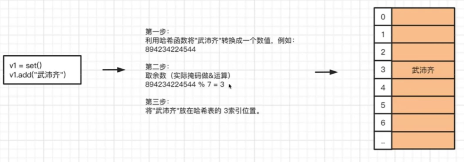

## 3. 容器之间的转换

-   list
    ```python
    v1 = [11, 22, 33, 44]
    ```

-   tuple
    ```python
    v2 = (11, 22, 33, 44)
    ```

-   set
    ```python
    v3 = {11, 22, 33, 44}
    ```

-   三者之间可以相互转换，转换的原则：想转换谁，就把谁的英文名字包裹一下。
    ```python
    v1 = [11, 22, 33, 44]
    res = tuple(v1)
    print(res)  # (11, 22, 33, 44)
    ```

-   当元组或者列表转换成集合时，会自动去重。

## 4. None类型

None表示空值。

```python
# v1设置为空
v1 = None
v2 = None
v3 = None

# 再从内存创建一个字符串 让v1指向字符串
v1 = "computer"
```

```python
# v2设置为空字符串
v4 = ""
v5 = ""
v4 = "computer"
```

以上这两者的区别是：初始化的时候，尽量使用None初始化，这样会节省内存。在效果上没区别

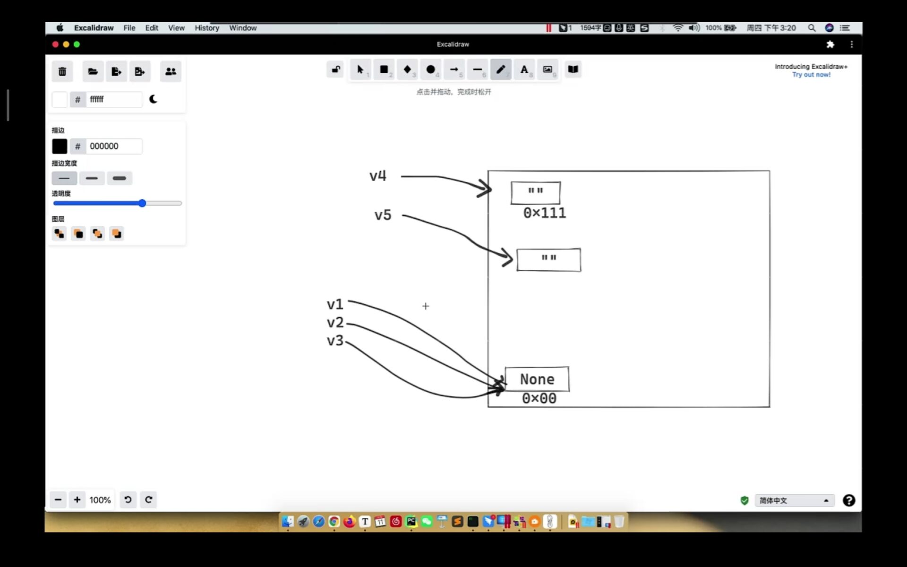

## 5. 布尔类型

真假 True/False

其他的很多类型的值会转换为布尔值，有真有假

-   转换后为False：
    ```python
    0          ->         False
    ""         ->         False
    []         ->         False
    ()         ->         False
    set()      ->         False
    {}         ->         False
    None       ->         False
    ```

-   其他的转换为布尔后，都为False

-   如果将布尔值放在条件或者循环语句后面：
    ```python
    if True:
        pass
    while True:
        pass
    if 1 > 2:
        pass
    ```

    ```python
    # 内部会自动转换为布尔值 True/False
    if "computer":
        pass
    
    while 2:
        pass
    ```

## 6. 浮点型(float)

浮点型就是我们常说的小数。

```python
v1 = 3.24
v2 = 9.8
```

由于在计算机底层对浮点型数据的存储原理，有时候浮点型获取的值会不太精确。——这与语言无关，每种语言都有这个问题。

```python
v1 = 0.1
v2 = 0.2

print(v1 + v2)
```

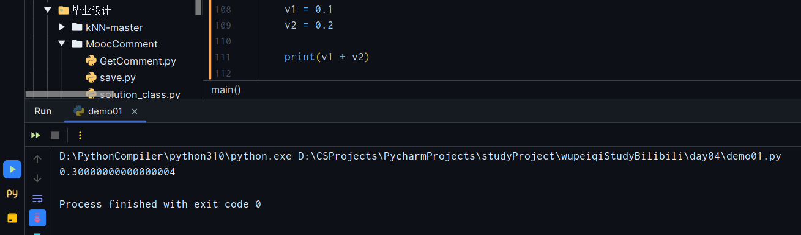

```python
v1 = 0.3
v2 = 0.2

print(v1 + v2)
```

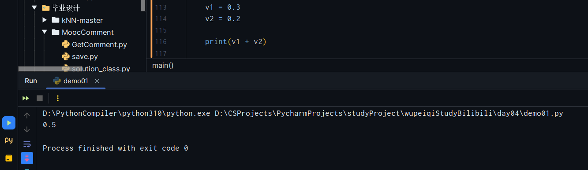

-   如果要做特别精确的计算的时候，使用Python的decimal模块。
    ```python
    import decimal
    v1 = decimal.Decimal("0.1")
    v2 = decimal.Decimal("0.2")
    print(v1 + v2)
    ```

## 7. 字节类型 bytes

```python
name = "计算机"                #       str字符串，底层是unicode编码
data = name.encode("utf-8")    #       bytes字节，底层是UTF-8编码

print(data)  # b'\xe8\xae\xa1\xe7\xae\x97\xe6\x9c\xba'
```

```python
name = "计算机"                #       str字符串，底层是unicode编码
data = name.encode("gbk")      #       bytes字节，底层是gbk编码

print(data)  # b'\xbc\xc6\xcb\xe3\xbb\xfa'
```

如果以后获得了一个字节，字节.decode转换为字符串.

```python
name = "计算机"                #       str字符串，底层是unicode编码
data = name.encode("gbk")      #       bytes字节，底层是gbk编码
old = data.decode("utf-8")
print(data)  # 计算机
```

## 8. 文件操作

普通的文本文件。

三个基本步骤

```python
# 打开
# 操作
# 关闭文件
```

-   写文件
    ```python
    # 打开文件
    # -    "unicome.txt"     文件路径
    # -    mode="wb"         以写文件的模式打开
    file_object = open("unicome.txt", mode="wb")  # wb模式 如果文件不存在则会创建文件 如果存在则默认将文件内容清空
    
    # 写内容
    name = "计算机"  # unicode
    file_object.write(name.encode("utf-8"))
    file_object.write(name.encode("utf-8"))
    
    # 关闭文件
    file_object.close()
    ```

    练习题：注册用户，每次注册一个用户，写入一行

    ```python
    # user = input('username')
    # pwd = input("password")
    
    with open("unicome.txt", mode="wb") as file_object:
        while True:
            user = input("username")
            pwd = input("password")
            if user.upper() == "Q":
                break
                file_object.write((user + " " + pwd + "\n").encode("utf-8"))
    ```

    ```python
    with open("unicome.txt", mode="wb") as file_object:  # 以写字节模式添加
        while True:
            user = input("username")
            if user.upper() == "Q":
                break
                pwd = input("password")
                line = "{} {}\n".format(user, pwd)
    
                # 写到内存中的缓冲区 还没有写到硬盘 关闭后才会写到硬盘
                file_object.write(line.encode("utf-8"))
    
                file_object.flush()  # 强制将内存中的数据写入到硬盘
    ```

-   追加 
    ```python
    with open("unicome.txt", mode="ab") as file_object:  # 在文件尾部进行追加 如果不存在那么会创建文件
        # 永远写到文件的尾部
        while True:
            user = input("username")
            if user.upper() == "Q":
                break
            pwd = input("password")
            line = "{} {}\n".format(user, pwd)
    
            # 写到内存中的缓冲区 还没有写到硬盘 关闭后才会写到硬盘
            file_object.write(line.encode("utf-8"))
    
            file_object.flush()  # 强制将内存中的数据写入到硬盘
    ```

    -   读

    ```python
    file_object = open("unicome.txt", mode="rb") 
    data = file_object.read()  # 读取文件所有内容
    print(data)
    # b'\xe5\x8d\x9c\xe4\xbc\x9f\xe4\xbb\x95 123\ngood 123456\n123 123456\n'
    
    data_string = data.decode("utf-8")
    print(data_string)
    
    row_list = data_string.split("\n")
    # ['computer 123', 'good 123456', '123 123456', '']
    
    row_list = data_string.strip().split("\n")
    # ['computer 123', 'good 123456', '123 123456']
    file_object.close()
    ```

    如果有100G的文件，那么用上述的模式去读，你8G内存的电脑可以读取100G的文件吗？根本不可能！！！所以在读取大文件的时候，需要一行一行去读。

    ```python
    # 这种方式无法判断文件在哪结束
    file_object = open("unicome.txt", mode="rb") 
    line1 = file_object.readline()
    print(line1)
    
    line2 = file_object.readline()
    print(line2)
    
    file_object.close()
    ```

    ```python
    # 或者你可以使用这种方式读取
    
    for line in file_object:
        line_string  = line.decode("utf-8").strip()  # .strip()去除每一行的换行
        print(line_string)
    ```

    练习题：将文件中的某一块数据读取出来。比如获取企业数据

    ```python
    # 文件内容如下：
    SZ300019,硅宝科技,9.50,+0.53,+5.91%,-6.13%,423.46万,3943.10万,1.55%,24.58,1.65%,31.40亿
    SZ002756,永兴材料,16.18,+0.90,+5.89%,-7.34%,247.83万,3910.01万,1.34%,18.38,2.98%,58.21亿
    SZ002498,汉缆股份,6.11,+0.34,+5.89%,+102.99%,2.01亿,12.04亿,6.05%,43.98,0.62%,202.93亿
    SZ002980,华盛昌,62.41,+3.46,+5.87%,+319.14%,969.65万,5.99亿,29.09%,51.97,-,83.21亿
    SZ002371,北方华创,176.88,+9.80,+5.87%,+101.00%,1006.35万,17.45亿,2.20%,276.58,0.04%,875.76亿
    SZ300139,晓程科技,8.71,+8.48,+5.83%,+0.23%,4423.87万,3.82亿,20.11%,亏损,0.00%,23.84亿
    SZ000636,风华高科,24.51,+1.33,+5.74%,+64.61%,5605.61万,13.61亿,6.26%,71,71,8.00%,219.42亿
    SZ000564,供销大集,4.06,＋日．22,+5.73%,+69.87%,2.98亿,11.89亿,14.86%,亏损,8.08%,244.52亿
    SZ002612,朗姿股份,7.84,+0.42,+5.66%,-19.34%,548.71万,4191.22万,2.31%,1224.17,4.23%,34.69亿
    SH600176,中国巨石,9.39,+0.50,+5.62%,-13.85%,3256.19万,3.02亿,0.93%,16.97,2.14%,328.87亿
    SH603313,梦百合,24.10,+1.28,+5.61%,+14.16%,356.10万,8446.14万,1.05%,21.72,0.00%,82.23亿
    SZ300279,和晶科技,5.49,+8.29,+5.58%,-8.50%,2328.20万,1.31亿,5.33%,亏损,0.00%,24.65亿
    
    
    # 注意，后面有一些空行
    ```

    ```python
    list_ = []
    
    with open("demo.txt", "rb") as fp:
        for line in fp:
            new_line = line.decode("utf-8").strip()
            if new_line != "":
                data = new_line.split(",")[1]
                list_.append(data)
    print(list_)
    # ['硅宝科技', '永兴材料', '汉缆股份', '华盛昌', '北方华创', '晓程科技', '风华高科', '供销大集', '朗姿股份', '中国巨石', '梦百合', '和晶科技']
    ```

    练习题：用户注册和用户登录的功能

    -   注册：输入用户名和密码
    -   登录：和文件中进行比对，看是否对得上

### with上下文：

```python
# 编写文件的时候，可能会关闭文件，这样会导致一些问题，一定要关闭文件——with上下文管理
with open("文件名", "打开模式") as file_object:
    # 这里面进行文件操作，只要在缩进里面，文件夹就会一直打开
# 离开缩进时自动关闭文件
```

### 文件打开模式

```python
rb 读
wb 写
ab 追加
```

-   wb 写
    ```python
    with open("file_path", mode="wb") as fp:
       fp.write("写一些东西".encode("utf-8"))  # 手动压缩
    ```

-   **w 写**

    ```python
    with open("file_path", mode="w", encoding="utf-8") as fp:
       fp.write("写一些东西")  # 此时不用再手动编码压缩，内部自动encode压缩
    ```

-   ab 追加
    ```python
    with open("file_path", mode="ab") as fp:
       fp.write("写一些东西".encode("utf-8"))  # 手动压缩
    ```

-   **a 追加**

    ```python
    with open("file_path", mode="a", encoding="utf-8") as fp:
       fp.write("写一些东西")
    ```

-   rb 读
    ```python
    with open("file_path", mode="rb") as fp:
        data = fp.read()  # 读取到的文件都是内部原始被压缩的之后的utf-8编码的效果
        data.decode("utf-8")
    ```

-   **r 读**

    ```python
    with open("file_path", mode="r", encoding="utf-8") as fp:
        data = fp.read()
    ```

    


