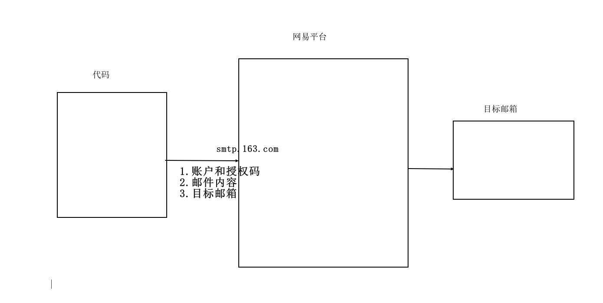

# 函数-`day5`

今日概要：函数

## 1. 初识函数

函数就是一大堆代码的集合，这一堆的代码再起个名字。

```python
# 定义函数
def 函数名():
	...

# 执行函数
函数名()
```

```python
def get_info_data():
    print("Hello, World")
    if True:
        ...
    else:
        ...
```

应用场景：

-   面向过程编程：根据业务逻辑从上到下写代码；
-   函数式编程：用函数来写代码；【增强代码的重用性】 如果有反复代码的时候，选择用函数式编程

## 2. `Python`代码发邮件

-   注册邮箱

-   `126/163`邮箱

    ```python
    需要获取授权码，通过代码发邮件，在发送邮件的时候不要告诉我们的真实账号密码，
    Python后续使用：
        - 账号
        - 授权码（不是网易邮箱密码）开启POP3/SMTP，系统会给我们一个授权码
        - 保存好自己的授权码，不要丢给别人
        - 还有一个，是smtp服务器的地址：我的是smtp.126.com
    ```

-   发邮箱
    ```python
    # 写代码 让代码发邮件
    
    import smtplib
    from email.mime.text import MIMEText
    from email.utils import formataddr
    
    # 构建邮件内容
    msg = MIMEText("这里是内容", "html", "utf-8")
    msg["From"] = formataddr(("瑾瑜", "发件箱@126.com"))
    msg["To"] = formataddr(("领导", "收件箱@qq.com"))
    msg["Subject"] = "测试一下啦"
    
    # 发送邮件
    server = smtplib.SMTP_SSL("smtp.126.com")
    server.login("发件箱@126.com", "balabala这是你的授权码")  # 账户 授权码
    server.sendmail("发件箱@126.com", "收件箱@qq.com", msg.as_string())
    # 发件人 收件人 内容(转为string)
    ```

    

## 3. 函数的参数

### 3.1 基本使用

```python
# 定义函数
def 函数名(形式参数1, 形式参数2, ...):
    ...

# 执行函数
函数名(实际参数1, 实际参数2, ...)
    
```

在执行函数时，有两种方式，第一种是未知传参，第二种是关键字传参

- 位置传参
    ```python
    def my_function(a1, a2, a3):
        ...
    
    my_function(1, 2, 3)
    ```

- 关键字传参
    ```python
    def my_function(a1, a2, a3):
        ...
    
    my_function(a1=1, a2=2, a3=3)
    ```

- 两者混合使用

    ```python
    # 位置传参一定要在前面，关键字传参一定要写在后面
    def my_function(a1, a2, a3):
        ...
    my_function(1, a2=2, a3=3)
    ```

- 注意：函数要求传入几个参数，你就必须传入几个参数
- 参数可以是任意类型 None bool int str ...

### 3.2 练习题

1. 定义函数，统计字符串中字符a出现的次数
    ```python
    def count_a(a_string: str):
    	number_a = 0
        for i in len(a_string):
            if a_string[i] == "a":
                number_a += 1
        return number_a    
    ```

### 3.3 默认参数

```python
def func(a1, a2=1, a3=2):
    pass
fun(9)          # a1=9 a2=1 a3=2
fun(9, 10)      # a1=9 a2=10
fun(9, 10, 11)  # a1=9 a2=10 a3=11
# 注意： 函数定义时设置的默认参数，只能放在后面
```

### 3.4 动态参数

```python
# 只能传有限个参数
def func(a1, a2):
    pass
fun(1, 2)
```

```python
def func(*a1):
    # 用户传来的参数会被统一打包成元组
    print(a1)
    
func(1)
func(11, 22, 33)
func(1, 2, 3, "com", "cn")
func(1, [11, 22, 33], "com", "org")
```


- `**`

    ```python
    def func(**dt):
        # 自动将数据打包成为字典
        print(dt)
        
    # 必须用关键字的形式传参
    func(a1=1, b1=2, c3="computer")
    ```


- `* `和 `**` 混合使用
  
    ```python
    def func(*a1, **dt):
        print(dt)
    func(11, 22, 3, xx=123, yy=456, zz="com")
    # a1=(11, 22, 3,) xx={"xx": 123, "yy": 456, "zz": "com"}
    
    # 注意事项：
    #	1. 定义函数的顺序两个*的一定要在一个*的后面
    #	2. 执行函数时，位置传参在前，关键传参在后
    #	3. 当不传参数时，a1和dt都是空
    ```
    
- 混合之前：
    ```python
    def func(x1, x2, x3, *a1, **dt):
        print(dt)
    func(0, 1, 2, 11, 22, 33, xx=123, yy=456, zz="com")
    ```

- `*` 和 `**` 支持传入多个参数，自动会将数据打包成元组和字典

- 潜规则： 在定义动态参数的时候，`*args`, `**kwargs`

## 4. 函数的返回值

- `print()`是输出语句，和函数返回值没有半毛钱关系

- 函数的返回值：想让函数帮我们实现某个功能，希望给我们一个结果，运行完后产出一个返回值
    ```python
    def func(a, b):
        res = a + b
        return res
    
    # 执行func函数
    # 将函数的返回值赋值给data变量
    data = func(1, 2)
    ```

- 注意事项
    ```python
    def func():
    	return 11,22,33
    # 这种是返回元组
    ```

- 如果函数没有任何`return`语句，那么函数默认返回`None`

- 在函数执行过程中，会立即结束当前函数的的执行并返回

- 返回值的时候，可以只写`return`，如果只写`return`，那么还是返回`None`

### 4.1 练习题

- 写一个函数
    - 判断一个参数1：字符串(文件路径)是否是存在的，
        - 不存在则返回`None`，
        - 存在，则读取文件的每一行数据，判断每一行数据是否包含参数2：字符串
            - 在，则将这一行数据追加到列表中
            - 不在，继续读下一行
        - 返回列表，包含字符串的每一行数据
    - 最终自己调用这个函数

## 5. 函数的执行

```python
# 这样会报错
func()

def func():
    pass
```

```python
def f1():
    print(123)
    
def f2():
    print(456)
f1()
f2()
f1()
```

```python
def f1():
    print(123)
    return 1
    
def f2(arg):
    return arg + 10
    
def f3(arg):
	print(arg)

v1 = f1()  # v1 = 1
v2 = f2(v1)  # v2 = 101
v3 = f3(v2)  # v3 = None
```

```python
def f1():
    print(1)
    print(2)
def f2():
    f1()
    print(999)
f2()
# 输出：
"""
666
1
2
999
"""
```

在数据类型的学习中，有可变和不可变类型

- 字典 列表 集合            --->  可变类型
- 字符串 字面量 元组 布尔    --->  不可变类型

## 6. 函数传参——传递的是内存地址

```python
v1 = "computer"
v2 = v1
```

```python
def func(a1):
    print(a1)
v1 = "computer"
func(v1)
# 注意：函数在传递参数的时候，默认不会创建一份新数据，再赋值给函数中的参数，而是同时指向同一块内存
# 参数传递的是引用/内存地址
```

- 注意事项
    - 函数参数传递时，传递的是引用/内存地址，不会重新拷贝一份
    - 一定要注意传递的参数是不是可变类型的数据

## 7. 数据是否会混乱

```python
def func(a1):
    data = a1 + 100
    print(data)
func(100)   func(200)  # 假设这两个函数并发执行，会不会出现混乱的情况？
```

当我们每次执行一个函数的时候，都会为这个执行的进程创建一块内存（调用栈）。

所以即使是两个函数同时（并发）执行，也不会出现混乱的情况。

## 8. 作用域 —— 这一节有点绕，需要认真掌握！

### 8.1 **作用域基础**

-   **注意**：寻找变量的值的时候，优先去自己的作用域里面去找，自己没有的话，去自己的父级作用域找。

- 一个作用域可以理解成为一个内存区域，只要在这个区域就可以共享这个区域的数据；

- 在`Python`中，以函数为作用域；执行函数得到时候会创建作用域；

- `Python`代码只要一运行，就会有一个全局的作用域；

    ```python
    name = "computer"
    age = 999
    if True:
        email = "xxx@qq.com"
    else:
        gender="男"
    for i in range(10):
        pass
    print(name)
    print(age)
    print(email)
    print(i)
    ```

    
    
    ```python
    name = "computer"
    
    def func():
        v1 = 100
        v2 = 200
        v3 = v1 + v2
        print(v3)
    func()
    # 寻找变量的值的时候，优先去自己的作用域里面去找，自己没有的话，去自己的父级作用域找。
    print(v1)  # 报错
    
    def f1():
        age = 19
        print(age)
    
    def f2():
        print(age)
        
    def f3():
        txt = "com"
        data = txt + name
        print(data)  # comcomputer
    f3()
    
    def f4():
        txt = "com"
        name = "puter"
        data = txt + name
        print(data)
    f4()  # computer
    print(name)  # computer
    ```
    
    
    

### 8.2 关于变量

-   全局变量
    在非函数中定义的变量——一般就是在函数的顶层定义的(不在函数里面定义的)

-   局部变量
    在函数中定义的变量

-   **潜规则**：在定义全局变量时，需要大写，多个单词用下划线连接。

    ```python
    NAME = "computer"  # 全局变量
    
    def function():
        name = "computer"  # 局部变量
    ```

*   **局部变量**如果和全局变量如果重名，那么：按照作用域基础讲的准则进行判断！

    ```
    NAME = "computer"
    
    def func():
    	NAME = "science"
    	print(NAME)
        
    print(NAME)  # computer
    func()  # science
    print(NAME)  # computer
    ```

-   **案例**：用户注册展示系统

    ```python
    USER_LIST = []
    def register():
        while True:
            name = input("输入姓名 >>> ")
            if name.upper() == "Q":
                return
        	USER_LIST.append(name)
    
    def show_users():
        for item in USER_LIST:
            print(item)
    
    def run():
        register()
        show_user()
        
    run()
    ```

### 8.3 `global`关键字

用在函数中，用于表示此变量不是新创建的数据，而是全局变量中的那个数据。

```python
NAME = "computer"

def func():
	global NAME  # 这个NAME指的就是全局变量中的那个NAME
    NAME = "science"  # 将全局变量的值重新赋值为"science"
	print(NAME)
    
print(NAME)  # computer
func()  # science
print(NAME)  # science
```

-   关键点：
    -   内部`global`之后，变量就是全局变量
    -   **赋值操作**：经过赋值操作之后，需要认真分析。

```python
NAME = "computer"

def func():
	global NAME  # 这个NAME指的就是全局变量中的那个NAME
    NAME.upper()  # 将全局变量的值重新赋值为"science"
	print(NAME)
    
print(NAME)  # computer
func()  # computer
print(NAME)  # computer
```

`````
NAME = [11, 22]
def func():
	global NAME
	NAME = [33, 44]
	print(NAME)
print(NAME)  # [11, 22]
func()  # [33, 44]
print(NAME)  # [33, 44]
`````

```
NAME = [11, 22]
def func():
	global NAME
	NAME.append(999)
	print(NAME)
print(NAME)  # [11, 22]
func()  # [11, 22, 999]
print(NAME)  # [11, 22, 999]
```

```python
NAME = [11, 22]
def func():
	NAME.append(999)
	print(NAME)
print(NAME)  # [11, 22]
func()  # [11, 22, 999]
print(NAME)  # [11, 22, 999]
```

-   永远适用的一点：
    -   找变量的时候，优先去自己的作用域找，找不到去父级作用域找。

## 9. 函数名就是变量名

```python
name = "computer"
age = 18

def func():
    print(123)
    print(456)

print(name)
print(age)
print(func)  # <function func at 0x00000196298AB760>

func = 123
print(func)  # 123
```

```python
def func():
    print(123)
    
data = func
print(data)  # <function func at 0x000001F66713B760>
```

-   本质上，函数名就是一个变量，代指一个函数而已。

在`python`列表中，可以存放各种数据类型；

```python
data = [111, 222, "com", (1,), {"a": 12}]
```

```python
def func():
    return 123
v1 = 999

data_list = [1, 2, "com", v1, func, func()]
print(data_list)
print(data_list[4])
data_list[4]()  # 相当于执行函数func == 就等于 func()
```


案例：开发`xx`系统，监控，发送微信报警，短信报警 ...

```python
# 这种是不是太慢了？！！
def send_wechat():
    print("wechat")
    
def send_email():
    print("email")
    
def send_sms():
    print("短信")
    
    
if 达到某种指标:
    send_wechat()
    send_email()
    send_sms()
```

```python
# 这样是不是更简洁！！！
def send_wechat():
    print("wechat")
    
def send_email():
    print("email")
    
def send_sms():
    print("短信")
    
func_list = [send_wechat, send_email, send_sms]
if 达到某种指标:
    for item in func_list:
        item()
```

## 案例：用户管理系统(`VIP`版本)

基于函数实现用户登录 注册 查看所有用户信息

```python
def register():
    ...
    
def login():
    ...
    
def show_users():
    ...

print("welcome to xxx system!")
print("1. Register | 2. Login | 3. Show all members")

choice = input("please choose a number")
choice = int(choice)

func_list = [register, login, show_users]
func_list[choice - 1]()
```
