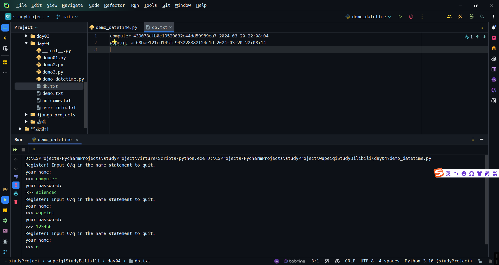
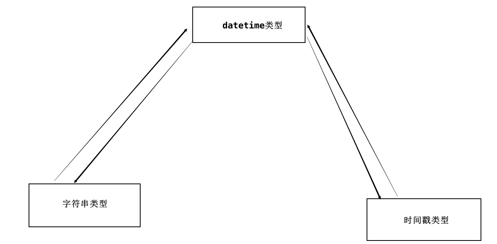
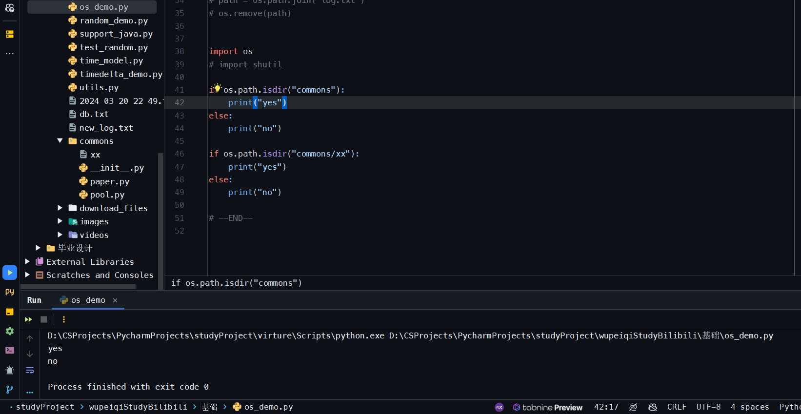
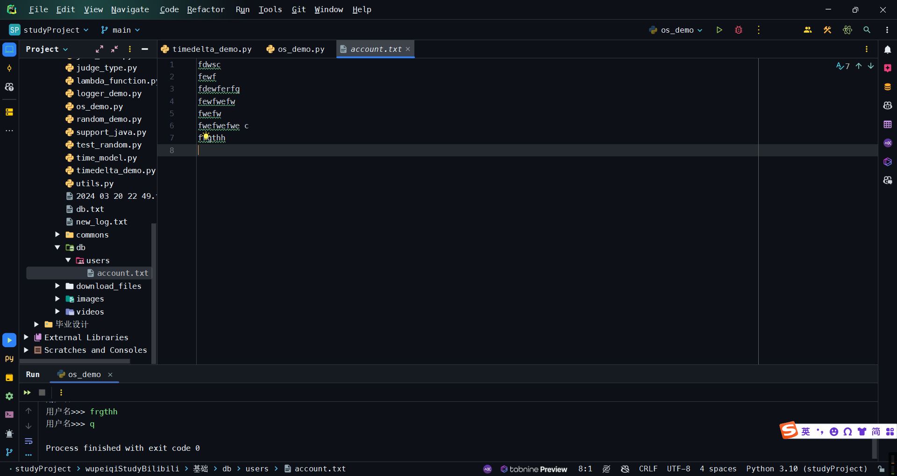
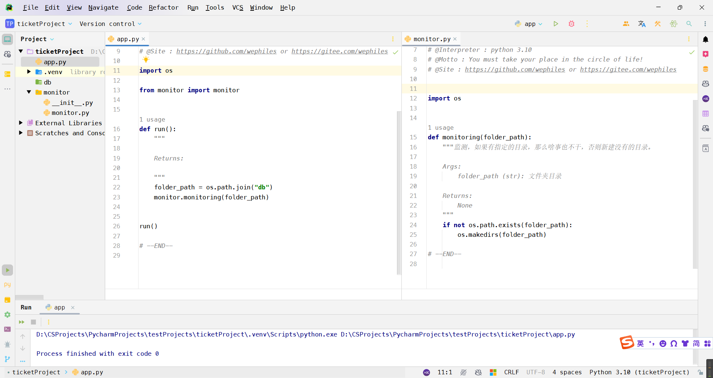
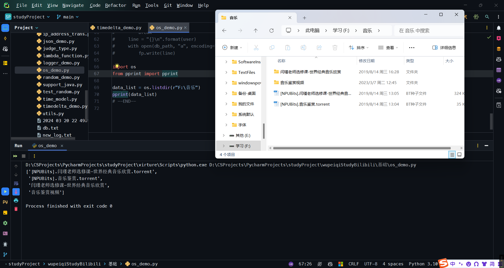
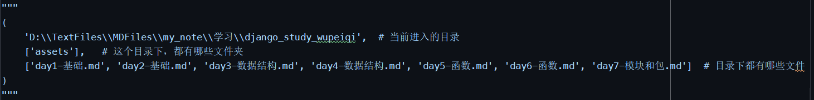
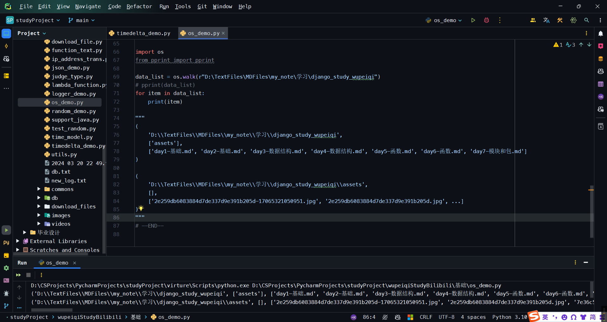
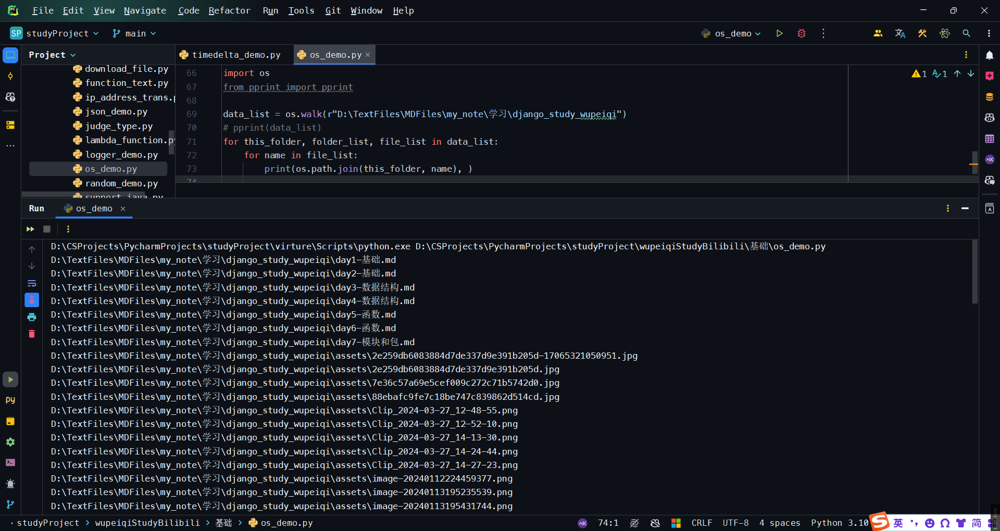
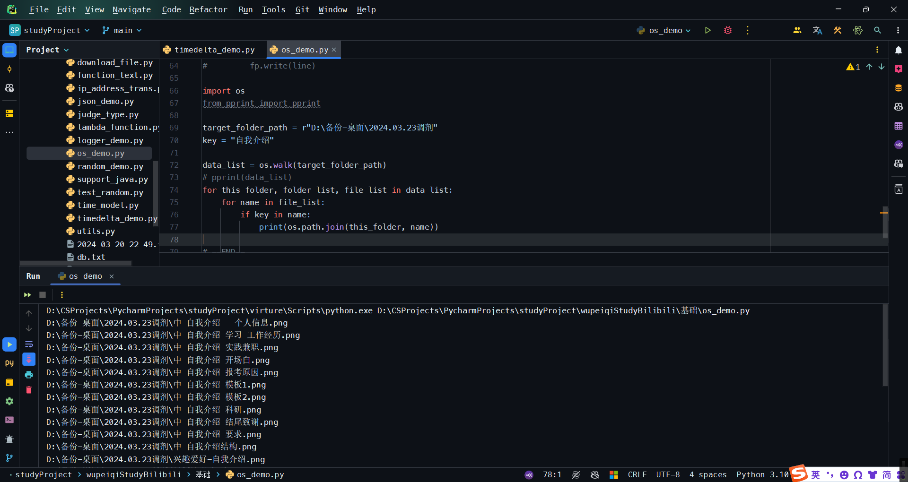

# 模块和包-day7

什么是模块和包？

-   模块：`python`中的`.py`文件，将一些功能按照某一种维度进行划分；
    自定义、内置。、第三方.
-   包：文件夹 里面好多个`.py`文件。
-   在讨论的时候，一般统称为：模块。

学习：

-   自定义模块和包 + 使用
-   内置模块 + 使用
-   第三方模块 + 使用

## 1 自定义模块和包

### 1.1 快速上手

```python
- 项目文件夹()
	- app.py
    - utils.py
    - commons
    	- paper.py
        - pool.py
```

```python
# app.py
import utils
choice = input("输入序号: \n>>> ")

print(utils.str_to_int(choice))
```

```python
# utils.py
def str_to_int(str_data):
    """
    将字符串转换为整型。
    Args:
        str_data ():

    Returns:

    """
    if str_data.isdecimal():
        return int(str_data)
    return None

def f1():
    pass

def f2():
    pass
```

### 1.2 关于模块和包的导入

-   上述的例子，模块和包都在我们所运行的文件所在的同级目录，可以【导入成功】。

-   在python的内置模块，在python的安装目录下，也可以【导入成功】。

假设我的当前项目在`D:\路径`我想要在另外一个盘，比如`F:\code`下面放上我的模块`utils.py`,默认情况下是导入【**不成功**】的。

因为`python`内部在看到`import`语句时，会自动去某些目录寻找。怎么查看呢？

```python
import sys
print(sys.path)
# 我的目录：
"""
[
    'D:\\CSProjects\\PycharmProjects\\studyProject\\wupeiqiStudyBilibili\\基础',
    'D:\\CSProjects\\PycharmProjects\\studyProject',
    'D:\\SoftwareInstall\\Pycharm2023\\PyCharm '
    '2023.3.2\\plugins\\python\\helpers\\pycharm_display',
    'D:\\PythonCompiler\\python310\\python310.zip',
    'D:\\PythonCompiler\\python310\\DLLs',
    'D:\\PythonCompiler\\python310\\lib',
    'D:\\PythonCompiler\\python310',
    'C:\\Users\\20866\\AppData\\Roaming\\Python\\Python310\\site-packages',
    'D:\\PythonCompiler\\python310\\lib\\site-packages',
    'D:\\PythonCompiler\\python310\\lib\\site-packages\\requests-2.31.0-py3.10.egg',
    'D:\\SoftwareInstall\\Pycharm2023\\PyCharm '
    '2023.3.2\\plugins\\python\\helpers\\pycharm_matplotlib_backend'
]
"""
```

可以看到，没有`F:\code`这个路径。

如果非要放在F盘，想要让`python`去你想让他寻找的文件夹去寻找，那么可以这样：`sys.path.append("F:\code")`

`sys.path`: 是一个列表，是有序的。前面找到了，后面就不再找了。

**★注意★**：千万不要让自己的名称和python内置模块重名，并在文件里面相互调用。

### 1.3 关于导入模块和包的方式

-   import xxx
    ```python
    # 导入一个py文件，无法导入py文件里面的某个函数
    import utils
    utils.str_to_int('123')
    
    import commons.paper
    commons.paper.p()
    ```

-   from xxx import xxxx
    ```python
    # 能导入到函数级别
    from utils import str_to_int
    str_to_int("123")
    
    from commons.paper import p, p1, p2
    p()
    p1()
    p2()
    
    from commons import paper
    paper.p()
    
    from commons.paper import *
    p()
    p1()
    p2()
    ```

    ```python
    from commons.paper import p
    def p():
        pass
    
    p()  # 如果是这种情况，那么这个p()是本文件定义的p()，而不是导入的p()
    ```

    ```python
    # 这样就可以避免上述问题
    from commons.paper import p as pp
    def p():
        pass
    
    pp()
    p()  # 如果是这种情况，那么这个p()是本文件定义的p()，而不是导入的p()
    ```

    `import xxx` 和 `from xxx import xxxx`，效果是一样的

    如果要导入深层次的，用`from`形式，如果是单层/同一目录下的，直接用`import`形式。

### 小结

-   sys.path
-   自己的模块名不要和内置的重名
-   导入方式 -- 两种

## 2 python常见内置模块

python内部提供好的功能。

### 2.1 hashlib模块

数据加密模块。

```python
import hashlib

data = "admin"
obj = hashlib.md5()
obj.update(data.encode("utf-8"))
res = obj.hexdigest()
print(res)  # 21232f297a57a5a743894a0e4a801fc3
```

以后的开发时，**不要用明文存储信息**，要存储加密之后的值，防止数据库泄露，导致用户的用户名和密码泄露。


`md5`加密不可反解。

```python
admin    ->    21232f297a57a5a743894a0e4a801fc3
```

案例：以后登录时要进行密文匹配。

```python
import hashlib

user_dict = {
    "root", "21232f297a57a5a743894a0e4a801fc3"
}

user = input("用户名")
pwd = input("密码")
password = user_dict.get(user)  # 21232f297a57a5a743894a0e4a801fc3

# 加密后再匹配
obj = hashlib.md5()
obj.update(pwd.encode("utf-8"))
res = obj.hexdigest()
if res == password:
    print("成功登录。")
```

#### 2.1.1 密文反解撞库

有些人搞一些机器，跑明文和密文，能搞到常见的明文和与其相对应的密文。 —— 加盐

```python
import hashlib

data = "admin"
salt = "nfdnfjienrwiufneruinfiu"  # 随便写，越乱越好

obj = hashlib.md5(salt.encode("utf-8"))  # 加盐
obj.update(data.encode("utf-8"))
res = obj.hexdigest()
print(res)  # f357c87c22e1b1a31d6d298a40d4e867
```

```python
# 用户注册
import hashlib

user_dict = {
    "root", "21232f297a57a5a743894a0e4a801fc3"
}

user = input("用户名")
pwd = input("密码")
password = user_dict.get(user)  # 21232f297a57a5a743894a0e4a801fc3

# 加密后再匹配
obj = hashlib.md5()
obj.update(pwd.encode("utf-8"))
res = obj.hexdigest()
if res == password:
    print("成功登录。")
```

```python
import hashlib


def md5(data_string):  # 加密字符串
    salt = "fjiwojefioejwfojewoiprfjewrj"
    obj = hashlib.md5(salt.encode("utf-8"))
    obj.update(data_string.encode("utf-8"))
    res = obj.hexdigest()
    return res


def login():
    pass


def register():
    print("注册")
    user_name = input("用户名")
    password = input("密码")
    encrypt_pwd = md5(password)  # 加密密码
    line = "{} {}\n".format(user_name, encrypt_pwd)
    with open("db.txt", "a", encoding="utf-8") as fp:
        fp.write(line)


def run():
    func_dict = {
        "1": register,
        "2": login
    }
    choice = input("选择序号: 1 注册	2 登录 \n>>> ")
    func = func_dict.get(choice)
    if not func:
        print("序号错误")
        return
    func()

run()
```


### 2.2 random模块

生成一些随机数据。

```python
import random

v1 = random.ranint(1, 20)  # 大于等于1 小于等于20
print(v1)
```

```python
import random

data_list = ["bws", "dhl", "lhf", "ly", "hjq"]
# 获取随机索引值
index = random.randint(0, len(data_list) - 1)
# 删除某个索引对应的列表值 将删除的值获取到
del_data = data_list.pop(index)
print(data_list)
print(del_data)
```

```python
import random

index = random.uniform(1, 10)  # 1到10内的小数

data_list = [11, 22, 33, 44, 55, 66, 77, 88, 99]
num = random.choice(data_list)  # 从列表里面随机抽取一个数

num_list = random.sample(data_list, 3)  # 从列表里面随机抽取多个数 -- 组成列表

number_list= [0, 1, 2, ..., 99]
random.shuffle(number_list)
```

案例：年会抽奖

```python
import random

# 1. 创建三百名员工
user_list = [f"工号-{i}" for i in range(1, 301)]

# 2. 奖项信息
data_list = [
    ("三等奖", 5),
    ("二等奖", 3),
    ("一等奖", 2),
    ("特等奖", 1)
]

# 3. 抽奖
for item in data_list:
    text = item[0]
    count = item[1]
    prize_list = random.sample(user_list, count)  # 抽什么奖 以多少个
    print(text, prize_list)
```

但是上述这种情况，可能会导致有的人领好几份奖。

```python
import random

# 1. 创建三百名员工
user_list = [f"工号-{i}" for i in range(1, 301)]

# 2. 奖项信息
data_list = [
    ("三等奖", 5),
    ("二等奖", 3),
    ("一等奖", 2),
    ("特等奖", 1)
]

# 3. 抽奖
for item in data_list:
    text = item[0]
    count = item[1]
    prize_list = random.sample(user_list, count)  # 抽什么奖 以多少个
    for name in prize_list:
        user_list.remove(name)
    print(text, prize_list)
    input("点击回车继续。")
```

```python
# 夹带私货

import random

# 1. 创建三百名员工
user_list = [f"工号-{i}" for i in range(1, 301)]

# 2. 奖项信息
data_list = [
    ("三等奖", 5),
    ("二等奖", 3),
    ("一等奖", 2),
    ("特等奖", 1)
]

# 3. 抽奖
for item in data_list:
    text = item[0]
    count = item[1]
    if text == "特等奖":
        print("谁谁谁中奖")
        break
    prize_list = random.sample(user_list, count)  # 抽什么奖 以多少个
    for name in prize_list:
        user_list.remove(name)
    print(text, prize_list)
    input("点击回车继续。")
```

### 2.3 json模块

本质上，`json`是一种数据格式，以字符串的方式进行存储。

-   序列化与反序列化


`json`格式

-   外部整体大的字符串

-   `json`字符串的内部有字符串的话，一定要双引号。

-   `json`中**没有元组**这种数据结构

    ```python
    info = {"k1": 123, "k2": (11, 22, 33, 44)}  # python字典
    
    # JSON格式：
    """ {"k1": 123, "k2": [11, 22, 33, 44]} """
    ```

    ```python
    # 下面这些数据结构是否是json格式的字符串
    a = '{"k1": 123, "k2": 456}'  # 是
    b = "{'k1': 123, 'k2': 456}"  # 不是
    c = '{"k1": 123, "k2": 456, "k3": [11, 22, 33]}'  # 是
    d = '{"k1": 123, "k2": 456, "k3": (11, 22, 33)}'  # 不是
    ```
    
    ```python
    import json
    
    info = {"k1": 123, "k2": (11, 22, 33, 44)}
    
    # python -> json 序列化
    res = json.dumps(info)
    print(res)  # '{"k1": 123, "k2": [11, 22, 33, 44]}'
    
    # json -> python 反序列化 反序列化的时候，必须要能够反序列化——即必须满足JSON串的格式
    data_string = '{"k1": 123, "k2": [11, 22, 33, 44]}'
    res = json.loads(data_string)
    print(res)  # {'k1': 123, 'k2': [11, 22, 33, 44]}
    ```
    
    `JSON`字符串和普通字符串的区别？
    
    都是字符串，只不过`JSON`字符串看起来像`python`的列表/字典，这样才能转换。

#### 2.3.1 关于中文

```python
info = {"name": "计算机", "age": 19}

res = json.dumps(info)
print(res)  # {"name": "\u8ba1\u7b97\u673a", "age": 19}
```

```python
info = {"name": "计算机", "age": 19}

res = json.dumps(info, ensure_ascii=False)
print(res)  # {"name": "计算机", "age": 19}
```

#### 2.3.2 JSON中有

-   整数
-   字符串--双引号
-   字典
-   真假 true/false
-   列表[]

#### 2.3.3 序列化

在Python中，只能通过JSON模块序列化一些基本的数据类型。

```python
import json
import decimal

data = decimal.Decimal("0.3")
info = {"name": "计算机", "age": 19.5, "f": True, "hobby": None, "xx": data}
res = json.dumps(info, ensure_ascii=False)
print(res)
```


```python
+-------------------+---------------+
| Python            | JSON          |
+===================+===============+
| dict              | object        |
+-------------------+---------------+
| list, tuple       | array         |
+-------------------+---------------+
| str               | string        |
+-------------------+---------------+
| int, float        | number        |
+-------------------+---------------+
| True              | true          |
+-------------------+---------------+
| False             | false         |
+-------------------+---------------+
| None              | null          |
+-------------------+---------------+
```

#### 案例1:

基于requests模块向豆瓣发送请求并获取热门电影。

```python
import requests
import json

url = ("https://movie.douban.com/j/search_subjects?type=movie&tag=%E7%83%AD%E9%97%A8"
       "&sort=recommend&page_limit=20&page_start=20")
headers = {
    "User-Agent": "Mozilla/5.0 (Windows NT 10.0; Win64; x64) AppleWebKit/537.36 "
    "(KHTML, like Gecko) Chrome/122.0.0.0 Safari/537.36"}
res = requests.get(url=url, headers=headers)

data_dict = json.loads(res.text)

for item in data_dict["subjects"]:
    print(item["title"], item["url"])
```


#### 案例2:

给`java`程序提供支持.

```python
>>> pip install flask
```

```python
import json

from flask import Flask

app = Flask(__name__)


@app.route("/get/info")
def index():
    data = ["computer", "science", "technology", "计算机科学与技术"]
    res = json.dumps(data, ensure_ascii=False)
    return res


@app.route("/do/play")
def play():
    info = {
        "code": 1000,
        "status": True,
        "values": [
            {"id": 1, "name": "Computer"},
            {"id": 2, "name": "Science"},
            {"id": 3, "name": "Technology"},
            {"id": 4, "name": "计算机科学与技术"}
        ]
    }
    res = json.dumps(info, ensure_ascii=False)
    return res


if __name__ == "__main__":
    app.run()
```


### 2.4 time模块

```python
import time

# 获取当前时间戳 自1970年1月1日开始，到目前为止，总共有多少秒。
v1 = time.time()
print(v1)
# 1709645310.7844565
```

```python
import time

start_time = time.time()
...
...
end_time = time.time()
time_run = end_time - start_time
```

```python
# 停止几秒，再继续运行
while true:
    print(1)
    time.sleep(1)
```

### 2.5 datetime模块

```python
import datetime

v1 = datetime.datetime.now()
print(v1)  # 2024-03-05 21:36:03.775433  --  datetime对象类型的数据 不是字符串！！！

# 转换datetime成字符串
str_date = v1.strftime("%Y-%m-%d %H:%M:%S")
print(str_date)

# 牛逼的来啦！！！
# 上面几行程序可以写成下面的这一行
ctime_string = datetime.datetime.now().strftime("%Y-%m-%d %H:%M:%S")
```


#### 案例

1. 用户注册
    - while循环，输入：用户名、密码
    - 密码 -- > md5加密
    - 获取当前时间，用户
    - 写入到db.txt文档中 格式为：用户名 密码 当前时间

```python
import datetime
import hashlib

SALT = "dsawiofhdjuewhfehwqjfgudsjhuifhqew9fhuihdersgf7"  # 盐


def register():
    """

    Returns (int):
        0
    """
    while True:
        print("Register! Input Q/q in the name statement to quit.")
        user_name = input("your name:\n>>> ")
        if user_name.upper() == 'Q':
            break
        user_pwd = input("your password:\n>>> ")

        obj_md5 = hashlib.md5(SALT.encode("utf-8"))
        obj_md5.update(user_pwd.encode("utf-8"))
        res = obj_md5.hexdigest()

        datetime_string = datetime.datetime.now().strftime("%Y-%m-%d %H:%M:%S")
        with open(r"./db.txt", 'a', encoding='utf-8') as fp:
            line = f"{user_name} {res} {datetime_string}\n"
            fp.write(line)
    return 0


def main():
    """

    Returns:
        None
    """
    register()


if __name__ == '__main__':
    main()
```



2. 日志记录器 -- 按照分钟的维度创建文件，并将内容写入到文件中

    - 写一个函数，在函数中实现这个功能

    - 在函数里面

        - 循环让用户输入：文本

        - 将文本写入到文件中
            ```python
            文件名：当前分钟.txt
            ```

```python
import datetime


def logging(data_string: str):
    """

    Args:
        data_string (str):

    Returns:

    """
    ctime = datetime.datetime.now().strftime("%Y %m %d %H %M")
    file_name = ctime + ".txt"
    with open(file_name, "a", encoding="utf-8") as fp:
        fp.write(data_string + "\n")


def run():
    while True:
        print("输入一些内容:")
        data_string = input("在下面输入内容, 输入Q/q退出程序:\n>>> ")
        if data_string.upper() == "Q":
            break
        logging(data_string)


run()

# --END--
```

#### 补充

#### 2.5.1 时间转换




- 字符串 -> datetime类型
    ```python
    from datetime import datetime
    test = "2024-02-12"
    res = datetime.strptime("%Y-%m-%d")
    print(res)
    ```

- datetime -> 字符串

    ```python	
    from datetime import datetime
    
    dt = datetime.now()
    res = dt.strftime("%Y-%m-%d")
    ```
    
- 时间戳 -> datetime
    ```python
    import time
    from datetime import datetime
    
    ctime = time.time()
    dt = datetime.fromtimestamp(ctime)
    print(dt)
    ```

- datetime -> 时间戳
    ```python
    import time
    from datetime import datetime
    
    dt = datetime.now()
    ctime = dt.timestamp()
    print(ctime)
    ```

#### 2.5.2 datetime类型的意义

很方便地对时间进行操作。

```python
from datetime import datetime, timedelta

v1 = datetime.now()
print(v1)
res = v1 + timedelta(seconds=100)
res = v1 + timedelta(days=280)
res = v1 + timedelta(days=10, minutes=10, seconds=100)

res.strftime("%Y-%m-%d %H:%M:%S")
print(res)
```

### 2.6 os模块

- 路径拼接
    ```python
    windows操作系统:   c:\xx\xxx\xxxx
        Mac操作系统:   /user/xx/xxx/xxxx
        Linux操作系统: /user/xx/xxx/xxxx
    ```

    ```python
    import os
    
    path = os.path.join("x1", "x2", "x3", "db.txt")
    print(path)  # 会根据自己的操作系统生成路径 x1\x2\x3\db.txt
    ```

- 找上级目录
    ```python
    import os
    
    file_path = "x1\x2\x3\db.txt"
    v1 = os.path.dirname(file_path)
    print(v1)  # x1\x2\x3
    ```

- 绝对路径
    ```python
    绝对路径:
        D:\CSProjects\PycharmProjects\studyProject\wupeiqiStudyBilibili\基础\demo.html
    相对路径 (相对于当前执行的程序)
        ...
    ```

    如何生成一个绝对路径：

    ```python
    import os
    res = os.path.abspath("xx")  # 只是获取当前程序文件所在目录，并拼接上函数的参数(相对目录)
    print(res)  # D:\CSProjects\PycharmProjects\studyProject\wupeiqiStudyBilibili\基础\xx
    ```

- 判断路径是否存在 -- 防止读取文件的时候文件不存在报错
    ```python
    import os
    
    file_path = os.path.join("files", "db.txt")
    if os.path.exists(file_path):
        ...
    else:
        print("文件不存在！")
    ```

- 创建文件夹 -- 如果路径存在就会报错
    ```python
    import os
    
    path = os.path.join("db", "2021", "11月份")
    os.makedirs(path)
    ```

- 删除文件 -- 如果不存在会报错 os.remove只能删除文件
    ```python
    import os
    
    
    path = os.path.join("log.txt")
    os.remove(path)
    ```

- 删除文件夹
    ```python
    import os
    import shutil
    
    
    path = os.path.join("db")
    shutil.rmtree(path)
    ```

- 判断是否是文件夹 os.path.isdir(file_path)
    ```python
    import os
    
    if os.path.isdir("commons"):
        print("yes")
    else:
        print("no")
    
    if os.path.isdir("commons/xx"):
        print("yes")
    else:
        print("no")
    ```

    

#### 案例1

```python
"""
用户注册：
	- 用户信息存储在 db/users/account.txt
"""
import os

db_path = os.path.join("db", "users", "account.txt")
# 确保文件目录已存在，如果不存在需要创建。
folder_path = os.path.join("db", "users")
if not os.path.exists(folder_path):
    os.makedirs(folder_path)
while True:
    user = input("用户名>>> ")
    if user.upper() == "Q":
        break
    line = "{}\n".format(user)
    with open(db_path, "a", encoding="utf-8") as fp:
        fp.write(line)
```

注意！！！

对于文件操作：

​    写文件时，文件所在的目录必须已创建。意思就是在写文件的时候，目录必须是已经存在的目录。

​    如果目录已经存在，那么如果文件不存在的话**python会自动创建文件。**



#### 案例2

```python
"""
景区订票项目
	- 新创建一个项目
	- 创建一个app.py文件 实现所有的代码
	- 函数式编程实现
	- 业务需求
		- 启动项目时，监测当前项目下是否有db文件夹，如果没有就创建
		- 输入姓名就可以进入系统，分为老用户、新用户 -- 登录系统
			- 用户名.txt是否存在，存在是老用户，不存在是新用户
        - 登录后，选择功能
        	- 历史订单 打开文件并逐行读取文件内容， 如果文件不存在，则输出 无历史记录。
        	- 预定 输入： 景区 数量 订票时间
"""
```



```python
# 文件层级:
项目文件
├─app.py
├─db
│  └─files
│  │  ├─buweishi.txt
│  │  ├─wupeiqi.txt
└─monitor
   └─files
      ├─__init__.py
      ├─booking.py
      ├─history.py
      ├─judge_new_user.py
      └─monitor.py
```

```python
# app.py
import os
from monitor import monitor, judge_new_user
from monitor.history import history
from monitor.booking import booking


def run():
    """

    Returns:

    """
    # 监测是否存在文件夹
    folder_path = os.path.join("db", "files")
    monitor.monitoring(folder_path)

    # 判断是不是新用户
    user_name = input("Please enter your username:\n>>> ")
    if judge_new_user.is_new_user(user_name, folder_path):
        print("New User!")
    else:
        print("Old User!")
    file_path = os.path.join(folder_path, user_name + ".txt")

    # 功能选择
    func_dict = {
        "1": history,
        "2": booking
    }
    while True:
        print("1: 查询历史订单  2: 订票 Q/q: 退出")
        choice = input("请选择功能(输入q/Q退出)、\n>>> ")
        if choice.lower() == "q":
            break
        func_ = func_dict.get(choice)
        if not func_:
            print("请输入正确的选项！")
            continue
        func_(file_path)


run()
```

```python
# booking.py
from datetime import datetime


def booking(user_file_path):
    """
    订票系统
    Args:
        user_file_path ():

    Returns:

    """
    location = input("请输入景区名称！")
    count = input("请输入购票数量！")
    ctime = datetime.now().strftime(r"%Y-%m-%d %H:%M:%S")
    line = "{},{},{}\n".format(location, count, ctime)
    with open(user_file_path, "a+", encoding="utf-8") as fp:
        fp.write(line)
```

```python
# monitor.py
import os


def monitoring(db_folder=None):
    """监测，如果有指定的目录，那么啥事也不干，否则新建没有的目录。

    Returns:
        None
    """
    if not os.path.exists(db_folder):
        os.makedirs(db_folder)
```

```python
# history.py
import os


def history(user_file_path):
    """

    Args:
        user_file_path ():

    Returns:

    """
    # 监测文件是否存在 如果不存在，输出 无历史记录
    if not os.path.exists(user_file_path):
        print("无历史记录！")
        return

    # 如果存在，读取文件内容 逐行打印
    print("=====历史记录=====")
    with open(user_file_path, "r", encoding="utf-8") as fp:
        for line in fp:
            line = line.strip()
            print(line, end=" ")
    print()
```

```python
# judge_new_user.py
import os


def is_new_user(user_name: str, folder_path: str):
    """
    判断一个用户是否已经存在。
    Args:
        user_name (str): 用户名
        folder_path (): 文件夹路径

    Returns:

    """
    file_path = os.path.join(folder_path, user_name + ".txt")
    if not os.path.exists(file_path):
        with open(file_path, "w", encoding="utf-8") as fp:
            fp.write(user_name + "\n")
        return True
    return False
```

- `os.listdir `-- 查看某个目录下所有的文件和文件夹，只能找下一级的目录

    ```python
    import os
    
    import os
    from pprint import pprint
    
    data_list = os.listdir(r"F:\音乐")
    pprint(data_list)
    ```

    ```python
    # 也可以循环遍历
    for item in data_list:
        print(item)
    ```

    

- `os.walk` -- 查看某个目录下所有的文件和文件夹，能一直往下找

    ```python
    import os
    from pprint import pprint
    
    data_list = os.walk(r"D:\TextFiles\MDFiles\my_note\学习\django_study_wupeiqi")
    # pprint(data_list)
    for item in data_list:
        print(item)
        break
    """
    (
        'D:\\TextFiles\\MDFiles\\my_note\\学习\\django_study_wupeiqi',  # 当前进入的目录
        ['assets'],   # 这个目录下，都有哪些文件夹
        ['day1-基础.md', 'day2-基础.md', 'day3-数据结构.md', 'day4-数据结构.md', 'day5-函数.md', 'day6-函数.md', 'day7-模块和包.md']  # 目录下都有哪些文件
    )
    """
    ```

    

   ```python
   import os
   from pprint import pprint
   
   data_list = os.walk(r"D:\TextFiles\MDFiles\my_note\学习\django_study_wupeiqi")
   # pprint(data_list)
   for item in data_list:
       print(item)
   
   """
   (
       'D:\\TextFiles\\MDFiles\\my_note\\学习\\django_study_wupeiqi', 
       ['assets'], 
       ['day1-基础.md', 'day2-基础.md', 'day3-数据结构.md', 'day4-数据结构.md', ...]
   )
   
   (
       'D:\\TextFiles\\MDFiles\\my_note\\学习\\django_study_wupeiqi\\assets', 
       [], 
       ['2e259db6083884d7de337d9e391b205d-17065321050951.jpg', '2e259db6083884d7de337d9e391b205d.jpg', ...]
   )
   """
   ```



```python
import os
from pprint import pprint

data_list = os.walk(r"D:\TextFiles\MDFiles\my_note\学习\django_study_wupeiqi")
# pprint(data_list)
for this_folder, folder_list, file_list in data_list:
    for name in file_list:
        print(os.path.join(this_folder, name), )
```



#### 案例3

找到某个目录下的所有含有某个关键字的文件（文件路径）

```python
import os
from pprint import pprint

target_folder_path = r"D:\备份-桌面\2024.03.23调剂"
key = "自我介绍"

data_list = os.walk(target_folder_path)
# pprint(data_list)
for this_folder, folder_list, file_list in data_list:
    for name in file_list:
        if key in name:
            print(os.path.join(this_folder, name))
```




