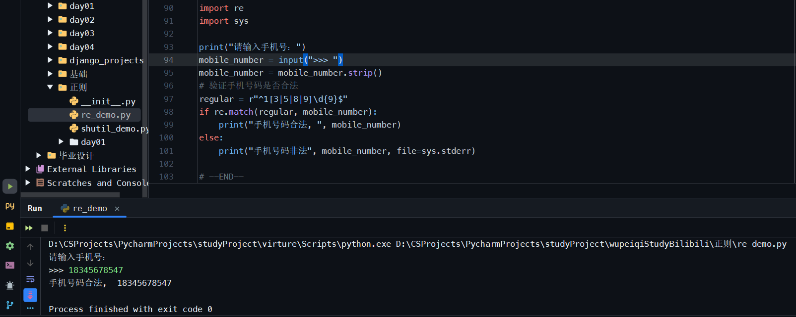
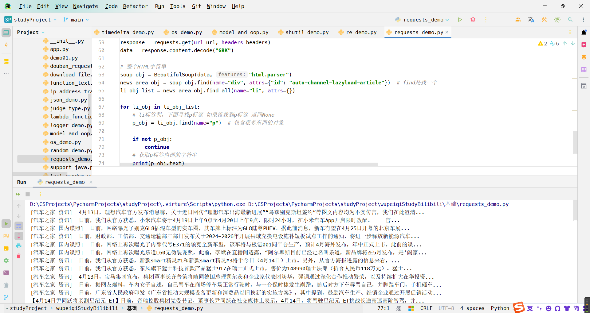

[TOC]


# 模块和面向对象-`day8`

概要：

- 模块
    - 自定义模块（已经讲了）
    - 内置模块
        - `shutil`
        - `re` 正则表达式
    - 第三方模块
        - `requests `模块
        - `bs4` 模块
- 面向对象: 面向对象(`Object-Oriented Programming`)，简称`OOP`,是一种编程范式，它使用“对象”来设计软件，这些对象包含了数据（属性）和可以操作这些数据的方法。面向对象的核心思想是将现实世界中的事物抽象成对象，通过对象之间的交互来实现软件功能。 面向对象编程具有以下几个基本特性：
    1. **封装（`Encapsulation`）**：封装是将对象的状态（属性）和行为（方法）结合在一起，并对外隐藏其内部实现细节的过程。通过使用访问修饰符（如`public`、`private`等）来控制对对象内部状态的访问，确保对象的完整性和安全性。
    2. **继承（`Inheritance`）**：继承是一种可以让一个类（子类或派生类）继承另一个类（父类或基类）属性和方法的机制。继承支持代码的重用，并能够建立类之间的层次关系，使得子类具有父类的所有特性，并且还可以添加或修改原有的行为。
    3. **多态（`Polymorphism`）**：多态是指允许使用子类的对象来替代父类的对象，从而在运行时确定具体调用哪个类的方法。多态性可以使得代码更加灵活和可扩展，同时也支持接口的实现，允许不同的对象对同一消息做出响应。

## 1 模块

### 1.1 自定义模块

- `py`文件或者文件夹
- `from `、`import`
- `sys.path`【运行的当前脚本的目录+系统内置模块的目录】
- 自己的模块名不要和内置模块名冲突。

#### 补充-主文件

主文件：就是程序的入口，只有执行这个主文件(`.py`文件)，程序才能运行起来.

```python
# 运行当前脚本时，__name__是python内部创建的一个变量 __name__ = "__main__"
# 如果当前的脚本是别人导入执行的，那么python会在这个脚本的内部创建__name__ = "module_name"
if __name__ == "__main__":  # 标志这个文件是主文件 
    ...
```

- 标志：含有`if __name__ == "__main__":`的为主文件
- 防止别人导入咱们的程序时执行程序。只有自己主动执行时才会执行程序。

### 1.2 内置模块

- `os`
- `random`
- `hashlib`
- `json`
- `time`
- `datetime`

#### 1.2.1 `shutil`模块

- 删除==**文件夹**==
  
    > [!IMPORTANT]
    >
    > 是删除**文件夹** 不是删除文件
    
    ```python
    import shutil
    
    shutil.rmtree("xx/xxx/xxxx")
    ```
    
- 拷贝文件夹
    ```python
    import shutil
    
    shutil.copytree("原文件夹", "目标文件夹路径")  # 没有文件夹会自动创建
    ```

    ```python
    import shutil
    shutil.copytree(r"D:/tree", r"D:/xx/xxx/xxxx")
    ```

- 拷贝文件
    ```python
    import shutil
    
    shutil.copy("源文件路径", "目标文件夹路径")
    ```

    ```python
    import shutil
    shutil.copytree(r"D:/tree/xxx.txt", r"D:/xx/xxx/xxxx")  # 如果不存在xxxx，那么创建一个较xxxx的文件（这个文件没有后缀）
    shutil.copytree(r"D:/tree/xxx.txt", r"D:/xx/xxx/xxxx/")  # 拷贝文件到文件夹 文件夹要是不存在会报错
    ```

- 重命名文件/文件夹
    ```python
    import shutil
    
    shutil.move("原来的文件名/文件夹名", "改变名字之后的文件名/文件夹名")  # 源文件不存在会报错 源文件夹不存在也会报错
    ```

- 压缩、解压缩
    ```python
    import shutil
    
    # 压缩
    # base_name: 压缩包文件名 format: 后缀名 root_dir: 要压缩到的文件夹路径
    shutil.make_archive(base_name="xx", format="zip", root_dir="xx/xxx/xxxx/")
    
    # 解压
    # filename: 压缩包文件名 extract_dir: 解压目录 format: 压缩的格式
    shutil.unpack(filename="xx.zip", extract_dir="xx/xxx/xxxx/", format="zip")
    ```

练习题：目录层级如下所示

```python
day01
	  01 fullstack s7 day01 xxx.mp4
    02 fullstack s7 day01 xxx.mp4
    03 fullstack s7 day01 xxx.mp4
    04 fullstack s7 day01 xxx.mp4
    xxxx.md
```

寻找`day01`目录下的所有`mp4`为后缀的文件 重命名为

`04 fullstack s7 day01 xxx.mp4 -> 01 xxx.mp4`

```python
import os
import shutil

folder_path = r"D:\CSProjects\PycharmProjects\studyProject\wupeiqiStudyBilibili\day07\day01"

for name in os.listdir(folder_path):
    if name.rsplit(".", maxsplit=1)[-1] == "mp4":  # 参数“.”表示从右边(rsplit)分割 maxsplit=1表示分割右边第一个点
        new_name = name.replace("fullstack s7 day01 ", "")
        shutil.move(os.path.join(folder_path, name), os.path.join(folder_path, new_name))
```

#### 1.2.2 `re`正则表达式

- 正则表达式？【与语言无关】
- `python`中的`re`模块

正则表达式是干什么的？

```python
text = """正则表达式，又称规则表达式，（Regular Expression，在代码中常简写为regex、regexp或RE），是一种文本模式，包括普通字符（例如，a到z之间的字母）和特殊字符（称为“元字符”），是计算机科学的一个概念。正则表达式是对字符串（包括普通字符和特殊字符）操作的一种逻辑公式，就是用事先定义好的一些特定字符以及这些特定字符的组合，组成一个“规则字符串”，这个“规则字符串”用来表达对字符串的一种过滤逻辑。正则表达式用来检索、替换那些符合某个模式（规则）的文本，通常被用来检索、替换那些符合某个模式（规则）的文本。正则表达式可以从一个基础字符串中根据一定的匹配模式替换文本中的字符串、验证表单、提取字符串等等，许多程序设计语言都支持利用正则表达式进行字符串操作。楼主:瑾瑜，电话 18866666666，邮箱: 12345679@163.com。求点赞求转发，求一键三连！！！"""

# 需求：将字符串中的邮箱提取出来 / 手机号
# 手机号特征： 1[3|5|8|9]\d{9}    ->  正则表达式规则
```

```python
import re

re_str = "1[3|5|8|9]\d{9}"


text = """正则表达式，又称规则表达式，（Regular Expression，在代码中常简写为regex、regexp或RE），是一种文本模式，
包括普通字符（例如，a到z之间的字母）和特殊字符（称为“元字符”），是计算机科学的一个概念。正则表达式是对字符串（包括普
通字符和特殊字符）操作的一种逻辑公式，就是用事先定义好的一些特定字符以及这些特定字符的组合，组成一个“规则字符串”，这
个“规则字符串”用来表达对字符串的一种过滤逻辑。正则表达式用来检索、替换那些符合某个模式（规则）的文本，通常被用来检索、
替换那些符合某个模式（规则）的文本。正则表达式可以从一个基础字符串中根据一定的匹配模式替换文本中的字符串、验证表单、提
取字符串等等，许多程序设计语言都支持利用正则表达式进行字符串操作。楼主:瑾瑜，电话 18866666666，邮箱: 12345679@163.com。
求点赞求转发，求一键三连！！！"""

phone_number = re.findall(re_str, text)

print(phone_number)  # 18866666666
```

提取邮箱

```python
\w+@\w+.\w+
```

##### 1.2.2.1 字符相关

- 固定文本
    ```
    import re
    
    text = "你好巴拉巴拉 biubiubiu computer science good morning longArc架构 计算机科学与技术 华为牛逼 打倒美帝国主义纸老虎 日本鬼子不得好死"
    
    data_list = re.findall("computer", text)  # ['computer']
    ```

- 匹配字符
    ```
    import re
    
    text = "你好巴拉巴拉 biubiubiu computer science good morning longArc架构 计算机科学与技术 华为牛逼 打倒美帝国主义纸老虎 日本鬼子不得好死 祝没有真心反对日本核污水拍害的日本人全都收到核辐射而死 hahaha 耶"
    
    data_list = re.findall("[abc]", text)  # 找 a b c 从前向后找
    # ['b', 'b', 'b', 'c', 'c', 'c', 'c', 'a', 'a', 'a']
    ```

    ```python
    import re
    
    text = "你好巴拉巴拉 biubiubiu computer science good morning longArc架构 计算机科学与技术 华为牛逼 打倒美帝国主义纸老虎 日本鬼子不得好死 祝没有真心反对日本核污水拍害的日本人全都收到核辐射而死 hahaha 耶"
    
    data_list = re.findall("h[abc]", text)  # 找 ha hb hc 从前向后找
    # ['ha', 'ha', 'ha']
    ```

- 字符范围 `a-z 0-9`
    ```python
    import re
    
    text = """你好巴拉巴拉 biubiubiu computer science good morning longArc架构 计算机科学与技术 华为牛逼 
    打倒美帝国主义纸老虎 日本鬼子不得好死 祝没有真心反对日本核污水拍害的日本人全都收到核辐射而死 hahaha 耶 2024年3月10日"""
    
    data_list = re.findall("[a-z]", text)  # 按照范围找
    """['b', 'i', 'u', 'b', 'i', 'u', 'b', 'i', 'u', 'c', 'o', 'm', 'p', 'u', 't', 'e', 'r', 's', 'c', 'i', 'e', 'n', 'c', 'e', 'g', 'o', 'o', 'd', 'm', 'o', 'r', 'n', 'i', 'n', 'g', 'l', 'o', 'n', 'g', 'r', 'c', 'h', 'a', 'h', 'a', 'h', 'a']"""
    ```

- `\d` -- 代表一个数字

    ```python
    import re
    
    text = """root-ad13main-c4ompu423416ter science-aad234main"""
    
    data_list = re.findall(r"\d", text)  # \d代表数字
    print(data_list)  # ['1', '3', '4', '4', '2', '3', '4', '1', '6', '2', '3', '4']
    ```

    ```python
    import re
    
    text = """root-ad13main-c4ompu423416ter science-aad234main"""
    
    data_list = re.findall(r"\d+", text)  # + 代表1个或者n个
    print(data_list)  # ['13', '4', '423416', '234']
    ```

    ```python
    import re
    
    text = """root-ad13main-c4ompu423416ter science-aad234main"""
    
    data_list = re.findall(r"\d*", text)  # * 代表0个或者n个
    print(data_list)  
    # ['', '', '', '', '', '', '', '13', '', '', '', '', '', '', '4', '', '', '', '', '423416', '', '', '', '', '', '', '', '', '', '', '', '', '', '', '', '234', '', '', '', '', '']
    ```

    ```python
    import re
    
    text = """root-ad13main-c4ompu423416ter science-aad234main"""
    
    data_list = re.findall(r"\d?", text)  # ? 代表0个或者1个  意思是只拿0个或1个(不管后面本来有多少个)
    # ['', '', '', '', '', '', '', '1', '3', '', '', '', '', '', '', '4', '', '', '', '', '4', '2', '3', '4', '1', '6', '', '', '', '', '', '', '', '', '', '', '', '', '', '', '', '2', '3', '4', '', '', '', '', '']
    ```

    ```python
    import re
    
    text = """root-ad13main-c4ompu423416ter science-aad234main"""
    
    data_list = re.findall(r"\d{2}", text)  # {n} 固定n个
    # ['13', '42', '34', '16', '23']
    ```

    ```python
    import re
    
    text = """root-ad13main-c4ompu423416ter science-aad234main"""
    
    data_list = re.findall(r"\d{2,}", text)  # {n,} 固定n个,或者比n个更多
    # ['13', '423416', '234']
    ```

    ```python
    import re
    
    text = """root-ad13main-c4ompu423416ter science-aad234main"""
    
    data_list = re.findall(r"\d{2, 4}", text)  # {n, m} 固定n个到m个之间   :  n个 <= 个数 <= m个
    ```

- `\w` -- 字母 数字 下划线 (包括汉字) ==不匹配空格！==

    ```python
    import re
    
    text = """你好巴拉巴拉 biubiubiu computer science good morning longArc架构 计算机科学与技术 华为牛逼 
    打倒美帝国主义纸老虎 日本鬼子不得好死 祝没有真心反对日本核污水拍害的日本人全都收到核辐射而死 hahaha 耶 2024年3月10日"""
    
    data_list = re.findall("计算机\w+技术", text)  # 尽可能多的去匹配  -- 贪婪匹配 默认是贪婪的
    print(data_list)  # ['计算机科学与技术']
    ```

    ```python
    import re
    
    text = """你好巴拉巴拉 biubiubiu computer science good morning longArc架构 计算机科学与技术 华为牛逼 
    打倒美帝国主义纸老虎 日本鬼子不得好死 祝没有真心反对日本核污水拍害的日本人全都收到核辐射而死 hahaha 耶 2024年3月10日"""
    
    data_list = re.findall("计算机\w+?技术", text)  # 尽可能少的去匹配  -- 非贪婪匹配
    print(data_list)  # ['计算机科学与技术']
    ```
    
    > [!Caution]
    >
    > "计算机\w+?技术"这个正则表达式表示的是==非贪婪匹配==。 ==非贪婪匹配==：在一个匹配数量的语法后面添加一个？代表非贪婪匹配。
    
    正则默认是贪婪匹配，加一个？那么就是非贪婪匹配。
    
- `.` 除换行符以外的任意字符(一个)

    ```python
    import re
    
    text = "computerscience admain root"
    data_list = re.findall("r.o", text)  # 贪婪
    print(data_list)  # ['roo']
    ```

    ```python
    import re
    
    text = "computerscience admain root"
    data_list = re.findall("r.+o", text)  # 贪婪
    print(data_list)  # ['rscience admain roo']
    ```

    ```python
    import re
    
    text = "computerscience admain root"
    data_list = re.findall("r.+?o", text)  # 非贪婪
    print(data_list)  # ['rscience admain ro']
    ```

- `\s` 一个任意空白字符(注意：`tab`(`\t`)在这里不是空白字符)

    ```python
    import re
    
    text = "computer science admain add root"
    data_list = re.findall("a\w+\s\w+", text)
    print(data_list)  # ['admin add']
    ```

##### 1.2.2.2 关于数量

- `*` 0个或者n个
- `+` 1个或者n个
- `?` 0个或者1个
- `{n}` 固定n个
- `{n,}` n个或者n个以上
- `{n, m}` n到m个
- 注意：默认贪婪匹配，如果要非贪婪匹配，那么在数量后面加？

##### 1.2.2.3 分组

- 提取数据区域
    ```python
    import re
    
    text = """正则表达式，又称规则表达式，（Regular Expression，在代码中常简写为regex、regexp或RE），是一种文本模式，
    包括普通字符（例如，a到z之间的字母）和特殊字符（称为“元字符”），是计算机科学的一个概念。正则表达式是对字符串（包括普
    通字符和特殊字符）操作的一种逻辑公式，就是用事先定义好的一些特定字符以及这些特定字符的组合，组成一个“规则字符串”，这
    个“规则字符串”用来表达对字符串的一种过滤逻辑。正则表达式用来检索、替换那些符合某个模式（规则）的文本，通常被用来检索、
    替换那些符合某个模式（规则）的文本。正则表达式可以从一个基础字符串中根据一定的匹配模式替换文本中的字符串、验证表单、提
    取字符串等等，许多程序设计语言都支持利用正则表达式进行字符串操作。楼主:瑾瑜，电话 18866666666，邮箱: 12345679@163.com。
    求点赞求转发，求一键三连！！！18866668888"""
    
    data_list = re.findall("1886(6\d{5})", text)
    print(data_list)  # ['666666', '666888']
    ```

    ```python
    import re
    
    text = """正则表达式，又称规则表达式，（Regular Expression，在代码中常简写为regex、regexp或RE），是一种文本模式，
    包括普通字符（例如，a到z之间的字母）和特殊字符（称为“元字符”），是计算机科学的一个概念。正则表达式是对字符串（包括普
    通字符和特殊字符）操作的一种逻辑公式，就是用事先定义好的一些特定字符以及这些特定字符的组合，组成一个“规则字符串”，这
    个“规则字符串”用来表达对字符串的一种过滤逻辑。正则表达式用来检索、替换那些符合某个模式（规则）的文本，通常被用来检索、
    替换那些符合某个模式（规则）的文本。正则表达式可以从一个基础字符串中根据一定的匹配模式替换文本中的字符串、验证表单、提
    取字符串等等，许多程序设计语言都支持利用正则表达式进行字符串操作。楼主:瑾瑜，电话 18866666666，邮箱: 12345679@163.com。
    求点赞求转发，求一键三连！！！18866668888"""
    
    data_list = re.findall("(1\d{2})66(6\d{5})", text)
    print(data_list)  # [('188', '666666'), ('188', '668888')]
    ```

- 提取数据区域 + 或
  
    ```python
    import re
    
    text = """正则表达式，又称规则表达式，（Regular Expression，在代码中常简写为regex、regexp或RE），是一种文本模式，
    包括普通字符（例如，a到z之间的字母）和特殊字符（称为“元字符”），是计算机科学的一个概念。18866root太牛逼了。正则表达式是对字符串（包括普
    通字符和特殊字符）操作的一种逻辑公式，就是用事先定义好的一些特定字符以及这些特定字符的组合，组成一个“规则字符串”，这
    个“规则字符串”用来表达对字符串的一种过滤逻辑。正则表达式用来检索、替换那些符合某个模式（规则）的文本，通常被用来检索、
    替换那些符合某个模式（规则）的文本。正则表达式可以从一个基础字符串中根据一定的匹配模式替换文本中的字符串、验证表单、提
    取字符串等等，许多程序设计语言都支持利用正则表达式进行字符串操作。楼主:瑾瑜，电话 18866666666，邮箱: 12345679@163.com。
    求点赞求转发，求一键三连！！！18866668888"""
    
    data_list = re.findall("18866(6\d{5}|r\w+太)", text)
    print(data_list)  # ['root太', '666666', '668888']
    ```

##### 例题

1. `QQ`号
    ```python
    [1-9]\d{4,12}
    ```

2. 身份证号码
    ```python
    13044919991203887X
    130449199912038879
    
    "\d{17}[\dX]"
    
    "\d{6}(\d{4})\d{7}[\dX]"  # 拿到出生年份
    
    "(\d{6}(\d{4})\d{7}[\dX])"  # 拿到出生年份 和 整体的证件号码
    ```

3. 手机号
    ```python
    1[3-9]\d{9}
    ```

4. 邮箱
    ```python
    xxxx@xxx.com
    
    "\w+@\w+\.\w+"  # 这里的\.是将.转义成.，使正则直接匹配.而不是匹配任意的字符
    
    re.findall("\w+@\w+\.\w+", text, re.ASCII)  # re.ASCII使匹配到的不包含中文
    ```

    ```python
    "[a-zA-Z0-9_-]+@[a-zA-Z0-9_-]+\.[a-zA-Z0-9_-]+"
    ```

##### 1.2.2.4 `re`模块

- `re.findall()`  获取匹配成功的所有结果

- `re.match()` 从开头进行匹配 开头要是没有匹配成功就不再继续往后匹配，匹配成功后返回第一个对象

    ```python
    import re
    
    text = "大小逗2B最逗3B欢乐"
    
    regular = r"逗\dB"
    data_list = re.findall(regular, text)
    print(data_list)  # ['逗2B', '逗3B']
    
    data_list = re.match(regular, text)
    print(data_list)  # None
    ```
    
    ```python
    import re
    
    regular = r"大小逗\dB"
    text = "大小逗2B最逗3B欢乐"
    data_list = re.match(regular, text)
    print(data_list)  # <re.Match object; span=(0, 5), match='大小逗2B'>
    ```
    
    ```python
    import re
    
    regular = r"大小逗\dB"
    text = "大小逗2B最逗3B欢乐"
    data_obj = re.match(regular, text)
    if data_obj:
        data = data_obj.group()
        print(data)  # 大小逗2B
    ```
    
    - 关于`match`的应用场景
        ```python
        # 想对用户的手机号进行校验
        
        import re
        import sys
        
        print("请输入手机号：")
        mobile_number = input(">>> ")
        mobile_number = mobile_number.strip()
        # 验证手机号码是否合法
        regular = r"^1[3|5|8|9]\d{9}$"  # ^指开头 $指结尾
        if re.match(regular, mobile_number):
            print("手机号码合法, ", mobile_number)
        else:
            print("手机号码非法", mobile_number, file=sys.stderr)
        ```
    
        
    
        

- `re.search` 浏览整个字符串去匹配,匹配失败返回 None，成功返回第一个对象

    ```python
    import re
    
    regular = r"逗\dB"
    text = "大小逗2B最逗3B欢乐"
    data_list = re.search(regular, text)
    if data_list:
    	print(data_list)  # <re.Match object; span=(2, 5), match='逗2B'>
    ```

- `re.split` 

    ```python
    # 字符串的split
    text = "dsadfeferfg.mp4"
    text.split(".")
    ```

    ```python
    # re的切割
    
    import re
    
    text = "大小逗2B最逗3B欢乐"
    data_list = re.split("\dB", text)
    print(data_list)  # ['大小逗', '最逗', '欢乐']
    ```

    ```python
    import re
    
    text = "1+8-7+18-20"
    data_list = re.split("[+-]", text)
    print(data_list)  # ['1', '8', '7', '18', '20']
    ```

#### 1.2.3 小结

以上就是常见的内置模块的需要了解的内容。

### 1.3 第三方模块

python安装第三方模块：

- `pip`
- 源码
- `wheel`包

第三方模块都会保存在`site-packages`目录下面。

导入模块的时候，只需要在代码中`import 模块名`

#### 1.3.1 `requests`模块

`requests`，让我们可以通过代码向某些地址发送网络请求，然后帮助我们获取到结果。

```python
pip install requests
```

```python
import requests

requests.功能
```

1. 基于浏览器抓包：
    查看他的网络请求:

    - 地址
    - 请求的方式
    - 传递的数据

    使用谷歌浏览器打开[豆瓣电影](https://movie.douban.com/):

    

    

    在页面空白位置 鼠标右键 -> 检查 (也可以使用快捷键 F12)

    

    就会出现浏览器帮我们做的抓包工具.

    

    点击 `网络(network)` 浏览器会监测这个网站上所有的网络请求.

    

    随便找一个网络包,点开他的headers,然后会出现一些相关的参数:

    

    

    点击`response`,会看到服务器给我们返回的数据:

    

    

2. `requests`代替浏览器发送请求

    然后我们就可以通过程序伪造浏览器发请求来获取数据:

    ```python
    # 这个url和以前那个url不一样,但是浏览器抓包的方式是一样的.
    import requests
    
    url = r"https://search.douban.com/movie/subject_search?search_text=%E7%83%AD%E9%97%A8&cat=1002"
    
    # 返回的所有response数据都拿到
    res = requests.get(url=url)  # 原始的utf-8编码的数据
    
    # 原始的响应体
    text = res.content.decode("utf-8")  # 吧utf-8的数据转换成字符串
    
    # 注意:这儿可能拿不到数据,因为有反爬虫策略,所以可能导致服务器不会向我们返回数据 -- 伪造一个user-agent参数
    # 有时候,有的网站也会限制我们的IP -- 多找几个代理IP / 发请求的速度(一秒多少多少次请求) -- 发送慢一点 / 算法 -- 逆向算法反反爬
    # 一般IP限制和发送请求速度会一起使用来反爬
    print(text)
    ```

    

    ```python
    import requests
    
    url = r"https://search.douban.com/movie/subject_search?search_text=%E7%83%AD%E9%97%A8&cat=1002"
    headers = {
        "User-Agent": "Mozilla/5.0 (Windows NT 10.0; Win64; x64) AppleWebKit/537.36 (KHTML, like Gecko) "
                      "Chrome/122.0.0.0 Safari/537.36",
    }
    
    # 返回的所有response数据都拿到
    res = requests.get(url=url, headers=headers)  # # python中的字节(utf-8)
    
    # 原始的响应体
    text = res.content.decode("utf-8")  # python中的字符串(unicode)
    print(text)
    ```

    

    要拿到字符串,也可以这样:

    ```python
    import requests
    
    url = r"https://search.douban.com/movie/subject_search?search_text=%E7%83%AD%E9%97%A8&cat=1002"
    headers = {
        "User-Agent": "Mozilla/5.0 (Windows NT 10.0; Win64; x64) AppleWebKit/537.36 (KHTML, like Gecko) "
                      "Chrome/122.0.0.0 Safari/537.36",
    }
    
    # 返回的所有response数据都拿到
    res = requests.get(url=url, headers=headers)
    
    print(res.text)
    ```

    如果获得`json`格式的数据,那么可以将数据利用`python`中的`json`模块将`json`串转换成`python`中的数据结构.

    ```python
    # 获取豆瓣电影top250所有的页面信息
    page_num = 10
    headers = {
        "User-Agent": "Mozilla/5.0 (Windows NT 10.0; Win64; x64) AppleWebKit/537.36 (KHTML, like Gecko) "
                      "Chrome/122.0.0.0 Safari/537.36",
    }
    for i range(0, page_num):
        url = "https://movie.douban.com/top250?start=" + str(25*i)
        res = requests.get(url=url, headers=headers)
        print(res.text)
    ```

##### 1.3.1.1 `requests`小结

```python
import requests

url = "地址"
headers = {
    "": "",
}
res = requests.get(url=url, headers=headers)

# 字符串类型
print(res.text)
```

```python
# 下面这段代码看一下就行了,有bug,不要模仿!!!
import requests

page_count = 1
headers = {
    "User-Agent": "Mozilla/5.0 (Windows NT 10.0; Win64; x64) AppleWebKit/537.36 (KHTML, like Gecko) "
                  "Chrome/99.0.4844.84 Safari/537.36 HBPC/12.1.3.306"
}

while True:
    print("第一页:")
    url = r"https://www.chinaunicom.com.cn/43/menu01/1/column05?pageNo={}&pageSize=10&year=2023&month=11".format(page_count)

    response = requests.get(url=url, headers=headers)
    page_count += 1
    if not response.text.strip():
        break
    print(response.text)
```

##### 1.3.1.2 联通靓号

> [!Note]
>
> 补充:要获取jsonp格式的数据,那么有两种方式:

- 字符串切片:将开头的`jsonp_queryMoreNums(`和结尾的`)`都切片去除掉
- 认为是函数名执行一下

```python
import requests
import json


def get_page_data(url: str):
    headers = {
        "User-Agent": "Mozilla/5.0 (Windows NT 10.0; Win64; x64) AppleWebKit/537.36 "
                      "(KHTML, like Gecko) Chrome/99.0.4844.84 Safari/537.36 HBPC/12.1.3.306"
    }

    response = requests.get(url=url, headers=headers)
    print(response.text)


url = (r"http://num.10010.com/NumApp/NumberCenter/qryNum?callback=jsonp_queryMoreNums&provinceCode=11"
       r"&cityCode=110&advancePayLower=0&sortType=1&goodsNet=4&searchCategory=3&qryType=02&channel=B2C"
       r"&numNet=186&groupKey=1203791326&judgeType=1&_=1713016009780")

get_page_data(url)  # 获得的是jsonp的格式
```

```python
"""
jsonp_queryMoreNums({"code":"M0","featureNameList":[""],"ifaceTag":"1","numArray":[18612310913,0,0,0,1,0,0,0,0,0,0,0,18610841230,0,0,0,1,0,0,0,0,0,0,0,18618470927,0,0,0,1,0,0,0,0,0,0,0,18614050524,0,0,0,1,0,0,1,0,0,0,5,18612240907,0,0,0,1,0,0,0,0,0,0,0,18600391031,0,0,0,1,0,0,0,0,0,0,0,18610450522,0,0,0,1,0,0,0,0,0,0,0,18614240816,0,0,0,1,0,0,0,0,0,0,0,18610430514,0,0,0,1,0,0,1,0,0,0,5,18600490526,0,0,0,1,0,0,0,0,0,0,0,18613841125,0,0,0,1,0,0,0,0,0,0,0,18612070407,0,0,0,1,0,0,1,0,0,0,5,18612070305,0,0,0,1,0,0,0,0,0,0,0,18618491216,0,0,0,1,0,0,0,0,0,0,0,18611530926,0,0,0,1,0,0,0,0,0,0,0,18614231130,0,0,0,1,0,0,0,0,0,0,0,18610210418,0,0,0,1,0,0,1,0,0,0,5,18613841028,0,0,0,1,0,0,0,0,0,0,0,18618251023,0,0,0,1,0,0,0,0,0,0,0,18614280906,0,0,0,1,0,0,0,0,0,0,0,18618460205,0,0,0,1,0,0,0,0,0,0,0,18618480425,0,0,0,1,0,0,1,0,0,0,5,18611430529,0,0,0,1,0,0,0,0,0,0,0,18618481016,0,0,0,1,0,0,0,0,0,0,0,18610630927,0,0,0,1,0,0,0,0,0,0,0,18618470819,0,0,0,1,0,0,0,0,0,0,0,18618470728,0,0,0,1,0,0,0,0,0,0,0,18613360730,0,0,0,1,0,0,0,0,0,0,0,18614070528,0,0,0,1,0,0,0,0,0,0,0,18611870908,0,0,0,1,0,0,0,0,0,0,0,18610450914,0,0,0,1,0,0,1,0,0,0,5,18610910524,0,0,0,1,0,0,1,0,0,0,5,18610470226,0,0,0,1,0,0,0,0,0,0,0,18612361020,0,0,0,1,0,0,0,0,0,0,0,18611790926,0,0,0,1,0,0,0,0,0,0,0,18618470903,0,0,0,1,0,0,0,0,0,0,0,18618341009,0,0,0,1,0,0,0,0,0,0,0,18612741021,0,0,0,1,0,0,0,0,0,0,0,18612421208,0,0,0,1,0,0,0,0,0,0,0,18618430113,0,0,0,1,0,0,0,0,0,0,0,18601940124,0,0,0,1,0,0,1,0,0,0,5,18610380831,0,0,0,1,0,0,0,0,0,0,0,18611650903,0,0,0,1,0,0,0,0,0,0,0,18612050929,0,0,0,1,0,0,0,0,0,0,0,18618341025,0,0,0,1,0,0,0,0,0,0,0,18610720307,0,0,0,1,0,0,0,0,0,0,0,18610450704,0,0,0,1,0,0,1,0,0,0,5,18610160913,0,0,0,1,0,0,0,0,0,0,0,18612400929,0,0,0,1,0,0,0,0,0,0,0,18618471009,0,0,0,1,0,0,0,0,0,0,0,18610400312,0,0,0,1,0,0,0,0,0,0,0,18613351125,0,0,0,1,0,0,0,0,0,0,0,18612730121,0,0,0,1,0,0,0,0,0,0,0,18614270503,0,0,0,1,0,0,0,0,0,0,0,18611670419,0,0,0,1,0,0,1,0,0,0,0,18601951226,0,0,0,1,0,0,0,0,0,0,0,18612821025,0,0,0,1,0,0,0,0,0,0,0,18611541013,0,0,0,1,0,0,0,0,0,0,0,18612410803,0,0,0,1,0,0,0,0,0,0,0,18614240219,0,0,0,1,0,0,0,0,0,0,0,18610840323,0,0,0,1,0,0,0,0,0,0,0,18600480917,0,0,0,1,0,0,0,0,0,0,0,18612400919,0,0,0,1,0,0,0,0,0,0,0,18614260321,0,0,0,1,0,0,0,0,0,0,0,18618470106,0,0,0,1,0,0,0,0,0,0,0,18612080727,0,0,0,1,0,0,0,0,0,0,0,18611540816,0,0,0,1,0,0,0,0,0,0,0,18612400920,0,0,0,1,0,0,0,0,0,0,0,18601340903,0,0,0,1,0,0,0,0,0,0,0,18614290518,0,0,0,1,0,0,0,0,0,0,0,18612840519,0,0,0,1,0,0,0,0,0,0,0,18600730630,0,0,0,1,0,0,0,0,0,0,0,18614231006,0,0,0,1,0,0,0,0,0,0,0,18613320114,0,0,0,1,0,0,1,0,0,0,5,18618400907,0,0,0,1,0,0,0,0,0,0,0,18614040516,0,0,0,1,0,0,0,0,0,0,0,18614000228,0,0,0,1,0,0,0,0,0,0,0,18614230830,0,0,0,1,0,0,0,0,0,0,0,18613361228,0,0,0,1,0,0,0,0,0,0,0,18612741231,0,0,0,1,0,0,0,0,0,0,0,18612400913,0,0,0,1,0,0,0,0,0,0,0,18618401016,0,0,0,1,0,0,0,0,0,0,0,18611340131,0,0,0,1,0,0,0,0,0,0,0,18611430109,0,0,0,1,0,0,0,0,0,0,0,18614270530,0,0,0,1,0,0,0,0,0,0,0,18600281202,0,0,0,1,0,0,0,0,0,0,0,18600940613,0,0,0,1,0,0,0,0,0,0,0,18614240226,0,0,0,1,0,0,0,0,0,0,0,18618471016,0,0,0,1,0,0,0,0,0,0,0,18601271231,0,0,0,1,0,0,0,0,0,0,0,18611410908,0,0,0,1,0,0,0,0,0,0,0,18612540913,0,0,0,1,0,0,0,0,0,0,0,18614090523,0,0,0,1,0,0,0,0,0,0,0,18612410503,0,0,0,1,0,0,0,0,0,0,0,18600481021,0,0,0,1,0,0,0,0,0,0,0,18618341023,0,0,0,1,0,0,0,0,0,0,0,18610841228,0,0,0,1,0,0,0,0,0,0,0,18610421006,0,0,0,1,0,0,0,0,0,0,0,18611541215,0,0,0,1,0,0,0,0,0,0,0,18600780626,0,0,0,1,0,0,0,0,0,0,0],"numRetailList":[""],"provinceShowHuiTag":"0","splitLen":"12","uuid":"78782e27-9fa2-4da5-b0bb-ef48282fa162"})
"""
content = response.text[20:-1]
print(content)
```

```python
import requests


def get_page_data(url: str):
    headers = {
        "User-Agent": "Mozilla/5.0 (Windows NT 10.0; Win64; x64) AppleWebKit/537.36 "
                      "(KHTML, like Gecko) Chrome/99.0.4844.84 Safari/537.36 HBPC/12.1.3.306"
    }

    response = requests.get(url=url, headers=headers)
    content = response.text[20:-1]
    print(content)


url = (r"http://num.10010.com/NumApp/NumberCenter/qryNum?callback=jsonp_queryMoreNums&provinceCode=11"
       r"&cityCode=110&advancePayLower=0&sortType=1&goodsNet=4&searchCategory=3&qryType=02&channel=B2C"
       r"&numNet=186&groupKey=1203791326&judgeType=1&_=1713016009780")

get_page_data(url)
```

```python
{"code":"M0",
 "featureNameList":[""],
 "ifaceTag":"1",
 "numArray":[18600730326,0,0,0,1,0,0,0,0,0,0,0,18613870427,0,0,0,1,0,0,1,0,0,0,5,18613860923,0,0,0,1,0,0,0,0,0,0,0,18613820423,0,0,0,1,0,0,1,0,0,0,5,18600530326,0,0,0,1,0,0,0,0,0,0,0,18610490612,0,0,0,1,0,0,0,0,0,0,0,18614231009,0,0,0,1,0,0,0,0,0,0,0,18612571208,0,0,0,1,0,0,0,0,0,0,0,18611541013,0,0,0,1,0,0,0,0,0,0,0,18600370514,0,0,0,1,0,0,1,0,0,0,5,18613850428,0,0,0,1,0,0,1,0,0,0,5,18618341016,0,0,0,1,0,0,0,0,0,0,0,18612421025,0,0,0,1,0,0,0,0,0,0,0,18612210513,0,0,0,1,0,0,0,0,0,0,0,18614070320,0,0,0,1,0,0,0,0,0,0,0,18612420313,0,0,0,1,0,0,0,0,0,0,0,18612750229,0,0,0,1,0,0,0,0,0,0,0,18618460510,0,0,0,1,0,0,0,0,0,0,0,18612790207,0,0,0,1,0,0,0,0,0,0,0,18614290518,0,0,0,1,0,0,0,0,0,0,0,18601340226,0,0,0,1,0,0,0,0,0,0,0,18618240122,0,0,0,1,0,0,0,0,0,0,0,18614280926,0,0,0,1,0,0,0,0,0,0,0,18614240226,0,0,0,1,0,0,0,0,0,0,0,18610800422,0,0,0,1,0,0,1,0,0,0,5,18618410506,0,0,0,1,0,0,0,0,0,0,0,18612640322,0,0,0,1,0,0,0,0,0,0,0,18614291022,0,0,0,1,0,0,0,0,0,0,0,18612410503,0,0,0,1,0,0,0,0,0,0,0,18611541201,0,0,0,1,0,0,0,0,0,0,0,18612010902,0,0,0,1,0,0,0,0,0,0,0,18618470815,0,0,0,1,0,0,0,0,0,0,0,18614040509,0,0,0,1,0,0,0,0,0,0,0,18600530925,0,0,0,1,0,0,0,0,0,0,0,18613840603,0,0,0,1,0,0,0,0,0,0,0,18610920413,0,0,0,1,0,0,1,0,0,0,5,18612410501,0,0,0,1,0,0,0,0,0,0,0,18601340917,0,0,0,1,0,0,0,0,0,0,0,18618470903,0,0,0,1,0,0,0,0,0,0,0,18618340727,0,0,0,1,0,0,0,0,0,0,0,18613351007,0,0,0,1,0,0,0,0,0,0,0,18613860504,0,0,0,1,0,0,1,0,0,0,5,18618420514,0,0,0,1,0,0,1,0,0,0,5,18612911207,0,0,0,1,0,0,0,0,0,0,0,18610400508,0,0,0,1,0,0,0,0,0,0,0,18618480504,0,0,0,1,0,0,1,0,0,0,5,18601140214,0,0,0,1,0,0,1,0,0,0,5,18618340122,0,0,0,1,0,0,0,0,0,0,0,18612440908,0,0,0,1,0,0,0,0,0,0,0,18614230625,0,0,0,1,0,0,0,0,0,0,0,18610330815,0,0,0,1,0,0,0,0,0,0,0,18611730402,0,0,0,1,0,0,1,0,0,0,5,18613840128,0,0,0,1,0,0,0,0,0,0,0,18618490320,0,0,0,1,0,0,0,0,0,0,0,18612491007,0,0,0,1,0,0,0,0,0,0,0,18613360827,0,0,0,1,0,0,0,0,0,0,0,18612640516,0,0,0,1,0,0,0,0,0,0,0,18612910429,0,0,0,1,0,0,1,0,0,0,0,18614240721,0,0,0,1,0,0,0,0,0,0,0,18614290322,0,0,0,1,0,0,0,0,0,0,0,18612490509,0,0,0,1,0,0,0,0,0,0,0,18614050625,0,0,0,1,0,0,0,0,0,0,0,18610470905,0,0,0,1,0,0,0,0,0,0,0,18614230827,0,0,0,1,0,0,0,0,0,0,0,18612470819,0,0,0,1,0,0,0,0,0,0,0,18610380221,0,0,0,1,0,0,0,0,0,0,0,18610370625,0,0,0,1,0,0,0,0,0,0,0,18601930430,0,0,0,1,0,0,1,0,0,0,5,18618341009,0,0,0,1,0,0,0,0,0,0,0,18610840128,0,0,0,1,0,0,0,0,0,0,0,18614050820,0,0,0,1,0,0,0,0,0,0,0,18618340326,0,0,0,1,0,0,0,0,0,0,0,18618340509,0,0,0,1,0,0,0,0,0,0,0,18614230818,0,0,0,1,0,0,0,0,0,0,0,18618250716,0,0,0,1,0,0,0,0,0,0,0,18613360720,0,0,0,1,0,0,0,0,0,0,0,18618400626,0,0,0,1,0,0,0,0,0,0,0,18612350106,0,0,0,1,0,0,0,0,0,0,0,18614080703,0,0,0,1,0,0,0,0,0,0,0,18611590312,0,0,0,1,0,0,0,0,0,0,0,18613850716,0,0,0,1,0,0,0,0,0,0,0,18610470704,0,0,0,1,0,0,1,0,0,0,5,18618340905,0,0,0,1,0,0,0,0,0,0,0,18611420722,0,0,0,1,0,0,0,0,0,0,0,18613870728,0,0,0,1,0,0,0,0,0,0,0,18612470119,0,0,0,1,0,0,0,0,0,0,0,18614290528,0,0,0,1,0,0,0,0,0,0,0,18600541009,0,0,0,1,0,0,0,0,0,0,0,18612311227,0,0,0,1,0,0,0,0,0,0,0,18613850304,0,0,0,1,0,0,1,0,0,0,5,18611430602,0,0,0,1,0,0,0,0,0,0,0,18610840227,0,0,0,1,0,0,0,0,0,0,0,18612440131,0,0,0,1,0,0,0,0,0,0,0,18614230916,0,0,0,1,0,0,0,0,0,0,0,18612930114,0,0,0,1,0,0,1,0,0,0,5,18612240807,0,0,0,1,0,0,0,0,0,0,0,18614260321,0,0,0,1,0,0,0,0,0,0,0,18618480425,0,0,0,1,0,0,1,0,0,0,5,18613810628,0,0,0,1,0,0,0,0,0,0,0,18614240511,0,0,0,1,0,0,0,0,0,0,0],
 "numRetailList":[""],
 "provinceShowHuiTag":"0",
 "splitLen":"12",
 "uuid":"2297ca91-bcee-4cd8-87a8-be437d062abb"}
```


再使用`json`序列化一下:

```python
import json
import requests


def get_page_data(url: str):
    headers = {
        "User-Agent": "Mozilla/5.0 (Windows NT 10.0; Win64; x64) AppleWebKit/537.36 "
                      "(KHTML, like Gecko) Chrome/99.0.4844.84 Safari/537.36 HBPC/12.1.3.306"
    }

    response = requests.get(url=url, headers=headers)
    content = response.text[20:-1]
    data_dict= json.loads(content)
    print(data_dict)


url = (r"http://num.10010.com/NumApp/NumberCenter/qryNum?callback=jsonp_queryMoreNums&provinceCode=11"
       r"&cityCode=110&advancePayLower=0&sortType=1&goodsNet=4&searchCategory=3&qryType=02&channel=B2C"
       r"&numNet=186&groupKey=1203791326&judgeType=1&_=1713016009780")

get_page_data(url)

# 输出:
{'code': 'M0', 'featureNameList': [''], 'ifaceTag': '1', 'numArray': [18610381013, 0, 0, 0, 1, 0, 0, 0, 0, 0, 0, 0, 18610470201, 0, 0, 0, 1, 0, 0, 0, 0, 0, 0, 0, 18618240122, 0, 0, 0, 1, 0, 0, 0, 0, 0, 0, 0, 18600610905, 0, 0, 0, 1, 0, 0, 0, 0, 0, 0, 0, 18612650705, 0, 0, 0, 1, 0, 0, 0, 0, 0, 0, 0, 18612740708, 0, 0, 0, 1, 0, 0, 0, 0, 0, 0, 0, 18613840727, 0, 0, 0, 1, 0, 0, 0, 0, 0, 0, 0, 18612441216, 0, 0, 0, 1, 0, 0, 0, 0, 0, 0, 0, 18612420313, 0, 0, 0, 1, 0, 0, 0, 0, 0, 0, 0, 18610811020, 0, 0, 0, 1, 0, 0, 0, 0, 0, 0, 0, 18612430213, 0, 0, 0, 1, 0, 0, 0, 0, 0, 0, 0, 18618280519, 0, 0, 0, 1, 0, 0, 0, 0, 0, 0, 0, 18618340108, 0, 0, 0, 1, 0, 0, 0, 0, 0, 0, 0, 18612791029, 0, 0, 0, 1, 0, 0, 0, 0, 0, 0, 0, 18612750531, 0, 0, 0, 1, 0, 0, 0, 0, 0, 0, 0, 18601270209, 0, 0, 0, 1, 0, 0, 0, 0, 0, 0, 0, 18600831018, 0, 0, 0, 1, 0, 0, 0, 0, 0, 0, 0, 18612310903, 0, 0, 0, 1, 0, 0, 0, 0, 0, 0, 0, 18601220417, 0, 0, 0, 1, 0, 0, 1, 0, 0, 0, 5, 18610840917, 0, 0, 0, 1, 0, 0, 0, 0, 0, 0, 0, 18611740910, 0, 0, 0, 1, 0, 0, 0, 0, 0, 0, 0, 18601941004, 0, 0, 0, 1, 0, 0, 1, 0, 0, 0, 5, 18618120418, 0, 0, 0, 1, 0, 0, 1, 0, 0, 0, 5, 18610630927, 0, 0, 0, 1, 0, 0, 0, 0, 0, 0, 0, 18614000228, 0, 0, 0, 1, 0, 0, 0, 0, 0, 0, 0, 18613350322, 0, 0, 0, 1, 0, 0, 0, 0, 0, 0, 0, 18611530924, 0, 0, 0, 1, 0, 0, 1, 0, 0, 0, 5, 18614290917, 0, 0, 0, 1, 0, 0, 0, 0, 0, 0, 0, 18614291030, 0, 0, 0, 1, 0, 0, 0, 0, 0, 0, 0, 18612311015, 0, 0, 0, 1, 0, 0, 0, 0, 0, 0, 0, 18612440124, 0, 0, 0, 1, 0, 0, 1, 0, 0, 0, 5, 18618440525, 0, 0, 0, 1, 0, 0, 0, 0, 0, 0, 0, 18610440424, 0, 0, 0, 1, 0, 0, 1, 0, 0, 0, 5, 18612751028, 0, 0, 0, 1, 0, 0, 0, 0, 0, 0, 0, 18614240309, 0, 0, 0, 1, 0, 0, 0, 0, 0, 0, 0, 18614250628, 0, 0, 0, 1, 0, 0, 0, 0, 0, 0, 0, 18613840523, 0, 0, 0, 1, 0, 0, 0, 0, 0, 0, 0, 18614281106, 0, 0, 0, 1, 0, 0, 0, 0, 0, 0, 0, 18600150419, 0, 0, 0, 1, 0, 0, 1, 0, 0, 0, 0, 18600520926, 0, 0, 0, 1, 0, 0, 0, 0, 0, 0, 0, 18610631030, 0, 0, 0, 1, 0, 0, 0, 0, 0, 0, 0, 18600141127, 0, 0, 0, 1, 0, 0, 0, 0, 0, 0, 0, 18611870710, 0, 0, 0, 1, 0, 0, 0, 0, 0, 0, 0, 18611651215, 0, 0, 0, 1, 0, 0, 0, 0, 0, 0, 0, 18612430514, 0, 0, 0, 1, 0, 0, 1, 0, 0, 0, 5, 18611341128, 0, 0, 0, 1, 0, 0, 0, 0, 0, 0, 0, 18614290513, 0, 0, 0, 1, 0, 0, 0, 0, 0, 0, 0, 18600531215, 0, 0, 0, 1, 0, 0, 0, 0, 0, 0, 0, 18618341204, 0, 0, 0, 1, 0, 0, 1, 0, 0, 0, 5, 18614020927, 0, 0, 0, 1, 0, 0, 0, 0, 0, 0, 0, 18610840920, 0, 0, 0, 1, 0, 0, 0, 0, 0, 0, 0, 18610961013, 0, 0, 0, 1, 0, 0, 0, 0, 0, 0, 0, 18618490716, 0, 0, 0, 1, 0, 0, 0, 0, 0, 0, 0, 18612750517, 0, 0, 0, 1, 0, 0, 0, 0, 0, 0, 0, 18612740908, 0, 0, 0, 1, 0, 0, 0, 0, 0, 0, 0, 18618340122, 0, 0, 0, 1, 0, 0, 0, 0, 0, 0, 0, 18614230508, 0, 0, 0, 1, 0, 0, 0, 0, 0, 0, 0, 18614230715, 0, 0, 0, 1, 0, 0, 0, 0, 0, 0, 0, 18611540902, 0, 0, 0, 1, 0, 0, 0, 0, 0, 0, 0, 18611430107, 0, 0, 0, 1, 0, 0, 0, 0, 0, 0, 0, 18614080919, 0, 0, 0, 1, 0, 0, 0, 0, 0, 0, 0, 18601340612, 0, 0, 0, 1, 0, 0, 0, 0, 0, 0, 0, 18612780410, 0, 0, 0, 1, 0, 0, 1, 0, 0, 0, 5, 18614040906, 0, 0, 0, 1, 0, 0, 0, 0, 0, 0, 0, 18612490509, 0, 0, 0, 1, 0, 0, 0, 0, 0, 0, 0, 18618470106, 0, 0, 0, 1, 0, 0, 0, 0, 0, 0, 0, 18612510524, 0, 0, 0, 1, 0, 0, 1, 0, 0, 0, 5, 18610401024, 0, 0, 0, 1, 0, 0, 1, 0, 0, 0, 5, 18600481003, 0, 0, 0, 1, 0, 0, 0, 0, 0, 0, 0, 18612311013, 0, 0, 0, 1, 0, 0, 0, 0, 0, 0, 0, 18611410908, 0, 0, 0, 1, 0, 0, 0, 0, 0, 0, 0, 18614040812, 0, 0, 0, 1, 0, 0, 0, 0, 0, 0, 0, 18613320114, 0, 0, 0, 1, 0, 0, 1, 0, 0, 0, 5, 18611791026, 0, 0, 0, 1, 0, 0, 0, 0, 0, 0, 0, 18610910714, 0, 0, 0, 1, 0, 0, 1, 0, 0, 0, 5, 18614050516, 0, 0, 0, 1, 0, 0, 0, 0, 0, 0, 0, 18613850428, 0, 0, 0, 1, 0, 0, 1, 0, 0, 0, 5, 18614241106, 0, 0, 0, 1, 0, 0, 0, 0, 0, 0, 0, 18618481016, 0, 0, 0, 1, 0, 0, 0, 0, 0, 0, 0, 18610530517, 0, 0, 0, 1, 0, 0, 0, 0, 0, 0, 0, 18612620817, 0, 0, 0, 1, 0, 0, 0, 0, 0, 0, 0, 18614231105, 0, 0, 0, 1, 0, 0, 0, 0, 0, 0, 0, 18610540513, 0, 0, 0, 1, 0, 0, 0, 0, 0, 0, 0, 18612561031, 0, 0, 0, 1, 0, 0, 0, 0, 0, 0, 0, 18612400913, 0, 0, 0, 1, 0, 0, 0, 0, 0, 0, 0, 18610401022, 0, 0, 0, 1, 0, 0, 0, 0, 0, 0, 0, 18600781025, 0, 0, 0, 1, 0, 0, 0, 0, 0, 0, 0, 18614230927, 0, 0, 0, 1, 0, 0, 0, 0, 0, 0, 0, 18600510208, 0, 0, 0, 1, 0, 0, 0, 0, 0, 0, 0, 18613810628, 0, 0, 0, 1, 0, 0, 0, 0, 0, 0, 0, 18600531019, 0, 0, 0, 1, 0, 0, 0, 0, 0, 0, 0, 18614230119, 0, 0, 0, 1, 0, 0, 0, 0, 0, 0, 0, 18613361228, 0, 0, 0, 1, 0, 0, 0, 0, 0, 0, 0, 18614240721, 0, 0, 0, 1, 0, 0, 0, 0, 0, 0, 0, 18614241018, 0, 0, 0, 1, 0, 0, 0, 0, 0, 0, 0, 18618470619, 0, 0, 0, 1, 0, 0, 0, 0, 0, 0, 0, 18612690531, 0, 0, 0, 1, 0, 0, 0, 0, 0, 0, 0, 18601340917, 0, 0, 0, 1, 0, 0, 0, 0, 0, 0, 0, 18611540409, 0, 0, 0, 1, 0, 0, 1, 0, 0, 0, 0, 18601140807, 0, 0, 0, 1, 0, 0, 0, 0, 0, 0, 0], 'numRetailList': [''], 'provinceShowHuiTag': '0', 'splitLen': '12', 'uuid': '5d3d2f6d-88ae-49f8-adc4-233c5a5232e9'}
```

最终版本1:通过切片来转化数据.

```python
import json
import requests


def get_page_data(url: str):
    headers = {
        "User-Agent": "Mozilla/5.0 (Windows NT 10.0; Win64; x64) AppleWebKit/537.36 "
                      "(KHTML, like Gecko) Chrome/99.0.4844.84 Safari/537.36 HBPC/12.1.3.306"
    }

    response = requests.get(url=url, headers=headers)
    content = response.text[20:-1]
    data_dict = json.loads(content)
    for phone_num in data_dict["numArray"]:
        if phone_num > 5:
            print(phone_num)


url = (r"http://num.10010.com/NumApp/NumberCenter/qryNum?callback=jsonp_queryMoreNums&provinceCode=11"
       r"&cityCode=110&advancePayLower=0&sortType=1&goodsNet=4&searchCategory=3&qryType=02&channel=B2C"
       r"&numNet=186&groupKey=1203791326&judgeType=1&_=1713016009780")
get_page_data(url)
```

最终版本二:根据jsonp的规则使用这个函数就行.

```python
import requests


def jsonp_queryMoreNums(data_dict):
    print(data_dict)


headers = {
    "User-Agent": "Mozilla/5.0 (Windows NT 10.0; Win64; x64) AppleWebKit/537.36 "
                  "(KHTML, like Gecko) Chrome/99.0.4844.84 Safari/537.36 HBPC/12.1.3.306"
}
url = "http://num.10010.com/NumApp/NumberCenter/qryNum?callback=jsonp_queryMoreNums&provinceCode=11&cityCode=110&advancePayLower=0&sortType=1&goodsNet=4&searchCategory=3&qryType=02&channel=B2C&numNet=186&groupKey=1203791326&judgeType=1&_=1713017778636"

response = requests.get(url=url, headers=headers)

eval(response.text)
```

> [!Warning]
>
> 注意下面这张图，下面的`jso/jsonp`写错了 应该是 `json/jsonp`


##### 1.3.1.3 案例:汽车之家新闻咨询

发送请求,返回的数据混合在很多标签中(`HTML`标签) -- 使用`BS4`模块

```python
"<div>123</div>"
```

```python
"""
<div>
	<div id="comment">
		<ul><li>标题1</li></ul>
		<ul><li>标题2</li></ul>
		<ul><li>标题3</li></ul>
		<ul><li>标题4</li></ul>
		<ul><li>标题5</li></ul>
	</div>
    <h1 id="h1">13</h1>
    <h2>4987489</h2>
    <ul><li>标题6</li></ul>
    <ul><li>标题7</li></ul>
    <ul><li>标题8</li></ul>
    <ul><li>标题9</li></ul>
    <ul><li>标题10</li></ul>
    <p>dwqdewfdegfer</p>
    
</div>
"""
# 在整个HTML标签中ID是唯一的 可以根据id="xx"来寻找标签。
# 存在父子关系，
# 寻找时，尽量使用最精准的来进行定位 -- 用id(在此基础上寻找标签)
for 标签 in 标签列表:
    标签.标配...
```

```python
# 获取https://www.autohome.com.cn/news/里面的新闻咨询
# 在我们自己的app中显示

import requests

url = r"https://www.autohome.com.cn/news/"
headers = {
    "user-agent": "Mozilla/5.0 (Windows NT 10.0; Win64; x64) AppleWebKit/537.36 "
                  "(KHTML, like Gecko) Chrome/99.0.4844.84 Safari/537.36 HBPC/12.1.3.306"
}
# GBK编码
response = requests.get(url=url, headers=headers)
print(response.text)
```


但是发现有乱码 -- 因为网站使用`GB2312`(`GBK`的一种)来进行编码

```python
import requests

url = r"https://www.autohome.com.cn/news/"
headers = {
    "user-agent": "Mozilla/5.0 (Windows NT 10.0; Win64; x64) AppleWebKit/537.36 "
                  "(KHTML, like Gecko) Chrome/99.0.4844.84 Safari/537.36 HBPC/12.1.3.306"
}
# GBK 编码
response = requests.get(url=url, headers=headers)
data = response.content.decode("GBK")
print(data)
```

也可以这样：

```python
import requests

url = r"https://www.autohome.com.cn/news/"
headers = {
    "user-agent": "Mozilla/5.0 (Windows NT 10.0; Win64; x64) AppleWebKit/537.36 "
                  "(KHTML, like Gecko) Chrome/99.0.4844.84 Safari/537.36 HBPC/12.1.3.306"
}
# GBK 编码
response = requests.get(url=url, headers=headers)

# requests内部帮助我们编码
response.encoding = "GBK"
print(response.text)
```

根据特征获取数据：-- 如果想要在`HTML`中寻找数据 -- 需要安装`bs4`这个模块 -- `pip install BeautifulSoup4`


```python
# 获取新闻咨询
import requests
from bs4 import BeautifulSoup

url = r"https://www.autohome.com.cn/news/"
headers = {
    "user-agent": "Mozilla/5.0 (Windows NT 10.0; Win64; x64) AppleWebKit/537.36 "
                  "(KHTML, like Gecko) Chrome/99.0.4844.84 Safari/537.36 HBPC/12.1.3.306"
}
# GBK 编码
response = requests.get(url=url, headers=headers)
data = response.content.decode("GBK")

# 整个HTML字符串
soup_obj = BeautifulSoup(data, "html.parser")
news_area_obj = soup_obj.find(name="div", attrs={"id": "auto-channel-lazyload-article"})  # find是找一个
li_obj_list = news_area_obj.find_all(name="li", attrs={})

for li_obj in li_obj_list:
    # li标签利，下面寻找p标签 如果没找到p标签 返回None
    p_obj = li_obj.find(name="p")  # 包含很多东西的对象

    if not p_obj:
        continue
    # 获取p标签内部的字符串
    print(p_obj.text)
```


运行结果：



#### 1.3.2 `BeautifulSoup4`模块

```python
pip install BeautifulSoup4
```

专门用于帮助我们在一个`HTML`格式字符串中提取我们想要的数据。

```python
text = """
<div>
	<h1 id="hello" name="hello" src=""xx.xxx>xx</h1>
	<h1>xxx</h1>
	<h1>xxxx</h1>
	<div id="comment">
		<ul><li class="x1">标题1</li></ul>
		<ul><li class="x1">标题2</li></ul>
		<ul><li class="x1">标题3</li></ul>
		<ul><li class="x1">标题4</li></ul>
		<ul><li class="x1">标题5</li></ul>
	</div>
    <h1 id="h1"> 13 </h1>
    <h2> 4987489 </h2>
    <ul><li> 标题6 </li></ul>
    <ul><li> 标题7 </li></ul>
    <ul><li> 标题8 </li></ul>
    <ul><li> 标题9 </li></ul>
    <ul><li> 标题10 </li></ul>
    <p>dwqdewfdegfer</p>
    
</div>
"""

from bs4 import BeautifulSoup

soup_obj = BeautifulSoup(text, features="html.parser")

# 寻找第一个
v1 = soup_obj.find(name="div", attrs={"id": "comment"})

# 寻找所有
v2 = soup_obj.find_all(name="li", attrs={"class": "x1"})

# 获取某个标签的内容 <h1 id="hello" name="hello" src=""xx.xxx>xx</h1>
v4 = soup_obj.find(name="h1", attrs={"id": "hello"})
print(v4.text)  # 获取文本内容 -- xx
print(v4.attrs)  # 获取标签属性 -- id、name、src -- 是一个字典
print(v4.attrs["src"])  # 获得src属性的值
```

##### 案例1：找到所有编辑博客的编辑姓名


```python
import requests
import pprint
from bs4 import BeautifulSoup

url = r"https://www.autohome.com.cn/news/"
headers = {
    "user-agent": "Mozilla/5.0 (Windows NT 10.0; Win64; x64) AppleWebKit/537.36 "
                  "(KHTML, like Gecko) Chrome/99.0.4844.84 Safari/537.36 HBPC/12.1.3.306"
}
# GBK 编码
response = requests.get(url=url, headers=headers)
data = response.content.decode("GBK")

# 整个HTML字符串
soup_obj = BeautifulSoup(data, "html.parser")
editor_area_obj = soup_obj.find(name="div", attrs={"class": "editor-wrap"})
editor_li_list = editor_area_obj.find_all(name="li")

all_editor_msg = dict()
for li_obj in editor_li_list:
    editor_url = li_obj.find(name="a").attrs["href"]
    editor_img_url = li_obj.find(name="img").attrs["src"]
    editor_name = li_obj.find(name="div", attrs={"class": "editorname"}).text

    all_editor_msg[editor_name] = {"editor_url": editor_url, "editor_img_url": editor_img_url}

pprint.pprint(all_editor_msg)
```

运行效果：注意，我的代码中的`pprint`这个模块是为了让我们的字典、列表等元素能够美化一下，增强视觉体验，这里可以忽略不看。


##### 案例2：找到豆瓣小组这个页面下的讨论信息

> [!Caution]
>
> 武沛齐老师的可成使用的是联通商城的例子而我用的是豆瓣小组的例子 


```python
import requests
from bs4 import BeautifulSoup
from pprint import pprint

# 标题 用户名 喜欢的人数 日期

url = r"https://www.douban.com/group/explore"
headers = {
    "User-Agent": "Mozilla/5.0 (Windows NT 10.0; Win64; x64) AppleWebKit/537.36 (KHTML, like Gecko) "
                  "Chrome/99.0.4844.84 Safari/537.36 HBPC/12.1.3.306"
}

response = requests.get(url=url, headers=headers)
data = response.content.decode("utf-8")

content_obj = BeautifulSoup(data, "html.parser")
div_communication = content_obj.find(name="div", attrs={"class": "article"})
div_obj_list = div_communication.find_all(name="div", attrs={"class": "channel-item"})

all_data_dict = dict()

for div_obj in div_obj_list:
    title = div_obj.find(name="h3").find(name="a").text
    user_name= div_obj.find(name="div", attrs={"class": "source"}).find(name="a").text
    like_num = div_obj.find(name="div", attrs={"class": "likes"}).text
    date_time = div_obj.find(name="span", attrs={"class": "pubtime"}).text
    all_data_dict[title] = {"user_name": user_name, "like_num": like_num, "date_time": date_time}
pprint(all_data_dict)
```


补充一点：这里面的喜欢人数可以用正则表达式来把数字提取出来：

```python
import re
import requests
from bs4 import BeautifulSoup
from pprint import pprint

# 标题 用户名 喜欢的人数 日期

url = r"https://www.douban.com/group/explore"
headers = {
    "User-Agent": "Mozilla/5.0 (Windows NT 10.0; Win64; x64) AppleWebKit/537.36 (KHTML, like Gecko) "
                  "Chrome/99.0.4844.84 Safari/537.36 HBPC/12.1.3.306"
}

response = requests.get(url=url, headers=headers)
data = response.content.decode("utf-8")

content_obj = BeautifulSoup(data, "html.parser")
div_communication = content_obj.find(name="div", attrs={"class": "article"})
div_obj_list = div_communication.find_all(name="div", attrs={"class": "channel-item"})

all_data_dict = dict()

for div_obj in div_obj_list:
    title = div_obj.find(name="h3").find(name="a").text
    user_name = div_obj.find(name="div", attrs={"class": "source"}).find(name="a").text

    like_num_str = div_obj.find(name="div", attrs={"class": "likes"}).text
    like_num = int(re.findall(r"\d+", like_num_str)[0])

    date_time = div_obj.find(name="span", attrs={"class": "pubtime"}).text
    all_data_dict[title] = {"user_name": user_name, "like_num": like_num, "date_time": date_time}
pprint(all_data_dict)
```


继续，将页面中每个讨论的图片下载下来。

```python
# 本文件

import re
import requests
from bs4 import BeautifulSoup
from pprint import pprint

import utils

# 标题 用户名 喜欢的人数 日期

url = r"https://www.douban.com/group/explore"
headers = {
    "User-Agent": "Mozilla/5.0 (Windows NT 10.0; Win64; x64) AppleWebKit/537.36 (KHTML, like Gecko) "
                  "Chrome/99.0.4844.84 Safari/537.36 HBPC/12.1.3.306"
}

response = requests.get(url=url, headers=headers)
data = response.content.decode("utf-8")

content_obj = BeautifulSoup(data, "html.parser")
div_communication = content_obj.find(name="div", attrs={"class": "article"})
div_obj_list = div_communication.find_all(name="div", attrs={"class": "channel-item"})

all_data_dict = dict()

for div_obj in div_obj_list:
    title = div_obj.find(name="h3").find(name="a").text
    user_name = div_obj.find(name="div", attrs={"class": "source"}).find(name="a").text

    like_num_str = div_obj.find(name="div", attrs={"class": "likes"}).text
    like_num = int(re.findall(r"\d+", like_num_str)[0])

    date_time = div_obj.find(name="span", attrs={"class": "pubtime"}).text
    all_data_dict[title] = {"user_name": user_name, "like_num": like_num, "date_time": date_time}
    url_img_obj = div_obj.find(name="div", attrs={"class": "pic-wrap"})
    if not url_img_obj:
        continue
    url_img = url_img_obj.find(name="img").attrs["src"]
    utils.download_img(url_img, "./images")
# pprint(all_data_dict)
```

```python
# utils文件

def download_img(url, file_folder):
    file_name = url.split("/")[-1]
    response_data = requests.get(url=url, headers=headers).content
    if not os.path.exists(file_folder):
        os.makedirs(file_folder)
    file_path = os.path.join(file_folder, file_name)
    with open(file_path, "wb") as fp:
        print("正在保存", file_name, "...")
        fp.write(response_data)
        print(file_name, "保存成功！")
```

> [!Caution]
>
> 注意本文件和`utils.py`要放在同一目录下。

**效果**：


