<h1 style="text-align: center;font-size: 40px; font-family: '楷体';">模块和面向对象-day9</h1>

今日概要

- 模块

    - 自定义模块

    - 内置模块

    - 第三方模块

        > [!Caution]
        >
        > 这个地方讲的会比较多，而且有的东西网上搜不到！！！

        ```python
        自动化办公相关模块 -- Excel和Word
        ```

- 面向对象

# 1. 面向对象中的概念

对象，什么是对象？

比如说我桌子上好多东西，有铅笔、钢笔、圆珠笔，玻璃杯、保温杯、塑料杯，电脑，华为手机、荣耀手机、小米手机、`oppo`手机、`vivo`手机等等。我要把这些东西带到公司 -- 我会找个大袋子把这些东西全都打包在一起，形成**一个东西**再带到公司。此外，我也可以分类，把手机放在一起，杯子放在一起，打包成不同的小包。

- 内部包含了很多值和功能的"包裹" 
- 有一个归类的概念

以`Excel`为例：

- 单元格 -- 对象(值、边框、颜色)；写入时，对象(边框、颜色)

- `sheet`，对象(名字/很多单元格)

- `workbook`，对象

# 2. 模块

## 2.1 自定义模块

···已讲

## 2.2 内置模块

...已讲

## 2.3 第三方模块

### 2.3.1 Excel操作

注意：`openpyxl`不支持以前的`Excel`格式(`xls`)

```python
pip install openpyxl
```

#### 2.3.1.1 读

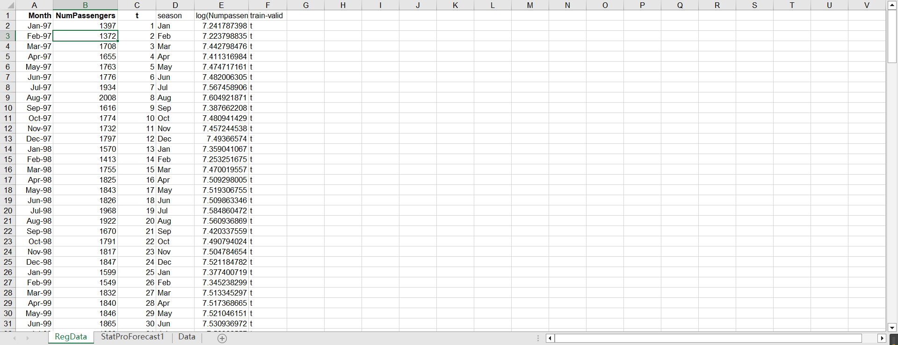

```python
import os
from openpyxl import load_workbook

file_name = os.path.join("files", "Amtrak.xlsx")
# 1. 获取对象
workbook_obj = load_workbook(file_name)

# 2. 读取workbook里面的所有sheet名字
sheet_list= workbook_obj.sheetnames
print(sheet_list)
```

运行结果：`['RegData', 'StatProForecast1', 'Data']`

```python
import os
from openpyxl import load_workbook

file_name = os.path.join("files", "Amtrak.xlsx")
# 1. 获取对象
workbook_obj = load_workbook(file_name)

# 2. 获取所有Worksheet对象
v2 = workbook_obj.worksheets
print(v2)

# 3. 获取某一个对象
v2[0]
v2[1]

# 4. 直接获取sheet对象
sheet_obj= workbook_obj["RegData"]
```

运行结果：`[<Worksheet "RegData">, <Worksheet "StatProForecast1">, <Worksheet "Data">]`

```python
import os
from openpyxl import load_workbook

file_name = os.path.join("files", "Amtrak.xlsx")
# 1. 获取对象
workbook_obj = load_workbook(file_name)

# 2. 读取workbook里面的所有sheet对象
sheet_obj_list = workbook_obj.worksheets

# 3. 获取某一个sheet对象
sheet_obj = sheet_obj_list[0]

# 4. 读取sheet中的单元格对象
cell_obj = sheet_obj.cell(row=1, column=1)

# 5. 读取cell对象中的文本
print(cell_obj.value)
```


```python
import os
from openpyxl import load_workbook

file_name = os.path.join("files", "Amtrak.xlsx")
# 1. 获取对象
workbook_obj = load_workbook(file_name)

# 2. 读取workbook里面的所有sheet对象
sheet_obj_list = workbook_obj.worksheets

# 3. 获取某一个sheet对象
sheet_obj = sheet_obj_list[0]

# 4. 读取sheet中的单元格对象 -- 方式1
cell_obj = sheet_obj.cell(row=1, column=1)

# 4. 读取sheet中的单元格对象 -- 方式2
cell_obj_1 = sheet_obj["A1"]

# 5. 读取cell对象中的文本
print(cell_obj.value)
print(cell_obj_1.value)
```

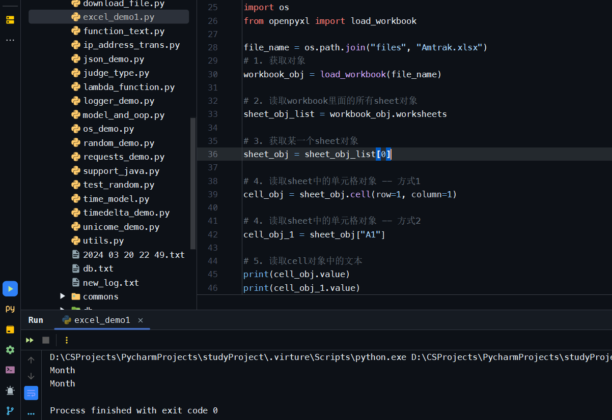

读取某一行:

> [!Caution]
>
> 再`python`操作`excel`的过程中,读取一行是从`1`开始的 而不是从`0`开始的

```python
import os
from openpyxl import load_workbook

file_name = os.path.join("files", "Amtrak.xlsx")
# 1. 获取对象
workbook_obj = load_workbook(file_name)

# 2. 读取workbook里面的所有sheet对象
sheet_obj_list = workbook_obj.worksheets

# 3. 获取某一个sheet对象
sheet_obj = sheet_obj_list[0]
row_tuple = sheet_obj[1]
print(row_tuple)

for cell_obj in row_tuple:
    print(cell_obj.value)
```

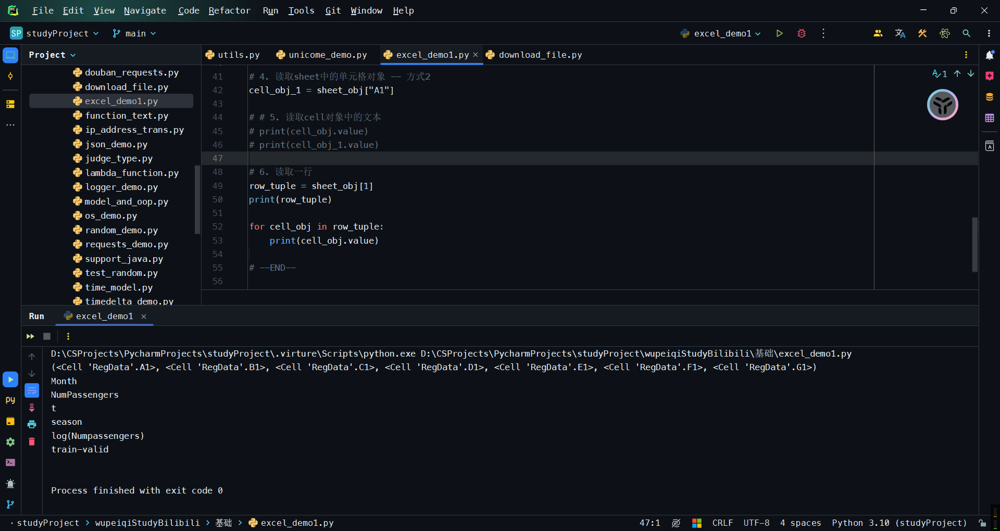

获取所有行数据:

```python
import os
from openpyxl import load_workbook

file_name = os.path.join("files", "Amtrak.xlsx")
# 1. 获取对象
workbook_obj = load_workbook(file_name)

# 2. 读取workbook里面的所有sheet对象
sheet_obj_list = workbook_obj.worksheets

# 3. 获取某一个sheet对象
sheet_obj = sheet_obj_list[0]

# 4. 读取sheet中的单元格对象 -- 方式1
cell_obj = sheet_obj.cell(row=1, column=1)

# 4. 读取sheet中的单元格对象 -- 方式2
cell_obj_1 = sheet_obj["A1"]

# 7. 读取所有行
for row in sheet_obj.rows:
    row_text_list = []
    for cell_obj in row:
        row_text_list.append(cell_obj.value)
    print(row_text_list)
```

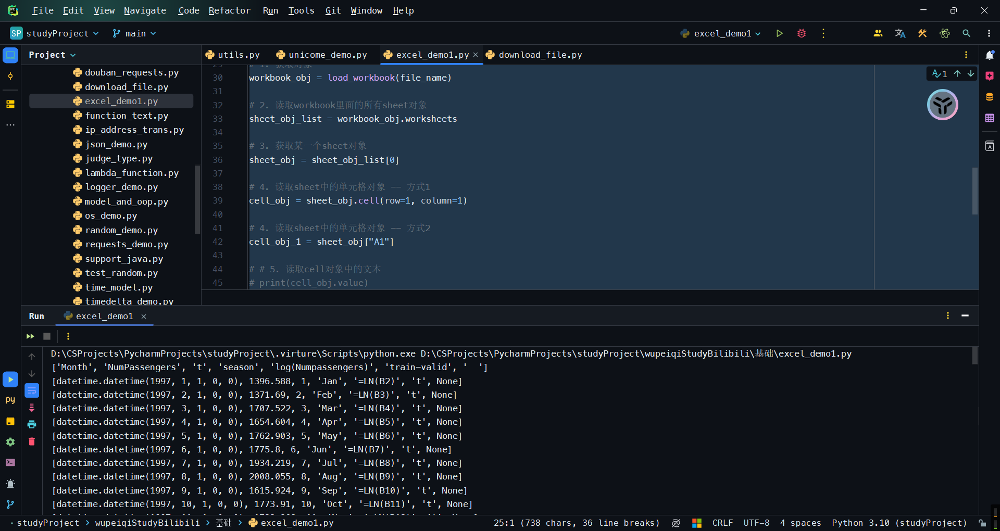

读取某一列:

```python
import os
from openpyxl import load_workbook

file_name = os.path.join("files", "Amtrak.xlsx")
# 1. 获取对象
workbook_obj = load_workbook(file_name)

# 2. 读取workbook里面的所有sheet对象
sheet_obj_list = workbook_obj.worksheets

# 3. 获取某一个sheet对象
sheet_obj = sheet_obj_list[0]

# 4. 读取sheet中的单元格对象 -- 方式1
cell_obj = sheet_obj.cell(row=1, column=1)

# 4. 读取sheet中的单元格对象 -- 方式2
cell_obj_1 = sheet_obj["A1"]
# 8. 读取所有列
for row in sheet_obj.rows:
    cell_obj_0 = row[0]
    cell_obj_1 = row[1]
    print(cell_obj_0.value, cell_obj_1.value)
```

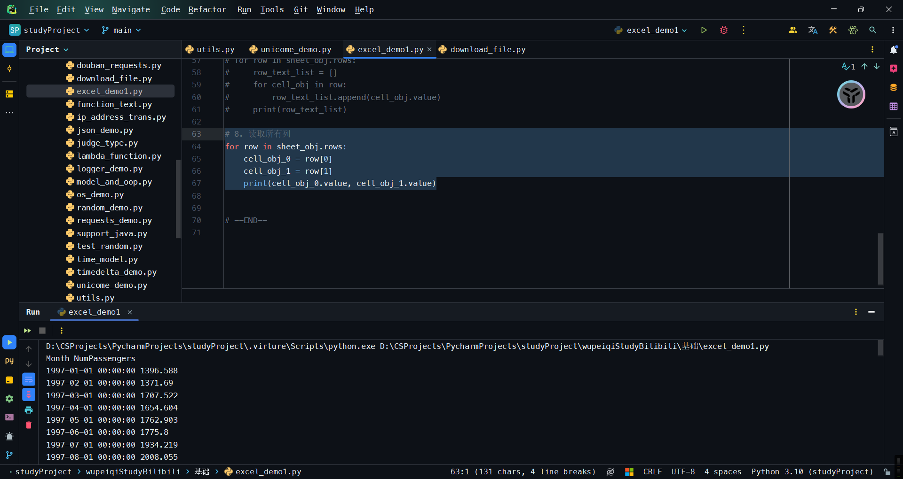

如果有合并单元格的情况:

> [!Caution]
>
> 注意:合并单元格后,只有合并之前的第一个单元格有数据(`Cell`对象),被合并的单元格为空(`MergeCell`对象)!!!

```python
import os
from openpyxl import load_workbook

file_name = os.path.join("files", "Amtrak.xlsx")
# 1. 获取对象
workbook_obj = load_workbook(file_name)

# 2. 读取workbook里面的所有sheet对象
sheet_obj_list = workbook_obj.worksheets

# 3. 获取某一个sheet对象
sheet_obj = sheet_obj_list[3]

# 10. 获取合并的单元格
cell_1_obj = sheet_obj.cell(1, 1)
cell_2_obj = sheet_obj.cell(1, 2)

print(cell_1_obj, cell_2_obj)
print(cell_1_obj.value, cell_2_obj.value)
```

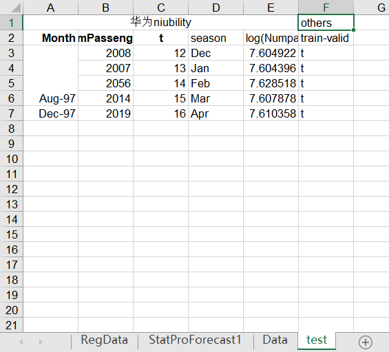

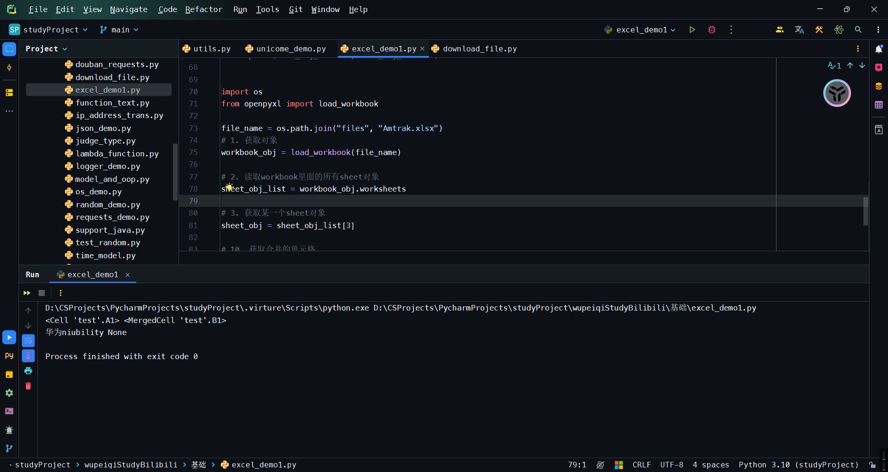

判断是否是被合并的单元格

```python
import os
from openpyxl import load_workbook
from openpyxl.cell.cell import Cell, MergedCell

file_name = os.path.join("files", "Amtrak.xlsx")
# 1. 获取对象
workbook_obj = load_workbook(file_name)

# 2. 读取workbook里面的所有sheet对象
sheet_obj_list = workbook_obj.worksheets

# 3. 获取某一个sheet对象
sheet_obj = sheet_obj_list[3]

# # 10. 获取合并的单元格
# cell_1_obj = sheet_obj.cell(1, 1)
# cell_2_obj = sheet_obj.cell(1, 2)
#
# print(cell_1_obj, cell_2_obj)
# print(cell_1_obj.value, cell_2_obj.value)

# # 原始内容:
# for row in sheet_obj.rows:
#     text_list = []
#     for cell in row:
#         text_list.append(cell.value)
#     print(text_list)

# 如果是被合并的单元格 让其默认值等于 -
for row in sheet_obj.rows:
    text_list = []
    for cell in row:
        # 判断 这个单元格是Cell对象还是MergeCell对象
        if type(cell) is MergedCell:
            text_list.append("-")
        elif type(cell) is Cell:
            text_list.append(cell.value)
        else:
            text_list.append("Dont Know")
    print(text_list)
```

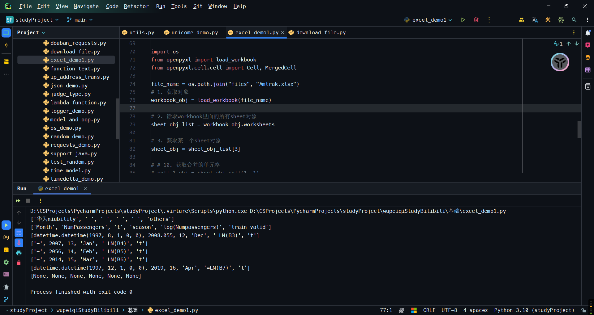

> [!Note]
>
> 扩展:让合并的单元格也能读到和合并之前第一个单元格一样的信息
>
> ```python
> import os
> from openpyxl import load_workbook
> from openpyxl.cell.cell import Cell, MergedCell
> 
> file_name = os.path.join("files", "Amtrak.xlsx")
> # 1. 获取对象
> workbook_obj = load_workbook(file_name)
> 
> # 2. 读取workbook里面的所有sheet对象
> sheet_obj_list = workbook_obj.worksheets
> 
> # 3. 获取某一个sheet对象
> sheet_obj = sheet_obj_list[3]
> 
> # 获取当前sheet中所有的合并的单元格
> def get_merged_cell(coordinate, sheet_obj):
>     """
> 
>     Args:
>         coordinate (): 坐标 需要这种形式: "A5"
>         sheet_obj (): 某一个sheet对象
> 
>     Returns:
> 
>     """
>     for item in sheet_obj.merged_cells:
>         # print(item, type(item))
>         if coordinate in item:
>             return item.start_cell.value
> 
> 
> # 如果是被合并的单元格 让其默认值等于第一个单元格的值
> for row in sheet_obj.rows:
>     text_list = []
>     for cell in row:
>         # 判断 这个单元格是Cell对象还是MergeCell对象
>         if type(cell) is MergedCell:
>             # 获取单元格的内容:
>             merged_text = get_merged_cell(cell.coordinate, sheet_obj)
>             text_list.append(merged_text)
>         elif type(cell) is Cell:
>             text_list.append(cell.value)
>         else:
>             text_list.append("Dont Know")
>     print(text_list)
> ```

关于坐标：
```python
import os
from openpyxl import load_workbook
from openpyxl.cell.cell import Cell, MergedCell

file_name = os.path.join("files", "Amtrak.xlsx")
# 1. 获取对象
workbook_obj = load_workbook(file_name)

# 2. 读取workbook里面的所有sheet对象
sheet_obj_list = workbook_obj.worksheets

# 3. 获取某一个sheet对象
sheet_obj = sheet_obj_list[3]

# 4. 获取cell对象
cell_object = sheet_obj.cell(1, 2)

# 5. 获取坐标位置
cell_coordinate = cell_object.coordinate
```

从第n行开始读取:

```python
import os
from openpyxl import load_workbook
from openpyxl.cell.cell import Cell, MergedCell

file_name = os.path.join("files", "Amtrak.xlsx")
# 1. 获取对象
workbook_obj = load_workbook(file_name)

# 2. 读取workbook里面的所有sheet对象
sheet_obj_list = workbook_obj.worksheets

# 3. 获取某一个sheet对象
sheet_obj = sheet_obj_list[3]

# 从第n行开始读 读到第m行
for row in sheet_obj.iter_rows(min_row=3, max_row=4):
    print(row[0].value)
```

当前sheet总共有几行

```python
import os
from openpyxl import load_workbook
from openpyxl.cell.cell import Cell, MergedCell

file_name = os.path.join("files", "Amtrak.xlsx")
# 1. 获取对象
workbook_obj = load_workbook(file_name)

# 2. 读取workbook里面的所有sheet对象
sheet_obj_list = workbook_obj.worksheets

# 3. 获取某一个sheet对象
sheet_obj = sheet_obj_list[3]

# 总共有几行 总共有几列
print(sheet_obj.max_row)
print(sheet_obj.max_column)
```

#### 2.3.1.2 Excel案例1

1. 根据excel文档,读取某几列,不要表头
    ```python
    import os
    from openpyxl import load_workbook
    
    file_path = os.path.join("files", "Amtrak.xlsx")
    
    workbook_obj = load_workbook(file_path)
    
    sheet_obj = workbook_obj.worksheets[1]
    
    for row_obj in sheet_obj.iter_rows(min_row=2):
        item = (row_obj[4].value, row_obj[5].value, row_obj[6].value, row_obj[10].value)
        print(item)
    ```

    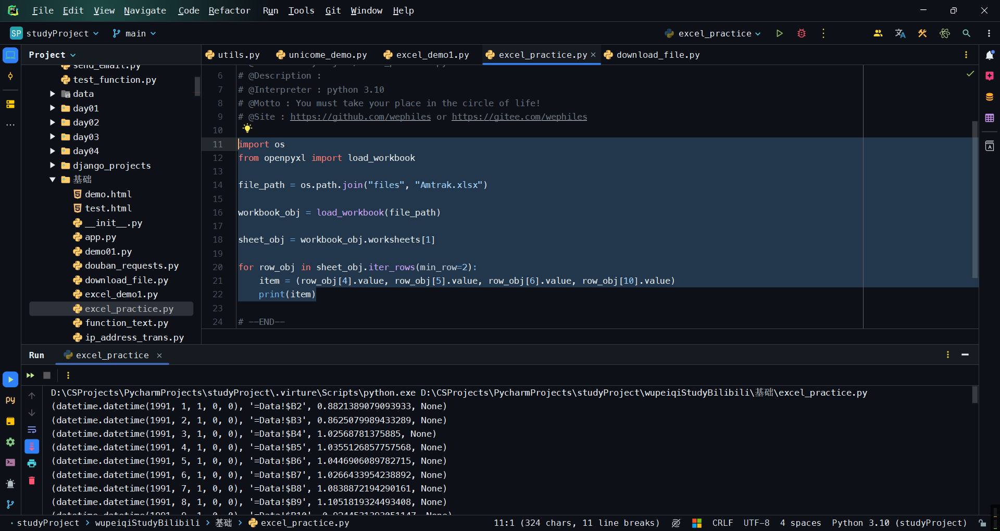

2. 需求:获取时间(整形)

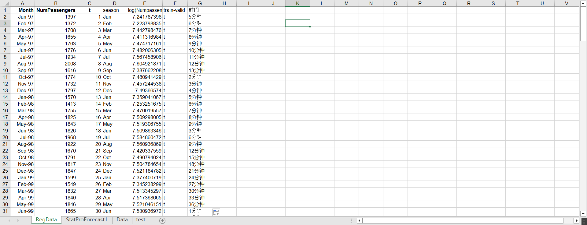

```python
import os
import re
from openpyxl import load_workbook

file_path = os.path.join("files", "Amtrak.xlsx")

workbook_obj = load_workbook(file_path)

sheet_obj = workbook_obj.worksheets[0]

for row_obj in sheet_obj.iter_rows(min_row=2):
    time_str = row_obj[6].value
    if not time_str:
        continue
    time_num = int(re.findall(r"(\d+)分钟", time_str)[0])
    if time_num > 10:
        print(time_num)
```

3. 找到`bankloan`这一个工作表,并且将收入综合计算出来
    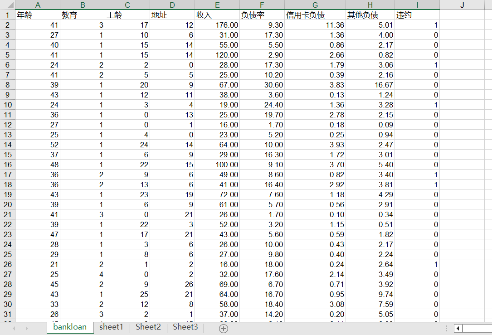

    ```python
    from openpyxl import load_workbook
    
    
    wb = load_workbook('./files/bankloan.xlsx')
    sheet_obj = None
    sum_ = 0
    sheet_names = wb.sheetnames
    for i in range(0, len(sheet_names)):
        if sheet_names[i] == "bankloan":
            sheet_obj = wb.worksheets[i]
    
    for row_obj in sheet_obj.iter_rows(min_row=2):
        cell_income_obj = row_obj[4]
        if not cell_income_obj.value:
            continue
        sum_ += cell_income_obj.value
        print(cell_income_obj.value)
    print("sum:", sum_)
    ```

    

4. 获取所有`sheet`里面的收入数量总和
    ```python
    import os
    import re
    from openpyxl import load_workbook
    
    file_path = os.path.join("files", "Amtrak.xlsx")
    
    workbook_obj = load_workbook(file_path)
    
    sheet_obj = workbook_obj.worksheets[0]
    
    for row_obj in sheet_obj.iter_rows(min_row=2):
        time_str = row_obj[6].value
        if not time_str:
            continue
        time_num = int(re.findall(r"(\d+)分钟", time_str)[0])
        if time_num > 10:
            print(time_num)
    ```

    ```python
    # 老师的
    import os
    from openpyxl import load_workbook
    
    file_path = os.path.join("files", "Amtrak.xlsx")
    
    workbook_obj = load_workbook(file_path)
    
    result = {}
    
    for sheet_obj in workbook_obj.worksheets:
        sheet_name = sheet_obj.title
    
        for row_list in sheet_obj.iter_rows(min_row=2):
            count = row_list[1].value
            if not count:
                continue
            total_count += count
        result[sheet_name] = total_count
    print(result)
    ```

5. 牛逼的来啦！找到`2020`年的`excel`文件 计算这些`excel`文件中`bankloan`这一个`sheet`的所有收入的总和 -- 只要`2020`年的
    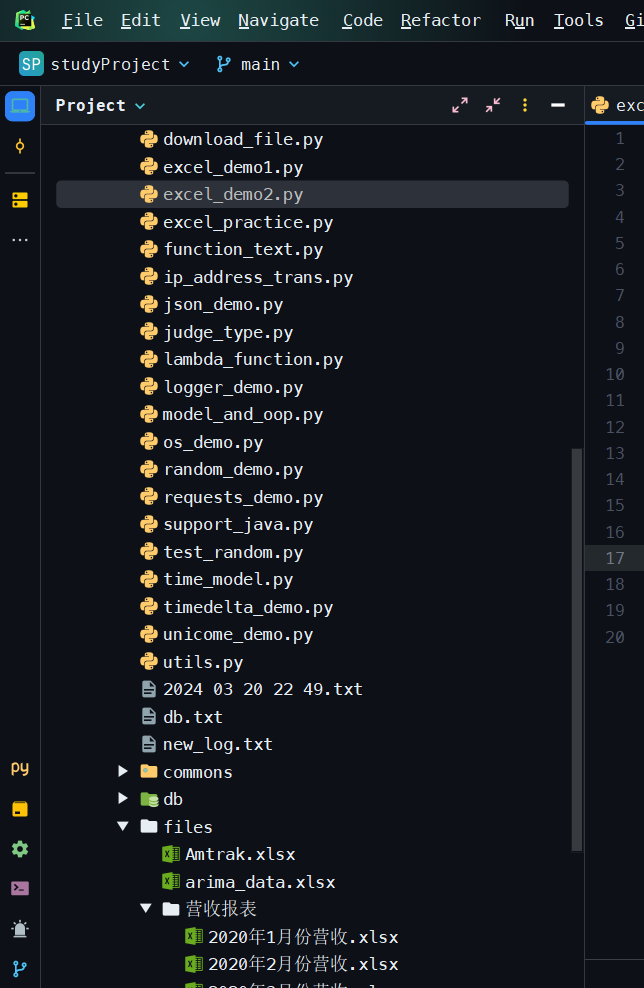
    
    ```python
    # 输出形式
    
    result = {
        "2020年1月份营收": {
            "sheet1": 10025,
            "sheet2": 15864,
            "sheet3": 15864,
            "sheet4": 15864,
        },
        "2020年2月份营收": {
            "sheet1": 10025,
            "sheet2": 15864,
            "sheet3": 15864,
            "sheet4": 15864,
        },
        ...
    }
    ```
    
    ```python
    import os
    from pprint import pprint
    from openpyxl import load_workbook
    
    # 列出所有的文件名
    
    result = {}
    
    
    file_folder = os.path.join("files", "营收报表")
    file_list = os.listdir(file_folder)
    
    # 遍历所有文件
    for file_name_str in file_list:
        if not file_name_str.startwith("2020"):
            continue
        # 去掉后缀名，形成字典的key
        file_delete_postfix_name = file_name_str.split(".")[0]
    
        # 初始化result字典
        result[file_delete_postfix_name] = dict()
    
        # 初始化工作簿对象
        workbook_obj = load_workbook(os.path.join(file_folder, file_name_str))
    
        # 遍历一个文件里面的所有sheet
        for sheet_name in workbook_obj.sheetnames:
            # workbook_obj.sheetnames ： 是个列表，里面包含了所有的sheet名称，每个元素都是字符串
            sum_ = 0  # 用以计算总收入
    
            # 获取sheet对象
            sheet_obj = workbook_obj[sheet_name]
            # 遍历所有行
            for row_obj in sheet_obj.iter_rows(min_row=2):
                num_income = row_obj[4].value  # 获取每一行的数据
                if not num_income:
                    continue
                sum_ += int(num_income)  # 不空的话求和
            result[file_delete_postfix_name][sheet_name] = sum_  # 保存数据
    pprint(result)
    ```
    
    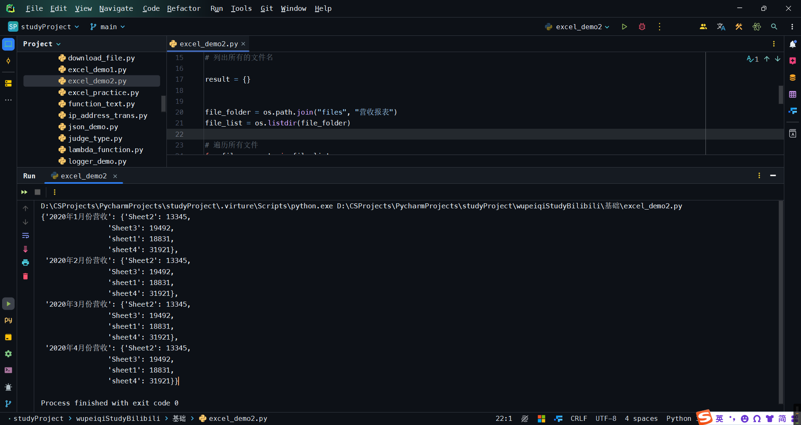
    
    > [!Important]
    >
    > 补充：获取sheet有两种方式：
    >
    > ```python
    > # 第一种
    > for sheet_name in workbook_obj.sheetnames:
    >     print(sheet_name, workbook_obj[sheet_name])
    > #第二种
    > for worksheet_obj in workbook_obj.worksheets:
    >     print(worksheet_obj.title, worksheet_obj)
    > ```

#### 2.3.1.2 写

- 修改
    ```python
    · 读取，将所有的内容都读取到内存
    · 都是在内存中进行修改的
    · 保存
    ```

    ```python
    import os
    from openpyxl import load_workbook
    
    FILE_FOLDER = os.path.join("files", "营收报表", "2020年1月份营收.xlsx")
    
    # 获取workbook对象
    workbook_obj = load_workbook(FILE_FOLDER)
    
    sheet_obj = workbook_obj.worksheets[0]
    
    cell_obj = sheet_obj.cell(row=1, column=1)
    print(cell_obj.value)
    
    cell_obj.value = "age"
    print(cell_obj.value)
    
    # 将内存中的数据写入到磁盘
    workbook_obj.save(os.path.join("files",  "2020年1月份营收-修改.xlsx"))
    ```

- 新建
    ```python
    · 读取空内容
    · 在内存中修改操作
    · 保存
    ```

    ```python
    # 新建excel文件
    
    import os
    from openpyxl.workbook import Workbook
    
    FILE_FOLDER = os.path.join("files", "营收报表", "2020年1月份营收.xlsx")
    workbook_obj = Workbook()
    sheet_obj = workbook_obj.worksheets[0]
    cell_obj = sheet_obj.cell(row=1, column=1)
    
    cell_obj.value = "age"
    workbook_obj.save("./files/create.xlsx")
    ```

    ```python
    import os
    from openpyxl.workbook import Workbook
    
    FILE_FOLDER = os.path.join("files", "营收报表", "2020年1月份营收.xlsx")
    workbook_obj = Workbook()
    
    workbook_obj.save("./files/create_1.xlsx")
    ```

    ```python
    import os
    from openpyxl.workbook import Workbook
    
    FILE_FOLDER = os.path.join("files", "营收报表", "2020年1月份营收.xlsx")
    
    # 创建一个workbook对象 创建好以后会自动生成一个默认的worksheet--sheet1
    workbook_obj = Workbook()
    sheet_0 = workbook_obj.worksheets[0]
    sheet_0.title = "数据集"
    sheet_0.cell(row=1, column=1, value="A")
    sheet_0.cell(row=1, column=2, value="B")
    sheet_0.cell(row=1, column=3, value="C")
    sheet_0.cell(row=1, column=4, value="D")
    
    # 创建sheet
    sheet_1 = workbook_obj.create_sheet(title="上海", index=1)
    sheet_1.cell(row=1, column=1, value="A")
    sheet_1.cell(row=1, column=2).value = "B"
    sheet_1.cell(row=1, column=3).value = "C"
    sheet_1.cell(row=1, column=4).value = "D"
    
    sheet_2 = workbook_obj.create_sheet(title="北京", index=2)
    sheet_3 = workbook_obj.create_sheet(title="广州", index=3)
    sheet_4 = workbook_obj.create_sheet(title="深圳", index=4)
    
    workbook_obj.save("./files/create_1.xlsx")
    ```

- 拷贝`sheet`

    ```python
    import os
    from openpyxl.workbook import Workbook
    
    FILE_FOLDER = os.path.join("files", "营收报表", "2020年1月份营收.xlsx")
    
    # 创建一个workbook对象 创建好以后会自动生成一个默认的worksheet
    workbook_obj = Workbook()
    sheet_0 = workbook_obj.worksheets[0]
    
    workbook_obj
    ```

    ```python
    import os
    from openpyxl.workbook import Workbook
    
    FILE_FOLDER = os.path.join("files", "营收报表", "2020年1月份营收.xlsx")
    
    # 创建一个workbook对象 创建好以后会自动生成一个默认的worksheet
    workbook_obj = Workbook()
    sheet_0 = workbook_obj.worksheets[0]
    
    new_sheet = workbook_obj.copy_worksheet(sheet_0)
    
    new_sheet.title = "备份"
    
    workbook_obj.save("./files/create_new.xlsx")
    ```

- 删除`sheet`

    ```python
    import os
    from openpyxl import load_workbook
    
    file_name = os.path.join("files", "create_new.xlsx")
    # 1. 获取对象
    workbook_obj = load_workbook(file_name)
    
    del workbook_obj["备份"]
    
    workbook_obj.save("./files/create_new.xlsx")
    ```

- 单元格中写数据:

    ```python
    from openpyxl.workbook import Workbook
    
    workbook_obj = Workbook()
    
    sheet_0 = workbook_obj.worksheets[0]
    
    # 操作cell方式一
    cell_obj = sheet_0.cell(1, 1)
    cell_obj.value = "学生ID"
    
    # 操作cell方式二
    sheet_0["B1"] = "姓名"
    
    # 操作cell方式三
    cell_obj_3 = sheet_0["C1"]
    cell_obj_3.value = "年龄"
    
    workbook_obj.save("./files/op_cell.xlsx")
    ```

- 设置对齐方式
    ```python
    from openpyxl.styles import Alignment
    from openpyxl.workbook import Workbook
    
    workbook_obj = Workbook()
    
    sheet_0 = workbook_obj.worksheets[0]
    
    # 居中 换行
    cell_obj = sheet_0.cell(1, 1)
    cell_obj.value = "学生ID学生ID学生ID学生ID学生ID"
    cell_obj.alignment = Alignment(horizontal="center", vertical="center", wrap_text=True)  # 设置居中、wrap_text自动换行
    
    workbook_obj.save("./files/op_cell.xlsx")
    ```

    ```python
    # 多个单元格同时居中
    from openpyxl.styles import Alignment
    from openpyxl.workbook import Workbook
    
    workbook_obj = Workbook()
    
    sheet_0 = workbook_obj.worksheets[0]
    
    name_list = ["张三", "里斯", "王五", "二麻子"]
    
    # 居中 换行
    sheet_0.cell(row=1, column=1).value = "姓名"
    sheet_0.cell(row=1, column=1).alignment = Alignment(horizontal="center", vertical="center", wrap_text=True)
    for row, text in enumerate(name_list, 2):
        cell_obj = sheet_0.cell(row, 1)
        cell_obj.value = text
        cell_obj.alignment = Alignment(horizontal="center", vertical="center", wrap_text=True)  # 设置居中、wrap_text自动换行
    
    workbook_obj.save("./files/op_cell.xlsx")
    ```

    ```python
    # 边框
    from openpyxl.styles import Alignment, Border, Side
    from openpyxl.workbook import Workbook
    
    workbook_obj = Workbook()
    
    sheet_0 = workbook_obj.worksheets[0]
    
    name_list = ["张三", "里斯", "王五", "二麻子"]
    
    # 居中 换行
    sheet_0.cell(row=1, column=1).value = "姓名"
    sheet_0.cell(row=1, column=1).alignment = Alignment(horizontal="center", vertical="center", wrap_text=True)
    for row, text in enumerate(name_list, 2):
        cell_obj = sheet_0.cell(row, 1)
        cell_obj.value = text
        cell_obj.alignment = Alignment(horizontal="center", vertical="center", wrap_text=True)  # 设置居中、wrap_text自动换行
        cell_obj.border = Border(top=Side(style="thin", color="0000FF"),
                                 left=Side(style="thin", color="0000FF"),
                                 right=Side(style="medium", color="0000FF"),
                                 bottom=Side(style="medium", color="0000FF"))
    
    workbook_obj.save("./files/op_cell.xlsx")
    ```

- 设置字体颜色、大小、样式等
    ```python
    from openpyxl.styles import Alignment, Border, Side, Font
    from openpyxl.workbook import Workbook
    
    workbook_obj = Workbook()
    
    sheet_0 = workbook_obj.worksheets[0]
    
    name_list = ["张三", "里斯", "王五", "二麻子"]
    
    # 居中 换行
    sheet_0.cell(row=1, column=1).value = "姓名"
    sheet_0.cell(row=1, column=1).alignment = Alignment(horizontal="center", vertical="center", wrap_text=True)
    for row, text in enumerate(name_list, 2):
        cell_obj = sheet_0.cell(row, 1)
        cell_obj.value = text
        cell_obj.alignment = Alignment(horizontal="center", vertical="center", wrap_text=True)  # 设置居中、wrap_text自动换行
        cell_obj.border = Border(top=Side(style="thin", color="0000FF"),
                                 left=Side(style="thin", color="0000FF"),
                                 right=Side(style="medium", color="0000FF"),
                                 bottom=Side(style="medium", color="0000FF"))
        cell_obj.font = Font(name="宋体", size=12, bold=True, italic=False, color="FFFF00")
    
    workbook_obj.save("./files/op_cell.xlsx")
    ```

- 行高、宽
    ```python
    from openpyxl.styles import Alignment, Border, Side, Font
    from openpyxl.workbook import Workbook
    
    workbook_obj = Workbook()
    
    sheet_0 = workbook_obj.worksheets[0]
    
    name_list = ["张三", "里斯", "王五", "二麻子"]
    
    # 设置行高 宽度
    sheet_0.row_dimensions[1].height = 50
    sheet_0.column_dimensions["A"].width = 80
    sheet_0.column_dimensions["B"].width = 100
    
    # 居中 换行
    sheet_0.cell(row=1, column=1).value = "姓名"
    sheet_0.cell(row=1, column=1).alignment = Alignment(horizontal="center", vertical="center", wrap_text=True)
    for row, text in enumerate(name_list, 2):
        cell_obj = sheet_0.cell(row, 1)
        cell_obj.value = text
        cell_obj.alignment = Alignment(horizontal="center", vertical="center", wrap_text=True)  # 设置居中、wrap_text自动换行
        cell_obj.border = Border(top=Side(style="thin", color="0000FF"),
                                 left=Side(style="thin", color="0000FF"),
                                 right=Side(style="medium", color="0000FF"),
                                 bottom=Side(style="medium", color="0000FF"))
        cell_obj.font = Font(name="宋体", size=12, bold=True, italic=False, color="FFFF00")
    
    workbook_obj.save("./files/op_cell.xlsx") 
    ```

- 设置背景色
    ```python
    from openpyxl.styles import Alignment, Border, Side, Font, PatternFill, Color
    from openpyxl.workbook import Workbook
    
    workbook_obj = Workbook()
    
    sheet_0 = workbook_obj.worksheets[0]
    
    name_list = ["张三", "里斯", "王五", "二麻子"]
    
    # 设置行高 宽度
    sheet_0.row_dimensions[1].height = 50
    sheet_0.column_dimensions["A"].width = 80
    sheet_0.column_dimensions["B"].width = 100
    
    # 居中 换行
    sheet_0.cell(row=1, column=1).value = "姓名"
    sheet_0.cell(row=1, column=1).alignment = Alignment(horizontal="center", vertical="center", wrap_text=True)
    
    # 背景色
    sheet_0.cell(row=1, column=1).fill = PatternFill(patternType='solid', fgColor=Color(rgb="808080"))
    
    for row, text in enumerate(name_list, 2):
        cell_obj = sheet_0.cell(row, 1)
        cell_obj.value = text
        cell_obj.alignment = Alignment(horizontal="center", vertical="center", wrap_text=True)  # 设置居中、wrap_text自动换行
        cell_obj.border = Border(top=Side(style="thin", color="0000FF"),
                                 left=Side(style="thin", color="0000FF"),
                                 right=Side(style="medium", color="0000FF"),
                                 bottom=Side(style="medium", color="0000FF"))
        cell_obj.font = Font(name="宋体", size=12, bold=True, italic=False, color="FFFF00")
    
    workbook_obj.save("./files/op_cell.xlsx")
    ```

- **整合起来**

    ```python
    from openpyxl.styles import Alignment, Border, Side, Font, PatternFill, Color
    from openpyxl.workbook import Workbook
    
    workbook_obj = Workbook()
    
    sheet_0 = workbook_obj.worksheets[0]
    
    name_list = ["张三", "里斯", "王五", "二麻子"]
    
    # 设置行高 宽度
    sheet_0.row_dimensions[1].height = 50
    sheet_0.column_dimensions["A"].width = 80
    sheet_0.column_dimensions["B"].width = 100
    
    # 居中 换行
    sheet_0.cell(row=1, column=1).value = "姓名"
    sheet_0.cell(row=1, column=1).alignment = Alignment(horizontal="center", vertical="center", wrap_text=True)
    sheet_0.cell(row=1, column=1).fill = PatternFill(patternType='solid', fgColor=Color(rgb="808080"))
    
    for row, text in enumerate(name_list, 2):
        cell_obj = sheet_0.cell(row, 1)
        cell_obj.value = text
        cell_obj.alignment = Alignment(horizontal="center", vertical="center", wrap_text=True)  # 设置居中、wrap_text自动换行
        cell_obj.border = Border(top=Side(style="thin", color="0000FF"),
                                 left=Side(style="thin", color="0000FF"),
                                 right=Side(style="medium", color="0000FF"),
                                 bottom=Side(style="medium", color="0000FF"))
        cell_obj.font = Font(name="宋体", size=12, bold=True, italic=False, color="FFFF00")
    
    workbook_obj.save("./files/op_cell.xlsx")
    ```

#### 2.3.1.3 `excel`案例2

```python
# 将文件内容写到excel里面
from openpyxl.workbook import Workbook

workbook_obj = Workbook()

sheet_obj = workbook_obj.worksheets[0]
sheet_obj.title = "用户信息"

sheet_obj.cell(row=1, column=1).value = "用户名"
sheet_obj.cell(row=1, column=2).value = "密码"
sheet_obj.cell(row=1, column=3).value = "个人邮箱"

with open("./db/users/account.txt", "r", encoding='utf-8') as fp:
    line_num = 2
    for line in fp:
        line = line.strip()
        if not line:
            continue
        user_msg = line.split(",")
        for col, msg in enumerate(user_msg, start=1):
            sheet_obj.cell(line_num, col).value = msg
        line_num += 1


workbook_obj.save("./files/db/user_info.xlsx")
```

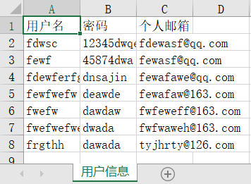

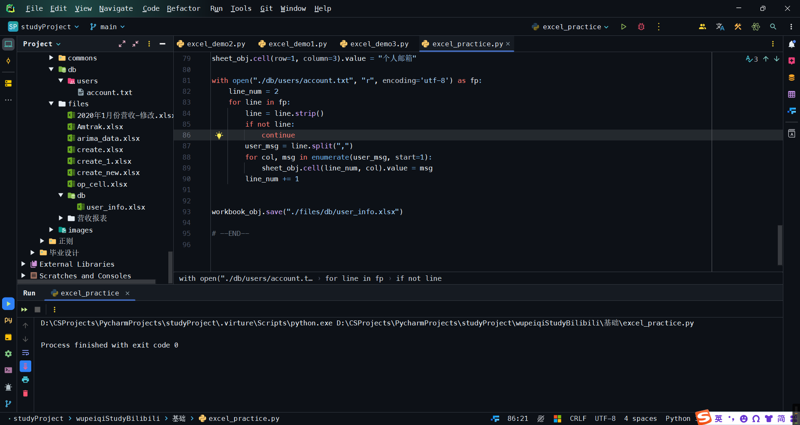

- 在此基础上，给表头加上背景色、边框、居中、字体颜色。

```python
from openpyxl.workbook import Workbook
from openpyxl.styles import Font, Alignment, Color, PatternFill, Border, Side

workbook_obj = Workbook()

sheet_obj = workbook_obj.worksheets[0]
sheet_obj.title = "用户信息"

# 表头 居中 字体 背景颜色
sheet_obj.cell(row=1, column=1).value = "用户名"
sheet_obj.cell(row=1, column=1).alignment = Alignment(horizontal="center", vertical="center")
sheet_obj.cell(row=1, column=1).fill = PatternFill(fgColor="DCDCDC", patternType="solid")
sheet_obj.cell(row=1, column=1).font = Font(bold=True, size=12, color=Color(rgb="FF0000"))
sheet_obj.cell(row=1, column=1).border = Border(left=Side(border_style="medium", color="000000"),
                                                right=Side(border_style="medium", color="000000"),
                                                top=Side(border_style="medium", color="000000"),
                                                bottom=Side(border_style="medium", color="000000"),
                                                )

sheet_obj.cell(row=1, column=2).value = "密码"
sheet_obj.cell(row=1, column=2).alignment = Alignment(horizontal="center", vertical="center")
sheet_obj.cell(row=1, column=2).fill = PatternFill(fgColor="DCDCDC", patternType="solid")
sheet_obj.cell(row=1, column=2).font = Font(bold=True, size=12, color=Color(rgb="FF0000"))
sheet_obj.cell(row=1, column=2).border = Border(left=Side(border_style="medium", color="000000"),
                                                right=Side(border_style="medium", color="000000"),
                                                top=Side(border_style="medium", color="000000"),
                                                bottom=Side(border_style="medium", color="000000"),
                                                )

sheet_obj.cell(row=1, column=3).value = "个人邮箱"
sheet_obj.cell(row=1, column=3).alignment = Alignment(horizontal="center", vertical="center")
sheet_obj.cell(row=1, column=3).fill = PatternFill(fgColor="DCDCDC", patternType="solid")
sheet_obj.cell(row=1, column=3).font = Font(bold=True, size=12, color=Color(rgb="FF0000"))
sheet_obj.cell(row=1, column=3).border = Border(left=Side(border_style="medium", color="000000"),
                                                right=Side(border_style="medium", color="000000"),
                                                top=Side(border_style="medium", color="000000"),
                                                bottom=Side(border_style="medium", color="000000"),
                                                )

with open("./db/users/account.txt", "r", encoding='utf-8') as fp:
    line_num = 2
    for line in fp:
        line = line.strip()
        if not line:
            continue
        user_msg = line.split(",")
        for col, msg in enumerate(user_msg, start=1):
            sheet_obj.cell(line_num, col).value = msg
        line_num += 1


workbook_obj.save("./files/db/user_info.xlsx")
```

- 写得简洁一点：

```python
from openpyxl.workbook import Workbook
from openpyxl.styles import Font, Alignment, Color, PatternFill, Border, Side

workbook_obj = Workbook()

sheet_obj = workbook_obj.worksheets[0]
sheet_obj.title = "用户信息"

header_name_list = ["用户名", "密码", "个人邮箱"]

# 表头 居中 字体 背景颜色 边框
for col, header_name in enumerate(header_name_list, start=1):
    sheet_obj.cell(row=1, column=col).value = header_name
    sheet_obj.cell(row=1, column=col).alignment = Alignment(horizontal="center", vertical="center")
    sheet_obj.cell(row=1, column=col).fill = PatternFill(fgColor="DCDCDC", patternType="solid")
    sheet_obj.cell(row=1, column=col).font = Font(bold=True, size=12, color=Color(rgb="FF0000"))
    sheet_obj.cell(row=1, column=col).border = Border(left=Side(border_style="medium", color="000000"),
                                                      right=Side(border_style="medium", color="000000"),
                                                      top=Side(border_style="medium", color="000000"),
                                                      bottom=Side(border_style="medium", color="000000"),
                                                      )

with open("./db/users/account.txt", "r", encoding='utf-8') as fp:
    line_num = 2
    for line in fp:
        line = line.strip()
        if not line:
            continue
        user_msg = line.split(",")
        for col, msg in enumerate(user_msg, start=1):
            sheet_obj.cell(line_num, col).value = msg
        line_num += 1

workbook_obj.save("./files/db/user_info.xlsx")
```

- 设置列宽：

```python
from openpyxl.workbook import Workbook
from openpyxl.styles import Font, Alignment, Color, PatternFill, Border, Side
from openpyxl.utils import get_column_letter


workbook_obj = Workbook()

sheet_obj = workbook_obj.worksheets[0]
sheet_obj.title = "用户信息"

header_name_list = ["用户名", "密码", "个人邮箱"]

for i in range(1, 4):
    sheet_obj.column_dimensions[get_column_letter(i)].width = 30


# 表头 居中 字体 背景颜色 边框
for col, header_name in enumerate(header_name_list, start=1):
    sheet_obj.cell(row=1, column=col).value = header_name
    sheet_obj.cell(row=1, column=col).alignment = Alignment(horizontal="center", vertical="center")
    sheet_obj.cell(row=1, column=col).fill = PatternFill(fgColor="DCDCDC", patternType="solid")
    sheet_obj.cell(row=1, column=col).font = Font(name="楷体", bold=True, size=12, color=Color(rgb="FF0000"))
    sheet_obj.cell(row=1, column=col).border = Border(left=Side(border_style="medium", color="000000"),
                                                      right=Side(border_style="medium", color="000000"),
                                                      top=Side(border_style="medium", color="000000"),
                                                      bottom=Side(border_style="medium", color="000000"),
                                                      )

with open("./db/users/account.txt", "r", encoding='utf-8') as fp:
    line_num = 2
    for line in fp:
        line = line.strip()
        if not line:
            continue
        user_msg = line.split(",")
        for col, msg in enumerate(user_msg, start=1):
            sheet_obj.cell(line_num, col).value = msg
        line_num += 1

workbook_obj.save("./files/db/user_info.xlsx")
```

- 设置合并单元格 -- 有两种方法

```python
from openpyxl.workbook import Workbook

workbook_obj = Workbook()
sheet_obj = workbook_obj.worksheets[0]
cell_obj = sheet_obj.cell(row=2, column=3)
cell_obj.value = "年龄"

# 合并单元格 -- 方法一
sheet_obj.merge_cells("D2:F8")

# 合并单元格 -- 方法二
sheet_obj.merge_cells(start_row=10, start_column=10, end_row=20, end_column=20)

workbook_obj.save("./files/merge_sheet.xlsx")
```

```python
from openpyxl.workbook import Workbook
from openpyxl.styles import Alignment

workbook_obj = Workbook()
sheet_obj = workbook_obj.worksheets[0]
cell_obj = sheet_obj.cell(row=1, column=1)
cell_obj.value = "瑾瑜"
cell_obj.alignment = Alignment(horizontal="center", vertical="center")

# Merge cells A1:C1
sheet_obj.merge_cells(start_row=1, start_column=1, end_row=1, end_column=3)

workbook_obj.save("./files/merge_sheet.xlsx")
```

- 整合

```python
from openpyxl.workbook import Workbook
from openpyxl.styles import Font, Alignment, Color, PatternFill, Border, Side
from openpyxl.utils import get_column_letter


workbook_obj = Workbook()

sheet_obj = workbook_obj.worksheets[0]
sheet_obj.title = "用户信息"

header_name_list = ["用户名", "密码", "个人邮箱"]

for i in range(1, 4):
    sheet_obj.column_dimensions[get_column_letter(i)].width = 30

sheet_obj.cell(row=1, column=1).value = "瑾瑜"
sheet_obj.cell(row=1, column=1).alignment = Alignment(horizontal="center", vertical="center")
sheet_obj.merge_cells(start_row=1, start_column=1, end_row=1, end_column=3)

# 表头 居中 字体 背景颜色 边框
for col, header_name in enumerate(header_name_list, start=1):
    sheet_obj.cell(row=2, column=col).value = header_name
    sheet_obj.cell(row=2, column=col).alignment = Alignment(horizontal="center", vertical="center")
    sheet_obj.cell(row=2, column=col).fill = PatternFill(fgColor="DCDCDC", patternType="solid")
    sheet_obj.cell(row=2, column=col).font = Font(name="楷体", bold=True, size=12, color=Color(rgb="FF0000"))
    sheet_obj.cell(row=2, column=col).border = Border(left=Side(border_style="medium", color="000000"),
                                                      right=Side(border_style="medium", color="000000"),
                                                      top=Side(border_style="medium", color="000000"),
                                                      bottom=Side(border_style="medium", color="000000"),
                                                      )

with open("./db/users/account.txt", "r", encoding='utf-8') as fp:
    line_num = 3
    for line in fp:
        line = line.strip()
        if not line:
            continue
        user_msg = line.split(",")
        for col, msg in enumerate(user_msg, start=1):
            sheet_obj.cell(line_num, col).value = msg
        line_num += 1

workbook_obj.save("./files/db/user_info.xlsx")
```

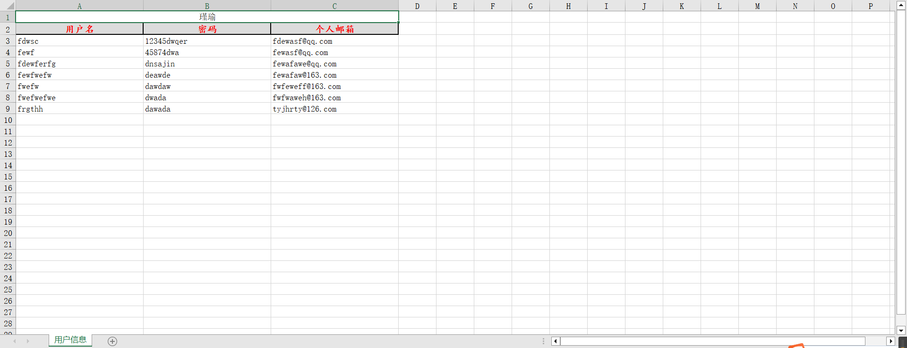

#### 2.3.1.4 补充

- 写入公式

```python
from openpyxl.workbook import Workbook

workbook_obj = Workbook()

sheet_0 = workbook_obj.worksheets[0]

# 数量
sheet_0["A1"] = 10
sheet_0["A2"] = 20
sheet_0["A3"] = 8

# 单价
sheet_0["B1"] = 3
sheet_0["B2"] = 8
sheet_0["B3"] = 9

# 写入公式
sheet_0["C1"] = "=A1*B1"
sheet_0["C2"] = "=A2*B2"
sheet_0["C3"] = "=A3*B3"

sheet_0["D1"] = "=sum(A1,B1)"
sheet_0["D2"] = "=sum(A2,B2)"
sheet_0["D3"] = "=sum(A3,B3)"

workbook_obj.save("./files/equal_excel.xlsx")
```

- 删除

```python
from openpyxl.workbook import Workbook

workbook_obj = Workbook()

sheet_0 = workbook_obj.worksheets[0]

# 数量
sheet_0["A1"] = 10
sheet_0["A2"] = 20
sheet_0["A3"] = 8

# 单价
sheet_0["B1"] = 3
sheet_0["B2"] = 8
sheet_0["B3"] = 9

# 写入公式
sheet_0["C1"] = "=A1*B1"
sheet_0["C2"] = "=A2*B2"
sheet_0["C3"] = "=A3*B3"

sheet_0["D1"] = "=sum(A1,B1)"
sheet_0["D2"] = "=sum(A2,B2)"
sheet_0["D3"] = "=sum(A3,B3)"

sheet_0.delete_rows(idx=2, amount=1)  # 从第二行开始删除 删除的行数为1 amount默认值为1
sheet_0.delete_columns(idx=3, amount=1)  # 从第三列开始删除 删除的列数为1 amount默认值为1

workbook_obj.save("./files/equal_excel.xlsx")
```

- 插入

```python
from openpyxl.workbook import Workbook

workbook_obj = Workbook()

sheet_0 = workbook_obj.worksheets[0]

# 数量
sheet_0["A1"] = 10
sheet_0["A2"] = 20
sheet_0["A3"] = 8

# 单价
sheet_0["B1"] = 3
sheet_0["B2"] = 8
sheet_0["B3"] = 9

# 写入公式
sheet_0["C1"] = "=A1*B1"
sheet_0["C2"] = "=A2*B2"
sheet_0["C3"] = "=A3*B3"

sheet_0["D1"] = "=sum(A1,B1)"
sheet_0["D2"] = "=sum(A2,B2)"
sheet_0["D3"] = "=sum(A3,B3)"

# sheet_0.delete_rows(idx=2, amount=1)  # 从第二行开始删除 删除的行数为1
# sheet_0.delete_columns(idx=3, amount=1)  # 从第三列开始删除 删除的列数为1

sheet_0.insert_rows(idx=1, amount=3)
sheet_0.insert_cols(idx=1, amount=2)

workbook_obj.save("./files/equal_excel.xlsx")
```

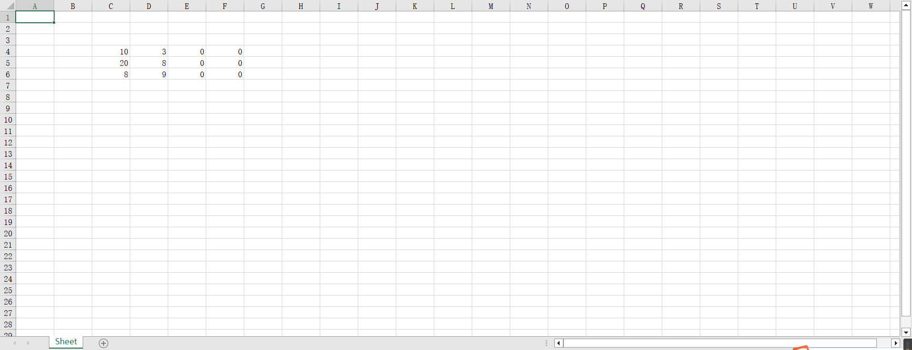

- 追加

> [!Caution]
>
> 注意，这里面最大行`max_row`这个参数，如果元`Excel`没有数据，那么`max_row`的值为`1`，如果有`n(n>=1)`行数据，那么`max_row`的值为`n`，这一点要额外注意，下面的代码演示了如何通过条件判断来避免产生错误。

```python
import os
from openpyxl import load_workbook, Workbook


def write_excel(user_name, password):
    """
    将用户名和密码写入excel文件。
    Args:
        user_name (str): 用户名
        password (str): 密码

    Returns:

    """
    # 1. 文件是否存在
    file_path = os.path.join("files", "db.xlsx")
    if os.path.exists(file_path):
        # 2. 打开文件
        workbook_obj = load_workbook(file_path)
    else:
        # 3. 创建文件
        workbook_obj = Workbook()
    sheet_obj = workbook_obj.worksheets[0]

    # 4. 写入数据
    first_row_data = sheet_obj.cell(row=1, column=1).value
    if not first_row_data:  # 第一行没有数据
        row_index = 1
    else:  # 第一行有数据
        row_index = sheet_obj.max_row + 1

    sheet_obj.cell(row=row_index, column=1).value = user_name
    sheet_obj.cell(row=row_index, column=2).value = password
    workbook_obj.save(file_path)


def run():
    """
    程序入口。
    Returns:

    """
    while True:
        print("输入用户名和密码，输入q/Q退出:")
        user_name = input("用户名 >>> ")
        password = input("密  码 >>> ")
        if user_name == "q" or user_name == "q":
            break
        write_excel(user_name, password)


if __name__ == '__main__':
    run()
```

> [!Important]
>
> 如果在开发过程中遇到不知道的问题，有下列一些方法：
>
> - 搜索
>     ```python
>     - 百度(最不可信)
>     - Google
>     - stackoverflow
>     ```
>
> - 官方文档和源码(需要知道面向对象等知识)

### 2.3.2 `Word`操作

```python
pip install python-docx
```

- `.docx`文件 -- 本质上是一个压缩包

- `.docx`文件 -- 底层存储:`xml`格式 `python-docx`本质上就是去解析`xml`文件

    ```
    <x1>fesdj9fjw0efsk</x1>
    <xx>
    	<mm>fewgregrthytjuykdgtr<mm>
    <xx>
    ```

    1. 读

    - 段落对象 -- `pragraph`
    - 小段 -- `run`

    ```python
    import docx
    
    doc_obj = docx.Document("./docx_files/demo.docx")
    
    # 获取某一个段落
    p1 = doc_obj.paragraphs[1]
    
    # 获取段落文本
    print(p1.text)
    
    # 获取段落样式
    print(p1.style.name)
    
    # # 获取段落中所有的runs -- run对象
    # runs = p1.runs
    
    run_0 = p1.runs[3]
    print(run_0.text)  # 文本是什么
    print(run_0.bold)  # 是否加粗
    print(run_0.italic)  # 是否斜体
    print(run_0.underline)  # 是否下划线
    print(run_0.font.color.rgb)  # 字体颜色
    print(run_0.font.name)  # 字体名称
    print(run_0.font)  # 字体对象
    print(run_0.font.size)  # 字体大小
    ```

    ```python
    import docx
    
    doc_obj = docx.Document("./docx_files/demo.docx")
    
    # 获取所有段落
    paragraph = doc_obj.paragraphs
    
    for p in paragraph:
        print(p.text)
    ```

    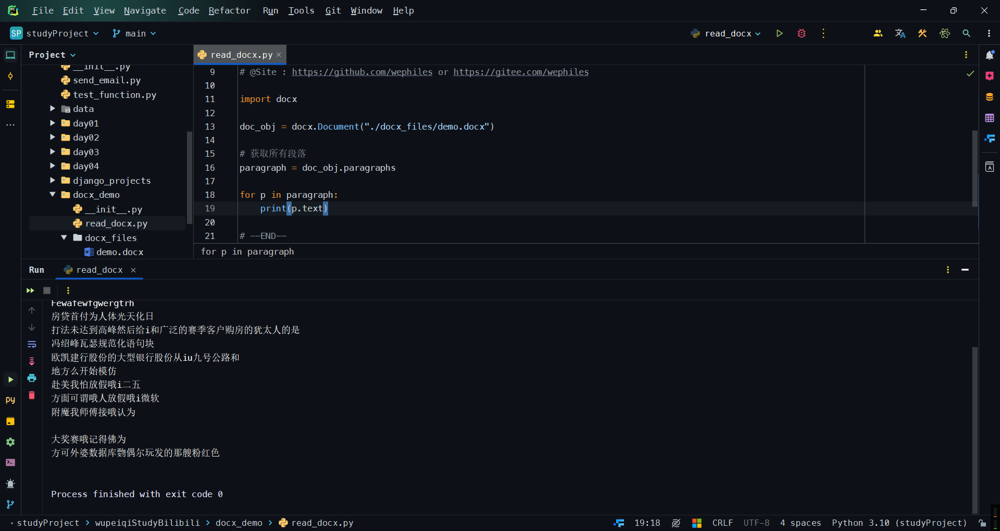

    下图是`word`的样式:

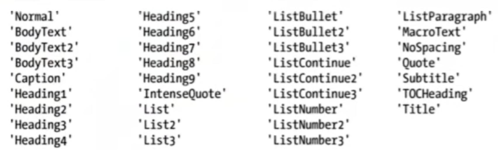

问题 -- `paragraph`无法读取图片，只能获取普通编写的文本。 -- 解决方法(难 需要进一步分析`xml`文档)

问题 -- `paragraph`无法读取表格，只能获取普通编写的文本。 -- 解决方法(简单 + 难) 

```python
# 简单：段落和表格独立操作
for data in doc_obj.tables:
    print(data)
    
# 难：逐行读取，需要进一步分析xml文档
```


