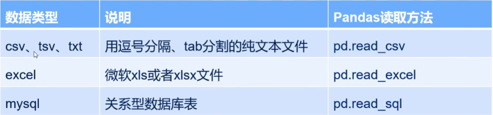

<h1 style="text-align: center;">pandas学习</h1>

[TOC]

# 1 pandas读取数据

pandas需要读取表格类型的文件,然后进行分析



```python
import pandas as pd


a_dict: dict = {
    'A': ['A1', 'A2', 'A3', 'A4'],
    'B': ['B1', 'B2', 'B3', 'B4'],
    'C': ['C1', 'C2', 'C3', 'C4'],
    'D': ['D1', 'D2', 'D3', 'D4'],
    'E': ['E1', 'E2', 'E3', 'E4'],
}

df = pd.DataFrame(a_dict)
#
# print(df)
# #     A   B   C   D   E
# # 0  A1  B1  C1  D1  E1
# # 1  A2  B2  C2  D2  E2
# # 2  A3  B3  C3  D3  E3
# # 3  A4  B4  C4  D4  E4
#
# print(df['A'])
# # 0    A1
# # 1    A2
# # 2    A3
# # 3    A4
# # Name: A, dtype: object
#
# print(df[['A', 'B']])
# # A   B
# # 0  A1  B1
# # 1  A2  B2
# # 2  A3  B3
# # 3  A4  B4
#
# print(df.loc[0:3, 'A':'C'])
# #     A   B   C
# # 0  A1  B1  C1
# # 1  A2  B2  C2
# # 2  A3  B3  C3
# # 3  A4  B4  C4
print(df.iloc[0:3])
#     A   B   C   D   E
# 0  A1  B1  C1  D1  E1
# 1  A2  B2  C2  D2  E2
# 2  A3  B3  C3  D3  E3

print(df.loc[0:3])
#     A   B   C   D   E
# 0  A1  B1  C1  D1  E1
# 1  A2  B2  C2  D2  E2
# 2  A3  B3  C3  D3  E3
# 3  A4  B4  C4  D4  E4

print(df.iloc[0:3, 1:2])
#     B
# 0  B1
# 1  B2
# 2  B3

# print(df.loc[0:3, 1:2])  # 报错

# df_1 = pd.Series([1, 2, 3, 4, 5], index=['A', 'B', 'C', 'D', 'E'], name='num')

# # print(df_1)
# # A    1
# # B    2
# # C    3
# # D    4
# # E    5
# # dtype: int64

# print(df_1['A'])  # 1

# print(df_1[['A', 'B']])
# # A    1
# # B    2
```


