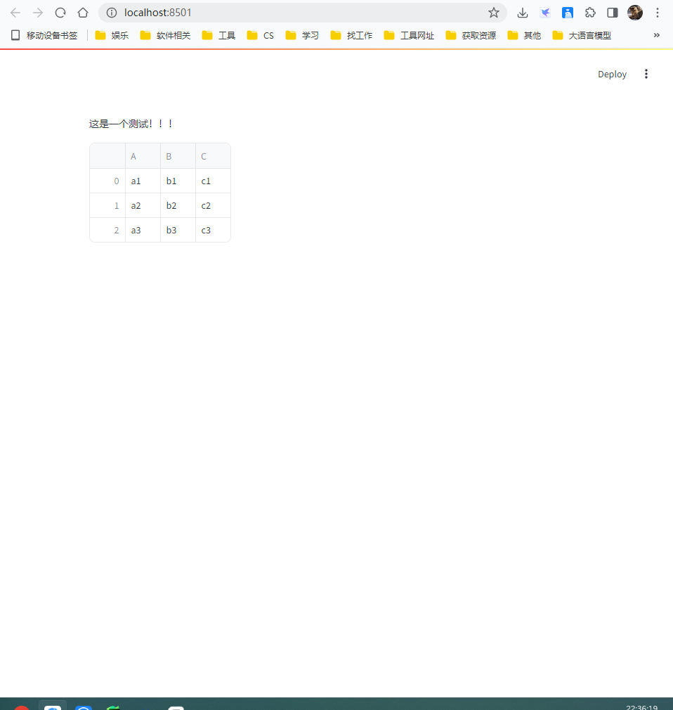

****

```python
import streamlit as st
import pandas as pd

st.text('这是一个测试！！！')

data_dict = {
    'A': ['a1', 'a2', 'a3'],
    'B': ['b1', 'b2', 'b3'],
    'C': ['c1', 'c2', 'c3']
}

df = pd.DataFrame(data_dict)
df
```

展示效果：



****

```python
st.write('This is a test demo.')
st.write(pd.DataFrame(
    {
        'A': ['a1', 'a2', 'a3'],
        'B': ['b1', 'b2', 'b3'],
        'C': ['c1', 'c2', 'c3']
    }
))
```


****

```python
data_dict = {
    'A': ['a1', 'a2', 'a3'],
    'B': ['b1', 'b2', 'b3'],
    'C': ['c1', 'c2', 'c3']
}

df = pd.DataFrame(data_dict)
st.write('用数据创建静态表格')
st.table(df)
```


****

```python
st.text('创建交互式表格')

df = np.random.randn(10, 20)
st.dataframe(df)
```


****

```python
dataframe = pd.DataFrame(
    np.random.randn(10, 20),
    columns=['列%d' % i for i in range(20)]
)

st.dataframe(dataframe.style.highlight_max(axis=0))
```


****

```python
st.text('生成静态表格的方法：st.table()')
dataframe = pd.DataFrame(
    np.random.randn(10, 20),
    columns=['列%d' % i for i in range(20)]
)
st.table(dataframe)
```


```python
st.text('画折线图')

chart_data = pd.DataFrame(
    np.random.randn(20, 3),
    columns=['A', 'B', 'C']
)

st.line_chart(chart_data)
```


****

```python
st.text('绘制地图')

map_data = pd.DataFrame(
    np.random.randn(1000, 2) / [50, 50] + [37.76, -122.4],
    columns=['lat', 'lon']
)
st.map(map_data)
```


****

```python
st.text('小部件')
x = st.slider('x的值')
st.write(x, '的平方是', x * x)
```


****

```python
st.text('指定一个字符串作为小部件的唯一键，小部件也可以通过键来访问。')

st.text_input('你的名字', key='姓名')
# 你可以随时通过一下方式访问这个值
st.session_state.姓名
```


****

```python
st.text('使用复选框显示/隐藏数据')
# 复选框的一个应用场景是在应用中隐藏或显示特定的图表或部分。
# st.checkbox()接受单个参数，即小部件标签。在这个示例中，复选框用于切换条件语句。
if st.checkbox('显示数据框'):
    chart_data = pd.DataFrame(
        np.random.randn(20, 3),
        columns=['a', 'b', 'c']
    )
    chart_data
```


****

```python
# 使用下拉选择框进行选项选择
st.text(
    '使用下拉选择框进行选项选择\n使用st.selectbox从一系列选项中进行选择。你可以直接写出你想要的选项，或者传递一个数组或数据框列。')
df = pd.DataFrame(
    {
        '第一列': [1, 2, 3, 4],
        '第二列': [10, 20, 30, 40]
    }
)
option = st.selectbox(
    '你最喜欢哪个数字？',
    df['第一列'],
    index=0
)
st.text('你选择了: ' + str(option))
```


----

```python
# 布局
st.text('向侧边栏添加一个下拉选择框')
add_select_box = st.sidebar.selectbox(
    '你希望被如何联系？',
    ('手机号码', '微信', '电子邮件')
)
st.text('向侧边栏添加一个滑块')
add_slider = st.sidebar.slider(
    '选择一个数值范围',
    0.0,
    100.0,
    (25.0, 75.0)
)
```


****

```python
left_column, right_column = st.columns(2)
# 你可以像对待 st.sidebar 一样使用一个列：
left_column.button('点我试试')

# 或者更好的是，在一个 "with" 块中调用 Streamlit 函数：
with right_column:
    chosen = st.radio(
        '分院帽',
        ("格兰芬多", "拉文克劳", "赫奇帕奇", "斯莱特林")
    )
    st.write(f'你被分配到了{chosen}学院')
```


****

```python
# 显示进度
st.text('开始一个长时间的计算...')

# 添加一个占位符
latest_iteration = st.empty()
bar = st.progress(0)

for i in range(100):
    # 每次迭代更新进度条
    latest_iteration.text(f'第{i + 1}次更新。')
    bar.progress(i + 1)
    time.sleep(0.2)

st.text('完成计算！')
```


****


