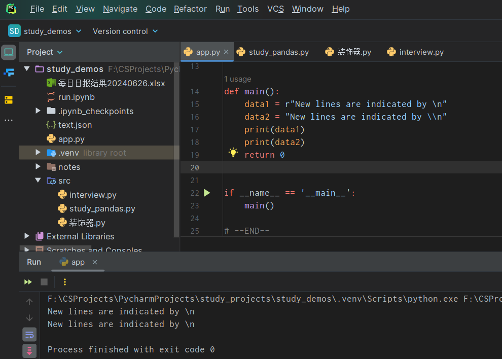
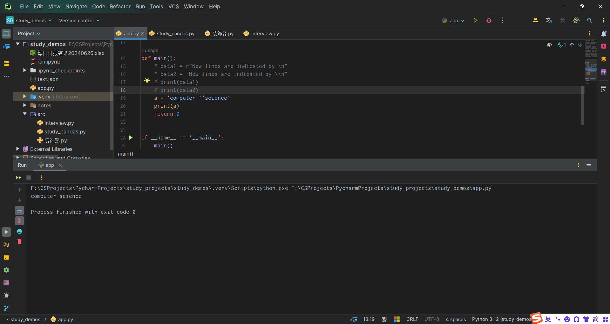
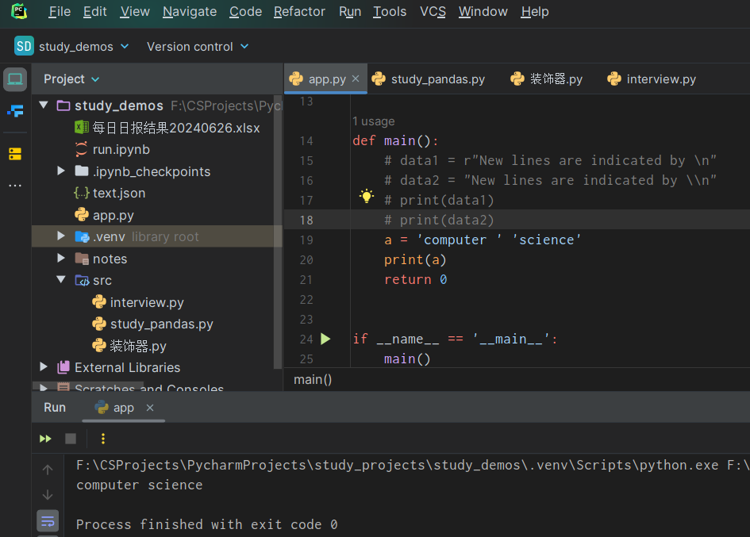
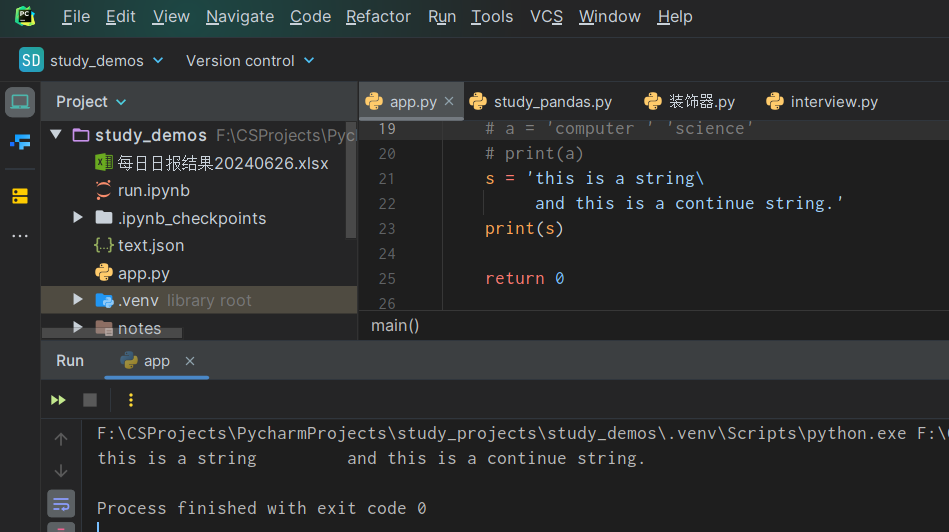
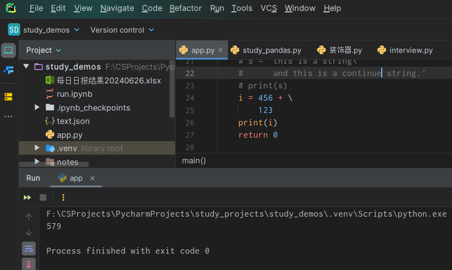
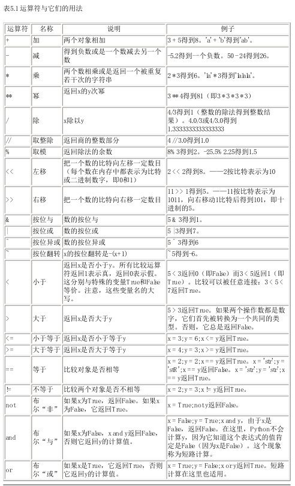
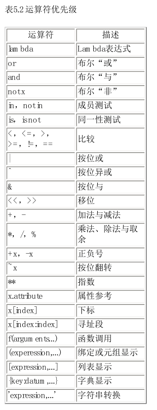

<h1 style="text-align: center;">《Python简明教程》</h1>

# 1. 基本概念

## 1.1 字面意义上的常量

一个字面意义上的常量的例子是如同5、1.23、9.25e-3这样的数，或者如同'This is a string'、"It's a string!"这样的字符串。它们被称作字面意义上的，因为它们具备 字面 的意义——你按照它们的字面意义使用它们的值，数2总是代表它自己，而不会是别的什么东西——它是一个常量，因为不能改变它的值。因此，所有这些都被称为字面意义上的常量。

## 1.2 数

- 整数
- 长整数 -- 大一些的整数
- 浮点数`3.23`、`52.3E-4`
- 复数 `(-5+4j)`、`(2.3-4.6j)`

## 1.3 字符串

- 单引号 '
- 双引号 "
- 三引号 """/'''

- 转义符

  假设你想要在一个字符串中包含一个单引号（`'`），那么你该怎么指示这个字符串？例
  如，这个字符串是`What's your name?`。你肯定不会用`'What's your name?'`来指示它，因为
  `Python`会弄不明白这个字符串从何处开始，何处结束。所以，你需要指明单引号而不是
  字符串的结尾。可以通过 转义符 来完成这个任务。你用\'来指示单引号——注意这个反
  斜杠。现在你可以把字符串表示为`'What\'s your name?'`。
  另一个表示这个特别的字符串的方法是`"What's your name?"`，即用双引号。类似地，要在
  双引号字符串中使用双引号本身的时候，也可以借助于转义符。另外，你可以用转义符
  \`\`来指示反斜杠本身。
  值得注意的一件事是，==**在一个字符串中**==，行末的单独一个反斜杠表示字符串在下一行继
  续，而不是开始一个新的行。例如：

  ```python
  "This is the first sentence.\
  This is the second sentence."
  
  等价于
  
  "This is the first sentence. This is the second sentence."
  ```

- 自然字符串

  如果你想要指示某些不需要如转义符那样的特别处理的字符串，那么你需要指定一个自
  然字符串。自然字符串通过给字符串加上前缀r或R来指定。例如`r"New lines are indicated
  by \n"`。

  

- `Unicode`字符串

  `Unicode`是书写国际文本的标准方法。如果你想要用你的母语如北印度语或阿拉伯语写
  文本，那么你需要有一个支持U nicode的编辑器。类似地，`Python`允许你处理`Unicode`文
  本——你只需要在字符串前加上前缀`u`或`U` 。例如，`u"This is a U nicode string."`。
  记住，在你处理文本文件的时候使用`Unicode`字符串，特别是当你知道这个文件含有用
  非英语的语言写的文本。

- 字符串不可变

- 按字面意义级连字符串

  如果你把两个字符串按字面意义相邻放着，他们会被`Python`自动级连。例如，`'What\'s'
  'your name?'`会被自动转为`"What's your name?"`。

  

  

- 注意：

  一定要用自然字符串处理正则表达式。否则会需要使用很多的反斜杠。例如，后向引用符可以
  写成'\\1'或r'\1'。

## 1.4 变量

仅仅使用字面意义上的常量很快就会引发烦恼——我们需要一种既可以储存信息 又可以对它
们进行操作的方法。这是为什么要引入 变量 。变量就是我们想要的东西——它们的值可以变
化，即你可以使用变量存储任何东西。变量只是你的计算机中存储信息的一部分内存。与字面
意义上的常量不同，你需要一些能够访问这些变量的方法，因此你给变量名字。

### 1.4.1 标识符的命名

变量是标识符的例子。 标识符 是用来标识 某样东西 的名字。在命名标识符的时候，你要遵循
这些规则：
● 标识符的第一个字符必须是字母表中的字母（大写或小写）或者一个下划线（‘ _
’）。
● 标识符名称的其他部分可以由字母（大写或小写）、下划线（‘ _ ’）或数字（0-9）组
成。
● 标识符名称是对大小写敏感的。例如，`myname`和`myName`不是一个标识符。注意前者中
的小写`n`和后者中的大写`N` 。
● 有效 标识符名称的例子有i、`__my_name`、`name_23`和`a1b2_c3`。
● 无效 标识符名称的例子有`2things`、`this is spaced out`和`my-name`。

## 1.4 数据类型

变量可以处理不同类型的值，称为数据类型。基本的类型是数和字符串，我们已经讨论过它们
了。在后面的章节里面，我们会研究怎么用类创造我们自己的类型。

## 1.5 对象

记住，`Python`把在程序中用到的任何东西都称为 对象 。这是从广义上说的。因此我们不会说“某某 东西 ”，我们说“某个 对象 ”。
就每一个东西包括数、字符串甚至函数都是对象这一点来说，`Python`是极其完全地面向对象的。

## 1.6 逻辑行与物理行

物理行是你在编写程序时所 看见 的。逻辑行是Python 看见 的单个语句。`Python`假定每个 物理
行 对应一个 逻辑行 。逻辑行的例子如`print('Hello World')`这样的语句——如果它本身就是一行（就像你在编辑器中看
到的那样），那么它也是一个物理行。默认地，`Python`希望每行都只使用一个语句，这样使得代码更加易读。

然而，我强烈建议你坚持在每个物理行只写一句逻辑行。仅仅当逻辑行太长的时候，在多于一
个物理行写一个逻辑行。这些都是为了尽可能避免使用分号，从而让代码更加易读。事实上，
我 从来没有 在Python程序中使用过或看到过分号。

下面是一个在多个物理行中写一个逻辑行的例子。它被称为明确的行连接。
```s = 'This is a string. \
s = 'This is a string. \
This continues the string.'
print s
它的输出：
This is a string. This continues the string.

```

```python
类似地，
print \
i
与如下写法效果相同：
print i
```

有时候，有一种暗示的假设，可以使你不需要使用反斜杠。这种情况出现在逻辑行中使用了圆
括号、方括号或波形括号的时候。这被称为暗示的行连接。你会在后面介绍如何使用列表的章
节中看到这种用法。





## 1.7 缩进

- 空白在Python中是重要的。

  事实上行首的空白是重要的。它称为缩进。在逻辑行首的空白（空格和制表符）用来决定逻辑行的缩进层次，从而用来决定语句的分组。这意味着同一层次的语句必须有相同的缩进。每一组这样的语句称为一个块。我们将在后面的章节中看到有关块的用处的例子。你需要记住的一样东西是错误的缩进会引发错误。

- 如何缩进
  不要混合使用制表符和空格来缩进，因为这在跨越不同的平台的时候，无法正常工作。我 强烈建议 你在每个缩进层次使用单个制表符或两个或四个空格。选择这三种缩进风格之一。更加重要的是，选择一种风格，然后一贯地使用它，即只 使用这一种风格。

# 2. 运算符与表达式

你编写的大多数语句（逻辑行）都包含表达式。一个简单的表达式例子如2 + 3。一个表达式可
以分解为运算符和操作数。
运算符 的功能是完成某件事，它们由如+这样的符号或者其他特定的关键字表示。运算符需要
数据来进行运算，这样的数据被称为 操作数 。在这个例子中，2和3是操作数。

## 2.1 运算符



## 2.2 运算符优先级

下面这个表给出Python的运算符优先级，从最低的优先级（最松散地结合）到最高的优先级
（最紧密地结合）。这意味着在一个表达式中，`Python`会首先计算表中较下面的运算符，然后
在计算列在表上部的运算符。
下面这张表（与`Python`参考手册中的那个表一模一样）已经顾及了完整的需要。事实上，我建
议你使用圆括号来分组运算符和操作数，以便能够明确地指出运算的先后顺序，使程序尽可能
地易读。例如，`2 + (3 * 4)`显然比`2 + 3 * 4`清晰。与此同时，圆括号也应该正确使用，而不应该
用得过滥（比如`2 + (3 + 4)`）。



在表中列在同一行的运算符具有 相同优先级 。例如，+和-有相同的优先级。

## 2.3 计算顺序

默认地，运算符优先级表决定了哪个运算符在别的运算符之前计算。然而，如果你想要改变它们的计算顺序，你得使用圆括号。例如，你想要在一个表达式中让加法在乘法之前计算，那么你就得写成类似(2 + 3) * 4的样子。

### 2.3.1 结合规律

运算符通常由左向右结合，即具有相同优先级的运算符按照从左向右的顺序计算。例如，2 +
3 + 4被计算成(2 + 3) + 4。一些如赋值运算符那样的运算符是由右向左结合的，即a = b = c被处
理为a = (b = c)。

## 2.4 表达式

# 3. 控制流

## 3.1 `if`语句

## 3.2 `while`语句

## 3.3 `for`循环

## 3.4 `break`语句

break语句是用来 终止 循环语句的，即哪怕循环条件没有称为False或序列还没有被完全递归，
也停止执行循环语句。
一个重要的注释是，如果你从for或w hile循环中 终止 ，任何对应的循环else块将不执行。

## 3.5 `continue`语句

`continue`语句被用来告诉`Python`跳过当前循环块中的剩余语句，然后 继续 进行下一轮循环。


