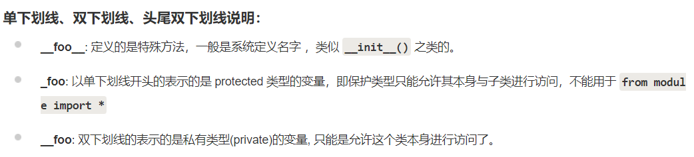
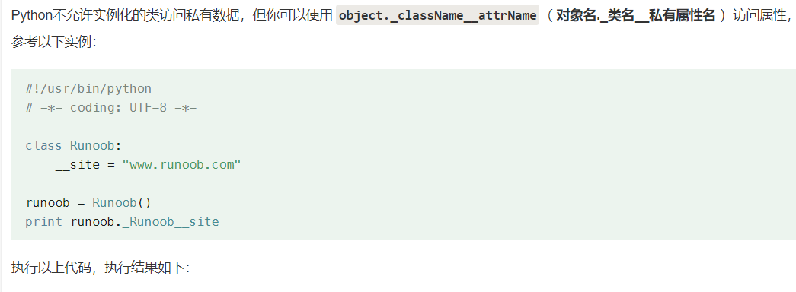

<h1 style="text-align: center;font-size: 40px; font-family: '楷体';">
Python学习过程知识点总结
</h1>
[TOC]


# `pandas`模块

- df.head() 显示前 n 行数据

- df.tail() 显示后 n 行数据

- df.info() 显示数据的信息，包括列名、数据类型、缺失值等

- df.describe() 显示数据的基本统计信息，包括均值、方差、最大值、最小值等；

- df.shape 显示数据的行数和列数

- df\[column_name] 选择指定的列

- df.groupby(column_name) 按照指定列进行分组

- pd.merge(df1, df2, on=column_name) pandas 库中的 merge 函数用于合并两个 DataFrame 对象。它类似于 SQL 中的 JOIN 操作，可以根据一个或多个键将不同的数据集合并在一起。下面是 merge 函数的常用参数及其作用，以及如何使用这个函数的简单说明。:

    ```python
    left: 左侧的 DataFrame 对象。
    right: 右侧的 DataFrame 对象。
    
    how: 合并方式，可以是 'inner', 'outer', 'left', 'right' 中的一个。默认是 'inner'。
        'inner': 内连接，只保留两个 DataFrame 中都有的键。
        'outer': 外连接，保留两个 DataFrame 中的所有键，没有匹配的键将用 NaN 填充。
        'left': 左连接，保留左侧 DataFrame 的所有键，右侧没有匹配的键用 NaN 填充。
        'right': 右连接，保留右侧 DataFrame 的所有键，左侧没有匹配的键用 NaN 填充。
    
    on: 用于合并的列名。如果两个 DataFrame 中有相同的列名，可以直接使用这个参数。如果是多个列名，需要用列表形式传入。
    
    left_on: 左侧 DataFrame 中用于合并的列名。
    right_on: 右侧 DataFrame 中用于合并的列名。
    
    left_index: 如果为 True，则使用左侧 DataFrame 的索引作为合并键。
    right_index: 如果为 True，则使用右侧 DataFrame 的索引作为合并键。
    
    suffixes: 当列名冲突时，为每个 DataFrame 的列添加的后缀。默认是 ('_x', '_y')。
    copy: 如果为 True，则复制数据。默认是 True。
    indicator: 如果为 True，则在合并后的 DataFrame 中添加一个名为 '_merge' 的列，表示每行数据的来源。
    validate: 指定连接类型，如 'one_to_one', 'one_to_many', 'many_to_one', 'many_to_many'。默认是 None。
    ```

- df.describe() 计算基本统计信息，如均值、标准差、最小值、最大值等。

- df.mean() 计算每列的平均值。

- df.median() 计算每列的中位数。

- df.mode() 计算每列的众数。

- df.count() 计算每列非缺失值的数量。

- df.rename():在pandas中，rename()函数用于重命名DataFrame的列名或者索引。以下是一些常见的使用方式.在以下的例子中，inplace=True表示直接在原DataFrame上进行修改。如果你不希望修改原DataFrame，可以省略这个参数，rename()函数会返回一个新的DataFrame。

    - 参数：

        ```python
        mapper：字典或函数。这是一个可选参数，用于指定从旧标签到新标签的映射。如果是字典，可以为index或columns参数提供映射。如果是函数，那么它将应用于所有标签。  
        index：字典或函数。这是一个可选参数，用于指定从旧索引到新索引的映射。如果是字典，键是旧的索引，值是新的索引。如果是函数，那么它将应用于所有索引。  
        columns：字典或函数。这是一个可选参数，用于指定从旧列名到新列名的映射。如果是字典，键是旧的列名，值是新的列名。如果是函数，那么它将应用于所有列名。  
        axis：{0 或 'index', 1 或 'columns'}，默认为0。这是一个可选参数，用于指定要重命名的轴。如果axis=0或'index'，则重命名索引；如果axis=1或'columns'，则重命名列名。  
        copy：布尔值， 默认为True。这是一个可选参数，如果为True，那么即使新的索引与旧的索引相同，也会复制底层数据。如果为False，新的索引与旧的索引相同，底层数据不会被复制。  
        inplace：布尔值，默认为False。这是一个可选参数，如果为True，那么直接在原DataFrame上进行修改。如果为False，rename()函数会返回一个新的DataFrame，原DataFrame不会被修改。  
        level：int或level name，默认为None。这是一个可选参数，用于多级索引的情况，指定要重命名的级别。如果为None，则默认重命名所有级别。  
        errors：{'ignore', 'raise'}，默认为'raise'。这是一个可选参数，如果为'ignore'，则忽略无法重命名的错误；如果为'raise'，则如果存在无法重命名的错误，会引发错误
        ```

        ```python
        # 重命名列名：你可以通过传递一个字典到columns参数来重命名列名。字典的键是旧的列名，值是新的列名
        import pandas as pd
        
        # 创建一个DataFrame
        df = pd.DataFrame({
           'A': [1, 2, 3],
           'B': [4, 5, 6]
        })
        ```

        ```python
        # 重命名列名
        df.rename(columns={'A': 'a', 'B': 'b'}, inplace=True)
        
        ===============================================================================
        
        # 重命名索引：你可以通过传递一个字典到index参数来重命名索引。字典的键是旧的索引，值是新的索引
        import pandas as pd
        
        # 创建一个DataFrame
        df = pd.DataFrame({
           'A': [1, 2, 3],
           'B': [4, 5, 6]
        }, index=['x', 'y', 'z'])
        
        # 重命名索引
        df.rename(index={'x': 'X', 'y': 'Y', 'z': 'Z'}, inplace=True)
        ```

        ```python
        # 使用函数重命名：你也可以传递一个函数到columns或index参数，这个函数会被应用到每个列名或索引上。
        import pandas as pd
        
        # 创建一个DataFrame
        df = pd.DataFrame({
           'A': [1, 2, 3],
           'B': [4, 5, 6]
        })
        
        # 使用函数重命名列名
        df.rename(columns=str.lower, inplace=True)
        ```

# `pickle`模块

- - pickle库是Python中用于序列化和反序列化Python对象结构的模块。"序列化"指的是将Python对象转换为字节流，以便可以将其存储到磁盘上或通过网络传输到远程位置。"反序列化"则是将这些字节流转换回原始Python对象。  这个库对于数据持久化和跨程序共享对象非常有用。例如，你可以使用pickle库将机器学习模型训练后的状态保存下来，然后在另一个程序中加载这个状态，以便进行预测。
    - pickle.dump(data, file_object)  使用pickle库将数据对象序列化为字节流
    - pickle.load(file_object)  使用pickle库将字节流反序列化为数据对象

# `heapq`模块

`Python `的 `heapq` 是一个堆队列算法的实现，它提供了一些用于创建和操作堆的函数。堆是一种特殊的树状数据结构，其中每个父节点的值都小于或等于其子节点的值。在 `Python `中，`heapq` 模块通常用于实现优先队列。

以下是 `heapq` 模块的一些主要功能：

1. **`heapify()`**: 将一个列表转换为堆。它将任意列表转换为一个堆，使列表满足堆的性质。
2. **`heappush()`**: 添加一个元素到堆中。它将一个元素添加到堆的末尾，然后重新调整以维持堆的性质。
3. **`heappop()`**: 移除并返回堆中的最小元素。它从堆中移除并返回最小的元素，同时重新调整以维持堆的性质。
4. **`heappushpop()`**: 将一个元素添加到堆中并返回堆中当前的最小元素。如果添加的元素比当前的最小元素还小，则返回添加的元素。
5. **`heapreplace()`**: 将一个元素添加到堆中，并返回堆中移除的最小元素。这可以看作是 `heappop()` 后立即 `heappush()` 的操作。
6. **`merge()`**: 合并两个堆。它将两个已排序的输入列表合并为一个排序后的输出列表。
7. **`nlargest()`**: 从序列中找到最大的 `n` 个元素。它返回序列中最大的 `n` 个元素，以升序排列。
8. **`nsmallest()`**: 从序列中找到最小的 `n` 个元素。它返回序列中最小的 `n` 个元素，以升序排列。
9. **`len()`**: 返回堆中元素的数量。

这些功能使得 `heapq` 模块非常适合用于需要优先级队列的场景，如任务调度、事件驱动模拟等。由于堆的效率很高，`heapq` 操作通常具有对数时间复杂度，这使得它在处理大量数据时非常有效。

下面是一个简单的示例，展示如何使用 `heapq` 创建一个堆并进行操作：

```
import heapq

# 创建一个空堆
heap = []

# 添加元素到堆中
heapq.heappush(heap, 1)
heapq.heappush(heap, 5)
heapq.heappush(heap, 2)

# 移除并返回堆中的最小元素
print(heapq.heappop(heap))  # 输出 1

# 替换堆中的最小元素
print(heapq.heapreplace(heap, 3))  # 输出 2，并且将 3 添加到堆中

# 打印堆中的所有元素
print(heap)  # 输出 [3, 5]
```

这个示例展示了如何使用 `heapq` 模块的基本功能来创建一个堆，添加元素，移除最小元素，以及替换堆中的最小元素。

在Python中，`heapq`是一个提供堆队列算法实现的库。堆是一种特殊的树状数据结构，其中父节点的键值总是大于或等于其子节点的键值。这种性质使得堆可以用于实现优先队列，其中元素根据其键值进行排序。

`heapq`模块提供了一些函数来操作堆，包括：

1. `heapify(iterable)`: 将任何可迭代对象转换成堆。`iterable`中的元素将被重新排列，以形成一个堆。
2. `heappush(heap, item)`: 将一个新元素添加到堆中。
3. `heappop(heap)`: 移除并返回堆中的最小元素。
4. `heapreplace(heap, item)`: 移除并返回堆中的最小元素，然后添加新元素。
5. `heappushpop(heap, item)`: 如果新元素的键值小于堆中的最小元素，那么移除并返回堆中的最小元素，并添加新元素；否则，只添加新元素。
6. `heapsort(iterable)`: 对可迭代对象中的元素进行排序。
7. `merge(*iterables)`: 合并多个已排序的输入并产生一个迭代器，该迭代器生成的元素是所有输入中的最小元素。
8. `nlargest(n, iterable[, key])`: 返回数据集合中最大的n个元素。
9. `nsmallest(n, iterable[, key])`: 返回数据集合中最小的n个元素。

`heapq`模块的这些功能使得它非常适合用于那些需要根据优先级进行排序和检索的场景，例如任务调度、事件驱动模拟等。

下面是一个使用`heapq`模块实现最小堆的例子：

```
import heapq

# 创建一个空堆
h = []

# 添加一些元素
heapq.heappush(h, 1)
heapq.heappush(h, 3)
heapq.heappush(h, 5)

# 弹出并返回最小元素
print(heapq.heappop(h))  # 输出 1

# 再次弹出并返回最小元素
print(heapq.heappop(h))  # 输出 3
```

在这个例子中，`heapq.heappush`用于将元素添加到堆中，而`heapq.heappop`用于移除并返回堆中的最小元素。

# `queue`模块

Python 的 `queue` 模块提供了多种类型的队列实现，包括先进先出（FIFO）队列、LIFO（后进先出）队列，以及支持任务优先级的队列。以下是 `queue` 模块中一些常用类的简要介绍：

1. **`Queue`**: 标准的队列实现，使用FIFO原则，即先添加到队列中的元素将先被移除。
2. **`LifoQueue`**: 后进先出队列，类似于栈，使用LIFO原则。
3. **`PriorityQueue`**: 支持优先级的队列，元素会根据优先级被排序，优先级最高的元素最先被移除。
4. **`deque`**: 双端队列，允许在两端快速地添加（append）和移除（pop）元素。

使用 `queue` 模块的一个基本示例如下：

```
from queue import Queue

# 创建一个FIFO队列
q = Queue()

# 添加元素到队列
q.put('a')
q.put('b')
q.put('c')

# 从队列中移除并返回一个元素
first_item = q.get()

print(first_item)  # 输出: 'a'
```

为了使用 `queue` 模块，你需要先导入它。然后，你可以创建队列对象，并使用 `put()` 方法添加元素，使用 `get()` 方法移除并返回队列前端的元素。

如果你需要使用其他类型的队列，比如 `LifoQueue` 或 `PriorityQueue`，你只需创建相应类型的实例，并使用类似的 `put()` 和 `get()` 方法。

请注意，`queue` 模块的 `get` 方法会阻塞调用线程，直到队列中至少有一个元素，除非你指定了 `timeout` 参数。此外，`put` 方法也会阻塞，直到队列中有空间可以存放新元素，除非你指定了 `timeout` 参数。

# `sorted()` 

Python中的`sorted`函数用于对序列进行排序，并返回一个新的排序列表。`sorted`函数可以用于列表、元组以及任何可迭代对象。

### 基本用法

最基本的用法非常简单，只需将一个可迭代对象传递给`sorted`函数即可。

python

复制

```
my_list = [3, 1, 4, 1, 5, 9, 2, 6, 5]
sorted_list = sorted(my_list)
print(sorted_list)  # 输出：[1, 1, 2, 3, 4, 5, 5, 6, 9]
```

### 关键字参数

`sorted`函数接受两个关键字参数：

1. `key`: 用于指定一个函数，此函数将在每个元素比较前被调用。此函数将返回一个用于排序的值。
2. `reverse`: 设为`True`时，列表将被倒序排列。

#### 使用`key`参数

python

复制

```
# 使用key参数进行忽略大小写的排序
my_list = ['banana', 'Apple', 'cherry', 'Date']
sorted_list = sorted(my_list, key=str.lower)
print(sorted_list)  # 输出：['Apple', 'banana', 'cherry', 'Date']
```

#### 使用`reverse`参数

python

复制

```
# 使用reverse参数进行降序排序
my_list = [3, 1, 4, 1, 5, 9, 2, 6, 5]
sorted_list = sorted(my_list, reverse=True)
print(sorted_list)  # 输出：[9, 6, 5, 5, 4, 3, 2, 1, 1]
```

### 排序复杂对象

`sorted`函数也可以用于排序复杂对象，比如字典列表。

```
# 根据字典中的键值对列表进行排序
my_list = [{'name': 'John', 'age': 35}, {'name': 'Doe', 'age': 25}, {'name': 'Jane', 'age': 40}]
sorted_list = sorted(my_list, key=lambda x: x['age'])
print(sorted_list)  
# 输出：[{'name': 'Doe', 'age': 25}, {'name': 'John', 'age': 35}, {'name': 'Jane', 'age': 40}]
```

### 使用`reverse`和`key`参数

你可以同时使用`reverse`和`key`参数。

```
# 同时使用key和reverse参数
my_list = [{'name': 'John', 'age': 35}, {'name': 'Doe', 'age': 25}, {'name': 'Jane', 'age': 40}]
sorted_list = sorted(my_list, key=lambda x: x['age'], reverse=True)
print(sorted_list)  
# 输出：[{'name': 'Jane', 'age': 40}, {'name': 'John', 'age': 35}, {'name': 'Doe', 'age': 25}]
```

这样，你就可以根据不同的需求，使用`sorted`函数进行灵活的排序。

`sorted`函数使用`key`参数来指定一个函数，这个函数会在排序前对每个元素进行转换。排序时，`sorted`函数会使用转换后的值而不是原始元素进行比较。这种方式允许我们自定义排序逻辑，使得`sorted`函数能够适用于各种不同类型的数据和排序需求。

### `key`参数的处理过程

当`sorted`函数对可迭代对象进行排序时，它会按照以下步骤处理`key`参数：

1. 对可迭代对象中的每个元素，调用`key`函数。
2. 使用`key`函数返回的值作为排序的依据。
3. 根据这些值对元素进行排序。
4. 返回排序后的列表。

### 编写用于`sorted`的排序函数

编写用于`sorted`的排序函数通常很简单。这个函数应该接受一个元素作为参数，并返回一个用于排序的值。下面是一些例子：

#### 对字符串长度进行排序

python

复制

```
# 对字符串列表按照长度排序
my_list = ['banana', 'apple', 'cherry']
sorted_list = sorted(my_list, key=len)
print(sorted_list)  # 输出：['apple', 'banana', 'cherry']
```

#### 对复杂数据结构进行排序

```
# 对字典列表按照多个键进行排序
my_list = [{'name': 'John', 'age': 35}, {'name': 'Doe', 'age': 25}, {'name': 'Jane', 'age': 40}]
# 先按年龄排序，年龄相同则按名字排序
sorted_list = sorted(my_list, key=lambda x: (x['age'], x['name']))
print(sorted_list)
# 输出：[{'name': 'Doe', 'age': 25}, {'name': 'John', 'age': 35}, {'name': 'Jane', 'age': 40}]
```

#### 使用自定义类进行排序

```
# 定义一个类，并编写一个用于排序的key函数
class Student:
    def __init__(self, name, age, grade):
        self.name = name
        self.age = age
        self.grade = grade

    def __repr__(self):
        return f'{self.name}, {self.age}, {self.grade}'

# 创建学生列表
students = [Student('John', 20, 90), Student('Jane', 22, 85), Student('Doe', 20, 95)]

# 按照年龄排序
sorted_students_age = sorted(students, key=lambda student: student.age)
print(sorted_students_age)

# 按照成绩排序
sorted_students_grade = sorted(students, key=lambda student: student.grade)
print(sorted_students_grade)
```

在上面的例子中，我们定义了一个`Student`类，并为它编写了一个`__repr__`方法以便于打印。然后我们创建了学生列表，并使用`sorted`函数按照年龄和成绩对学生进行排序。

总结来说，编写用于`sorted`的排序函数就是定义一个能够提取排序依据的函数，然后将这个函数作为`key`参数传递给`sorted`函数。这样，`sorted`函数就能够根据我们提供的逻辑对数据进行排序。

# `inf`

在Python的math库中，`inf`表示无穷大。具体来说，`math.inf`表示一个大于所有可表示浮点数的值。当你需要表示一个理论上无限大的值时，可以使用`math.inf`。

例如，在数学中，当你想要表示一个函数的极限为无穷大时，或者在编程中，当你需要初始化一个变量，以便之后进行比较操作，并且这个变量应该表示一个无穷大的值时，`math.inf`就非常有用。

`math.inf`也有一些相关的属性和用法，比如：

- `math.isinf(x)`：如果x是`math.inf`或`-math.inf`，则返回`True`。
- `-math.inf`：表示负无穷大。
- `math.inf`与任何非零浮点数相乘或相除都会得到`math.inf`或`-math.inf`。
- `math.inf`与`math.inf`相除会得到`nan`（not a number，即非数）。

这里有一些简单的使用示例：

```
import math

# 判断一个数是否为无穷大
print(math.isinf(math.inf))  # 输出: True

# 无穷大与有限数值的比较
print(1e308 < math.inf)  # 输出: True

# 负无穷大
print(-math.inf < 0)  # 输出: True

# 无穷大与无穷大相加
print(math.inf + math.inf)  # 输出: inf

# 无穷大与无穷大相乘
print(math.inf * math.inf)  # 输出: inf

# 无穷大除以无穷大
print(math.inf / math.inf)  # 输出: nan
```

在实际编程中，使用`math.inf`可以帮助简化代码，并且可以更好地处理边界条件。

# sys.maxsize

在Python中，`sys.maxsize` 是 `sys` 模块中的一个属性，它表示Python解释器所能支持的列表、集合、字典等数据结构所能容纳的最大元素数量。更准确地说，`sys.maxsize` 表示的是Python解释器所能支持的最大整数值，这个值依赖于平台和Python解释器的位数。

在32位系统中，`sys.maxsize` 通常被设置为 `2^31 - 1`，即 `2147483647`。在64位系统中，`sys.maxsize` 通常被设置为 `2^63 - 1`，即 `9223372036854775807`。

这个值经常被用于确定数据结构的容量限制，或者在需要根据系统最大值来设置算法某些参数时使用。例如，在实现排序算法或者进行大文件处理时，可能会根据 `sys.maxsize` 来决定是否需要采用特殊的处理方式来避免整数溢出的问题。

使用 `sys.maxsize` 的一个例子如下：

```
import sys

# 打印sys.maxsize的值
print(sys.maxsize)

# 根据sys.maxsize来确定一个合适的数组大小
array_size = min(sys.maxsize, 10000)  # 选取sys.maxsize和10000中较小的一个
```

在实际编程中，应该根据实际情况和需求来合理使用 `sys.maxsize`。

# 堆(heapq)

堆能够实现优先队列的原因是因为堆具有以下特性：

1. 堆是一个完全二叉树，通常是通过数组实现的。在堆中，父节点的值要么始终小于（最小堆），要么始终大于（最大堆）其子节点的值。
2. 在堆中，插入和删除的时间复杂度较低，插入的复杂度为 O(log n)，删除的复杂度也为 O(log n)，n 为堆中元素的个数。

这些特性使得堆非常适合实现优先队列。在优先队列中，元素被分配了一个优先级，并且当访问队列时，具有最高（或最低）优先级的元素首先被访问。

在Python中，可以使用 `heapq` 模块来实现堆，从而实现优先队列。这个模块提供了一些堆操作的函数，包括将元素推入堆（`heappush`）、从堆中弹出最小的元素（`heappop`）等。

以下是 `heapq` 模块的一些基本操作：

1. 创建一个空堆

```python
heap = []
```

1. 将元素推入堆

```python
import heapq
heapq.heappush(heap, 3)
heapq.heappush(heap, 1)
heapq.heappush(heap, 2)
# 现在 heap 的顺序是 [1, 3, 2]
```

1. 从堆中弹出最小的元素

```python
print(heapq.heappop(heap))  # 输出 1
# 现在 heap 的顺序是 [2, 3]
```

通过这种方式，堆实现了一个优先队列，可以方便地实现按优先级访问元素，使得具有最高（或最低）优先级的元素能够被优先访问。

在 Python 中，如果入堆的元素是多个元素组成的元组、列表或字典，出堆的顺序将按照以下规则进行比较：

1. 对于元组：Python 会按照元组中的元素从第一个开始进行依次比较，直到找到不相等的元素为止。例如，对于元组 (a, b, c)，Python 会首先比较 a，如果 a 相等，则比较 b，以此类推。
2. 对于字典：字典类型本身是不可比较的，因此无法直接将它们用于堆的比较。
3. 列表：和元组的判断方式是一样的。

因此，如果入堆的元素是多个元素组成的元组，则出堆的顺序将按照元组中的元素从左到右依次比较。

以下是一个使用元组入堆并出堆的示例：

```python
import heapq

heap = []
heapq.heappush(heap, (3, 'apple'))
heapq.heappush(heap, (1, 'banana'))
heapq.heappush(heap, (2, 'orange'))

while heap:
    print(heapq.heappop(heap))
```

运行上述代码会输出：

```
(1, 'banana')
(2, 'orange')
(3, 'apple')
```

在这个示例中，我们入堆的元素是元组，每个元组包含两个部分：一个数字和一个字符串。出堆的顺序是按照元组中的第一个元素（数字）进行比较的。

# `itemgetter` 

`itemgetter` 函数是 Python 标准库 `operator` 模块中的一个函数，它用于从列表的元素中提取指定的子项，并返回一个函数，这个函数可以接受一个序列（如列表或元组）作为输入，并返回指定的子项。这个功能通常用于排序操作，尤其是当你需要根据列表中的特定元素进行排序时。

`itemgetter` 可以接受一个或多个整数作为参数，这些整数代表了你想要提取的元素的索引位置。例如，如果你有一个包含元组的列表，你可以使用 `itemgetter` 来根据元组中的某个特定元素进行排序。

这里有一个使用 `itemgetter` 进行排序的例子：

```
复制from operator import itemgetter

# 假设我们有一个包含元组的列表，每个元组代表一个人的名字和年龄
people = [
    ('Alice', 30),
    ('Bob', 25),
    ('Charlie', 35),
    ('David', 28)
]

# 使用 itemgetter 根据年龄排序
sorted_people = sorted(people, key=itemgetter(1))

print(sorted_people)  # 输出: [('Bob', 25), ('Alice', 30), ('David', 28), ('Charlie', 35)]
```

在这个例子中，`itemgetter(1)` 创建了一个函数，这个函数接受一个元组并返回元组的第二个元素（索引为 1 的元素，即年龄）。然后，`sorted` 函数使用这个函数作为排序的关键字，从而根据每个人的年龄对列表进行排序。

`itemgetter` 也可以接受多个索引，用于更复杂的排序需求，例如根据多个字段进行排序。这种情况下，`itemgetter` 会返回一个元组，其中包含所有指定的子项。


- 当然，让我们更详细地探讨 `itemgetter` 函数的用法和它在排序中的应用。

  `itemgetter` 函数是 `operator` 模块中的一个实用工具，它允许你通过指定索引来创建一个获取元素的函数。这个函数可以用于 `sorted` 函数的 `key` 参数，以便根据列表中元素的特定子项进行排序。这在处理复杂数据结构，如包含多个字段的记录或对象时特别有用。

  **基本用法**

  `itemgetter` 可以接收一个或多个整数参数，这些参数指定了要从序列中提取的元素的索引。例如：

  ```
  from operator import itemgetter
  
  # 创建一个根据索引1（第二个元素）获取元素的函数
  get_second_item = itemgetter(1)
  
  # 使用这个函数获取列表中每个元组的第二个元素
  result = [get_second_item(item) for item in [('a', 1), ('b', 2), ('c', 3)]]
  print(result)  # 输出: [1, 2, 3]
  ```

  **排序**

  在排序中，`itemgetter` 通常用于指定排序的依据。例如，如果你有一个包含多个字段的列表，你可能想要根据某个特定字段进行排序。这时，你可以使用 `itemgetter` 来实现这一点。

  ```
  from operator import itemgetter
  
  # 假设我们有一个包含姓名和年龄的列表
  people = [
      ('Alice', 30),
      ('Bob', 25),
      ('Charlie', 35),
      ('David', 28)
  ]
  
  # 使用 itemgetter 根据年龄（索引1）进行降序排序
  sorted_people = sorted(people, key=itemgetter(1), reverse=True)
  
  print(sorted_people)  # 输出: [('Charlie', 35), ('Alice', 30), ('David', 28), ('Bob', 25)]
  ```

  在这个例子中，`itemgetter(1)` 创建了一个函数，这个函数接受一个元组并返回元组的第二个元素（年龄）。然后，`sorted` 函数使用这个函数作为排序的关键字，并通过设置 `reverse=True` 来实现降序排序。

  **多字段排序**

  `itemgetter` 还可以接受多个索引，允许你根据多个字段进行排序。这在数据库查询或处理多维数据时非常有用。例如，你可能想要先按年龄升序排序，然后在年龄相同的情况下按姓名降序排序。

  ```
  from operator import itemgetter
  
  # 使用 itemgetter 根据年龄升序排序，年龄相同的情况下按姓名降序排序
  sorted_people = sorted(people, key=itemgetter(1, 0), reverse=[False, True])
  
  print(sorted_people)  # 输出: [('Bob', 25), ('Alice', 30), ('David', 28), ('Charlie', 35)]
  ```

  在这个例子中，`itemgetter(1, 0)` 创建了一个函数，它首先根据年龄（索引1）排序，然后根据姓名（索引0）排序。`reverse` 参数是一个列表，它为每个字段指定了排序的方向。在这个例子中，年龄的排序方向是升序（`False`），而姓名的排序方向是降序（`True`）。

  `itemgetter` 是一个非常灵活的工具，它可以帮助你在处理列表和元组时进行复杂的排序操作。通过合理使用 `itemgetter`，你可以轻松地根据一个或多个字段对数据进行排序。

# `map()`

`Python`的`map()`函数是一个非常有用的工具，它可以对可迭代对象中的每个元素应用一个指定的函数，然后返回一个迭代器，其中包含了所有元素经过函数处理后的结果。 -- 参考 https://blog.csdn.net/wuShiJingZuo/article/details/135620145


    - 基本语法：
        ```python
        map(function, iterable, ...)
        ```
    
    - 在使用map()函数时，有一些注意事项需要牢记：
    
        - map()函数返回的是一个迭代器，如果需要立即获取结果，需要将其转换为列表或其他数据结构。
        - 传递给map()的函数可以是自定义函数，也可以是内置函数或匿名函数（lambda表达式）。
        - 如果传递给map()的可迭代对象的长度不一致，map()将在最短的可迭代对象耗尽后停止迭代。
        - 在Python 3中，map()函数的返回值已经不再是列表，而是迭代器。如果需要列表，必须显式地将其转换为列表。

# fstring format

如果我们要表示一个很大的数：
```python
n: int = 100000000
```

但是像上面这样写出来，貌似很难一下子看出来有多少个0，于是，我们可以这么写：
```python
n: int = 1_000_000_000
print(n)
```
当我们执行上面的语句后，输出结果为：


我们也可以用科学计数法写，只不过要注意，这时候这个数是浮点数。
```python
n: float = 1e9
print(n)
```


## 使用fdtring表示整数

```python
n: int = 1_000_000_000
print(f'{n:_}')
print(f'{n:,}')
```
上述代码运行结果为：


遗憾的是，只支持`_`和`,`两种连接符。

## 使用fstring表示字符串

```python
var: str = 'var'
print(f'{var:>20}')  # 向右对齐 整个打印长度为20（包含打印出的字符）
print(f'{var:<20}')  # 向左对齐 整个打印长度为20（包含打印出的字符）
```


此外，你也可以让字符串居中：
```python
var: str = 'var'
print(f'{var:^20}')  # 居中 整个打印长度为20（包含打印出的字符）
```


如果你觉得对于居左和居右看的不清楚，可以这样做，以清楚地看到效果：
```python
var: str = 'var'
print(f'{var:>20}:')  # 向右对齐 整个打印长度为20（包含打印出的字符）
print(f'{var:<20}:')  # 向左对齐 整个打印长度为20（包含打印出的字符）
```


当然，如果你需要在空白位置补充一些字符，你可以像下面这样：
```python
var: str = 'var'
print(f'{var:_>20}:')
print(f'{var:#<20}:')
print(f'{var:|^20}:')
```
效果如下：


## 使用fstring表示datetime

```python
from datetime import datetime
now: datetime = datetime.now()
print(now)
```


我们可以使用fstring这样做：
```python
from datetime import datetime
now: datetime = datetime.now()
print(f'{now:%d-%m-%y}')
```


我们也可以将时分秒加进去
```python
from datetime import datetime
now: datetime = datetime.now()
print(f'{now:%d-%m-%y (%H:%M:%S)}')
```


我们也可以使用`%c`获取本地日期
```python
print(f'{now:%c}')
```


此外还能展示`AM`还是`PM`
```python
print(f'{now:%I%p}')
```


## 使用fstring表示小数

```python
n: float = 1234.5678
print(n)
```
输出：


```python
n: float = 1234.5678
print(f'{n:.2f}')  # 格式化为小数点后两位/四舍五入到小数点后两位
```


```python
n: float = 1234.5678
print(f'{n:.0f}')  # 格式化为小数点后两位/四舍五入到小数点后两位
```


```python
n: float = 1234.5678
print(f'{n:,.3f}')  # 格式化为小数点后两位/四舍五入到小数点后两位
```


```python
a: int = 5
b: int = 10

my_var: str = 'Bob says hi'
print(f'a + b = {a + b}')
print(f'{a + b = }')
```


```python
a: int = 5
b: int = 10

my_var: str = 'Bob says hi'
print(f'a + b = {a + b}')
print(f'{a + b = }')
print(f'{float(a) = }')
print(f'{my_var = }')
```


# Python语法糖

## 1 交换两个变量的值

```python
a = 1
b = 2
a, b = b, a
```
## 2 判断变量范围
```python
if 90 <= a <= 100:
	...
```
## 3 快速构造字符串
```python
print('-' * 60)
```
## 4 列表拼接
```python
a = [1, 2, 3, 4]
b = [4, 5, 6, 7]
a + b
```

## 5 列表切片

```python
a = [1, 2, 3, 4, 5, 6, 7, 8, 9]
a[3:-2]  # [4, 5, 6, 7]
a[:3]  # [1, 2, 3]
a[-3:]  # [7, 8, 9]
```

## 6 打包与解包

```python
a = (1, 2, 3)
x, y, z = a
```

```python
x = 1
y = 2
z = 3
b = (x, y, z)
```

## 7 `with`语句

```python
with open('', 'r') as fp:
	fp.read()
```

## 8 列表推导式/解析式 -- 也适用于元组和字典

```python
a = [1, 2, 3, 4]
b = [e + 233 for e in a]
```
# `typing`

## 概述

在Python中，类型提示（Type Hints）是用来增强代码可读性和可维护性的重要工具。以下是一些常用的类型提示：

1. 基本类型
    - int: 整数类型
    - float: 浮点数类型
    - str: 字符串类型
    - bool: 布尔类型
    - None: 表示空值
2. 容器类型
    - List[Type]: 列表，例如 `List[int]` 表示一个整数列表
    - Tuple[type, ...]: 元组，例如 `Tuple[int, str]` 表示一个包含一个整数和一个字符串的元组
    - Dict[key_type, value_type]: 字典，例如 `Dict[str, int]` 表示一个键为字符串、值为整数的字典
    - Set[type]: 集合，例如 `Set[int]` 表示一个整数集合
    - Optional[type]: 可选类型，例如 `Optional[str]` 表示一个可以是字符串或 `None` 的类型 --常用于函数参数可能为 `None` 的情况
    - `Sequence[T]`: 序列，可以是任何提供序列功能的类型，如`list`、`tuple`等
    - `Iterable[T]`: 可迭代对象，可以是任何提供迭代功能的类型
    - `Mapping[K, V]`: 映射，如`dict`
    - `Callable[[Arg1Type, Arg2Type, ...], ReturnType]`: 表示可调用的对象，如函数，可以指定参数类型和返回类型
3. 自定义类型
    - class: 类类型，例如 `User` 表示一个 `User` 类的实例
    - Callable[[arg_types], return_type]: 可调用对象，例如 `Callable[[int, str], bool]` 表示一个接受一个整数和一个字符串并返回布尔值的函数
4. 联合类型
    - Union[type1, type2, ...]: 联合类型，例如 `Union[int, str]` 表示一个可以是整数或字符串的类型
5. 泛型类型
    - TypeVar: 类型变量，用于定义泛型类型，例如 `T = TypeVar('T')`
    - Generic[T]: 泛型类，例如 `class MyClass(Generic[T]):`
6. 其他类型
    - Any: 任意类型
    - Literal[value]: 字面量类型，例如 `Literal[42]` 表示值为42的类型
    - Final: 表示常量，例如 `Final[int]` 表示一个不可变的整数

> [!Important]
>
> 这些类型提示可以帮助你在编写代码时明确变量和函数的类型，从而提高代码的可读性和可维护性。使用类型提示还可以在开发过程中通过工具（如 `mypy`）进行静态类型检查，提前发现潜在的类型错误。

## 使用

在Python中使用类型提示非常简单，你只需要在变量、函数参数和函数返回值后面加上类型注解即可。以下是一些具体的使用示例：

### 基本类型提示

```
age: int = 25
height: float = 5.9
name: str = "Alice"
is_student: bool = True
```

### 容器类型提示

```
from typing import List, Tuple, Dict, Set, Optional

numbers: List[int] = [1, 2, 3, 4, 5]
person: Tuple[str, int] = ("Alice", 25)
scores: Dict[str, int] = {"Alice": 95, "Bob": 88}
unique_numbers: Set[int] = {1, 2, 3, 4, 5}
maybe_name: Optional[str] = None
```

### 自定义类型提示

```
from typing import Callable

def greet(name: str) -> str:
    return f"Hello, {name}!"

def apply_function(func: Callable[[int], int], value: int) -> int:
    return func(value)
```

### 联合类型提示

```
from typing import Union

def process_value(value: Union[int, str]) -> None:
    if isinstance(value, int):
        print(f"Received an integer: {value}")
    else:
        print(f"Received a string: {value}")
```

### 泛型类型提示

```
from typing import TypeVar, Generic

T = TypeVar('T')

class Box(Generic[T]):
    def __init__(self, content: T) -> None:
        self.content = content

int_box = Box[int](42)
str_box = Box[str]("Hello")
```

### 其他类型提示

```
from typing import Any, Literal, Final

anything: Any = "This can be anything"
answer: Literal[42] = 42
PI: Final[float] = 3.14159
```

### 函数类型提示

```
def add(a: int, b: int) -> int:
    return a + b

def greet(name: str) -> str:
    return f"Hello, {name}!"
```

### 类类型提示

```
class User:
    def __init__(self, name: str, age: int) -> None:
        self.name = name
        self.age = age

def get_user_name(user: User) -> str:
    return user.name
```

通过这些示例，你可以看到如何在Python中使用类型提示来明确变量和函数的类型。这些类型提示不仅提高了代码的可读性，还可以通过静态类型检查工具（如 `mypy`）来帮助你发现潜在的类型错误。

# `gzip`模块实现数据压缩

```python
import gzip
import shutil


def compress_data(file_path: str, output_path: str):
    """
    压缩数据
    Args:
        file_path ():
        output_path ():

    Returns:

    """
    with open(file_path, 'rb') as fp:
        with gzip.open(output_path, 'wb') as fp_out:
            shutil.copyfileobj(fp, fp_out)


def decompress_data(file_path: str, output_path):
    """
    解压缩数据
    Args:
        file_path (): 
        output_path (): 

    Returns:

    """
    with gzip.open(file_path, 'rb') as fp:
        with open(output_path, 'wb') as fp_out:
            shutil.copyfileobj(fp, fp_out)
```

# `Python`内置函数

`Python `提供了一系列内置函数，这些函数在编写 `Python `代码时可以直接使用，无需导入任何模块。以下是一些常见的 `Python `内置函数：

1. `abs()` - 返回一个数的绝对值。
2. `all()` - 如果可迭代对象的所有元素都为真值（或可迭代对象为空），则返回 `True`。
3. `any()` - 如果可迭代对象中有任何元素为真值，则返回 `True`。
4. `bool()` - 返回一个布尔值，`True` 或 `False`。
5. `bytes()` - 返回一个新的字节对象。
6. `callable()` - 如果提供的参数是可调用的，则返回 `True`。
7. `chr()` - 返回一个对应的字符，该字符的 `Unicode `码点等于提供的整数。
8. `ord()` - 对应于 `chr()`，它返回一个整数值，该值对应于提供的单个 `Unicode `字符。
9. `classmethod()` - 返回一个类方法。
10. `complex()` - 返回一个复数。
11. `delattr()` - 删除对象的属性。
12. `dict()` - 创建一个字典。
13. `dir()` - 返回一个列表，包含对象的所有属性和方法名称。
14. `divmod()` - 返回两个数的除法和余数的元组。
15. `enumerate()` - 返回一个枚举对象。
16. `eval()` - 执行一个字符串表达式，并返回结果。
17. `filter()` - 构建一个迭代器，从 `iterable `中筛选出符合条件的元素。
18. `float()` - 将一个字符串或数字转换为浮点数。
19. `format()` - 格式化指定值，返回一个字符串。
20. `frozenset()` - 返回一个冻结的集合，它是不可变的。
21. `getattr()` - 获取对象的属性。
22. `globals()` - 返回当前全局符号表的字典。
23. `hasattr()` - 判断对象是否具有指定的属性。
24. `hash()` - 返回一个对象的哈希值。
25. `help()` - 提供交互式帮助。
26. `hex()` - 将整数转换为十六进制字符串。
27. `id()` - 返回对象的“identity”。
28. `input()` - 获取用户输入。
29. `int()` - 将一个字符串或数字转换为整数。
30. `isinstance()` - 判断对象是否是某个类的实例。
31. `issubclass()` - 判断一个类是否是另一个类的子类。
32. `iter()` - 返回一个迭代器对象。
33. `len()` - 返回对象的长度（项目数量）。
34. `list()` - 创建一个列表。
35. `map()` - 对可迭代对象中的每个项目应用一个函数，并返回一个迭代器。
36. `max()` - 返回可迭代对象中的最大值。
37. `min()` - 返回可迭代对象中的最小值。
38. `next()` - 返回迭代器的下一个项目。
39. `oct()` - 将整数转换为八进制字符串。
40. `open()` - 打开一个文件，并返回一个文件对象。
41. `ord()` - 返回单个字符的 `Unicode `码点。
42. `pow()` - 返回两个数的幂。
43. `print()` - 打印输出。
44. `property()` - 返回一个 `property `属性。
45. `range()` - 创建一个整数序列。
46. `repr()` - 返回一个对象的字符串表示。
47. `reversed()` - 返回一个反转的迭代器。
48. `round()` - 对一个数进行四舍五入。
49. `set()` - 创建一个集合。
50. `setattr()` - 设置对象的属性值。
51. `slice()` - 返回一个切片对象。
52. `sorted()` - 对可迭代对象进行排序，并返回一个新的列表。
53. `staticmethod()` - 返回一个静态方法。
54. `str()` - 将值转换为字符串。
55. `sum()` - 对可迭代对象中的元素进行求和。
56. `super()` - 返回一个代理对象，它委托方法给父类或兄弟类。
57. `tuple()` - 创建一个元组。
58. `type()` - 返回对象的类型。
59. `zip()` - 将两个或多个可迭代对象中的元素配对，并返回一个迭代器。

# 如何把自己的项目上传到`PyPI`

看这篇博文 -- `https://www.cnblogs.com/meet/p/18057112`

## 编写代码

我们有一个函数，可以将一个嵌套了很多层的列表里面的每个元素递归的进行输出：

```python
def print_list_item(the_list):
    """
    将嵌套了很多层列表的列表中的每个元素进行输出
    如果传入的参数the_list不是列表，那么可以直接输出
    """
    for each_item in the_list:
        if isinstance(each_item, list):
            print_list_item(each_item)
        else:
            print(each_item)
```

现在，我们将其保存在一个适当命名的文件中

比如我们将文件命名为`buweishi.py`

```python
# buweishi.py

"""
这是模块注释。
这是个模块，只含有一个函数，这个函数用于递归地输出一个嵌套了不知多少层的列表的列表。
"""

def print_list_item(the_list: list):
    """
    这是函数注释。
    将嵌套了很多层列表的列表中的每个元素进行输出
    如果传入的参数the_list不是列表，那么可以直接输出
    """
    for each_item in the_list:
        if isinstance(each_item, list):
            print_list_item(each_item)
        else:
            print(each_item)
```

## 准备发布

创建一个新文件夹，把我们编写的这个文件放进新建的文件夹中，比如我们新创建的文件夹叫`buweishi`

在`buweishi`文件夹下，新创建一个名为`setup.py`的文件，这个文件包含有关发布的元数据。里面写入这些代码：

```python
from setuptools import setup, find_packages

setup(
    # name='buweishi',
    # version='1.0.0',
    # py_modules=['buweishi'],
    # author='wephiles',
    # author_email='wephiles@163.com',
    # url='https://github.com/wephiles',
    # description='A sample printer of nested list',
    name="buweishi",  # 用自己的名替换其中的YOUR_USERNAME_
    version="0.0.1",  # 包版本号，便于维护版本
    py_modules=['buweishi'],
    author="wephiles",  # 作者，可以写自己的姓名
    author_email="wephiles@163.com",  # 作者联系方式，可写自己的邮箱地址
    description="A sample of print nested list.",  # 包的简述
    long_description='test how to share my project.',  # 包的详细介绍，一般在README.md文件内
    long_description_content_type="text/markdown",
    url="https://github.com/wephiles",  # 自己项目地址，比如github的项目地址
    packages=find_packages(),
    classifiers=[
        "Programming Language :: Python :: 3",
        "License :: OSI Approved :: MIT License",
        "Operating System :: Windows",
    ],
    python_requires='>=3.6',  # 对python的最低版本要求
)
```

## 构建发布

```python
# 安装生成setuptools和wheel
>>>python3 -m pip install  --upgrade setuptools wheel
```

在我们创建的`buweishi`文件夹下，打开终端，输入：

```python
>>>python setup.py sdist bdsit_wheel
```

## 注册一个PyPI账号

```python
# 创建测试账号的网址：
https://test.pypi.org/

# 创建正式账号的网址
https://pypi.org/
```

```python
安装twine
pip install twine
```

```python
# 使用twine上传
python -m twine upload --repository  testpypi dist/*
```

# python函数的六个隐藏特性

第一个：

```python
def hidden_feature_1(a, b, *args, **kwargs):
    print('a =', a, ',b =', b, ',args =', args, ',kwargs =', kwargs)


hidden_feature_1('12', 22, 'hello', 'world', c=13, d=456, e=[12, 34, 56])
# a = 12 ,b = 22 ,args = ('hello', 'world') ,kwargs = {'c': 13, 'd': 456, 'e': [12, 34, 56]}
```

第二个：

```python
def function_caller(func, *args, **kwargs):
    return func(*args, **kwargs)


def add(a, b):
    return a + b


def pow_cal(base=1, exp=1):
    return base ** exp


res = function_caller(add, 2, 3)
print(res)

res = function_caller(pow_cal, base=2, exp=3)
print(res)

funcs = [add, pow_cal, add, add]
args = [
    [(1, 2), {}],
    [(), {"base": 5, "exp": 2}],
    [(5, 6), {}],
    [(3, 4), {}]
]

for func, (args, kwargs) in zip(funcs, args):
    res = func(*args, **kwargs)
    print(res)
```

第三个：

```python
# 闭包
def adder(value):
    def inner(base):
        return base + value

    return inner


add_5 = adder(5)
add_10 = adder(10)

res = add_5(11)
res_1 = add_5(-7)
res_2 = add_10(100)

print(res)
print(res_1)
print(res_2)
```

第四个：

```python
# 装饰器decorator
# 装饰器 -- 修改另一个函数的函数

def func_printer(func):
    def modified_func(*args, **kwargs):
        print(f'Functions called with {args} and {kwargs}.')
        result = func(*args, **kwargs)
        print(f'Result is {result}')
        return result

    return modified_func


@func_printer
def my_function(list1, list2, mod=1):
    new_list = []

    for lst in [list1, list2]:
        for value in lst:
            if value % mod == 0:
                new_list.append(value)

    return new_list


my_function([1, 2, 3, 4, 5], [6, 7, 8, 9, 10], mod=2)

# # 下面这两行就是装饰器的内在逻辑 等价于在定义函数的时候写上@func_printer,
# # 再调用函数my_function([1, 2, 3, 4, 5], [6, 7, 8, 9, 10], mod=2)
#
# my_function = func_printer(my_function)
# my_function([1, 2, 3, 4, 5], [6, 7, 8, 9, 10], mod=2)
```

第五个：

```python
# 非本地关键字 可以在内部函数中修改外部函数的变量
# 需要注意的是，nonlocal 关键字只能在嵌套函数中使用，而不能在全局作用域中使用。它用于解决内部函数无法直接访问外部函数的变量的问题。
# 注意，global只能在函数内申明位于模块的关键字 -- 不在任何函数内的关键字叫位于模块内的关键字（我发明的，不知对不对，但大概就是这个意思）
# def outer():
#     x = 10
#
#     def inner():
#         x = 20
#         print('Inner x:', x)
#
#     inner()
#     print('Outer x:', x)
#
#
# outer()
# # inner x: 20
# # Outer x: 10

def outer():
    x = 10

    def inner():
        nonlocal x
        x = 20
        print('Inner x:', x)

        def inner_2():
            nonlocal x
            x = 100
            print('inner inner:', x)

        inner_2()

    inner()
    print('Outer x:', x)


outer()
# Inner x: 20
# inner inner: 100
# Outer x: 100
```

第六个：

```python
from typing import List, Tuple, Optional


def greet(name: str) -> str:
    return f'Hello {name}'


def add(x: int, y: int) -> int:
    return x + y


def process_data(data: List[int]) -> Tuple[int, int]:
    return min(data), max(data)


def find_max(data: Optional[List[int]] = None) -> Optional[int]:
    if data:
        return max(data)

    return None


print(process_data([1, 2, 3]))
```

# Python使用小技巧

```python
# python循环小技巧
import time
from itertools import cycle

lights = [
    ("Green", 2),
    ("Yellow", 0.5),
    ("Red", 2)
]

# i = 0
# while True:
#     c, s = lights[i]
#     print(c)
#     time.sleep(s)
#     if i == len(lights) - 1:
#         i = 0
#     else:
#         i += 1

colors = cycle(lights)
while True:
    c, s = next(colors)
    print(c)
    time.sleep(s)
```

```python
# 列表解析

names = [
    'Rick C. Brown',
    'Rick D. Green',
    'Rick E. Smith',
    'Rick F. Davis'
]

last = [n.split(' ')[-1].strip() for n in names]
print(last)
```

```python
# 解包

inputs = [
    'John',
    'Smith',
    'American',
    'Blue',
    'Brown',
    29
]

first_name, last_name, *_, age = inputs
print(first_name, last_name, age)
```

```python
# 字典解析
names = [
    'Rick C. Brown',
    'Rick D. Green',
    'Rick E Smith',
    'Rick F Davis'
]

dict_name_len = {name: len(name) for name in names}
print(dict_name_len)

```

```python
# lambda 表达式

func = lambda x, y: x + y

x = func(1, 2)
print(x)
```

```python
# balance = 1254.25
#
# while True:
#     try:
#         num = float(input("Deposit: "))
#         break
#     except ValueError:
#         print("Please input the correct number:")
# balance += num
# print(balance)


def do_this():
    print('doing this.')


def do_that():
    print('doing that.')


match input('do this or that:'):
    case 'this':
        do_this()
    case 'that':
        do_that()
    case _:
        print('I did not understand')
```

```python
# 小白提速
global_var = 10


def func():
    ans = 0
    local_var = global_var
    for i in range(1000):
        ans += local_var * i
    return ans


x = func()
print(x)
```

```python
a = [1, 2, 3, 3, 4, 5, 6]
b = [4, 5, 5, 6, 7, 8, 9]


# 合并在一起 去除重复项

def merge(list1, list2):
    return sorted((set(list1 + list2)))


x = merge(a, b)
print(x)
```

```python
a = [1, 2, 5, 1, 3, 3, 5, 8]
new_dict = dict.fromkeys(a)
print(list(new_dict))
```

```python
```

# python编程的好习惯

```python
import time


def connect() -> None:
    print('Connecting to internet...')
    time.sleep(1)
    print('You are connected.')


# 总是记得写下面这行语句
if __name__ == '__main__':
    connect()
```

```python
def greet() -> None:
    print('Hello, world!')


def bye() -> None:
    print('Bye, world!')


def main() -> None:
    greet()
    bye()


if __name__ == '__main__':
    main()
```

```python
def is_adult(age: int, has_id: bool) -> bool:
    return age >= 21 and has_id


def is_bob(name: str) -> bool:
    return name.lower() == 'bob'


def enter_club(name: str, age: int, has_id: bool) -> None:
    # if name.lower() == 'bob':
    #     print('Get out of here Bob, we do not want no trouble.')
    #     return
    #
    # if age > 21 and has_id:
    #     print('You may enter the club.')
    # else:
    #     print('You may not enter the club.')

    # 上述这个实现不好 -- 应该抽象出来一些东西
    if is_bob(name):
        print('Get out of here Bob, we do not want no trouble.')
        return

    if is_adult(age, has_id):
        print('You may enter the club.')
    else:
        print('You may not enter the club.')


def main() -> None:
    enter_club('Bob', 29, has_id=True)
    enter_club('James', 29, has_id=True)
    enter_club('Green', 29, has_id=False)
    enter_club('Mario', 29, has_id=True)


if __name__ == '__main__':
    main()
```

```python
number: int = 10


def upper_everything(elements: list[str]) -> list[str]:
    """
    多余的文档注释是坏事！
    Args:
        elements ():
		
    Returns:
		
    """
    return [element.upper() for element in elements]


loud_list: list[str] = upper_everything(['Computer', 'Science'])
```

```python
number: int = 10


def upper_everything(elements: list[str]) -> list[str]:
    """
    多余的文档注释是坏事！
    Args:
        elements ():

    Returns:

    """
    return [element.upper() for element in elements]


loud_list: list[str] = upper_everything(['Computer', 'Science'])


# 下面这个明显有错误 但是pycharm竟然不会显示警告信息
sample: list[int] = ['a', 1, 'b', 2]

# 方法：使用mypy -- pip install mypy
# 这样类似于上面的代码就会导致pycharm警告产生
```

```cmd
>>>mypy main.py  # 检查main.py脚本的任何错误
```

````python
# 列表生成式

people: list[str] = ['James', 'Charlotte', 'Stephany', 'Mario', 'Sandra']

# for person in people:
#     if len(person) > 7:
#         long_names.append(person)
# 上面这三行代码可以使用一行代码代替：
# long_names: list[str] = [item for item in people if len(item) > 7]
#
# print(f"Long names: {long_names}")

# 你甚至可以：
print(f"Long names: {[item for item in people if len(item) > 7]}")


# 优化一下 使更好理解

````

# 什么是`metaclass`

```python
```


# `slice`

```python
text: str = 'I am a robot!'
text_1: str = 'I am not a robot!'

my_slice = slice(None, 10)  # 相当于切片的[:10]

print(text[:10])
print(text[::10])  # Io
print(text[my_slice])
print(text_1[my_slice])

# 反转字符串
text_2: str = 'I am your father.'
my_slice_1 = slice(None, None, -1)  # 等同于切片的 [::-1] -- 也就是反转字符串
print(text_2[my_slice_1])  # 等同于切片的 [::-1] -- 也就是反转字符串
```

# `reduce`

```python
"""
This file learn how to user reduce! Maybe.

reduce: 将列表或者可迭代元素转换成单个元素。
"""

from functools import reduce

numbers: list[int] = [1, 2, 3, 4, 5, 6]
result: float = reduce(lambda a, b: a * b, numbers)
# arguments :func, sequence and init_value
print(result)  # 720 = ((((1*2)*3)*4)*5)*6

string: list[str] = ['a1', 'b2', 'c3', 'd4', 'e5', 'f6']
# Attention: the first argument func can only receive two arguments!
# About the third argument:
#   if the sequence list is None, it will print the third argument also!
# Attention: But if the length of the sequence list equals one,
# then it will only print the only element of the list,
# do not print the third argument!!!
result: str = reduce(lambda a, b: f'{a}-{b}', string, 'Init')
print(result)  # Init-a1-b2-c3-d4-e5-f6
```

# `reversed`

```python
"""
The purpose of this file is to test the functions called reversed.
"""

from sys import getsizeof
from typing import Any


def display_info(var: Any):
    print(f'{var} ({getsizeof(var)} bytes)')


text: str = 'Python language'
coordinates: list[str] = ['a1', 'b2', 'c3', 'd4', 'e5', 'f6']

display_info(text[::-1])
display_info(coordinates[::-1])
# egaugnal nohtyP (56 bytes)
# ['f6', 'e5', 'd4', 'c3', 'b2', 'a1'] (104 bytes)

print(reversed(text))  # <reversed object at 0x000001AF54144280>

reversed_text = reversed(text)
reversed_coordinates = reversed(coordinates)
display_info(reversed_text)  # 实际上是生成了一个生成器 -- 节省内存
display_info(reversed_coordinates)  # 实际上是生成了一个生成器 -- 节省内存
# <reversed object at 0x000001E6E9074400> (48 bytes)
# <list_reverseiterator object at 0x000001E6E9075600> (48 bytes)


display_info(''.join(reversed_text))  # egaugnal nohtyP (56 bytes)

display_info(list(reversed_coordinates))
# ['f6', 'e5', 'd4', 'c3', 'b2', 'a1'] (104 bytes)
```

# `interesting dict`

```python
"""
This file show interesting dict.
"""

values = ('a1', 'b2', 'c3')  # print(dict(values))
print(dict(values))

values = ('a1', 'b2', 'c')
# ValueError: dictionary update sequence element #2 has length 1; 2 is required
print(dict(values))
```

# `TypeDict`

```python
"""
This file shows how to use "TypedDict".
"""

from typing import TypedDict, NotRequired, Required


class Coordinate(TypedDict):
    x: float
    y: float
    label: str
    category: NotRequired[str]


coordinate: Coordinate = {'x': 10, 'y': 10, 'label': 'l', 'category': 'c'}
# 如果不导入NotRequired的话，IDE会报错 -- 四个值必须全部写全
# 导入NotRequired后。这样写IDE就不会报错了
coordinate_1: Coordinate = {'x': 2, 'y': 5, 'label': 'r'}

Vote = TypedDict('Vote', {'for': int, 'against': int}, total=True)

Vote_1 = TypedDict('Vote_1', {'for': int, 'against': Required[int]},
                   total=True)

vote: Vote = {'for': 100, 'against': 250}
vote1: Vote_1 = {'for': 100}
```

# `secrets`

```python
import secrets
import string

random = secrets.randbelow(10)  # [0 , 10)
print(random)

random_choice = secrets.choice([11, 12, 13, 14, 15, 16, 17, 18, 19])
print(random_choice)


def generate_password(length: int):
    chars: str = string.ascii_letters + string.digits + string.punctuation
    # 字母 + 数字 + 标点符号
    password: str = ''.join(secrets.choice(chars) for i in range(length))
    print(f'Generated password:"{password}"')


generate_password(18)

# ============================================================================
random = secrets.randbits(2)
print(random)

# ============================================================================

token = secrets.token_bytes(32)
token_1 = secrets.token_hex(32)
print(token)
print(token_1)

# ============================================================================
token = secrets.token_urlsafe(32)
print(f'https://www.website.com/authenticate/{token}')

# ============================================================================
user_input = 'abc123'
password = 'abc123'
if secrets.compare_digest(user_input, password):
    print('Password match!')

# ============================================================================

sr = secrets.SystemRandom()
# sr.choice()
# sr.random()
# ...
```

# `python schedule`

```python
import helper
import time
import schedule
from schedule import repeat, every


# def task():
#     print('Doing task ...', helper.get_time())
#
#
# schedule.every(5).seconds.do(task)
# # schedule.every(5).minutes.do(task)
# # schedule.every(5).hours.do(task)
# # schedule.every(5).days.do(task)
# # schedule.every(5).weeks.do(task)
# #
# # schedule.every().minute(':15').do(task)  # 每当到15分钟的时候执行task
# # schedule.every().hour(':15').do(task)  # 每当到15点的时候执行task
# # schedule.every(10).minute(':15').do(task)  # 每隔10小时后在15分钟时运行
#
# # schedule.every().day.at('15:15:40').do(task)  # 每一天的15:15:40干这个
# schedule.every().monday.at('15:15:40').do(task)  # 每周一的15:15:40干这个
#
# while True:
#     # 每5秒运行一次task
#     schedule.run_pending()
#     time.sleep(1)
#     break
#
#
# # ===========================================================================
# @repeat(every(10).seconds)
# def task_1():
#     print('Do something: task 1')
#
#
# while True:
#     schedule.run_pending()
#     time.sleep(1)

# ===========================================================================

# def task(arg1, arg2):
#     print(f'Doing task, arg1={arg1}, arg2={arg2}. At: {helper.get_time()}')
#
#
# schedule.every(2).seconds.do(task, '10', 12)
#
# while True:
#     schedule.run_pending()
#     time.sleep(1)

# ===========================================================================
# @repeat(every(5).seconds, 5, 'OhHou')
# @repeat(every(6).seconds, 0, 'OhNo')
# def task(arg1, arg2):
#     print(f'Doing task, arg1={arg1}, arg2={arg2}. At: {helper.get_time()}')
#
#
# while True:
#     schedule.run_pending()
#     time.sleep(1)

# ===========================================================================
def task(arg1, arg2):
    print(f'Doing task, arg1={arg1}, arg2={arg2}. At: {helper.get_time()}')
    # # 若想只运行一次 那么要return schedule.CancelJob
    # return schedule.CancelJob


schedule.every(2).seconds.do(task, 1, 2).tag('Work', 1)
schedule.every(2).seconds.do(task, 1, 2).tag('Fun', 1)
schedule.every(2).seconds.do(task, 1, 2).tag('Work', 1)
schedule.every(2).seconds.do(task, 1, 2).tag('Fun', 1)

fun = schedule.get_jobs('Fun')
work = schedule.get_jobs('Work')

print(fun)
print(work)

# schedule.cancel_job(job)  # 取消task
# print(schedule.get_jobs())

while True:
    schedule.run_pending()
    print('Jobs:', len(schedule.get_jobs()))
    schedule.clear('Fun')  # 清除有关fun标签的task
    time.sleep(1)
    # print('Jobs:', len(schedule.get_jobs()))
    # schedule.clear()  # 清除所以的job
# ======================= 使用多线程 =======================
def task():
    print('Doing task ...', helper.get_time())
    time.sleep(5)
    print('Task done')


def start_thread(func):
    job_one = threading.Thread(target=func)
    job_one.start()


schedule.every(1).seconds.do(start_thread, task)

while True:
    schedule.run_pending()
    time.sleep(1)
```

# `Protocols`

```python
from typing import Protocol


class Printable(Protocol):
    pages: int

    def print_item(self):
        pass

    def recycle(self):
        pass


class Book:
    pages: int

    def __init__(self, title: str):
        self.title = title

    def print_item(self):
        print(f'Printing: {self.title}')

    def recycle(self):
        print(f'Recycling: {self.title}')


class Magzaine:
    def __init__(self, title: str):
        self.title = title


def print_printable(printable: Printable):
    printable.print_item()


book = Book('三国演义')
print_printable(book)

magazine: Printable = Magzaine('读者')
print_printable(magazine)  # 报错 除非实现协议类Printable所实现的所有方法和变量
```

# `Python中的立即执行表达式`

```python
from datetime import datetime

var: str = 'hello'


@lambda _: _()
def func() -> str:
    time_text: str = f'Start at {datetime.now():%H:%M:%S}'
    print(time_text)
    return time_text


# 使函数像变量那样被使用
x = func
print(x)
"""
Start at 21:50:23
Start at 21:50:23
"""
```

# `datetime的格式化技巧`

```python
from datetime import datetime
import time

now = datetime.now()
print(f'{now:%Y-%m-%d %H:%M:%S}')  # 2024-09-04 21:54:04

print(time.strftime("%X (%d/%m/%Y)"))
print(type(time.strftime("%X (%d/%m/%Y)")))  # str
```

# `百分数格式化技巧`

```python
percent: float = 500.3751
print(f'{percent:,.2%}')  # 50,037.51%
```

# `dict的.get和.setdefault`

```python
people: dict = {'mario': 1, 'james': 2}
print(people.get('mario111'))  # None
print(people)  # {'mario': 1, 'james': 2}

print(people.setdefault('asd', 0))  # 0
print(people)  # {'mario': 1, 'james': 2, 'asd': 0}
```

# `海象运算符`

```python
# python 3.8+

def analyse_text(text: str) -> dict:
    details: dict = {
        'words': (words := text.split()),
        'amounts': len(words),
        'chars': len(''.join(words)),
        'reversed': words[::-1]
    }
    return details


print(analyse_text('Hello world'))

user_input: str = 'hell'

if (text := len(user_input)) > 5:
    print(text, '👍')
else:
    print(text, '👎')
```

# `__new__ and __init__`

```python
class Connection:
    __instance = None

    def __new__(cls, *args, **kwargs):
        if cls.__instance is None:
            print('Connecting internet ...')
            cls.__instance = super().__new__(cls)
            # 必须要有返回值
            return cls.__instance
        else:
            print('Warning: There is already an instance of connection!')
            return cls.__instance

    def __init__(self):
        print('Connected to the internet.')


connection = Connection()
connection1 = Connection()

print(connection == connection1)  # True 

# ==========================================================================
class Vehicle:

    def __new__(cls, wheels: int):
        if wheels == 2:
            return MotorBike()
        elif wheels == 4:
            return Car()
        else:
            return super().__new__(cls)

    def __init__(self, wheels: int):
        self.wheels = wheels
        print(f'Initializing vehicle with {wheels} wheels.')


class MotorBike:
    def __init__(self):
        print('Initializing motorbike.')


class Car:
    def __init__(self):
        print('Initializing car.')


B = Vehicle(2)
C = Vehicle(4)
bus = Vehicle(20)
"""Result:
Initializing motorbike.
Initializing car.
Initializing vehicle with 20 wheels.
"""
```

# `http状态码处理`

```python
from enum import Enum
from http import HTTPStatus


class Status(Enum):
    OK = 200
    BAD_GATEWAY = 502
    FORBIDDEN = 403


status = Status.FORBIDDEN

# if status == Status.FORBIDDEN:
#     print('Forbidden')

# 上述实现有点慢 下面看快的

# from http import HTTPStatus

print(HTTPStatus.OK)
print(HTTPStatus.OK.phrase)
print(HTTPStatus.OK.description)
"""Result:
HTTPStatus.OK
OK
Request fulfilled, document follows
"""

print(HTTPStatus.TOO_MANY_REQUESTS)
print(HTTPStatus.TOO_MANY_REQUESTS.phrase)
print(HTTPStatus.TOO_MANY_REQUESTS.description)
"""Result:
HTTPStatus.TOO_MANY_REQUESTS
Too Many Requests
The user has sent too many requests in a given amount of time ("rate limiting")
"""

print(HTTPStatus.IM_A_TEAPOT)
print(HTTPStatus.IM_A_TEAPOT.phrase)
print(HTTPStatus.IM_A_TEAPOT.description)
"""Result:
HTTPStatus.IM_A_TEAPOT
I'm a Teapot
Server refuses to brew coffee because it is a teapot.
"""
```

# `eval and exec`

```python
source: str = 'str(10 * 10 + 2) + "hello"'

res: str = eval(source)
print(res)  # 102hello

# ============================================
source: str = '''
print("exec():")
x = 10
y = 11

for i in range(3):
    print(x + y, i, sep='-')
'''

exec(source)
"""Result:
exec():
21-0
21-1
21-2
"""
```

# `简化函数`

```python
def multiply_setup(a: float):
    def multiply(b: float):
        return a * b

    return multiply


res = multiply_setup(2)(3)
print(res)  # 6

# ===============================================================
def multiply_setup(a: float):
    def multiply(b: float):
        return a * b

    return multiply


double = multiply_setup(2)
triple = multiply_setup(3)

print(double(10))  # 20
print(triple(5))  # 15

# ===============================================================
from functools import partial


def multiply(a: float, b: float, name: str | None = None) -> float:
    if name:
        print(f'{name} (a: {a}, b: {b})')
    return a * b

double = partial(multiply, 2, name='double')
triple = partial(multiply, b=3, name='triple')
print(double(10))  # 20
print(triple(10))  # 30

"""Result:
double (a: 2, b: 10)
20
triple (a: 10, b: 3)
30
"""
```

# `Python的彩蛋`

```python
import antigravity
# 运行脚本后，打开一个网址 --> https://xkcd.com/353/
```

# `分割指定大小的list`

```python
def chunks(lst: list, n: int):
    for i in range(0, len(lst), n):
        yield lst[i:i + n]


x = chunks(['a', 'b', 'c', 'd', 'e', 'f', 'g'], 2)  # 注意，这里的第二个参数 无论多大都不会报错！！！
for item in x:
    print(item)
```

# `下划线用法`



```python
from uuid import uuid4


class User:
    def __init__(self):
        self._uid = uuid4()

    def _get_id(self):
        return self._uid


user = User()
id_ = user._get_id()  # 报警告 但是可以获取值
print(id_)  # 838ef4e4-d1ce-4eec-877e-7574972c74f1
```



# `yaml`

```python
```


