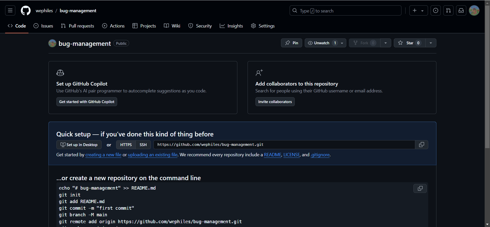

[TOC]

# 1、 今日概要

- 虚拟环境 虚拟环境 
- 项目框架 `local_settings.py`
- `git`应用（代码每天都提交）
- 通过`Python + sms`发送短信

# 2、 今日详细

## 2.1 虚拟环境

### 2.1.1 安装 `virtualenv`

...

### 2.1.2 创建虚拟环境

...

# 3、`local_settings.py`本地配置

每个人保留的自己的配置信息。

## 3.1 在`settings.py`中这样写

```python
# 配置local_settings.py
try:
    from .local_settings import *
except ImportError:
    pass

# 短信模板 -- 为了防止代码交给测试后测试不知道local_settings.py里面还缺少什么而导致出现问题
SMS = 0
```

## 3.2 创建我们自己的`local_settings.py`文件 -- `local_settings.py`放在和`setting.py`同一个目录

配置我们自己的设置信息。

```python
# 语言
LANGUAGE_CODE = "zh-hans"

# 短信模板
SMS = 666
```

## 3.3 给别人代码时

切记！！！不要给别人`local_settings.py`文件！！！

# 4、 写好程序怎么给别人发送过去

用`git`，不要直接打包给别人！！！

# 5、 公司开发规范和分享代码

在上传`git`的时候忽略`local_settings.py`

## 5.1 创建远程仓库



## 5.2 提交代码

- `git`要忽略一些文件 -- 使用`.gitignore` -- 在项目根目录下创建`.gitignore`文件

    ```.gitignore
    # pycharm:
    .idea/
    .DS_Store
    
    __pycache__
    *.py[cod]
    *.$py.class
    
    # Django stuff:
    local_settings.py
    *.sqlite3
    media/
    
    # database migratons:
    */migrations/*.py
    !*/migrations/__init__.py
    ```

    剩余的交给熟悉这些步骤的自己！

# 6、 补充内容--今日概要

- 腾讯云发送短信
- `Django`的`form`和`modelForm`
- `redis`
- 注册逻辑的设计
- 开发
- 讲解

## 6.1 腾讯云发送短信

-   注册
-   用户登录

```python
# settings.py
# ==========================================================
# ====================== 必须的配置信息 ======================
# ==========================================================

# 这里提示公司的测试人员需要哪些配置信息
APP_ID = 666666
APP_KEY = '6666666666666666'
SMS_SIGN = 'SIGN'

TENCENT_CLOUD_SMS_TEMPLATE = {
    'register': 666666,
    'login': 666666,
}

# ==========================================================
# ======================== 本地配置 =========================
# ==========================================================
try:
    from .local_settings import *
except:
    ...

```

```python
# local_settings.py
# 腾讯云短信相关配置 -- 这里是真正的配置
APP_ID = 123456
APP_KEY = 'dsjnf16aih5ews4dhund8d9'
SMS_SIGN = '瑾瑜'

TENCENT_CLOUD_SMS_TEMPLATE = {
    'register': 123456,
    'login': 123456,
}
```

```python
注意:真正发送短信的东西自己去腾讯云去看怎么发送短信。
```

## 6.2 通过`Python`代码实现将一个文件上传到腾讯对象存储中


