<h1 style="text-align: center;font-size: 40px; font-family: '楷体';">Python内存管理+垃圾回收</h1>

[TOC]

# 一、 内存管理机制

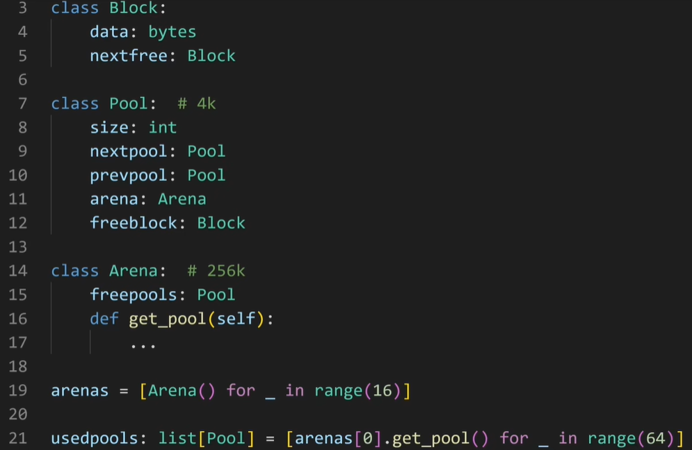

Python内存管理的层级：

- blobk：每一个block保存一个固定大小的数据

- pool：4k，和一个内存页一样大，每个pool里面都是相同大小的block -- 注意，一个pool和另外一个pool拥有的block的大小可能不一样大。但是在每一个pool的内部每个block是一样大的。因此，每一个pool是由一个size属性的，size用来说明这个pool里面的block的大小是多少。

- arena：256k，每一个arena里面有很多pool，但arena只记录还没有被使用的pool，而这个pool里面block的大小是在这个pool从没使用到转变成使用那一刻决定的。

Python刚开始运行的时候会建立一堆arena，一般16个，如果不够用了就会建立新的arena。userpools:一个保存着很多pool指针的数组，这个数组的index对应着这个pool里面的block的大小。

当向Python申请内存的时候，Python会首先判断你申请的内存是不是大于512byte，如果是，直接去用C的malloc，如果小于512byte，会先做一个内存对齐，接下来就回去对应的pool里面找一个block，比如你要22byte，那么Python会分配24个byte，这24个byte就在userpools里面的第3个pool--index为2的那个pool，而这个pool里面每一个block都是24个byte，可以从这个pool里面随便拿一个没有使用的block分配给你。

--------------------

```python
1. python是由C开发出来的
2. include    /    objects
3. 在Python中所有东西创建对象的时候，内部都会存储一些数据
4. 在创建对象的时候，如
    v = 0.3
源码内部：
    a.开辟内存
    b.初始化
        ob_fval = 0.3
        ob_type = float
        ob_refcnt = 1
    c.将对象加入到双向链表中 -- refchain
    
```

```C
#ifdef Py_TRACE_REFS
/* Define pointers to support a doubly-linked list of all live heap objects. */
#define _PyObject_HEAD_EXTRA            \
    PyObject *_ob_next;           \
    PyObject *_ob_prev;

#define _PyObject_EXTRA_INIT _Py_NULL, _Py_NULL,

#else
#  define _PyObject_HEAD_EXTRA
#  define _PyObject_EXTRA_INIT
#endif

/* PyObject_HEAD defines the initial segment of every PyObject. */
#define PyObject_HEAD                   PyObject ob_base;
```

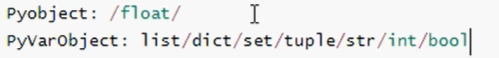


----------------

# 二、 垃圾回收机制

总结一句话：引用计数器为主，标记清除和分代回收为辅 + 缓存机制。

基于C语言源码底层，真正了解垃圾回收机制的实现。

- 引用计数器
- 标记清除
- 分代回收
- 缓存机制Python的C源码(3.8.2版本)

## 2.1 引用计数器

### 2.1.1 环状双向链表refchain、

Python中创建的任何对象都会加在这个refchain双向链表中。

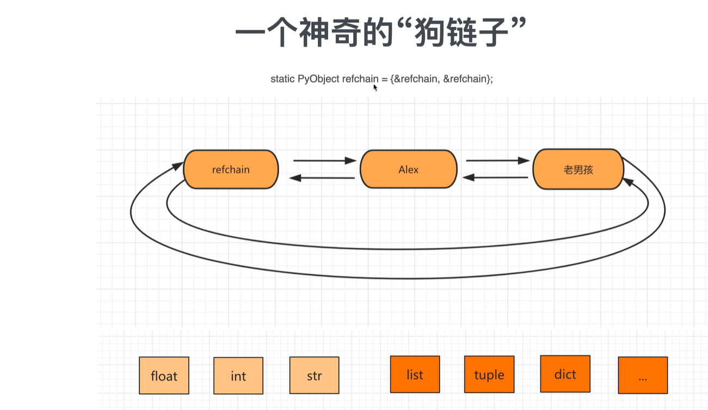

```python
name = "computer"
age = 18
hobby = ["篮球", "美女"]
```

```python
name = "computer"  # 内部会创建一些数据--类似于一个结构体【上一个对象，下一个对象，类型，引用的个数】
new = name  # 这时候引用的个数为2

age = 18 # 内部会创建一些数据--类似于一个结构体【上一个对象，下一个对象，类型，引用的个数，value=18】
...

hobby = ["篮球", "美女"]  # 内部会创建一些数据--类似于一个结构体【上一个对象，下一个对象，类型，引用的个数，items=元素，元素个数=2】
```

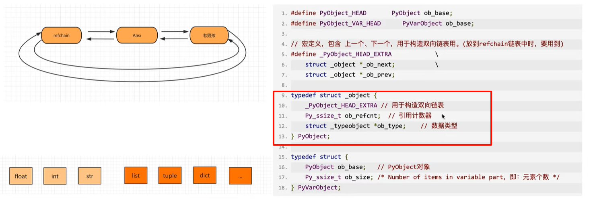

如上图，在C源码中，如何体现每个对象都有相同的值，PyObject结构体(四个值).

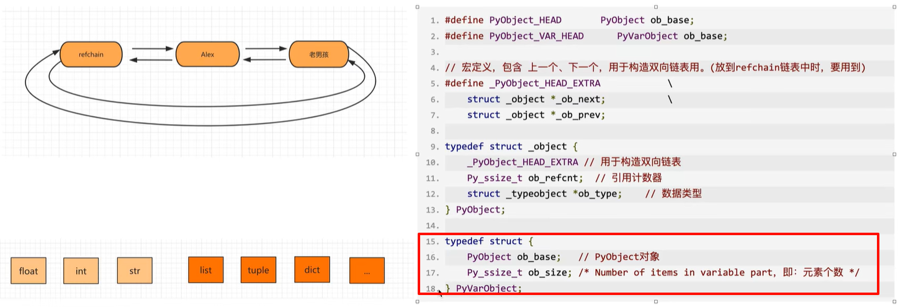

如上图，在C源码中体现多个元素组成的对象：PyObject结构体（四个值） + ob_size。

### 2.1.2 类型封装结构体

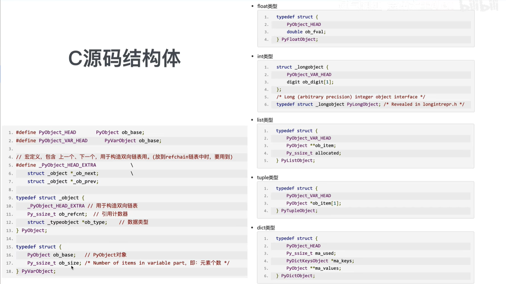

```python
data = 3.14  
# 内部会创建:
#    _ob_next = refchain中的上一个对象
#    _ob_prev = refchain中的下一个对象
#    ob_refcnt = 1
#    ob_type = float
#    ob_fval = 3.14
```

### 2.1.3 引用计数器

```python
v1 = 3.14
v2 = 999
v3 = (1, 2, 3)
```

当Python程序运行时，会根据数据类型的不同找到相应的结构体，根据结构体中的字段来进行创建相关的数据，然后将对象添加到refchain双向链表中。

在源码中，有两个关键的结构体:PyObject、PyValObject

每一个对象中有ob_refcnt就是引用计数器，值默认为1，当有其他变量引用对象时，引用计数器就会发生变化。

- 引用
    ```python
    a = 123
    b = a  # 引用计数器 + 1 此时引用计数器值为2
    ```

- 删除引用
    ```python
    a = 123
    b = a  # 引用计数器 + 1 此时值为2
    del b  # b变量删除 b对应对象的引用计数器 - 1 此时引用计数器值为1
    del a  # a变量删除 a对应对象的引用计数器 - 1 此时引用计数器值为0
    
    # 当一个对象的引用计数器为0时，意味着没有使用这个对象了，意味着这个对象是垃圾--就要回收
    # 回收：1. 将对象从refchain中拿走  2. 将对象进行销毁，归还内存
    ```

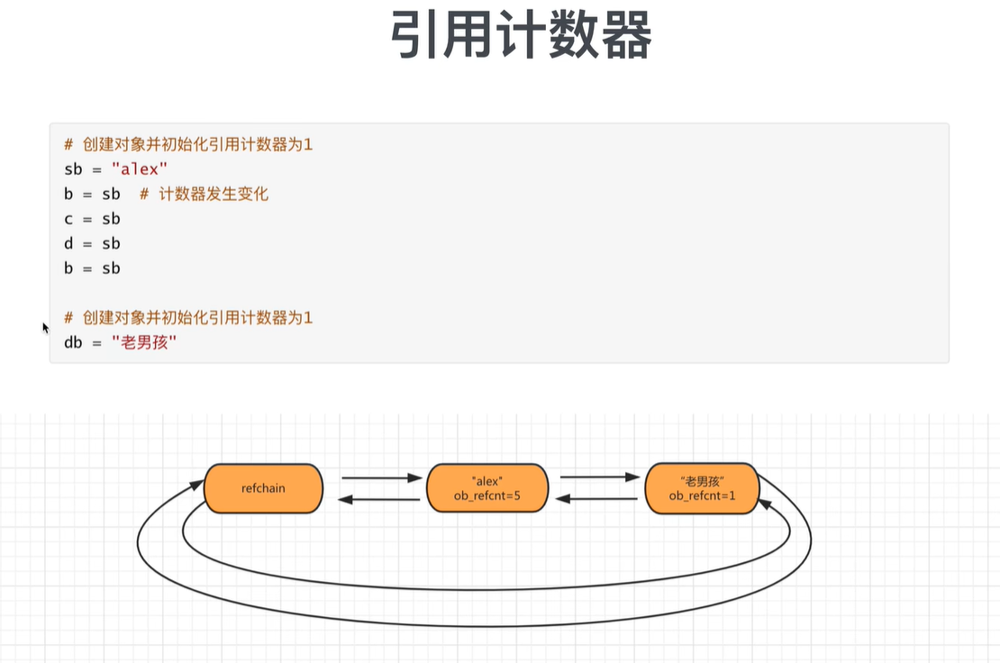

### 2.1.4 引用计数器的缺点/问题/bug -- 循环引用

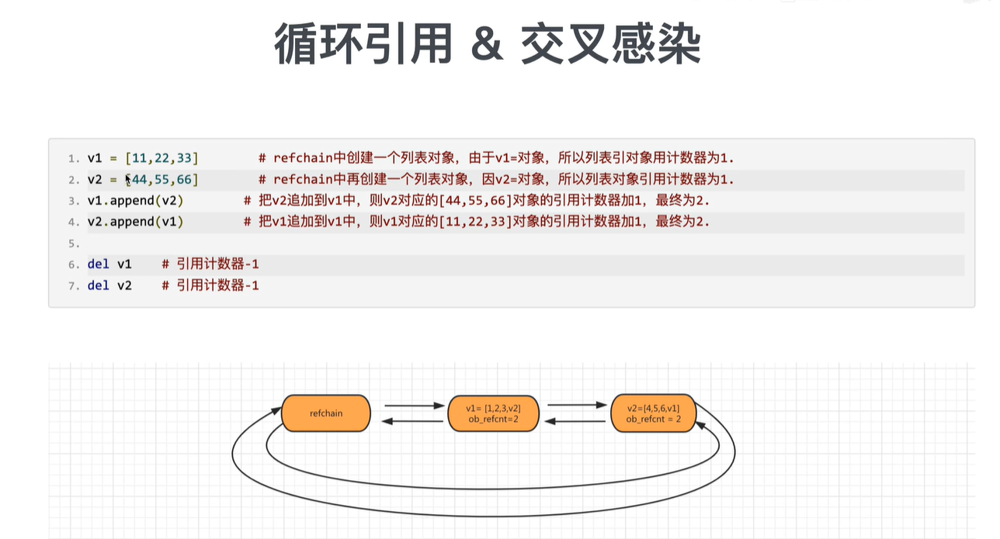

有个问题：如上图，v1.ppend(v2)的时候，`v1=[11, 22, 33, [44, 55, 66]]`，此时v2对应的这个列表就会有两个引用（一个是v2，另外一个是==v1的索引3==），如图中refchain显示的那样。

如上图，`v2.ppend(v1)`的时候，也会有同样的问题。

于是乎，两个对象的refchain中的引用计数器的值都为2.当del v1和 v2的时候，引用计数器都是变成1，但是按理来说，此时两者的引用都应该为0 -- 有bug。我们发现如果只用引用计数器来做垃圾回收 -- 会有循环引用的问题。

## 2.2 标记清除

为了解决引用计数器的循环引用的不足。

实现：在Python底层，再去维护一个链表，链表中专门放那些**可能存在循环引用的对象(list、tuple、dict、set)**

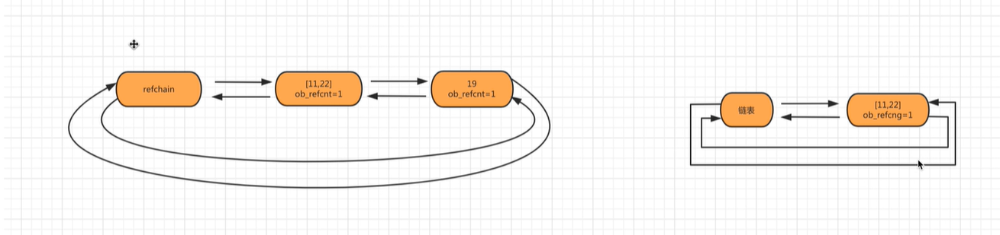

在Python内部，会在某种情况下触发 -- 会去扫描可能存在循环引用的链表中的每个元素，检查是否有循环引用，如果有，那么让双方的引用计数器各自-1，-1后如果是0，那么回收，如果不是0，那么不管。

问题：

- 什么时候扫描一次
- 可能存在循环引用的链表扫描的代价比较大，每次扫描耗时比较久

于是引入了一个新技术：分代回收

## 2.3 分代回收

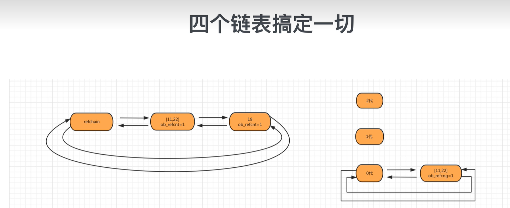

将可能存在循环引用的对象维护成三个链表：

- 0代：0代中对象个数达到700个扫描一次。第一次扫描如果是垃圾直接回收，如果不是那么直接放到1代
- 1代：0代扫描10次则1代扫描1次
- 2代：1代扫描10次则2代扫描1次

## 2.4 小结

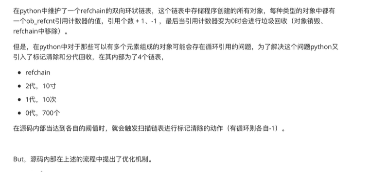

## 2.5 缓存

### 2.5.1 池(int类型、字符串类型)

为了避免重复创建和销毁一些常见的对象，维护了一个池。

```python
# 启动解释器的时候，会创建-5，-4， ...， 256
v1 = 7  # 不会开辟内存，直接去池中获取
v2 = 9  # 不会开辟内存，直接去池中获取 -- v2和v3是同一个内存地址
v3 = 9  # 不会开辟内存，直接去池中获取 -- v2和v3是同一个内存地址
```

### 2.5.2 `free_list(float/list/tuple/dict)`

当一个对象引用计数器为0时，按理说应该回收，而是将对象添加到`free_list`链表中，当缓存，以后创建对象时，不再重新开辟内存，而是直接使用`free_list`。

`free_list`有大小限制。

```python
v1 = 3.14  # 开辟内存 内部存储结构体中定义那几个值 并存到refchain中

del v1  # refchain中删除，如果缓冲池没满，将对象添加到free_list中

v3 = 333.33  # 不会重新开辟内存，去free_list中获取对象，对象内部数据初始化，再放到refchain中
```

元组相关的free_list：

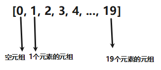

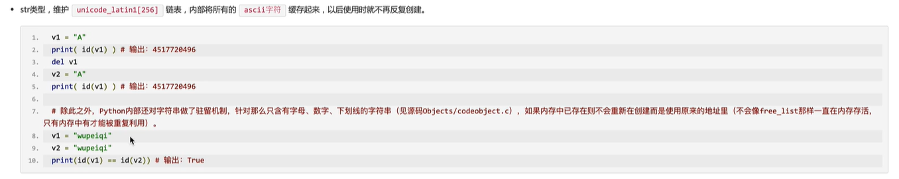


